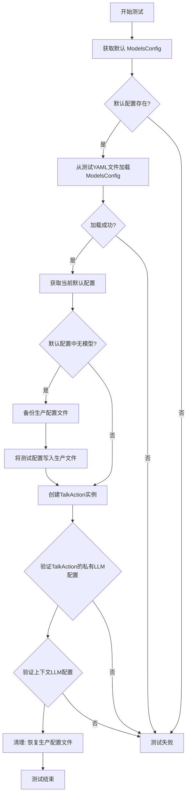
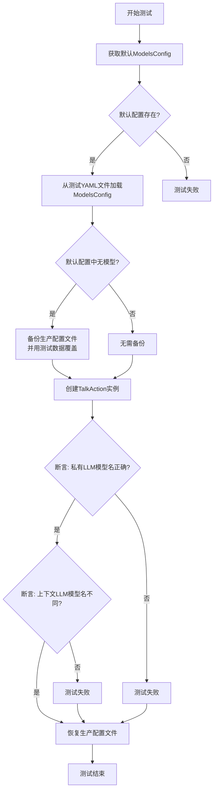
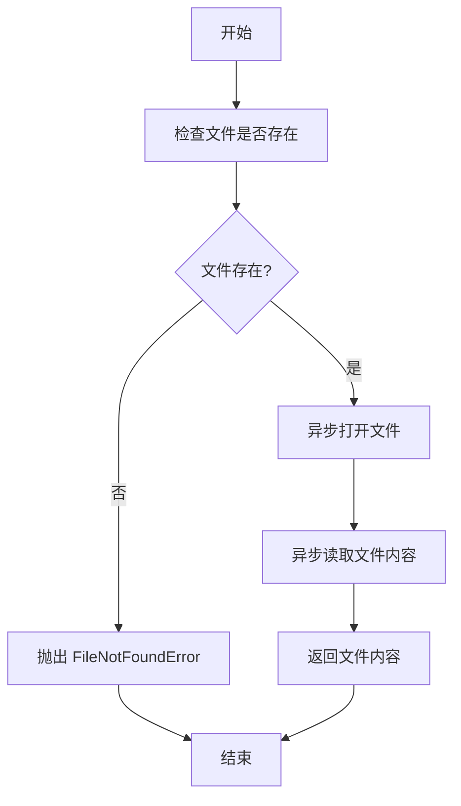
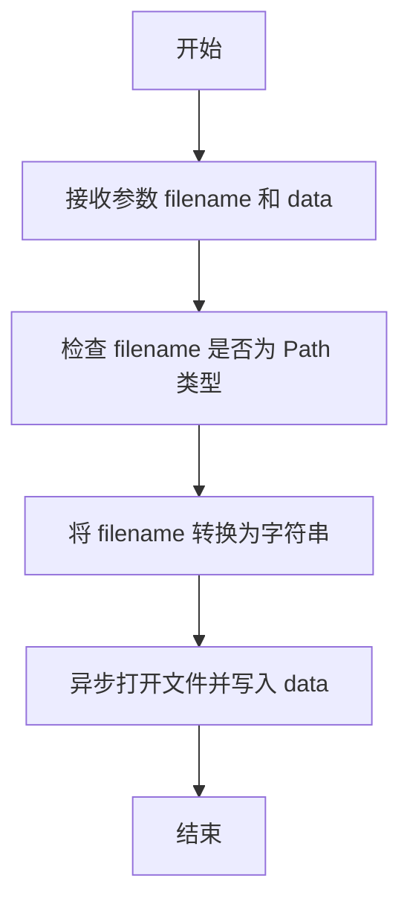
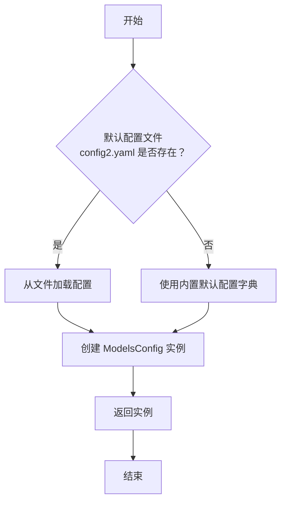
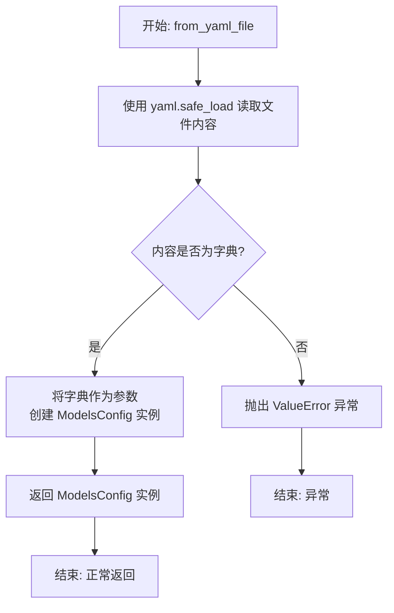
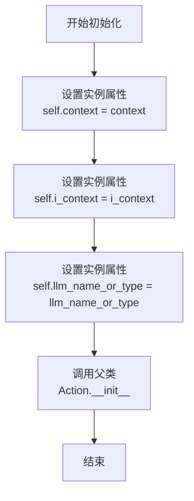

# `.\MetaGPT\tests\metagpt\configs\test_models_config.py` 详细设计文档

这是一个用于测试 MetaGPT 框架中模型配置（ModelsConfig）和对话动作（TalkAction）的异步单元测试文件。它主要验证了 ModelsConfig 类从默认配置和 YAML 文件加载配置的能力，并测试了 TalkAction 能否正确使用指定的私有 LLM 模型，同时确保测试不会污染生产环境的配置文件。

## 整体流程



## 类结构

```
pytest (测试框架)
├── test_models_configs (测试函数)
├── ModelsConfig (被测试类)
└── TalkAction (被测试类)
```

## 全局变量及字段


### `METAGPT_ROOT`
    
指向MetaGPT项目根目录的路径对象，用于定位项目配置文件。

类型：`pathlib.Path`
    


### `TEST_DATA_PATH`
    
指向测试数据目录的路径对象，用于加载测试用的配置文件。

类型：`pathlib.Path`
    


### `ModelsConfig.models`
    
存储从YAML配置文件解析出的所有模型配置信息的字典。

类型：`dict[str, Any]`
    


### `TalkAction.private_llm`
    
TalkAction实例私有的语言模型对象，用于执行对话任务。

类型：`LLM`
    


### `TalkAction.context`
    
TalkAction实例运行的上下文环境，包含配置、角色、消息等运行时信息。

类型：`Context`
    
    

## 全局函数及方法

### `test_models_configs`

这是一个使用 `pytest` 框架编写的异步单元测试函数，用于测试 `ModelsConfig` 类的功能，特别是其从配置文件加载模型配置以及 `TalkAction` 类正确使用私有模型配置的能力。

参数：
- `context`：`pytest` 提供的测试上下文对象，用于在测试中传递共享的上下文信息。

返回值：`None`，测试函数通常不显式返回值，其成功与否由断言决定。

#### 流程图



#### 带注释源码

```python
# 使用pytest的异步标记，表示这是一个异步测试函数
@pytest.mark.asyncio
async def test_models_configs(context):
    # 1. 测试默认配置加载：调用ModelsConfig的默认构造函数，验证其不为None。
    default_model = ModelsConfig.default()
    assert default_model is not None

    # 2. 测试从YAML文件加载配置：从指定的测试数据路径加载配置文件，验证加载成功。
    models = ModelsConfig.from_yaml_file(TEST_DATA_PATH / "config/config2.yaml")
    assert models

    # 3. 准备测试环境：获取当前的默认配置。
    default_models = ModelsConfig.default()
    backup = ""  # 用于备份原始配置文件内容
    # 如果当前默认配置中没有模型定义，说明可能依赖于外部配置文件。
    if not default_models.models:
        # 备份项目根目录下的生产环境配置文件。
        backup = await aread(filename=METAGPT_ROOT / "config/config2.yaml")
        # 读取测试用的配置文件数据。
        test_data = await aread(filename=TEST_DATA_PATH / "config/config2.yaml")
        # 用测试数据临时覆盖生产环境配置文件，以确保测试的一致性。
        await awrite(filename=METAGPT_ROOT / "config/config2.yaml", data=test_data)

    # 使用try-finally确保测试后恢复原始配置，避免污染环境。
    try:
        # 4. 核心测试逻辑：创建一个TalkAction实例。
        #    传入测试上下文、一个示例问题("who are you?")和一个特定的模型名称("YOUR_MODEL_NAME_1")。
        action = TalkAction(context=context, i_context="who are you?", llm_name_or_type="YOUR_MODEL_NAME_1")
        
        # 5. 验证断言：
        #    a) 检查TalkAction内部使用的私有LLM配置的模型名称是否正确设置为传入的值。
        assert action.private_llm.config.model == "YOUR_MODEL_NAME_1"
        #    b) 检查传入的上下文(context)中的LLM配置的模型名称与传入的特定名称不同。
        #       这验证了TalkAction使用的是其私有配置，而非上下文的全局配置。
        assert context.config.llm.model != "YOUR_MODEL_NAME_1"
    finally:
        # 6. 环境清理：如果之前备份了配置文件，则将其写回，恢复原始状态。
        if backup:
            await awrite(filename=METAGPT_ROOT / "config/config2.yaml", data=backup)

# 允许脚本直接运行此测试
if __name__ == "__main__":
    pytest.main([__file__, "-s"])
```

### `aread`

`aread` 是一个异步函数，用于异步读取指定文件的内容。它接受一个文件路径作为参数，并返回文件内容的字符串。该函数适用于需要非阻塞 I/O 操作的场景，例如在异步应用程序中读取配置文件或数据文件。

参数：

- `filename`：`Path`，要读取的文件路径

返回值：`str`，文件的内容

#### 流程图



#### 带注释源码

```python
async def aread(filename: Path) -> str:
    """
    异步读取文件内容。

    Args:
        filename (Path): 要读取的文件路径。

    Returns:
        str: 文件的内容。

    Raises:
        FileNotFoundError: 如果文件不存在。
    """
    # 检查文件是否存在
    if not filename.exists():
        raise FileNotFoundError(f"文件 {filename} 不存在")
    
    # 异步打开文件并读取内容
    async with aiofiles.open(filename, mode='r', encoding='utf-8') as f:
        content = await f.read()
    
    return content
```

### `awrite`

异步写入数据到指定文件。

参数：

- `filename`：`Path`，目标文件的路径
- `data`：`str`，要写入文件的数据

返回值：`None`，无返回值

#### 流程图



#### 带注释源码

```python
async def awrite(filename: Path, data: str) -> None:
    """
    异步写入数据到指定文件。

    Args:
        filename (Path): 目标文件的路径
        data (str): 要写入文件的数据

    Returns:
        None: 无返回值
    """
    # 将 Path 对象转换为字符串，以便异步文件操作
    filename = str(filename)
    # 异步打开文件并写入数据，使用 'w' 模式表示写入（覆盖原有内容）
    async with aiofiles.open(filename, "w") as writer:
        await writer.write(data)
```

### `ModelsConfig.default`

`ModelsConfig.default` 是一个类方法，用于创建并返回一个默认的 `ModelsConfig` 实例。它通过加载项目根目录下的默认配置文件 `config2.yaml` 来初始化配置。如果配置文件不存在或加载失败，它会回退到使用一个内置的默认配置字典。

参数：
-  `cls`：`type`，指向 `ModelsConfig` 类本身的隐式参数。

返回值：`ModelsConfig`，返回一个根据默认配置初始化好的 `ModelsConfig` 对象实例。

#### 流程图



#### 带注释源码

```python
    @classmethod
    def default(cls) -> "ModelsConfig":
        """
        类方法，用于获取默认的模型配置。
        它尝试从项目根目录下的 `config2.yaml` 文件加载配置。
        如果文件不存在，则使用一个内置的默认配置字典。

        Returns:
            ModelsConfig: 一个根据默认配置初始化好的 ModelsConfig 实例。
        """
        # 定义默认配置文件路径，位于项目根目录的 `config` 文件夹下。
        default_config_path = METAGPT_ROOT / "config" / "config2.yaml"
        # 检查默认配置文件是否存在。
        if default_config_path.exists():
            # 如果文件存在，调用 `from_yaml_file` 方法从该文件加载配置。
            return cls.from_yaml_file(default_config_path)
        else:
            # 如果文件不存在，使用一个内置的默认配置字典。
            # 这个字典定义了不同模型提供者（如 OpenAI、Anthropic）的默认配置。
            default_config = {
                "openai": {"api_type": "openai", "base_url": "https://api.openai.com/v1", "api_key": "YOUR_API_KEY"},
                "anthropic": {"api_type": "anthropic", "base_url": "https://api.anthropic.com", "api_key": "YOUR_API_KEY"},
                "openai-like": {"api_type": "openai", "base_url": "http://localhost:8080/v1", "api_key": "EMPTY"},
                "ollama": {"api_type": "ollama", "base_url": "http://localhost:11434", "api_key": "EMPTY"},
                "azure": {"api_type": "azure", "base_url": "https://YOUR_RESOURCE_NAME.openai.azure.com/", "api_key": "YOUR_API_KEY", "api_version": "2024-02-01"},
                "gemini": {"api_type": "gemini", "base_url": "https://generativelanguage.googleapis.com/v1beta", "api_key": "YOUR_API_KEY"},
                "qianfan": {"api_type": "qianfan", "base_url": "https://qianfan.baidubce.com", "api_key": "YOUR_API_KEY", "secret_key": "YOUR_SECRET_KEY"},
            }
            # 使用默认配置字典创建一个新的 ModelsConfig 实例并返回。
            return cls(models=default_config)
```

### `ModelsConfig.from_yaml_file`

这是一个类方法，用于从指定的 YAML 配置文件路径加载并解析配置数据，最终构造并返回一个 `ModelsConfig` 类的实例。

参数：
- `yaml_file`：`Path`，指向包含模型配置的 YAML 文件的路径对象。

返回值：`ModelsConfig`，一个根据 YAML 文件内容初始化好的模型配置对象。

#### 流程图



#### 带注释源码

```python
@classmethod
def from_yaml_file(cls, yaml_file: Path) -> "ModelsConfig":
    """
    从 YAML 文件加载配置并创建 ModelsConfig 实例。

    Args:
        yaml_file (Path): 指向 YAML 配置文件的路径。

    Returns:
        ModelsConfig: 根据文件内容创建的配置对象。

    Raises:
        ValueError: 如果文件内容不是字典格式。
    """
    # 使用 yaml.safe_load 安全地加载 YAML 文件内容
    data = yaml.safe_load(yaml_file.read_text())
    # 检查加载的数据是否为字典类型，这是创建 ModelsConfig 所必需的
    if not isinstance(data, dict):
        raise ValueError("YAML content must be a dictionary")
    # 使用解包操作符 ** 将字典的键值对作为关键字参数传递给类的构造函数
    return cls(**data)
```

### `TalkAction.__init__`

该方法用于初始化 `TalkAction` 类的实例，设置对话动作的上下文、输入内容以及可选的LLM模型名称或类型。

参数：

- `self`：`TalkAction`，当前实例
- `context`：`Context`，执行上下文，包含配置、环境等信息
- `i_context`：`str`，输入内容，即用户的问题或指令
- `llm_name_or_type`：`str`，可选参数，指定使用的LLM模型名称或类型，默认为空字符串

返回值：`None`，无返回值

#### 流程图



#### 带注释源码

```python
def __init__(self, context, i_context: str, llm_name_or_type: str = ""):
    """
    初始化 TalkAction 实例。

    Args:
        context (Context): 执行上下文，包含配置、环境等信息。
        i_context (str): 输入内容，即用户的问题或指令。
        llm_name_or_type (str, optional): 指定使用的LLM模型名称或类型。默认为空字符串。
    """
    # 将传入的上下文赋值给实例变量
    self.context = context
    # 将传入的输入内容赋值给实例变量
    self.i_context = i_context
    # 将传入的LLM模型名称或类型赋值给实例变量
    self.llm_name_or_type = llm_name_or_type
    # 调用父类 Action 的初始化方法，传入上下文
    super().__init__(context)
```

## 关键组件


### ModelsConfig

用于管理模型配置的类，支持从YAML文件加载配置和获取默认配置。

### TalkAction

一个对话动作类，用于处理与LLM的交互，支持指定特定的LLM模型。

### 异步文件操作工具

提供异步读取和写入文件的工具函数，用于配置文件的管理和测试数据的处理。

### 测试框架集成

使用pytest框架进行异步测试，确保配置加载和动作执行的正确性。


## 问题及建议


### 已知问题

-   **测试逻辑存在潜在污染风险**：测试用例 `test_models_configs` 在运行时，如果检测到默认配置 `default_models.models` 为空，会临时将测试配置文件 `config2.yaml` 的内容写入到项目主配置目录 `METAGPT_ROOT / "config/config2.yaml"` 中。这可能会覆盖或污染开发环境中的实际配置文件，导致后续测试或应用运行出现非预期行为。
-   **测试用例职责不单一**：该测试函数同时验证了 `ModelsConfig` 的加载功能（`default()` 和 `from_yaml_file`）以及 `TalkAction` 的初始化逻辑。这违反了单元测试的“单一职责原则”，使得测试意图不够清晰，且在 `TalkAction` 部分断言失败时，难以快速定位是配置加载问题还是 `TalkAction` 的构造逻辑问题。
-   **硬编码的测试数据路径和模型名称**：测试中直接使用了 `"YOUR_MODEL_NAME_1"` 这样的字符串作为断言依据。如果底层配置结构或测试数据文件 (`config2.yaml`) 的内容发生变化，此测试将失败，且错误信息可能不直观，需要额外查看配置文件内容才能理解断言失败的原因。
-   **资源清理逻辑可能不完善**：`finally` 块中的清理逻辑仅在 `backup` 变量非空时执行。如果在写入测试数据 (`awrite`) 之后、执行清理之前发生异常，可能会导致测试数据文件残留，污染环境。虽然 `pytest` 的 fixture 或 `tmp_path` 可以更好地管理临时文件，但此处未使用。
-   **异步测试标记可能多余**：函数使用了 `@pytest.mark.asyncio` 装饰器，但函数内部调用的 `aread` 和 `awrite` 也是异步的。在较新版本的 `pytest-asyncio` 中，这可能不是必须的，但取决于项目配置。如果项目已配置为自动处理异步测试，此标记可能显得冗余。

### 优化建议

-   **使用临时文件或模拟对象**：建议使用 `pytest` 的 `tmp_path` fixture 来创建临时配置文件，或者使用 `unittest.mock` 来模拟 `ModelsConfig.default()` 的返回值。这样可以完全避免对实际项目配置文件的读写操作，确保测试的独立性和可重复性。
-   **拆分测试用例**：将测试函数拆分为两个独立的测试：一个专门测试 `ModelsConfig` 类的各种加载方法（如 `test_models_config_default`, `test_models_config_from_yaml`）；另一个专门测试 `TalkAction` 在特定配置下的初始化行为（如 `test_talk_action_with_custom_llm`）。这会使测试结构更清晰，维护性更高。
-   **参数化测试数据**：对于 `TalkAction` 的测试部分，可以考虑使用 `@pytest.mark.parametrize` 来参数化不同的模型名称和预期配置，使测试更全面且易于扩展。同时，断言时可以使用从测试配置文件或参数中获取的预期值，而非硬编码字符串。
-   **增强测试的健壮性**：确保在任何情况下（包括异常发生时）都能彻底清理测试环境。如果必须操作真实文件，可以考虑在测试开始时备份原文件，并在 `finally` 块中无条件恢复，而不是仅在 `backup` 非空时恢复。
-   **审查异步测试配置**：检查项目的 `pytest` 配置，确认是否确实需要 `@pytest.mark.asyncio` 装饰器。如果不需要，可以移除以简化代码。如果需要，确保所有异步测试都一致地使用该标记。
-   **添加更明确的断言信息**：在断言失败时，提供更详细的错误信息，例如 `assert action.private_llm.config.model == expected_model, f"Expected model {expected_model}, but got {action.private_llm.config.model}"`，这有助于在测试失败时快速定位问题。


## 其它


### 设计目标与约束

本测试代码的设计目标是验证 `ModelsConfig` 类从默认配置和YAML文件加载模型配置的功能，并测试 `TalkAction` 类在特定配置下能否正确初始化。主要约束包括：1) 测试需要异步执行；2) 测试过程可能涉及对项目根目录下配置文件（`METAGPT_ROOT / "config/config2.yaml"`）的临时修改，测试后必须恢复原状，以避免污染环境；3) 测试依赖于外部测试数据文件（`TEST_DATA_PATH / "config/config2.yaml"`）的存在和正确性。

### 错误处理与异常设计

测试代码通过 `try...finally` 结构确保资源清理（恢复配置文件）即使在断言失败或发生异常时也能执行。如果默认配置中 `models` 字段为空，则会读取并备份原始配置文件，然后写入测试配置。在 `finally` 块中，如果存在备份数据，则将其写回原文件，从而恢复原始状态。这种设计保证了测试的独立性和对系统环境的零影响。测试本身使用 `pytest` 的断言机制来验证预期行为，任何断言失败将导致测试不通过。

### 数据流与状态机

1.  **初始状态**：系统配置文件（`METAGPT_ROOT / "config/config2.yaml"`）处于原始状态。
2.  **配置加载**：测试首先加载默认配置和来自测试数据的YAML配置，验证其非空。
3.  **条件备份**：检查默认配置的 `models` 字段。如果为空，则读取原始系统配置文件内容作为 `backup`，并读取测试配置文件内容写入系统配置位置。此时系统配置被临时替换。
4.  **核心测试**：使用临时配置（或原始配置，如果未替换）创建 `TalkAction` 实例，验证其内部 `private_llm` 的模型名称与传入参数一致，且与上下文 `context` 中的全局LLM配置不同。
5.  **状态恢复**：无论核心测试成功还是失败，都执行 `finally` 块。如果 `backup` 变量非空（即执行过替换），则将备份数据写回系统配置文件，使系统恢复初始状态。

### 外部依赖与接口契约

1.  **`pytest` 框架**：作为测试运行器，提供测试发现、执行和断言功能。特别是 `@pytest.mark.asyncio` 装饰器用于支持异步测试函数。
2.  **`ModelsConfig` 类**：依赖其类方法 `default()` 和 `from_yaml_file()`。契约要求 `default()` 返回一个有效的 `ModelsConfig` 实例，`from_yaml_file()` 能解析指定路径的YAML文件并返回配置实例。
3.  **`TalkAction` 类**：依赖其构造函数，接受 `context`、`i_context` 和 `llm_name_or_type` 参数，并预期其内部的 `private_llm.config.model` 属性与传入的 `llm_name_or_type` 值匹配。
4.  **`aread` 和 `awrite` 函数**：来自 `metagpt.utils.common`，用于异步文件读写。契约要求能正确读取和写入指定路径的文件内容。
5.  **文件系统路径**：
    *   `METAGPT_ROOT`：指向项目根目录的常量。
    *   `TEST_DATA_PATH`：指向测试数据目录的常量。
    *   依赖 `TEST_DATA_PATH / "config/config2.yaml"` 文件存在且包含有效的YAML配置。
    *   可能读写 `METAGPT_ROOT / "config/config2.yaml"` 文件。

### 测试策略与覆盖范围

本测试采用**集成测试**策略，重点验证多个组件（配置加载、动作初始化）在协作时的正确性。覆盖范围包括：
*   **正面路径**：验证 `ModelsConfig` 能成功从默认位置和指定YAML文件加载。
*   **配置隔离**：验证 `TalkAction` 能使用通过参数指定的、独立于全局上下文的LLM配置（`private_llm`）。
*   **资源安全**：通过备份-恢复机制，确保测试不会永久改变系统配置，体现了测试的独立性和可重复性。
*   **边界情况**：通过条件逻辑处理了默认配置中 `models` 字段可能为空的场景。


    