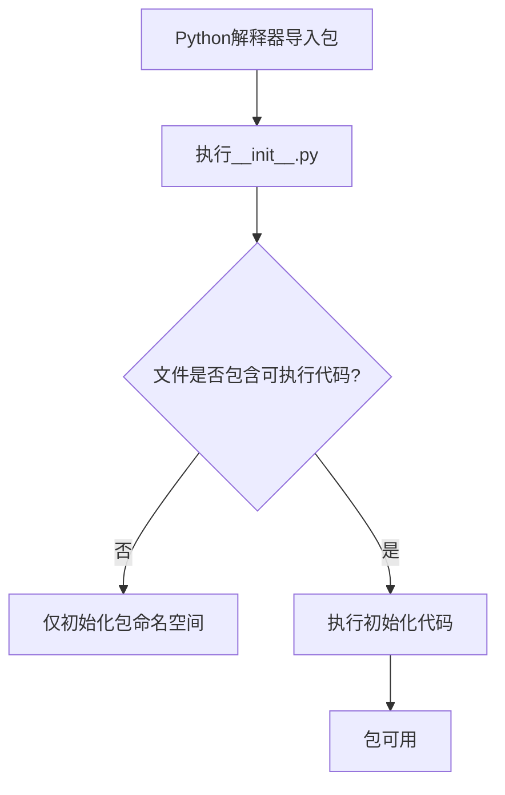

# `.\MetaGPT\tests\metagpt\document_store\__init__.py` 详细设计文档

该文件是一个Python包的初始化文件，通常用于定义包的公共接口、导入关键模块或执行包的初始化代码。然而，当前文件内容为空，仅包含文件头注释，表明这是一个占位符或待开发的包入口点。

## 整体流程



## 类结构

```
无类层次结构
```

## 全局变量及字段


    

## 全局函数及方法


## 关键组件


### 初始化模块

此文件是一个Python包的初始化模块（__init__.py），用于定义包的公共接口和初始化逻辑。当前版本为空，表明该包可能处于开发初期，或者其功能完全由包内的其他模块提供。


## 问题及建议


### 已知问题

-   **空文件问题**：当前 `__init__.py` 文件为空，仅包含元信息注释。这通常意味着该包（或模块）尚未定义任何公开的接口、类或函数，可能导致导入该包时无法明确其功能或可用的组件。
-   **缺乏文档**：文件顶部的文档字符串仅包含自动生成的元数据（时间、作者、文件名），缺少对该模块或包的目的、功能和用法的描述，降低了代码的可读性和可维护性。
-   **潜在的包结构不明确**：一个空的 `__init__.py` 文件可能表明包的内部结构尚未规划清晰，或者开发者打算将其作为命名空间包但未采用相应标准。

### 优化建议

-   **明确包导出的内容**：如果这是一个常规包，应在 `__init__.py` 中通过 `__all__` 列表明确指定从该包导入 `*` 时可访问的模块、类或函数。或者，可以在此文件中导入并公开关键的类或函数，以简化用户的使用方式（例如 `from mypackage import MyClass`）。
-   **补充功能描述文档**：在文件顶部添加详细的模块级文档字符串，说明该包的核心职责、主要提供的组件以及基本的使用示例。这将极大帮助其他开发者理解和使用此代码。
-   **评估包类型的必要性**：如果此目录仅作为子模块的容器，且不需要在 `__init__.py` 中初始化任何代码或定义 `__all__`，可考虑保持为空。但更佳实践是至少添加一个简短的文档字符串。如果意图是创建命名空间包（Python 3.3+），则应完全移除 `__init__.py` 文件。
-   **遵循项目一致性**：检查项目中其他 `__init__.py` 文件的模式和标准，确保本文件与整体项目结构保持一致。


## 其它


### 设计目标与约束

该代码文件是一个包的初始化文件（`__init__.py`），其主要设计目标是定义Python包的命名空间，并可能包含包的版本信息、作者信息、以及导入包内关键模块以简化外部调用。约束包括遵循Python的包结构规范，确保文件轻量，避免在初始化时执行耗时或可能失败的操作。

### 错误处理与异常设计

当前文件为空，不包含任何显式的错误处理或异常抛出逻辑。作为包的入口点，其设计应保持简单和稳定，避免引入运行时错误。任何复杂的初始化或错误处理应推迟到包内具体模块被导入或使用时。

### 数据流与状态机

由于此文件仅用于定义包结构，不包含业务逻辑，因此不存在数据流或状态机。它不处理任何输入数据，也不维护任何内部状态。

### 外部依赖与接口契约

此文件本身没有外部依赖。它定义了`__all__`列表（如果存在）作为包的公共接口契约，明确指明哪些模块或对象可以从包顶层直接导入。当前文件未定义`__all__`，意味着包内所有不以下划线开头的名称都可能被导出，但这依赖于Python的默认行为。

### 安全考虑

作为初始化脚本，当前文件不涉及任何安全敏感操作，如文件读写、网络请求或命令执行。保持其内容简单是避免安全风险的最佳实践。未来若需在此执行代码，应进行严格的安全审查。

### 测试策略

对于空的`__init__.py`文件，通常无需编写特定单元测试。测试重点应放在包内具体模块的功能上。如果未来在此文件中添加了逻辑（如版本变量、导入语句），则应补充相应的测试用例，验证包能正确初始化和导出预期的名称。

### 部署与配置

此文件是Python包的标准组成部分，部署时需确保其存在于包的根目录下。它无需任何特定配置。其存在本身即是配置，用于告知Python解释器该目录应被视为一个包。

### 日志与监控

当前文件不包含任何日志记录或监控逻辑。包级别的日志配置通常在其他模块或项目根配置中完成。

    