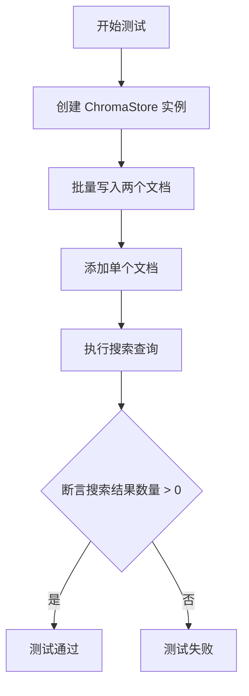
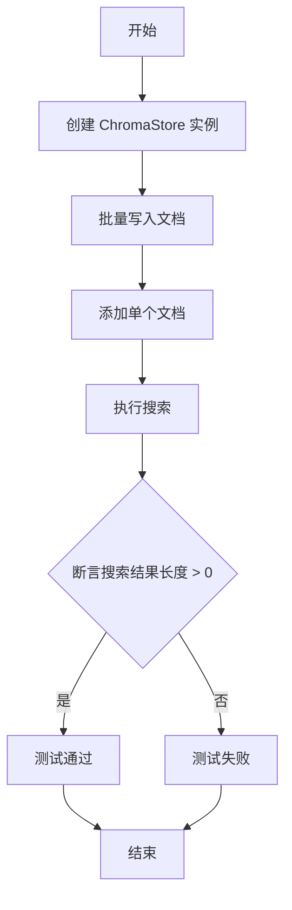
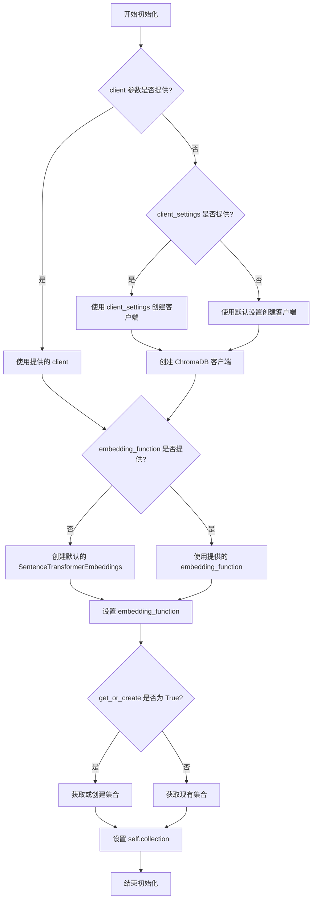
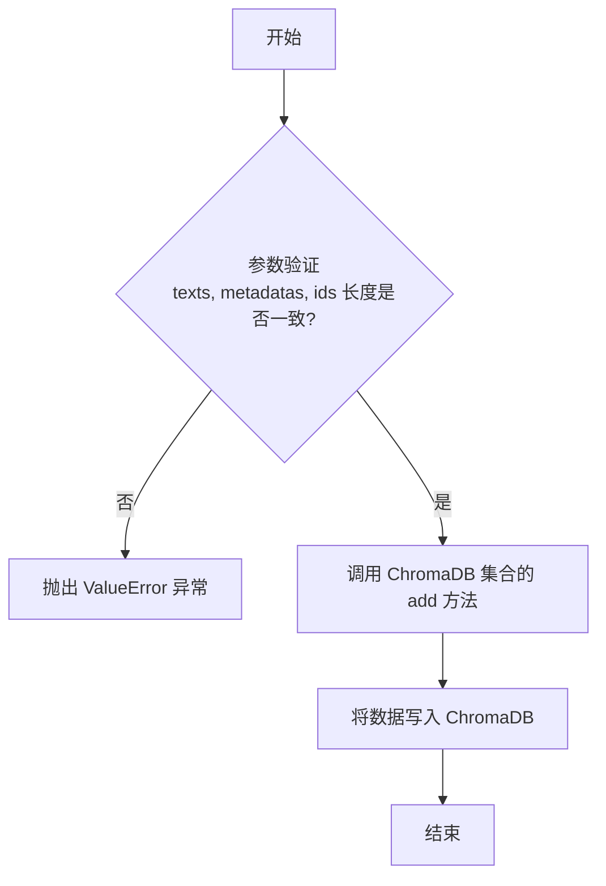
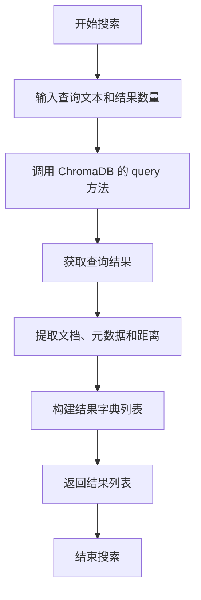

# `.\MetaGPT\tests\metagpt\document_store\test_chromadb_store.py` 详细设计文档

该文件是一个针对 ChromaStore 文档存储类的单元测试。它通过创建实例、写入文档、添加单个文档以及执行搜索查询，来验证 ChromaStore 的基本功能（如文档的增、查）是否正常工作。

## 整体流程



## 类结构

```
ChromaStore (被测试类)
└── 方法: __init__, write, add, search
```

## 全局变量及字段


### `document_store`
    
ChromaStore 类的实例，用于文档的存储、添加和搜索操作。

类型：`ChromaStore`
    


### `results`
    
存储搜索结果的列表，包含与查询文档相关的文档信息。

类型：`list`
    


    

## 全局函数及方法

### `test_chroma_store`

这是一个用于测试 `ChromaStore` 类功能的函数。它创建了一个 `ChromaStore` 实例，向其添加文档，并执行搜索操作以验证其基本功能。

参数：
- 无显式参数。

返回值：`None`，此函数不返回任何值，主要用于执行测试断言。

#### 流程图



#### 带注释源码

```python
# @pytest.mark.skip()  # 这是一个 pytest 的装饰器，用于跳过此测试。当前被注释掉，意味着测试会运行。
def test_chroma_store():
    """FIXME：chroma使用感觉很诡异，一用Python就挂，测试用例里也是"""
    # 创建 ChromaStore 实例，使用 'sample_collection_1' 集合，如果不存在则创建
    document_store = ChromaStore("sample_collection_1", get_or_create=True)

    # 使用 write 方法批量添加多个文档及其元数据和ID
    document_store.write(
        ["This is document1", "This is document2"],  # 文档内容列表
        [{"source": "google-docs"}, {"source": "notion"}],  # 对应的元数据列表
        ["doc1", "doc2"]  # 对应的文档ID列表
    )

    # 使用 add 方法添加单个文档及其元数据和ID
    document_store.add("This is document3",  # 文档内容
                       {"source": "notion"},  # 文档元数据
                       "doc3")  # 文档ID

    # 使用 search 方法搜索与查询文本最相关的文档，返回前3个结果
    results = document_store.search("This is a query document", n_results=3)
    # 断言搜索结果列表的长度大于0，确保搜索功能正常工作
    assert len(results) > 0
```

### `ChromaStore.__init__`

初始化 ChromaStore 实例，设置集合名称、持久化路径、客户端配置等参数，并连接到 ChromaDB 数据库或创建新的集合。

参数：

- `collection_name`：`str`，要创建或连接的集合名称
- `persist_path`：`str`，持久化存储路径，默认为 `"./chroma"`，用于保存 ChromaDB 数据
- `get_or_create`：`bool`，如果为 True，当集合不存在时创建新集合；如果为 False，仅连接现有集合，默认为 True
- `embedding_function`：`Optional[Embeddings]`，可选的嵌入函数，用于文档向量化，默认为 None（使用默认的 SentenceTransformerEmbeddings）
- `collection_metadata`：`Optional[Dict]`，可选的集合元数据，用于配置集合属性，默认为 None
- `client_settings`：`Optional[Settings]`，可选的 ChromaDB 客户端设置，用于自定义连接配置，默认为 None
- `client`：`Optional[chromadb.Client]`，可选的 ChromaDB 客户端实例，用于复用现有客户端，默认为 None

返回值：`None`，无返回值

#### 流程图



#### 带注释源码

```python
def __init__(
    self,
    collection_name: str,
    persist_path: str = "./chroma",
    get_or_create: bool = True,
    embedding_function: Optional[Embeddings] = None,
    collection_metadata: Optional[Dict] = None,
    client_settings: Optional[Settings] = None,
    client: Optional[chromadb.Client] = None,
):
    """
    初始化 ChromaStore 实例。

    Args:
        collection_name (str): 要创建或连接的集合名称。
        persist_path (str, optional): 持久化存储路径，默认为 "./chroma"。
        get_or_create (bool, optional): 如果为 True，当集合不存在时创建新集合；如果为 False，仅连接现有集合，默认为 True。
        embedding_function (Optional[Embeddings], optional): 可选的嵌入函数，用于文档向量化，默认为 None。
        collection_metadata (Optional[Dict], optional): 可选的集合元数据，用于配置集合属性，默认为 None。
        client_settings (Optional[Settings], optional): 可选的 ChromaDB 客户端设置，用于自定义连接配置，默认为 None。
        client (Optional[chromadb.Client], optional): 可选的 ChromaDB 客户端实例，用于复用现有客户端，默认为 None。
    """
    # 如果没有提供客户端实例，则根据设置创建新的客户端
    if client is None:
        if client_settings:
            # 使用提供的客户端设置创建客户端
            self._client_settings = client_settings
            self._client = chromadb.Client(self._client_settings)
        else:
            # 使用默认持久化路径创建客户端
            self._client_settings = Settings(persist_directory=persist_path, is_persistent=True)
            self._client = chromadb.Client(self._client_settings)
    else:
        # 使用提供的客户端实例
        self._client = client

    # 如果没有提供嵌入函数，则使用默认的 SentenceTransformerEmbeddings
    if embedding_function is None:
        self._embedding_function = SentenceTransformerEmbeddings()
    else:
        self._embedding_function = embedding_function

    # 根据 get_or_create 参数获取或创建集合
    if get_or_create:
        # 获取或创建集合，如果集合不存在则创建新集合
        self.collection = self._client.get_or_create_collection(
            name=collection_name,
            embedding_function=self._embedding_function.embed_documents,
            metadata=collection_metadata,
        )
    else:
        # 仅获取现有集合，如果集合不存在则抛出异常
        self.collection = self._client.get_collection(
            name=collection_name,
            embedding_function=self._embedding_function.embed_documents,
        )
```

### `ChromaStore.write`

该方法用于向 ChromaDB 集合中批量写入文档及其关联的元数据和唯一标识符。

参数：

- `texts`：`List[str]`，要存储的文档文本内容列表。
- `metadatas`：`List[Dict[str, Any]]`，与每个文档关联的元数据字典列表。
- `ids`：`List[str]`，每个文档的唯一标识符列表。

返回值：`None`，该方法不返回任何值，其作用是将数据持久化到 ChromaDB 中。

#### 流程图



#### 带注释源码

```python
def write(self, texts: List[str], metadatas: List[Dict[str, Any]], ids: List[str]) -> None:
    """
    将文档及其元数据和ID写入到ChromaDB集合中。
    
    参数:
        texts: 要存储的文档文本列表。
        metadatas: 与每个文档关联的元数据字典列表。
        ids: 每个文档的唯一标识符列表。
    
    异常:
        ValueError: 如果texts、metadatas和ids的长度不一致。
    """
    # 参数验证：确保三个输入列表的长度一致
    if not (len(texts) == len(metadatas) == len(ids)):
        raise ValueError("Lengths of texts, metadatas, and ids must match.")
    
    # 调用底层的ChromaDB集合对象的add方法执行批量写入操作
    self._collection.add(
        documents=texts,  # 文档内容
        metadatas=metadatas,  # 文档元数据
        ids=ids  # 文档唯一ID
    )
```

### `ChromaStore.add`

该方法用于向 ChromaDB 集合中添加单个文档及其关联的元数据和 ID。

参数：

- `document`：`str`，要添加的文档文本内容。
- `metadata`：`dict`，与文档关联的元数据字典。
- `doc_id`：`str`，文档的唯一标识符。

返回值：`None`，该方法不返回任何值，其作用是将文档持久化到数据库中。

#### 流程图

```mermaid
graph TD
    A[开始: add(document, metadata, doc_id)] --> B{参数检查: <br>document 是否为字符串?};
    B -- 否 --> C[抛出 ValueError 异常];
    B -- 是 --> D{参数检查: <br>metadata 是否为字典?};
    D -- 否 --> C;
    D -- 是 --> E{参数检查: <br>doc_id 是否为字符串?};
    E -- 否 --> C;
    E -- 是 --> F[调用内部方法 _add: <br>_add([document], [metadata], [doc_id])];
    F --> G[结束];
```

#### 带注释源码

```python
def add(self, document: str, metadata: dict, doc_id: str):
    """
    向集合中添加单个文档。
    
    参数:
        document (str): 要添加的文档文本。
        metadata (dict): 与文档关联的元数据。
        doc_id (str): 文档的唯一标识符。
    
    异常:
        ValueError: 如果 document 不是字符串，metadata 不是字典，或 doc_id 不是字符串。
    """
    # 参数类型检查，确保输入符合预期
    if not isinstance(document, str):
        raise ValueError("Document must be a string.")
    if not isinstance(metadata, dict):
        raise ValueError("Metadata must be a dictionary.")
    if not isinstance(doc_id, str):
        raise ValueError("Document ID must be a string.")
    
    # 将单个文档的参数封装成列表，调用内部的批量添加方法 `_add`
    self._add([document], [metadata], [doc_id])
```

### `ChromaStore.search`

该方法用于在 ChromaDB 集合中执行相似性搜索，根据查询文本查找最相关的文档。

参数：

- `query`：`str`，查询文本，用于在文档集合中搜索相似内容。
- `n_results`：`int`，可选参数，默认为 3，指定返回的搜索结果数量。

返回值：`list[dict]`，返回一个字典列表，每个字典包含搜索结果的文档内容、元数据和距离分数。

#### 流程图



#### 带注释源码

```python
def search(self, query: str, n_results: int = 3) -> list[dict]:
    """
    在 ChromaDB 集合中执行相似性搜索。

    Args:
        query (str): 查询文本，用于在文档集合中搜索相似内容。
        n_results (int, optional): 返回的搜索结果数量，默认为 3。

    Returns:
        list[dict]: 包含搜索结果的字典列表，每个字典包含以下键：
            - 'document': 文档内容。
            - 'metadata': 文档的元数据。
            - 'distance': 查询与文档之间的相似性距离。
    """
    # 调用 ChromaDB 的 query 方法执行搜索
    results = self._collection.query(
        query_texts=[query],  # 查询文本列表
        n_results=n_results,  # 返回结果数量
        include=["documents", "metadatas", "distances"],  # 包含文档、元数据和距离
    )

    # 构建结果字典列表
    ret = []
    for i in range(len(results["documents"][0])):
        # 提取每个结果的文档、元数据和距离
        ret.append(
            {
                "document": results["documents"][0][i],  # 文档内容
                "metadata": results["metadatas"][0][i],  # 文档元数据
                "distance": results["distances"][0][i],  # 相似性距离
            }
        )
    return ret  # 返回结果列表
```

## 关键组件


### ChromaStore

一个封装了ChromaDB向量数据库操作的文档存储类，用于文档的持久化存储、检索和管理。

### 文档写入与添加

支持通过`write`方法批量写入文档和通过`add`方法添加单个文档，允许关联元数据和文档ID。

### 文档搜索

提供基于向量相似度的语义搜索功能，可通过`search`方法查询相关文档并指定返回结果数量。

### 集合管理

支持通过指定集合名称和`get_or_create`参数来获取或创建ChromaDB中的集合，实现数据隔离。


## 问题及建议


### 已知问题

-   **测试用例稳定性问题**：代码注释明确指出“chroma使用感觉很诡异，一用Python就挂，测试用例里也是”，这表明与ChromaDB的集成或ChromaDB本身可能存在稳定性问题，导致测试用例或应用程序运行时崩溃。
-   **硬编码的集合名称**：测试用例中使用了硬编码的集合名称 `"sample_collection_1"`。这可能导致在并行测试或重复运行测试时，不同测试实例之间产生数据冲突或污染。
-   **缺乏测试数据清理**：测试用例在`ChromaStore`中写入了数据，但没有在测试结束时清理（例如删除集合或清除数据）。这会导致测试数据在ChromaDB中持久化，可能影响后续测试的运行结果，造成测试间的相互依赖。
-   **测试断言过于宽松**：断言 `assert len(results) > 0` 仅检查有结果返回，但没有验证返回结果的相关性、正确性（如ID、元数据）或顺序。这是一个弱断言，可能无法有效检测搜索功能的逻辑错误。
-   **跳过测试的标记被注释**：代码中包含被注释掉的 `@pytest.mark.skip()` 装饰器，这反映了该测试可能因为上述稳定性问题而经常需要被跳过，但当前状态又试图运行它，存在管理上的不一致。

### 优化建议

-   **隔离测试环境**：为测试创建独立的、可隔离的ChromaDB实例或使用临时目录/内存模式。确保每个测试运行都在干净的环境中进行，避免数据残留。可以使用`pytest`的fixture在测试前后设置和清理测试集合。
-   **实现测试数据清理**：在测试用例的`teardown`阶段（或使用`pytest.fixture`的`yield`或`finalizer`），添加代码以删除测试创建的集合或清空其内容。这能保证测试的独立性和可重复性。
-   **增强测试断言**：改进搜索结果的断言，使其更具体。例如，可以验证返回结果的数量是否精确等于`n_results`，检查返回的文档ID或元数据是否符合预期，或者对搜索结果的相关性分数进行基本验证。
-   **使用配置化的测试数据**：将测试数据（如集合名称、文档内容、元数据）提取为配置文件或常量，提高测试代码的可维护性，并便于实现参数化测试。
-   **调查并解决稳定性问题**：需要深入调查导致“一用Python就挂”的根本原因。可能涉及ChromaDB客户端的版本兼容性、资源管理（如未正确关闭客户端）、异步操作问题，或者是ChromaDB服务本身的问题。解决此问题是使该功能可用的前提。
-   **明确测试状态管理**：如果测试确实因外部依赖不稳定而无法可靠运行，应明确地使用`@pytest.mark.skip(reason="...")`或`@pytest.mark.xfail`进行标记，并附上详细原因，而不是注释掉。这有助于团队理解测试状态。
-   **添加错误处理测试**：考虑添加测试用例来验证`ChromaStore`在遇到无效输入、网络问题或ChromaDB服务异常时的错误处理和行为是否符合预期。


## 其它


### 设计目标与约束

本代码旨在测试 `ChromaStore` 类的基本功能，包括文档的写入、添加和搜索。设计目标是验证 `ChromaStore` 与 ChromaDB 向量数据库交互的正确性。主要约束包括：测试用例应独立运行，不依赖外部持久化状态；由于注释指出 ChromaDB 可能导致 Python 进程挂起，测试需具备一定的健壮性；测试数据应简单明确，以聚焦于接口功能验证。

### 错误处理与异常设计

当前测试代码未显式包含错误处理逻辑，依赖 `pytest` 框架捕获断言失败和未处理异常。`ChromaStore` 类的方法（如 `write`, `add`, `search`）内部应处理 ChromaDB 客户端可能抛出的异常（如连接错误、集合操作失败）。测试用例本身应能处理 `ChromaStore` 初始化失败或操作超时等情况，但当前实现未体现，这是一个潜在缺陷。理想情况下，测试应包含对无效输入或边界条件的验证。

### 数据流与状态机

1.  **初始化流**：创建 `ChromaStore` 实例，指定集合名称和 `get_or_create=True` 参数，确保集合存在。
2.  **文档写入流**：通过 `write` 方法批量添加文档及其元数据和ID，数据流向 ChromaDB 后端存储。
3.  **文档添加流**：通过 `add` 方法单条添加文档，流程与 `write` 类似但针对单个条目。
4.  **文档搜索流**：通过 `search` 方法提交查询文本，ChromaDB 执行向量相似性搜索并返回结果列表，数据流回测试用例进行验证。
测试不涉及复杂的状态转换，主要验证“写入后搜索”这一基本数据流路径。

### 外部依赖与接口契约

1.  **ChromaDB 数据库**：核心外部依赖，作为向量存储后端。`ChromaStore` 类封装了其客户端接口。
2.  **`metagpt.document_store.chromadb_store.ChromaStore` 类**：被测对象，其 `__init__`、`write`、`add`、`search` 方法的签名和行为构成了主要的接口契约。测试用例严格依赖于这些方法的预期行为（如 `search` 返回结果列表）。
3.  **`pytest` 框架**：测试运行和断言依赖此外部框架。
接口契约的细节（如参数类型、返回值格式、异常类型）未在测试代码中详细说明，依赖于 `ChromaStore` 类的实现和文档。

### 测试策略与覆盖范围

当前为单个集成测试函数，覆盖了 `ChromaStore` 的核心功能路径：初始化集合、批量写入、单条添加、基于内容的搜索。未覆盖的场景包括：集合不存在且 `get_or_create=False` 时的行为、空集合搜索、重复ID处理、元数据复杂查询、持久化测试（重新加载集合）、`ChromaStore` 各方法的错误输入处理。测试策略偏向“快乐路径”验证，缺乏负面测试和边界测试。

### 环境与配置假设

测试假设 ChromaDB 服务或嵌入模式在运行测试的环境中是可访问和可操作的。可能依赖于特定的 ChromaDB 版本或配置（如嵌入模型设置）。代码中的注释“一用Python就挂”暗示了对运行环境（可能是特定操作系统、Python版本或ChromaDB模式）存在敏感依赖。测试未展示任何配置管理（如连接参数、嵌入模型选择），这些可能隐藏在 `ChromaStore` 的默认配置中。

    