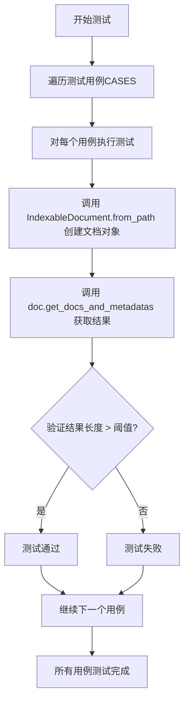
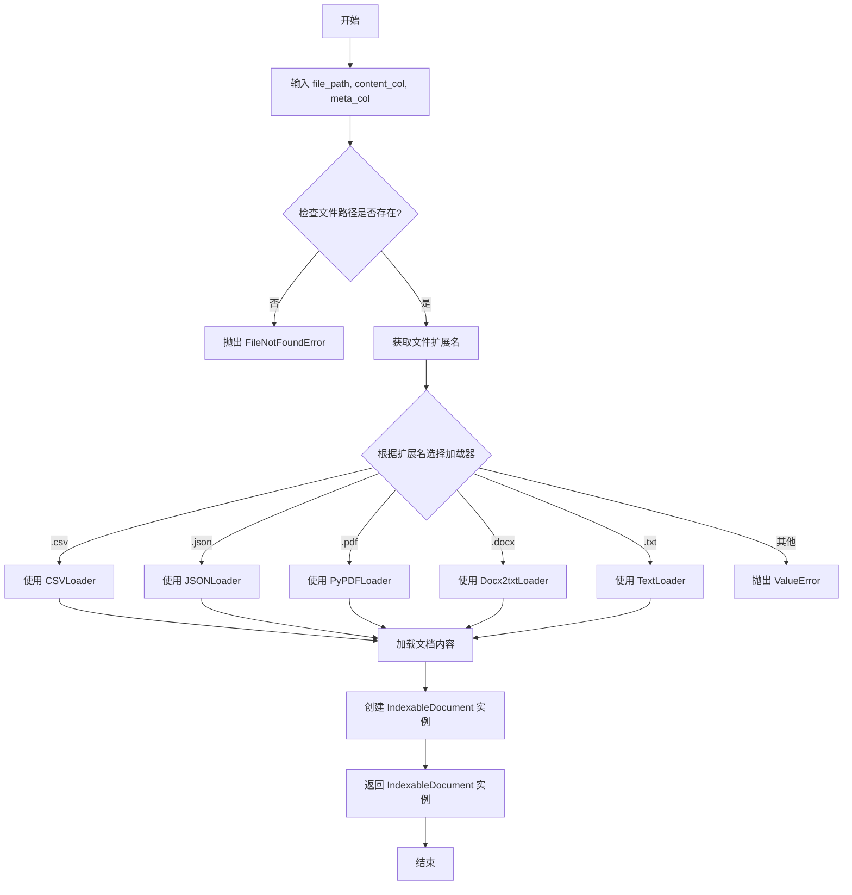
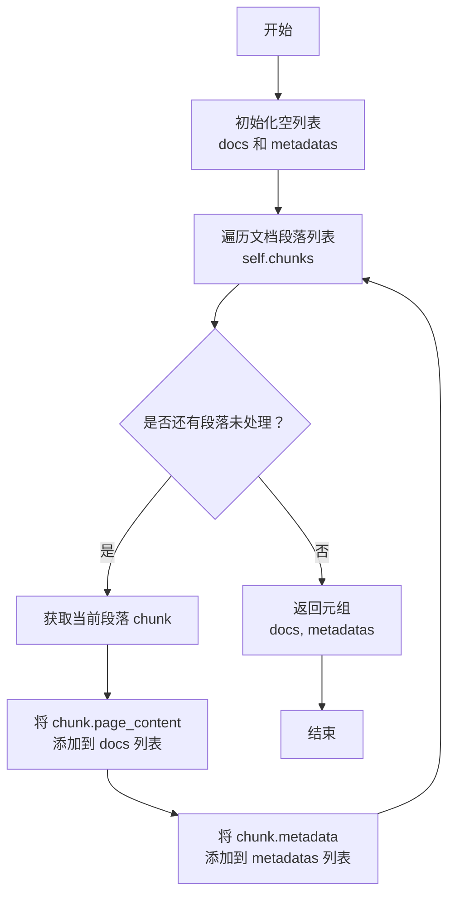

# `.\MetaGPT\tests\metagpt\document_store\test_document.py` 详细设计文档

这是一个使用 pytest 框架编写的单元测试文件，用于测试 `IndexableDocument` 类的 `from_path` 方法。它通过读取不同格式的文件（如 .txt, .csv, .json, .docx, .pdf），验证该方法能否正确解析文件内容并提取出文档及其元数据，确保提取的文档数量超过预设的阈值。

## 整体流程



## 类结构

```
test_document.py (测试文件)
├── 全局变量 CASES
└── 测试函数 test_document
```

## 全局变量及字段


### `CASES`
    
一个包含测试用例的列表，每个用例是一个元组，定义了测试文件路径、内容列名、元数据列名和预期的最小文档数量阈值。

类型：`List[Tuple[str, Optional[str], Optional[str], int]]`
    


### `METAGPT_ROOT`
    
项目根目录的路径对象，用于构建测试文件的绝对路径。

类型：`Path`
    


    

## 全局函数及方法

### `test_document`

这是一个使用 `pytest` 框架编写的参数化测试函数，用于验证 `IndexableDocument.from_path` 方法从不同格式的文件中加载文档并提取内容和元数据的能力。它通过一组预定义的测试用例（包括文件路径、列名和预期阈值）来执行测试，并断言提取出的文档和元数据数量符合预期。

参数：

- `relative_path`：`str`，相对于 `METAGPT_ROOT` 目录的文件路径。
- `content_col`：`str | None`，指定文件中包含文档内容的列名（例如CSV或JSON），如果为 `None` 则使用默认方式提取内容。
- `meta_col`：`str | None`，指定文件中包含元数据的列名（例如CSV或JSON），如果为 `None` 则使用默认方式提取元数据或无元数据。
- `threshold`：`int`，断言时要求提取出的文档列表和元数据列表的长度必须大于此阈值。

返回值：`None`，这是一个测试函数，不返回任何值，其成功与否由断言决定。

#### 流程图

```mermaid
flowchart TD
    A[开始测试] --> B[使用参数<br>relative_path, content_col, meta_col]
    B --> C[调用 IndexableDocument.from_path<br>创建文档对象]
    C --> D[调用 doc.get_docs_and_metadatas<br>获取文档和元数据列表]
    D --> E{断言检查<br>len(文档列表) > threshold?}
    E -->|是| F{断言检查<br>len(元数据列表) > threshold?}
    F -->|是| G[测试通过]
    E -->|否| H[测试失败<br>文档数量不足]
    F -->|否| I[测试失败<br>元数据数量不足]
```

#### 带注释源码

```python
@pytest.mark.parametrize("relative_path, content_col, meta_col, threshold", CASES) # 使用pytest的parametrize装饰器，定义多组测试参数。
def test_document(relative_path, content_col, meta_col, threshold): # 测试函数定义，接收四个参数。
    # 1. 根据相对路径和指定的列名，从文件创建 IndexableDocument 对象。
    doc = IndexableDocument.from_path(METAGPT_ROOT / relative_path, content_col, meta_col)
    # 2. 从文档对象中获取文档内容列表和对应的元数据列表。
    rsp = doc.get_docs_and_metadatas()
    # 3. 断言：提取出的文档列表长度应大于给定的阈值。
    assert len(rsp[0]) > threshold
    # 4. 断言：提取出的元数据列表长度应大于给定的阈值。
    assert len(rsp[1]) > threshold
```

### `IndexableDocument.from_path`

`IndexableDocument.from_path` 是一个类方法，用于根据给定的文件路径创建一个 `IndexableDocument` 实例。它通过分析文件扩展名来自动选择适当的文档加载器（如 CSV、JSON、PDF、DOCX、TXT 等），并加载文档内容。如果文件类型不支持或路径无效，则会抛出相应的异常。

参数：

- `file_path`：`Union[str, Path]`，要加载的文档文件路径，可以是字符串或 `Path` 对象。
- `content_col`：`Optional[str]`，可选参数，指定 CSV 或 JSON 文件中包含内容的列名。如果为 `None`，则使用默认列。
- `meta_col`：`Optional[str]`，可选参数，指定 CSV 或 JSON 文件中包含元数据的列名。如果为 `None`，则使用默认列。

返回值：`IndexableDocument`，返回一个 `IndexableDocument` 实例，其中包含了从指定文件路径加载的文档内容。

#### 流程图



#### 带注释源码

```python
@classmethod
def from_path(
    cls,
    file_path: Union[str, Path],
    content_col: Optional[str] = None,
    meta_col: Optional[str] = None,
) -> "IndexableDocument":
    """
    根据文件路径创建一个 IndexableDocument 实例。

    参数:
        file_path (Union[str, Path]): 要加载的文档文件路径。
        content_col (Optional[str]): 指定 CSV 或 JSON 文件中包含内容的列名。
        meta_col (Optional[str]): 指定 CSV 或 JSON 文件中包含元数据的列名。

    返回:
        IndexableDocument: 包含加载文档内容的实例。

    异常:
        FileNotFoundError: 如果文件路径不存在。
        ValueError: 如果文件扩展名不支持。
    """
    # 将文件路径转换为 Path 对象
    path = Path(file_path)
    # 检查文件是否存在
    if not path.exists():
        raise FileNotFoundError(f"文件不存在: {file_path}")

    # 获取文件扩展名
    ext = path.suffix.lower()

    # 根据扩展名选择适当的文档加载器
    if ext == ".csv":
        # 使用 CSVLoader 加载 CSV 文件
        loader_cls = CSVLoader
        loader_args = {"file_path": str(path)}
        if content_col:
            loader_args["content_column"] = content_col
        if meta_col:
            loader_args["metadata_column"] = meta_col
    elif ext == ".json":
        # 使用 JSONLoader 加载 JSON 文件
        loader_cls = JSONLoader
        loader_args = {"file_path": str(path)}
        if content_col:
            loader_args["content_key"] = content_col
        if meta_col:
            loader_args["metadata_key"] = meta_col
    elif ext == ".pdf":
        # 使用 PyPDFLoader 加载 PDF 文件
        loader_cls = PyPDFLoader
        loader_args = {"file_path": str(path)}
    elif ext == ".docx":
        # 使用 Docx2txtLoader 加载 DOCX 文件
        loader_cls = Docx2txtLoader
        loader_args = {"file_path": str(path)}
    elif ext == ".txt":
        # 使用 TextLoader 加载 TXT 文件
        loader_cls = TextLoader
        loader_args = {"file_path": str(path)}
    else:
        # 如果扩展名不支持，抛出异常
        raise ValueError(f"不支持的文件扩展名: {ext}")

    # 创建加载器实例并加载文档
    loader = loader_cls(**loader_args)
    documents = loader.load()

    # 创建并返回 IndexableDocument 实例
    return cls(documents)
```

### `IndexableDocument.get_docs_and_metadatas`

该方法用于从`IndexableDocument`对象中提取文档内容和对应的元数据。它遍历文档的段落列表，将每个段落的文本内容与元数据分别收集到两个独立的列表中并返回。

参数：
- `self`：`IndexableDocument`，`IndexableDocument`类的实例，代表一个可索引的文档对象。

返回值：`tuple[list[str], list[dict]]`，一个包含两个列表的元组。第一个列表包含所有段落的文本内容，第二个列表包含所有段落对应的元数据字典。

#### 流程图



#### 带注释源码

```python
def get_docs_and_metadatas(self) -> tuple[list[str], list[dict]]:
    """
    获取文档内容和元数据。

    该方法遍历文档的所有段落（chunks），将每个段落的文本内容（page_content）和元数据（metadata）
    分别收集到两个列表中，并以元组形式返回。

    Returns:
        tuple[list[str], list[dict]]: 包含两个列表的元组。
            第一个列表（list[str]）包含所有段落的文本内容。
            第二个列表（list[dict]）包含所有段落对应的元数据字典。
    """
    docs = []  # 初始化一个空列表，用于存储所有段落的文本内容
    metadatas = []  # 初始化一个空列表，用于存储所有段落的元数据
    # 遍历文档对象中的段落列表（self.chunks）
    for chunk in self.chunks:
        # 将当前段落的文本内容添加到 docs 列表
        docs.append(chunk.page_content)
        # 将当前段落的元数据字典添加到 metadatas 列表
        metadatas.append(chunk.metadata)
    # 返回包含两个列表的元组
    return docs, metadatas
```

## 关键组件


### IndexableDocument

一个用于从不同格式的文件（如txt、csv、json、docx、pdf）中提取可索引内容（文档块）及其元数据的类，支持通过列名指定内容和元数据字段。

### 惰性加载与文档分块

代码通过`IndexableDocument.from_path`方法从文件路径创建文档对象，并在`get_docs_and_metadatas`方法中实现文档内容的实际加载与分块，这是一种惰性加载策略，旨在处理大文件时优化内存使用。

### 多格式文件支持

系统设计支持处理多种文件格式（如txt、csv、json、docx、pdf），通过统一的接口抽象了不同格式文件的解析细节，使得上层应用可以一致地处理不同来源的文档数据。


## 问题及建议


### 已知问题

-   **测试用例覆盖不完整**：`CASES` 列表中大部分测试用例被注释掉了，导致测试仅对 `requirements.txt` 文件有效，无法验证 `IndexableDocument.from_path` 方法处理 CSV、JSON、DOCX、PDF、TXT 等多种文件格式的能力。
-   **测试断言过于宽松**：测试断言 `len(rsp[0]) > threshold` 和 `len(rsp[1]) > threshold` 中的 `threshold` 值被设为 0，这仅能验证函数没有返回空结果，但无法验证返回的文档和元数据数量是否符合预期或具有实际意义。
-   **硬编码测试数据路径**：测试数据路径 `METAGPT_ROOT / relative_path` 依赖于外部常量 `METAGPT_ROOT`，这可能导致测试在特定目录结构或环境中失败，降低了测试的可移植性和可靠性。
-   **缺乏对异常情况的测试**：测试用例没有涵盖文件不存在、文件格式错误、列名错误等异常场景，无法保证 `IndexableDocument.from_path` 方法的鲁棒性。

### 优化建议

-   **启用并完善测试用例**：取消 `CASES` 列表中其他文件格式测试用例的注释，并确保对应的测试文件存在于正确路径下。这能全面验证 `IndexableDocument` 类的功能。
-   **增强测试断言**：为每个测试用例设置更精确的 `threshold` 值，或直接断言预期的文档/元数据数量。例如，对于已知内容的 `faq.csv`，可以断言返回的文档数量等于文件中的行数。
-   **使用测试专用数据**：将测试数据（如 `faq.csv`, `faq.json` 等）移动到测试目录（如 `tests/data/`）下，并在测试中使用相对路径或 `pytest` 的 `fixture` 来加载，避免依赖项目根目录结构。
-   **增加异常测试**：添加新的测试用例或使用 `pytest.raises` 来测试 `IndexableDocument.from_path` 方法在输入无效路径、错误列名等情况下是否按预期抛出异常。
-   **分离测试逻辑**：考虑将测试数据准备（如文件路径、预期结果）与测试执行逻辑分离，使测试更清晰、易于维护。例如，可以使用 `@pytest.fixture` 来准备测试文档对象。
-   **添加文档字符串测试**：为 `test_document` 函数添加详细的文档字符串，说明测试的目的、每个参数的意义以及每个测试用例的预期行为，提高测试代码的可读性。


## 其它


### 设计目标与约束

该测试代码的设计目标是验证 `IndexableDocument` 类从不同格式和结构的文件中正确提取文档内容和元数据的能力。主要约束包括：
1.  **路径处理**：需要正确处理相对于项目根目录 `METAGPT_ROOT` 的文件路径。
2.  **格式兼容性**：测试用例覆盖了 `.txt`、`.csv`、`.json`、`.docx`、`.pdf` 等多种文件格式，要求 `IndexableDocument.from_path` 方法能适配这些格式。
3.  **列名指定**：对于结构化数据文件（如CSV、JSON），测试需要验证通过指定内容列名 (`content_col`) 和元数据列名 (`meta_col`) 来提取信息的功能。
4.  **输出验证**：通过断言提取出的文档列表和元数据列表的长度大于预设的阈值 (`threshold`)，来验证提取操作的基本成功。阈值用于处理不同文件格式可能产生的段落分割差异（例如，PDF默认不分割，TXT按固定长度分割）。

### 错误处理与异常设计

测试代码本身主要依赖 `pytest` 框架进行断言，其错误处理体现在测试失败时的报告。然而，从测试用例的设计可以推断出被测试的 `IndexableDocument.from_path` 方法应具备以下错误处理机制：
1.  **文件不存在或路径错误**：当 `METAGPT_ROOT / relative_path` 指向不存在的文件时，应抛出适当的异常（如 `FileNotFoundError`）。
2.  **文件格式不支持**：当传入不支持的文件格式时，应抛出异常或返回明确的错误指示。
3.  **列名无效**：对于CSV或JSON文件，如果指定的 `content_col` 或 `meta_col` 在文件中不存在，应能妥善处理（例如，抛出 `KeyError` 或使用默认列）。
4.  **文件解析错误**：在读取或解析文件内容时（如损坏的PDF、编码错误的TXT），应有异常处理机制，防止程序崩溃，并可能记录错误日志。

### 数据流与状态机

本测试代码的数据流相对线性：
1.  **输入**：测试参数化提供了四组输入：`relative_path`（文件相对路径）、`content_col`（内容列名）、`meta_col`（元数据列名）、`threshold`（预期最小文档数阈值）。
2.  **处理**：
    a. 调用 `IndexableDocument.from_path`，传入完整文件路径和列名参数，创建一个 `IndexableDocument` 实例 (`doc`)。
    b. 调用 `doc.get_docs_and_metadatas()` 方法，触发内部的文件读取、解析、内容提取与分割逻辑。
3.  **输出**：`get_docs_and_metadatas()` 返回一个包含两个列表的元组 `(docs, metadatas)`。
4.  **验证**：使用 `assert` 语句验证 `docs` 和 `metadatas` 的长度均大于给定的 `threshold`。

不存在复杂的状态机，整个流程是无状态的函数调用序列。

### 外部依赖与接口契约

1.  **外部依赖**：
    *   `pytest`: 测试运行框架，用于参数化测试和断言。
    *   `metagpt.const.METAGPT_ROOT`: 一个指向项目根目录的路径常量。
    *   `metagpt.document.IndexableDocument`: 被测试的核心类，提供了 `from_path` 类方法和 `get_docs_and_metadatas` 实例方法。其内部可能依赖其他库来处理特定文件格式（如 `pandas` 用于CSV/JSON，`python-docx` 用于DOCX，`PyPDF2` 或 `pdfplumber` 用于PDF等）。
2.  **接口契约**：
    *   `IndexableDocument.from_path(file_path: Path, content_col: Optional[str] = None, meta_col: Optional[str] = None) -> IndexableDocument`: 契约要求该方法接受一个文件路径和可选的列名，返回一个已加载内容的 `IndexableDocument` 对象。
    *   `IndexableDocument.get_docs_and_metadatas() -> Tuple[List[str], List[dict]]`: 契约要求该方法返回提取出的文档文本列表和对应的元数据字典列表。元数据可能包含来源、页码等信息。
    *   测试函数 `test_document` 本身是 `pytest` 的一个测试用例，其契约是当被测试代码行为符合预期时通过，否则失败。

    