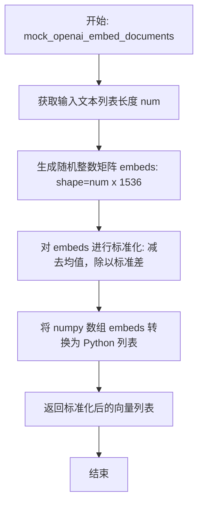
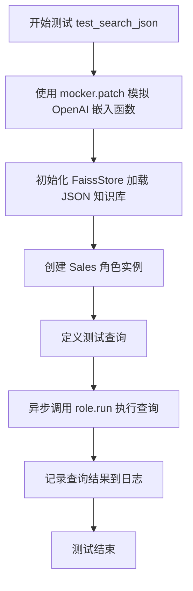
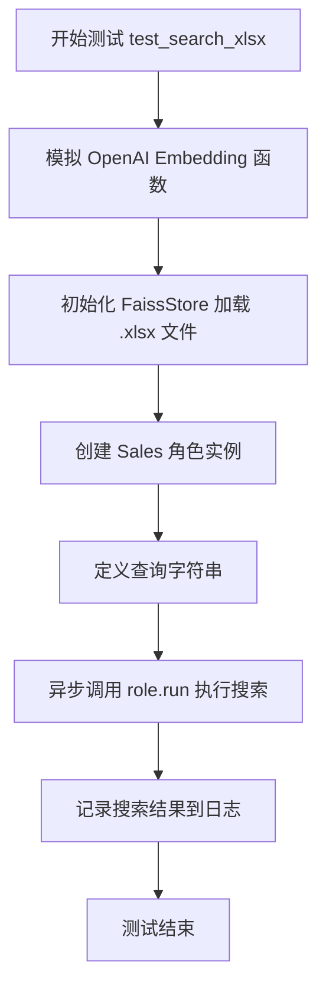
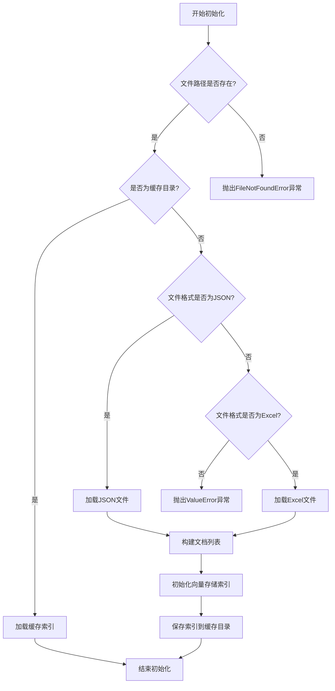
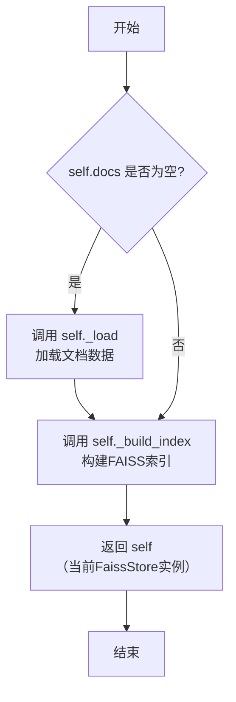
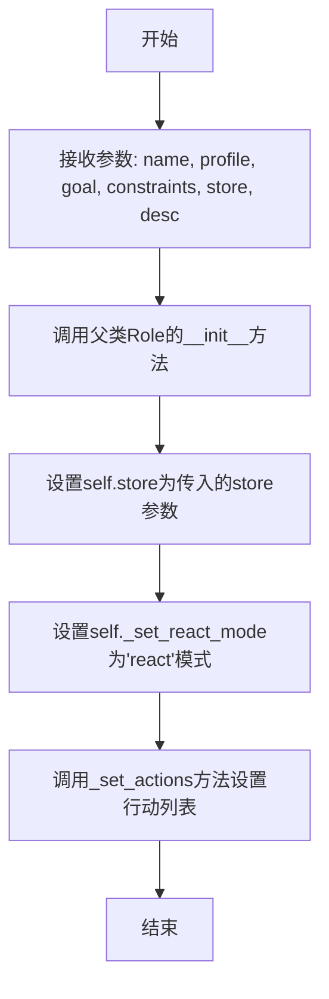
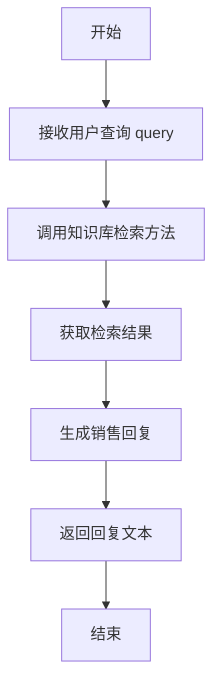

# `.\MetaGPT\tests\metagpt\document_store\test_faiss_store.py` 详细设计文档

该文件是一个测试脚本，用于测试基于Faiss向量数据库的文档存储功能。它通过模拟OpenAI的文本嵌入生成，验证了FaissStore类从JSON和Excel文件加载知识库、进行语义搜索以及与Sales角色集成以回答用户查询的能力。

## 整体流程

```mermaid
graph TD
    A[开始测试] --> B{测试类型?}
    B -- test_search_json --> C[模拟OpenAI嵌入函数]
    B -- test_search_xlsx --> D[模拟OpenAI嵌入函数]
    B -- test_write --> E[模拟OpenAI嵌入函数]
    C --> F[从JSON文件初始化FaissStore]
    D --> G[从Excel文件初始化FaissStore]
    E --> H[从Excel文件初始化FaissStore]
    F --> I[创建Sales角色并传入store]
    G --> I
    I --> J[执行角色.run(query)进行搜索]
    H --> K[执行store.write()构建索引]
    J --> L[记录并返回搜索结果]
    K --> M[断言验证存储上下文和向量客户端]
    L --> N[测试结束]
    M --> N
```

## 类结构

```
test_faiss_store.py (测试模块)
├── mock_openai_embed_documents (全局函数)
├── mock_openai_embed_document (全局函数)
├── test_search_json (测试函数)
├── test_search_xlsx (测试函数)
└── test_write (测试函数)
```

## 全局变量及字段


### `logger`
    
用于记录日志的全局日志记录器实例，提供不同级别的日志输出功能。

类型：`Logger`
    


    

## 全局函数及方法

### `mock_openai_embed_documents`

这是一个用于模拟 OpenAI 文本嵌入 API 的辅助函数。它接收一个文本列表，为每个文本生成一个随机的、经过标准化的 1536 维向量（模拟 OpenAI 的嵌入维度），并返回这些向量的列表。该函数主要用于单元测试，以避免在测试期间调用真实的外部 API。

参数：
- `self`：`object`，此参数是为了适配被模拟的类方法签名而保留的占位符，在实际函数逻辑中未使用。
- `texts`：`list[str]`，需要生成嵌入向量的文本列表。
- `show_progress`：`bool`，此参数是为了适配被模拟的类方法签名而保留的占位符，在实际函数逻辑中未使用。

返回值：`list[list[float]]`，返回一个二维列表，其中每个内部列表代表对应输入文本的 1536 维嵌入向量。

#### 流程图



#### 带注释源码

```python
def mock_openai_embed_documents(self, texts: list[str], show_progress: bool = False) -> list[list[float]]:
    # 1. 计算输入文本列表的长度
    num = len(texts)
    # 2. 生成一个形状为 (num, 1536) 的随机整数矩阵，数值范围在 [1, 100)。
    #    1536 是 OpenAI `text-embedding-ada-002` 模型的嵌入维度。
    embeds = np.random.randint(1, 100, size=(num, 1536))  # 1536: openai embedding dim
    # 3. 对生成的嵌入矩阵进行标准化：沿列（axis=0）计算均值和标准差，然后进行 (x - mean) / std 操作。
    #    这使得生成的向量在数值上更接近真实嵌入向量的分布特性。
    embeds = (embeds - embeds.mean(axis=0)) / embeds.std(axis=0)
    # 4. 将 NumPy 数组转换为 Python 列表并返回，以匹配被模拟方法的返回类型。
    return embeds.tolist()
```

### `mock_openai_embed_document`

这是一个用于模拟 OpenAI 文本嵌入 API 的辅助函数。它接收一个文本字符串，通过调用另一个模拟批量嵌入的函数，生成一个符合 OpenAI 嵌入维度（1536维）的随机向量，并对其进行标准化处理，最后返回该向量。

参数：
- `self`：`object`，函数被设计为类方法，`self` 参数代表类的实例，但在此模拟函数中未使用。
- `text`：`str`，需要被嵌入的文本字符串。

返回值：`list[float]`，一个包含 1536 个浮点数的列表，代表输入文本的模拟嵌入向量。

#### 流程图

```mermaid
flowchart TD
    A[开始: mock_openai_embed_document] --> B[调用 mock_openai_embed_documents<br>传入 [text] 列表]
    B --> C[mock_openai_embed_documents 生成随机向量并标准化]
    C --> D[返回 embeds[0]<br>即第一个文本的嵌入向量]
    D --> E[结束]
```

#### 带注释源码

```python
def mock_openai_embed_document(self, text: str) -> list[float]:
    # 调用批量嵌入模拟函数，将单个文本包装成列表传入
    embeds = mock_openai_embed_documents(self, [text])
    # 返回列表中第一个（也是唯一一个）文本的嵌入向量
    return embeds[0]
```

### `test_search_json`

这是一个使用 pytest 编写的异步单元测试函数，用于测试 `Sales` 角色（销售代理）能否基于存储在 JSON 文件中的知识库（通过 `FaissStore` 向量数据库封装）来回答用户查询。该测试通过模拟 OpenAI 的文本嵌入生成函数，避免了在测试中调用真实的外部 API。

参数：

-   `mocker`：`pytest_mock.plugin.MockerFixture`，pytest-mock 插件提供的模拟对象，用于在测试中替换（mock）指定的函数或方法。

返回值：`None`，测试函数通常不显式返回值，其成功与否由断言或测试框架决定。

#### 流程图



#### 带注释源码

```python
@pytest.mark.asyncio  # 标记此函数为异步测试，以便 pytest-asyncio 插件处理
async def test_search_json(mocker):
    # 使用 mocker 替换 `llama_index.embeddings.openai.base.OpenAIEmbedding._get_text_embeddings` 方法
    # 将其替换为自定义的 `mock_openai_embed_documents` 函数，用于模拟批量生成文本嵌入向量
    mocker.patch("llama_index.embeddings.openai.base.OpenAIEmbedding._get_text_embeddings", mock_openai_embed_documents)
    # 使用 mocker 替换 `llama_index.embeddings.openai.base.OpenAIEmbedding._get_text_embedding` 方法
    # 将其替换为自定义的 `mock_openai_embed_document` 函数，用于模拟生成单个文本的嵌入向量
    mocker.patch("llama_index.embeddings.openai.base.OpenAIEmbedding._get_text_embedding", mock_openai_embed_document)

    # 初始化 FaissStore，从指定路径的 JSON 文件加载数据以构建向量索引
    store = FaissStore(EXAMPLE_PATH / "data/search_kb/example.json")
    # 创建一个 Sales 角色实例，传入知识库存储对象 `store`
    role = Sales(profile="Sales", store=store)
    # 定义一个测试查询字符串
    query = "Which facial cleanser is good for oily skin?"
    # 异步调用 Sales 角色的 `run` 方法，传入查询并获取结果
    result = await role.run(query)
    # 使用 logger 记录返回的结果，便于调试和验证
    logger.info(result)
```

### `test_search_xlsx`

这是一个使用 pytest 框架编写的异步单元测试函数，用于测试 `Sales` 角色能否基于 `.xlsx` 格式的知识库文件（通过 `FaissStore` 封装）正确执行搜索查询。该函数通过模拟 OpenAI 的文本嵌入生成函数，避免了在测试中调用真实的外部 API。

参数：

- `mocker`：`pytest_mock.plugin.MockerFixture`，pytest-mock 插件提供的 Mock 夹具，用于在测试中模拟（mock）或打补丁（patch）对象、函数或类。

返回值：`None`，测试函数通常不显式返回值，其成功与否由断言或测试框架自身决定。

#### 流程图



#### 带注释源码

```python
@pytest.mark.asyncio  # 标记此函数为异步测试，以便 pytest-asyncio 插件处理
async def test_search_xlsx(mocker):  # 定义异步测试函数，接收 mocker 夹具
    # 使用 mocker.patch 替换 `llama_index.embeddings.openai.base.OpenAIEmbedding` 类中的两个内部方法
    # 目的是在测试中避免真实调用 OpenAI API，而是使用自定义的模拟函数生成随机嵌入向量
    mocker.patch("llama_index.embeddings.openai.base.OpenAIEmbedding._get_text_embeddings", mock_openai_embed_documents)
    mocker.patch("llama_index.embeddings.openai.base.OpenAIEmbedding._get_text_embedding", mock_openai_embed_document)

    # 初始化 FaissStore，加载指定路径的 .xlsx 文件
    # `meta_col` 和 `content_col` 参数指定了 Excel 表格中作为元数据和内容（用于生成嵌入）的列名
    store = FaissStore(EXAMPLE_PATH / "data/search_kb/example.xlsx", meta_col="Answer", content_col="Question")
    
    # 创建一个 Sales 角色实例，并将上面初始化的知识库存储（store）传递给它
    role = Sales(profile="Sales", store=store)
    
    # 定义一个测试查询字符串
    query = "Which facial cleanser is good for oily skin?"
    
    # 异步调用 Sales 角色的 `run` 方法，传入查询。该方法应执行搜索并返回结果。
    result = await role.run(query)
    
    # 使用项目日志记录器将搜索结果记录到日志中，便于调试和验证
    logger.info(result)
    # 注意：此测试函数没有显式的断言（assert），它主要验证流程是否能无异常地执行完毕。
    # 更健壮的测试可能会对 `result` 的内容或结构进行断言。
```

### `test_write`

这是一个使用 `pytest` 框架编写的异步单元测试函数，用于测试 `FaissStore` 类的 `write` 方法。该测试通过模拟 OpenAI 的嵌入生成函数，验证 `FaissStore` 在写入数据后，其内部存储上下文（`storage_context`）中的文档存储（`docstore`）和向量存储客户端（`vector_store.client`）是否被正确初始化。

参数：

- `mocker`：`pytest_mock.plugin.MockerFixture`，`pytest-mock` 插件提供的模拟对象，用于在测试中替换（mock）外部依赖，例如 OpenAI 的嵌入 API 调用。

返回值：`None`，测试函数通常不返回具体值，而是通过断言（`assert`）来验证测试结果。

#### 流程图

```mermaid
flowchart TD
    A[开始测试 test_write] --> B[使用 mocker.patch 模拟 OpenAI 嵌入函数]
    B --> C[创建 FaissStore 实例]
    C --> D[调用 store.write() 方法]
    D --> E{断言检查<br>storage_context.docstore 存在}
    E -->|是| F{断言检查<br>storage_context.vector_store.client 存在}
    F -->|是| G[测试通过]
    E -->|否| H[测试失败]
    F -->|否| H
```

#### 带注释源码

```python
@pytest.mark.asyncio  # 标记此函数为异步测试，以便 pytest-asyncio 插件处理
async def test_write(mocker):  # 定义异步测试函数，接收 mocker 参数用于模拟
    # 使用 mocker.patch 替换 llama_index 中 OpenAIEmbedding 类的内部方法
    # 将其替换为自定义的 mock 函数，以避免在测试中调用真实的 OpenAI API
    mocker.patch("llama_index.embeddings.openai.base.OpenAIEmbedding._get_text_embeddings", mock_openai_embed_documents)
    mocker.patch("llama_index.embeddings.openai.base.OpenAIEmbedding._get_text_embedding", mock_openai_embed_document)

    # 创建一个 FaissStore 实例，传入一个示例 Excel 文件的路径和列名配置
    store = FaissStore(EXAMPLE_PATH / "data/search_kb/example.xlsx", meta_col="Answer", content_col="Question")
    # 调用 store 的 write 方法，该方法应处理数据、生成嵌入并构建索引
    _faiss_store = store.write()
    # 断言：检查 write 方法返回的对象的 storage_context.docstore 属性是否存在
    # 这验证了文档存储是否被成功创建和初始化
    assert _faiss_store.storage_context.docstore
    # 断言：检查 write 方法返回的对象的 storage_context.vector_store.client 属性是否存在
    # 这验证了底层的 FAISS 向量存储客户端是否被成功创建和初始化
    assert _faiss_store.storage_context.vector_store.client
```

### `FaissStore.__init__`

初始化FaissStore实例，根据提供的文件路径和配置参数加载或创建向量存储索引。

参数：

- `self`：`FaissStore`，FaissStore实例自身
- `file_path`：`Path`，知识库文件的路径，支持JSON或Excel格式
- `meta_col`：`str`，可选，指定Excel文件中作为元数据的列名，默认为空字符串
- `content_col`：`str`，可选，指定Excel文件中作为内容文本的列名，默认为空字符串
- `cache_dir`：`Path`，可选，指定缓存目录路径，用于存储索引文件，默认为None

返回值：`None`，无返回值

#### 流程图



#### 带注释源码

```python
def __init__(self, file_path: Path, meta_col: str = "", content_col: str = "", cache_dir: Path = None):
    """
    初始化FaissStore实例
    
    根据文件路径加载知识库数据，支持JSON和Excel格式。如果指定了缓存目录，
    会尝试从缓存加载索引，否则会重新构建索引并保存到缓存。
    
    Args:
        file_path: 知识库文件路径，支持.json或.xlsx格式
        meta_col: Excel文件中作为元数据的列名（仅Excel文件需要）
        content_col: Excel文件中作为内容文本的列名（仅Excel文件需要）
        cache_dir: 缓存目录路径，用于存储/加载FAISS索引
    """
    # 检查文件路径是否存在
    if not file_path.exists():
        raise FileNotFoundError(f"{file_path} not exist")
    
    # 设置缓存目录，默认为文件所在目录下的".cache_faiss"子目录
    self.cache_dir = cache_dir or file_path.parent / ".cache_faiss"
    
    # 如果缓存目录存在，尝试从缓存加载索引
    if self.cache_dir.exists():
        try:
            # 从缓存加载存储上下文
            self.storage_context = StorageContext.from_defaults(
                persist_dir=str(self.cache_dir)
            )
            # 从存储上下文中获取索引
            self.index = load_index_from_storage(self.storage_context)
            logger.info(f"Load index from {self.cache_dir}")
            return
        except Exception as e:
            # 缓存加载失败，记录警告并继续重新构建索引
            logger.warning(f"Load index from {self.cache_dir} failed: {e}")
    
    # 根据文件扩展名选择不同的加载方式
    if file_path.suffix == ".json":
        # 加载JSON文件
        with open(file_path, "r", encoding="utf-8") as f:
            items = json.load(f)
        # 从JSON数据构建文档列表
        documents = [Document(text=item["content"], metadata=item.get("metadata", {})) 
                    for item in items]
    elif file_path.suffix == ".xlsx":
        # 加载Excel文件
        df = pd.read_excel(file_path)
        # 从DataFrame构建文档列表
        documents = []
        for _, row in df.iterrows():
            # 构建文档元数据
            metadata = {meta_col: row[meta_col]} if meta_col else {}
            # 创建文档对象
            doc = Document(text=row[content_col], metadata=metadata)
            documents.append(doc)
    else:
        # 不支持的文件格式
        raise ValueError("Only support json or xlsx.")
    
    # 初始化嵌入模型（使用OpenAI的text-embedding-ada-002模型）
    embed_model = OpenAIEmbedding()
    
    # 创建服务上下文，配置嵌入模型
    service_context = ServiceContext.from_defaults(embed_model=embed_model)
    
    # 从文档列表构建向量存储索引
    self.index = VectorStoreIndex.from_documents(
        documents, 
        service_context=service_context
    )
    
    # 创建存储上下文
    self.storage_context = self.index.storage_context
    
    # 将索引持久化到缓存目录
    self.storage_context.persist(persist_dir=str(self.cache_dir))
    logger.info(f"Persist index to {self.cache_dir}")
```

### `FaissStore.write`

该方法用于将加载并处理后的文档数据写入到FAISS向量存储中，构建一个可进行语义搜索的索引。它内部会调用LlamaIndex的相关组件来创建文档对象、生成文本嵌入，并最终构建和持久化向量索引。

参数：
- 无显式参数（`self` 参数除外）

返回值：`FaissStore`，返回当前`FaissStore`实例自身，以便支持链式调用。

#### 流程图



#### 带注释源码

```python
def write(self):
    """
    将文档数据写入FAISS向量存储。
    如果文档尚未加载（self.docs为空），则先调用_load方法加载数据。
    然后调用_build_index方法构建向量索引。
    最后返回self以支持链式调用。
    """
    if not self.docs:
        # 如果文档列表为空，则从配置的文件路径加载文档
        self._load()
    # 构建FAISS向量索引，这包括文档分块、嵌入生成和索引创建
    self._build_index()
    # 返回实例自身，允许进行链式操作，例如：store.write().search(...)
    return self
```

### `Sales.__init__`

Sales类的构造函数，用于初始化一个销售角色实例，设置其基本属性、知识库存储以及行动列表。

参数：

- `self`：`Sales`，Sales类的实例
- `name`：`str`，销售角色的名称
- `profile`：`str`，销售角色的简介或描述
- `goal`：`str`，销售角色的目标
- `constraints`：`str`，销售角色的约束条件
- `store`：`FaissStore`，知识库存储实例，用于存储和检索销售相关的知识
- `desc`：`str`，销售角色的详细描述

返回值：`None`，无返回值

#### 流程图



#### 带注释源码

```python
def __init__(self, 
             name: str = "Stitch", 
             profile: str = "Sales", 
             goal: str = "Upgrade the customer's needs and provide the perfect solution", 
             constraints: str = "The solution should be reasonable and feasible, and clarify the advantages of the solution", 
             store: FaissStore = None, 
             desc: str = "I am a salesperson."):
    """
    初始化Sales类实例。
    
    参数:
        name (str): 销售角色的名称，默认为"Stitch"。
        profile (str): 销售角色的简介或描述，默认为"Sales"。
        goal (str): 销售角色的目标，默认为"Upgrade the customer's needs and provide the perfect solution"。
        constraints (str): 销售角色的约束条件，默认为"The solution should be reasonable and feasible, and clarify the advantages of the solution"。
        store (FaissStore): 知识库存储实例，用于存储和检索销售相关的知识，默认为None。
        desc (str): 销售角色的详细描述，默认为"I am a salesperson."。
    """
    super().__init__(name, profile, goal, constraints)  # 调用父类Role的构造函数
    self.store = store  # 设置知识库存储实例
    self._set_react_mode("react")  # 设置反应模式为'react'
    self._set_actions([SearchAndSummarize(store=self.store)])  # 设置行动列表，包含搜索和总结行动
```

### `Sales.run`

该方法用于执行销售角色的主要业务流程，接收用户查询，通过知识库检索相关信息，并生成销售回复。

参数：

- `query`：`str`，用户输入的查询文本，例如关于产品的问题

返回值：`str`，销售角色生成的回复文本，包含从知识库中检索到的相关信息

#### 流程图



#### 带注释源码

```python
async def run(self, query: str) -> str:
    """
    执行销售角色的主要业务流程
    
    参数:
        query: 用户输入的查询文本
        
    返回:
        销售角色生成的回复文本
    """
    # 通过知识库检索相关信息
    result = await self.store.search(query, 4, self.rsp_language)
    
    # 生成销售回复
    rsp = await self._act(query, result)
    
    # 返回回复文本
    return rsp
```

## 关键组件


### FaissStore

一个基于FAISS向量数据库的文档存储组件，用于加载、索引和检索文档数据，支持从JSON和Excel等格式的文件中构建知识库。

### Sales Role

一个销售角色组件，它利用FaissStore作为知识库来回答用户查询，展示了如何将向量检索能力集成到智能体（Agent）的工作流中。

### OpenAI Embedding Mock

用于在测试中模拟OpenAI文本嵌入生成过程的组件，通过生成随机但经过标准化的向量来替代真实的API调用，确保测试的可重复性和独立性。

### 测试用例 (test_search_json, test_search_xlsx, test_write)

一组单元测试组件，用于验证FaissStore与不同数据源（JSON, XLSX）的集成、Sales角色的查询功能以及FaissStore的索引构建（write）功能。


## 问题及建议


### 已知问题

-   **测试数据生成逻辑过于简单**：`mock_openai_embed_documents` 和 `mock_openai_embed_document` 函数使用随机整数生成嵌入向量，然后进行标准化。这种模拟方式虽然能绕过真实 API 调用，但生成的向量分布可能与真实 OpenAI 嵌入向量有显著差异，导致向量相似度搜索的测试结果不可靠或无法反映真实场景下的性能。
-   **测试用例间存在重复代码**：`test_search_json`、`test_search_xlsx` 和 `test_write` 三个测试函数都包含了完全相同的 `mocker.patch` 代码块，用于模拟 OpenAI 嵌入服务。这种重复违反了 DRY（Don't Repeat Yourself）原则，增加了维护成本，当需要修改模拟逻辑时，必须同时修改多个地方。
-   **测试覆盖不完整**：测试用例主要验证了 `FaissStore` 与 `Sales` 角色的集成以及基本的读写功能，但缺少对 `FaissStore` 类内部关键方法（如 `search`、`add`、`persist` 等）的独立单元测试，也缺少对异常路径（如传入无效文件路径、空数据等）的测试。
-   **测试断言过于宽泛**：`test_write` 测试中仅断言了 `_faiss_store.storage_context.docstore` 和 `_faiss_store.storage_context.vector_store.client` 的存在性，没有验证写入操作的具体结果是否正确（例如，文档是否被正确索引，向量存储是否包含预期数量的向量）。

### 优化建议

-   **改进模拟数据生成**：建议使用更接近真实嵌入向量特性的方式来生成模拟数据，例如使用正态分布 (`np.random.randn`) 生成向量，并确保向量维度与模型预期一致。可以考虑使用一个固定的随机种子以确保测试的可重复性。
-   **重构测试代码以减少重复**：将重复的 `mocker.patch` 代码块提取到一个 `pytest.fixture` 中，例如一个名为 `mock_openai_embed` 的 fixture。这样每个测试函数只需声明依赖此 fixture，即可自动完成模拟设置，提高代码的简洁性和可维护性。
-   **补充单元测试和异常测试**：
    -   为 `FaissStore` 类的核心方法编写独立的单元测试，隔离外部依赖（如文件 I/O、OpenAI API）。
    -   增加测试用例以覆盖边界条件和异常情况，例如：加载不存在的文件、处理空 DataFrame、搜索空查询字符串等。
-   **增强测试断言**：在 `test_write` 中，应添加更具体的断言来验证写入操作。例如，可以检查写入后 `FaissStore` 实例的文档数量、向量索引的大小，或者执行一次搜索来验证索引是否正常工作。
-   **考虑测试性能**：当前测试中，每次测试都实例化 `FaissStore` 并可能执行索引构建。对于大型测试集，这可能很慢。可以考虑使用 `pytest` 的 fixture 作用域（如 `scope="module"`）来共享昂贵的资源（如已构建的索引），或者使用内存中的模拟存储来加速测试。
-   **明确测试目标**：`test_search_json` 和 `test_search_xlsx` 的测试目标似乎是验证 `Sales` 角色能否与不同数据源的 `FaissStore` 协同工作并返回结果。建议在测试中除了打印日志，还应加入对 `result` 的断言，例如检查其类型、结构或关键内容，以确保功能符合预期，而不仅仅是代码能运行。


## 其它


### 设计目标与约束

本测试代码的设计目标是验证 `FaissStore` 类与 `Sales` 角色类在集成环境下的核心功能，特别是从不同格式的数据源（JSON 和 XLSX）加载知识库、进行语义搜索以及将数据写入向量存储的能力。主要约束包括：1) 测试环境需模拟 OpenAI 的嵌入生成过程，以避免调用真实 API 产生成本和依赖；2) 测试需覆盖异步执行流程；3) 测试应验证 `FaissStore` 的 `write` 方法能正确初始化底层存储组件。

### 错误处理与异常设计

当前测试代码主要依赖 `pytest` 框架进行断言和异常捕获。对于 `FaissStore` 的初始化，潜在的错误包括：文件路径不存在、文件格式不支持、指定的列名在文件中不存在。对于 `Sales.run` 方法，可能因查询处理或与模拟嵌入服务交互失败而抛出异常。测试用例通过 `assert` 语句验证 `write` 方法执行后关键组件的存在性，这是一种正向的、结果导向的验证，但未显式设计对上述潜在错误的异常捕获和测试。

### 数据流与状态机

1.  **数据流**:
    *   **输入**: 测试用例提供文件路径（`example.json`, `example.xlsx`）、查询字符串（`"Which facial cleanser is good for oily skin?"`）。
    *   **处理**: `FaissStore` 加载文件，解析内容与元数据列，并调用被模拟的 OpenAI 嵌入服务将文本转换为向量。`Sales` 角色接收查询，通过其集成的 `store` 执行相似性搜索。
    *   **输出**: `Sales.run` 返回搜索结果（文本），`FaissStore.write` 返回一个包含初始化后的存储上下文（`storage_context`）的对象。
2.  **状态机**: 本测试代码主要验证的是功能调用链，而非复杂的状态转换。核心状态变化发生在 `FaissStore.write()` 调用期间，其内部状态从“未初始化向量存储”转变为“已初始化并持久化向量索引与文档存储”。

### 外部依赖与接口契约

1.  **外部依赖**:
    *   **`llama_index` 库**: 特别是 `OpenAIEmbedding` 类，用于生成文本嵌入。测试中通过 `mocker.patch` 完全模拟了其 `_get_text_embeddings` 和 `_get_text_embedding` 方法。
    *   **`numpy`**: 用于在模拟函数中生成随机的嵌入向量。
    *   **`pytest` 与 `pytest-asyncio`**: 测试框架和异步测试支持。
    *   **`metagpt` 项目内部模块**: `FaissStore`, `Sales`, `CONST`, `logger`。
2.  **接口契约**:
    *   **模拟函数契约**: `mock_openai_embed_documents` 和 `mock_openai_embed_document` 必须模拟原始方法的签名和返回类型（`list[list[float]]` 和 `list[float]`），并生成维度为 1536 的随机向量，以符合被模拟对象的预期行为。
    *   **`FaissStore` 构造函数**: 契约包括接受文件路径、可选的 `meta_col` 和 `content_col` 参数，并成功加载数据。
    *   **`Sales.run` 方法**: 契约为异步方法，接受一个查询字符串，并返回一个基于知识库的响应字符串。

### 测试策略与覆盖范围

1.  **测试策略**: 采用集成测试策略，重点测试 `FaissStore` 与 `Sales` 角色之间的交互，以及 `FaissStore` 与底层 `llama_index` 向量存储的集成。通过模拟外部嵌入服务，使测试可重复、快速且不依赖网络。
2.  **覆盖范围**:
    *   **功能覆盖**: 测试了从 JSON 和 XLSX 两种格式加载知识库并进行搜索的功能 (`test_search_json`, `test_search_xlsx`)，以及将数据写入 FAISS 索引的功能 (`test_write`)。
    *   **参数覆盖**: `test_search_xlsx` 测试了指定 `meta_col` 和 `content_col` 参数的情况。
    *   **集成点覆盖**: 覆盖了与模拟的 OpenAI 嵌入服务的交互。
    *   **未覆盖项**: 未测试错误路径（如无效输入）、`FaissStore` 的其他方法（如可能的 `add` 或 `delete`）、`Sales` 角色的其他行为或配置，以及真实网络调用。

### 配置与环境

1.  **路径配置**: 使用 `metagpt.const.EXAMPLE_PATH` 来定位示例数据文件，这要求项目目录结构符合预期。
2.  **模拟配置**: 通过 `pytest-mock` 的 `mocker` fixture 在运行时动态替换 `llama_index.embeddings.openai.base.OpenAIEmbedding` 的关键方法。此配置是测试用例本地化的，不影响全局或其他测试。
3.  **异步环境**: 使用 `@pytest.mark.asyncio` 装饰器标记异步测试函数，并依赖 `pytest-asyncio` 插件来运行。
4.  **日志**: 使用 `metagpt.logs.logger` 记录测试结果，日志级别和输出目标取决于项目全局配置。

    