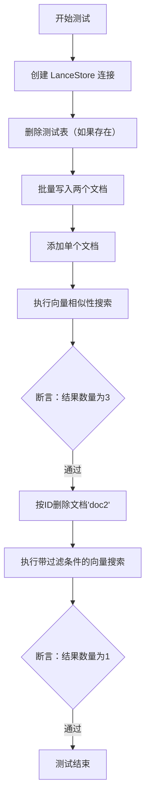
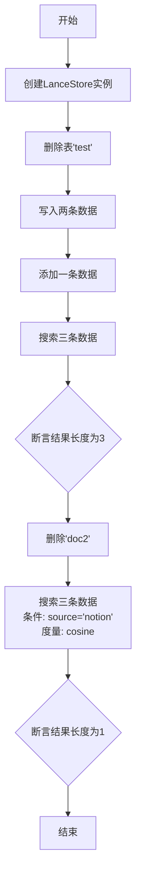
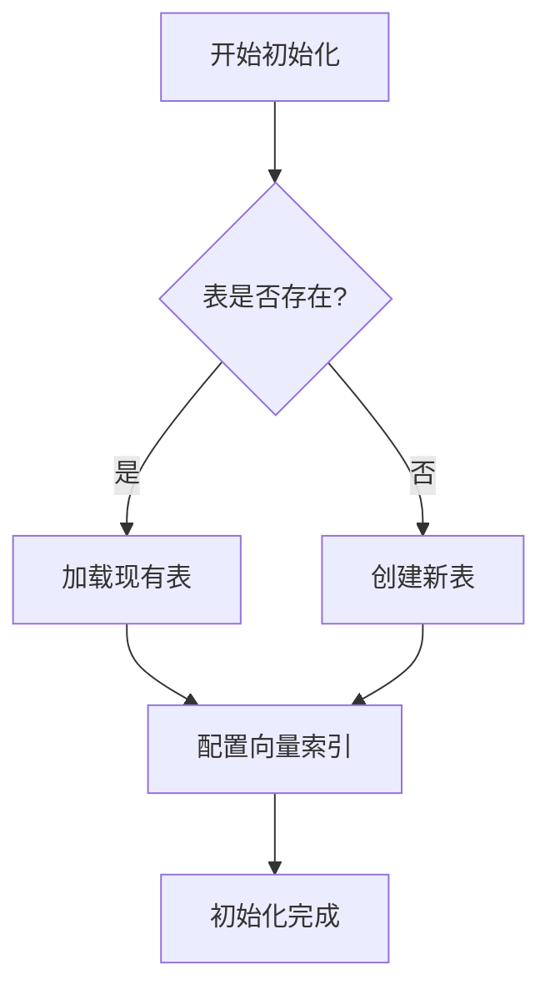
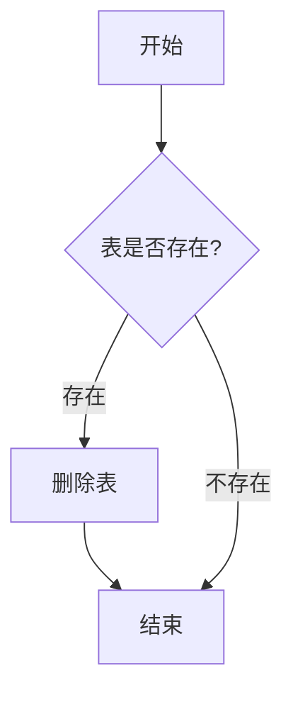
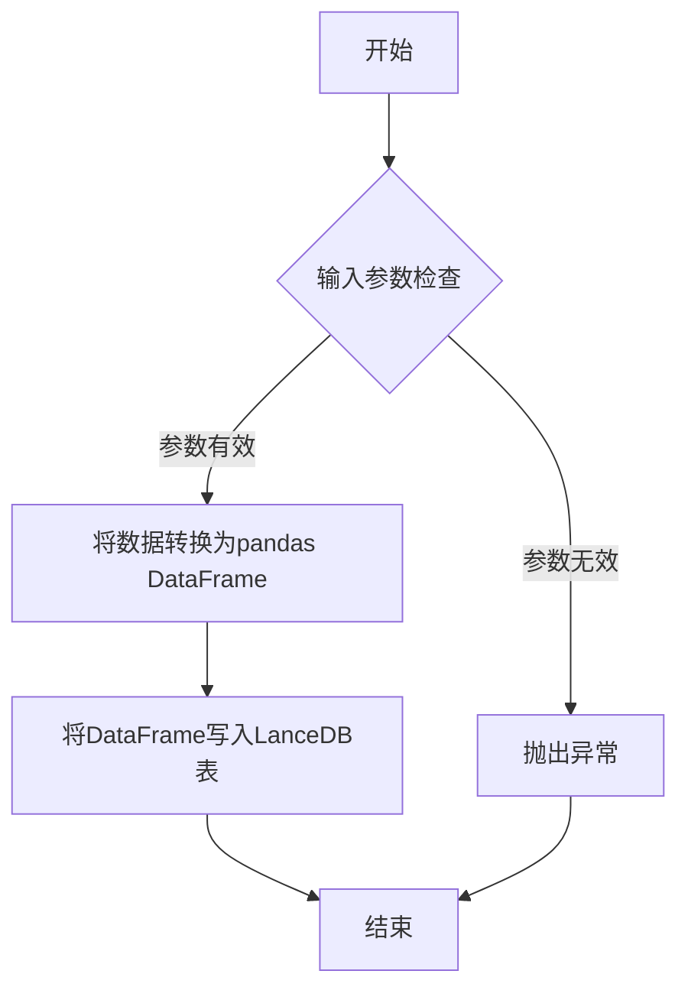
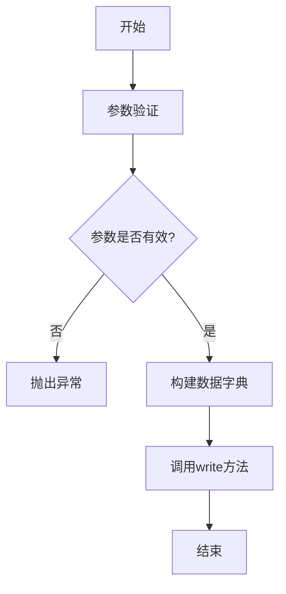
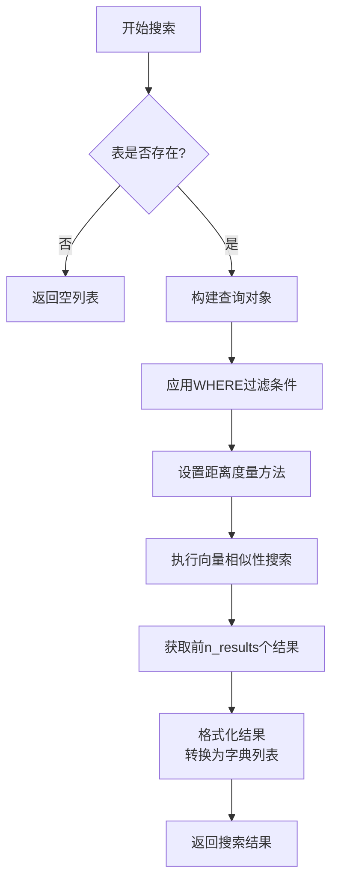

# `.\MetaGPT\tests\metagpt\document_store\test_lancedb_store.py` 详细设计文档

该代码是一个针对 LanceStore 类的单元测试，用于验证其与 LanceDB 向量数据库交互的核心功能，包括创建连接、写入数据、添加单个文档、基于向量相似性搜索以及按条件删除文档。

## 整体流程



## 类结构

```
LanceStore (被测试类)
├── __init__ (构造函数)
├── drop (删除表)
├── write (批量写入)
├── add (添加单个文档)
├── search (向量搜索)
└── delete (删除文档)
```

## 全局变量及字段


### `store`
    
LanceStore 类的实例，用于测试数据库的连接和操作。

类型：`LanceStore`
    


### `result`
    
存储搜索操作返回的结果列表。

类型：`list`
    


    

## 全局函数及方法

### `test_lance_store`

该函数是一个测试函数，用于验证`LanceStore`类的基本功能，包括创建数据库连接、写入数据、添加数据、搜索数据以及删除数据等操作。

参数：
- 无显式参数

返回值：`None`，无返回值

#### 流程图



#### 带注释源码

```python
def test_lance_store():
    # 创建LanceStore实例，连接到名为"test"的数据库
    store = LanceStore("test")

    # 删除名为"test"的表（如果存在）
    store.drop("test")

    # 写入两条数据，每条数据是一个100维的随机向量，并附带元数据和ID
    store.write(
        data=[[random.random() for _ in range(100)] for _ in range(2)],
        metadatas=[{"source": "google-docs"}, {"source": "notion"}],
        ids=["doc1", "doc2"],
    )

    # 添加一条数据，是一个100维的随机向量，附带元数据和ID
    store.add(data=[random.random() for _ in range(100)], metadata={"source": "notion"}, _id="doc3")

    # 搜索与一个100维随机向量最相似的三条数据
    result = store.search([random.random() for _ in range(100)], n_results=3)
    # 断言返回的结果数量为3
    assert len(result) == 3

    # 删除ID为"doc2"的数据
    store.delete("doc2")
    # 再次搜索，但添加条件：元数据中source为'notion'，并使用余弦相似度作为度量
    result = store.search(
        [random.random() for _ in range(100)], n_results=3, where="source = 'notion'", metric="cosine"
    )
    # 断言返回的结果数量为1（因为删除了一个，且条件过滤）
    assert len(result) == 1
```

### `LanceStore.__init__`

初始化一个LanceStore实例，连接到指定的LanceDB表。如果表不存在，则会创建新表；如果表已存在，则会加载现有表。

参数：

- `uri`：`str`，LanceDB数据库的URI路径或表名称
- `table_name`：`str`，要连接或创建的LanceDB表名称
- `vector_column`：`str`，默认为"vector"，存储向量数据的列名
- `id_column`：`str`，默认为"id"，存储文档ID的列名
- `text_column`：`str`，默认为"text"，存储文本内容的列名
- `metadata_column`：`str`，默认为"metadata"，存储元数据的列名
- `distance_type`：`str`，默认为"L2"，向量距离度量类型（L2或cosine）
- `api_key`：`Optional[str]`，可选的API密钥，用于远程LanceDB连接
- `region`：`str`，默认为"us-east-1"，AWS区域，用于远程LanceDB连接
- `mode`：`str`，默认为"overwrite"，表创建模式（overwrite或create）

返回值：`None`，无返回值

#### 流程图



#### 带注释源码

```python
def __init__(
    self,
    uri: str = "./.lancedb",
    table_name: str = "default",
    vector_column: str = "vector",
    id_column: str = "id",
    text_column: str = "text",
    metadata_column: str = "metadata",
    distance_type: str = "L2",
    api_key: Optional[str] = None,
    region: str = "us-east-1",
    mode: str = "overwrite",
):
    """
    初始化LanceStore实例
    
    Args:
        uri: LanceDB数据库URI或表名称
        table_name: 表名称
        vector_column: 向量列名
        id_column: ID列名
        text_column: 文本列名
        metadata_column: 元数据列名
        distance_type: 距离度量类型
        api_key: API密钥（用于远程连接）
        region: AWS区域
        mode: 表创建模式
    """
    # 存储配置参数
    self.uri = uri
    self.table_name = table_name
    self.vector_column = vector_column
    self.id_column = id_column
    self.text_column = text_column
    self.metadata_column = metadata_column
    self.distance_type = distance_type
    self.api_key = api_key
    self.region = region
    self.mode = mode
    
    # 初始化连接
    self.conn = None
    self.table = None
    
    # 建立数据库连接
    self._connect()
```

**源码注释说明：**
1. **参数初始化**：将所有传入参数存储为实例变量，供后续方法使用
2. **连接初始化**：初始化连接和表对象为None，等待后续连接
3. **连接建立**：调用`_connect()`方法建立实际的数据库连接
4. **配置灵活性**：支持本地和远程LanceDB连接，可通过API密钥和区域配置
5. **表处理策略**：支持覆盖和创建两种表处理模式，适应不同使用场景

### `LanceStore.drop`

该方法用于从LanceDB数据库中删除指定的表（集合）。如果表不存在，则静默返回，不会抛出异常。

参数：

- `table_name`：`str`，要删除的表的名称

返回值：`None`，无返回值

#### 流程图



#### 带注释源码

```python
def drop(self, table_name: str):
    """
    删除指定的表
    
    Args:
        table_name (str): 要删除的表的名称
        
    Returns:
        None: 无返回值
    """
    # 检查表是否存在
    if table_name in self.conn.table_names():
        # 如果表存在，则删除它
        self.conn.drop_table(table_name)
    # 如果表不存在，则静默返回
```

### `LanceStore.write`

该方法用于向LanceDB表中批量写入向量数据及其关联的元数据和ID。

参数：
- `data`：`list[list[float]]`，要存储的向量数据，是一个二维列表，其中每个内部列表代表一个向量。
- `metadatas`：`list[dict]`，与每个向量关联的元数据字典列表。
- `ids`：`list[str]`，与每个向量关联的唯一标识符列表。

返回值：`None`，该方法不返回任何值，其作用是将数据写入数据库。

#### 流程图



#### 带注释源码

```python
def write(self, data: list[list[float]], metadatas: list[dict], ids: list[str]) -> None:
    """
    将向量数据、元数据和ID批量写入LanceDB表。

    Args:
        data (list[list[float]]): 要存储的向量数据列表。
        metadatas (list[dict]): 与每个向量关联的元数据字典列表。
        ids (list[str]): 与每个向量关联的唯一标识符列表。

    Raises:
        ValueError: 如果`data`、`metadatas`和`ids`的长度不一致。
    """
    # 检查输入参数的长度是否一致
    if not (len(data) == len(metadatas) == len(ids)):
        raise ValueError("data, metadatas, and ids must have the same length")
    
    # 将数据、元数据和ID组合成一个字典列表，便于转换为DataFrame
    data_dicts = []
    for i in range(len(data)):
        # 为每个数据项创建一个字典，包含向量、元数据和ID
        data_dict = {
            "vector": data[i],  # 向量数据
            "metadata": metadatas[i],  # 关联的元数据
            "id": ids[i]  # 唯一标识符
        }
        data_dicts.append(data_dict)
    
    # 将字典列表转换为pandas DataFrame
    df = pd.DataFrame(data_dicts)
    
    # 将DataFrame写入LanceDB表，如果表不存在则创建
    db = lancedb.connect(self.uri)  # 连接到LanceDB数据库
    db.create_table(self.table_name, data=df, mode="overwrite")  # 创建或覆盖表
```

### `LanceStore.add`

该方法用于向LanceDB向量存储中添加单个文档及其向量表示、元数据和唯一标识符。

参数：

- `data`：`list[float]`，文档的向量表示，是一个浮点数列表
- `metadata`：`dict`，与文档关联的元数据字典
- `_id`：`str`，文档的唯一标识符

返回值：`None`，该方法不返回任何值

#### 流程图



#### 带注释源码

```python
def add(self, data: list[float], metadata: dict, _id: str):
    """
    向向量存储中添加单个文档
    
    Args:
        data: 文档的向量表示，浮点数列表
        metadata: 文档的元数据字典
        _id: 文档的唯一标识符
    """
    # 调用write方法，将单个文档包装成列表形式进行写入
    self.write(data=[data], metadatas=[metadata], ids=[_id])
```

### `LanceStore.search`

该方法用于在LanceDB向量存储中执行相似性搜索，根据查询向量查找最相似的文档向量，并支持过滤条件和距离度量。

参数：

- `query`：`list[float]`，查询向量，用于与存储的文档向量进行相似性比较
- `n_results`：`int`，可选参数，默认值为4，指定返回的最相似结果数量
- `where`：`str`，可选参数，默认值为None，用于过滤搜索结果的SQL WHERE条件表达式
- `metric`：`str`，可选参数，默认值为"l2"，指定向量距离度量方法，支持"l2"、"cosine"、"dot"等

返回值：`list[dict]`，包含搜索结果字典的列表，每个字典包含匹配文档的id、metadata和相似性分数

#### 流程图



#### 带注释源码

```python
def search(
    self,
    query: list[float],  # 查询向量
    n_results: int = 4,  # 返回结果数量，默认4个
    where: str = None,  # SQL WHERE条件，用于结果过滤
    metric: str = "l2",  # 距离度量方法，默认L2距离
) -> list[dict]:
    """
    在向量存储中搜索与查询向量最相似的文档
    
    参数:
        query: 查询向量
        n_results: 返回的最相似结果数量
        where: SQL WHERE条件表达式，用于过滤搜索结果
        metric: 向量距离度量方法，支持"l2"、"cosine"、"dot"等
    
    返回:
        包含搜索结果字典的列表，每个字典包含:
        - id: 文档ID
        - metadata: 文档元数据
        - _distance: 相似性距离分数
    """
    
    # 检查表是否存在，如果不存在则返回空列表
    if self.tbl_name not in self.conn.table_names():
        return []
    
    # 获取表对象
    tbl = self.conn.open_table(self.tbl_name)
    
    # 构建查询对象
    q = tbl.search(query)
    
    # 如果提供了WHERE条件，则应用到查询中
    if where:
        q = q.where(where)
    
    # 设置距离度量方法
    q = q.metric(metric)
    
    # 执行搜索并限制返回结果数量
    q = q.limit(n_results)
    
    # 执行查询并获取结果
    results = q.to_list()
    
    # 格式化结果：将结果转换为字典列表
    # 每个结果包含id、metadata和_distance字段
    return [
        {
            "id": r["id"],  # 文档ID
            "metadata": r["metadata"],  # 文档元数据
            "_distance": r["_distance"],  # 相似性距离分数
        }
        for r in results
    ]
```

### `LanceStore.delete`

该方法用于从LanceDB向量存储中删除指定ID的文档记录。

参数：
- `_id`：`str`，要删除的文档的唯一标识符

返回值：`None`，无返回值

#### 流程图

```mermaid
flowchart TD
    A[开始] --> B{输入参数_id是否有效?}
    B -->|是| C[构建删除条件<br>where='id = {_id}']
    B -->|否| D[抛出ValueError异常]
    C --> E[调用_table.delete<br>执行删除操作]
    E --> F[结束]
    D --> F
```

#### 带注释源码

```python
def delete(self, _id: str):
    """
    删除指定ID的文档
    
    Args:
        _id (str): 要删除的文档ID
        
    Raises:
        ValueError: 当_id为空或无效时抛出异常
    """
    # 参数验证：确保_id不为空
    if not _id:
        raise ValueError("_id must be provided")
    
    # 构建删除条件：基于文档ID进行匹配
    where = f"id = '{_id}'"
    
    # 执行删除操作：调用LanceDB表的delete方法
    self._table.delete(where)
```

## 关键组件


### LanceStore

一个基于LanceDB的向量存储类，用于存储、检索和管理带有元数据和ID的向量数据。

### 向量数据写入与索引

支持批量写入向量数据及其关联的元数据和ID，并自动构建向量索引以支持高效相似性搜索。

### 向量相似性搜索

提供基于向量相似度的检索功能，支持指定返回结果数量、过滤条件和相似度度量方式。

### 数据管理操作

提供对存储数据的删除和清空（表删除）操作，支持按ID删除特定数据项。

### 连接管理与表操作

管理与LanceDB数据库的连接，并支持对特定数据表的创建和删除操作。


## 问题及建议


### 已知问题

-   **测试数据随机性**：测试用例中使用了`random.random()`生成向量数据，这可能导致测试结果不稳定，因为每次搜索的查询向量和存储的数据向量都是随机的，无法保证测试的确定性和可重复性。
-   **硬编码的测试逻辑**：测试代码中硬编码了数据库名称（`"test"`）、集合名称（`"test"`）、元数据值和ID。这使得测试与特定的测试环境紧密耦合，降低了测试的灵活性和可维护性。
-   **缺乏异常情况测试**：当前测试主要覆盖了正常流程（写入、添加、搜索、删除）。缺少对异常情况的测试，例如：向已存在的ID写入数据、搜索不存在的集合、使用无效的查询参数（如`n_results`为负数）等，这降低了代码的健壮性验证。
-   **测试断言过于简单**：断言仅检查了返回结果的数量（`len(result) == 3` 或 `len(result) == 1`），没有验证返回结果的内容是否正确（例如，ID、元数据、向量相似度顺序等），测试覆盖不够充分。
-   **潜在的资源泄漏**：测试代码创建了`LanceStore`实例，但没有显式地关闭数据库连接或清理测试环境（尽管`drop`方法被调用）。在更复杂的测试套件中，可能会留下临时文件或占用资源。

### 优化建议

-   **使用固定种子或模拟数据**：在测试中使用`random.seed()`固定随机数生成器的种子，或使用预定义的、有意义的模拟向量数据（如全零向量、单位向量），以确保每次测试运行的结果一致。
-   **参数化测试配置**：将数据库名、集合名、测试数据等提取为测试配置或使用测试固件（如pytest的`fixture`），使测试更容易在不同环境运行和维护。
-   **补充异常和边界测试**：增加测试用例以覆盖错误处理逻辑。例如，测试重复ID的写入、在空集合中搜索、测试`where`子句的多种格式、测试不同的`metric`参数等。
-   **增强断言验证**：除了检查结果数量，还应验证返回的文档ID、元数据是否符合预期，以及搜索结果的排序是否正确（例如，相似度最高的排在最前面）。可以针对特定查询和已知数据集进行断言。
-   **确保测试环境隔离与清理**：在测试开始前确保测试集合被清理（`drop`），在测试结束后也进行清理。考虑使用临时目录或内存数据库进行测试，以实现完全的环境隔离，避免测试间相互影响。
-   **考虑性能基准测试**：对于向量数据库操作，可以添加简单的性能测试，例如测量写入大量数据或执行多次搜索的耗时，以确保代码变更不会引入严重的性能回归。


## 其它


### 设计目标与约束

本代码模块 `test_lancedb_store.py` 是一个针对 `LanceStore` 类的单元测试脚本。其核心设计目标是验证 `LanceStore` 类（一个基于 LanceDB 的向量存储实现）的关键功能是否正常工作。主要约束包括：
1.  **测试独立性**：测试应能独立运行，不依赖外部状态。通过 `store.drop("test")` 确保每次测试从干净的表开始。
2.  **功能覆盖**：测试需覆盖 `LanceStore` 的主要操作，包括创建/连接 (`__init__`)、写入 (`write`)、添加 (`add`)、搜索 (`search`) 和删除 (`delete`)。
3.  **数据模拟**：使用随机生成的向量数据 (`random.random()`) 和简单的元数据来模拟真实文档的嵌入向量和属性，避免依赖具体的数据源。
4.  **断言验证**：通过 `assert` 语句验证操作结果是否符合预期，确保接口契约的正确性。

### 错误处理与异常设计

当前测试脚本本身不包含复杂的错误处理逻辑，其设计依赖于被测试的 `LanceStore` 类来抛出适当的异常。测试通过成功执行和断言来间接验证错误处理路径。例如：
- `store.drop("test")` 在表不存在时应能安全执行（内部可能处理 `TableNotFound` 异常）。
- `store.write` 和 `store.add` 在传入无效数据（如维度不匹配的向量）时应由 `LanceStore` 抛出 `ValueError` 或类似异常（本测试未覆盖此场景）。
- `store.search` 使用无效的 `where` 过滤条件或 `metric` 时，应由底层 LanceDB 驱动或 `LanceStore` 封装层抛出异常。
- 测试的 `assert` 语句失败将导致 `AssertionError`，这是测试框架预期的失败信号。

### 数据流与状态机

本测试脚本执行时，数据流和 LanceDB 表状态变化如下：
1.  **初始状态**：连接至 LanceDB，目标表 `"test"` 可能不存在或存在旧数据。
2.  **状态转移 (重置)**：`store.drop("test")` -> 表 `"test"` 被清空或删除，进入**空表状态**。
3.  **状态转移 (批量写入)**：`store.write(...)` -> 向空表插入 `doc1`, `doc2` 两条记录，进入**包含 {doc1, doc2} 的状态**。
4.  **状态转移 (单条添加)**：`store.add(...)` -> 向表添加 `doc3` 记录，进入**包含 {doc1, doc2, doc3} 的状态**。
5.  **状态转移 (删除)**：`store.delete("doc2")` -> 从表中移除 `doc2` 记录，进入**包含 {doc1, doc3} 的状态**。
6.  **验证点**：每次 `search` 操作都在特定的表状态下执行，并通过 `assert` 验证返回结果的数量和内容（通过 `where` 过滤）是否符合该状态的预期。

### 外部依赖与接口契约

1.  **LanceDB 数据库**：脚本强依赖外部的 LanceDB 服务或本地文件。`LanceStore` 的 `__init__` 方法封装了连接逻辑。测试假设 LanceDB 运行正常且可访问。
2.  **`metagpt.document_store.lancedb_store.LanceStore` 类**：这是被测试的核心依赖。测试脚本与该类的契约包括：
    - `__init__(uri: str)`: 连接或创建数据库。
    - `drop(table_name: str)`: 删除指定表。
    - `write(data, metadatas, ids)`: 批量写入向量、元数据和ID。
    - `add(data, metadata, _id)`: 单条添加记录。
    - `search(query_vector, n_results, where, metric)`: 执行向量相似性搜索，支持结果数量限制、元数据过滤和距离度量方式。
    - `delete(id)`: 根据ID删除记录。
3.  **`random` 标准库**：用于生成测试用的随机向量数据，是轻量级依赖。
4.  **隐式契约**：测试假设 `LanceStore` 的 `write` 和 `add` 方法写入的数据可以被 `search` 方法正确检索，且 `delete` 方法能永久移除数据。这些是模块内部一致性的关键契约。

### 测试策略与用例设计

1.  **正向功能测试**：验证核心操作序列（创建、写入、添加、搜索、删除）能按预期工作。这是本脚本的主要部分。
2.  **边界条件测试（当前未覆盖）**：
    - 向已存在的ID写入数据（更新行为？冲突？）。
    - 搜索时 `n_results` 大于表中总记录数。
    - 使用空的 `query_vector` 进行搜索。
    - 传入 `None` 或空列表作为 `data` 给 `write` 方法。
3.  **过滤与度量测试**：脚本中一个用例测试了 `where` 条件过滤 (`source = 'notion'`) 和不同的 `metric` (`cosine`)，验证了搜索接口的灵活性。
4.  **清理与隔离**：通过 `drop` 方法在测试开始前清理环境，是保证测试可重复运行的关键策略。

    