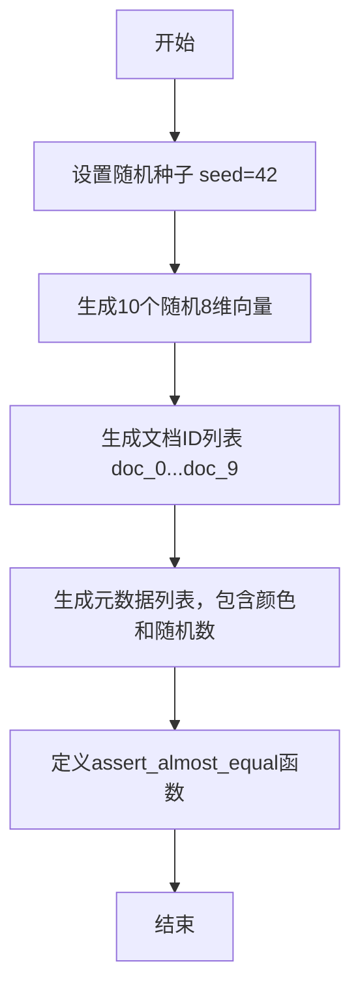

# `.\MetaGPT\tests\metagpt\document_store\test_milvus_store.py` 详细设计文档

该代码主要实现了一个简单的向量生成和断言验证功能。首先，它设置随机种子以确保可重复性，然后生成包含10个随机8维向量的列表、对应的文档ID列表以及包含颜色和随机数的元数据列表。最后，定义了一个用于验证数值近似相等的断言函数，支持对单个数值或列表进行容差比较。

## 整体流程



## 类结构

```
无类结构，纯脚本文件
├── 全局变量: seed_value, vectors, ids, metadata
└── 全局函数: assert_almost_equal
```

## 全局变量及字段


### `seed_value`
    
用于初始化随机数生成器的种子值，确保代码运行结果可复现。

类型：`int`
    


### `vectors`
    
一个包含10个向量的列表，每个向量是8个随机浮点数组成的列表，用于模拟文档的嵌入向量。

类型：`List[List[float]]`
    


### `ids`
    
一个包含10个字符串ID的列表，每个ID的格式为'doc_{i}'，用于标识对应的向量和元数据。

类型：`List[str]`
    


### `metadata`
    
一个包含10个字典的列表，每个字典包含'color'和'rand_number'两个键，用于存储与向量和ID关联的元数据。

类型：`List[Dict[str, Union[str, int]]]`
    


    

## 全局函数及方法


### `assert_almost_equal`

该函数用于断言两个数值或数值列表在指定的极小误差范围内是否相等。它主要用于单元测试或调试场景，验证浮点数计算结果的正确性，避免因浮点数精度问题导致的误判。

参数：

-  `actual`：`Union[float, List[float]]`，实际计算得到的数值或数值列表。
-  `expected`：`Union[float, List[float]]`，期望的数值或数值列表。

返回值：`None`，如果断言成功，函数正常结束；如果断言失败，则抛出 `AssertionError` 异常。

#### 流程图

```mermaid
flowchart TD
    A[开始: assert_almost_equal(actual, expected)] --> B{expected 是否为列表?};
    B -- 是 --> C[断言: len(actual) == len(expected)];
    C --> D[遍历 actual 和 expected];
    D --> E{abs(ac - exp) <= delta?};
    E -- 否 --> F[抛出 AssertionError];
    E -- 是 --> G[继续循环];
    G --> D;
    D -- 遍历完成 --> H[结束];
    B -- 否 --> I{abs(actual - expected) <= delta?};
    I -- 否 --> J[抛出 AssertionError];
    I -- 是 --> H;
```

#### 带注释源码

```python
def assert_almost_equal(actual, expected):
    # 定义允许的误差范围
    delta = 1e-10
    # 判断期望值是否为列表类型
    if isinstance(expected, list):
        # 首先断言两个列表长度相等
        assert len(actual) == len(expected)
        # 使用 zip 函数并行遍历实际值和期望值列表
        for ac, exp in zip(actual, expected):
            # 对每一对数值，检查其绝对差是否在误差范围内
            # 如果超出范围，抛出包含具体数值的 AssertionError
            assert abs(ac - exp) <= delta, f"{ac} is not within {delta} of {exp}"
    else:
        # 如果期望值不是列表，则直接比较两个数值
        # 检查其绝对差是否在误差范围内
        # 如果超出范围，抛出包含具体数值的 AssertionError
        assert abs(actual - expected) <= delta, f"{actual} is not within {delta} of {expected}"
```


## 关键组件


### 随机数生成与种子设置

通过设置随机种子确保向量生成过程的可复现性，为后续的向量数据提供确定性来源。

### 向量数据生成

生成包含10个文档的模拟向量数据集，每个向量由8个随机浮点数组成，用于模拟嵌入向量或特征向量。

### 文档标识符生成

为每个向量生成唯一的字符串标识符（如 "doc_0", "doc_1"），用于在向量数据库中关联向量与元数据。

### 元数据生成

为每个向量生成对应的元数据字典，包含固定的“color”字段和基于索引的“rand_number”字段，模拟真实场景中的附加信息。

### 数值断言函数

提供一个用于比较两个数值或列表是否近似相等的辅助函数，支持容差比较，用于单元测试或数据验证。


## 问题及建议


### 已知问题

-   **硬编码的配置和测试数据**：代码中硬编码了随机种子 (`seed_value = 42`)、向量维度 (`range(8)`)、文档数量 (`range(10)`) 以及元数据字段。这使得代码不灵活，难以复用或适应不同的测试场景或生产环境。
-   **脆弱的测试断言函数**：`assert_almost_equal` 函数仅适用于数值列表或单个数值的比较，且错误信息不够详细。它没有处理嵌套结构、字典或其他数据类型，通用性差。此外，它直接使用 `assert` 语句，在测试框架中可能无法提供最佳的失败报告。
-   **全局变量污染**：`vectors`、`ids`、`metadata` 作为全局变量定义，缺乏封装。在大型项目中，这可能导致命名冲突、意外的状态修改，并使代码的模块化和测试变得困难。
-   **缺乏模块化和抽象**：所有逻辑（数据生成、断言）都直接写在模块顶层，没有组织成函数或类。这导致代码职责不清，难以扩展和维护。

### 优化建议

-   **将配置参数化**：将随机种子、向量维度、文档数量等作为函数参数或配置文件项。例如，可以创建一个 `generate_test_data(dim, num_docs, seed)` 函数来动态生成测试数据。
-   **使用成熟的测试框架**：用 `pytest` 或 `unittest` 框架及其内置的断言方法（如 `pytest.approx`）替代自定义的 `assert_almost_equal` 函数，以获得更强大、更标准的测试功能和更清晰的错误输出。
-   **封装数据与逻辑**：将相关的数据和操作封装到类中。例如，可以创建一个 `Document` 类，包含 `id`、`vector`、`metadata` 属性，并创建一个 `TestDataset` 类来管理一组文档的生成和验证逻辑。
-   **提升代码可读性与可维护性**：为函数和类添加文档字符串（docstrings），使用有意义的变量名。将数据生成和断言逻辑分离到不同的模块或函数中，遵循单一职责原则。


## 其它


### 设计目标与约束

本代码的主要设计目标是生成一个用于测试或演示的小型向量数据集，并提供一个用于比较浮点数列表或数值的辅助断言函数。其核心约束包括：使用固定的随机种子以确保结果的可复现性；生成的数据结构（向量、ID、元数据）具有简单的预设格式和规模；断言函数采用绝对误差容限进行近似相等比较，适用于单元测试场景。

### 错误处理与异常设计

代码中的错误处理主要通过 `assert` 语句实现。`assert_almost_equal` 函数在比较失败时会抛出 `AssertionError` 异常，并附带描述性错误信息，指出哪个值超出了允许的误差范围。对于输入参数类型错误（例如，预期是列表但实际不是），该函数依赖 Python 的运行时类型检查，可能抛出 `TypeError` 或 `AttributeError`。主数据生成部分没有显式的错误处理，依赖于 Python 解释器对语法和运行时错误的默认处理。

### 数据流与状态机

数据流是线性的、无状态的：
1.  **初始化**：设置随机种子，确定随机数生成器的初始状态。
2.  **数据生成**：基于固定的随机种子，顺序生成三个列表：`vectors`（包含10个8维随机向量）、`ids`（包含10个文档ID字符串）、`metadata`（包含10个字典，每个字典包含固定的“color”键和循环的“rand_number”键）。
3.  **函数调用**：`assert_almost_equal` 函数作为独立的工具函数存在，不依赖于生成的数据。它接受输入参数，执行比较逻辑，并根据结果决定是否抛出异常。该函数没有内部状态，输出完全由输入决定。

整个流程没有循环依赖或复杂的状态转换，是一个简单的脚本执行模型。

### 外部依赖与接口契约

1.  **外部依赖**：
    *   `random` 模块：用于生成伪随机数。代码依赖于 `random.seed` 和 `random.random` 函数的行为。
    *   Python 内置类型和语句：如 `list`, `dict`, `str`, `for` 循环, `assert` 等。

2.  **接口契约**：
    *   `assert_almost_equal(actual, expected)`:
        *   **输入契约**：`actual` 和 `expected` 应为数值类型（`int` 或 `float`）或同长度的数值列表。函数内部未对非数值类型进行防御性检查。
        *   **输出契约**：如果 `actual` 与 `expected` 的每个元素（或值本身）之差的绝对值小于等于 `delta`（1e-10），则函数静默返回 `None`。否则，抛出 `AssertionError`。
        *   **副作用**：无。
    *   全局变量 `vectors`, `ids`, `metadata`：作为模块级变量导出，其结构（列表的列表、字符串列表、字典列表）和内容（基于种子42生成）构成了隐式的数据接口。

### 测试策略建议

虽然代码本身包含一个断言函数，但并未对生成的数据或函数本身进行测试。建议的测试策略包括：
1.  **单元测试**：为 `assert_almost_equal` 函数编写测试用例，覆盖数值相等、数值在容差内、数值超出容差、列表比较、长度不匹配列表比较等场景。
2.  **集成/数据一致性测试**：验证 `vectors`, `ids`, `metadata` 三个列表的长度一致性（应为10）。验证 `metadata` 中 `rand_number` 的值是否符合预期（0-9循环）。
3.  **回归测试**：由于使用了固定种子，可以捕获 `vectors` 的具体数值作为“黄金标准”，在代码修改后运行测试以确保数据生成的确定性未被破坏。

### 部署与运行说明

1.  **环境要求**：标准 Python 3 环境。无需额外第三方库。
2.  **执行方式**：该代码是一个 Python 脚本模块。可以直接运行（`python script_name.py`）以执行数据生成部分（无输出，仅定义变量），也可以被其他模块导入以使用其生成的全局变量（`vectors`, `ids`, `metadata`）或辅助函数（`assert_almost_equal`）。
3.  **配置**：唯一可配置项是 `seed_value`，修改它将完全改变生成的 `vectors` 数据。`assert_almost_equal` 中的容差值 `delta` 是硬编码的。

### 安全与合规性考虑

1.  **安全性**：代码不涉及网络、文件IO或用户输入，无显著安全风险。`random` 模块生成的是伪随机数，不适用于密码学场景。
2.  **数据合规性**：生成的数据是合成的、无意义的，不包含任何真实或个人数据，因此没有数据隐私方面的合规性问题。
3.  **许可**：依赖的 `random` 模块是 Python 标准库的一部分，遵循 PSF 许可协议。代码本身若作为项目一部分，需明确其自身的许可证。


    