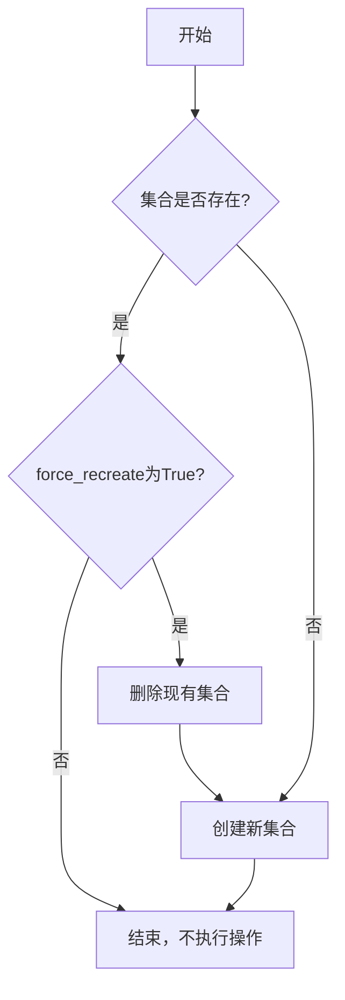
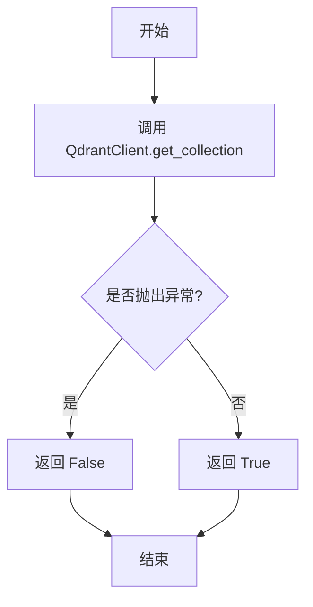
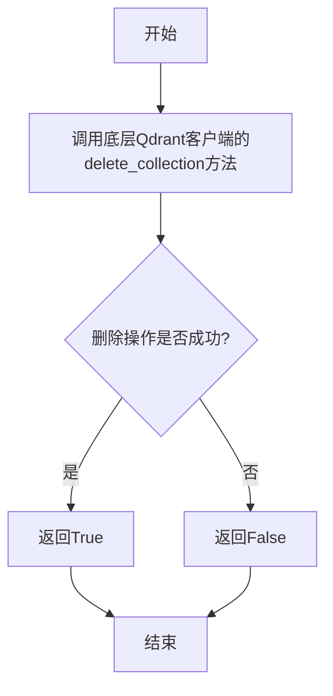
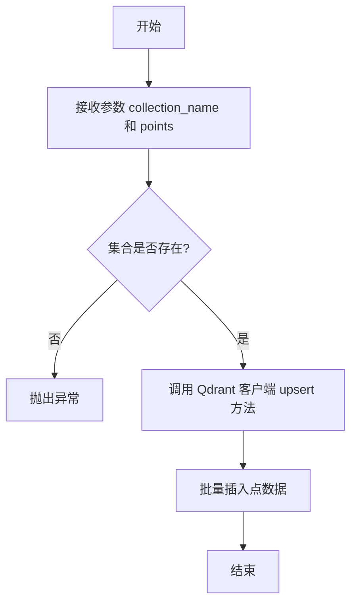
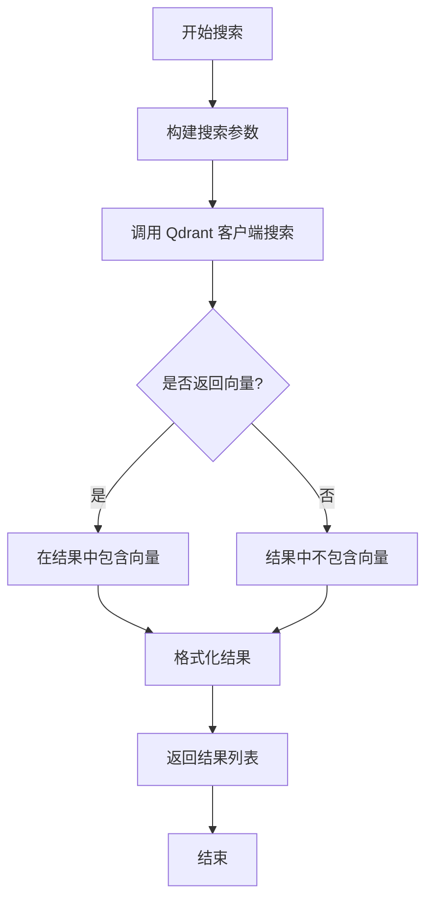

# `.\MetaGPT\tests\metagpt\document_store\test_qdrant_store.py` 详细设计文档

该文件是一个针对 QdrantStore 向量数据库存储模块的单元测试。它通过创建内存中的 Qdrant 实例，测试了集合的创建、删除、存在性检查、数据点插入以及基于向量相似度的搜索功能，包括带过滤条件和返回向量的搜索。

## 整体流程

```mermaid
graph TD
    A[开始测试] --> B[初始化随机种子，生成测试向量和点数据]
    B --> C[创建 QdrantConnection 和 QdrantStore 实例]
    C --> D[创建 'Book' 集合]
    D --> E[验证集合存在]
    E --> F[删除 'Book' 集合]
    F --> G[验证集合不存在]
    G --> H[重新创建 'Book' 集合]
    H --> I[向集合添加测试点数据]
    I --> J[执行基础向量搜索]
    J --> K[验证搜索结果 (ID 和分数)]
    I --> L[执行带返回向量的搜索]
    L --> M[验证搜索结果 (ID, 分数, 向量)]
    I --> N[执行带过滤条件 (rand_number >= 8) 的搜索]
    N --> O[验证过滤搜索结果]
    I --> P[执行带过滤条件且返回向量的搜索]
    P --> Q[验证过滤搜索的向量结果]
    K & M & O & Q --> R[测试结束]
```

## 类结构

```
测试文件 (test_qdrant_store.py)
├── 全局函数
│   ├── assert_almost_equal
│   └── test_qdrant_store
├── 外部导入类 (来自 metagpt.document_store.qdrant_store)
│   ├── QdrantConnection
│   └── QdrantStore
└── 外部导入模型 (来自 qdrant_client.models)
    ├── Distance
    ├── FieldCondition
    ├── Filter
    ├── PointStruct
    ├── Range
    └── VectorParams
```

## 全局变量及字段


### `seed_value`
    
用于设置随机数生成器的种子值，确保测试的可重复性

类型：`int`
    


### `vectors`
    
包含10个随机二维向量的列表，用于测试向量存储功能

类型：`List[List[float]]`
    


### `points`
    
包含向量数据和元数据（payload）的点结构列表，用于测试向量的添加和检索

类型：`List[PointStruct]`
    


    

## 全局函数及方法

### `assert_almost_equal`

该函数用于断言两个数值或数值列表在指定的误差范围内近似相等。它通过计算实际值与期望值之间的绝对差，并与一个预设的微小阈值（delta）进行比较，来判断两者是否近似相等。如果比较的是列表，则逐个元素进行比较。

参数：

- `actual`：`Any`，实际值，可以是单个数值或数值列表。
- `expected`：`Any`，期望值，可以是单个数值或数值列表，类型需与`actual`一致。

返回值：`None`，无返回值。如果断言失败，将抛出`AssertionError`异常。

#### 流程图

```mermaid
graph TD
    A[开始] --> B{expected是否为列表?}
    B -- 是 --> C[断言actual与expected长度相等]
    C --> D[遍历actual和expected]
    D --> E{abs(ac - exp) <= delta?}
    E -- 否 --> F[抛出AssertionError]
    E -- 是 --> G[继续遍历]
    G --> D
    D -- 遍历结束 --> H[结束]
    B -- 否 --> I{abs(actual - expected) <= delta?}
    I -- 否 --> J[抛出AssertionError]
    I -- 是 --> H
```

#### 带注释源码

```python
def assert_almost_equal(actual, expected):
    # 定义允许的最大误差阈值
    delta = 1e-10
    # 判断期望值是否为列表类型
    if isinstance(expected, list):
        # 断言实际值与期望值列表长度相等
        assert len(actual) == len(expected)
        # 遍历实际值和期望值的每个元素
        for ac, exp in zip(actual, expected):
            # 断言每个元素对的绝对差在误差阈值内
            assert abs(ac - exp) <= delta, f"{ac} is not within {delta} of {exp}"
    else:
        # 对于非列表类型，直接断言两个值的绝对差在误差阈值内
        assert abs(actual - expected) <= delta, f"{actual} is not within {delta} of {expected}"
```

### `test_qdrant_store`

该函数是一个单元测试，用于验证`QdrantStore`类的基本功能，包括集合的创建、删除、存在性检查、数据点的添加以及基于向量相似性的搜索功能。测试通过预设的随机向量和点数据，执行一系列操作并断言结果是否符合预期，以确保`QdrantStore`与Qdrant向量数据库的交互正确无误。

参数：
- 无参数

返回值：`None`，该函数不返回任何值，其目的是通过断言（assert）语句验证功能正确性，若所有断言通过则测试成功，否则抛出异常。

#### 流程图

```mermaid
flowchart TD
    A[开始测试] --> B[创建QdrantConnection<br>（内存模式）]
    B --> C[定义向量配置<br>（尺寸2，余弦距离）]
    C --> D[创建QdrantStore实例]
    D --> E[创建集合'Book'<br>（强制重建）]
    E --> F{断言集合存在}
    F -->|True| G[删除集合'Book']
    G --> H{断言集合不存在}
    H -->|False| I[重新创建集合'Book']
    I --> J{断言集合存在}
    J -->|True| K[向集合添加预设点数据]
    K --> L[执行基础搜索<br>（查询向量[1.0, 1.0]）]
    L --> M{断言前两个结果<br>ID和分数正确}
    M -->|True| N[执行带向量返回的搜索]
    N --> O{断言结果包含<br>正确的向量数据}
    O -->|True| P[执行带过滤条件的搜索<br>（rand_number >= 8）]
    P --> Q{断言过滤后结果<br>ID和分数正确}
    Q -->|True| R[执行带过滤和向量返回的搜索]
    R --> S{断言过滤后结果<br>向量数据正确}
    S -->|True| T[测试通过]
    
    F -->|False| U[断言失败，测试终止]
    H -->|True| U
    J -->|False| U
    M -->|False| U
    O -->|False| U
    Q -->|False| U
    S -->|False| U
```

#### 带注释源码

```python
def test_qdrant_store():
    # 1. 初始化连接与存储对象
    # 创建一个基于内存的Qdrant连接，避免依赖外部数据库服务
    qdrant_connection = QdrantConnection(memory=True)
    # 定义向量索引的配置：维度为2，使用余弦相似度作为距离度量
    vectors_config = VectorParams(size=2, distance=Distance.COSINE)
    # 使用上方的连接实例化一个QdrantStore对象
    qdrant_store = QdrantStore(qdrant_connection)

    # 2. 测试集合的创建、存在性检查与删除
    # 强制重新创建一个名为'Book'的集合
    qdrant_store.create_collection("Book", vectors_config, force_recreate=True)
    # 断言集合'Book'已被成功创建
    assert qdrant_store.has_collection("Book") is True
    # 删除刚刚创建的集合
    qdrant_store.delete_collection("Book")
    # 断言集合'Book'已被成功删除
    assert qdrant_store.has_collection("Book") is False
    # 再次创建集合'Book'（这次不强制重建）
    qdrant_store.create_collection("Book", vectors_config)
    # 断言集合'Book'再次存在
    assert qdrant_store.has_collection("Book") is True

    # 3. 测试数据添加与基础搜索
    # 将预定义的points（包含id、vector和payload）添加到'Book'集合中
    qdrant_store.add("Book", points)
    # 使用查询向量[1.0, 1.0]进行相似性搜索，默认返回最相似的两个结果
    results = qdrant_store.search("Book", query=[1.0, 1.0])
    # 断言第一个结果的id为2，分数接近预期值（使用自定义的近似相等断言）
    assert results[0]["id"] == 2
    assert_almost_equal(results[0]["score"], 0.999106722578389)
    # 断言第二个结果的id为7，分数接近预期值
    assert results[1]["id"] == 7
    assert_almost_equal(results[1]["score"], 0.9961650411397226)

    # 4. 测试搜索并返回向量
    # 再次搜索，但要求返回结果中的向量数据
    results = qdrant_store.search("Book", query=[1.0, 1.0], return_vector=True)
    # 断言第一个结果的id、分数和向量数据都符合预期
    assert results[0]["id"] == 2
    assert_almost_equal(results[0]["score"], 0.999106722578389)
    assert_almost_equal(results[0]["vector"], [0.7363563179969788, 0.6765939593315125])
    # 断言第二个结果的id、分数和向量数据都符合预期
    assert results[1]["id"] == 7
    assert_almost_equal(results[1]["score"], 0.9961650411397226)
    assert_almost_equal(results[1]["vector"], [0.7662628889083862, 0.6425272226333618])

    # 5. 测试带过滤条件的搜索
    # 构建一个过滤器：只搜索payload中'rand_number'字段大于等于8的点
    query_filter = Filter(must=[FieldCondition(key="rand_number", range=Range(gte=8))])
    # 执行带此过滤条件的搜索
    results = qdrant_store.search(
        "Book",
        query=[1.0, 1.0],
        query_filter=query_filter,
    )
    # 断言过滤后的第一个结果是id为8的点，分数符合预期
    assert results[0]["id"] == 8
    assert_almost_equal(results[0]["score"], 0.9100373450784073)
    # 断言过滤后的第二个结果是id为9的点，分数符合预期
    assert results[1]["id"] == 9
    assert_almost_equal(results[1]["score"], 0.7127610621127889)

    # 6. 测试带过滤条件并返回向量的搜索
    # 执行同样的过滤搜索，但要求返回向量
    results = qdrant_store.search(
        "Book",
        query=[1.0, 1.0],
        query_filter=query_filter,
        return_vector=True,
    )
    # 断言两个结果的向量数据符合预期
    assert_almost_equal(results[0]["vector"], [0.35037919878959656, 0.9366079568862915])
    assert_almost_equal(results[1]["vector"], [0.9999677538871765, 0.00802854634821415])
    # 所有断言通过，函数执行完毕，测试成功。
```

### `QdrantStore.create_collection`

该方法用于在Qdrant向量数据库中创建一个新的集合（collection）。它允许指定集合的名称、向量配置参数，并可选地强制重新创建已存在的集合。

参数：

- `collection_name`：`str`，要创建的集合的名称。
- `vectors_config`：`VectorParams`，定义向量维度和距离度量方式的配置对象。
- `force_recreate`：`bool`，可选参数，默认为`False`。如果为`True`，则当集合已存在时会先删除再创建；如果为`False`且集合已存在，则不会执行任何操作。

返回值：`None`，该方法不返回任何值，仅执行创建集合的操作。

#### 流程图



#### 带注释源码

```python
def create_collection(self, collection_name: str, vectors_config: VectorParams, force_recreate: bool = False):
    """
    创建集合。

    Args:
        collection_name (str): 集合名称。
        vectors_config (VectorParams): 向量配置。
        force_recreate (bool): 如果为True，则强制重新创建集合。
    """
    # 检查集合是否已存在
    if self.has_collection(collection_name):
        # 如果集合存在且force_recreate为True，则先删除再创建
        if force_recreate:
            self.delete_collection(collection_name)
        else:
            # 如果force_recreate为False，则直接返回，不执行任何操作
            return
    # 调用Qdrant客户端的create_collection方法创建新集合
    self.client.create_collection(collection_name, vectors_config=vectors_config)
```

### `QdrantStore.has_collection`

该方法用于检查指定的集合（Collection）是否存在于 Qdrant 向量数据库中。

参数：

- `collection_name`：`str`，要检查的集合名称

返回值：`bool`，如果集合存在则返回 `True`，否则返回 `False`

#### 流程图



#### 带注释源码

```python
def has_collection(self, collection_name: str) -> bool:
    """
    检查集合是否存在。

    Args:
        collection_name (str): 要检查的集合名称

    Returns:
        bool: 如果集合存在则返回 True，否则返回 False
    """
    try:
        # 尝试获取指定名称的集合信息
        self.client.get_collection(collection_name)
        return True  # 如果成功获取，说明集合存在
    except Exception:
        return False  # 如果抛出异常，说明集合不存在
```

### `QdrantStore.delete_collection`

该方法用于删除Qdrant向量数据库中的一个指定集合（collection）。它通过调用底层Qdrant客户端的`delete_collection`方法来实现删除操作，并返回一个布尔值表示操作是否成功。

参数：

- `collection_name`：`str`，要删除的集合的名称。

返回值：`bool`，如果集合删除成功则返回`True`，否则返回`False`。

#### 流程图



#### 带注释源码

```python
def delete_collection(self, collection_name: str) -> bool:
    """
    删除指定的集合。

    Args:
        collection_name (str): 要删除的集合的名称。

    Returns:
        bool: 如果集合删除成功则返回True，否则返回False。
    """
    # 调用底层Qdrant客户端的delete_collection方法删除指定集合
    result = self.client.delete_collection(collection_name=collection_name)
    # 返回操作结果（布尔值）
    return result
```

### `QdrantStore.add`

该方法用于向指定的 Qdrant 集合中添加一组向量点（PointStruct）。它接收集合名称和点列表作为参数，通过内部的 Qdrant 客户端将数据批量插入到向量数据库中。

参数：
- `collection_name`：`str`，目标集合的名称，用于指定数据将被添加到哪个集合中。
- `points`：`List[PointStruct]`，要添加的向量点列表，每个点包含 ID、向量和可选的负载数据。

返回值：`None`，该方法不返回任何值，仅执行数据插入操作。

#### 流程图



#### 带注释源码

```python
def add(self, collection_name: str, points: List[PointStruct]) -> None:
    """
    向指定集合中添加点。

    Args:
        collection_name (str): 目标集合的名称。
        points (List[PointStruct]): 要添加的点列表。

    Raises:
        ValueError: 如果集合不存在。
    """
    # 检查集合是否存在，如果不存在则抛出异常
    if not self.has_collection(collection_name):
        raise ValueError(f"Collection {collection_name} does not exist.")
    
    # 调用 Qdrant 客户端的 upsert 方法，批量插入点数据
    self.client.upsert(collection_name=collection_name, points=points)
```

### `QdrantStore.search`

该方法用于在指定的 Qdrant 集合中执行向量相似性搜索，根据查询向量查找最相似的向量点，并支持结果过滤和向量返回。

参数：

- `collection_name`：`str`，要搜索的集合名称。
- `query`：`List[float]`，查询向量，用于计算相似性。
- `query_filter`：`Optional[Filter]`，可选的过滤条件，用于筛选搜索结果。
- `limit`：`int`，返回结果的最大数量，默认为 10。
- `return_vector`：`bool`，是否在结果中返回向量，默认为 False。

返回值：`List[Dict[str, Any]]`，返回一个字典列表，每个字典包含匹配点的信息（如 ID、分数、有效载荷和可选的向量）。

#### 流程图



#### 带注释源码

```python
def search(
    self,
    collection_name: str,
    query: List[float],
    query_filter: Optional[Filter] = None,
    limit: int = 10,
    return_vector: bool = False,
) -> List[Dict[str, Any]]:
    """
    在指定集合中执行向量相似性搜索。

    Args:
        collection_name (str): 要搜索的集合名称。
        query (List[float]): 查询向量。
        query_filter (Optional[Filter]): 可选的过滤条件。
        limit (int): 返回结果的最大数量，默认为 10。
        return_vector (bool): 是否在结果中返回向量，默认为 False。

    Returns:
        List[Dict[str, Any]]: 包含匹配点信息的字典列表。
    """
    # 调用 Qdrant 客户端的 search 方法执行搜索
    results = self.client.search(
        collection_name=collection_name,
        query_vector=query,
        query_filter=query_filter,
        limit=limit,
        with_payload=True,
        with_vectors=return_vector,  # 根据参数决定是否返回向量
    )
    # 将搜索结果格式化为字典列表
    return [
        {
            "id": hit.id,  # 点的 ID
            "score": hit.score,  # 相似性分数
            "payload": hit.payload,  # 点的有效载荷（元数据）
            "vector": hit.vector if return_vector else None,  # 可选的向量
        }
        for hit in results
    ]
```

## 关键组件


### QdrantStore

QdrantStore 是一个封装了 Qdrant 向量数据库核心操作的类，提供了集合（collection）的创建、删除、存在性检查、数据写入和向量相似性搜索等功能，是连接上层应用与底层向量数据库的桥梁。

### QdrantConnection

QdrantConnection 是 Qdrant 客户端连接的封装，负责管理与 Qdrant 服务（或内存实例）的通信，为 QdrantStore 提供底层的连接支持。

### VectorParams

VectorParams 定义了向量集合的参数，包括向量的维度大小（size）和用于计算相似度的距离度量方法（distance），如余弦相似度（COSINE）。

### PointStruct

PointStruct 定义了存入 Qdrant 数据库的单个数据点的结构，包含唯一标识符（id）、向量数据（vector）以及可选的附加信息载荷（payload）。

### Filter 与 FieldCondition

Filter 和 FieldCondition 共同构成了 Qdrant 的查询过滤器。Filter 用于组合多个过滤条件，而 FieldCondition 定义了基于载荷（payload）中特定字段（如 `rand_number`）的范围（Range）进行过滤的具体条件，用于在向量搜索时筛选结果。

### 向量相似性搜索

这是代码的核心功能，通过 `QdrantStore.search` 方法实现。它接受一个查询向量，在指定的集合中查找最相似的向量点，并支持通过过滤器进行条件筛选，以及选择是否在返回结果中包含向量数据本身。


## 问题及建议


### 已知问题

-   **测试数据与断言耦合过紧**：测试用例 `test_qdrant_store` 中的断言依赖于随机生成的特定向量数据 (`seed_value = 42`)。如果底层向量生成逻辑或 Qdrant 的相似度计算算法发生微小变化，即使功能正确，测试也可能失败，导致测试脆弱。
-   **缺乏对异常和错误路径的测试**：当前测试仅覆盖了正常的功能流程（创建集合、添加数据、搜索）。没有测试边界情况（如空集合搜索）、错误输入（如无效的集合名、向量维度不匹配）或异常处理（如连接失败、重复创建集合等）。
-   **测试函数职责过多**：`test_qdrant_store` 函数同时测试了集合管理（创建、检查存在性、删除）和数据操作（添加、搜索），违反了单元测试的单一职责原则，不利于问题定位和测试维护。
-   **硬编码的测试数据**：测试中使用的集合名称 `"Book"`、向量维度 `2`、查询向量 `[1.0, 1.0]` 以及预期的 ID 和分数都是硬编码的。这使得测试不易理解其意图，也难以复用或扩展。
-   **缺少资源清理**：测试在结束时没有显式地清理或关闭 `QdrantConnection`。虽然使用了内存模式，但在更复杂的测试场景或使用持久化存储时，可能造成资源泄漏或测试间相互污染。

### 优化建议

-   **解耦测试数据与断言**：使用更健壮的断言方式。例如，对于搜索测试，可以断言返回的结果数量正确、结果按分数降序排列、或者特定 ID 存在于结果中，而不是依赖于精确的分数和顺序。对于分数，可以断言其在合理范围内（如 > 0.9），而不是精确匹配一个浮点数。
-   **补充异常和边界测试**：增加独立的测试用例，专门测试错误处理。例如：`test_search_nonexistent_collection`, `test_add_points_with_invalid_dimension`, `test_create_existing_collection_without_force` 等。使用 `pytest.raises` 来验证是否抛出了预期的异常。
-   **拆分测试函数**：将 `test_qdrant_store` 拆分为多个独立的测试函数，如 `test_collection_lifecycle`（创建、存在性检查、删除）、`test_add_and_search`、`test_search_with_filter`、`test_search_return_vector` 等。每个函数只关注一个特定的功能点。
-   **使用测试夹具和参数化**：利用 `pytest` 的 `@pytest.fixture` 来管理 `QdrantConnection` 和 `QdrantStore` 的创建与销毁，确保测试隔离。使用 `@pytest.mark.parametrize` 来测试不同的查询向量和过滤器条件，提高测试覆盖率和代码简洁性。
-   **明确测试意图并改进清理**：在测试函数或模块的 `teardown` 阶段，确保删除测试中创建的所有集合，并关闭连接。对于硬编码的值，可以定义为模块级常量并附上注释，说明其代表的意义，或者使用更具描述性的变量名。
-   **考虑集成测试标签**：由于该测试需要启动一个（内存中的）Qdrant 服务，它本质上是一个集成测试。建议使用 `pytest` 的标记功能（如 `@pytest.mark.integration`）将其与纯单元测试区分开，以便在快速测试周期中灵活选择是否运行。


## 其它


### 设计目标与约束

本代码是一个针对 `QdrantStore` 类的单元测试文件。其核心设计目标是验证 `QdrantStore` 类（一个基于 Qdrant 向量数据库的封装存储类）的核心功能是否正确实现，包括集合的创建、删除、存在性检查、数据插入以及向量相似性搜索（支持过滤条件和返回向量）。约束条件包括：1) 测试环境应独立，使用内存模式（`memory=True`）以避免依赖外部 Qdrant 服务；2) 测试数据使用固定随机种子以确保结果的可复现性；3) 断言使用自定义的 `assert_almost_equal` 函数处理浮点数比较，以应对计算中的微小误差。

### 错误处理与异常设计

测试代码本身不包含复杂的业务逻辑错误处理，其主要通过 `assert` 语句验证预期行为。潜在的异常来源包括：
1.  **Qdrant客户端异常**：`QdrantConnection` 或 `QdrantStore` 的方法（如 `create_collection`, `add`, `search`）可能因内部错误（如无效参数、连接问题）抛出 Qdrant 客户端库或网络相关的异常。测试用例期望这些方法在正常测试数据下成功执行，否则测试将失败。
2.  **断言失败**：当实际结果与预期值（如集合存在性、搜索返回的ID和分数）不匹配时，`assert` 语句会触发 `AssertionError`，标志着测试用例失败。自定义的 `assert_almost_equal` 函数专门用于处理浮点数的近似相等比较。

测试的设计并未显式捕获和处理这些异常，而是让它们暴露出来，以准确反映被测试代码 (`QdrantStore`) 在给定输入下的行为是否符合预期。

### 数据流与状态机

本测试遵循一个线性的、有状态的数据流，模拟了对一个向量集合的完整操作生命周期：
1.  **初始化与准备**：设置随机种子，生成固定的测试向量和点数据。
2.  **环境搭建**：创建内存中的 `QdrantConnection` 和 `QdrantStore` 实例。
3.  **集合生命周期测试**：
    *   **状态：不存在 -> 存在**：`create_collection` (带 `force_recreate=True`) -> `has_collection` 验证为 True。
    *   **状态：存在 -> 不存在**：`delete_collection` -> `has_collection` 验证为 False。
    *   **状态：不存在 -> 存在**：再次 `create_collection` -> `has_collection` 验证为 True。
4.  **数据操作测试**：
    *   **写入**：通过 `add` 方法将预先生成的 `points` 插入到“Book”集合中。
5.  **查询验证测试**：
    *   **基础搜索**：对查询向量 `[1.0, 1.0]` 执行 `search`，验证返回的前两个结果的ID和相似度分数。
    *   **带向量返回的搜索**：执行 `search` 并设置 `return_vector=True`，验证返回结果的ID、分数和具体的向量值。
    *   **带过滤条件的搜索**：执行 `search` 并添加过滤器（`rand_number >= 8`），验证返回结果的ID和分数。
    *   **带过滤和向量返回的搜索**：组合过滤条件和 `return_vector=True`，验证返回结果的向量值。

数据流从静态的测试数据开始，经过存储组件的状态变迁和数据操作，最终通过查询接口输出结果，并与硬编码的预期值进行比对。整个流程构成了对 `QdrantStore` 关键功能的状态转移验证。

### 外部依赖与接口契约

1.  **外部库依赖**：
    *   `qdrant_client.models`：提供了 Qdrant 数据模型的定义（如 `PointStruct`, `VectorParams`, `Filter`, `FieldCondition`, `Range`, `Distance`）。测试用例使用这些模型来构造请求参数和预期数据结构。
    *   `metagpt.document_store.qdrant_store`：这是被测试的主体模块，测试依赖于其公开的接口 `QdrantConnection` 和 `QdrantStore` 类及其方法。
    *   `random`：用于生成可复现的测试向量数据。

2.  **接口契约（测试对象 `QdrantStore` 的预期行为）**：
    *   `create_collection(collection_name, vectors_config, force_recreate=False)`: 应能创建集合，当 `force_recreate=True` 时能覆盖已存在的同名集合。
    *   `has_collection(collection_name)`: 应能准确返回集合是否存在。
    *   `delete_collection(collection_name)`: 应能删除指定集合。
    *   `add(collection_name, points)`: 应能将点数据列表成功插入指定集合。
    *   `search(collection_name, query, query_filter=None, return_vector=False)`: 应能根据查询向量进行相似性搜索，可选地应用过滤条件，并可选地返回存储的向量。返回结果应为字典列表，每个字典包含 `id`, `score` 键，如果 `return_vector=True` 则还包含 `vector` 键。

3.  **环境假设**：
    *   测试通过 `QdrantConnection(memory=True)` 在内存中运行，不依赖外部 Qdrant 服务器。这构成了一个封闭的测试环境契约。


    