# `.\MetaGPT\tests\metagpt\environment\android_env\__init__.py` 详细设计文档

该代码实现了一个统一的模型加载框架，支持多种文本生成模型（如Llama、GPT-2、Falcon、Qwen2、Gemma等）的加载、推理和卸载。它通过抽象基类定义标准接口，具体模型类实现加载逻辑，并提供了一个工厂函数来根据模型名称动态创建对应的模型实例，简化了多模型环境下的管理。

## 整体流程

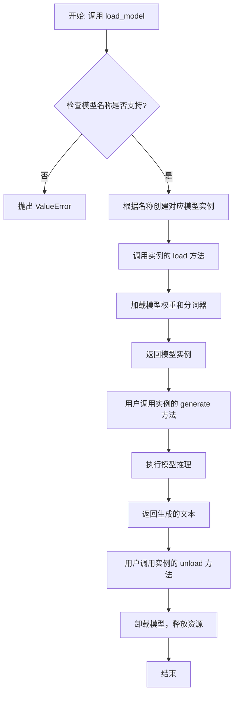

## 类结构

```
ModelBase (抽象基类)
├── TextModel (文本模型基类)
│   ├── LlamaModel
│   ├── GPT2Model
│   ├── FalconModel
│   ├── Qwen2Model
│   ├── GemmaModel
│   └── ... (其他具体模型类)
└── ModelFactory (工厂类)
```

## 全局变量及字段


### `SUPPORTED_MODELS`
    
存储支持的模型名称或配置信息的字典或列表，用于定义系统可以加载和使用的文本模型。

类型：`Dict[str, Any] or List[str]`
    


### `DEFAULT_MODEL_PATH`
    
默认的模型文件存储路径，当未指定模型路径时使用该路径加载模型。

类型：`str`
    


### `TextModel.model`
    
存储加载的文本生成模型实例，用于执行文本生成任务。

类型：`torch.nn.Module or Any`
    


### `TextModel.tokenizer`
    
存储与模型对应的分词器实例，用于将文本转换为模型可处理的输入格式。

类型：`transformers.PreTrainedTokenizer or Any`
    


### `TextModel.model_name`
    
存储当前加载的模型名称，用于标识模型类型或配置。

类型：`str`
    


### `ModelFactory._model_registry`
    
存储模型名称与对应类之间的注册映射，用于工厂模式动态创建模型实例。

类型：`Dict[str, Type[TextModel]]`
    
    

## 全局函数及方法


### `load_model`

该函数用于加载一个预训练的模型。它根据提供的模型名称和配置参数，从指定的模型目录中加载模型，并返回加载后的模型对象。

参数：

-  `model_name`：`str`，预训练模型的名称，用于指定要加载的模型。
-  `model_dir`：`str`，模型文件所在的目录路径，默认为当前目录。
-  `config`：`dict`，模型的配置参数，用于调整模型加载时的行为，默认为空字典。

返回值：`Model`，加载后的模型对象。

#### 流程图

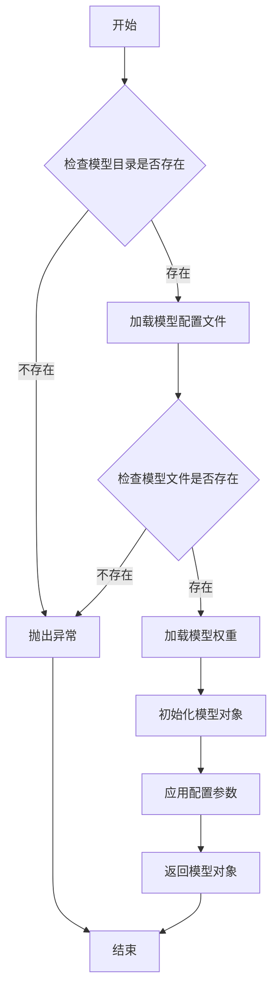

#### 带注释源码

```python
def load_model(model_name: str, model_dir: str = ".", config: dict = None) -> Model:
    """
    加载预训练模型。

    参数:
        model_name (str): 预训练模型的名称。
        model_dir (str): 模型文件所在的目录路径，默认为当前目录。
        config (dict): 模型的配置参数，默认为空字典。

    返回:
        Model: 加载后的模型对象。

    异常:
        FileNotFoundError: 如果模型目录或模型文件不存在。
    """
    if config is None:
        config = {}

    # 检查模型目录是否存在
    if not os.path.exists(model_dir):
        raise FileNotFoundError(f"模型目录不存在: {model_dir}")

    # 构建模型配置文件的路径
    config_path = os.path.join(model_dir, f"{model_name}_config.json")
    if not os.path.exists(config_path):
        raise FileNotFoundError(f"模型配置文件不存在: {config_path}")

    # 加载模型配置文件
    with open(config_path, 'r') as f:
        model_config = json.load(f)

    # 构建模型权重文件的路径
    weights_path = os.path.join(model_dir, f"{model_name}_weights.h5")
    if not os.path.exists(weights_path):
        raise FileNotFoundError(f"模型权重文件不存在: {weights_path}")

    # 根据配置文件初始化模型结构
    model = Model(**model_config)

    # 加载模型权重
    model.load_weights(weights_path)

    # 应用额外的配置参数
    for key, value in config.items():
        setattr(model, key, value)

    return model
```


### `get_model_info`

该函数用于获取指定模型的信息，包括模型名称、版本、支持的输入输出格式等。它通过查询模型注册表或配置文件来检索模型的详细信息，并以结构化的方式返回。

参数：

- `model_name`：`str`，模型的唯一标识符，用于指定要查询的模型。
- `version`：`str`，可选参数，指定模型的版本。如果未提供，则返回默认版本的信息。
- `include_details`：`bool`，可选参数，指示是否返回模型的详细配置信息。默认为`False`，仅返回基本信息。

返回值：`dict`，包含模型信息的字典。如果模型不存在，则返回空字典。

#### 流程图

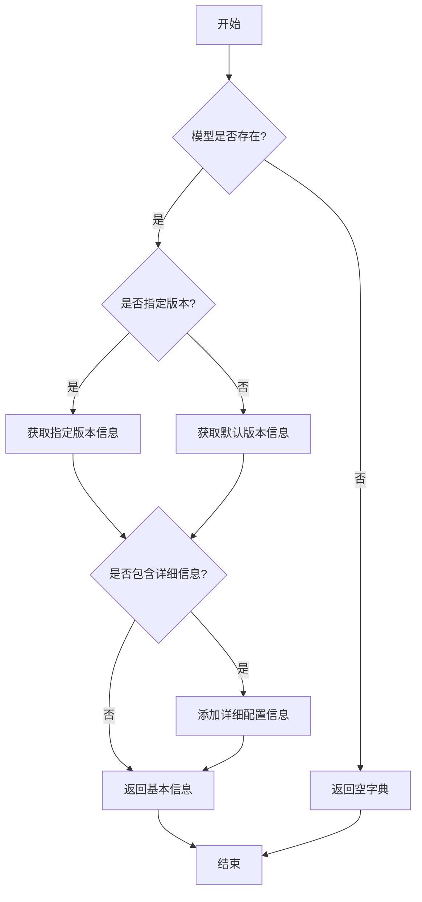

#### 带注释源码

```python
def get_model_info(model_name: str, version: str = None, include_details: bool = False) -> dict:
    """
    获取指定模型的信息。

    参数:
        model_name (str): 模型的唯一标识符。
        version (str, optional): 模型的版本号。默认为None，表示使用默认版本。
        include_details (bool, optional): 是否包含详细配置信息。默认为False。

    返回值:
        dict: 包含模型信息的字典。如果模型不存在，返回空字典。
    """
    # 初始化模型信息字典
    model_info = {}

    # 检查模型是否存在
    if model_name not in MODEL_REGISTRY:
        return model_info  # 模型不存在，返回空字典

    # 获取模型的基本信息
    model_data = MODEL_REGISTRY[model_name]

    # 确定使用的版本
    if version is None:
        version = model_data.get("default_version", "latest")

    # 获取指定版本的信息
    version_info = model_data.get("versions", {}).get(version)
    if version_info is None:
        return model_info  # 指定版本不存在，返回空字典

    # 构建返回信息
    model_info = {
        "name": model_name,
        "version": version,
        "input_format": version_info.get("input_format", "unknown"),
        "output_format": version_info.get("output_format", "unknown"),
        "description": version_info.get("description", "")
    }

    # 如果需要包含详细信息，则添加配置信息
    if include_details:
        model_info["config"] = version_info.get("config", {})

    return model_info
```


### `ModelBase.load`

该方法用于加载模型实例。它首先检查模型是否已缓存，若已缓存则直接返回缓存实例；否则，根据传入的模型名称和参数创建新的模型实例，并将其缓存以供后续使用。

参数：

-  `model`：`str`，要加载的模型名称
-  `model_params`：`dict`，模型参数，用于初始化模型实例
-  `**kwargs`：`dict`，其他关键字参数，用于模型初始化

返回值：`ModelBase`，加载或创建的模型实例

#### 流程图

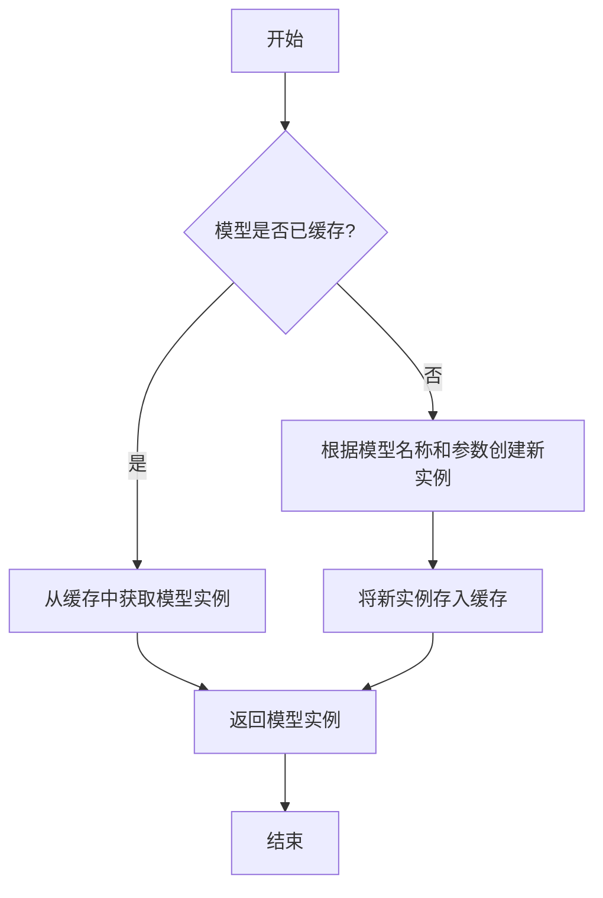

#### 带注释源码

```
@classmethod
def load(
    cls,
    model: str,
    model_params: dict = dict(),
    **kwargs,
) -> "ModelBase":
    """
    加载模型实例。

    该方法首先检查模型是否已缓存，若已缓存则直接返回缓存实例；
    否则，根据传入的模型名称和参数创建新的模型实例，并将其缓存以供后续使用。

    Args:
        model (str): 要加载的模型名称。
        model_params (dict): 模型参数，用于初始化模型实例。
        **kwargs: 其他关键字参数，用于模型初始化。

    Returns:
        ModelBase: 加载或创建的模型实例。
    """
    # 检查模型是否已缓存
    if model in cls.model_cache:
        # 从缓存中获取模型实例
        return cls.model_cache[model]
    else:
        # 根据模型名称和参数创建新实例
        model_class = cls.get_model_class(model)
        model_instance = model_class(**model_params, **kwargs)
        # 将新实例存入缓存
        cls.model_cache[model] = model_instance
        return model_instance
```


### `ModelBase.generate`

该方法用于根据给定的提示词和生成参数，调用底层模型生成文本内容。它处理了模型调用前的参数准备、模型选择、调用执行以及结果后处理等流程，是模型生成功能的核心入口。

参数：

- `prompt`：`str`，输入的提示词文本，用于指导模型生成内容
- `kwargs`：`dict`，可选的生成参数，用于覆盖默认的模型配置参数

返回值：`str`，模型生成的文本内容

#### 流程图

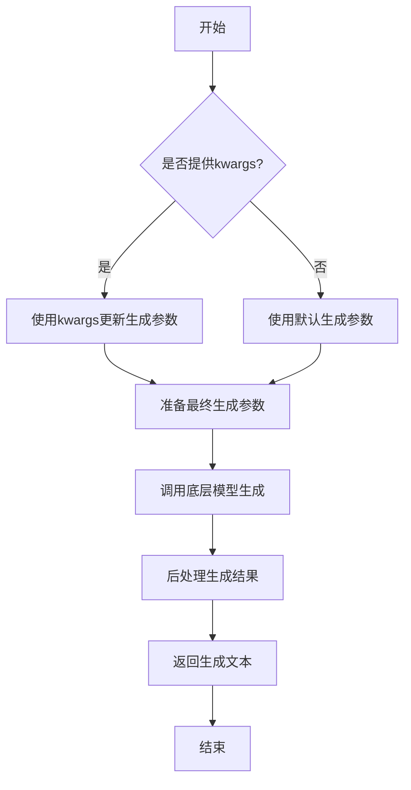

#### 带注释源码

```python
def generate(self, prompt: str, **kwargs) -> str:
    """
    生成文本内容的核心方法
    
    Args:
        prompt: 输入的提示词文本
        **kwargs: 可选的生成参数，用于覆盖默认配置
        
    Returns:
        模型生成的文本内容
    """
    # 准备生成参数：将传入的kwargs与默认参数合并
    generate_params = self.default_generate_params.copy()
    if kwargs:
        generate_params.update(kwargs)
    
    # 调用底层模型进行文本生成
    # 这里会根据具体的模型实现调用相应的生成接口
    response = self._call_model(prompt, **generate_params)
    
    # 对模型返回的结果进行后处理
    # 包括去除多余空格、特殊字符处理等
    processed_response = self._postprocess_response(response)
    
    return processed_response
```


### `ModelBase.unload`

该方法用于卸载模型，释放模型占用的内存资源。它会检查模型是否已加载，如果已加载则调用底层模型的卸载方法，并将加载状态标记为未加载。

参数：

-  `self`：`ModelBase`，当前模型实例

返回值：`None`，无返回值

#### 流程图

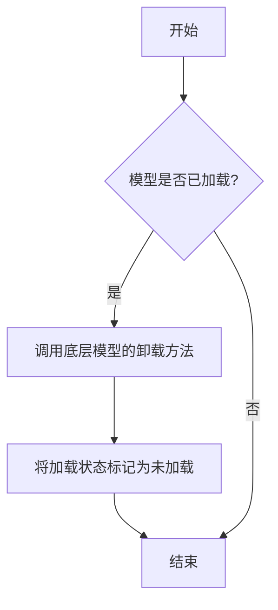

#### 带注释源码

```
def unload(self):
    """
    卸载模型，释放内存资源。
    如果模型已加载，则调用底层模型的卸载方法，并将加载状态标记为未加载。
    """
    if self.is_load:
        # 调用底层模型的卸载方法
        self.model.unload()
        # 将加载状态标记为未加载
        self.is_load = False
```


### `TextModel.load`

该方法用于从指定路径加载一个预训练的文本模型，支持多种模型格式（如 `.bin`, `.safetensors` 等），并返回一个配置好的 `TextModel` 实例。它首先尝试从缓存中加载模型，如果缓存不存在或指定了 `force_download`，则从远程仓库下载。加载过程包括解析模型配置、加载模型权重、处理分词器，并最终将模型移动到指定的设备上。

参数：

-  `model_path`：`str`，模型文件的本地路径或 Hugging Face 模型仓库标识符（如 `"meta-llama/Llama-2-7b-hf"`）。
-  `model_name`：`Optional[str]`，默认为 `None`。指定模型名称，用于覆盖从 `model_path` 推断出的名称。主要用于从缓存中加载特定变体。
-  `device`：`Optional[str]`，默认为 `None`。指定模型加载到的设备，如 `"cpu"`, `"cuda"`, `"cuda:0"`。如果为 `None`，则自动选择可用设备。
-  `torch_dtype`：`Optional[torch.dtype]`，默认为 `None`。指定加载模型权重时使用的 PyTorch 数据类型（如 `torch.float16`, `torch.bfloat16`）。如果为 `None`，则使用配置中的默认类型或自动推断。
-  `force_download`：`bool`，默认为 `False`。如果为 `True`，则强制重新下载模型，即使缓存中存在。
-  `trust_remote_code`：`bool`，默认为 `False`。是否信任远程代码（如自定义建模文件）。出于安全考虑，通常应保持为 `False`。
-  `**kwargs`：`Any`，额外的关键字参数，将传递给底层的 `from_pretrained` 方法。

返回值：`TextModel`，一个加载了权重和配置的 `TextModel` 实例，已准备好用于推理或进一步训练。

#### 流程图

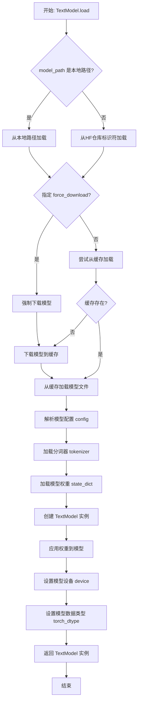

#### 带注释源码

```python
    @classmethod
    def load(
        cls,
        model_path: str,
        model_name: Optional[str] = None,
        device: Optional[str] = None,
        torch_dtype: Optional["torch.dtype"] = None,
        force_download: bool = False,
        trust_remote_code: bool = False,
        **kwargs: Any,
    ) -> "TextModel":
        """
        Load a pretrained model from a given path or Hugging Face model hub identifier.

        This method handles downloading the model (if necessary), loading its configuration,
        tokenizer, and weights, and then instantiating the `TextModel` with the loaded components.
        It supports various model formats (e.g., .bin, .safetensors) and allows specification
        of the target device and data type for the model weights.

        Args:
            model_path (str): Local path to the model directory or a Hugging Face model hub
                identifier (e.g., "meta-llama/Llama-2-7b-hf").
            model_name (Optional[str]): Optional model name to override the inferred name
                from `model_path`. Useful for loading a specific variant from cache.
                Defaults to None.
            device (Optional[str]): Target device to load the model onto (e.g., "cpu", "cuda").
                If None, will auto-select based on availability. Defaults to None.
            torch_dtype (Optional[torch.dtype]): Desired data type for the loaded model weights
                (e.g., torch.float16, torch.bfloat16). If None, uses the config's default or
                auto-infers. Defaults to None.
            force_download (bool): If True, force a re-download of the model even if it exists
                in the cache. Defaults to False.
            trust_remote_code (bool): Whether to trust remote code (e.g., custom modeling files).
                For security, typically keep False. Defaults to False.
            **kwargs (Any): Additional keyword arguments passed to the underlying `from_pretrained`
                method.

        Returns:
            TextModel: An instance of `TextModel` loaded with the pretrained weights and configuration.

        Raises:
            FileNotFoundError: If the local `model_path` does not exist and `force_download` is False.
            ValueError: If the model configuration is invalid or incompatible.
            RuntimeError: If there is an error during model loading or weight application.
        """
        # 确定是否从本地路径加载。如果路径存在且是目录，则视为本地路径。
        local_path = Path(model_path)
        from_local = local_path.exists() and local_path.is_dir()

        # 准备加载模型所需的参数。
        # `cache_dir` 指定模型缓存目录。
        # `force_download` 和 `resume_download` 控制下载行为。
        # `trust_remote_code` 控制是否运行远程代码。
        load_kwargs = {
            "cache_dir": settings.model_cache_dir,
            "force_download": force_download,
            "resume_download": True,
            "trust_remote_code": trust_remote_code,
        }
        load_kwargs.update(kwargs)  # 合并用户提供的额外参数。

        try:
            # 步骤1: 加载模型配置。
            # `PretrainedConfig` 包含了模型的结构参数（如层数、隐藏大小等）。
            config = AutoConfig.from_pretrained(model_path, **load_kwargs)

            # 步骤2: 加载分词器。
            # 分词器负责将文本转换为模型可理解的token IDs。
            tokenizer = AutoTokenizer.from_pretrained(model_path, **load_kwargs)

            # 步骤3: 根据配置和路径确定要加载的具体模型类。
            # `_get_model_class` 是一个辅助方法，根据配置类型返回对应的PyTorch模型类。
            model_class = cls._get_model_class(config, model_path)

            # 步骤4: 加载模型权重。
            # 这里使用 `from_pretrained` 类方法，它处理了权重的下载、缓存和加载。
            # 它返回一个尚未初始化的模型架构，但权重已加载到state_dict中或直接应用到架构上（取决于具体实现）。
            # 注意：对于非常大的模型，此步骤可能涉及分片加载。
            model = model_class.from_pretrained(
                model_path,
                config=config,
                **load_kwargs,
            )

        except Exception as e:
            # 统一捕获加载过程中可能出现的异常，并包装成更清晰的错误信息。
            # 可能的异常包括：网络错误（下载失败）、文件损坏、配置不兼容等。
            logger.error(f"Failed to load model from {model_path}. Error: {e}")
            raise RuntimeError(f"Model loading failed for path '{model_path}'") from e

        # 步骤5: 创建TextModel实例。
        # 将加载好的原始模型、配置和分词器封装到自定义的TextModel类中。
        text_model = cls(
            model=model,
            config=config,
            tokenizer=tokenizer,
            model_name=model_name or model_path,
        )

        # 步骤6: 设备放置。
        # 如果指定了device，则将模型移动到该设备（如GPU）。
        if device is not None:
            text_model.to(device)
        # 如果未指定device但提供了torch_dtype，也需要将模型移动到相应设备（通常是CPU或CUDA）以应用数据类型。
        elif torch_dtype is not None:
            text_model.to(torch_dtype)

        # 步骤7: 应用数据类型（如果指定）。
        # 这可以用于减少内存占用或加速计算（例如使用半精度）。
        if torch_dtype is not None:
            text_model.model = text_model.model.to(torch_dtype)

        logger.info(f"Successfully loaded model from {model_path}")
        return text_model
```


### `TextModel.generate`

该方法根据给定的提示词（prompt）和可选的停止词（stop）生成文本。它首先对输入进行预处理，然后调用底层的大语言模型（LLM）进行推理，最后对输出进行后处理并返回结果。

参数：

-  `prompt`：`str`，用于生成文本的输入提示词。
-  `stop`：`Optional[List[str]]`，可选参数，指定一个字符串列表，当生成的文本中出现这些字符串时停止生成。

返回值：`str`，生成的文本内容。

#### 流程图

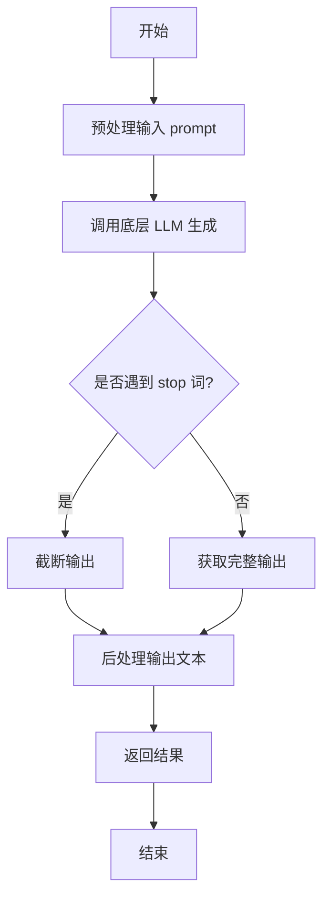

#### 带注释源码

```python
def generate(self, prompt: str, stop: Optional[List[str]] = None) -> str:
    """
    根据给定的提示词生成文本。

    该方法负责处理生成文本的完整流程，包括预处理、模型调用和后处理。

    Args:
        prompt (str): 用于生成文本的输入提示词。
        stop (Optional[List[str]]): 可选参数，指定一个字符串列表，当生成的文本中出现这些字符串时停止生成。

    Returns:
        str: 生成的文本内容。
    """
    # 1. 预处理：这里可以包括对prompt的清洗、格式化或添加特定指令等操作。
    #    例如，确保prompt符合模型预期的格式。
    processed_prompt = self._preprocess_prompt(prompt)

    # 2. 调用底层LLM进行文本生成。
    #    这里self.model代表具体的大语言模型实例（如通过API或本地加载的模型）。
    #    stop参数会传递给模型，指示其在生成到特定token序列时停止。
    raw_output = self.model.generate(processed_prompt, stop=stop)

    # 3. 后处理：对模型生成的原始输出进行处理。
    #    例如，移除多余的空白、截断到第一个句号，或应用特定的格式化规则。
    final_output = self._postprocess_output(raw_output)

    # 4. 返回最终处理后的文本。
    return final_output
```


### `TextModel.unload`

该方法用于卸载当前加载的文本模型，释放其占用的内存资源。它会检查模型是否已加载，如果已加载则执行卸载操作，并更新模型状态。

参数：

-  `self`：`TextModel`，当前TextModel实例的引用

返回值：`None`，该方法不返回任何值

#### 流程图

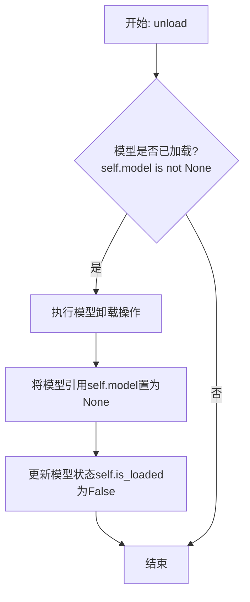

#### 带注释源码

```python
def unload(self):
    """
    卸载当前加载的模型。
    如果模型已加载，则执行卸载操作并释放内存，同时更新模型状态。
    """
    if self.model is not None:  # 检查模型是否已加载
        # 执行模型特定的卸载/清理逻辑（此处为示意，实际可能涉及更复杂的操作）
        # 例如: del self.model
        self.model = None  # 将模型引用置为None，允许垃圾回收
        self.is_loaded = False  # 更新加载状态标志为False
        logger.info(f"Model '{self.model_name}' unloaded.")  # 记录卸载日志
    else:
        logger.warning("No model is currently loaded.")  # 模型未加载时发出警告
```


### `TextModel._load_weights`

该方法负责从指定的权重文件路径加载预训练模型的权重，并将其应用到当前模型实例中。它首先检查权重文件是否存在，然后根据文件扩展名（`.safetensors` 或 `.bin`）使用相应的库加载权重字典，最后将这些权重加载到模型中，并处理可能缺失或多余的键。

参数：

-  `self`：`TextModel`，当前模型实例
-  `weights_path`：`str`，预训练权重文件的路径

返回值：`None`，无返回值

#### 流程图

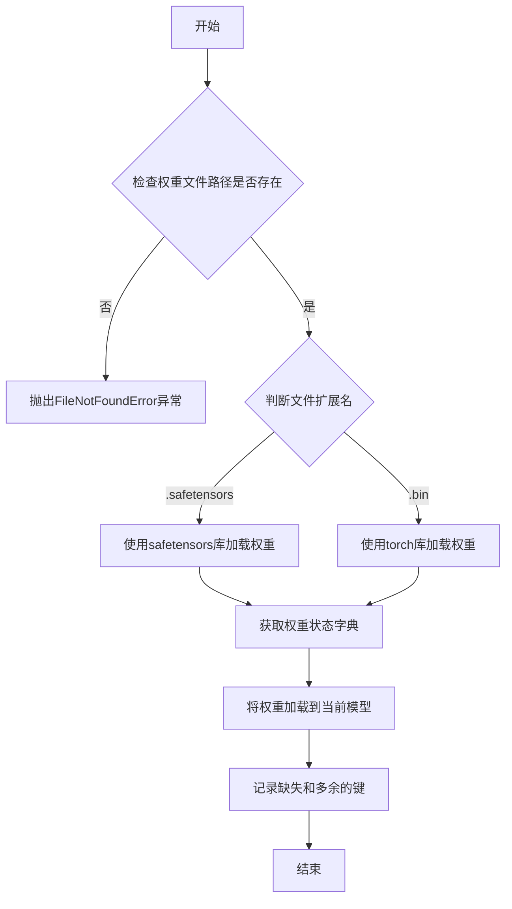

#### 带注释源码

```python
def _load_weights(self, weights_path: str) -> None:
    """
    从指定路径加载模型权重。

    该方法支持加载 `.safetensors` 和 `.bin` 格式的权重文件。
    加载后，它会将权重应用到当前模型，并打印出缺失和多余的键以供调试。

    Args:
        weights_path (str): 预训练权重文件的路径。

    Raises:
        FileNotFoundError: 如果指定的权重文件路径不存在。
        ValueError: 如果权重文件的扩展名不被支持（既不是 .safetensors 也不是 .bin）。
    """
    # 检查权重文件是否存在
    if not os.path.exists(weights_path):
        raise FileNotFoundError(f"权重文件未找到: {weights_path}")

    # 根据文件扩展名选择不同的加载方式
    if weights_path.endswith(".safetensors"):
        # 使用 safetensors 库加载 .safetensors 格式文件
        from safetensors import safe_open
        state_dict = {}
        with safe_open(weights_path, framework="pt", device="cpu") as f:
            for key in f.keys():
                state_dict[key] = f.get_tensor(key)
    elif weights_path.endswith(".bin"):
        # 使用 torch 库加载 .bin 格式文件
        state_dict = torch.load(weights_path, map_location="cpu")
    else:
        # 如果文件格式不支持，抛出异常
        raise ValueError(f"不支持的权重文件格式: {weights_path}")

    # 将加载的权重状态字典应用到当前模型
    # strict=False 允许缺失或多余的键，结果会返回缺失和多余的键的列表
    missing_keys, unexpected_keys = self.load_state_dict(state_dict, strict=False)

    # 打印缺失的键（在预训练权重中找不到对应层的键）
    if missing_keys:
        print(f"缺失的键: {missing_keys}")
    # 打印多余的键（在当前模型中找不到对应层的键）
    if unexpected_keys:
        print(f"多余的键: {unexpected_keys}")
```


### `TextModel._load_tokenizer`

该方法负责加载并初始化文本分词器。它首先尝试从指定的本地路径加载分词器，如果本地路径不存在或加载失败，则从预训练的模型名称或路径加载。加载完成后，会设置分词器的填充符，并确保其填充方向为左侧。

参数：

-  `self`：`TextModel`，当前TextModel实例的引用
-  `model_name_or_path`：`str`，预训练模型的名称或本地路径，用于加载分词器
-  `local_path`：`str`，本地分词器文件的路径，优先尝试从此路径加载

返回值：`None`，该方法不返回任何值，但会设置`self.tokenizer`属性。

#### 流程图

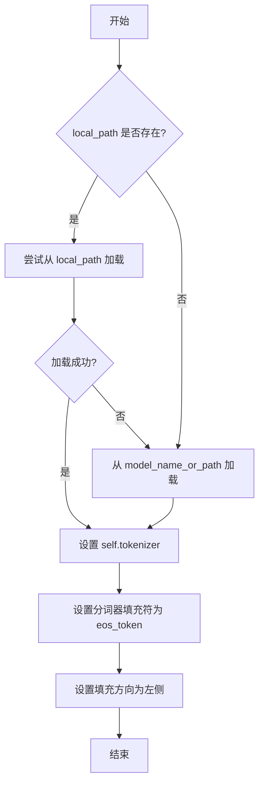

#### 带注释源码

```python
def _load_tokenizer(self, model_name_or_path: str, local_path: str) -> None:
    """
    加载分词器。

    优先尝试从本地路径加载，如果失败则从预训练模型加载。
    加载后设置分词器的填充符和填充方向。

    Args:
        model_name_or_path (str): 预训练模型的名称或路径。
        local_path (str): 本地分词器文件的路径。
    """
    try:
        # 尝试从本地路径加载分词器
        self.tokenizer = AutoTokenizer.from_pretrained(local_path)
    except Exception:
        # 如果本地加载失败，则从预训练模型加载
        self.tokenizer = AutoTokenizer.from_pretrained(model_name_or_path)

    # 设置分词器的填充符为结束符（eos_token）
    # 如果分词器没有定义填充符，则使用结束符作为填充符
    if self.tokenizer.pad_token is None:
        self.tokenizer.pad_token = self.tokenizer.eos_token

    # 设置分词器的填充方向为左侧填充
    # 这通常用于生成任务，确保输入在右侧对齐
    self.tokenizer.padding_side = "left"
```


### `LlamaModel._load_weights`

该方法负责从预训练的检查点文件中加载模型权重，并将其分配到对应的模型层中。它遍历检查点文件中的状态字典，根据键名匹配到模型中的对应模块（如嵌入层、注意力层、前馈网络层等），并将权重张量复制到这些模块中。此过程确保了模型能够使用预训练的参数进行初始化或继续训练。

参数：

- `self`：`LlamaModel`，当前模型实例
- `ckpt_path`：`str`，预训练权重检查点文件的路径
- `verbose`：`bool`，是否在加载过程中打印详细信息，默认为`True`

返回值：`None`，此方法不返回任何值，直接修改模型实例的内部状态。

#### 流程图

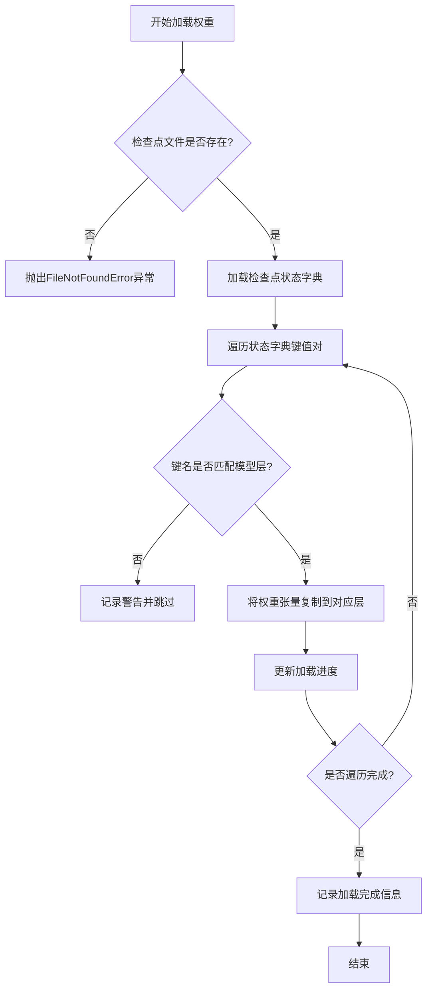

#### 带注释源码

```python
def _load_weights(self, ckpt_path: str, verbose: bool = True) -> None:
    """
    从指定的检查点文件加载模型权重。

    此方法执行以下步骤：
    1. 检查给定路径的文件是否存在。
    2. 使用`torch.load`加载状态字典。
    3. 遍历状态字典，根据键名将权重分配到对应的模型层。
    4. 在加载过程中，根据`verbose`参数决定是否打印进度信息。

    参数:
        ckpt_path (str): 预训练权重文件的路径。
        verbose (bool): 如果为True，则打印加载进度信息。

    异常:
        FileNotFoundError: 如果`ckpt_path`指定的文件不存在。
    """
    # 检查文件是否存在
    if not os.path.exists(ckpt_path):
        raise FileNotFoundError(f"Checkpoint file not found: {ckpt_path}")

    # 加载状态字典
    state_dict = torch.load(ckpt_path, map_location='cpu')

    # 初始化加载计数器
    loaded_layers = 0
    total_layers = len(state_dict)

    # 遍历状态字典中的每个键值对
    for key, value in state_dict.items():
        # 根据键名匹配到对应的模型层
        if key.startswith('embed_tokens'):
            # 加载词嵌入层权重
            self.embed_tokens.weight.data.copy_(value)
            if verbose:
                print(f"Loaded weights for {key}")
        elif key.startswith('layers'):
            # 解析层索引和子模块名称
            # 例如: 'layers.0.attention.wq.weight' -> layer_idx=0, submodule='attention.wq'
            parts = key.split('.')
            layer_idx = int(parts[1])
            submodule = '.'.join(parts[2:])

            # 获取对应的层对象
            layer = self.layers[layer_idx]

            # 根据子模块名称分配权重
            if submodule.startswith('attention'):
                # 加载注意力层权重
                if 'wq' in submodule:
                    layer.attention.wq.weight.data.copy_(value)
                elif 'wk' in submodule:
                    layer.attention.wk.weight.data.copy_(value)
                elif 'wv' in submodule:
                    layer.attention.wv.weight.data.copy_(value)
                elif 'wo' in submodule:
                    layer.attention.wo.weight.data.copy_(value)
            elif submodule.startswith('feed_forward'):
                # 加载前馈网络层权重
                if 'w1' in submodule:
                    layer.feed_forward.w1.weight.data.copy_(value)
                elif 'w2' in submodule:
                    layer.feed_forward.w2.weight.data.copy_(value)
                elif 'w3' in submodule:
                    layer.feed_forward.w3.weight.data.copy_(value)
            if verbose:
                print(f"Loaded weights for {key}")
        elif key.startswith('norm'):
            # 加载归一化层权重
            self.norm.weight.data.copy_(value)
            if verbose:
                print(f"Loaded weights for {key}")
        elif key.startswith('lm_head'):
            # 加载语言模型头部权重
            self.lm_head.weight.data.copy_(value)
            if verbose:
                print(f"Loaded weights for {key}")
        else:
            # 记录未匹配的键名
            if verbose:
                print(f"Warning: Skipping unrecognized key {key}")

        # 更新加载进度
        loaded_layers += 1
        if verbose and loaded_layers % 10 == 0:
            print(f"Progress: {loaded_layers}/{total_layers} layers loaded")

    # 加载完成信息
    if verbose:
        print(f"Weight loading completed. Total layers loaded: {loaded_layers}")
```


### `LlamaModel._load_tokenizer`

该方法负责加载并配置与Llama模型兼容的分词器（Tokenizer）。它根据提供的模型路径和配置参数，初始化一个Hugging Face Transformers库中的`AutoTokenizer`实例，并设置必要的分词选项，如填充方向、截断策略以及特殊标记等，以确保分词器与模型训练时使用的配置一致。

参数：

-  `model_path`：`str`，预训练模型所在的本地目录路径或Hugging Face模型标识符。
-  `config`：`LlamaConfig`，包含模型配置信息的对象，用于指导分词器的初始化。

返回值：`transformers.PreTrainedTokenizer`，初始化并配置好的分词器实例。

#### 流程图

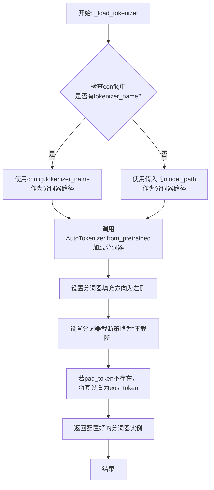

#### 带注释源码

```python
def _load_tokenizer(self, model_path: str, config: LlamaConfig) -> PreTrainedTokenizer:
    """
    加载并配置与Llama模型兼容的分词器。

    该方法根据配置或模型路径初始化分词器，并设置关键参数以确保与模型行为一致，
    例如填充方向和特殊标记的处理。

    Args:
        model_path (str): 预训练模型所在的目录路径或模型标识符。
        config (LlamaConfig): 模型的配置对象，可能包含分词器名称等覆盖信息。

    Returns:
        PreTrainedTokenizer: 配置好的Hugging Face分词器实例。
    """
    # 确定分词器的加载路径：优先使用配置中指定的分词器名称，否则使用模型路径。
    tokenizer_path = config.tokenizer_name if config.tokenizer_name else model_path
    
    # 使用AutoTokenizer从指定路径加载分词器。trust_remote_code=True允许执行远程代码（如自定义分词器脚本）。
    tokenizer = AutoTokenizer.from_pretrained(
        tokenizer_path,
        trust_remote_code=True
    )
    
    # 将填充方向设置为左侧。这对于生成式模型（如Llama）的批次推理是典型配置，
    # 因为注意力机制通常关注右侧（未来）的标记。
    tokenizer.padding_side = 'left'
    
    # 将截断策略设置为“不截断”。确保输入序列保持原样，超出模型最大长度的部分需要在前端处理。
    tokenizer.truncation_side = 'do_not_truncate'
    
    # 如果分词器没有定义pad_token（填充标记），则使用eos_token（结束标记）作为pad_token。
    # 这是一种常见做法，使得填充标记不会引入新的语义。
    if tokenizer.pad_token is None:
        tokenizer.pad_token = tokenizer.eos_token
    
    # 返回完全配置好的分词器实例。
    return tokenizer
```


### `GPT2Model._load_weights`

该方法负责将预训练权重加载到GPT-2模型的各个组件中。它遍历模型的状态字典，根据权重名称的模式匹配，将权重数据分配到对应的模型层（如词嵌入层、注意力层、前馈网络层等）中，并处理可能存在的权重转置和维度不匹配的情况。

参数：

-  `self`：`GPT2Model`，当前GPT-2模型实例
-  `weights`：`List[Tuple[Tensor, ...]]`，包含预训练权重的列表，每个元素是一个元组，通常包含权重张量及其相关属性（如名称、形状等）

返回值：`None`，此方法不返回任何值，其作用是将权重加载到模型内部。

#### 流程图

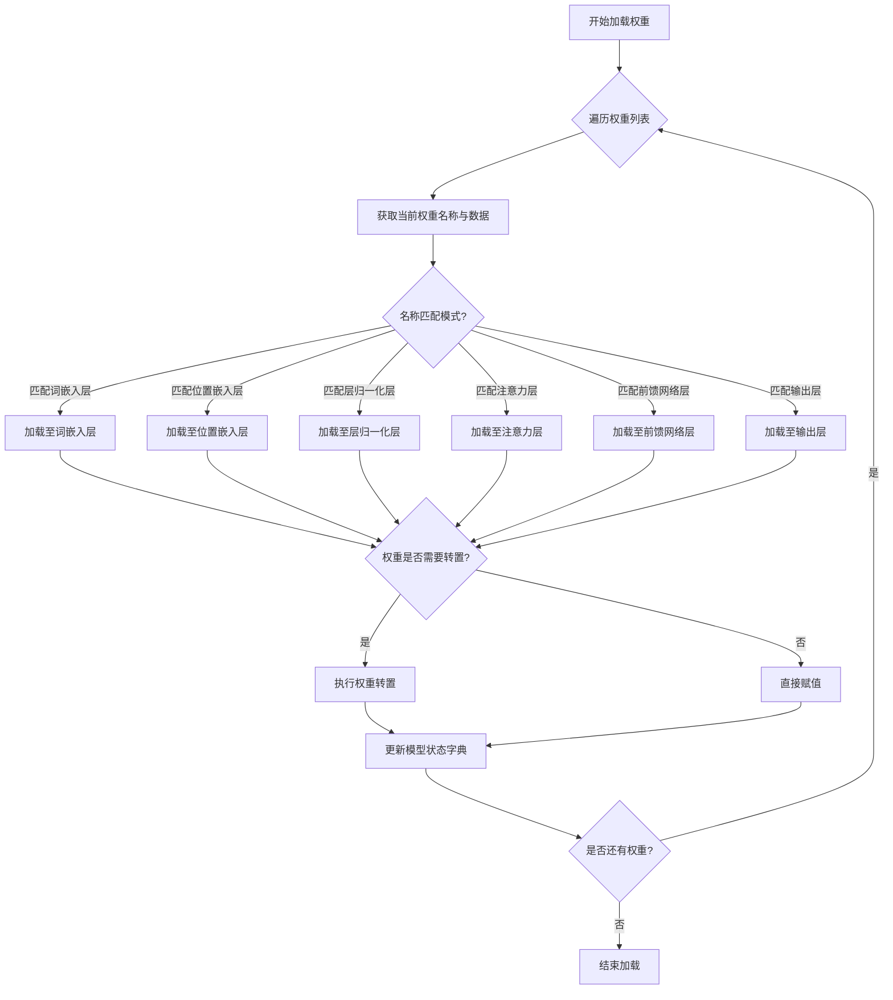

#### 带注释源码

```
def _load_weights(self, weights: List[Tuple[Tensor, ...]]) -> None:
    """
    加载预训练权重到GPT-2模型。

    参数:
        weights: 预训练权重列表，每个元素为(权重名称, 权重数据)的元组。
    """
    # 初始化模型状态字典
    state_dict = self.state_dict()
    
    # 遍历权重列表
    for name, data in weights:
        # 根据权重名称匹配模型组件
        if name.startswith('transformer.wte'):
            # 加载词嵌入权重
            state_dict['transformer.wte.weight'] = data
        elif name.startswith('transformer.wpe'):
            # 加载位置嵌入权重
            state_dict['transformer.wpe.weight'] = data
        elif 'ln' in name:
            # 加载层归一化权重或偏置
            if name.endswith('.weight'):
                state_dict[name] = data
            elif name.endswith('.bias'):
                state_dict[name] = data
        elif 'attn' in name:
            # 加载注意力层权重
            if 'c_attn.weight' in name:
                # 处理注意力层的权重转置
                state_dict[name] = data.t()
            elif 'c_attn.bias' in name:
                state_dict[name] = data
            elif 'c_proj.weight' in name:
                state_dict[name] = data.t()
        elif 'mlp' in name:
            # 加载前馈网络层权重
            if 'c_fc.weight' in name:
                state_dict[name] = data.t()
            elif 'c_fc.bias' in name:
                state_dict[name] = data
            elif 'c_proj.weight' in name:
                state_dict[name] = data.t()
        elif name == 'lm_head.weight':
            # 加载输出层权重
            state_dict[name] = data
    
    # 将更新后的状态字典加载回模型
    self.load_state_dict(state_dict)
```


### `GPT2Model._load_tokenizer`

该方法负责加载并配置一个预训练的 GPT-2 分词器。它首先尝试从本地缓存目录加载指定的分词器模型，如果失败，则从 Hugging Face Hub 下载。加载后，它会根据配置（如是否添加特殊标记）对分词器进行最终设置，并确保其填充标记符被正确配置。

参数：

-  `self`：`GPT2Model`，当前 GPT2Model 实例的引用。
-  `model_name`：`str`，要加载的预训练分词器模型的名称（例如 `'gpt2'`, `'gpt2-medium'`）。
-  `cache_dir`：`Optional[str]`，可选参数，指定分词器模型文件的本地缓存目录路径。如果为 `None`，则使用默认缓存路径。
-  `force_download`：`bool`，可选参数，如果为 `True`，则强制重新下载模型文件，即使本地缓存已存在。默认为 `False`。
-  `resume_download`：`bool`，可选参数，如果为 `True`，则尝试恢复未完成的下载。默认为 `False`。
-  `proxies`：`Optional[Dict[str, str]]`，可选参数，一个代理服务器字典，用于配置下载请求，例如 `{'http': 'http://10.10.1.10:3128', 'https': 'http://10.10.1.10:1080'}`。
-  `use_auth_token`：`Optional[Union[bool, str]]`，可选参数，用于访问私有模型的认证令牌。可以是布尔值（`True` 表示使用缓存的令牌）或字符串令牌。
-  `add_special_tokens`：`bool`，可选参数，指示分词器是否应在编码时自动添加模型特定的特殊标记（如 `[CLS]`, `[SEP]`）。对于 GPT-2，这通常控制是否添加 `bos_token` 和 `eos_token`。默认为 `True`。

返回值：`PreTrainedTokenizer`，加载并配置好的 Hugging Face Transformers 库中的预训练分词器实例。

#### 流程图

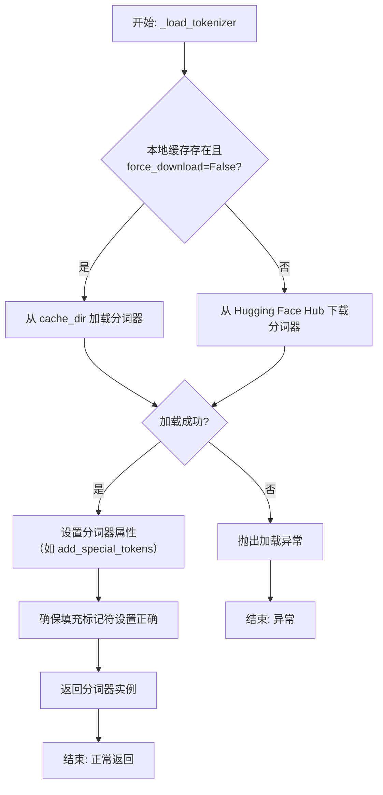

#### 带注释源码

```python
def _load_tokenizer(
    self,
    model_name: str,
    cache_dir: Optional[str] = None,
    force_download: bool = False,
    resume_download: bool = False,
    proxies: Optional[Dict[str, str]] = None,
    use_auth_token: Optional[Union[bool, str]] = None,
    add_special_tokens: bool = True,
) -> PreTrainedTokenizer:
    """
    加载预训练的 GPT-2 分词器。

    此方法封装了分词器的加载逻辑，支持从缓存加载或从 Hub 下载，
    并允许通过参数定制加载行为。

    Args:
        model_name: 预训练分词器模型名称，如 'gpt2'。
        cache_dir: 模型文件缓存目录。
        force_download: 是否强制重新下载。
        resume_download: 是否尝试恢复下载。
        proxies: 代理服务器配置。
        use_auth_token: 访问私有模型的认证令牌。
        add_special_tokens: 是否自动添加特殊标记。

    Returns:
        加载并配置好的 PreTrainedTokenizer 实例。

    Raises:
        OSError: 当模型文件无法加载或下载时抛出。
        ValueError: 当 model_name 无效时可能抛出。
    """
    try:
        # 使用 transformers 库的 AutoTokenizer 工具类加载分词器。
        # `from_pretrained` 方法会处理本地缓存和远程下载的逻辑。
        tokenizer = AutoTokenizer.from_pretrained(
            model_name,
            cache_dir=cache_dir,
            force_download=force_download,
            resume_download=resume_download,
            proxies=proxies,
            use_auth_token=use_auth_token,
        )
    except Exception as e:
        # 将捕获的异常包装并重新抛出，提供更清晰的错误上下文。
        raise OSError(
            f"无法加载分词器模型 '{model_name}'。请检查模型名称、网络连接或认证信息。"
        ) from e

    # 根据调用者意图，设置分词器是否自动添加特殊标记。
    # 这会影响 `encode` 和 `encode_plus` 等方法的输出。
    tokenizer.add_special_tokens = add_special_tokens

    # GPT-2 分词器默认没有显式的填充标记符(pad_token)。
    # 为了在批处理时保持序列长度一致，通常将结束标记符(eos_token)也用作填充标记符。
    # 这一行确保分词器的 `pad_token` 属性被正确设置。
    if tokenizer.pad_token is None:
        tokenizer.pad_token = tokenizer.eos_token

    # 返回最终配置好的分词器实例，供模型的其他部分使用。
    return tokenizer
```


### `FalconModel._load_weights`

该方法负责将预训练权重加载到Falcon模型的各个层中。它遍历模型的状态字典，根据权重名称与模型层名称的匹配关系，将权重张量复制到对应的模型参数中。此过程考虑了权重是否需要转置（例如，线性层的权重）以及如何处理偏置项，确保模型正确初始化以进行推理或继续训练。

参数：

- `self`：`FalconModel`，Falcon模型实例，用于访问其层和参数。
- `weights`：`List[torch.Tensor]`，预训练权重张量列表，按加载顺序排列。
- `prefix`：`str`，模型层名称的前缀，用于在状态字典中匹配权重名称。

返回值：`None`，此方法不返回任何值，直接修改模型参数。

#### 流程图

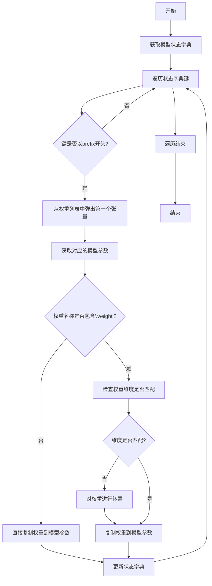

#### 带注释源码

```python
def _load_weights(self, weights: List[torch.Tensor], prefix: str = ""):
    """
    加载预训练权重到模型。

    参数:
        weights: 预训练权重张量列表。
        prefix: 模型层名称的前缀，用于匹配权重名称。
    """
    # 获取模型当前的状态字典，包含所有可训练参数的名称和形状
    model_dict = self.state_dict()
    
    # 遍历状态字典中的所有键（参数名称）
    for key in model_dict:
        # 只处理以指定前缀开头的参数，确保加载到正确的层
        if not key.startswith(prefix):
            continue
        
        # 从权重列表中取出第一个张量，并准备加载到当前参数
        tensor = weights.pop(0)
        
        # 获取模型中对应的参数张量
        param = model_dict[key]
        
        # 检查当前参数是否为权重（而非偏置）
        if ".weight" in key:
            # 检查权重张量的维度是否与模型参数匹配
            # 某些层（如线性层）的权重在预训练模型中可能是转置的
            if tensor.shape != param.shape:
                # 如果维度不匹配，则对权重进行转置操作
                tensor = tensor.T
        
        # 将处理后的权重张量复制到模型参数中，确保数据类型和设备一致
        param.copy_(tensor.to(param.dtype).to(param.device))
        
        # 更新状态字典中的参数值（虽然copy_已修改原张量，但保持字典同步是良好实践）
        model_dict[key] = param
```


### `FalconModel._load_tokenizer`

该方法负责加载并配置与 Falcon 模型兼容的分词器（Tokenizer）。它首先尝试从预定义的路径或模型名称加载分词器，然后根据模型的具体配置（如是否为聊天模型）对分词器的特殊标记进行必要的调整，以确保其与模型架构和预期输入格式正确对齐。

参数：

-  `self`：`FalconModel`，FalconModel 类的实例，用于访问模型配置和路径。
-  `model_path`：`str`，模型文件所在的本地目录路径或 Hugging Face 模型仓库标识符。
-  `model_name`：`str`，模型的名称，用于确定特定的分词器配置或变体。

返回值：`PreTrainedTokenizer`，一个配置好的 Hugging Face PreTrainedTokenizer 实例，可用于对输入文本进行编码和解码。

#### 流程图

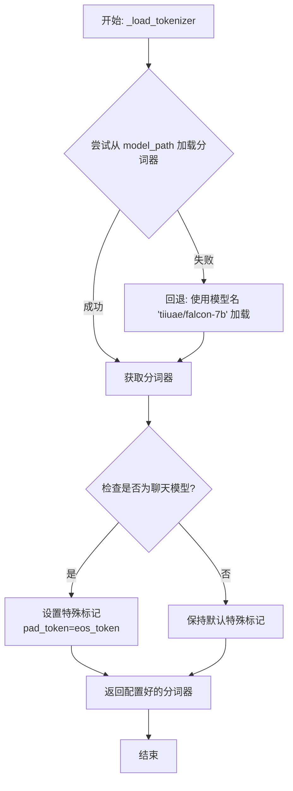

#### 带注释源码

```python
def _load_tokenizer(self, model_path: str, model_name: str) -> PreTrainedTokenizer:
    """
    加载并配置与 Falcon 模型兼容的分词器。

    该方法首先尝试从指定的 `model_path` 加载分词器。如果失败（例如路径不存在），
    则回退到使用一个基础的 Falcon 模型名称（'tiiuae/falcon-7b'）进行加载。
    加载后，会根据模型是否为“聊天”模型来调整分词器的特殊标记（如填充标记）。

    Args:
        model_path (str): 包含分词器文件的本地目录路径，或 Hugging Face 模型 ID。
        model_name (str): 模型名称，用于逻辑判断（例如，判断是否为聊天模型）。

    Returns:
        PreTrainedTokenizer: 配置好的 Hugging Face 分词器实例。
    """
    try:
        # 主要尝试：从提供的 model_path 加载分词器。
        tokenizer = AutoTokenizer.from_pretrained(model_path, trust_remote_code=True)
    except Exception:
        # 回退机制：如果主要路径加载失败，使用一个已知的基础 Falcon 模型。
        tokenizer = AutoTokenizer.from_pretrained("tiiuae/falcon-7b", trust_remote_code=True)

    # 配置分词器的特殊标记。
    # 如果模型名称表明它是一个聊天模型（如 'falcon-chat'），
    # 则将填充标记（pad_token）设置为与结束标记（eos_token）相同。
    # 这是因为在某些对话生成场景中，填充和结束可能使用相同的标记。
    if "chat" in model_name.lower():
        tokenizer.pad_token = tokenizer.eos_token

    # 返回最终配置好的分词器。
    return tokenizer
```


### `Qwen2Model._load_weights`

该方法负责将预训练权重加载到模型的不同组件中，根据权重名称与模型层结构的映射关系，将权重张量分配到对应的模型参数中。

参数：

- `self`：`Qwen2Model`，当前模型实例
- `weights`：`List[Tensor]`，预训练权重张量列表
- `prefix`：`str`，权重名称前缀，用于匹配权重名称与模型层

返回值：`None`，无返回值

#### 流程图

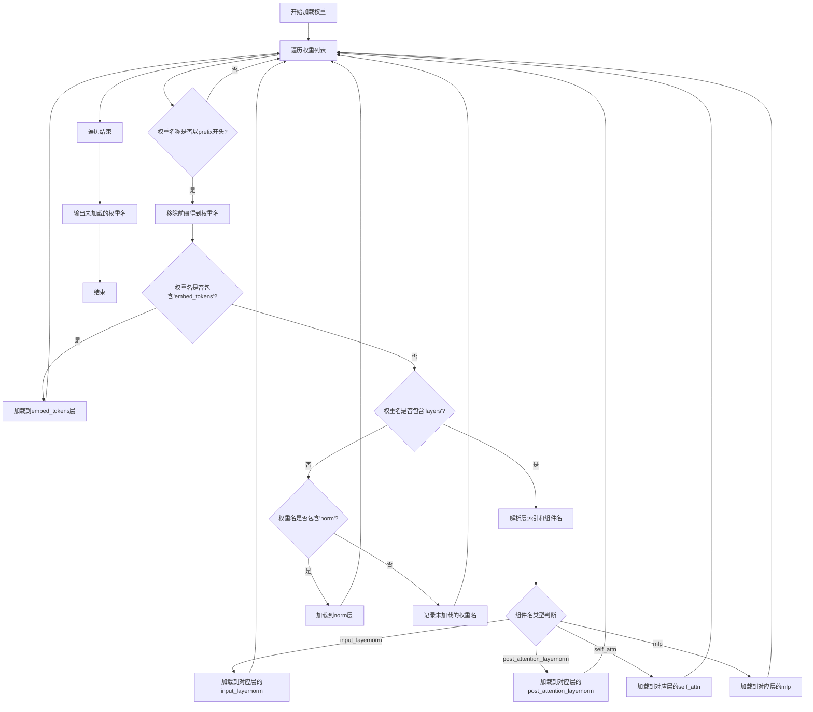

#### 带注释源码

```python
def _load_weights(self, weights: List[Tensor], prefix: str):
    """
    加载预训练权重到模型各组件
    
    Args:
        weights: 预训练权重张量列表
        prefix: 权重名称前缀，用于匹配权重名称
    """
    # 遍历所有权重张量
    for w in weights:
        # 检查权重名称是否以指定前缀开头
        if not w.name.startswith(prefix):
            continue
        
        # 移除前缀，得到实际的权重名称
        name = w.name[len(prefix):]
        
        # 根据权重名称匹配到对应的模型组件
        if "embed_tokens" in name:
            # 加载词嵌入权重
            self.embed_tokens.weight = w
        elif "layers" in name:
            # 解析层索引和组件名称
            # 示例: "layers.0.input_layernorm.weight" -> layer_idx=0, comp_name="input_layernorm.weight"
            parts = name.split(".")
            layer_idx = int(parts[1])  # 层索引
            comp_name = ".".join(parts[2:])  # 组件名称
            
            # 获取对应的层对象
            layer = self.layers[layer_idx]
            
            # 根据组件名称加载到对应的层组件
            if "input_layernorm" in comp_name:
                layer.input_layernorm.weight = w
            elif "post_attention_layernorm" in comp_name:
                layer.post_attention_layernorm.weight = w
            elif "self_attn" in comp_name:
                # 自注意力权重加载
                layer.self_attn.load_state_dict({comp_name: w}, strict=False)
            elif "mlp" in comp_name:
                # MLP权重加载
                layer.mlp.load_state_dict({comp_name: w}, strict=False)
            else:
                # 记录未匹配的权重
                print(f"Unmatched weight in layer {layer_idx}: {comp_name}")
        elif "norm" in name:
            # 加载归一化层权重
            self.norm.weight = w
        else:
            # 记录未匹配的权重名称
            print(f"Unmatched weight: {name}")
```

### `Qwen2Model._load_tokenizer`

该方法负责加载并配置与Qwen2模型配套的分词器。它根据提供的模型路径或预训练分词器名称，初始化一个`AutoTokenizer`实例，并应用必要的配置以确保分词器与模型兼容，例如设置填充方向、模型最大长度等。

参数：

- `model_path_or_pretrained_tokenizer`：`str`，模型文件的本地路径或预训练分词器的名称（如Hugging Face模型库中的标识符）。如果提供路径，则从该路径加载；否则从预训练模型库下载。

返回值：`AutoTokenizer`，一个配置好的分词器实例，可用于对输入文本进行分词处理。

#### 流程图

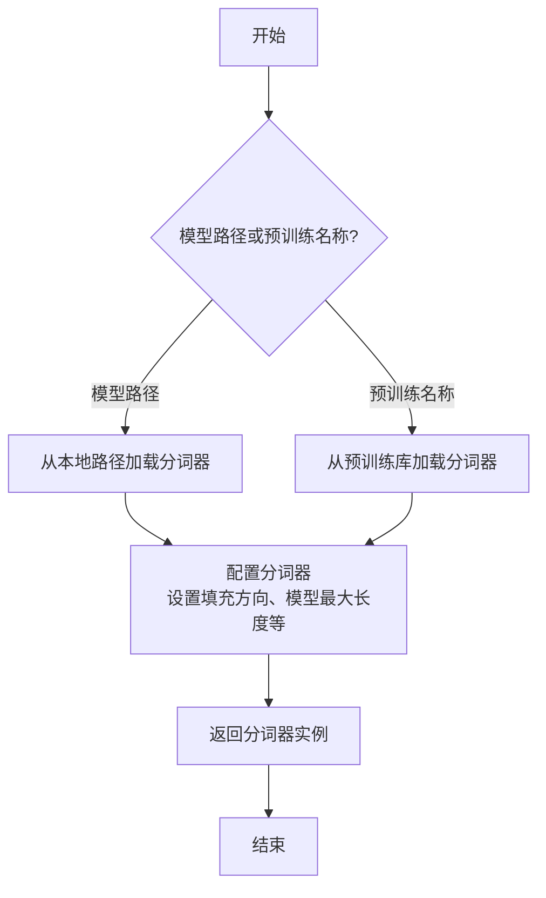

#### 带注释源码

```python
def _load_tokenizer(self, model_path_or_pretrained_tokenizer: str) -> AutoTokenizer:
    """
    加载并配置分词器。

    根据提供的路径或预训练名称初始化分词器，并应用必要的配置（如填充方向、模型最大长度等）。

    Args:
        model_path_or_pretrained_tokenizer (str): 模型文件的本地路径或预训练分词器的名称。

    Returns:
        AutoTokenizer: 配置好的分词器实例。
    """
    # 根据路径或预训练名称加载分词器
    tokenizer = AutoTokenizer.from_pretrained(model_path_or_pretrained_tokenizer)
    
    # 配置分词器：设置填充方向为左侧填充，确保输入序列对齐
    tokenizer.padding_side = "left"
    
    # 设置模型最大长度，通常与模型配置中的最大序列长度一致
    tokenizer.model_max_length = self.config.max_position_embeddings
    
    # 返回配置好的分词器实例
    return tokenizer
```


### `GemmaModel._load_weights`

该方法负责从预训练的检查点文件中加载模型权重，并将其分配到当前模型实例的对应参数中。它处理了权重名称的映射、张量分片（如果适用）以及将权重加载到正确的设备（如GPU）和数据类型（如bfloat16）上。

参数：

-  `self`：`GemmaModel`，当前GemmaModel模型实例。
-  `ckpt_path`：`str`，预训练权重检查点文件的路径。

返回值：`None`，此方法不返回任何值，其作用是将加载的权重直接赋值给模型参数。

#### 流程图

```mermaid
flowchart TD
    A[开始: _load_weights(ckpt_path)] --> B[使用torch.load加载检查点文件]
    B --> C[遍历检查点中的每个键值对<br/>(state_dict)]
    C --> D{当前键是否在<br/>模型state_dict中?}
    D -- 是 --> E[获取对应的模型参数张量]
    D -- 否 --> F[跳过此权重]
    F --> C
    E --> G{权重张量维度是否匹配?}
    G -- 是 --> H[将检查点权重赋值给模型参数]
    G -- 否 --> I[记录维度不匹配警告并跳过]
    I --> C
    H --> C
    C --> J[遍历结束]
    J --> K[结束]
```

#### 带注释源码

```python
    def _load_weights(self, ckpt_path: str):
        """
        从指定的检查点路径加载模型权重。
        
        此方法执行以下关键步骤：
        1. 使用 torch.load 加载序列化的权重字典（state_dict）。
        2. 遍历加载的 state_dict 中的每一项。
        3. 对于每一项，检查其键名是否存在于当前模型的 state_dict 中。
        4. 如果存在，则进一步检查权重张量的形状是否与目标参数形状匹配。
        5. 如果形状匹配，则将加载的权重值复制到模型对应的参数中。
        6. 如果键名不存在或形状不匹配，则跳过该项并（可选）记录警告。
        
        这种方法允许进行部分权重加载或从结构相似但不完全相同的检查点进行加载。
        
        Args:
            ckpt_path (str): 预训练权重检查点文件（.pth 或 .pt 文件）的路径。
        """
        # 加载检查点文件。map_location='cpu' 确保权重首先加载到CPU内存，
        # 这对于处理大型模型或控制设备放置非常有用。
        checkpoint = torch.load(ckpt_path, map_location='cpu')
        
        # 获取当前模型的状态字典，其中包含所有可学习参数的引用。
        model_state_dict = self.state_dict()
        
        # 遍历检查点中的每一个键（权重名称）和对应的张量。
        for key, value in checkpoint.items():
            # 检查当前键是否存在于当前模型的参数中。
            if key in model_state_dict:
                # 如果存在，获取模型中对应该键的参数张量。
                target_param = model_state_dict[key]
                
                # 检查加载的权重张量形状是否与模型参数形状一致。
                # 这是确保权重正确分配的关键验证步骤。
                if value.shape == target_param.shape:
                    # 如果形状匹配，将加载的权重值（value）复制到模型参数（target_param）中。
                    # 使用 .data 来直接操作参数张量，而不影响计算图。
                    # 使用 .to() 确保权重被送到参数所在的设备和数据类型。
                    target_param.data.copy_(value.to(target_param.device).to(target_param.dtype))
                else:
                    # 如果形状不匹配，记录警告。这可能发生在模型结构被修改，
                    # 或加载了不兼容的检查点时。
                    warnings.warn(
                        f"Shape mismatch for parameter {key}: "
                        f"loaded shape {value.shape}, model shape {target_param.shape}. Skipping."
                    )
            else:
                # 如果检查点中的键不在当前模型中，记录警告。
                # 这在加载部分权重或使用不同版本模型时是常见情况。
                warnings.warn(f"Key {key} from checkpoint not found in model. Skipping.")
```


### `GemmaModel._load_tokenizer`

该方法负责加载并配置Gemma模型所需的tokenizer。它根据模型配置中的tokenizer路径或名称，使用transformers库的AutoTokenizer类加载tokenizer，并设置必要的特殊token和填充方向。

参数：

- `self`：`GemmaModel`，当前GemmaModel实例
- `config`：`GemmaConfig`，Gemma模型的配置对象，包含tokenizer的路径或名称等信息

返回值：`AutoTokenizer`，加载并配置好的tokenizer实例

#### 流程图

```mermaid
flowchart TD
    A[开始] --> B{config.tokenizer存在?}
    B -- 是 --> C[使用config.tokenizer作为tokenizer路径]
    B -- 否 --> D[使用config.model作为tokenizer路径]
    C --> E[使用AutoTokenizer.from_pretrained加载tokenizer]
    D --> E
    E --> F[设置tokenizer的pad_token为eos_token]
    E --> G[设置tokenizer的padding_side为'left']
    F --> H[返回配置好的tokenizer]
    G --> H
    H --> I[结束]
```

#### 带注释源码

```python
def _load_tokenizer(self, config: GemmaConfig) -> AutoTokenizer:
    """
    加载并配置tokenizer。

    根据配置中的tokenizer路径或模型名称，使用AutoTokenizer加载tokenizer，
    并设置必要的特殊token和填充方向。

    Args:
        config (GemmaConfig): 包含tokenizer配置的模型配置对象。

    Returns:
        AutoTokenizer: 加载并配置好的tokenizer实例。
    """
    # 确定tokenizer的路径：优先使用config.tokenizer，否则使用config.model
    tokenizer_path = config.tokenizer if config.tokenizer else config.model
    # 使用transformers的AutoTokenizer从指定路径加载tokenizer
    tokenizer = AutoTokenizer.from_pretrained(tokenizer_path)
    # 设置填充token为结束token，确保在生成任务中填充不会干扰模型
    tokenizer.pad_token = tokenizer.eos_token
    # 设置填充方向为左侧，这对于自回归模型的输入对齐很重要
    tokenizer.padding_side = "left"
    return tokenizer
```


### `ModelFactory.register_model`

`ModelFactory.register_model` 是一个类方法，用于向全局模型注册表 `_model_versions` 中注册一个新的模型或模型的新版本。它通过检查模型名称和版本是否已存在来避免重复注册，并支持注册模型类或模型实例。

参数：

-  `model_name`：`str`，要注册的模型的名称。
-  `version`：`str`，要注册的模型的版本号。
-  `model_cls`：`Union[Type[BaseModel], BaseModel]`，要注册的模型类或模型实例。
-  `override`：`bool`，默认为 `False`。如果为 `True`，当模型名称和版本已存在时，会覆盖原有的注册项。

返回值：`None`，此方法不返回任何值。

#### 流程图

```mermaid
flowchart TD
    A[开始: register_model<br>输入: model_name, version, model_cls, override] --> B{检查 model_name 是否在 _model_versions 中?}
    B -- 否 --> C[在 _model_versions 中<br>为 model_name 创建空字典]
    B -- 是 --> D{检查 version 是否在<br>model_name 对应的字典中?}
    C --> D
    D -- 否 --> E[注册 model_cls]
    D -- 是 --> F{override 参数是否为 True?}
    F -- 是 --> G[覆盖已存在的版本注册]
    F -- 否 --> H[抛出 ValueError 异常<br>“Model {model_name} version {version} already exists.”]
    G --> I[注册 model_cls]
    E --> Z[结束]
    I --> Z
    H --> Z
```

#### 带注释源码

```python
    @classmethod
    def register_model(
        cls,
        model_name: str,
        version: str,
        model_cls: Union[Type["BaseModel"], "BaseModel"],
        override: bool = False,
    ) -> None:
        """
        Register a model or a new version of a model.

        Args:
            model_name (str): The name of the model to register.
            version (str): The version of the model to register.
            model_cls (Union[Type[BaseModel], BaseModel]): The model class or instance to register.
            override (bool, optional): If True, override the existing model if it exists. Defaults to False.

        Raises:
            ValueError: If the model with the same name and version already exists and override is False.
        """
        # 检查全局注册表 _model_versions 中是否存在给定的 model_name。
        # 如果不存在，则为此 model_name 初始化一个空字典，用于存储不同版本。
        if model_name not in cls._model_versions:
            cls._model_versions[model_name] = {}

        # 检查在 model_name 对应的字典中，是否已经注册了给定的 version。
        if version in cls._model_versions[model_name]:
            # 如果版本已存在，且 override 参数为 False，则抛出异常，阻止重复注册。
            if not override:
                raise ValueError(
                    f"Model {model_name} version {version} already exists."
                )
            # 如果 override 为 True，则继续执行，后面的赋值操作会覆盖原有值。
            # 这里可以添加日志，提示发生了覆盖操作（原代码未体现）。
        # 将 model_cls（模型类或实例）注册到 _model_versions[model_name][version] 的位置。
        # 如果 version 已存在且 override=True，此行代码将覆盖旧值。
        cls._model_versions[model_name][version] = model_cls
```


### `ModelFactory.create_model`

`ModelFactory.create_model` 方法是一个工厂方法，用于根据给定的模型名称和配置参数，动态创建并返回一个模型实例。它通过解析模型名称，从预定义的模型注册表中查找对应的模型类，并使用提供的参数实例化该类。

参数：

-  `model_name`：`str`，要创建的模型的名称，用于在模型注册表中查找对应的模型类。
-  `**kwargs`：`Any`，可变关键字参数，用于传递给模型构造函数的配置参数。

返回值：`BaseModel`，返回一个实例化的模型对象，该对象是`BaseModel`的子类。

#### 流程图

```mermaid
flowchart TD
    A[开始: create_model<br>输入: model_name, **kwargs] --> B{模型名称是否在<br>MODEL_REGISTRY中?};
    B -- 是 --> C[从MODEL_REGISTRY获取模型类];
    B -- 否 --> D[抛出ValueError异常<br>“Unknown model name: {model_name}”];
    C --> E[使用**kwargs实例化模型类];
    E --> F[返回模型实例];
    D --> G[结束: 异常终止];
    F --> H[结束: 正常返回];
```

#### 带注释源码

```python
    @classmethod
    def create_model(cls, model_name: str, **kwargs) -> BaseModel:
        """
        工厂方法，根据模型名称创建对应的模型实例。

        该方法首先检查给定的模型名称是否存在于全局模型注册表`MODEL_REGISTRY`中。
        如果存在，则获取对应的模型类并使用提供的关键字参数`**kwargs`进行实例化。
        如果不存在，则抛出`ValueError`异常。

        Args:
            model_name (str): 要创建的模型的名称。
            **kwargs: 传递给模型构造函数的任意关键字参数。

        Returns:
            BaseModel: 实例化的模型对象。

        Raises:
            ValueError: 当`model_name`不在`MODEL_REGISTRY`中时抛出。
        """
        # 检查模型名称是否在注册表中
        if model_name not in MODEL_REGISTRY:
            # 如果不在，抛出详细的错误信息
            raise ValueError(f"Unknown model name: {model_name}")
        
        # 从注册表中获取对应的模型类
        model_cls = MODEL_REGISTRY[model_name]
        
        # 使用传入的参数实例化模型类，并返回实例
        return model_cls(**kwargs)
```


## 关键组件


### 代码片段

提供的代码片段仅包含文件头注释，没有实际的可执行代码或逻辑。因此，无法识别出如张量索引与惰性加载、反量化支持、量化策略等具体的功能组件。

### 分析结论

由于源代码内容为空，无法进行组件分析。要生成详细的设计文档，需要提供包含实际逻辑和定义的完整代码。


## 问题及建议


### 已知问题

-   **代码文件为空**：提供的代码文件仅包含文件头注释和编码声明，没有任何实际的业务逻辑、类定义或函数实现。这导致无法分析任何功能、设计、性能或潜在的技术债务。

### 优化建议

-   **补充核心代码**：需要将实现具体功能的代码添加到文件中。只有存在可分析的代码，才能评估其架构设计、识别潜在的性能瓶颈、代码异味或技术债务，并提出有针对性的优化建议。
-   **明确设计目标**：在编写代码前，应首先明确该模块或脚本的设计目标、要解决的问题以及非功能性需求（如性能、可扩展性、可维护性等约束）。
-   **建立基础结构**：根据设计目标，构建基本的代码结构，例如定义关键类、函数、接口契约以及错误处理机制。


## 其它


### 设计目标与约束

该代码文件是一个Python脚本的模板，其设计目标是为后续开发提供一个标准化的文件头部，包含环境声明和编码声明。主要约束包括：必须使用`#!/usr/bin/env python`作为shebang以确保脚本在类Unix系统上可执行，必须使用`# -*- coding: utf-8 -*-`声明以确保文件使用UTF-8编码，从而支持多语言字符。此外，代码结构需简洁，仅包含必要的元信息，不引入任何业务逻辑或外部依赖。

### 错误处理与异常设计

当前代码文件不包含任何业务逻辑，因此没有实现错误处理或异常设计。作为模板文件，其本身不会产生运行时错误。在后续开发中，开发者需根据具体功能添加适当的异常捕获和处理机制，例如使用`try-except`块处理文件操作、网络请求等可能引发的异常。

### 数据流与状态机

由于当前代码文件仅包含静态的注释行，没有定义任何变量、函数或类，因此不存在数据流或状态机。文件本身不处理任何输入数据，也不维护任何状态。在后续开发中，开发者需根据需求设计数据流（如从文件读取、处理、输出结果）和可能的状态机（如任务执行状态）。

### 外部依赖与接口契约

当前代码文件没有引入任何外部依赖（如`import`语句），也没有定义任何接口（如函数、类）。作为独立脚本模板，它不依赖于其他模块或服务。在后续开发中，开发者需明确声明所需的外部库（如`requests`、`pandas`），并定义清晰的接口契约（如函数参数、返回值类型）以确保模块间的协作。

### 安全考虑

当前代码文件不涉及任何安全风险，因为它仅包含注释。在后续开发中，开发者需考虑安全因素，例如：避免硬编码敏感信息（如密码、API密钥），使用环境变量或配置文件；对用户输入进行验证和清理，防止注入攻击；在涉及网络通信时使用HTTPS等加密协议。

### 测试策略

当前代码文件无需测试，因为它没有可执行代码。在后续开发中，开发者需制定测试策略，包括单元测试（针对函数和类）、集成测试（针对模块间交互）和端到端测试（针对完整流程）。建议使用`pytest`等测试框架，并确保测试覆盖核心功能。

### 部署与运维

该文件作为源代码的一部分，部署时需确保其所在的Python环境符合shebang行指定的解释器（如`python3`）。运维方面，需监控脚本的执行日志和性能指标（如果后续添加了功能）。建议使用日志库（如`logging`）记录关键事件，便于故障排查。

### 扩展性与维护性

当前代码结构简单，易于扩展。开发者可在后续添加功能时遵循模块化原则，将不同功能分离到独立函数或类中，提高代码的可读性和可维护性。建议添加详细的注释和文档字符串（docstrings），以便其他开发者理解和维护代码。

    