# `.\MetaGPT\tests\metagpt\environment\android_env\test_android_ext_env.py` 详细设计文档

该文件是 AndroidExtEnv 类的单元测试，通过模拟（mock）ADB命令执行结果，测试 AndroidExtEnv 类在 Android 设备环境下的核心功能，包括设备形状获取、设备列表查询、屏幕截图、XML布局获取以及各种用户输入操作（如点击、滑动、输入等）。

## 整体流程

```mermaid
graph TD
    A[开始测试] --> B[模拟设备形状查询]
    B --> C[验证设备形状属性]
    C --> D[模拟无效设备形状查询]
    D --> E[验证设备形状为(0,0)]
    E --> F[模拟设备列表查询]
    F --> G[验证设备列表]
    G --> H[模拟获取屏幕截图]
    H --> I[验证截图文件路径]
    I --> J[模拟获取XML布局]
    J --> K[验证XML文件路径]
    K --> L[模拟用户操作]
    L --> M[验证各种用户操作结果]
    M --> N[测试结束]
```

## 类结构

```
AndroidExtEnv (被测类)
├── 字段: device_id, screenshot_dir, xml_dir, adb_prefix, adb_prefix_shell, adb_prefix_si, device_shape
├── 方法: execute_adb_with_cmd, list_devices, get_screenshot, get_xml, system_back, system_tap, user_input, user_longpress, user_swipe, user_swipe_to
└── ...
```

## 全局变量及字段


### `ADB_EXEC_FAIL`
    
表示ADB命令执行失败的常量字符串，用于标识ADB操作失败的状态。

类型：`str`
    


### `AndroidExtEnv.device_id`
    
目标Android设备的唯一标识符，用于在ADB命令中指定操作的目标设备。

类型：`str`
    


### `AndroidExtEnv.screenshot_dir`
    
存储设备截图的本地目录路径，用于保存从设备获取的屏幕截图文件。

类型：`str`
    


### `AndroidExtEnv.xml_dir`
    
存储设备UI布局XML文件的本地目录路径，用于保存从设备获取的界面结构信息。

类型：`str`
    


### `AndroidExtEnv.adb_prefix`
    
基础ADB命令前缀，包含设备ID，用于构建针对特定设备的ADB命令。

类型：`str`
    


### `AndroidExtEnv.adb_prefix_shell`
    
ADB shell命令前缀，用于构建在设备shell环境中执行的ADB命令。

类型：`str`
    


### `AndroidExtEnv.adb_prefix_si`
    
ADB shell input命令前缀，专门用于构建模拟用户输入操作的ADB命令。

类型：`str`
    


### `AndroidExtEnv.device_shape`
    
设备屏幕的尺寸信息，以(宽度, 高度)的元组形式表示，用于坐标计算和界面适配。

类型：`tuple[int, int]`
    
    

## 全局函数及方法

### `mock_device_shape`

该函数是一个模拟函数，用于在单元测试中模拟 `AndroidExtEnv.execute_adb_with_cmd` 方法的行为。它接收一个 ADB 命令字符串，但忽略其内容，始终返回一个固定的设备屏幕分辨率字符串 "shape: 720x1080"。这允许测试代码在不实际执行 ADB 命令的情况下，验证 `AndroidExtEnv` 类解析设备形状的逻辑。

参数：
- `self`：`Any`，模拟方法的实例参数，在此上下文中通常指向被模拟的 `AndroidExtEnv` 实例。
- `adb_cmd`：`str`，模拟的 ADB 命令字符串，此函数中未使用。

返回值：`str`，固定的设备形状字符串 "shape: 720x1080"。

#### 流程图

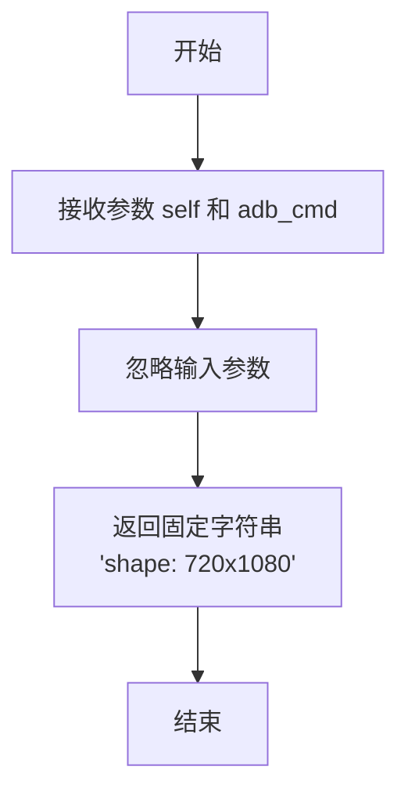

#### 带注释源码

```python
def mock_device_shape(self, adb_cmd: str) -> str:
    # 这是一个模拟函数，用于在测试中替代 `execute_adb_with_cmd` 方法。
    # 它不执行任何实际的 ADB 命令，而是直接返回一个预定义的设备分辨率字符串。
    # 这使得测试可以在不依赖真实 Android 设备或 ADB 连接的情况下运行。
    return "shape: 720x1080"
```

### `mock_device_shape_invalid`

该函数是一个用于单元测试的模拟函数，用于模拟 `AndroidExtEnv.execute_adb_with_cmd` 方法在获取设备屏幕形状时执行失败的情况。它返回一个预定义的失败常量，以测试 `AndroidExtEnv` 类在ADB命令执行失败时的错误处理逻辑。

参数：

- `self`：`Any`，模拟方法的实例参数，在单元测试中通常为 `AndroidExtEnv` 的实例。
- `adb_cmd`：`str`，模拟的ADB命令字符串，在此函数中未使用。

返回值：`str`，返回预定义的常量 `ADB_EXEC_FAIL`，表示ADB命令执行失败。

#### 流程图

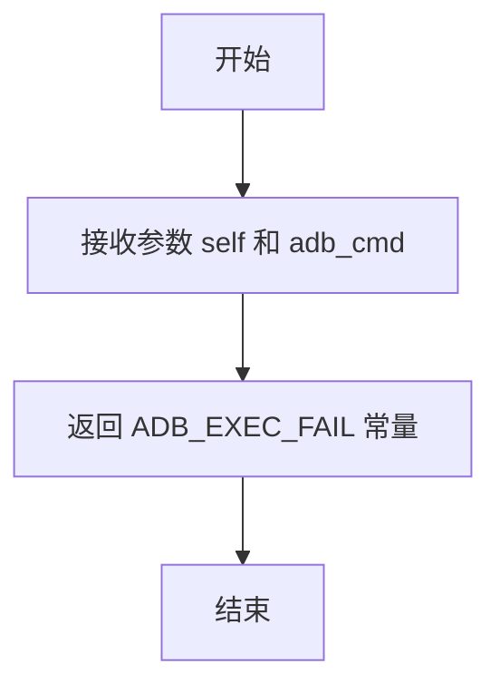

#### 带注释源码

```python
def mock_device_shape_invalid(self, adb_cmd: str) -> str:
    # 该函数模拟 ADB 命令执行失败的情况
    # 返回预定义的失败常量 ADB_EXEC_FAIL
    return ADB_EXEC_FAIL
```

### `mock_list_devices`

该函数是一个用于单元测试的模拟函数，它模拟了 `AndroidExtEnv` 类中 `list_devices` 方法的行为。它不执行实际的 ADB 命令，而是直接返回一个预定义的设备 ID 列表，用于在测试环境中验证相关逻辑。

参数：

- `self`：`Any`，模拟方法的实例参数，在此上下文中通常指向被模拟的 `AndroidExtEnv` 实例。

返回值：`List[str]`，返回一个包含模拟设备 ID 的字符串列表，此处固定为 `["emulator-5554"]`。

#### 流程图

```mermaid
flowchart TD
    A[开始] --> B[返回预定义的设备列表<br>["emulator-5554"]]
    B --> C[结束]
```

#### 带注释源码

```python
def mock_list_devices(self) -> str:
    # 该函数是一个模拟函数，用于在单元测试中替代真实的 `list_devices` 方法。
    # 它不执行任何 ADB 命令，而是直接返回一个固定的设备 ID 列表。
    # 返回值: 一个包含单个模拟设备 ID 的列表。
    return ["emulator-5554"]
```

### `mock_get_screenshot`

这是一个用于单元测试的模拟函数，它模拟了`AndroidExtEnv`类中`execute_adb_with_cmd`方法在获取屏幕截图时的行为。它不执行实际的ADB命令，而是直接返回一个固定的字符串，用于在测试环境中验证`get_screenshot`方法的逻辑。

参数：
-  `self`：`Any`，模拟方法的实例参数（通常为`AndroidExtEnv`实例）。
-  `adb_cmd`：`str`，模拟的ADB命令字符串。

返回值：`str`，返回一个固定的字符串`screenshot_xxxx-xx-xx`，模拟截图文件的名称。

#### 流程图

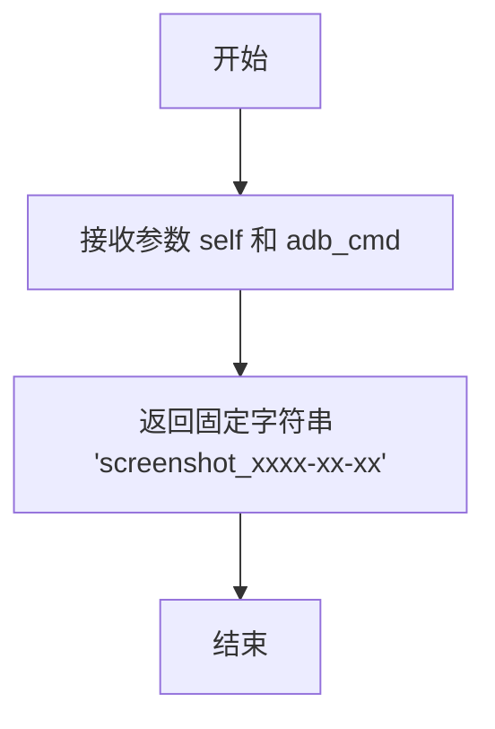

#### 带注释源码

```python
def mock_get_screenshot(self, adb_cmd: str) -> str:
    # 这是一个模拟函数，用于在单元测试中替代实际的ADB命令执行。
    # 它直接返回一个预定义的截图文件名，而不与真实设备交互。
    return "screenshot_xxxx-xx-xx"
```

### `mock_get_xml`

该函数是一个用于单元测试的模拟函数，用于模拟 `AndroidExtEnv` 类中 `execute_adb_with_cmd` 方法在获取设备UI布局XML文件时的行为。它接收一个ADB命令字符串，并返回一个固定的模拟文件名，以验证 `AndroidExtEnv.get_xml` 方法在接收到此模拟响应时的处理逻辑。

参数：

- `self`：`Any`，模拟方法的实例参数，在此上下文中通常指向被模拟的 `AndroidExtEnv` 实例。
- `adb_cmd`：`str`，模拟的ADB命令字符串，用于触发获取XML的操作。

返回值：`str`，返回一个固定的模拟XML文件名 `"xml_xxxx-xx-xx"`，用于测试后续的文件路径构建和验证逻辑。

#### 流程图

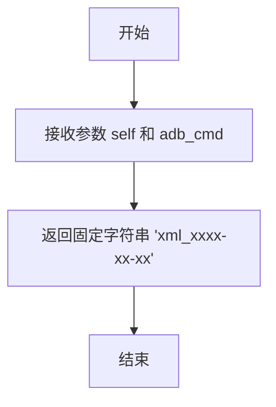

#### 带注释源码

```python
def mock_get_xml(self, adb_cmd: str) -> str:
    # 该函数模拟执行ADB命令以获取设备UI布局XML文件的操作。
    # 在单元测试中，它被用来替换真实的 `execute_adb_with_cmd` 方法，
    # 以避免实际执行ADB命令，并提供一个可控的返回值。
    # 参数:
    #   self: 模拟方法的实例，通常指向 AndroidExtEnv 实例。
    #   adb_cmd: 字符串，模拟的ADB命令。
    # 返回值:
    #   字符串，固定的模拟XML文件名 'xml_xxxx-xx-xx'。
    return "xml_xxxx-xx-xx"
```

### `mock_write_read_operation`

该函数是一个模拟函数，用于在单元测试中模拟AndroidExtEnv类中执行ADB读写操作的方法。它接收一个ADB命令字符串，并始终返回字符串"OK"，以模拟操作成功的情况。

参数：
- `self`：`Any`，表示调用该方法的实例对象（在模拟函数中通常为AndroidExtEnv的实例）。
- `adb_cmd`：`str`，表示要执行的ADB命令字符串。

返回值：`str`，始终返回字符串"OK"，表示模拟的ADB读写操作成功。

#### 流程图

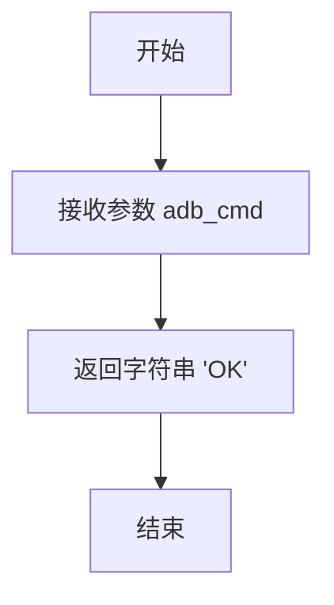

#### 带注释源码

```python
def mock_write_read_operation(self, adb_cmd: str) -> str:
    # 模拟ADB读写操作，始终返回'OK'表示操作成功
    return "OK"
```

### `test_android_ext_env`

该函数是一个单元测试函数，用于测试 `AndroidExtEnv` 类的核心功能。它通过模拟（mocking）ADB命令的执行来验证 `AndroidExtEnv` 类在不同场景下的行为，包括设备形状获取、设备列表获取、截图和XML文件获取，以及各种用户输入操作（如点击、滑动、输入文本等）。测试覆盖了正常情况和异常情况（如ADB命令执行失败）。

参数：

- `mocker`：`pytest-mock` 提供的 `MockerFixture` 类型，用于模拟（mock）函数和方法，以便在测试中隔离外部依赖。

返回值：`None`，该函数不返回任何值，仅通过断言（assert）来验证测试结果。

#### 流程图

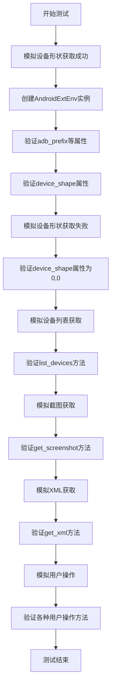

#### 带注释源码

```python
def test_android_ext_env(mocker):
    # 设置模拟的设备ID
    device_id = "emulator-5554"
    
    # 模拟 execute_adb_with_cmd 方法返回有效的设备形状信息
    mocker.patch("metagpt.environment.android.android_ext_env.AndroidExtEnv.execute_adb_with_cmd", mock_device_shape)
    # 模拟 list_devices 方法返回设备列表
    mocker.patch("metagpt.environment.android.android_ext_env.AndroidExtEnv.list_devices", mock_list_devices)

    # 创建 AndroidExtEnv 实例，传入设备ID和目录路径
    ext_env = AndroidExtEnv(device_id=device_id, screenshot_dir="/data2/", xml_dir="/data2/")
    
    # 验证 adb_prefix 属性是否正确构建
    assert ext_env.adb_prefix == f"adb -s {device_id} "
    # 验证 adb_prefix_shell 属性是否正确构建
    assert ext_env.adb_prefix_shell == f"adb -s {device_id} shell "
    # 验证 adb_prefix_si 属性是否正确构建
    assert ext_env.adb_prefix_si == f"adb -s {device_id} shell input "

    # 验证 device_shape 属性是否正确解析为元组 (720, 1080)
    assert ext_env.device_shape == (720, 1080)

    # 模拟 execute_adb_with_cmd 方法返回无效的设备形状信息（ADB执行失败）
    mocker.patch(
        "metagpt.environment.android.android_ext_env.AndroidExtEnv.execute_adb_with_cmd", mock_device_shape_invalid
    )
    # 验证 device_shape 属性在ADB执行失败时返回 (0, 0)
    assert ext_env.device_shape == (0, 0)

    # 验证 list_devices 方法返回的设备列表是否正确
    assert ext_env.list_devices() == [device_id]

    # 模拟 execute_adb_with_cmd 方法返回截图文件名
    mocker.patch("metagpt.environment.android.android_ext_env.AndroidExtEnv.execute_adb_with_cmd", mock_get_screenshot)
    # 验证 get_screenshot 方法是否正确返回截图文件的Path对象
    assert ext_env.get_screenshot("screenshot_xxxx-xx-xx", "/data/") == Path("/data/screenshot_xxxx-xx-xx.png")

    # 模拟 execute_adb_with_cmd 方法返回XML文件名
    mocker.patch("metagpt.environment.android.android_ext_env.AndroidExtEnv.execute_adb_with_cmd", mock_get_xml)
    # 验证 get_xml 方法是否正确返回XML文件的Path对象
    assert ext_env.get_xml("xml_xxxx-xx-xx", "/data/") == Path("/data/xml_xxxx-xx-xx.xml")

    # 模拟 execute_adb_with_cmd 方法返回操作成功的结果 "OK"
    mocker.patch(
        "metagpt.environment.android.android_ext_env.AndroidExtEnv.execute_adb_with_cmd", mock_write_read_operation
    )
    res = "OK"
    # 验证各种用户操作方法是否返回预期的结果 "OK"
    assert ext_env.system_back() == res
    assert ext_env.system_tap(10, 10) == res
    assert ext_env.user_input("test_input") == res
    assert ext_env.user_longpress(10, 10) == res
    assert ext_env.user_swipe(10, 10) == res
    assert ext_env.user_swipe_to((10, 10), (20, 20)) == res
```

### `AndroidExtEnv.execute_adb_with_cmd`

该方法用于执行指定的ADB命令，并返回命令执行后的输出结果。它封装了ADB命令的执行过程，处理了命令的构建、执行以及结果的捕获和返回。

参数：

- `adb_cmd`：`str`，要执行的ADB命令字符串。

返回值：`str`，ADB命令执行后的输出结果。

#### 流程图

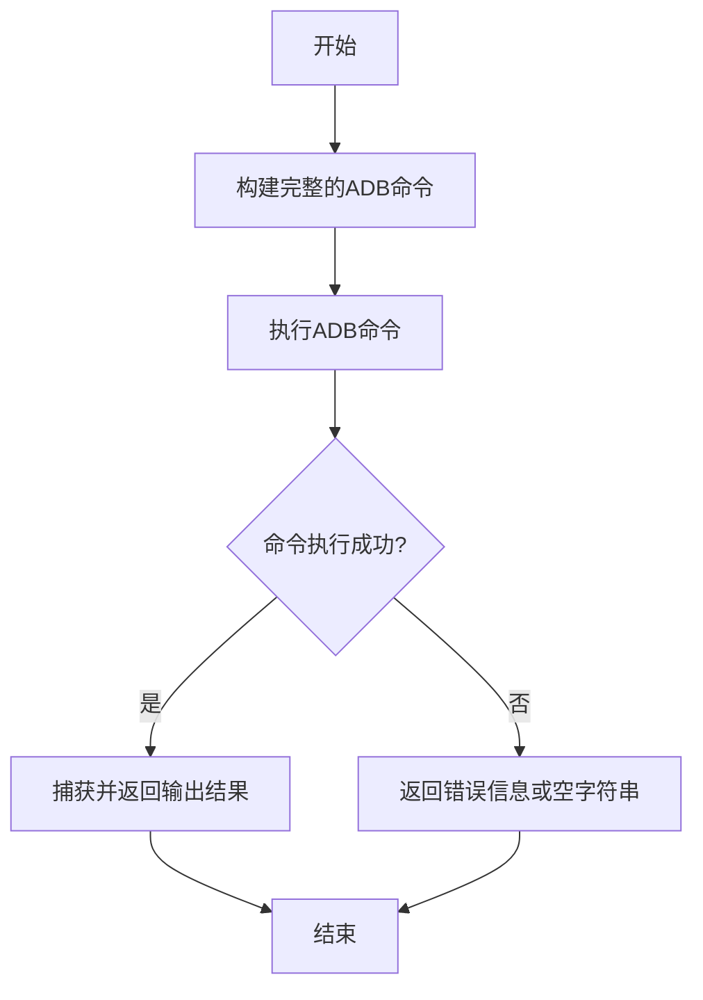

#### 带注释源码

```python
def execute_adb_with_cmd(self, adb_cmd: str) -> str:
    """
    执行指定的ADB命令并返回结果。

    该方法将传入的ADB命令与实例的adb_prefix（设备ID前缀）拼接，
    然后通过subprocess.run执行该命令，捕获标准输出和标准错误。
    如果命令执行成功，返回标准输出的字符串（去除首尾空白字符）；
    如果执行失败，返回标准错误的字符串或空字符串。

    Args:
        adb_cmd (str): 要执行的ADB命令，例如 "shell input tap 100 200"。

    Returns:
        str: 命令执行后的输出结果。成功时返回标准输出，失败时返回标准错误或空字符串。
    """
    # 构建完整的ADB命令，将设备ID前缀与传入的命令拼接
    full_cmd = f"{self.adb_prefix}{adb_cmd}"
    
    # 使用subprocess.run执行命令，捕获标准输出和标准错误
    result = subprocess.run(full_cmd, shell=True, capture_output=True, text=True)
    
    # 检查命令执行是否成功（返回码为0表示成功）
    if result.returncode == 0:
        # 成功时返回标准输出，去除首尾空白字符
        return result.stdout.strip()
    else:
        # 失败时返回标准错误，如果标准错误为空则返回空字符串
        return result.stderr.strip() if result.stderr else ""
```

### `AndroidExtEnv.list_devices`

该方法用于列出当前通过ADB连接的所有Android设备。

参数：无

返回值：`List[str]`，返回一个字符串列表，每个字符串代表一个已连接设备的ID（例如 `"emulator-5554"`）。

#### 流程图

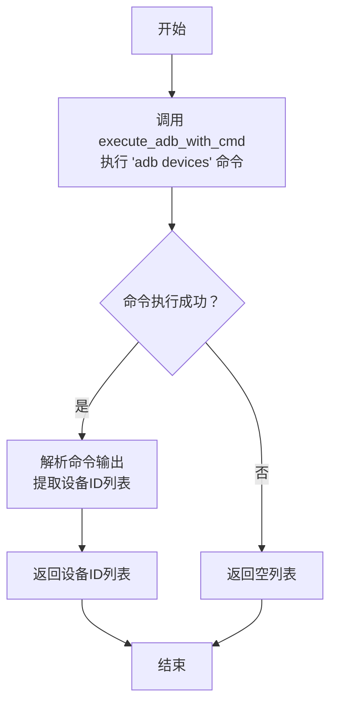

#### 带注释源码

```python
def list_devices(self) -> List[str]:
    """
    列出当前通过ADB连接的所有Android设备。
    该方法通过执行 `adb devices` 命令来获取设备列表。
    如果命令执行失败或没有设备连接，则返回一个空列表。

    Returns:
        List[str]: 已连接设备的ID列表。
    """
    # 执行 'adb devices' 命令，该命令会列出所有连接的设备
    result = self.execute_adb_with_cmd("adb devices")
    devices = []
    # 检查命令执行结果是否有效（非空且不是失败标识）
    if result and result != ADB_EXEC_FAIL:
        # 按行分割命令输出
        lines = result.split("\n")
        for line in lines:
            # 跳过表头行（如 'List of devices attached'）和空行
            if line.strip() and "device" in line and not line.startswith("List"):
                # 提取设备ID（输出格式通常为 '设备ID\tdevice'）
                device_id = line.split("\t")[0]
                devices.append(device_id)
    # 返回提取到的设备ID列表，如果没有设备则返回空列表
    return devices
```

### `AndroidExtEnv.get_screenshot`

该方法用于获取Android设备的屏幕截图，并将其保存到指定的目录中。

参数：
- `screenshot_name`：`str`，截图文件的名称（不包含扩展名）。
- `screenshot_dir`：`str`，截图文件保存的目录路径。

返回值：`Path`，返回保存的截图文件的完整路径对象。

#### 流程图

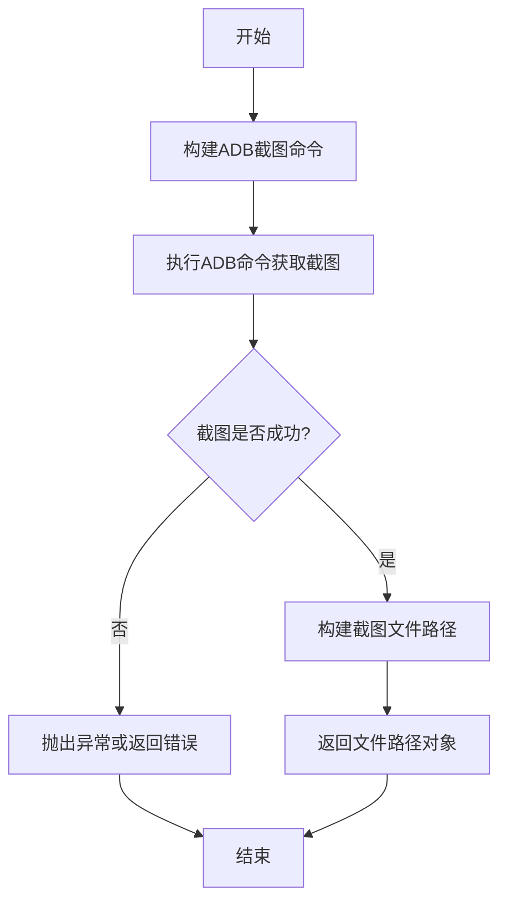

#### 带注释源码

```python
def get_screenshot(self, screenshot_name: str, screenshot_dir: str) -> Path:
    """
    获取Android设备的屏幕截图并保存到指定目录。

    Args:
        screenshot_name (str): 截图文件的名称（不包含扩展名）。
        screenshot_dir (str): 截图文件保存的目录路径。

    Returns:
        Path: 保存的截图文件的完整路径对象。

    Raises:
        RuntimeError: 如果截图失败（例如ADB命令执行失败）。
    """
    # 构建ADB截图命令，将截图保存到设备的/sdcard/目录下
    adb_cmd = f"shell screencap -p /sdcard/{screenshot_name}.png"
    # 执行ADB命令，获取截图
    result = self.execute_adb_with_cmd(adb_cmd)
    
    # 检查截图是否成功，如果失败则抛出异常
    if result == ADB_EXEC_FAIL:
        raise RuntimeError("Failed to capture screenshot")
    
    # 构建截图文件在本地保存的完整路径
    screenshot_path = Path(screenshot_dir) / f"{screenshot_name}.png"
    # 从设备拉取截图文件到本地目录
    self.execute_adb_with_cmd(f"pull /sdcard/{screenshot_name}.png {screenshot_path}")
    
    # 返回截图文件的路径对象
    return screenshot_path
```

### `AndroidExtEnv.get_xml`

该方法用于从Android设备获取当前界面的UI层次结构XML文件，并将其保存到本地指定目录。

参数：
- `xml_name`：`str`，指定生成的XML文件的名称（不含扩展名）
- `xml_dir`：`str`，指定XML文件保存的本地目录路径

返回值：`Path`，返回保存的XML文件的完整路径对象

#### 流程图

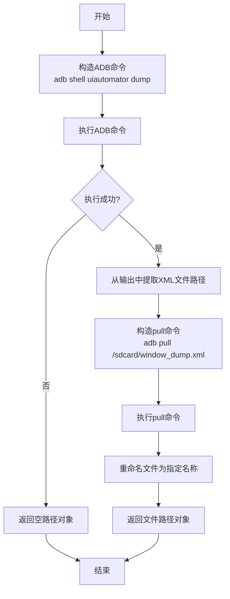

#### 带注释源码

```python
def get_xml(self, xml_name: str, xml_dir: str) -> Path:
    """
    获取当前界面的UI层次结构XML文件
    
    Args:
        xml_name: XML文件名（不含扩展名）
        xml_dir: XML文件保存目录
        
    Returns:
        Path: 保存的XML文件路径
    """
    # 构造uiautomator dump命令，将UI层次结构保存到设备上的临时文件
    cmd = f"{self.adb_prefix_shell} uiautomator dump /sdcard/window_dump.xml"
    # 执行ADB命令
    res = self.execute_adb_with_cmd(cmd)
    
    # 检查命令执行是否成功
    if ADB_EXEC_FAIL in res:
        # 执行失败，返回空路径对象
        return Path()
    
    # 从命令输出中提取XML文件在设备上的路径
    # 输出格式通常为：DUMP: /sdcard/window_dump.xml
    xml_path = res.split(":")[-1].strip()
    
    # 构造pull命令，将XML文件从设备拉取到本地
    cmd = f"{self.adb_prefix} pull {xml_path} {xml_dir}"
    # 执行pull命令
    res = self.execute_adb_with_cmd(cmd)
    
    # 构造本地文件路径
    xml_path = Path(xml_dir) / f"{xml_name}.xml"
    
    # 重命名文件为指定的名称
    Path(xml_dir) / "window_dump.xml".rename(xml_path)
    
    # 返回文件路径对象
    return xml_path
```

### `AndroidExtEnv.system_back`

该方法用于在Android设备上模拟按下系统返回键的操作。

参数：无

返回值：`str`，返回ADB命令执行的结果字符串，成功时通常为"OK"。

#### 流程图

```mermaid
flowchart TD
    A[开始] --> B[构造ADB命令<br>adb -s {device_id} shell input keyevent KEYCODE_BACK]
    B --> C[调用execute_adb_with_cmd执行命令]
    C --> D{执行成功?}
    D -- 是 --> E[返回执行结果字符串]
    D -- 否 --> F[返回错误信息]
    E --> G[结束]
    F --> G
```

#### 带注释源码

```python
def system_back(self) -> str:
    """
    模拟按下系统返回键。
    
    该方法通过ADB向连接的Android设备发送一个KEYCODE_BACK按键事件，
    这等同于用户按下了设备的返回键。
    
    Returns:
        str: ADB命令执行后的输出结果。如果命令成功执行，通常返回"OK"。
             如果执行失败，则返回错误信息。
    """
    # 构造完整的ADB命令，用于发送返回键事件
    # adb -s {device_id} shell input keyevent KEYCODE_BACK
    cmd = f"{self.adb_prefix_si}keyevent KEYCODE_BACK"
    
    # 调用内部方法执行ADB命令并返回结果
    return self.execute_adb_with_cmd(cmd)
```

### `AndroidExtEnv.system_tap`

该方法用于在Android设备上模拟点击操作，通过ADB命令向指定坐标发送触摸事件。

参数：

- `x`：`int`，点击位置的X坐标
- `y`：`int`，点击位置的Y坐标

返回值：`str`，执行ADB命令后的返回结果，成功时为"OK"，失败时为错误信息

#### 流程图

```mermaid
flowchart TD
    A[开始] --> B[构造ADB点击命令]
    B --> C[执行ADB命令]
    C --> D{执行成功?}
    D -->|是| E[返回"OK"]
    D -->|否| F[返回错误信息]
    E --> G[结束]
    F --> G
```

#### 带注释源码

```python
def system_tap(self, x: int, y: int) -> str:
    """
    在指定坐标执行点击操作
    
    Args:
        x: 点击位置的X坐标
        y: 点击位置的Y坐标
        
    Returns:
        ADB命令执行结果
    """
    # 构造ADB点击命令，格式为：adb -s {device_id} shell input tap x y
    cmd = f"{self.adb_prefix_si}tap {x} {y}"
    
    # 执行ADB命令并返回结果
    return self.execute_adb_with_cmd(cmd)
```

### `AndroidExtEnv.user_input`

该方法用于在Android设备上模拟用户输入文本的操作。它通过ADB命令向设备发送指定的文本内容，通常用于自动化测试或脚本控制场景。

参数：

- `text`：`str`，需要输入的文本内容

返回值：`str`，返回ADB命令执行的结果，成功时通常为"OK"，失败时返回错误信息

#### 流程图

```mermaid
graph TD
    A[开始] --> B[构造ADB输入命令]
    B --> C[执行ADB命令]
    C --> D{执行成功?}
    D -->|是| E[返回"OK"]
    D -->|否| F[返回错误信息]
    E --> G[结束]
    F --> G
```

#### 带注释源码

```python
def user_input(self, text: str) -> str:
    """
    在Android设备上模拟用户输入文本
    
    Args:
        text: 需要输入的文本内容
        
    Returns:
        ADB命令执行结果，成功返回"OK"，失败返回错误信息
    """
    # 构造ADB输入文本命令
    # 使用shell input text命令将文本发送到设备
    adb_cmd = f"{self.adb_prefix_si}text {text}"
    
    # 执行ADB命令并返回结果
    return self.execute_adb_with_cmd(adb_cmd)
```

### `AndroidExtEnv.user_longpress`

该方法用于在Android设备上模拟长按操作，通过ADB命令向指定坐标发送长按事件。

参数：

- `x`：`int`，长按操作的X坐标
- `y`：`int`，长按操作的Y坐标

返回值：`str`，执行ADB命令后的输出结果，通常为"OK"表示成功

#### 流程图

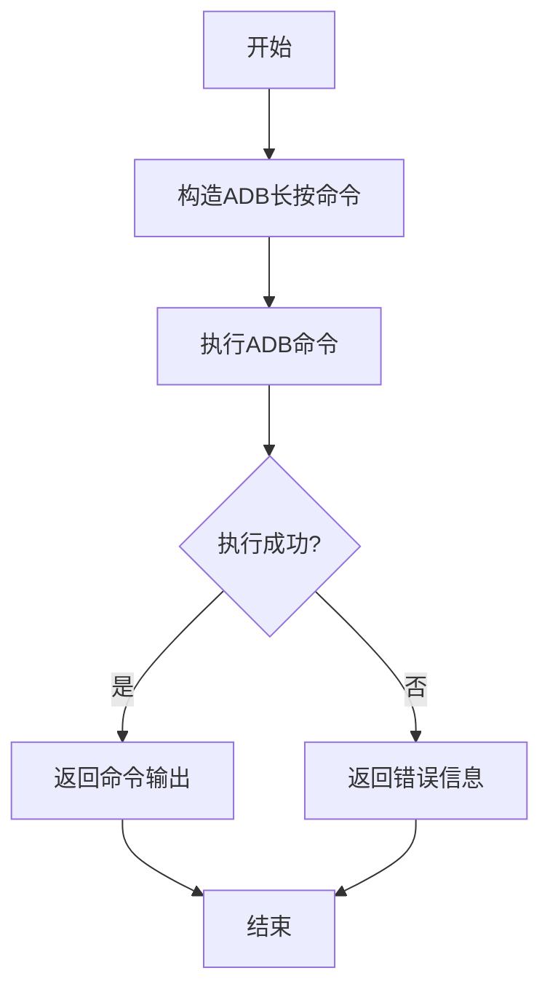

#### 带注释源码

```python
def user_longpress(self, x: int, y: int) -> str:
    """
    在指定坐标执行长按操作
    
    Args:
        x: 长按操作的X坐标
        y: 长按操作的Y坐标
        
    Returns:
        ADB命令执行结果，通常为"OK"表示成功
    """
    # 构造ADB长按命令，格式为：adb -s {device_id} shell input swipe x y x y duration
    # 其中duration参数控制长按时间（毫秒）
    cmd = f"{self.adb_prefix_si}swipe {x} {y} {x} {y} 1000"
    
    # 执行ADB命令并返回结果
    return self.execute_adb_with_cmd(cmd)
```

### `AndroidExtEnv.user_swipe`

该方法用于在Android设备上执行一个滑动操作，从指定的起始坐标滑动到相同的坐标（即原地滑动），模拟用户滑动屏幕的动作。

参数：

- `x`：`int`，滑动操作的起始和结束的X坐标
- `y`：`int`，滑动操作的起始和结束的Y坐标

返回值：`str`，执行ADB命令后的返回结果，通常为"OK"表示成功，否则为错误信息

#### 流程图

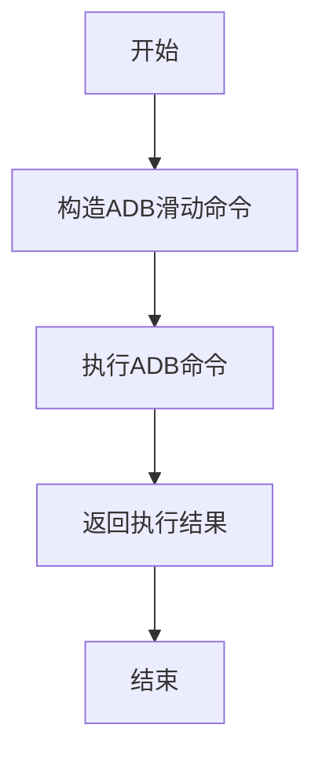

#### 带注释源码

```python
def user_swipe(self, x: int, y: int) -> str:
    """
    在Android设备上执行滑动操作
    
    该方法通过ADB命令在设备上执行滑动操作，从指定坐标(x,y)滑动到相同坐标(x,y)，
    实际上是一个原地滑动操作，常用于模拟用户滑动屏幕的动作。
    
    Args:
        x: 滑动操作的X坐标
        y: 滑动操作的Y坐标
        
    Returns:
        str: ADB命令执行结果，成功返回"OK"，失败返回错误信息
    """
    # 构造ADB滑动命令，格式为：adb -s {device_id} shell input swipe x1 y1 x2 y2
    # 这里x1=x2, y1=y2，表示从(x,y)滑动到(x,y)，即原地滑动
    cmd = f"{self.adb_prefix_si}swipe {x} {y} {x} {y}"
    
    # 执行ADB命令并返回结果
    return self.execute_adb_with_cmd(cmd)
```

### `AndroidExtEnv.user_swipe_to`

该方法用于在Android设备上执行从起始坐标到目标坐标的滑动操作。

参数：

- `start_point`：`tuple[int, int]`，滑动的起始坐标点，格式为(x, y)。
- `end_point`：`tuple[int, int]`，滑动的目标坐标点，格式为(x, y)。

返回值：`str`，返回ADB命令执行的结果字符串，成功时为"OK"。

#### 流程图

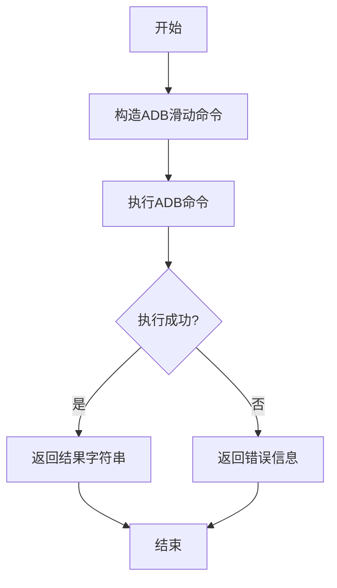

#### 带注释源码

```python
def user_swipe_to(self, start_point: tuple[int, int], end_point: tuple[int, int]) -> str:
    """
    从起始坐标滑动到目标坐标。

    Args:
        start_point (tuple[int, int]): 起始坐标 (x, y)。
        end_point (tuple[int, int]): 目标坐标 (x, y)。

    Returns:
        str: ADB命令执行结果。
    """
    # 构造ADB滑动命令，格式为：adb -s <device_id> shell input swipe <x1> <y1> <x2> <y2>
    cmd = f"{self.adb_prefix_si}swipe {start_point[0]} {start_point[1]} {end_point[0]} {end_point[1]}"
    # 执行ADB命令并返回结果
    return self.execute_adb_with_cmd(cmd)
```

## 关键组件


### AndroidExtEnv

AndroidExtEnv 是用于与 Android 设备进行交互的环境类，它封装了 ADB 命令的执行，提供了获取设备信息、屏幕截图、UI 布局以及模拟用户输入（如点击、滑动、文本输入）等核心功能。

### ADB 命令执行与封装

该类通过 `execute_adb_with_cmd` 等方法封装了底层的 ADB 命令调用，将复杂的命令行操作抽象为简单的方法调用，如 `get_screenshot`, `system_tap` 等，简化了自动化测试或设备控制的流程。

### 设备状态管理

该类管理着与目标 Android 设备的连接状态，通过 `device_id` 和 `adb_prefix` 等字段标识和构建针对特定设备的命令，并提供了 `list_devices` 方法来获取可用的设备列表。

### 模拟用户输入操作

提供了一系列方法（如 `user_input`, `user_swipe`, `system_back`）来模拟用户在 Android 设备上的各种交互操作，这些方法是实现自动化测试或远程控制的关键。

### 资源获取与处理

提供了从设备获取关键资源的方法，包括获取当前屏幕截图 (`get_screenshot`)、获取当前 UI 的层级布局 XML (`get_xml`) 以及获取设备屏幕分辨率 (`device_shape`)。

### 错误处理与常量定义

通过 `ADB_EXEC_FAIL` 等常量定义了 ADB 命令执行失败时的返回值，并在如 `device_shape` 属性等方法中处理这些错误情况，返回安全的默认值（如 `(0, 0)`），增强了代码的健壮性。


## 问题及建议

### 已知问题

-   **测试用例对模拟器（`emulator-5554`）有硬编码依赖**：测试代码中多处直接使用 `"emulator-5554"` 作为设备ID，这降低了测试的灵活性。如果测试环境没有此特定模拟器或设备ID发生变化，测试将无法运行或需要修改代码。
-   **模拟方法（Mock）的返回值过于简单且固定**：例如 `mock_write_read_operation` 对所有操作都返回 `"OK"`，`mock_get_screenshot` 和 `mock_get_xml` 返回固定的文件名。这虽然能通过测试，但无法有效验证 `AndroidExtEnv` 类中不同方法对ADB命令输出的不同处理逻辑（如解析、错误处理、路径拼接等），测试覆盖度不足。
-   **测试数据目录路径硬编码**：测试中使用了硬编码的路径 `"/data2/"` 和 `"/data/"`。这可能导致在非Linux系统或没有相应目录权限的环境下运行测试时失败，降低了测试的可移植性。
-   **缺少对异常和错误情况的充分测试**：当前测试仅通过 `mock_device_shape_invalid` 模拟了一种ADB执行失败的情况（返回 `ADB_EXEC_FAIL`），并验证了 `device_shape` 属性返回 `(0, 0)`。对于其他方法（如 `get_screenshot`, `get_xml`, 各种用户操作）在ADB命令执行失败、返回异常格式、设备未连接等情况下的行为，缺乏相应的测试用例。

### 优化建议

-   **解耦测试对特定设备的依赖**：建议从环境变量或配置文件读取测试用的设备ID，或者使用 `pytest` 的 `fixture` 动态获取可用设备列表。如果只是为了单元测试，可以完全使用模拟（Mock）来避免对真实ADB和设备的依赖。
-   **增强模拟（Mock）的多样性和真实性**：为不同的被测试方法设计更具针对性的模拟返回值。例如，为 `get_screenshot` 模拟包含时间戳的动态文件名，为各种 `user_*` 和 `system_*` 操作模拟可能出现的成功、失败及特定输出。这有助于更全面地测试被测代码的逻辑分支。
-   **使用临时目录管理测试文件**：利用 `pytest` 的 `tmp_path` 或 `tempfile` 模块创建临时目录来存放测试生成的截图和XML文件。测试结束后自动清理，避免硬编码路径和残留文件问题，提高测试的隔离性和可重复性。
-   **补充边界条件、异常流和错误处理测试**：增加测试用例，覆盖以下场景：
    -   `list_devices` 返回空列表或多设备列表时的情况。
    -   `execute_adb_with_cmd` 抛出异常时（如 `subprocess.CalledProcessError`），相关方法的错误处理。
    -   `get_screenshot` 和 `get_xml` 方法中，当ADB命令执行成功但文件未按预期生成时的处理。
    -   传入无效坐标参数（如负数、超出屏幕范围）时用户操作方法的鲁棒性。
    -   设备断开连接后重试操作的场景。
-   **考虑重构测试以提高可维护性**：将重复的模拟设置（`mocker.patch`）提取到 `pytest fixture` 中。将相关的断言分组，并使用参数化测试（`@pytest.mark.parametrize`）来测试具有相似输入输出模式的方法（如 `system_tap`, `user_longpress` 等），减少代码重复。

## 其它


### 设计目标与约束

该代码是 `AndroidExtEnv` 类的单元测试，旨在验证其与 Android 设备交互的核心功能。设计目标包括：1) 隔离测试：通过 Mock 技术模拟 ADB 命令执行，确保测试不依赖真实物理设备或模拟器，实现快速、可重复的自动化测试。2) 功能覆盖：验证 `AndroidExtEnv` 的关键方法，如设备连接、屏幕截图、UI XML 获取、用户输入模拟（点击、滑动、输入）等。3) 错误处理验证：测试在 ADB 命令执行失败（如返回 `ADB_EXEC_FAIL`）时，类的行为是否符合预期（例如 `device_shape` 返回 `(0, 0)`）。主要约束是测试环境需安装 `pytest` 和 `pytest-mock` 库，且测试逻辑紧密依赖于被测试类 `AndroidExtEnv` 的接口定义。

### 错误处理与异常设计

测试代码本身不包含复杂的错误处理逻辑，其重点是验证 `AndroidExtEnv` 类在特定输入或模拟响应下的行为。测试中显式验证了错误场景：当 `execute_adb_with_cmd` 方法被 Mock 为返回 `ADB_EXEC_FAIL`（一个表示失败的常量）时，`device_shape` 属性应返回 `(0, 0)`。这间接测试了 `AndroidExtEnv` 内部对 ADB 命令失败的处理机制。测试用例通过断言（`assert`）来验证预期结果，如果 `AndroidExtEnv` 的实现未正确处理错误，断言将失败，从而暴露出问题。测试未覆盖所有可能的异常（如设备未连接、文件路径错误等），这些应由 `AndroidExtEnv` 类自身的实现来处理。

### 数据流与状态机

测试的数据流是线性的、无状态的。流程为：1) **准备阶段**：设置 Mock，模拟 `execute_adb_with_cmd` 和 `list_devices` 方法返回特定值。2) **初始化与属性验证**：创建 `AndroidExtEnv` 实例，验证其根据 `device_id` 生成的 ADB 命令前缀。3) **正常功能验证**：在 Mock 正常响应下，验证 `device_shape` 属性解析。4) **错误场景验证**：更改 Mock 以模拟失败响应，再次验证 `device_shape`。5) **设备列表验证**：验证 `list_devices` 方法。6) **文件操作验证**：Mock 截图和 XML 获取命令，验证 `get_screenshot` 和 `get_xml` 方法返回正确的 `Path` 对象。7) **用户操作验证**：Mock 输入命令，验证一系列用户交互方法（如 `system_tap`, `user_input` 等）返回预期的 "OK"。整个测试过程不涉及 `AndroidExtEnv` 实例内部状态的复杂变迁，主要是对输入（Mock 响应）和输出（方法返回值或属性）的验证。

### 外部依赖与接口契约

测试代码的外部依赖主要包括：1) **被测试类**：`metagpt.environment.android.android_ext_env.AndroidExtEnv`。2) **常量**：`metagpt.environment.android.const.ADB_EXEC_FAIL`。3) **测试框架**：`pytest` 及 `mocker` fixture（来自 `pytest-mock`）。测试通过 Mock 技术切断了与真实 ADB 命令行工具、Android 设备或模拟器的依赖，使其成为纯粹的单元测试。接口契约体现在测试对 `AndroidExtEnv` 公共方法和属性的调用上：它依赖于 `AndroidExtEnv` 的构造函数参数（`device_id`, `screenshot_dir`, `xml_dir`）、属性（`adb_prefix`, `adb_prefix_shell`, `adb_prefix_si`, `device_shape`）以及方法（`list_devices`, `get_screenshot`, `get_xml`, `system_back`, `system_tap`, `user_input`, `user_longpress`, `user_swipe`, `user_swipe_to`）的签名和行为。任何对这些接口的更改都可能破坏此测试。

    