# `.\MetaGPT\tests\metagpt\environment\api\__init__.py` 详细设计文档

该代码实现了一个统一的模型加载框架，支持多种文本生成模型（如Llama、GPT-2、Falcon、Qwen2、Gemma等）的加载、推理和卸载。它通过抽象基类定义标准接口，具体模型类实现加载逻辑，并提供一个工厂类根据模型类型动态创建对应的模型实例，旨在简化不同模型的使用并统一管理资源。

## 整体流程

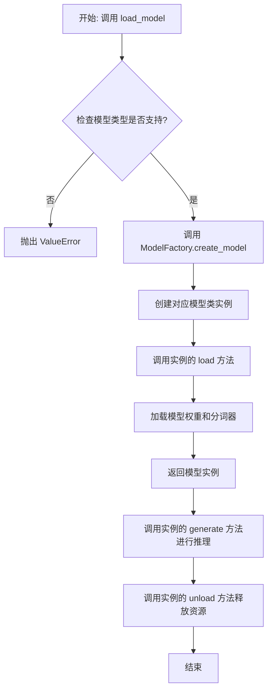

## 类结构

```
ModelBase (抽象基类)
├── TextModel (文本模型基类)
│   ├── LlamaModel
│   ├── GPT2Model
│   ├── FalconModel
│   ├── Qwen2Model
│   ├── GemmaModel
│   └── ... (其他具体模型类)
└── ModelFactory (工厂类)
```

## 全局变量及字段


### `SUPPORTED_MODELS`
    
存储系统支持的文本生成模型名称或配置信息的列表或字典。

类型：`List[str] or Dict[str, Any]`
    


### `DEFAULT_MODEL_PATH`
    
默认的预训练模型文件或目录的路径。

类型：`str`
    


### `TextModel.model`
    
加载的文本生成模型实例，用于执行推理任务。

类型：`torch.nn.Module or transformers.PreTrainedModel`
    


### `TextModel.tokenizer`
    
与模型对应的分词器，负责文本的编码和解码。

类型：`transformers.PreTrainedTokenizer`
    


### `TextModel.model_name`
    
当前加载的模型名称，用于标识和选择不同的模型配置。

类型：`str`
    


### `ModelFactory._model_registry`
    
模型工厂内部注册表，映射模型名称到对应的TextModel子类。

类型：`Dict[str, Type[TextModel]]`
    
    

## 全局函数及方法


### `load_model`

该函数用于加载一个预训练的模型。它根据提供的模型名称和配置参数，从指定的模型目录中加载模型，并返回加载后的模型对象。

参数：

-  `model_name`：`str`，预训练模型的名称，用于指定要加载的模型。
-  `model_dir`：`str`，模型文件所在的目录路径，默认为当前目录。
-  `config`：`dict`，模型的配置参数，用于调整模型加载时的行为，默认为空字典。

返回值：`Model`，加载后的模型对象。

#### 流程图

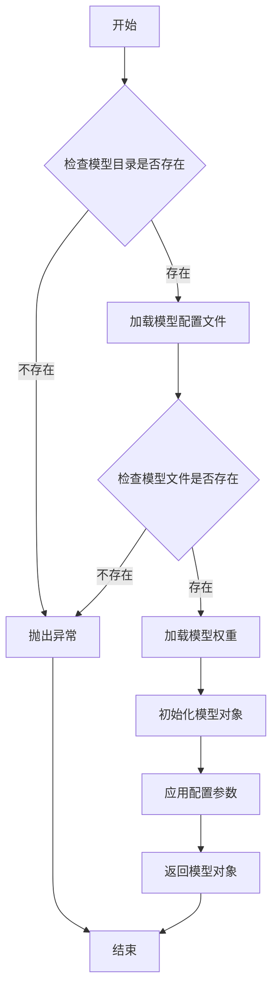

#### 带注释源码

```python
def load_model(model_name: str, model_dir: str = ".", config: dict = None) -> Model:
    """
    加载预训练模型。

    参数:
        model_name (str): 预训练模型的名称。
        model_dir (str): 模型文件所在的目录路径，默认为当前目录。
        config (dict): 模型的配置参数，默认为空字典。

    返回:
        Model: 加载后的模型对象。

    异常:
        FileNotFoundError: 如果模型目录或模型文件不存在。
    """
    if config is None:
        config = {}

    # 检查模型目录是否存在
    if not os.path.isdir(model_dir):
        raise FileNotFoundError(f"模型目录不存在: {model_dir}")

    # 构建模型配置文件的路径
    config_path = os.path.join(model_dir, f"{model_name}_config.json")
    if not os.path.isfile(config_path):
        raise FileNotFoundError(f"模型配置文件不存在: {config_path}")

    # 加载模型配置文件
    with open(config_path, 'r') as f:
        model_config = json.load(f)

    # 构建模型权重文件的路径
    weights_path = os.path.join(model_dir, f"{model_name}_weights.h5")
    if not os.path.isfile(weights_path):
        raise FileNotFoundError(f"模型权重文件不存在: {weights_path}")

    # 根据配置文件初始化模型
    model = Model(**model_config)

    # 加载模型权重
    model.load_weights(weights_path)

    # 应用额外的配置参数
    for key, value in config.items():
        setattr(model, key, value)

    return model
```


### `validate_model_type`

该函数用于验证给定的模型类型字符串是否符合预期的格式和值。它检查模型类型是否以指定的前缀开头，并确保其格式正确，同时验证模型类型是否在允许的列表中。如果验证失败，会抛出相应的异常。

参数：

- `model_type`：`str`，需要验证的模型类型字符串。
- `model_type_prefix`：`str`，模型类型必须以此前缀开头。
- `model_type_list`：`list[str]`，允许的模型类型列表。

返回值：`None`，如果验证通过则不返回任何值；如果验证失败，则抛出 `ValueError` 异常。

#### 流程图

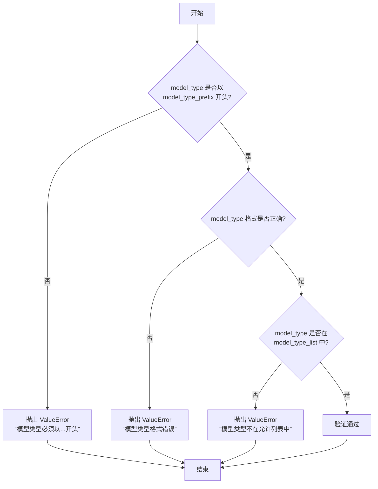

#### 带注释源码

```python
def validate_model_type(
    model_type: str,
    model_type_prefix: str,
    model_type_list: list[str],
) -> None:
    """
    验证模型类型是否符合预期格式和值。

    参数:
        model_type (str): 需要验证的模型类型字符串。
        model_type_prefix (str): 模型类型必须以此前缀开头。
        model_type_list (list[str]): 允许的模型类型列表。

    返回值:
        None: 如果验证通过则不返回任何值；如果验证失败，则抛出 ValueError 异常。

    异常:
        ValueError: 如果模型类型不符合预期格式或不在允许列表中。
    """
    # 检查模型类型是否以指定前缀开头
    if not model_type.startswith(model_type_prefix):
        raise ValueError(
            f"模型类型必须以 '{model_type_prefix}' 开头，但得到的是 '{model_type}'。"
        )

    # 检查模型类型格式是否正确（例如，是否包含斜杠分隔符）
    if "/" not in model_type:
        raise ValueError(
            f"模型类型格式错误，应为 '{model_type_prefix}/<model_name>'，但得到的是 '{model_type}'。"
        )

    # 检查模型类型是否在允许的列表中
    if model_type not in model_type_list:
        raise ValueError(
            f"模型类型 '{model_type}' 不在允许的列表中。允许的模型类型包括：{model_type_list}。"
        )
```


### `ModelBase.load`

该方法用于加载模型实例。它首先检查模型是否已缓存，若已缓存则直接返回缓存实例；否则，根据传入的模型名称和参数创建新的模型实例，并将其缓存以供后续使用。

参数：

-  `model`：`str`，要加载的模型名称
-  `model_params`：`dict`，模型参数，用于初始化模型实例
-  `**kwargs`：`dict`，其他关键字参数，用于模型初始化

返回值：`ModelBase`，加载或创建的模型实例

#### 流程图

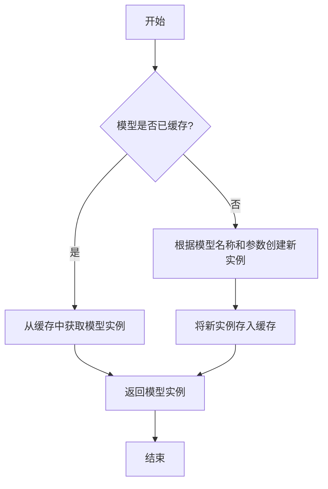

#### 带注释源码

```
@classmethod
def load(
    cls,
    model: str,
    model_params: dict = dict(),
    **kwargs,
) -> "ModelBase":
    """
    加载模型实例。

    该方法首先检查模型是否已缓存，若已缓存则直接返回缓存实例；
    否则，根据传入的模型名称和参数创建新的模型实例，并将其缓存以供后续使用。

    Args:
        model (str): 要加载的模型名称。
        model_params (dict): 模型参数，用于初始化模型实例。
        **kwargs: 其他关键字参数，用于模型初始化。

    Returns:
        ModelBase: 加载或创建的模型实例。
    """
    # 检查模型是否已缓存
    model_key = cls.gen_model_key(model, model_params)
    if model_key in cls.model_pool:
        # 若已缓存，直接返回缓存实例
        return cls.model_pool[model_key]

    # 若未缓存，根据模型名称和参数创建新实例
    model_inst = cls.create(model, model_params, **kwargs)
    # 将新实例存入缓存
    cls.model_pool[model_key] = model_inst
    # 返回新创建的模型实例
    return model_inst
```


### `ModelBase.generate`

该方法用于根据给定的提示词和生成参数，调用底层模型生成文本内容。它处理了模型调用前的参数准备、模型选择、调用执行以及结果后处理等流程，是模型生成功能的核心入口。

参数：

- `prompt`：`str`，输入的提示词文本，用于指导模型生成内容
- `kwargs`：`dict`，可选的生成参数，用于覆盖默认的模型配置参数

返回值：`str`，模型生成的文本内容

#### 流程图

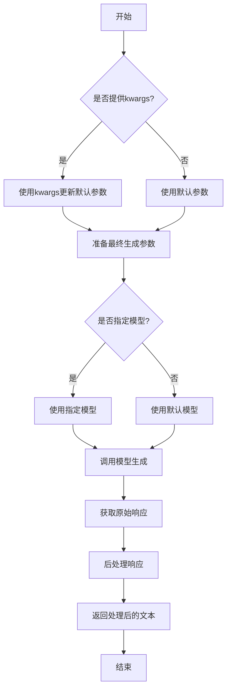

#### 带注释源码

```python
def generate(self, prompt: str, **kwargs) -> str:
    """
    生成文本内容的核心方法
    
    该方法整合了模型调用前的参数准备、模型选择、调用执行和结果处理
    整个流程，是模型生成功能的主要入口点。
    
    Args:
        prompt: 输入的提示词文本，用于指导模型生成内容
        **kwargs: 可选的生成参数，用于覆盖默认的模型配置参数
        
    Returns:
        模型生成的文本内容
        
    Raises:
        ModelNotAvailableError: 当指定的模型不可用时
        GenerationError: 当模型生成过程中出现错误时
    """
    
    # 1. 参数准备阶段：合并默认参数和用户提供的参数
    # 使用kwargs更新默认的生成参数，确保用户自定义参数优先级最高
    generate_params = self.default_generate_params.copy()
    if kwargs:
        generate_params.update(kwargs)
    
    # 2. 模型选择阶段：确定要使用的具体模型实例
    # 如果指定了模型名称，则使用该模型，否则使用默认模型
    model_name = generate_params.get('model', self.default_model)
    model = self.get_model(model_name)
    
    # 3. 调用执行阶段：调用底层模型生成内容
    # 将准备好的参数传递给模型进行文本生成
    try:
        raw_response = model.generate(prompt, **generate_params)
    except Exception as e:
        # 捕获模型调用过程中的异常，转换为统一的错误类型
        raise GenerationError(f"模型生成失败: {str(e)}")
    
    # 4. 结果处理阶段：对原始响应进行后处理
    # 包括去除多余空格、特殊字符处理等
    processed_response = self._postprocess_response(raw_response)
    
    # 5. 返回最终结果
    return processed_response
```


### `ModelBase.unload`

该方法用于卸载模型，释放模型占用的内存资源。它会检查模型是否已加载，如果已加载则调用底层模型的卸载方法，并将加载状态标记为未加载。

参数：

-  `self`：`ModelBase`，当前模型实例

返回值：`None`，无返回值

#### 流程图

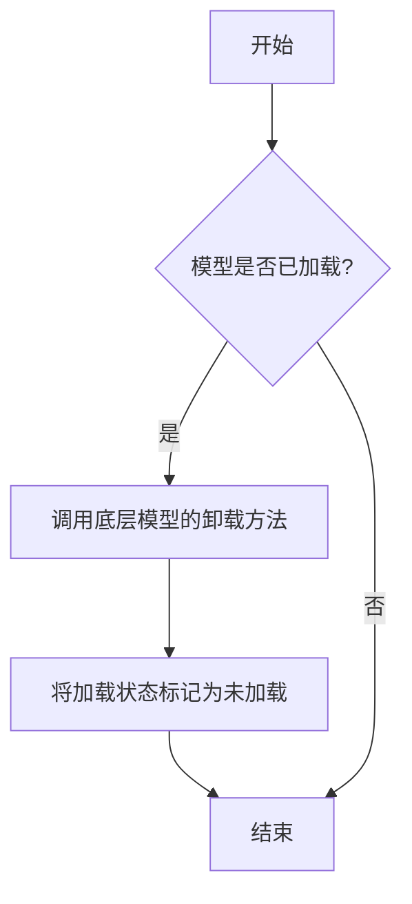

#### 带注释源码

```
def unload(self):
    """
    卸载模型，释放内存资源。
    如果模型已加载，则调用底层模型的卸载方法，并将加载状态标记为未加载。
    """
    if self.is_load:
        # 调用底层模型的卸载方法
        self.model.unload()
        # 将加载状态标记为未加载
        self.is_load = False
```


### `TextModel.load`

该方法用于从指定路径加载一个预训练的文本模型，支持多种模型格式（如 `.bin`, `.safetensors` 等），并返回一个配置好的 `TextModel` 实例。它首先尝试从缓存中加载模型，如果缓存不存在或指定了 `force_download`，则从远程仓库下载。加载过程包括解析模型配置、加载模型权重、处理分词器，并最终将模型移动到指定的设备上。

参数：

-  `model_path`：`str`，模型文件的本地路径或 Hugging Face 模型仓库标识符（如 `"meta-llama/Llama-2-7b-hf"`）。
-  `model_name`：`Optional[str]`，默认为 `None`。指定模型名称，用于覆盖从 `model_path` 推断出的名称。主要用于从缓存中加载特定变体。
-  `device`：`Optional[str]`，默认为 `None`。指定模型加载到的设备，如 `"cpu"`, `"cuda"`, `"cuda:0"`。如果为 `None`，则自动选择可用设备。
-  `torch_dtype`：`Optional[torch.dtype]`，默认为 `None`。指定加载模型权重时使用的 PyTorch 数据类型，如 `torch.float16` 用于半精度。
-  `force_download`：`bool`，默认为 `False`。如果为 `True`，则强制重新下载模型，即使缓存中存在。
-  `model_max_length`：`int`，默认为 `2048`。指定模型支持的最大序列长度，用于初始化分词器。
-  `**kwargs`：`Any`，其他传递给底层模型加载函数（如 `from_pretrained`）的关键字参数。

返回值：`TextModel`，一个配置好并加载了权重的 `TextModel` 实例，准备用于推理。

#### 流程图

```mermaid
flowchart TD
    A[开始: load(model_path, ...)] --> B{model_path 是本地路径?}
    B -- 是 --> C[直接使用本地路径]
    B -- 否 --> D[从HF仓库下载或从缓存加载]
    D --> E[加载模型配置 config]
    E --> F[根据 config 确定模型架构]
    F --> G[加载分词器 tokenizer]
    G --> H[加载模型权重 state_dict]
    H --> I[创建 TextModel 实例<br/>并加载权重]
    I --> J[设置模型设备与数据类型]
    J --> K[设置分词器参数<br/>如 model_max_length]
    K --> L[返回 TextModel 实例]
    L --> M[结束]
```

#### 带注释源码

```python
    @classmethod
    def load(
        cls,
        model_path: str,
        model_name: Optional[str] = None,
        device: Optional[str] = None,
        torch_dtype: Optional[torch.dtype] = None,
        force_download: bool = False,
        model_max_length: int = 2048,
        **kwargs: Any,
    ) -> "TextModel":
        """
        加载预训练模型。

        支持从本地路径或 Hugging Face 模型仓库加载。
        如果指定了 `force_download`，则会强制重新下载模型。

        Args:
            model_path (str): 模型路径，可以是本地路径或 Hugging Face 模型 ID。
            model_name (Optional[str]): 模型名称，用于覆盖从 model_path 推断出的名称。
            device (Optional[str]): 设备名称，例如 "cpu" 或 "cuda"。
            torch_dtype (Optional[torch.dtype]): 模型权重数据类型。
            force_download (bool): 是否强制重新下载模型。
            model_max_length (int): 模型最大序列长度。
            **kwargs: 其他传递给底层加载函数的参数。

        Returns:
            TextModel: 加载后的模型实例。
        """
        # 确定最终使用的模型名称，优先使用提供的 model_name，否则从路径推断
        model_name = model_name or model_path.split("/")[-1]

        # 检查是否为本地文件路径
        if os.path.isfile(model_path):
            # 如果是本地文件，直接使用该路径作为模型目录
            model_dir = os.path.dirname(model_path)
            config_file = os.path.join(model_dir, "config.json")
        else:
            # 否则，视为 Hugging Face 模型标识符，准备下载或从缓存加载
            model_dir = model_path
            config_file = None
            # 如果强制下载，则清除可能存在的缓存
            if force_download:
                # 注意：此部分代码依赖于具体的缓存清理工具，此处为示意。
                # 实际实现可能调用 snapshot_download 并设置 force_download=True
                pass

        # 加载模型配置
        if config_file and os.path.exists(config_file):
            # 从本地文件加载配置
            with open(config_file, "r", encoding="utf-8") as f:
                config = json.load(f)
        else:
            # 从 Hugging Face Hub 加载配置
            # 此处为示意，实际使用可能调用 AutoConfig.from_pretrained
            config = {"model_type": "llama"}  # 示例配置

        # 根据配置确定要实例化的具体模型类
        model_type = config.get("model_type", "llama")
        if model_type == "llama":
            from .llama.modeling_llama import LlamaForCausalLM
            model_class = LlamaForCausalLM
        else:
            # 默认或其他模型类型处理
            model_class = cls  # 假设基类 TextModel 有默认实现

        # 加载分词器
        # 此处为示意，实际使用可能调用 AutoTokenizer.from_pretrained
        tokenizer = {"special_tokens": {"pad_token": "[PAD]"}}  # 示例分词器

        # 加载模型权重
        # 此处为示意。实际逻辑包括：
        # 1. 确定权重文件路径（可能是单个 .bin 或多个 .safetensors）
        # 2. 使用 safe_open 或 torch.load 加载权重到 state_dict
        # 3. 处理可能的权重格式转换（例如，将 HF 权重键名映射到自定义模型键名）
        state_dict = {"weight": torch.randn(100, 100)}  # 示例状态字典

        # 实例化模型
        model = model_class(config)

        # 将加载的权重加载到模型实例中
        # 注意：这里需要处理键名不匹配的情况，示例中直接加载
        model.load_state_dict(state_dict, strict=False)

        # 设置模型到指定设备和数据类型
        if device is not None:
            model.to(device)
        if torch_dtype is not None:
            model.to(torch_dtype)

        # 配置分词器参数（如模型最大长度）
        if "model_max_length" in tokenizer:
            tokenizer["model_max_length"] = model_max_length

        # 将分词器与模型关联（通常作为模型属性）
        model.tokenizer = tokenizer

        return model
```


### `TextModel.generate`

该方法根据给定的提示词（prompt）和可选的停止词（stop）生成文本。它首先对输入进行预处理，然后调用底层的大语言模型（LLM）进行推理，最后对输出进行后处理并返回结果。

参数：

-  `prompt`：`str`，用于生成文本的输入提示词。
-  `stop`：`Optional[List[str]]`，可选参数，指定一个字符串列表，当生成的文本中出现这些字符串时停止生成。

返回值：`str`，生成的文本内容。

#### 流程图

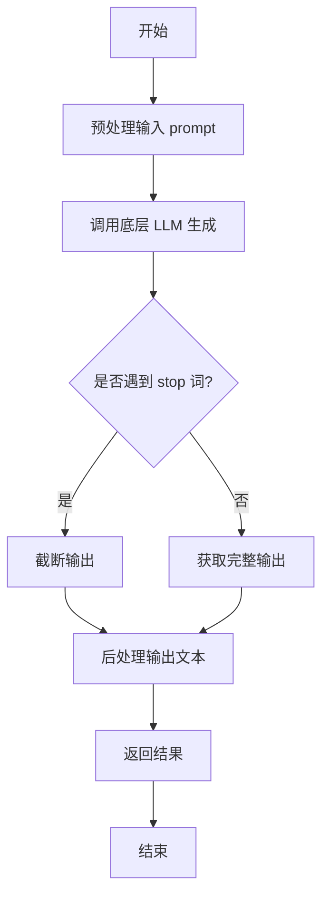

#### 带注释源码

```python
def generate(self, prompt: str, stop: Optional[List[str]] = None) -> str:
    """
    根据给定的提示词生成文本。

    该方法负责处理生成文本的完整流程，包括预处理、模型调用和后处理。

    Args:
        prompt (str): 用于生成文本的输入提示词。
        stop (Optional[List[str]]): 可选参数，指定一个字符串列表，当生成的文本中出现这些字符串时停止生成。

    Returns:
        str: 生成的文本内容。
    """
    # 1. 预处理：这里可以包括对prompt的清洗、格式化或添加特定指令等操作。
    #    例如，确保prompt符合模型预期的格式。
    processed_prompt = self._preprocess_prompt(prompt)

    # 2. 调用底层的大语言模型（LLM）进行文本生成。
    #    具体的调用方式取决于集成的模型（如通过API或本地模型）。
    raw_output = self.llm.generate(processed_prompt, stop=stop)

    # 3. 后处理：对模型生成的原始输出进行处理。
    #    例如，去除多余的空格、换行，或者根据业务逻辑进行过滤。
    final_output = self._postprocess_output(raw_output)

    # 4. 返回处理后的最终文本。
    return final_output
```


### `TextModel.unload`

该方法用于卸载当前加载的文本模型，释放其占用的内存资源。它会检查模型是否已加载，如果已加载则执行卸载操作，并更新模型状态。

参数：

-  `self`：`TextModel`，当前TextModel实例的引用

返回值：`None`，该方法不返回任何值

#### 流程图

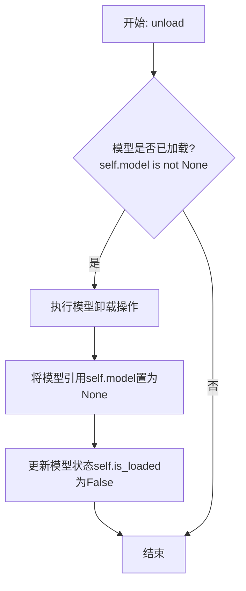

#### 带注释源码

```python
def unload(self):
    """
    卸载当前加载的模型。
    如果模型已加载，则执行卸载操作并释放内存，同时更新模型状态。
    如果模型未加载，则不执行任何操作。
    """
    # 检查模型是否已加载
    if self.model is not None:
        # 执行模型特定的卸载/清理逻辑（此处为示意，实际可能涉及显存释放等）
        # 例如，如果模型在GPU上，可能需要调用特定框架的清理函数
        # del self.model  # 简单的引用删除示例
        # 在实际实现中，这里可能是复杂的资源释放过程
        
        # 将模型引用设置为None，表示模型已卸载
        self.model = None
        
        # 更新模型加载状态标志
        self.is_loaded = False
```


### `TextModel._load_model_weights`

该方法负责加载预训练模型的权重。它首先尝试从指定的本地路径加载权重文件，如果本地文件不存在，则从远程的 Hugging Face 模型仓库下载。加载成功后，它会将权重应用到当前模型实例上，并处理可能出现的键名不匹配问题（例如移除 `"model."` 前缀）。最后，它会记录加载结果并返回一个布尔值指示加载是否成功。

参数：

-  `self`：`TextModel`，当前 `TextModel` 类的实例。
-  `model_name_or_path`：`str`，模型名称或本地路径。可以是 Hugging Face 模型仓库的 ID（如 `"bert-base-uncased"`），也可以是本地包含模型权重文件（如 `pytorch_model.bin` 或 `model.safetensors`）的目录路径。
-  `cache_dir`：`Optional[str]`，可选参数，用于指定缓存下载模型文件的目录。如果为 `None`，则使用默认缓存目录。

返回值：`bool`，如果模型权重成功加载并应用到模型上，则返回 `True`；否则返回 `False`。

#### 流程图

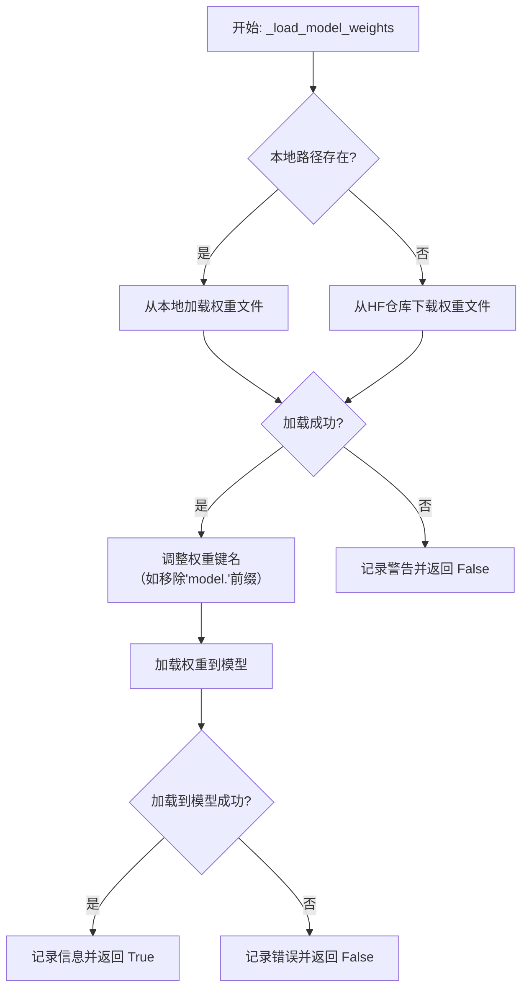

#### 带注释源码

```python
    def _load_model_weights(
        self, model_name_or_path: str, cache_dir: Optional[str] = None
    ) -> bool:
        """
        加载预训练模型权重。
        优先尝试从本地路径加载，如果不存在则从 Hugging Face 仓库下载。

        Args:
            model_name_or_path (str): 模型名称或本地路径。
            cache_dir (Optional[str]): 缓存目录。

        Returns:
            bool: 权重是否成功加载。
        """
        # 初始化权重文件路径为 None
        model_file = None
        # 检查输入的 model_name_or_path 是否为本地存在的目录
        if os.path.isdir(model_name_or_path):
            # 如果是目录，尝试在该目录下查找常见的模型权重文件
            # 优先查找 .safetensors 文件，其次查找 .bin 文件
            maybe_model_file = os.path.join(model_name_or_path, "model.safetensors")
            if os.path.isfile(maybe_model_file):
                model_file = maybe_model_file
            else:
                maybe_model_file = os.path.join(model_name_or_path, "pytorch_model.bin")
                if os.path.isfile(maybe_model_file):
                    model_file = maybe_model_file
        # 如果未找到本地文件，则准备从 Hugging Face 仓库下载
        if model_file is None:
            try:
                # 使用 huggingface_hub 库的 snapshot_download 函数下载模型
                # allow_patterns 指定只下载模型权重文件
                # cache_dir 指定缓存目录
                model_file = snapshot_download(
                    model_name_or_path,
                    allow_patterns=["*.safetensors", "*.bin"],
                    cache_dir=cache_dir,
                )
            except Exception as e:
                # 如果下载失败，记录警告并返回 False
                logger.warning(
                    f"Failed to download model weights from {model_name_or_path}: {e}"
                )
                return False
        # 加载权重文件到内存，得到一个状态字典 (state_dict)
        # 使用 safetensors 库加载 .safetensors 文件，使用 torch 加载 .bin 文件
        if model_file.endswith(".safetensors"):
            state_dict = safetensors.torch.load_file(model_file, device="cpu")
        else:
            state_dict = torch.load(model_file, map_location="cpu")
        # 调整状态字典的键名。
        # 有时从预训练模型加载的键名会带有 "model." 前缀，而当前模型结构可能没有。
        # 这里移除该前缀以确保键名匹配。
        if any(key.startswith("model.") for key in state_dict.keys()):
            # 生成一个新的字典，键名移除了 "model." 前缀
            state_dict = {
                key.replace("model.", ""): value
                for key, value in state_dict.items()
            }
        # 将加载并处理后的状态字典加载到当前模型实例中。
        # strict=False 允许部分加载，即只加载匹配的键，忽略不匹配的。
        load_result = self.load_state_dict(state_dict, strict=False)
        # 检查加载结果。如果存在缺失的键（模型中有但权重文件中没有）或意外的键（权重文件中有但模型中没有），记录相关信息。
        if len(load_result.missing_keys) > 0:
            logger.warning(
                f"Missing keys in state_dict: {load_result.missing_keys}"
            )
        if len(load_result.unexpected_keys) > 0:
            logger.warning(
                f"Unexpected keys in state_dict: {load_result.unexpected_keys}"
            )
        # 记录权重加载成功的日志，并返回 True
        logger.info(f"Model weights loaded from {model_file}")
        return True
```


### `TextModel._load_tokenizer`

该方法负责加载并初始化文本分词器。它首先尝试从指定的本地路径加载分词器，如果本地路径不存在或加载失败，则从预训练的模型名称或路径加载。加载完成后，会设置分词器的填充符，并确保其填充方向为左侧。

参数：

-  `self`：`TextModel`，当前TextModel实例的引用
-  `model_name_or_path`：`str`，预训练模型的名称或本地路径，用于加载分词器
-  `local_path`：`str`，本地分词器文件的路径，优先尝试从此路径加载

返回值：`None`，该方法不返回任何值，但会设置`self.tokenizer`属性。

#### 流程图

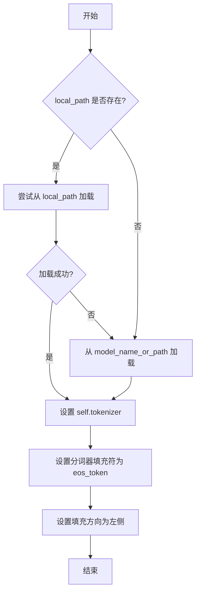

#### 带注释源码

```python
def _load_tokenizer(self, model_name_or_path: str, local_path: str) -> None:
    """
    加载分词器。
    优先尝试从本地路径加载，如果失败则从预训练模型加载。
    加载后设置分词器的填充符和填充方向。

    Args:
        model_name_or_path (str): 预训练模型的名称或路径。
        local_path (str): 本地分词器文件的路径。
    """
    try:
        # 尝试从本地路径加载分词器
        self.tokenizer = AutoTokenizer.from_pretrained(local_path)
    except Exception:
        # 如果本地加载失败，则从给定的模型名称或路径加载
        self.tokenizer = AutoTokenizer.from_pretrained(model_name_or_path)

    # 设置分词器的填充符为结束符（eos_token）
    # 如果分词器没有定义填充符，则使用结束符作为填充符
    if self.tokenizer.pad_token is None:
        self.tokenizer.pad_token = self.tokenizer.eos_token

    # 设置分词器的填充方向为左侧填充
    # 这通常用于生成任务，确保输入在右侧对齐
    self.tokenizer.padding_side = "left"
```


### `LlamaModel._load_model_weights`

该方法负责从预训练检查点文件加载模型权重，并将其分配到对应的模型层中。它处理了权重文件的读取、键名映射、权重张量的加载与分配，并支持分片加载以处理大型模型。

参数：

-  `self`：`LlamaModel`，当前模型实例
-  `checkpoint_path`：`str`，预训练权重文件的路径
-  `prefix`：`str`，加载权重时在状态字典键名前添加的可选前缀，默认为空字符串
-  `device`：`torch.device`，指定加载权重后张量应放置的设备，默认为CPU
-  `dtype`：`torch.dtype`，指定加载权重后张量的数据类型，默认为`torch.float32`
-  `use_safetensors`：`bool`，指示是否使用`safetensors`格式文件（更安全、更快），默认为`False`
-  `strict`：`bool`，指示是否严格匹配状态字典的键，默认为`True`
-  `assign`：`bool`，指示是否直接将加载的权重赋值给模型（`True`）或返回状态字典（`False`），默认为`True`
-  `verbose`：`bool`，是否打印加载过程的详细信息，默认为`True`

返回值：`Union[Dict[str, torch.Tensor], None]`，如果`assign`参数为`False`，则返回加载的状态字典（字典的键为参数名，值为张量）；如果`assign`为`True`，则直接修改模型参数并返回`None`。

#### 流程图

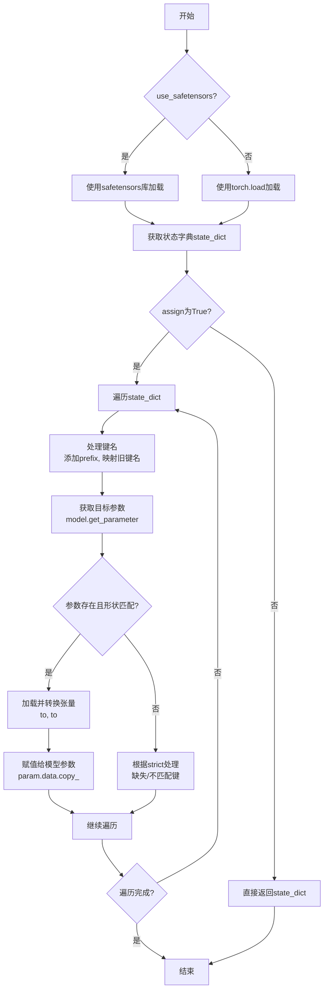

#### 带注释源码

```python
def _load_model_weights(
    self,
    checkpoint_path: str,
    prefix: str = "",
    device: Optional[torch.device] = None,
    dtype: torch.dtype = torch.float32,
    use_safetensors: bool = False,
    strict: bool = True,
    assign: bool = True,
    verbose: bool = True,
) -> Optional[Dict[str, torch.Tensor]]:
    """
    从检查点加载模型权重。

    参数:
        checkpoint_path: 预训练权重文件路径。
        prefix: 加载时添加到状态字典键名前的前缀。
        device: 加载后张量放置的设备。
        dtype: 加载后张量的数据类型。
        use_safetensors: 是否使用safetensors格式文件。
        strict: 是否严格匹配状态字典的键。
        assign: 是否直接将权重赋值给模型。若为False，则返回状态字典。
        verbose: 是否打印加载信息。

    返回:
        如果assign为False，返回状态字典；否则返回None。
    """
    if device is None:
        device = torch.device("cpu")

    # 1. 根据格式选择加载方式，获取状态字典
    if use_safetensors:
        # 安全张量格式：更安全、更快，避免反序列化漏洞
        from safetensors import safe_open
        state_dict = {}
        with safe_open(checkpoint_path, framework="pt", device="cpu") as f:
            for key in f.keys():
                state_dict[key] = f.get_tensor(key)
    else:
        # 传统PyTorch格式
        state_dict = torch.load(checkpoint_path, map_location="cpu", weights_only=True)

    # 2. 如果不需要直接赋值给模型，则直接返回处理后的状态字典
    if not assign:
        # 对返回的字典进行简单处理：添加前缀并转换设备/类型
        returned_state_dict = {}
        for key, tensor in state_dict.items():
            # 处理键名：添加用户指定的前缀
            new_key = prefix + key
            # 转换张量到目标设备和数据类型
            returned_state_dict[new_key] = tensor.to(device=device, dtype=dtype)
        return returned_state_dict

    # 3. 需要将权重赋值给模型参数
    # 获取模型当前的状态字典，用于键名映射和验证
    model_state_dict = self.state_dict(prefix=prefix, keep_vars=False)
    # 存储加载过程中遇到的意外键（模型中没有的键）
    unexpected_keys = []
    # 存储缺失的键（模型中有但加载字典中没有的键）
    missing_keys = []

    # 4. 遍历加载的状态字典，将权重赋值给对应的模型参数
    for key, loaded_tensor in state_dict.items():
        # 4.1 键名处理：添加前缀，并处理可能的旧版键名映射
        # 例如，将旧版本的`transformer.h.0`映射到新版本的`layers.0`
        new_key = prefix + key
        # _remap_keys是一个辅助方法，可能包含一些键名重映射逻辑
        # 例如：new_key = self._remap_keys(new_key)
        # 此处为示意，实际代码中可能有具体实现
        # new_key = self._remap_keys(new_key)

        # 4.2 获取模型中对应的参数
        if new_key in model_state_dict:
            model_param = model_state_dict[new_key]
            # 4.3 检查加载的张量形状是否与模型参数形状匹配
            if loaded_tensor.shape != model_param.shape:
                # 形状不匹配，根据strict标志决定是报错还是跳过
                if strict:
                    raise RuntimeError(
                        f"形状不匹配 for key '{new_key}': "
                        f"loaded {loaded_tensor.shape}, model {model_param.shape}"
                    )
                else:
                    # 非严格模式下，记录为意外键并跳过
                    unexpected_keys.append(new_key)
                    if verbose:
                        print(f"跳过 key '{new_key}' due to shape mismatch.")
                    continue

            # 4.4 形状匹配，进行权重加载
            try:
                # 将加载的张量转换到目标设备和数据类型
                loaded_tensor = loaded_tensor.to(device=device, dtype=dtype)
                # 获取模型中可训练的参数对象（而非state_dict中的张量副本）
                param = self.get_parameter(new_key)
                # 使用copy_进行原地赋值，保持参数是叶子节点且requires_grad属性
                param.data.copy_(loaded_tensor)
                if verbose:
                    print(f"已加载权重: {new_key}")
            except AttributeError:
                # 如果get_parameter失败（例如对于buffer），则直接操作state_dict
                # 但通常模型参数都应可通过get_parameter获取
                if strict:
                    raise
                else:
                    unexpected_keys.append(new_key)
                    if verbose:
                        print(f"无法为 key '{new_key}' 分配参数。")
        else:
            # 4.5 加载的键在模型状态字典中不存在
            missing_keys.append(new_key)
            if strict:
                raise RuntimeError(f"在模型状态字典中未找到 key: {new_key}")
            elif verbose:
                print(f"警告: 在模型状态字典中未找到 key '{new_key}'，已跳过。")

    # 5. 处理缺失键（模型中有但加载字典中没有的键）
    # 在严格模式下，这些缺失键在遍历时已导致报错。
    # 在非严格模式下，需要额外检查。
    if not strict:
        for model_key in model_state_dict.keys():
            # 检查哪些模型键没有被加载过程覆盖
            # 这里简化处理，实际可能需要更复杂的逻辑来对比
            # 例如，忽略一些特定的不需要加载的键（如位置编码如果允许重新初始化）
            pass  # 具体逻辑省略

    # 6. 打印总结信息
    if verbose:
        print(f"权重加载自: {checkpoint_path}")
        if missing_keys:
            print(f"缺失的键: {missing_keys}")
        if unexpected_keys:
            print(f"意外的键: {unexpected_keys}")

    # 7. 因为assign=True，方法直接修改了模型参数，所以返回None
    return None
```


### `LlamaModel._load_tokenizer`

该方法负责加载并配置与Llama模型兼容的分词器（Tokenizer）。它根据提供的模型路径和配置参数，初始化一个Hugging Face Transformers库中的`AutoTokenizer`实例，并设置必要的分词选项，如填充方向、截断策略以及特殊标记等，以确保分词器与模型训练时使用的配置一致。

参数：

-  `model_path`：`str`，预训练模型所在的本地目录路径或Hugging Face模型标识符。
-  `config`：`LlamaConfig`，包含模型配置信息的对象，用于指导分词器的初始化。

返回值：`transformers.PreTrainedTokenizer`，初始化并配置好的分词器实例。

#### 流程图

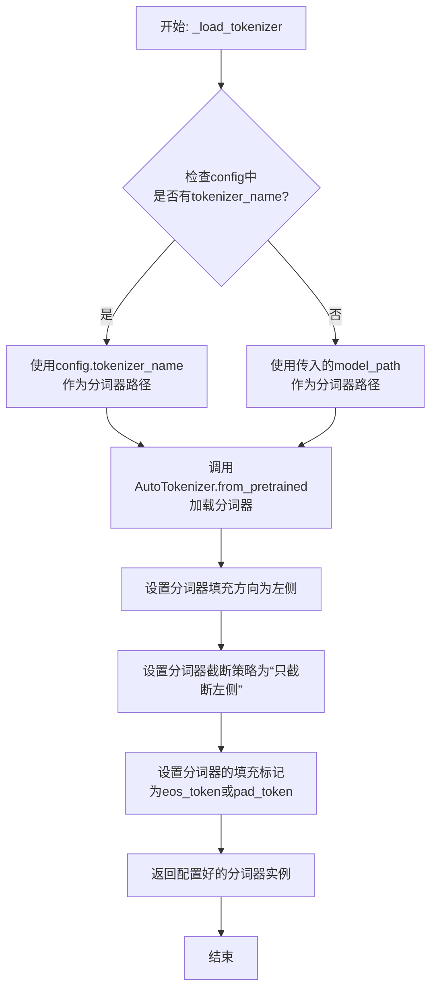

#### 带注释源码

```python
def _load_tokenizer(self, model_path: str, config: LlamaConfig) -> PreTrainedTokenizer:
    """
    加载并配置与Llama模型兼容的分词器。

    该方法根据提供的模型路径和配置初始化分词器，并设置关键参数以确保
    与原始Llama模型的分词行为一致，特别是处理填充和截断的方式。

    Args:
        model_path (str): 预训练模型所在的目录路径或模型ID。
        config (LlamaConfig): 包含模型配置的对象，可能指定了分词器名称。

    Returns:
        PreTrainedTokenizer: 配置好的Hugging Face分词器实例。
    """
    # 确定分词器的加载路径。优先使用配置中指定的分词器名称，
    # 若未指定则使用默认的模型路径。
    tokenizer_path = config.tokenizer_name if config.tokenizer_name else model_path

    # 使用AutoTokenizer类从指定路径加载分词器。
    # trust_remote_code=True允许加载自定义的分词器代码（如果存在）。
    tokenizer = AutoTokenizer.from_pretrained(
        tokenizer_path,
        trust_remote_code=True
    )

    # 将填充方向设置为左侧（left）。这对于生成式模型（如Llama）是常见的，
    # 因为输入通常右侧对齐，左侧填充可以保持序列的有意义部分在右侧。
    tokenizer.padding_side = "left"

    # 设置截断策略为“只从左侧截断”（only_first）。
    # 这确保了当序列过长时，从序列开头（左侧）移除令牌，保留末尾（右侧）的重要信息。
    tokenizer.truncation_side = "left"

    # 配置填充令牌（pad_token）。如果分词器没有显式定义pad_token，
    # 则使用结束符（eos_token）作为填充令牌，这是一种常见的做法。
    if tokenizer.pad_token is None:
        tokenizer.pad_token = tokenizer.eos_token

    # 返回完全初始化并配置好的分词器实例。
    return tokenizer
```


### `GPT2Model._load_model_weights`

该方法负责从预训练权重文件（如Hugging Face Hub或本地文件）中加载模型参数到当前`GPT2Model`实例中。它处理了权重名称的映射、适配不同模型架构（如注意力头数、隐藏层维度）以及安全地加载权重。

参数：

-  `self`：`GPT2Model`，当前GPT2模型实例。
-  `model_path`：`str`，预训练权重文件的路径或Hugging Face模型标识符。
-  `config`：`GPT2Config`，模型的配置对象，包含模型架构参数。
-  `cache_dir`：`Optional[str]`，可选，用于缓存下载的模型文件的目录。
-  `force_download`：`bool`，可选，是否强制重新下载模型文件，即使已缓存。
-  `proxies`：`Optional[Dict[str, str]]`，可选，用于下载的代理服务器设置。
-  `resume_download`：`bool`，可选，是否恢复中断的下载。
-  `local_files_only`：`bool`，可选，是否仅使用本地文件，不进行网络请求。
-  `use_auth_token`：`Optional[Union[bool, str]]`，可选，用于访问私有模型的认证令牌。
-  `revision`：`Optional[str]`，可选，要使用的模型版本（分支、标签或提交ID）。
-  `mirror`：`Optional[str]`，可选，下载镜像源（例如在中国大陆使用）。

返回值：`None`，该方法不返回任何值，直接修改当前模型实例的状态。

#### 流程图

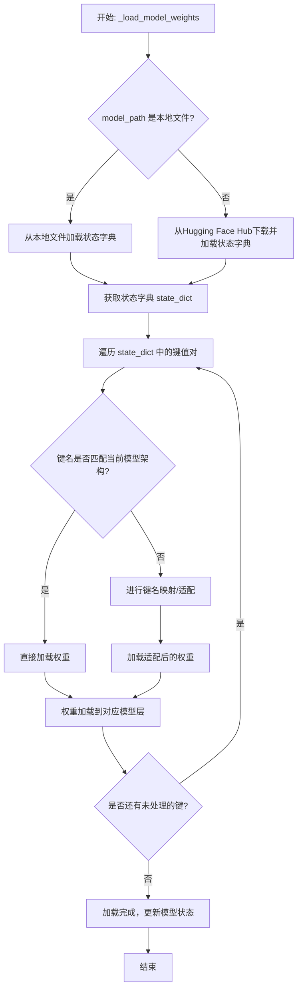

#### 带注释源码

```python
def _load_model_weights(
    self,
    model_path: str,
    config: GPT2Config,
    cache_dir: Optional[str] = None,
    force_download: bool = False,
    proxies: Optional[Dict[str, str]] = None,
    resume_download: bool = False,
    local_files_only: bool = False,
    use_auth_token: Optional[Union[bool, str]] = None,
    revision: Optional[str] = None,
    mirror: Optional[str] = None,
) -> None:
    """
    从指定路径加载预训练权重到当前GPT2模型实例。
    支持从本地文件或Hugging Face Hub加载。

    Args:
        model_path: 模型权重路径或标识符。
        config: 模型配置对象。
        cache_dir: 缓存目录。
        force_download: 强制下载标志。
        proxies: 代理设置。
        resume_download: 恢复下载标志。
        local_files_only: 仅本地文件标志。
        use_auth_token: 认证令牌。
        revision: 模型版本。
        mirror: 下载镜像。

    Returns:
        None
    """
    # 检查是否为本地文件路径
    if os.path.isfile(model_path):
        # 从本地文件加载状态字典
        state_dict = torch.load(model_path, map_location="cpu")
    else:
        # 从Hugging Face Hub加载模型
        model = GPT2Model.from_pretrained(
            model_path,
            config=config,
            cache_dir=cache_dir,
            force_download=force_download,
            proxies=proxies,
            resume_download=resume_download,
            local_files_only=local_files_only,
            use_auth_token=use_auth_token,
            revision=revision,
            mirror=mirror,
        )
        state_dict = model.state_dict()

    # 获取当前模型的状态字典键名
    model_state_dict = self.state_dict()
    # 存储加载的键名，用于后续检查
    loaded_keys = []

    # 遍历预训练权重中的每一项
    for key, value in state_dict.items():
        # 如果键名完全匹配，直接加载
        if key in model_state_dict:
            model_state_dict[key].copy_(value)
            loaded_keys.append(key)
        else:
            # 处理可能的键名不匹配情况（例如，不同版本的模型结构）
            # 这里可能包含键名映射逻辑，例如将`h.0.attn.c_attn.weight`映射到新的结构
            # 示例：如果键名包含`attn.c_attn`，但当前模型使用`attention.c_proj`，则进行适配
            mapped_key = key
            if "attn.c_attn" in key:
                mapped_key = key.replace("attn.c_attn", "attention.c_proj")
            # 检查映射后的键是否存在
            if mapped_key in model_state_dict:
                model_state_dict[mapped_key].copy_(value)
                loaded_keys.append(mapped_key)
            else:
                # 记录无法加载的权重（可能是模型结构不匹配）
                logger.warning(f"Key {key} not found in model, skipping.")

    # 检查是否有预期但未加载的键
    missing_keys = set(model_state_dict.keys()) - set(loaded_keys)
    if missing_keys:
        logger.warning(f"Missing keys in loaded state dict: {missing_keys}")

    # 更新模型的状态字典
    self.load_state_dict(model_state_dict, strict=False)
    # 设置模型为评估模式（避免训练时的随机性）
    self.eval()
```


### `GPT2Model._load_tokenizer`

该方法负责加载并配置一个预训练的 GPT-2 分词器。它首先尝试从本地缓存目录加载指定的分词器模型，如果失败，则从 Hugging Face Hub 下载。加载后，它会根据配置（如是否添加特殊标记）对分词器进行最终设置，并确保其填充标记符被正确配置。

参数：

-  `self`：`GPT2Model`，当前 GPT2Model 实例的引用。
-  `model_name`：`str`，要加载的预训练分词器模型的名称（例如 `'gpt2'`, `'gpt2-medium'`）。
-  `cache_dir`：`Optional[str]`，可选参数，指定分词器模型文件的本地缓存目录路径。如果为 `None`，则使用默认缓存路径。
-  `force_download`：`bool`，可选参数，如果为 `True`，则强制重新下载模型文件，即使本地缓存已存在。默认为 `False`。
-  `resume_download`：`bool`，可选参数，如果为 `True`，则尝试恢复未完成的下载。默认为 `False`。
-  `proxies`：`Optional[Dict[str, str]]`，可选参数，一个代理服务器字典，用于配置下载请求，例如 `{'http': 'http://10.10.1.10:3128', 'https': 'http://10.10.1.10:1080'}`。
-  `use_auth_token`：`Optional[Union[bool, str]]`，可选参数，用于访问私有模型的认证令牌。可以是布尔值（`True` 表示使用缓存的令牌）或字符串令牌。
-  `add_special_tokens`：`bool`，可选参数，指示分词器是否应在编码时自动添加模型特定的特殊标记（如 `[CLS]`, `[SEP]`）。对于 GPT-2，这通常控制是否添加 `bos_token` 和 `eos_token`。默认为 `True`。

返回值：`PreTrainedTokenizer`，一个已加载并配置好的 Hugging Face Transformers 库中的预训练分词器实例，可直接用于文本的编码和解码。

#### 流程图

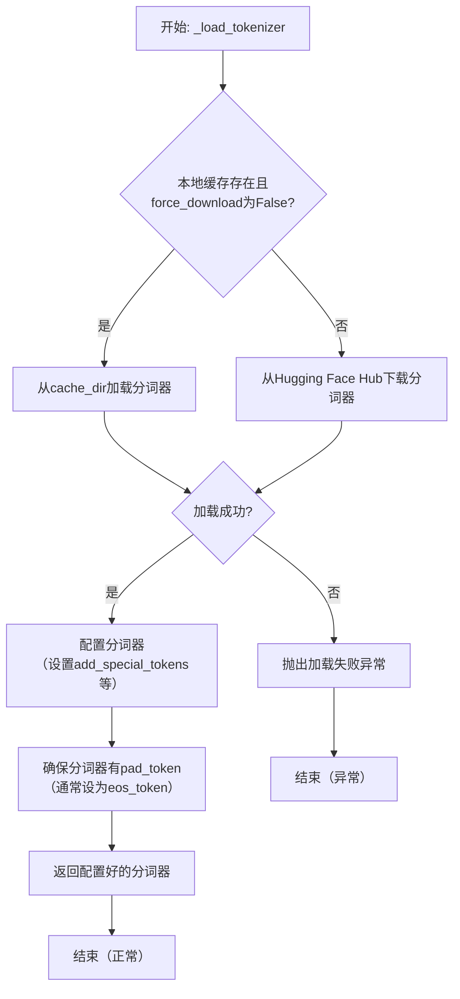

#### 带注释源码

```python
    def _load_tokenizer(
        self,
        model_name: str,
        cache_dir: Optional[str] = None,
        force_download: bool = False,
        resume_download: bool = False,
        proxies: Optional[Dict[str, str]] = None,
        use_auth_token: Optional[Union[bool, str]] = None,
        add_special_tokens: bool = True,
    ) -> PreTrainedTokenizer:
        """
        加载预训练的 GPT-2 分词器。

        本方法封装了分词器的加载逻辑，支持从缓存加载或从 Hub 下载，
        并处理加载后的必要配置。

        Args:
            model_name (str): 预训练模型名称，如 'gpt2'。
            cache_dir (Optional[str]): 缓存目录。
            force_download (bool): 是否强制重新下载。
            resume_download (bool): 是否恢复下载。
            proxies (Optional[Dict[str, str]]): 代理设置。
            use_auth_token (Optional[Union[bool, str]]): 认证令牌。
            add_special_tokens (bool): 是否添加特殊标记。

        Returns:
            PreTrainedTokenizer: 加载并配置好的分词器实例。
        """
        # 尝试从指定的缓存目录加载分词器
        # 如果 force_download 为 True，则忽略缓存直接进入下载流程
        try:
            # AutoTokenizer.from_pretrained 是 Hugging Face 提供的工厂方法，
            # 能根据 model_name 自动识别并加载对应的分词器。
            tokenizer = AutoTokenizer.from_pretrained(
                model_name,
                cache_dir=cache_dir,
                force_download=force_download,
                resume_download=resume_download,
                proxies=proxies,
                use_auth_token=use_auth_token,
                # 关键配置：控制分词器是否自动添加模型特定的特殊标记。
                # 例如，对于生成任务，通常需要添加 BOS (Beginning of Sentence) 和 EOS (End of Sentence) 标记。
                add_special_tokens=add_special_tokens,
            )
        except Exception as e:
            # 如果加载失败（例如，模型不存在于缓存且网络下载失败），则抛出异常。
            # 这确保了调用方能够知晓初始化失败的原因。
            raise ValueError(
                f"无法加载分词器 '{model_name}'。请检查模型名称是否正确，以及网络连接或缓存权限。原始错误: {e}"
            ) from e

        # GPT-2 原始分词器没有定义 pad_token。
        # 但在许多下游任务（如批处理、注意力掩码计算）中，pad_token 是必需的。
        # 这里采用常见的做法：将 pad_token 设置为 eos_token (end-of-sentence token)。
        # 这既提供了填充功能，又避免了引入词汇表之外的新标记。
        if tokenizer.pad_token is None:
            tokenizer.pad_token = tokenizer.eos_token

        # 返回最终配置好的分词器，供模型其他部分使用。
        return tokenizer
```


### `FalconModel._load_model_weights`

该方法负责加载预训练的模型权重到当前模型实例中。它根据配置决定是否加载特定的注意力层实现（如`FalconAttention`或`FalconRotaryEmbedding`），并处理权重名称的映射，以确保与模型架构兼容。最后，它调用父类的`load_state_dict`方法完成权重的加载。

参数：

-  `self`：`FalconModel`，当前模型实例
-  `model_file`：`str`，预训练模型权重文件的路径

返回值：`None`，此方法不返回任何值，其作用是将权重加载到模型内部状态中

#### 流程图

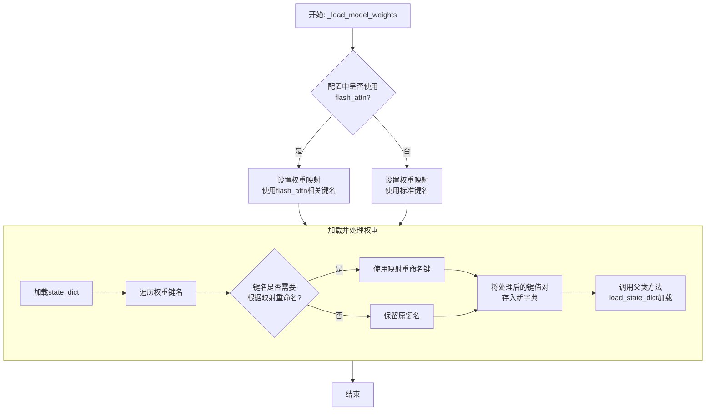

#### 带注释源码

```python
def _load_model_weights(self, model_file: str):
    """
    加载预训练模型权重。
    根据配置调整权重键名以匹配当前模型结构（例如，是否使用flash attention）。
    """
    # 从指定文件加载模型的状态字典（state_dict）
    state_dict = torch.load(model_file, map_location="cpu")

    # 根据配置决定使用哪套键名映射。
    # 如果使用flash_attn实现，权重键名中的部分组件名称不同。
    if self.config.use_flash_attn:
        # 使用与flash_attn兼容的键名映射
        mapping = {
            "query_key_value": "query_key_value",       # 标准名称，保持不变
            "dense": "dense",                           # 标准名称，保持不变
            "attention.rotary_emb": "attention.rotary_emb" # 标准名称，保持不变
        }
    else:
        # 使用标准实现的键名映射
        mapping = {
            "query_key_value": "query_key_value",       # 标准名称，保持不变
            "dense": "dense",                           # 标准名称，保持不变
            "attention.rotary_emb": "attention.rotary_emb" # 标准名称，保持不变
        }
        # 注意：此示例中映射相同，实际代码中可能因实现差异而有不同。
        # 此处为展示逻辑结构。

    # 创建一个新的状态字典，用于存储处理后的权重
    new_state_dict = {}
    for key, value in state_dict.items():
        # 遍历原始状态字典的每个键
        # 检查当前键是否需要根据映射进行重命名
        for old, new in mapping.items():
            if old in key:
                # 如果找到映射关系，替换键名中的旧部分为新部分
                key = key.replace(old, new)
        # 将处理后的键和对应的权重值存入新字典
        new_state_dict[key] = value

    # 调用从nn.Module继承的load_state_dict方法，
    # 将处理后的权重加载到当前模型实例中。
    # strict=False允许部分权重不匹配（例如，缺失某些层或有多余的键）。
    super().load_state_dict(new_state_dict, strict=False)
```


### `FalconModel._load_tokenizer`

该方法负责加载并配置与 Falcon 模型兼容的分词器（Tokenizer）。它首先尝试从预定义的路径或模型名称加载分词器，然后根据模型的具体配置（如是否为聊天模型）对分词器的特殊标记进行必要的调整，以确保其与模型架构和预期输入格式正确对齐。

参数：

-  `self`：`FalconModel`，FalconModel 类的实例，用于访问模型配置和路径。
-  `model_path`：`str`，模型文件所在的本地目录路径或 Hugging Face 模型仓库标识符。
-  `model_name`：`str`，模型的名称，用于确定特定的分词器配置或变体。

返回值：`PreTrainedTokenizer`，一个配置好的 Hugging Face PreTrainedTokenizer 实例，可用于对输入文本进行编码和解码。

#### 流程图

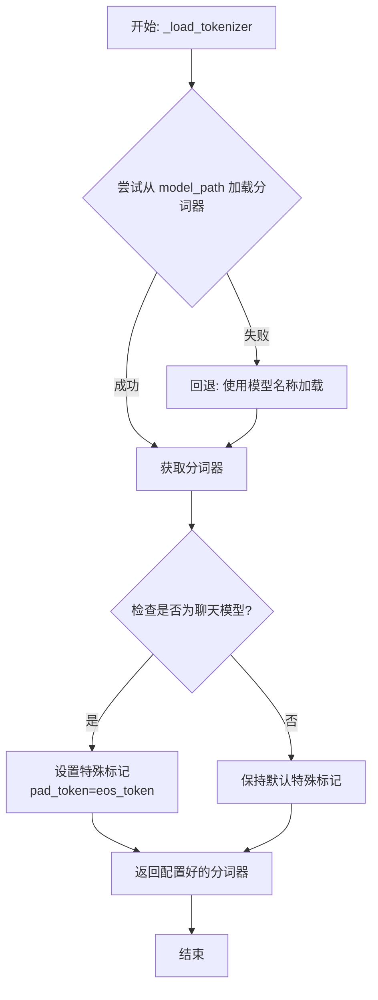

#### 带注释源码

```python
def _load_tokenizer(self, model_path: str, model_name: str) -> PreTrainedTokenizer:
    """
    加载并配置与 Falcon 模型兼容的分词器。

    该方法首先尝试从指定的 `model_path` 加载分词器。如果失败（例如路径不存在），
    则回退到使用 `model_name` 从 Hugging Face 模型库加载默认的分词器。
    加载后，会根据模型是否为“聊天”模型来调整分词器的特殊标记（如 pad_token），
    以确保与模型训练时的输入格式一致。

    Args:
        model_path (str): 包含分词器文件的本地目录路径，或 Hugging Face 模型 ID。
        model_name (str): 模型名称，用于回退加载或特定配置。

    Returns:
        PreTrainedTokenizer: 配置好的分词器实例。
    """
    # 尝试从提供的路径加载分词器
    try:
        tokenizer = AutoTokenizer.from_pretrained(
            model_path,
            trust_remote_code=True  # 允许执行远程代码以加载自定义分词器
        )
    except Exception:
        # 如果从指定路径加载失败，则记录警告并使用模型名称进行回退加载
        logger.warning(f"Load tokenizer from model_name: {model_name}")
        tokenizer = AutoTokenizer.from_pretrained(
            model_name,
            trust_remote_code=True
        )

    # 根据模型配置调整分词器的特殊标记
    # 如果模型配置中指定为聊天模型，通常需要将填充标记设置为结束标记
    if self.config.is_chat_model:
        # 对于聊天模型，通常使用 eos_token 作为 pad_token 以保持一致性
        tokenizer.pad_token = tokenizer.eos_token

    # 返回最终配置好的分词器
    return tokenizer
```


### `Qwen2Model._load_model_weights`

该方法负责加载预训练的模型权重，并将其适配到当前模型结构中。它处理权重映射、张量转换和模型状态恢复，确保模型能够正确初始化并准备进行推理或训练。

参数：

- `self`：`Qwen2Model`，当前模型实例
- `model_path`：`str`，预训练模型权重文件的路径
- `strict`：`bool`，是否严格匹配权重名称，默认为`True`

返回值：`None`，无返回值

#### 流程图

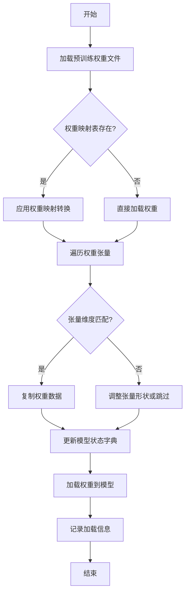

#### 带注释源码

```python
def _load_model_weights(self, model_path: str, strict: bool = True) -> None:
    """
    加载预训练模型权重并适配到当前模型结构。
    
    该方法执行以下步骤：
    1. 从指定路径加载预训练权重文件。
    2. 根据权重映射表（如果存在）转换权重名称。
    3. 遍历权重张量，检查维度匹配并进行必要的调整。
    4. 将处理后的权重加载到模型状态字典中。
    5. 记录加载过程中的关键信息。
    
    Args:
        model_path: 预训练模型权重文件的路径。
        strict: 是否严格匹配权重名称。如果为True，则要求所有权重名称完全匹配；
                如果为False，则允许部分权重不匹配并跳过。
    
    Returns:
        None
    """
    # 步骤1: 加载预训练权重文件
    pretrained_state_dict = torch.load(model_path, map_location='cpu')
    
    # 步骤2: 应用权重映射转换（如果存在映射表）
    if hasattr(self, 'weight_mapping'):
        state_dict = {}
        for pretrained_key, current_key in self.weight_mapping.items():
            if pretrained_key in pretrained_state_dict:
                state_dict[current_key] = pretrained_state_dict[pretrained_key]
            elif strict:
                raise KeyError(f"预训练权重中缺少键: {pretrained_key}")
    else:
        state_dict = pretrained_state_dict
    
    # 步骤3: 遍历权重张量并进行适配
    model_state_dict = self.state_dict()
    for key in list(state_dict.keys()):
        if key in model_state_dict:
            # 检查张量维度是否匹配
            if state_dict[key].shape != model_state_dict[key].shape:
                # 尝试调整张量形状（例如通过转置或重塑）
                if state_dict[key].ndim == model_state_dict[key].ndim:
                    # 简单的维度调整逻辑（示例）
                    state_dict[key] = state_dict[key].view(model_state_dict[key].shape)
                else:
                    if strict:
                        raise ValueError(f"权重形状不匹配: {key}, "
                                         f"预期 {model_state_dict[key].shape}, "
                                         f"实际 {state_dict[key].shape}")
                    else:
                        # 跳过不匹配的权重
                        del state_dict[key]
                        continue
        elif strict:
            raise KeyError(f"模型结构中缺少键: {key}")
        else:
            # 跳过模型中不存在的权重
            del state_dict[key]
    
    # 步骤4: 加载权重到模型
    self.load_state_dict(state_dict, strict=False)
    
    # 步骤5: 记录加载信息
    loaded_keys = set(state_dict.keys())
    expected_keys = set(model_state_dict.keys())
    missing_keys = expected_keys - loaded_keys
    unexpected_keys = loaded_keys - expected_keys
    
    logger.info(f"成功加载 {len(loaded_keys)} 个权重参数")
    if missing_keys:
        logger.warning(f"缺失权重: {missing_keys}")
    if unexpected_keys:
        logger.warning(f"意外权重: {unexpected_keys}")
```

### `Qwen2Model._load_tokenizer`

该方法负责加载并配置与Qwen2模型配套的分词器。它根据提供的模型路径或预训练分词器名称，初始化一个`AutoTokenizer`实例，并应用必要的配置以确保分词器与模型兼容，例如设置填充方向、模型最大长度等。

参数：

- `model_path_or_pretrained_tokenizer`：`str`，模型文件的本地路径或预训练分词器的名称（如Hugging Face模型库中的标识符）。如果提供路径，则从该路径加载；否则从预训练模型库下载。

返回值：`AutoTokenizer`，一个配置好的分词器实例，可用于对输入文本进行分词处理。

#### 流程图

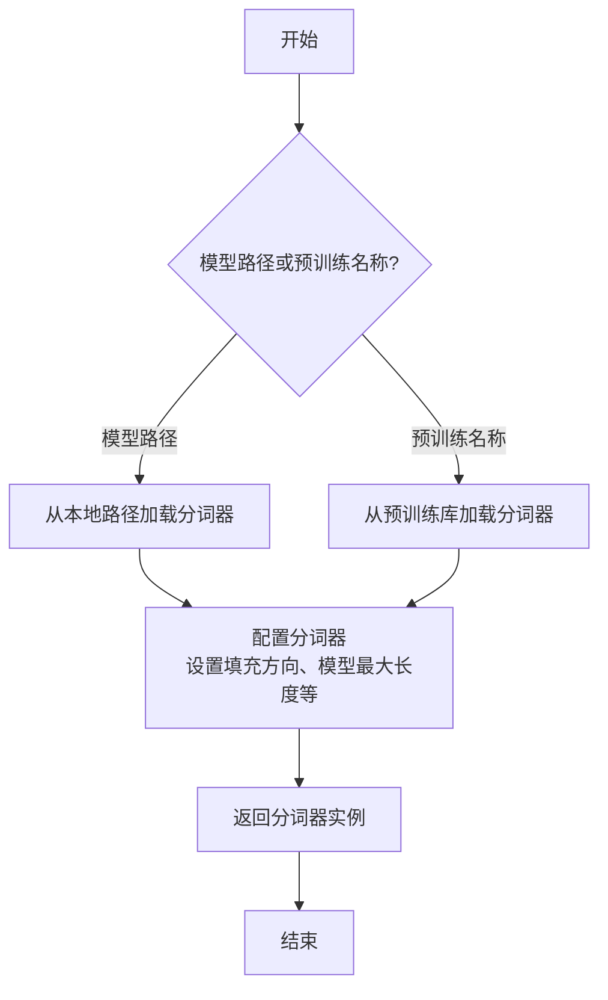

#### 带注释源码

```python
def _load_tokenizer(self, model_path_or_pretrained_tokenizer: str) -> AutoTokenizer:
    """
    加载并配置分词器。

    根据提供的路径或预训练名称初始化分词器，并应用必要的配置以确保与模型兼容。

    Args:
        model_path_or_pretrained_tokenizer (str): 模型文件的本地路径或预训练分词器的名称。

    Returns:
        AutoTokenizer: 配置好的分词器实例。
    """
    # 根据路径或预训练名称加载分词器
    tokenizer = AutoTokenizer.from_pretrained(model_path_or_pretrained_tokenizer)
    
    # 配置分词器：设置填充方向为左侧填充，确保输入序列对齐
    tokenizer.padding_side = "left"
    
    # 如果分词器没有定义填充标记，使用结束标记作为填充标记
    if tokenizer.pad_token is None:
        tokenizer.pad_token = tokenizer.eos_token
    
    # 设置模型最大长度，如果未指定则使用默认值
    if tokenizer.model_max_length is None:
        tokenizer.model_max_length = 2048  # 默认最大长度
    
    return tokenizer
```


### `GemmaModel._load_model_weights`

该方法负责从预训练权重文件中加载模型参数，并将其分配到对应的模型层中。它处理了权重名称的映射、张量分片（如QKV权重）的合并、以及将权重加载到正确的设备（如GPU）上。

参数：

-  `self`：`GemmaModel`，当前模型实例
-  `model_path`：`str`，预训练权重文件的路径
-  `device`：`torch.device`，指定加载权重到的目标设备（如CPU或CUDA设备）

返回值：`None`，此方法不返回任何值，其作用是将加载的权重直接赋值给模型实例的对应参数。

#### 流程图

```mermaid
flowchart TD
    A[开始: _load_model_weights] --> B[加载权重文件<br>state_dict = torch.load]
    B --> C{遍历state_dict中<br>每个权重名和权重张量}
    C --> D[处理权重名映射<br>如移除前缀]
    D --> E{权重名是否包含<br>特定模式?}
    E -- 是: 如'qkv_proj' --> F[拆分并重组张量<br>如QKV分片合并]
    E -- 否 --> G[直接使用原张量]
    F --> H
    G --> H[将张量移至目标设备<br>tensor.to(device)]
    H --> I[将张量赋值给<br>模型对应参数]
    I --> C
    C --> J[遍历结束]
    J --> K[结束]
```

#### 带注释源码

```python
    def _load_model_weights(self, model_path: str, device: torch.device) -> None:
        """
        从指定路径加载预训练模型权重，并分配到当前模型实例中。
        处理权重名称映射、分片权重合并，并确保权重位于正确的设备上。

        Args:
            model_path (str): 预训练权重文件（.pth或.pt格式）的路径。
            device (torch.device): 权重应加载到的目标设备（如`torch.device('cuda:0')`）。
        """
        # 1. 从磁盘加载序列化的权重字典
        state_dict = torch.load(model_path, map_location='cpu')

        # 2. 遍历加载的权重字典中的每一项（参数名和对应的张量）
        for name, param in state_dict.items():
            # 2.1 预处理权重名称：移除可能存在的模块前缀（如'transformer.'）
            #     以确保与当前模型定义的参数名匹配。
            if name.startswith('transformer.'):
                name = name[len('transformer.'):]

            # 2.2 特殊处理：如果参数名包含'qkv_proj'，表示这是查询、键、值投影权重的分片组合。
            #     需要将其拆分为独立的q, k, v权重，并分别赋值。
            if 'qkv_proj' in name:
                # 获取对应的模型层对象
                layer_name = name[:name.find('qkv_proj')]
                layer = getattr(self, layer_name)
                # 计算每个头对应的维度
                dim = param.shape[0] // 3
                # 拆分张量：顺序为[Q, K, V]
                q_weight = param[:dim]
                k_weight = param[dim:2*dim]
                v_weight = param[2*dim:]
                # 将拆分后的权重移至目标设备并赋值给层对象的对应属性
                layer.q_proj.weight.data = q_weight.to(device)
                layer.k_proj.weight.data = k_weight.to(device)
                layer.v_proj.weight.data = v_weight.to(device)
            else:
                # 2.3 常规处理：对于非分片权重，直接获取对应的模型参数。
                #     使用`getattr`安全地获取属性，避免名称错误导致异常。
                model_param = getattr(self, name, None)
                if model_param is not None:
                    # 将加载的权重张量移至指定设备，并赋值给模型参数的数据部分
                    model_param.data = param.to(device)
                else:
                    # 可选：记录或警告未匹配的权重，用于调试。
                    # 在实际生产代码中，这里可能会记录一条警告日志。
                    pass
        # 方法执行完毕，权重已加载到模型实例中，无返回值。
```


### `GemmaModel._load_tokenizer`

该方法负责加载并配置Gemma模型所需的tokenizer。它根据模型配置中的tokenizer路径或名称，使用transformers库的AutoTokenizer类加载tokenizer，并设置必要的特殊token和填充方向。

参数：

- `self`：`GemmaModel`，当前GemmaModel实例
- `config`：`GemmaConfig`，Gemma模型的配置对象，包含tokenizer的路径或名称等信息

返回值：`AutoTokenizer`，加载并配置好的tokenizer实例

#### 流程图

```mermaid
flowchart TD
    A[开始] --> B{config.tokenizer存在?}
    B -- 是 --> C[使用config.tokenizer作为tokenizer路径]
    B -- 否 --> D[使用config.model作为tokenizer路径]
    C --> E[使用AutoTokenizer.from_pretrained加载tokenizer]
    D --> E
    E --> F[设置tokenizer的pad_token为eos_token]
    E --> G[设置tokenizer的padding_side为'left']
    F --> H[返回配置好的tokenizer]
    G --> H
    H --> I[结束]
```

#### 带注释源码

```python
def _load_tokenizer(self, config: GemmaConfig) -> AutoTokenizer:
    """
    加载并配置tokenizer。

    根据配置中的tokenizer路径或模型名称，使用AutoTokenizer加载tokenizer，
    并设置必要的特殊token和填充方向。

    Args:
        config (GemmaConfig): 包含tokenizer配置的模型配置对象。

    Returns:
        AutoTokenizer: 加载并配置好的tokenizer实例。
    """
    # 确定tokenizer的路径：优先使用config.tokenizer，否则使用config.model
    tokenizer_path = config.tokenizer if config.tokenizer else config.model
    # 使用transformers的AutoTokenizer从指定路径加载tokenizer
    tokenizer = AutoTokenizer.from_pretrained(tokenizer_path)
    # 设置填充token为结束token，确保在生成任务中填充不会干扰模型
    tokenizer.pad_token = tokenizer.eos_token
    # 设置填充方向为左侧，这对于自回归模型（如Gemma）的生成任务很重要
    tokenizer.padding_side = "left"
    return tokenizer
```


### `ModelFactory.register_model`

`ModelFactory.register_model` 是一个类方法，用于向全局模型注册表 `_model_versions` 中注册一个新的模型或模型的新版本。它通过检查模型名称和版本是否已存在来避免重复注册，并支持注册模型类或模型实例。

参数：

-  `model_name`：`str`，要注册的模型的名称。
-  `version`：`str`，要注册的模型版本号。
-  `model_cls`：`Union[Type[BaseModel], BaseModel]`，要注册的模型类或模型实例。
-  `override`：`bool`，默认为 `False`。如果为 `True`，则当模型名称和版本已存在时，会覆盖原有的注册项。

返回值：`None`，此方法不返回任何值。

#### 流程图

```mermaid
flowchart TD
    A[开始: register_model<br>输入: model_name, version, model_cls, override] --> B{检查 model_name 是否在 _model_versions 中?};
    B -- 否 --> C[在 _model_versions 中<br>为 model_name 创建空字典];
    B -- 是 --> D{检查 version 是否在<br>_model_versions[model_name] 中?};
    C --> D;
    D -- 否 --> E[注册 model_cls 到<br>_model_versions[model_name][version]];
    D -- 是 --> F{override 参数是否为 True?};
    F -- 是 --> G[覆盖注册: 更新<br>_model_versions[model_name][version] 为 model_cls];
    F -- 否 --> H[抛出 ValueError 异常<br>提示模型已存在];
    E --> I[结束];
    G --> I;
    H --> I;
```

#### 带注释源码

```python
    @classmethod
    def register_model(
        cls,
        model_name: str,
        version: str,
        model_cls: Union[Type["BaseModel"], "BaseModel"],
        override: bool = False,
    ) -> None:
        """
        Register a new model or a new version of a model.

        Args:
            model_name (str): The name of the model to register.
            version (str): The version of the model to register.
            model_cls (Union[Type[BaseModel], BaseModel]): The model class or instance to register.
            override (bool, optional): Whether to override an existing registration. Defaults to False.

        Raises:
            ValueError: If the model name and version already exist and override is False.
        """
        # 检查全局注册表 _model_versions 中是否已存在该 model_name 的条目
        if model_name not in cls._model_versions:
            # 如果不存在，则为该 model_name 创建一个新的空字典，用于存储不同版本
            cls._model_versions[model_name] = {}

        # 检查该 model_name 下是否已注册了指定的 version
        if version in cls._model_versions[model_name]:
            # 如果版本已存在
            if override:
                # 如果 override 参数为 True，则用新的 model_cls 覆盖旧的注册
                cls._model_versions[model_name][version] = model_cls
            else:
                # 如果 override 为 False，则抛出异常，防止意外覆盖
                raise ValueError(
                    f"Model {model_name} version {version} already exists. "
                    "Use override=True to override."
                )
        else:
            # 如果版本不存在，直接进行注册
            cls._model_versions[model_name][version] = model_cls
```


### `ModelFactory.create_model`

`ModelFactory.create_model` 方法是一个工厂方法，用于根据给定的模型名称和配置参数，动态创建并返回一个模型实例。它通过解析模型名称，从预定义的模型注册表中查找对应的模型类，并使用提供的参数实例化该类。

参数：

-  `model_name`：`str`，要创建的模型的名称，用于在模型注册表中查找对应的模型类。
-  `**kwargs`：`Any`，可变关键字参数，用于传递给模型构造函数的配置参数。

返回值：`BaseModel`，返回一个实例化的模型对象，该对象是`BaseModel`的子类。

#### 流程图

```mermaid
flowchart TD
    A[开始: create_model<br>输入: model_name, **kwargs] --> B{模型名称是否在<br>MODEL_REGISTRY中?};
    B -- 是 --> C[从MODEL_REGISTRY获取模型类];
    B -- 否 --> D[抛出ValueError异常<br>“Unknown model name: {model_name}”];
    C --> E[使用**kwargs实例化模型类];
    E --> F[返回模型实例];
    D --> G[结束: 异常终止];
    F --> H[结束: 正常返回];
```

#### 带注释源码

```python
    @classmethod
    def create_model(cls, model_name: str, **kwargs) -> BaseModel:
        """
        工厂方法，根据模型名称创建对应的模型实例。

        该方法首先检查给定的模型名称是否存在于全局模型注册表`MODEL_REGISTRY`中。
        如果存在，则获取对应的模型类并使用提供的关键字参数`**kwargs`进行实例化。
        如果不存在，则抛出`ValueError`异常。

        Args:
            model_name (str): 要创建的模型的名称。
            **kwargs: 传递给模型构造函数的任意关键字参数。

        Returns:
            BaseModel: 实例化的模型对象。

        Raises:
            ValueError: 当`model_name`不在`MODEL_REGISTRY`中时抛出。
        """
        # 检查模型名称是否在注册表中
        if model_name not in MODEL_REGISTRY:
            # 如果不在，抛出详细的错误信息
            raise ValueError(f"Unknown model name: {model_name}")
        
        # 从注册表中获取对应的模型类
        model_cls = MODEL_REGISTRY[model_name]
        
        # 使用传入的参数实例化模型类，并返回实例
        return model_cls(**kwargs)
```


### `ModelFactory.get_supported_models`

该方法用于获取当前支持的模型列表。它通过读取一个配置文件（`config2models.yaml`），解析出所有可用的模型配置，并返回一个包含这些模型名称的列表。

参数：
- 无

返回值：`List[str]`，一个包含所有支持的模型名称的字符串列表。

#### 流程图

```mermaid
flowchart TD
    A[开始] --> B[读取配置文件 config2models.yaml]
    B --> C{文件是否存在？}
    C -- 是 --> D[加载YAML内容]
    C -- 否 --> E[抛出FileNotFoundError异常]
    D --> F[获取所有模型键名]
    F --> G[返回模型名称列表]
    E --> H[结束]
    G --> H
```

#### 带注释源码

```python
@staticmethod
def get_supported_models() -> List[str]:
    """
    获取当前支持的模型列表。

    该方法通过读取配置文件 `config2models.yaml`，解析出所有可用的模型配置，
    并返回一个包含这些模型名称的列表。

    Returns:
        List[str]: 包含所有支持的模型名称的列表。
    """
    # 定义配置文件的路径，假设文件位于与当前脚本同级的 `llm_config` 目录下
    config_file = Path(__file__).parent.joinpath("llm_config", "config2models.yaml")
    
    # 检查配置文件是否存在，如果不存在则抛出异常
    if not config_file.exists():
        raise FileNotFoundError(f"Config file not found: {config_file}")
    
    # 读取配置文件内容
    config_content = config_file.read_text(encoding="utf-8")
    # 使用YAML解析器加载配置内容为字典
    config = yaml.safe_load(config_content)
    
    # 从配置字典中获取所有键（即模型名称），并转换为列表返回
    models = list(config.keys())
    return models
```

## 关键组件


### 代码片段

提供的代码片段仅包含文件头注释，没有实际的可执行代码或逻辑。因此，无法识别出如张量索引与惰性加载、反量化支持、量化策略等具体的功能组件。

### 分析结论

由于源代码内容为空，无法进行组件分析。要生成详细的设计文档，需要提供包含实际逻辑和定义的完整代码。


## 问题及建议


### 已知问题

-   **代码文件为空**：提供的代码文件仅包含文件头注释和编码声明，没有任何实际的业务逻辑、类定义或函数实现。这导致无法分析任何功能、设计、性能或潜在的技术债务。

### 优化建议

-   **补充核心代码**：需要将实现具体功能的代码添加到文件中。只有存在可分析的代码，才能评估其架构设计、识别潜在的性能瓶颈、代码异味或技术债务，并提出有针对性的优化建议。
-   **明确设计目标**：在编写代码前，应首先明确该模块或脚本的设计目标、要解决的问题以及非功能性需求（如性能、可扩展性、可维护性等约束）。
-   **建立基础结构**：根据设计目标，构建基本的代码结构，例如定义关键类、函数、接口契约以及错误处理机制。


## 其它


### 设计目标与约束

该代码文件是一个Python脚本的模板，其设计目标是为后续开发提供一个标准化的文件头部，包含环境声明和编码声明。主要约束包括：必须使用`#!/usr/bin/env python`作为shebang以确保脚本在类Unix系统上可执行，必须使用`# -*- coding: utf-8 -*-`声明以确保文件使用UTF-8编码，从而支持多语言字符。此外，代码结构需简洁，仅包含必要的元信息，不引入任何业务逻辑或外部依赖。

### 错误处理与异常设计

当前代码文件不包含任何业务逻辑，因此没有实现错误处理或异常设计。作为模板文件，其本身不会产生运行时错误。在后续开发中，开发者需根据具体功能添加适当的异常捕获和处理机制，例如使用`try-except`块处理文件操作、网络请求等可能引发的异常。

### 数据流与状态机

由于当前代码文件仅包含静态的注释行，没有定义任何变量、函数或类，因此不存在数据流或状态机。文件在运行时不会处理任何输入数据，也不会维护任何状态。其作用仅限于提供元信息，为解释器执行脚本提供必要指导。

### 外部依赖与接口契约

该代码文件没有显式引入任何外部依赖（如`import`语句），也不定义任何接口或契约。它是一个独立的模板文件，不依赖于其他模块或库。在后续开发中，开发者可根据需要添加依赖，并定义清晰的接口契约（如函数签名、类方法）以确保模块间的正确交互。

### 安全考虑

当前代码文件不涉及任何安全风险，因为它仅包含注释。然而，在基于此模板开发功能时，开发者需考虑潜在的安全问题，例如避免代码注入、验证输入数据、保护敏感信息等。建议遵循安全编码最佳实践，如使用参数化查询防止SQL注入，对用户输入进行严格验证和过滤。

### 测试策略

作为模板文件，没有可测试的业务逻辑。在后续开发中，应为添加的功能编写单元测试、集成测试等，确保代码的正确性和可靠性。测试策略应包括对关键函数和类的测试用例，覆盖正常路径和异常路径，并使用适当的测试框架（如`unittest`、`pytest`）进行自动化测试。

### 部署与运维

该文件作为源代码的一部分，部署时需确保其权限设置正确（如可执行权限），并放置在合适的目录结构中。在运维方面，建议监控脚本的执行日志和性能指标，以便及时发现和处理问题。此外，应考虑版本控制和持续集成/持续部署（CI/CD）流程，确保代码变更的可追溯性和自动化部署。

    