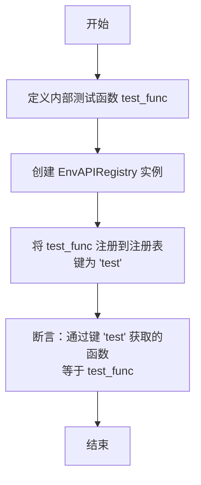
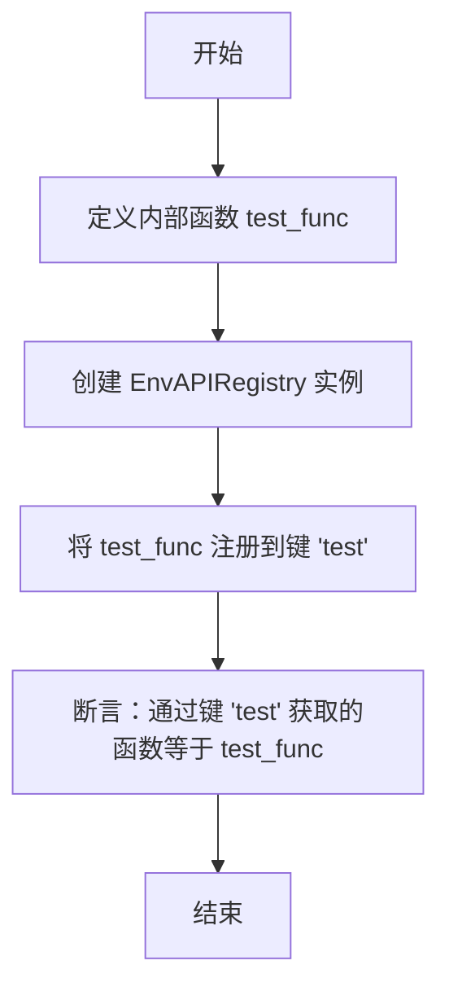

# `.\MetaGPT\tests\metagpt\environment\api\test_env_api.py` 详细设计文档

该代码是一个测试模块，用于验证 EnvAPIRegistry 类的核心功能。它创建了一个 EnvAPIRegistry 实例，向其中注册一个名为 'test' 的测试函数，然后验证通过 get 方法能够正确检索到该函数。

## 整体流程

```mermaid
graph TD
    A[开始测试] --> B[定义测试函数 test_func]
    B --> C[创建 EnvAPIRegistry 实例]
    C --> D[注册函数: registry['test'] = test_func]
    D --> E[检索函数: registry.get('test')]
    E --> F{比较返回值与原始函数}
    F -- 相等 --> G[测试通过]
    F -- 不相等 --> H[测试失败]
```

## 类结构

```
EnvAPIRegistry (来自 metagpt.environment.api.env_api)
├── 内部实现: 字典结构，用于存储和检索环境API函数
└── 提供方法: __setitem__, get 等
```

## 全局变量及字段


### `env_api_registry`
    
EnvAPIRegistry类的一个实例，用于注册和管理环境API函数。

类型：`EnvAPIRegistry`
    


    

## 全局函数及方法


### `test_env_api_registry`

该函数是一个简单的单元测试函数，用于验证 `EnvAPIRegistry` 类的核心功能。它创建了一个 `EnvAPIRegistry` 实例，将一个测试函数注册到该注册表中，然后验证通过键名能够正确检索到该函数。

参数：
- 无

返回值：`None`，该函数不返回任何值，主要用于执行测试断言。

#### 流程图



#### 带注释源码

```python
def test_env_api_registry():
    # 定义一个内部函数 `test_func`，作为测试用的环境API函数。
    # 此函数体为空，仅用于测试注册和检索功能。
    def test_func():
        pass

    # 实例化环境API注册表 `EnvAPIRegistry`。
    env_api_registry = EnvAPIRegistry()

    # 使用字典赋值语法，将测试函数 `test_func` 注册到 `env_api_registry` 中，
    # 并指定其键名为 "test"。这测试了注册表的 `__setitem__` 方法。
    env_api_registry["test"] = test_func

    # 使用注册表的 `get` 方法，通过键名 "test" 检索之前注册的函数。
    # 这是一个断言（虽然未使用 `assert` 关键字，但在测试上下文中隐含），
    # 用于验证检索到的函数与原始注册的 `test_func` 是同一个对象。
    # 这测试了注册表的 `get` 方法。
    env_api_registry.get("test") == test_func
```


### `test_env_api_registry`

这是一个测试函数，用于验证 `EnvAPIRegistry` 类的核心功能。它创建了一个 `EnvAPIRegistry` 实例，将一个名为 `test_func` 的测试函数注册到该注册表中，然后验证是否可以通过键 `"test"` 成功检索到该函数。

参数：
- 无

返回值：`None`，此函数不返回任何值，主要用于执行测试断言。

#### 流程图



#### 带注释源码

```python
def test_env_api_registry():
    # 定义一个内部函数 `test_func`，作为待注册的测试对象。
    def test_func():
        pass

    # 创建一个 `EnvAPIRegistry` 类的实例。
    env_api_registry = EnvAPIRegistry()

    # 使用字典赋值语法，将 `test_func` 函数注册到注册表中，键为 `"test"`。
    # 这测试了 `EnvAPIRegistry.__setitem__` 方法。
    env_api_registry["test"] = test_func

    # 使用 `get` 方法，通过键 `"test"` 从注册表中检索函数。
    # 这是一个断言（在测试框架中通常为 `assert`），验证检索到的函数与原始的 `test_func` 是同一个对象。
    # 这测试了 `EnvAPIRegistry.get` 方法。
    env_api_registry.get("test") == test_func
```


### `EnvAPIRegistry.__setitem__`

该方法用于向 `EnvAPIRegistry` 实例的注册表中添加或更新一个键值对。它重写了 Python 内置的 `__setitem__` 魔法方法，使得可以通过字典式的赋值语法（如 `registry["key"] = value`）来注册环境 API 函数。

参数：

-  `key`：`str`，要注册的 API 的名称或标识符。
-  `value`：`Callable`，与 `key` 关联的可调用对象（通常是函数或方法），代表具体的环境 API 实现。

返回值：`None`，此方法不返回任何值，其作用是将键值对存储到内部字典中。

#### 流程图

```mermaid
flowchart TD
    A[开始: __setitem__(key, value)] --> B{value 是否为可调用对象?}
    B -- 是 --> C[将 key-value 对存入 self._registry 字典]
    C --> D[结束]
    B -- 否 --> E[抛出 TypeError 异常]
    E --> D
```

#### 带注释源码

```python
def __setitem__(self, key: str, value: Callable):
    """
    重写 __setitem__ 方法，允许通过字典语法注册 API。
    例如: registry["move"] = move_function

    Args:
        key (str): API 的名称。
        value (Callable): 对应的可调用函数。

    Raises:
        TypeError: 如果 `value` 不是可调用对象。
    """
    # 检查传入的 value 是否可调用，确保注册的是函数或方法
    if not callable(value):
        raise TypeError(f"Value must be callable, got {type(value)}")
    # 将键值对存储到内部的 _registry 字典中
    self._registry[key] = value
```


### `EnvAPIRegistry.get`

该方法用于从环境API注册表中根据给定的键名检索并返回对应的API函数。如果键名不存在，则返回`None`。

参数：

- `name`：`str`，要检索的API函数的键名

返回值：`Optional[Callable]`，返回与键名关联的API函数，如果键名不存在则返回`None`

#### 流程图

```mermaid
graph TD
    A[开始] --> B{检查 name 是否在 self._registry 中?}
    B -- 是 --> C[返回 self._registry[name]]
    B -- 否 --> D[返回 None]
    C --> E[结束]
    D --> E
```

#### 带注释源码

```python
def get(self, name: str) -> Optional[Callable]:
    """
    根据给定的键名从注册表中获取对应的API函数。

    参数:
        name (str): 要检索的API函数的键名

    返回:
        Optional[Callable]: 返回与键名关联的API函数，如果键名不存在则返回None
    """
    return self._registry.get(name)  # 使用字典的get方法，如果键不存在则返回None
```

## 关键组件


### EnvAPIRegistry

EnvAPIRegistry 是一个环境API注册表，用于管理和存储环境相关的API函数，支持通过键名进行注册和检索。

### 环境API注册机制

该机制通过一个注册表类（EnvAPIRegistry）来集中管理环境交互的API，允许动态添加和获取API函数，提高了代码的模块化和可扩展性。


## 问题及建议


### 已知问题

-   **测试用例不完整**：当前测试代码仅验证了注册和获取功能，但未测试其他关键功能，如覆盖注册、获取不存在的键、删除键等场景，可能导致潜在缺陷未被发现。
-   **断言语句无效**：代码中的断言 `env_api_registry.get("test") == test_func` 缺少 `assert` 关键字，因此不会执行任何验证，测试实际上没有检查任何逻辑。
-   **缺乏类型安全**：`EnvAPIRegistry` 可能未对注册的函数进行类型检查或约束，这可能导致运行时错误，尤其是在大型或多人协作的项目中。
-   **未测试并发安全性**：如果 `EnvAPIRegistry` 在多线程环境中使用，当前测试未验证其线程安全性，可能存在竞态条件风险。

### 优化建议

-   **完善测试用例**：应扩展测试以覆盖 `EnvAPIRegistry` 的所有公共方法，包括 `__setitem__`、`get`、`__delitem__`、`__contains__` 等，并测试边界情况（如键不存在、重复注册等）。
-   **修复断言语句**：将 `env_api_registry.get("test") == test_func` 改为 `assert env_api_registry.get("test") == test_func`，确保测试能正确验证预期行为。
-   **引入类型注解和验证**：为 `EnvAPIRegistry` 添加类型注解（如使用 `typing` 模块），并在注册时验证函数签名，以提高代码的可靠性和可维护性。
-   **添加并发测试**：如果 `EnvAPIRegistry` 设计用于多线程环境，应添加并发测试（如使用 `threading` 模块）来确保其线程安全性，或明确文档说明其非线程安全。
-   **使用标准测试框架**：考虑使用 `pytest` 或 `unittest` 等标准测试框架来组织测试，以获得更好的测试报告、夹具管理和参数化测试支持。
-   **提高测试可读性**：为测试函数和方法添加清晰的文档字符串，说明测试的目的和场景，便于其他开发者理解和维护。


## 其它


### 设计目标与约束

该代码的设计目标是提供一个轻量级、可扩展的环境API注册机制，允许动态注册和检索与环境交互相关的函数。主要约束包括：保持接口简单，避免复杂的依赖关系，确保线程安全（如果应用于多线程环境），并支持通过字符串键进行快速查找。

### 错误处理与异常设计

当前代码示例中未显式展示错误处理。在完整实现中，`EnvAPIRegistry` 类应处理以下异常情况：
1.  当尝试注册一个非可调用对象时，应抛出 `TypeError`。
2.  当通过 `get` 方法查询一个不存在的键时，可以返回 `None` 或抛出一个自定义的 `KeyError` 异常，具体取决于设计决策。示例中使用了 `==` 进行比较，但实际使用时应考虑键不存在的情况。
3.  在 `__setitem__` 方法中，应考虑键已存在时的处理策略（例如覆盖、忽略或抛出异常）。

### 数据流与状态机

1.  **数据流**：
    *   **注册阶段**：用户通过 `env_api_registry["test"] = test_func` 或类似方法，将一个函数（或可调用对象）与一个字符串键关联起来。数据从用户代码流向 `EnvAPIRegistry` 实例内部的存储字典。
    *   **检索阶段**：用户通过 `env_api_registry.get("test")` 请求与键 `"test"` 关联的函数。数据从 `EnvAPIRegistry` 实例内部的存储字典流回用户代码。
2.  **状态机**：`EnvAPIRegistry` 实例的核心状态是一个内部的映射（如字典）。其状态变化仅由注册（添加或更新键值对）操作触发。没有复杂的多状态转换，是一个简单的键值存储模型。

### 外部依赖与接口契约

1.  **外部依赖**：
    *   `metagpt.environment.api.env_api.EnvAPIRegistry`：这是代码直接依赖的外部类。其完整实现（未在片段中展示）定义了注册表的具体行为。
    *   `Python` 标准库：可能间接依赖 `typing` 模块用于类型注解，但核心功能基于内置字典。
2.  **接口契约**：
    *   `EnvAPIRegistry` 类应实现 `__setitem__` 和 `get` 方法，使其行为类似于一个字典容器。
    *   `__setitem__(key: str, value: Callable)`：契约要求 `key` 为字符串，`value` 为可调用对象。
    *   `get(key: str) -> Optional[Callable]`：契约要求根据字符串 `key` 返回注册的可调用对象，如果键不存在则返回 `None` 或引发异常。

### 测试策略与用例

1.  **测试策略**：采用单元测试，针对 `EnvAPIRegistry` 的核心功能进行验证。测试代码应独立，不依赖外部环境。
2.  **测试用例**（基于示例推断）：
    *   **用例1：注册与检索功能**：验证注册一个函数后，可以通过键成功检索到同一个函数对象。
    *   **用例2：键不存在处理**：验证当尝试获取一个未注册的键时，`get` 方法的行为符合预期（返回 `None` 或抛出异常）。
    *   **用例3：覆盖注册**：验证为已存在的键注册新的可调用对象时，旧值是否被正确覆盖。
    *   **用例4：注册非可调用对象**：验证尝试注册一个非可调用对象（如整数、字符串）时，是否会抛出适当的异常。

### 配置与可调参数

在当前代码片段中，没有显式的配置或可调参数。`EnvAPIRegistry` 本身可能通过其 `__init__` 方法接受一些配置，例如：
*   `default_return_value`：当键不存在时 `get` 方法的默认返回值。
*   `allow_overwrite`：一个布尔值，控制是否允许覆盖已存在的键。
这些参数在提供的代码中并未体现，属于潜在的扩展点。

### 部署与运行要求

1.  **运行环境**：需要 Python 解释器（版本根据项目要求，如 Python 3.8+）。
2.  **依赖安装**：需要安装 `metagpt` 包或其特定子模块 `metagpt.environment.api`。
3.  **执行方式**：该文件是一个测试脚本，可通过命令行直接运行（`python test_file.py`）或由测试框架（如 `pytest`）调用。
4.  **无状态服务**：`EnvAPIRegistry` 通常是作为库的一部分在应用程序内存中实例化和使用，无需额外的持久化存储或后台服务。

    