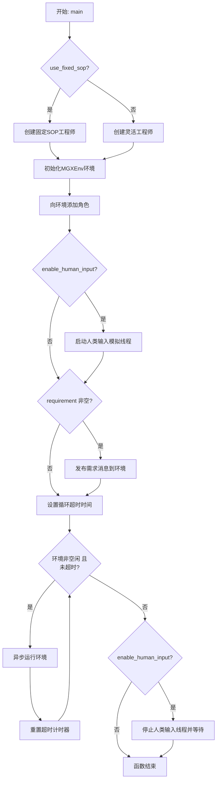
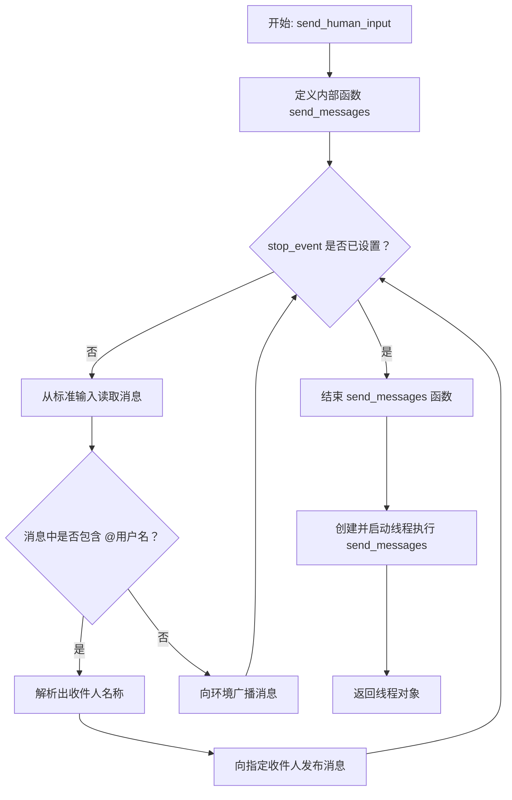
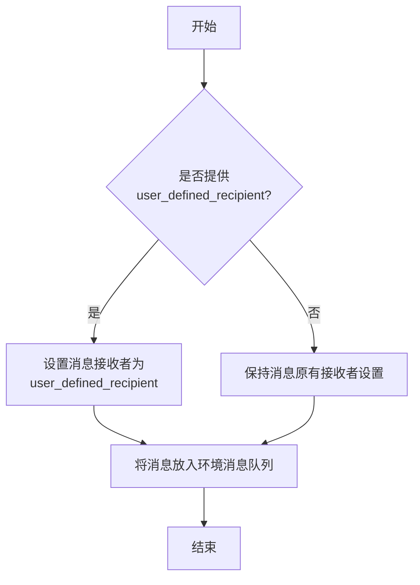
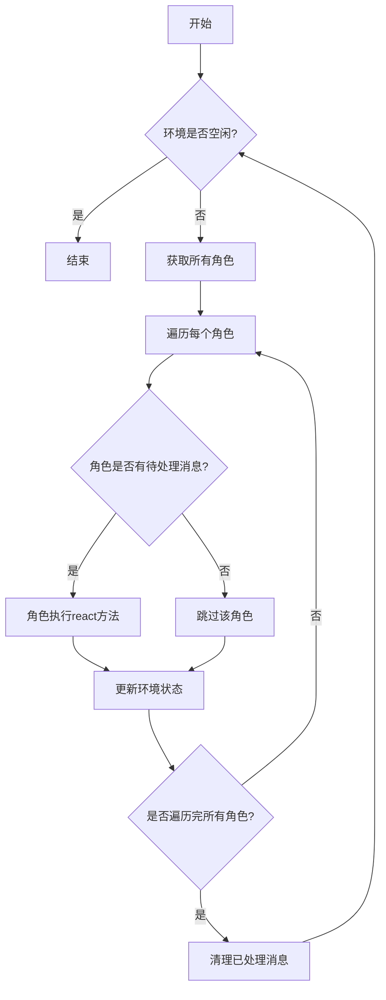
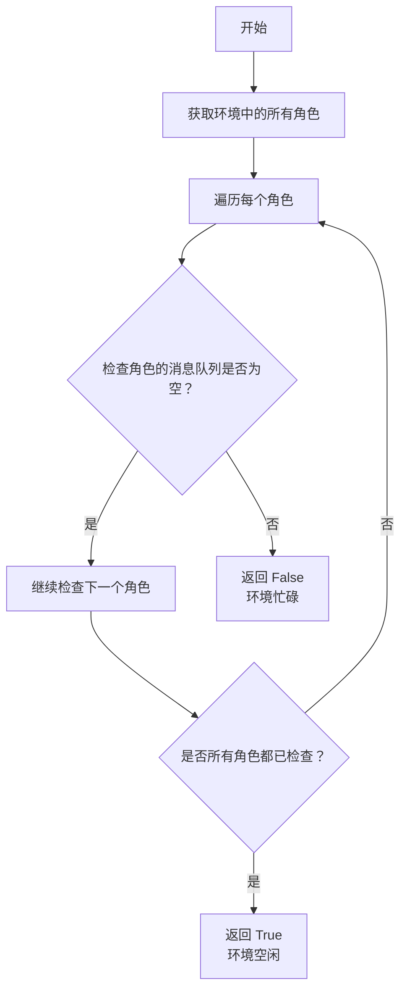

# `.\MetaGPT\tests\metagpt\environment\mgx_env\run_mgx_env.py` 详细设计文档

该代码是一个基于MetaGPT框架的多智能体协作系统示例，用于模拟一个软件开发团队（包含团队领导、产品经理、架构师、项目经理、工程师、数据分析师等角色）根据用户需求（如创建游戏、数据分析、修复GitHub问题等）进行协作开发、数据分析和问题解决的工作流程。它支持两种模式：固定标准操作程序（SOP）和动态协作，并可选择启用模拟人工输入以进行交互式测试。

## 整体流程

```mermaid
graph TD
    A[开始: 调用main函数] --> B{是否使用固定SOP?}
    B -- 是 --> C[创建Engineer角色]
    B -- 否 --> D[创建Engineer2角色]
    C --> E[创建MGXEnv环境]
    D --> E
    E --> F[向环境添加角色: TeamLeader, ProductManager, Architect, ProjectManager, engineer, DataAnalyst]
    F --> G{是否启用人工输入?}
    G -- 是 --> H[启动send_human_input线程]
    G -- 否 --> I[直接发布初始需求消息]
    H --> I
    I --> J[进入主循环: 检查环境是否空闲]
    J --> K{环境空闲时间超过允许值?}
    K -- 是 --> L[循环结束]
    K -- 否 --> M{环境是否空闲?}
    M -- 是 --> J
    M -- 否 --> N[运行环境一步: env.run()]
    N --> O[重置空闲计时器]
    O --> J
    L --> P{是否启用了人工输入?}
    P -- 是 --> Q[设置停止事件，等待线程结束]
    P -- 否 --> R[程序结束]
    Q --> R
```

## 类结构

```
MetaGPT Framework (External)
├── MGXEnv (环境类)
├── Message (消息类)
└── Roles (角色类)
    ├── Architect
    ├── Engineer
    ├── Engineer2
    ├── ProductManager
    ├── ProjectManager
    ├── DataAnalyst
    └── TeamLeader
User-defined Functions
├── main (异步主函数)
└── send_human_input (模拟人工输入函数)
```

## 全局变量及字段


### `GAME_REQ`
    
创建2048游戏的英文需求描述

类型：`str`
    


### `GAME_REQ_ZH`
    
创建贪吃蛇游戏的中文需求描述

类型：`str`
    


### `WEB_GAME_REQ`
    
使用纯JavaScript（无框架）创建2048游戏的英文需求描述

类型：`str`
    


### `WEB_GAME_REQ_DEPLOY`
    
使用纯JavaScript创建2048游戏并部署到8090端口的英文需求描述

类型：`str`
    


### `TODO_APP_REQ`
    
创建TODO列表管理网站小部件的详细英文需求描述

类型：`str`
    


### `FLAPPY_BIRD_REQ`
    
使用pygame创建Flappy Bird游戏的英文需求描述

类型：`str`
    


### `SIMPLE_DATA_REQ`
    
加载sklearn iris数据集并打印统计摘要的英文需求描述

类型：`str`
    


### `WINE_REQ`
    
对sklearn葡萄酒数据集进行分析、训练模型并报告验证准确率的英文需求描述

类型：`str`
    


### `PAPER_LIST_REQ`
    
从指定网页抓取包含特定关键词的论文列表并保存为CSV的英文需求描述

类型：`str`
    


### `ECOMMERCE_REQ`
    
从指定电商网站抓取产品数据并保存为CSV的英文需求描述

类型：`str`
    


### `NEWS_36KR_REQ`
    
从36kr创投平台抓取融资快讯信息的中文需求描述

类型：`str`
    


### `data_path`
    
泰坦尼克号数据集的基础路径

类型：`str`
    


### `train_path`
    
泰坦尼克号训练数据集的完整文件路径

类型：`str`
    


### `eval_path`
    
泰坦尼克号评估数据集的完整文件路径

类型：`str`
    


### `TITANIC_REQ`
    
对泰坦尼克号数据集进行分析、预处理、特征工程和建模的英文需求描述

类型：`str`
    


### `CALIFORNIA_HOUSING_REQ`
    
对加州房价数据集进行分析、预处理、特征工程和建模的英文需求描述

类型：`str`
    


### `STOCK_REQ`
    
对NVIDIA股票数据进行分析、可视化和预测建模的英文需求描述

类型：`str`
    


### `FIX_ISSUE1`
    
修复指定GitHub issue并提交PR的英文需求描述

类型：`str`
    


### `FIX_ISSUE2`
    
修复指定GitHub issue并提交PR的英文需求描述

类型：`str`
    


### `FIX_ISSUE3`
    
修复指定GitHub issue并提交PR的英文需求描述

类型：`str`
    


### `FIX_ISSUE_SIMPLE`
    
修复简单计算器项目issue并提交PR的英文需求描述

类型：`str`
    


### `PUSH_PR_REQ`
    
克隆仓库、创建分支、提交更改并创建PR的英文需求描述

类型：`str`
    


### `IMAGE2CODE_REQ`
    
根据给定图片生成相似前端网页代码的英文需求描述

类型：`str`
    


### `DOC_QA_REQ1`
    
总结指定PDF论文内容的英文需求描述

类型：`str`
    


### `DOC_QA_REQ2`
    
总结指定PDF文档内容的英文需求描述

类型：`str`
    


### `DOC_QA_REQ3`
    
总结指定PDF论文关键点的中文需求描述

类型：`str`
    


### `DOC_QA_REQ4`
    
从指定报表中提取营业收入TOP3产品收入占比的中文需求描述

类型：`str`
    


### `TL_CHAT1`
    
请求总结论文的英文聊天消息

类型：`str`
    


### `TL_CHAT2`
    
请求解决指定issue的英文聊天消息

类型：`str`
    


### `TL_CHAT3`
    
询问谁第一个登上月球的英文聊天消息

类型：`str`
    


### `TL_CHAT4`
    
求解指定有限域上多项式零点的英文聊天消息

类型：`str`
    


### `TL_CHAT5`
    
计算指定域扩张次数的英文聊天消息

类型：`str`
    


### `TL_CHAT6`
    
判断两个数学陈述真假的英文聊天消息

类型：`str`
    


### `TL_CHAT7`
    
解决糖果分配问题的英文聊天消息

类型：`str`
    


### `TL_CHAT9`
    
询问对方名字的英文聊天消息

类型：`str`
    


### `TL_CHAT10`
    
简单的打招呼消息

类型：`str`
    


### `TL_CHAT11`
    
询问团队信息的英文聊天消息

类型：`str`
    


### `TL_CHAT12`
    
询问对方能力的英文聊天消息

类型：`str`
    


### `CODING_REQ1`
    
请求编写Java Hello World程序的中文需求描述

类型：`str`
    


### `CODING_REQ2`
    
询问Python装饰器概念的中文需求描述

类型：`str`
    


### `CODING_REQ3`
    
请求Python装饰器用法示例的中文需求描述

类型：`str`
    


### `Message.content`
    
消息的主要内容文本

类型：`str`
    


### `Message.send_to`
    
消息的指定接收者集合

类型：`set`
    


### `Architect.use_fixed_sop`
    
是否使用固定的标准操作流程

类型：`bool`
    


### `Engineer.n_borg`
    
工程师角色的borg数量参数

类型：`int`
    


### `Engineer.use_code_review`
    
是否启用代码审查功能

类型：`bool`
    


### `ProductManager.use_fixed_sop`
    
是否使用固定的标准操作流程

类型：`bool`
    


### `ProjectManager.use_fixed_sop`
    
是否使用固定的标准操作流程

类型：`bool`
    
    

## 全局函数及方法

### `main`

`main` 函数是 MetaGPT 多智能体协作系统的异步入口点。它负责初始化一个包含多种角色（如产品经理、架构师、工程师等）的协作环境（`MGXEnv`），并根据传入的需求启动一个异步的协作流程。该函数支持两种运行模式：一种是基于预设的固定标准操作程序（SOP），另一种是更灵活的协作模式。它还允许通过一个独立的线程模拟人类用户的实时输入，从而与智能体进行交互。函数的核心是一个循环，只要环境中有活动（非空闲状态），它就会持续运行环境，直到达到预设的最大空闲时间。

参数：
- `requirement`：`str`，一个字符串，描述了需要智能体团队协作完成的任务或需求。默认为空字符串。
- `enable_human_input`：`bool`，一个布尔值，指示是否启用一个独立的线程来模拟人类用户的实时输入。默认为 `False`。
- `use_fixed_sop`：`bool`，一个布尔值，指示是否使用固定的标准操作程序（SOP）来指导智能体的行为。当为 `True` 时，会使用一个特定的 `Engineer` 实例；否则，使用更灵活的 `Engineer2` 实例。默认为 `False`。
- `allow_idle_time`：`int`，一个整数，表示在环境变为空闲状态后，允许系统保持运行的最大秒数。如果启用了人类输入，这个值会被使用；否则，会被设置为1秒以快速结束循环。默认为30秒。

返回值：`None`，该函数没有返回值。

#### 流程图



#### 带注释源码

```python
async def main(requirement="", enable_human_input=False, use_fixed_sop=False, allow_idle_time=30):
    # 根据 use_fixed_sop 参数选择不同类型的工程师角色
    if use_fixed_sop:
        engineer = Engineer(n_borg=5, use_code_review=False)
    else:
        engineer = Engineer2()

    # 初始化多智能体协作环境
    env = MGXEnv()
    # 向环境中添加预定义的角色团队
    env.add_roles(
        [
            TeamLeader(),
            ProductManager(use_fixed_sop=use_fixed_sop),
            Architect(use_fixed_sop=use_fixed_sop),
            ProjectManager(use_fixed_sop=use_fixed_sop),
            engineer,
            # QaEngineer(),
            DataAnalyst(),
        ]
    )

    # 如果启用了人类输入模拟，则启动一个后台线程
    if enable_human_input:
        # 创建一个事件用于控制线程的停止
        stop_event = threading.Event()
        # 启动线程，该线程会等待用户输入并发布到环境
        human_input_thread = send_human_input(env, stop_event)

    # 如果调用时提供了初始需求，则将其作为第一条消息发布到环境中
    if requirement:
        env.publish_message(Message(content=requirement))
        # 示例：可以指定消息的接收者
        # user_defined_recipient = "Alex"
        # env.publish_message(Message(content=requirement, send_to={user_defined_recipient}), user_defined_recipient=user_defined_recipient)

    # 设置循环的超时条件：如果启用了人类输入，则使用传入的 allow_idle_time，否则快速结束（1秒）
    allow_idle_time = allow_idle_time if enable_human_input else 1
    start_time = time.time()
    # 主循环：只要环境中有活动（非空闲）且未超时，就持续运行环境
    while time.time() - start_time < allow_idle_time:
        if not env.is_idle:
            await env.run()  # 异步执行环境的一个运行周期
            start_time = time.time()  # 重置超时计时器

    # 如果启用了人类输入，在循环结束后，通知输入线程停止并等待其结束
    if enable_human_input:
        print("No more human input, terminating, press ENTER for a full termination.")
        stop_event.set()
        human_input_thread.join()
```

### `send_human_input`

该函数用于在异步环境运行时，启动一个独立的线程来模拟用户在聊天框中输入消息。它会持续监听标准输入，将用户输入的消息发布到指定的环境（`MGXEnv`）中。如果消息中包含 `@用户名` 的格式，它会解析出收件人并将消息定向发送给该收件人；否则，消息将广播给环境中的所有角色。该线程的运行由一个停止事件（`stop_event`）控制，当主程序决定终止交互时，通过设置该事件来停止输入线程。

参数：
- `env`：`MGXEnv`，消息将被发布到的异步环境实例。
- `stop_event`：`threading.Event`，用于控制输入线程何时停止的事件对象。当事件被设置时，线程将退出循环。

返回值：`threading.Thread`，返回已启动的、用于发送消息的后台线程对象。

#### 流程图



#### 带注释源码

```python
def send_human_input(env, stop_event):
    """
    模拟在聊天框中发送消息。
    注意：在本地环境中，消息只有在当前一轮 env.run 完成后才会被消费。
    """

    def send_messages():
        # 内部函数，在线程中运行，持续监听输入直到收到停止信号。
        while not stop_event.is_set():
            # 阻塞等待用户从控制台输入一行文本。
            message = input("Enter a message any time: ")
            # 使用正则表达式检查消息中是否包含 @用户名 格式。
            user_defined_recipient = re.search(r"@(\w+)", message)
            if user_defined_recipient:
                # 如果找到，提取用户名。
                recipient_name = user_defined_recipient.group(1)
                print(f"{recipient_name} will receive the message")
                # 调用环境的 publish_message 方法，指定收件人。
                env.publish_message(
                    Message(content=message, send_to={recipient_name}), user_defined_recipient=recipient_name
                )
            else:
                # 如果没有指定收件人，则广播消息给所有角色。
                env.publish_message(Message(content=message))

    # 创建一个线程，其目标函数是上面定义的 send_messages。
    send_thread = threading.Thread(target=send_messages, args=())
    # 启动线程，使其开始运行。
    send_thread.start()
    # 将线程对象返回给调用者，以便主程序可以等待其结束。
    return send_thread
```

### `MGXEnv.add_roles`

该方法用于向`MGXEnv`环境实例中添加一个或多个角色对象。它接收一个角色列表，并将这些角色注册到环境中，使它们能够参与后续的异步协作任务。

参数：
-  `roles`：`list`，一个包含`Role`类实例的列表，这些角色将被添加到环境中。

返回值：`None`，该方法不返回任何值。

#### 流程图

```mermaid
flowchart TD
    A[开始: 调用 add_roles(roles)] --> B{检查 roles 参数是否为列表?}
    B -- 是 --> C[遍历 roles 列表]
    C --> D[将每个角色添加到 self._roles 字典中<br>键: role.profile<br>值: role 实例]
    D --> E[结束]
    B -- 否 --> F[抛出 TypeError 异常]
    F --> E
```

#### 带注释源码

```python
def add_roles(self, roles: list):
    """
    将多个角色添加到环境中。

    参数:
        roles (list): 一个包含 Role 实例的列表。
    """
    # 参数类型检查：确保传入的 roles 是一个列表
    if not isinstance(roles, list):
        raise TypeError("`roles` must be a list")
    # 遍历角色列表
    for role in roles:
        # 将每个角色以其 profile 属性（通常为角色名称）为键，角色实例本身为值，存储到内部的 _roles 字典中。
        # 这建立了角色名称到角色对象的映射，便于后续通过名称查找和调度角色。
        self._roles[role.profile] = role
```

### `MGXEnv.publish_message`

该方法用于向MGXEnv环境发布消息，可以指定消息的接收者。它会将消息放入环境的消息队列中，并触发相关角色的处理流程。

参数：

- `message`：`Message`，要发布的消息对象，包含消息内容、发送者、接收者等信息。
- `user_defined_recipient`：`str`，可选参数，指定消息的接收者名称。如果提供，将覆盖消息对象中自带的接收者设置。

返回值：`None`，无返回值。

#### 流程图



#### 带注释源码

```python
def publish_message(self, message: Message, user_defined_recipient: str = None):
    """
    发布消息到环境。
    
    参数:
        message (Message): 要发布的消息。
        user_defined_recipient (str, 可选): 指定的消息接收者。如果提供，将覆盖消息中的接收者设置。
    """
    # 如果指定了用户定义的接收者，则更新消息的接收者
    if user_defined_recipient:
        message.send_to = {user_defined_recipient}
    # 将消息放入环境的发布-订阅消息队列中
    self._pub_messages.put(message)
```

### `MGXEnv.run`

该方法用于运行MGXEnv环境，驱动环境中所有角色的异步执行流程，处理角色间的消息传递和任务执行，直到环境进入空闲状态或达到运行条件。

参数：
- 无显式参数（实例方法，通过`self`访问实例属性）

返回值：`None`，无返回值

#### 流程图



#### 带注释源码

```python
async def run(self):
    """
    运行环境的主循环
    
    该方法会：
    1. 检查环境是否空闲（is_idle属性）
    2. 如果环境不空闲，则遍历所有角色
    3. 对每个有未处理消息的角色调用react方法
    4. 更新环境状态并清理已处理的消息
    5. 循环直到环境进入空闲状态
    
    注意：这是一个异步方法，需要在异步上下文中调用
    """
    # 检查环境是否空闲，如果空闲则直接返回
    if self.is_idle:
        return
    
    # 获取环境中的所有角色
    roles = self.get_roles()
    
    # 遍历每个角色，处理其消息
    for role in roles:
        # 检查角色是否有待处理的消息
        if self.get_message(role):
            # 如果有消息，则让角色执行react方法处理消息
            await role.react()
    
    # 更新环境状态，清理已处理的消息
    self.publish_message()
```

### `MGXEnv.is_idle`

`MGXEnv.is_idle` 是 `MGXEnv` 类的一个属性（property），用于判断当前环境是否处于空闲状态。它通过检查环境中所有角色的待处理消息队列是否为空来实现。如果所有角色的消息队列都为空，则环境被认为是空闲的；否则，环境被认为是忙碌的。

参数：
- 无（这是一个属性，不接受参数）

返回值：`bool`，如果环境中所有角色的待处理消息队列都为空，则返回 `True`，表示环境空闲；否则返回 `False`，表示环境忙碌。

#### 流程图



#### 带注释源码

```python
@property
def is_idle(self) -> bool:
    """
    判断环境是否空闲。
    通过检查所有角色的待处理消息队列是否为空来实现。
    如果所有角色的消息队列都为空，则环境空闲；否则环境忙碌。
    """
    # 遍历环境中的所有角色
    for role in self.roles:
        # 检查当前角色的待处理消息队列是否为空
        if not role.rc.msg_buffer.empty():
            # 如果任何一个角色的消息队列不为空，则环境不空闲
            return False
    # 如果所有角色的消息队列都为空，则环境空闲
    return True
```

## 关键组件


### MGXEnv (多智能体协作环境)

这是一个多智能体协作环境，负责管理和协调多个角色（如产品经理、架构师、工程师等）之间的交互与任务执行。它通过消息发布/订阅机制驱动整个工作流，并可以配置是否启用固定标准操作流程（SOP）。

### 角色系统 (Role System)

代码定义了一个多智能体团队，包含多种专业角色，如团队领导、产品经理、架构师、项目经理、工程师和数据分析师。这些角色在环境中协同工作，根据接收到的需求（如创建游戏、数据分析、修复问题等）执行特定任务。

### 固定SOP与动态SOP切换

代码支持两种工程师角色配置模式：一种是使用固定标准操作流程（SOP）的`Engineer`，另一种是使用更灵活或不同逻辑的`Engineer2`。这体现了系统在任务执行策略上的可配置性。

### 异步主循环与空闲检测

主函数`main`包含一个异步运行循环，它持续检查环境是否处于空闲状态。如果环境不空闲，则运行环境以推进任务；如果环境持续空闲超过设定的时间（在启用人工输入时较长，否则很短），则终止运行。这实现了对任务执行过程的自动化管理。

### 人工输入模拟线程

当启用人工输入时，系统会启动一个独立的线程`send_human_input`，模拟用户在聊天框中发送消息。该线程持续监听控制台输入，并支持通过`@角色名`的格式将消息定向发送给特定角色，增强了交互性和测试灵活性。

### 预定义需求库

代码底部定义了大量字符串常量（如`GAME_REQ`, `TITANIC_REQ`, `FIX_ISSUE1`等），这些是用于测试的各种任务需求示例，涵盖了游戏开发、数据分析、问题修复、文档问答、代码生成等多个领域，方便快速启动不同的测试场景。


## 问题及建议


### 已知问题

-   **硬编码的配置和示例需求**：代码中包含了大量硬编码的示例需求字符串（如 `GAME_REQ`, `TODO_APP_REQ` 等）和路径（如 `data_path`）。这使得代码难以复用和配置，每次运行不同的任务都需要直接修改源代码。
-   **缺乏配置管理**：关键参数（如 `access_token`）通过直接设置环境变量 `os.environ["access_token"]` 来配置，缺乏一个统一的、可管理的配置系统（如配置文件、命令行参数解析）。这降低了部署的灵活性和安全性。
-   **线程与异步混合的潜在风险**：`send_human_input` 函数使用 `threading` 模块创建了一个独立的线程来模拟用户输入，而主程序是异步的（`asyncio`）。这种混合并发模型可能引入竞态条件或复杂的同步问题，尤其是在 `env.publish_message` 可能不是线程安全的情况下。
-   **有限且僵化的空闲检测机制**：主循环使用固定的 `allow_idle_time` 来判断环境是否空闲。当 `enable_human_input=False` 时，此时间被设置为1秒，这可能过于激进，导致在角色间消息传递尚未完成时就被误判为“空闲”而提前退出。逻辑上，`env.is_idle` 应足以驱动循环，当前实现存在冗余和潜在逻辑错误。
-   **代码结构单一，职责过重**：`main` 函数承担了过多职责，包括环境初始化、角色配置、运行循环、用户输入模拟等。这违反了单一职责原则，使得函数冗长，难以测试和维护。
-   **缺乏错误处理**：代码中没有对可能发生的异常（如网络请求失败、文件读写错误、环境初始化失败等）进行捕获和处理，程序遇到错误时会直接崩溃。
-   **示例需求字符串包含敏感信息路径**：如 `IMAGE2CODE_REQ` 和 `DOC_QA_REQ*` 中包含本地绝对路径（`/Users/gary/...`），这些路径对其他用户无效，且暴露了开发者个人文件系统结构。

### 优化建议

-   **引入配置系统**：将示例需求、文件路径、API令牌等配置信息外置。建议使用配置文件（如 YAML、JSON）或命令行参数解析库（如 `argparse`、`click`）来管理。`main` 函数应接收一个配置对象或解析后的参数。
-   **重构 `main` 函数，分离关注点**：
    -   将环境初始化和角色配置抽离到独立的函数或类中。
    -   将主运行循环逻辑封装起来，使其更清晰。可以创建一个 `Runner` 或 `Orchestrator` 类来管理环境的生命周期和运行逻辑。
    -   将用户输入处理逻辑（`send_human_input`）与核心运行逻辑进一步解耦。
-   **改进并发模型**：
    -   评估 `MGXEnv.publish_message` 的线程安全性。如果不安全，应考虑使用线程安全队列或完全在异步上下文中处理用户输入（例如，使用 `asyncio` 的 `run_in_executor` 或专门的异步输入库）。
    -   简化空闲检测逻辑。理想情况下，应主要依赖 `env.is_idle` 属性。可以移除基于时间的重置逻辑，或将其作为可选的超时后备机制。
-   **增强错误处理与日志记录**：
    -   在 `main` 函数和关键操作周围添加 `try...except` 块，捕获异常并记录有意义的错误信息，确保程序能够优雅地失败或重试。
    -   引入结构化日志记录（如使用 `logging` 模块），替代 `print` 语句，以便于调试和监控。
-   **移除或抽象化硬编码的示例**：将示例需求定义移至独立的模块或配置文件中。`main` 函数或配置系统应支持通过名称或标识符来引用预定义的任务，而不是在代码中硬编码字符串。
-   **安全性与代码清理**：
    -   移除代码中包含的示例性访问令牌 (`ghp_xxx`)，强调通过安全的方式（如环境变量、密钥管理服务）提供此类敏感信息。
    -   清理包含无效本地路径的示例字符串，或将其替换为通用的占位符说明。
-   **增加单元测试和集成测试**：为重构后的模块（如配置加载、环境初始化、运行逻辑）编写测试，以确保代码更改不会破坏现有功能，并提高代码质量。


## 其它


### 设计目标与约束

本代码是一个基于MetaGPT框架的异步多智能体协作系统启动脚本。其核心设计目标是提供一个灵活、可配置的入口，用于启动一个包含多种预定义角色（如产品经理、架构师、工程师等）的智能体环境，以协作完成用户指定的任务（如软件开发、数据分析、问题修复等）。主要约束包括：1) 依赖于MetaGPT框架提供的底层角色和环境抽象；2) 支持同步（自动运行）和异步（允许人工输入）两种运行模式；3) 通过环境变量或代码内常量配置关键参数（如GitHub令牌、任务需求）；4) 运行时间受`allow_idle_time`参数控制，在无人为输入时快速退出，在有人为输入时等待交互。

### 错误处理与异常设计

代码中的错误处理相对简单，主要依赖于Python和asyncio的默认异常传播机制。在`main`异步函数中，没有显式的try-catch块来捕获`env.run()`或角色交互过程中可能抛出的异常，这意味着任何未处理的异常都会导致整个程序崩溃。`send_human_input`函数作为后台线程运行，其异常可能导致线程静默失败，而不会影响主事件循环，但缺乏日志记录。整体缺乏对网络请求失败（如爬虫任务）、文件I/O错误、外部API调用（如GitHub）失败、角色执行超时等场景的健壮性处理。这是一个明显的技术债务，需要在生产环境中增强。

### 数据流与状态机

系统的数据流以`MGXEnv`环境实例为中心。初始数据（用户需求）通过`env.publish_message`发布到环境。环境内部维护一个消息队列，并根据角色的订阅关系（`send_to`字段）和当前状态将消息分发给相应的角色（如`TeamLeader`, `ProductManager`等）。每个角色处理消息后，可能产生新的消息并发布回环境，形成循环。在`enable_human_input=False`的模式下，这是一个由初始需求触发的、自动推进的有限状态机，直到环境空闲(`env.is_idle`)超过`allow_idle_time`。在`enable_human_input=True`的模式下，系统进入一个由人工输入驱动的交互式状态机，主循环持续检查环境是否空闲，同时后台线程监听用户输入并注入新消息，直到空闲超时。环境(`env.is_idle`)的状态是驱动主循环(`while`循环)的关键。

### 外部依赖与接口契约

1.  **MetaGPT框架**: 核心依赖，代码严重依赖于`metagpt`包中的`MGXEnv`、`Message`以及各种`Role`类（`Architect`, `Engineer`, `ProductManager`, `ProjectManager`, `DataAnalyst`, `Engineer2`, `TeamLeader`）。接口契约由这些类的公共方法和属性定义。
2.  **异步运行时**: 依赖`asyncio`库来运行异步主函数`main`。
3.  **线程**: 使用`threading`库在启用人工输入时创建后台监听线程。
4.  **环境变量**: 依赖`os.environ["access_token"]`来获取GitHub个人访问令牌，用于代码中与GitHub相关的任务（如提交PR）。这是一个关键的敏感信息依赖。
5.  **隐式依赖**: 代码中预定义的任务需求字符串（如`WEB_GAME_REQ`, `FIX_ISSUE1`）暗示了对外部资源（如特定网站、GitHub仓库、本地文件路径）的依赖。这些依赖的可用性直接影响任务能否成功执行。
6.  **输入/输出**: 标准输入(`input`)用于模拟人工输入，标准输出(`print`)用于显示提示信息和结果。

### 配置管理与常量定义

代码的配置主要通过三种方式混合管理：
1.  **函数参数**: `main`函数的参数（`requirement`, `enable_human_input`, `use_fixed_sop`, `allow_idle_time`）提供了运行时的主要配置点。
2.  **全局常量**: 文件底部定义了大量以`_REQ`、`_CHAT`、`_PATH`结尾的全局变量，作为预定义的任务需求模板或数据路径。这是一种硬编码的配置方式，便于快速切换测试用例，但缺乏灵活性，且与业务逻辑混杂。
3.  **环境变量**: 使用`os.environ`读取`access_token`，用于外部服务认证。
这种配置方式缺乏集中管理，常量散落，且部分配置（如需求字符串）包含了具体的业务指令，使得代码与特定任务耦合度高。

### 并发与线程安全

代码涉及两种并发模型：
1.  **异步I/O (asyncio)**: 主逻辑`main`和`env.run()`在异步事件循环中运行，适用于I/O密集型操作（如网络请求、文件读写）。
2.  **多线程 (threading)**: 当`enable_human_input=True`时，会启动一个独立的线程`send_human_input`来阻塞地监听用户输入。
潜在的风险在于共享资源`env`（`MGXEnv`实例）被主异步线程和后台线程同时访问（通过`env.publish_message`）。虽然`threading`和`asyncio`的交互需要谨慎处理，但这里对`env`的访问可能缺乏必要的锁或线程安全保证，取决于`MGXEnv.publish_message`方法内部的实现。如果该方法非线程安全，则存在数据竞争风险。

### 安全与隐私考虑

1.  **敏感信息泄露**: 代码示例中将GitHub访问令牌硬编码为`"ghp_xxx"`并设置到环境变量。在实际使用中，这必须被替换为真实的令牌，并且该令牌应以安全的方式存储和管理（如从加密的配置文件或密钥管理服务读取），避免直接写入源代码。
2.  **输入验证**: `send_human_input`函数中，用户输入未经任何清洗或验证就直接包装成`Message`发布到环境中。如果智能体角色会执行输入内容（如作为代码、Shell命令的一部分），则存在注入攻击的风险。
3.  **文件路径访问**: 部分预定义需求（如`DOC_QA_REQ1`, `IMAGE2CODE_REQ`）包含硬编码的本地文件路径。这可能导致脚本尝试访问预期外的或敏感的系统文件。
4.  **外部资源访问**: 任务可能涉及爬取公开网站（如`ECOMMERCE_REQ`, `NEWS_36KR_REQ`）或克隆外部Git仓库，需要确保这些操作符合目标网站的服务条款和robots.txt规定，避免法律风险。

### 测试与调试支持

代码本身不包含任何单元测试或集成测试。它作为一个高层集成脚本，其正确性严重依赖于底层MetaGPT框架以及预定义角色的行为。调试支持有限：
1.  通过`print`语句输出一些状态信息（如“No more human input, terminating...”）。
2.  在人工输入模式下，提供了交互式测试能力。
3.  通过修改`__main__`中`asyncio.run`调用的参数，可以方便地切换不同的预定义任务进行端到端测试。
然而，缺乏结构化的日志记录、性能监控、中间状态检查点以及错误恢复机制，使得定位复杂协作过程中出现的问题较为困难。


    