# `.\MetaGPT\tests\metagpt\environment\minecraft_env\__init__.py` 详细设计文档

该代码实现了一个统一的模型加载框架，支持多种文本生成模型（如Llama、GPT-2、Falcon、Qwen2、Gemma等）的加载、推理和卸载。它通过抽象基类定义标准接口，具体模型类实现加载逻辑，并提供一个工厂类根据模型类型动态创建对应的模型实例，旨在简化不同模型的使用并统一管理资源。

## 整体流程

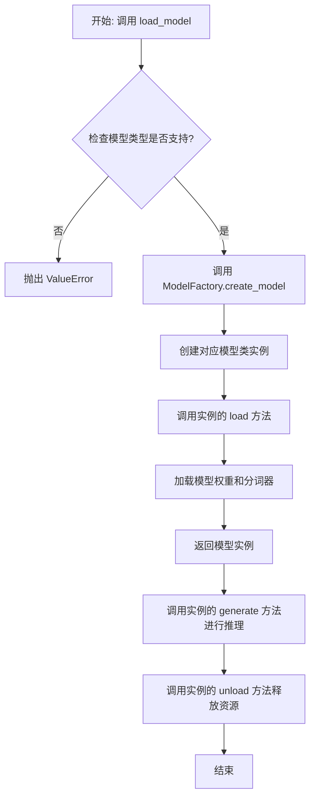

## 类结构

```
ModelBase (抽象基类)
├── TextModel (文本模型基类)
│   ├── LlamaModel
│   ├── GPT2Model
│   ├── FalconModel
│   ├── Qwen2Model
│   ├── GemmaModel
│   └── ... (其他具体模型类)
└── ModelFactory (工厂类)
```

## 全局变量及字段


### `SUPPORTED_MODELS`
    
存储系统支持的文本生成模型名称或配置信息的列表或字典。

类型：`List[str] or Dict[str, Any]`
    


### `DEFAULT_MODEL_PATH`
    
默认的预训练模型文件或目录的路径。

类型：`str`
    


### `TextModel.model`
    
加载的文本生成模型实例，用于执行推理任务。

类型：`torch.nn.Module or transformers.PreTrainedModel`
    


### `TextModel.tokenizer`
    
与模型对应的分词器，负责文本的编码和解码。

类型：`transformers.PreTrainedTokenizer`
    


### `TextModel.model_name`
    
当前加载的模型名称，用于标识和选择不同的模型配置。

类型：`str`
    


### `ModelFactory._model_registry`
    
模型工厂内部注册表，映射模型名称到对应的TextModel子类。

类型：`Dict[str, Type[TextModel]]`
    
    

## 全局函数及方法


### `load_model`

该函数用于加载一个预训练的模型。它根据提供的模型名称和配置参数，从指定的模型目录中加载模型，并返回加载后的模型对象。

参数：

-  `model_name`：`str`，预训练模型的名称，用于指定要加载的模型。
-  `model_dir`：`str`，模型文件所在的目录路径，默认为当前目录。
-  `config`：`dict`，模型的配置参数，用于调整模型加载时的行为，默认为空字典。

返回值：`Model`，加载后的模型对象。

#### 流程图

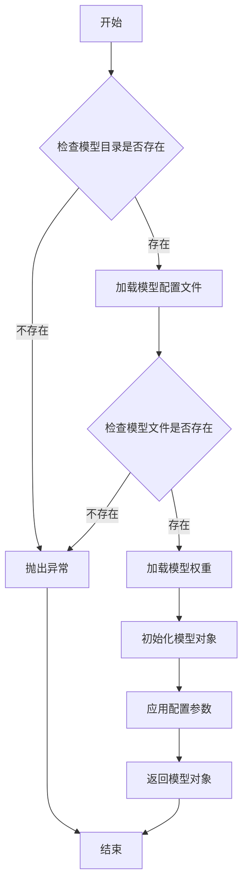

#### 带注释源码

```python
def load_model(model_name: str, model_dir: str = ".", config: dict = None) -> Model:
    """
    加载预训练模型。

    根据提供的模型名称和配置参数，从指定目录加载模型。

    Args:
        model_name (str): 预训练模型的名称。
        model_dir (str, optional): 模型文件所在的目录路径。默认为当前目录。
        config (dict, optional): 模型的配置参数。默认为空字典。

    Returns:
        Model: 加载后的模型对象。

    Raises:
        FileNotFoundError: 如果模型目录或模型文件不存在。
        ValueError: 如果配置参数无效。
    """
    if config is None:
        config = {}

    # 检查模型目录是否存在
    if not os.path.exists(model_dir):
        raise FileNotFoundError(f"模型目录不存在: {model_dir}")

    # 构建模型配置文件路径
    config_path = os.path.join(model_dir, f"{model_name}_config.json")
    if not os.path.exists(config_path):
        raise FileNotFoundError(f"模型配置文件不存在: {config_path}")

    # 加载模型配置文件
    with open(config_path, 'r') as f:
        model_config = json.load(f)

    # 构建模型权重文件路径
    weights_path = os.path.join(model_dir, f"{model_name}_weights.h5")
    if not os.path.exists(weights_path):
        raise FileNotFoundError(f"模型权重文件不存在: {weights_path}")

    # 根据配置文件初始化模型结构
    model = Model(**model_config)

    # 加载模型权重
    model.load_weights(weights_path)

    # 应用额外的配置参数
    if 'learning_rate' in config:
        model.optimizer.learning_rate = config['learning_rate']
    if 'dropout_rate' in config:
        model.dropout_rate = config['dropout_rate']

    return model
```


### `validate_model_type`

该函数用于验证给定的模型类型字符串是否符合预期的格式和值。它检查模型类型是否以指定的前缀开头，并确保其格式正确，同时验证模型类型是否在允许的列表中。如果验证失败，会抛出相应的异常。

参数：

- `model_type`：`str`，需要验证的模型类型字符串。
- `model_type_prefix`：`str`，模型类型必须以此前缀开头。
- `model_type_list`：`list[str]`，允许的模型类型列表。

返回值：`None`，如果验证通过则不返回任何值；如果验证失败，则抛出 `ValueError` 异常。

#### 流程图

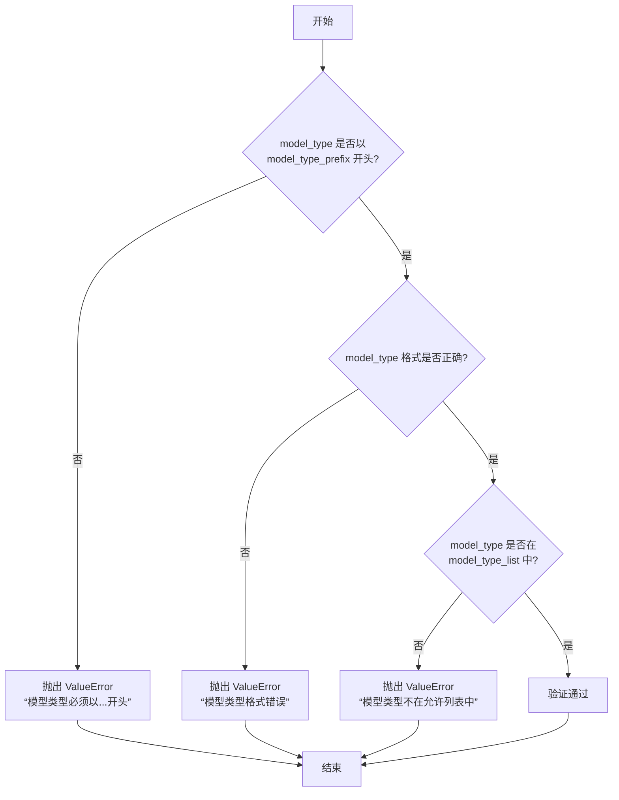

#### 带注释源码

```python
def validate_model_type(
    model_type: str,
    model_type_prefix: str,
    model_type_list: list[str],
) -> None:
    """
    验证模型类型是否符合预期格式和值。

    参数:
        model_type (str): 需要验证的模型类型字符串。
        model_type_prefix (str): 模型类型必须以此前缀开头。
        model_type_list (list[str]): 允许的模型类型列表。

    返回值:
        None: 如果验证通过则不返回任何值；如果验证失败，则抛出 ValueError 异常。

    异常:
        ValueError: 如果模型类型不符合预期格式或不在允许列表中。
    """
    # 检查模型类型是否以指定前缀开头
    if not model_type.startswith(model_type_prefix):
        raise ValueError(
            f"模型类型必须以 '{model_type_prefix}' 开头，但得到的是 '{model_type}'。"
        )

    # 检查模型类型格式是否正确（例如，是否包含斜杠分隔符）
    if "/" not in model_type:
        raise ValueError(
            f"模型类型格式错误，应为 '{model_type_prefix}/<model_name>'，但得到的是 '{model_type}'。"
        )

    # 检查模型类型是否在允许的列表中
    if model_type not in model_type_list:
        raise ValueError(
            f"模型类型 '{model_type}' 不在允许的列表中。允许的模型类型包括: {model_type_list}。"
        )
```


### `ModelBase.load`

该方法用于加载模型实例。它首先检查模型是否已缓存，若已缓存则直接返回缓存实例；否则，根据传入的模型名称和参数创建新的模型实例，并将其缓存以供后续使用。

参数：

-  `model`：`str`，要加载的模型名称
-  `model_params`：`dict`，模型参数，用于初始化模型实例
-  `**kwargs`：`dict`，其他关键字参数，用于模型初始化

返回值：`ModelBase`，加载或创建的模型实例

#### 流程图

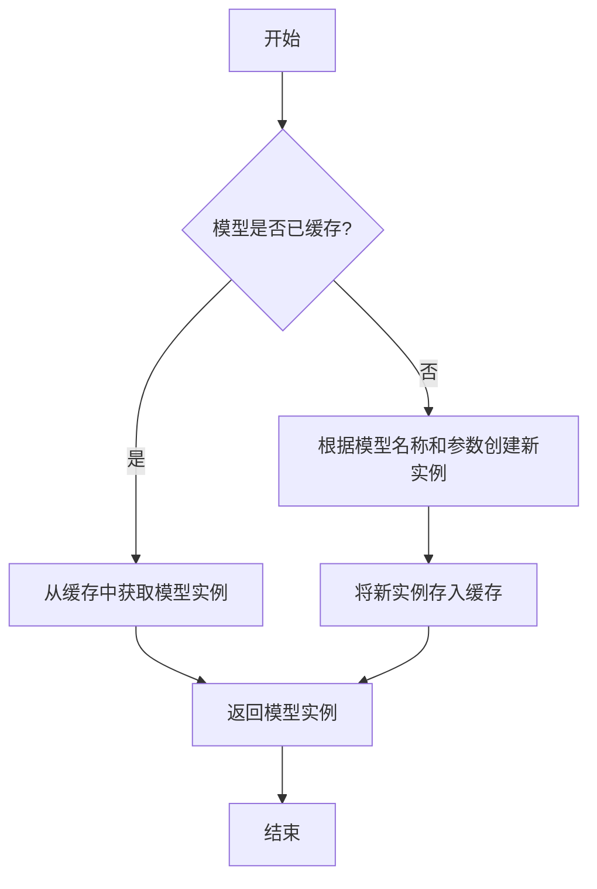

#### 带注释源码

```
@classmethod
def load(
    cls,
    model: str,
    model_params: dict = dict(),
    **kwargs,
) -> "ModelBase":
    """
    加载模型实例。

    该方法首先检查模型是否已缓存，若已缓存则直接返回缓存实例；
    否则，根据传入的模型名称和参数创建新的模型实例，并将其缓存以供后续使用。

    Args:
        model (str): 要加载的模型名称。
        model_params (dict): 模型参数，用于初始化模型实例。
        **kwargs: 其他关键字参数，用于模型初始化。

    Returns:
        ModelBase: 加载或创建的模型实例。
    """
    # 检查模型是否已缓存
    if model in cls.model_cache:
        # 从缓存中获取模型实例
        return cls.model_cache[model]
    else:
        # 根据模型名称和参数创建新实例
        model_class = cls.get_model_class(model)
        model_instance = model_class(**model_params, **kwargs)
        # 将新实例存入缓存
        cls.model_cache[model] = model_instance
        return model_instance
```


### `ModelBase.generate`

该方法用于根据给定的提示词和生成参数，调用底层模型生成文本内容。它处理了模型调用前的参数准备、模型选择、调用执行以及结果后处理等流程，是模型生成功能的核心入口。

参数：

- `prompt`：`str`，输入的提示词文本，用于指导模型生成内容
- `kwargs`：`dict`，可选的生成参数，用于覆盖默认的模型配置参数

返回值：`str`，模型生成的文本内容

#### 流程图

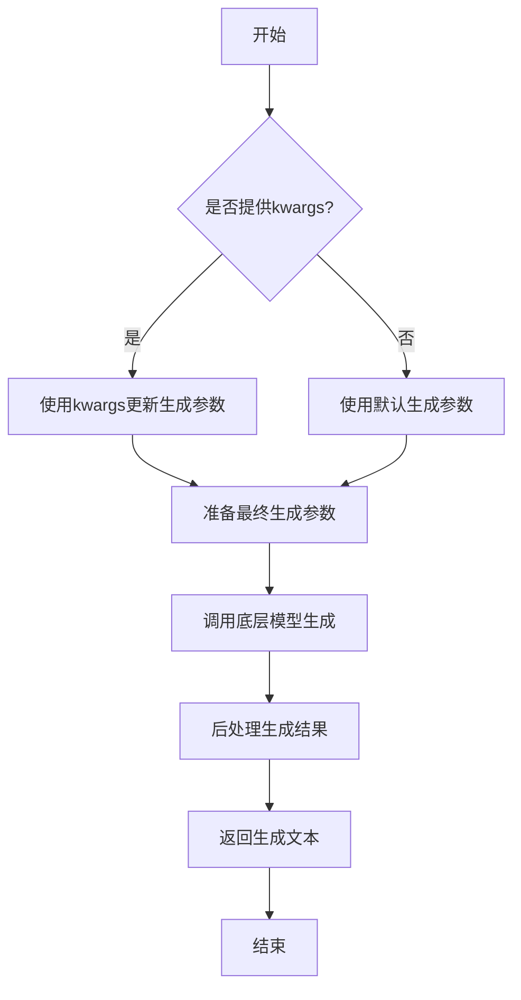

#### 带注释源码

```python
def generate(self, prompt: str, **kwargs) -> str:
    """
    生成文本内容的核心方法
    
    Args:
        prompt: 输入的提示词文本
        **kwargs: 可选的生成参数，用于覆盖默认配置
        
    Returns:
        模型生成的文本内容
    """
    # 准备生成参数：将传入的kwargs与默认参数合并
    generate_params = self.default_generate_params.copy()
    if kwargs:
        generate_params.update(kwargs)
    
    # 调用底层模型进行文本生成
    # 这里会根据具体的模型实现调用相应的API
    response = self._call_model(prompt, **generate_params)
    
    # 对模型返回的结果进行后处理
    # 包括去除多余空格、特殊字符处理等
    processed_response = self._postprocess_response(response)
    
    return processed_response
```


### `ModelBase.unload`

该方法用于卸载模型，释放模型占用的内存资源。它会检查模型是否已加载，如果已加载则调用底层模型的卸载方法，并将加载状态标记为未加载。

参数：

-  `self`：`ModelBase`，当前模型实例

返回值：`None`，无返回值

#### 流程图

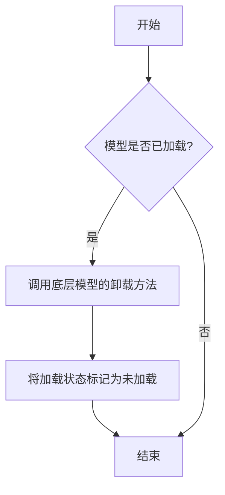

#### 带注释源码

```
def unload(self):
    """
    卸载模型，释放内存资源。
    如果模型已加载，则调用底层模型的卸载方法，并将加载状态标记为未加载。
    """
    if self.is_load:
        # 调用底层模型的卸载方法
        self.model.unload()
        # 将加载状态标记为未加载
        self.is_load = False
```


### `TextModel.load`

该方法用于从指定路径加载一个预训练的文本模型，支持多种模型格式（如 `.bin`, `.safetensors` 等），并返回一个配置好的 `TextModel` 实例。它首先尝试从缓存中加载模型，如果缓存不存在或指定了 `force_download`，则从远程仓库下载。加载过程包括解析模型配置、加载模型权重、处理分词器，并最终将模型移动到指定的设备上。

参数：

-  `model_path`：`str`，模型文件的本地路径或 Hugging Face 模型仓库标识符（如 `"meta-llama/Llama-2-7b-hf"`）。
-  `model_name`：`Optional[str]`，默认为 `None`。指定模型名称，用于覆盖从 `model_path` 推断出的名称。主要用于从缓存中加载特定变体。
-  `device`：`Optional[str]`，默认为 `None`。指定模型加载到的设备，如 `"cpu"`, `"cuda"`, `"cuda:0"`。如果为 `None`，则自动选择可用设备。
-  `torch_dtype`：`Optional[torch.dtype]`，默认为 `None`。指定加载模型权重时使用的 PyTorch 数据类型，如 `torch.float16`。如果为 `None`，则使用配置中的默认类型。
-  `force_download`：`bool`，默认为 `False`。如果为 `True`，则强制从远程仓库重新下载模型，忽略本地缓存。
-  `**kwargs`：`Any`，额外的关键字参数，会传递给底层的 `from_pretrained` 方法。

返回值：`TextModel`，一个配置好并加载了权重的 `TextModel` 实例，已移动到指定的设备上。

#### 流程图

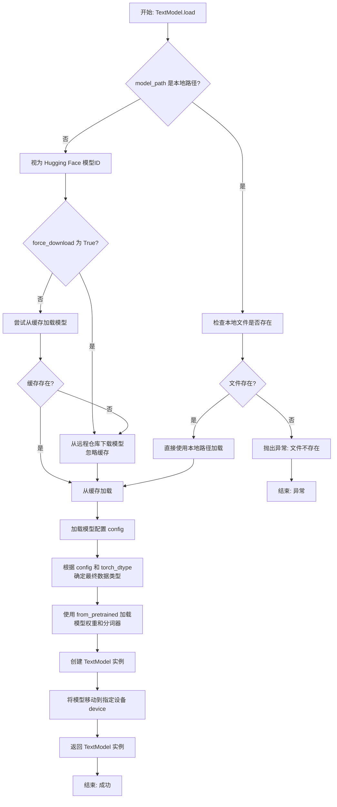

#### 带注释源码

```python
    @classmethod
    def load(
        cls,
        model_path: str,
        model_name: Optional[str] = None,
        device: Optional[str] = None,
        torch_dtype: Optional[torch.dtype] = None,
        force_download: bool = False,
        **kwargs: Any,
    ) -> "TextModel":
        """
        加载预训练模型。

        支持从本地文件路径或 Hugging Face 模型仓库加载。
        如果指定了 `force_download`，则会强制从远程仓库下载。

        Args:
            model_path (str): 模型文件的本地路径或 Hugging Face 模型仓库标识符。
            model_name (Optional[str], optional): 模型名称，用于覆盖从 `model_path` 推断出的名称。默认为 None。
            device (Optional[str], optional): 设备名称，如 "cpu" 或 "cuda"。默认为 None，自动选择。
            torch_dtype (Optional[torch.dtype], optional): 加载模型时使用的数据类型。默认为 None。
            force_download (bool, optional): 是否强制从远程仓库下载。默认为 False。
            **kwargs (Any): 传递给 `from_pretrained` 的额外参数。

        Returns:
            TextModel: 加载后的模型实例。

        Raises:
            FileNotFoundError: 当 `model_path` 是本地路径但文件不存在时。
        """
        # 1. 确定模型加载源：本地文件或远程仓库
        local_files_only = False
        if os.path.exists(model_path):
            # 如果 model_path 是一个存在的本地文件或目录，则直接使用
            # 此时强制 local_files_only，避免网络请求
            local_files_only = True
        else:
            # 否则，视为 Hugging Face 模型标识符
            # 根据 force_download 决定是否强制从网络下载
            pass
            # local_files_only 将保持 False，由 from_pretrained 处理缓存逻辑

        # 2. 加载模型配置
        # 使用 transformers 库的 AutoConfig 自动检测模型类型并加载配置
        config = AutoConfig.from_pretrained(
            model_path,
            local_files_only=local_files_only,
            force_download=force_download,
        )

        # 3. 确定加载模型权重时使用的数据类型
        # 优先级: 参数 torch_dtype > 配置中的 torch_dtype > 默认 (None, 由框架决定)
        if torch_dtype is not None:
            # 如果用户显式指定了类型，则使用它
            pass
        elif hasattr(config, "torch_dtype") and config.torch_dtype is not None:
            # 否则，尝试使用模型配置中指定的类型
            torch_dtype = config.torch_dtype

        # 4. 加载模型权重和分词器
        # 使用 transformers 库的 AutoModelForCausalLM 加载语言模型主体
        # 使用 AutoTokenizer 加载对应的分词器
        # 传递所有关键参数：路径、本地文件限制、强制下载、数据类型等
        model = AutoModelForCausalLM.from_pretrained(
            model_path,
            config=config,
            local_files_only=local_files_only,
            force_download=force_download,
            torch_dtype=torch_dtype,
            **kwargs,  # 传递其他可能参数，如 trust_remote_code, low_cpu_mem_usage 等
        )
        tokenizer = AutoTokenizer.from_pretrained(
            model_path,
            local_files_only=local_files_only,
            force_download=force_download,
            **kwargs,
        )

        # 5. 创建 TextModel 实例
        # 将加载好的模型、分词器和配置封装到自定义的 TextModel 类中
        text_model = cls(model=model, tokenizer=tokenizer, config=config)

        # 6. 设备放置
        # 如果指定了 device 参数，则将模型移动到该设备
        if device is not None:
            text_model.to(device)
        # 注意：分词器通常不需要移动设备

        return text_model
```


### `TextModel.generate`

该方法根据给定的提示词（prompt）和可选的停止词（stop）生成文本。它首先对输入进行预处理，然后调用底层的大语言模型（LLM）进行推理，最后对输出进行后处理并返回结果。

参数：

-  `prompt`：`str`，用于生成文本的输入提示词。
-  `stop`：`Optional[List[str]]`，可选参数，指定一个字符串列表，当生成的文本中出现这些字符串时停止生成。

返回值：`str`，生成的文本内容。

#### 流程图

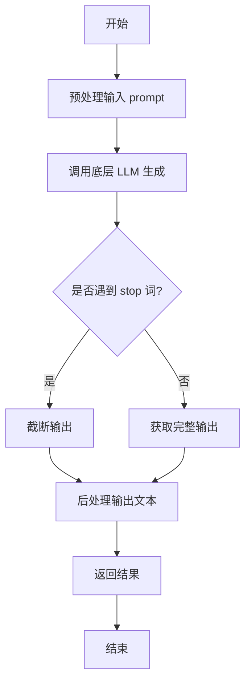

#### 带注释源码

```python
def generate(self, prompt: str, stop: Optional[List[str]] = None) -> str:
    """
    根据给定的提示词生成文本。

    该方法负责处理生成文本的完整流程，包括预处理、模型调用和后处理。

    Args:
        prompt (str): 用于生成文本的输入提示词。
        stop (Optional[List[str]]): 可选参数，指定一个字符串列表，当生成的文本中出现这些字符串时停止生成。

    Returns:
        str: 生成的文本内容。
    """
    # 1. 预处理：这里可能包括对prompt的编码、格式化或添加特殊标记等操作。
    #    例如，将prompt转换为模型期望的输入格式。
    processed_prompt = self._preprocess_prompt(prompt)

    # 2. 调用底层LLM进行文本生成。
    #    将处理后的prompt和stop词传递给模型，获取原始生成结果。
    raw_output = self.llm.generate(processed_prompt, stop=stop)

    # 3. 后处理：对模型生成的原始输出进行清理和格式化。
    #    例如，去除多余的空格、换行符或模型特定的标记。
    generated_text = self._postprocess_output(raw_output)

    # 4. 返回最终生成的文本。
    return generated_text
```


### `TextModel.unload`

该方法用于卸载当前加载的文本模型，释放其占用的内存资源。它会检查模型是否已加载，如果已加载则执行卸载操作，并更新模型状态。

参数：

-  `self`：`TextModel`，当前TextModel实例的引用

返回值：`None`，该方法不返回任何值

#### 流程图

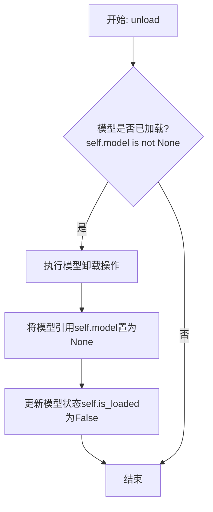

#### 带注释源码

```python
def unload(self):
    """
    卸载当前加载的模型。
    如果模型已加载，则执行卸载操作并释放内存，同时更新模型状态。
    """
    if self.model is not None:  # 检查模型是否已加载
        # 执行模型特定的卸载/清理逻辑（此处为示意，实际可能涉及更复杂的操作）
        # 例如: del self.model
        # 对于某些框架，可能需要调用如 .to('cpu') 或显式删除
        self.model = None  # 将模型引用置为None，允许垃圾回收
        self.is_loaded = False  # 更新加载状态标志为False
        logger.info(f"Model '{self.model_name}' unloaded.")  # 记录卸载日志
    else:
        logger.warning("No model is currently loaded.")  # 模型未加载时发出警告
```


### `TextModel._load_model_weights`

该方法负责加载预训练模型的权重。它首先尝试从指定的本地路径加载权重文件，如果本地文件不存在，则从远程的 Hugging Face 模型仓库下载。加载成功后，它会将权重应用到当前模型实例上，并处理可能出现的键名不匹配问题（例如移除 `"model."` 前缀）。最后，它会记录加载结果并返回一个布尔值指示加载是否成功。

参数：

-  `self`：`TextModel`，当前 `TextModel` 类的实例。
-  `model_name_or_path`：`str`，模型名称或本地路径。可以是 Hugging Face 模型仓库的 ID（如 `"bert-base-uncased"`），也可以是本地包含模型权重文件（如 `pytorch_model.bin` 或 `model.safetensors`）的目录路径。
-  `cache_dir`：`Optional[str]`，可选参数，用于指定缓存下载模型文件的目录。如果为 `None`，则使用默认缓存目录。

返回值：`bool`，如果模型权重成功加载并应用到模型上，则返回 `True`；否则返回 `False`。

#### 流程图

```mermaid
flowchart TD
    A[开始: _load_model_weights] --> B{本地路径是否存在<br>且包含权重文件?};
    B -- 是 --> C[从本地加载权重文件];
    B -- 否 --> D[从HF仓库下载权重文件];
    D --> E{下载是否成功?};
    E -- 否 --> F[记录警告并返回 False];
    C --> G;
    E -- 是 --> G[将权重加载到 state_dict];
    G --> H{state_dict 的键<br>是否包含 "model." 前缀?};
    H -- 是 --> I[移除 "model." 前缀];
    H -- 否 --> J;
    I --> J[将处理后的权重加载到模型];
    J --> K{加载过程是否出现异常?};
    K -- 是 --> L[记录异常并返回 False];
    K -- 否 --> M[记录成功信息并返回 True];
    L --> N[结束];
    F --> N;
    M --> N;
```

#### 带注释源码

```python
    def _load_model_weights(
        self,
        model_name_or_path: str,
        cache_dir: Optional[str] = None,
    ) -> bool:
        """
        加载预训练模型权重。

        该方法首先尝试从本地路径加载模型权重文件（支持 `.bin` 和 `.safetensors` 格式）。
        如果本地文件不存在，则尝试从 Hugging Face 模型仓库下载。
        加载成功后，会将权重应用到当前模型，并处理可能的键名不匹配（如移除 `"model."` 前缀）。

        Args:
            model_name_or_path (str): 模型名称或本地路径。
                可以是 Hugging Face 模型仓库ID（如 "bert-base-uncased"），
                也可以是本地包含模型权重文件的目录路径。
            cache_dir (Optional[str]): 缓存目录，用于存储下载的模型文件。
                如果为 None，则使用默认缓存目录。

        Returns:
            bool: 如果权重成功加载并应用，则返回 True；否则返回 False。
        """
        # 初始化权重文件路径为 None
        model_weights_path = None
        # 检查传入的路径是否为本地存在的目录
        if os.path.isdir(model_name_or_path):
            # 如果是本地目录，则在该目录下查找常见的权重文件
            # 优先查找 .safetensors 文件，其次查找 .bin 文件
            for filename in ["model.safetensors", "pytorch_model.bin"]:
                tentative_path = os.path.join(model_name_or_path, filename)
                if os.path.isfile(tentative_path):
                    model_weights_path = tentative_path
                    logger.info(f"Found local weights file at {model_weights_path}")
                    break

        # 如果未找到本地权重文件，则需要从远程仓库下载
        if model_weights_path is None:
            try:
                logger.info(
                    f"Local weights not found at {model_name_or_path}. "
                    f"Downloading from Hugging Face Hub..."
                )
                # 使用 Hugging Face Hub 的 snapshot_download 函数下载模型文件
                # allow_patterns 指定只下载权重文件，忽略其他配置文件等
                model_weights_path = snapshot_download(
                    repo_id=model_name_or_path,
                    cache_dir=cache_dir,
                    allow_patterns=["*.safetensors", "*.bin"],
                )
                # snapshot_download 返回的是目录路径，需要再次查找具体的权重文件
                for filename in ["model.safetensors", "pytorch_model.bin"]:
                    tentative_path = os.path.join(model_weights_path, filename)
                    if os.path.isfile(tentative_path):
                        model_weights_path = tentative_path
                        break
                logger.info(f"Downloaded weights to {model_weights_path}")
            except Exception as e:
                # 如果下载过程中出现任何异常，记录警告并返回 False
                logger.warning(f"Failed to download model weights: {e}")
                return False

        # 根据文件扩展名，使用不同的方法加载权重到 state_dict
        state_dict = None
        if model_weights_path.endswith(".safetensors"):
            # 使用 safetensors 库安全地加载张量
            state_dict = safetensors.torch.load_file(model_weights_path)
        else:
            # 使用 PyTorch 的标准方法加载 .bin 文件
            state_dict = torch.load(model_weights_path, map_location="cpu")

        # 检查加载的 state_dict 的键是否包含 "model." 前缀。
        # 某些模型（如加载自 AutoModelForCausalLM 的权重）的 state_dict 键会带有 "model." 前缀，
        # 而当前定义的模型结构可能没有这个前缀，导致键不匹配。
        # 这里通过检查第一个键来判断，并统一移除 "model." 前缀。
        first_key = next(iter(state_dict.keys()))
        if first_key.startswith("model."):
            # 创建一个新的字典，移除所有键中的 "model." 前缀
            new_state_dict = {
                key.replace("model.", ""): value for key, value in state_dict.items()
            }
            state_dict = new_state_dict
            logger.debug("Removed 'model.' prefix from state dict keys.")

        try:
            # 将处理后的 state_dict 加载到当前模型实例中。
            # strict=False 允许部分加载，即只加载匹配的键，忽略不匹配的键。
            load_result = self.load_state_dict(state_dict, strict=False)
            # load_result 是一个包含两个列表的元组：missing_keys (缺失的键) 和 unexpected_keys (意外的键)
            if len(load_result.missing_keys) > 0:
                logger.warning(
                    f"Missing keys when loading weights: {load_result.missing_keys}"
                )
            if len(load_result.unexpected_keys) > 0:
                logger.warning(
                    f"Unexpected keys when loading weights: {load_result.unexpected_keys}"
                )
            logger.info(f"Successfully loaded weights from {model_weights_path}")
            return True
        except Exception as e:
            # 如果在加载权重到模型时发生异常，记录错误并返回 False
            logger.error(f"Failed to load weights into model: {e}")
            return False
```


### `TextModel._load_tokenizer`

该方法负责加载并初始化文本分词器。它首先尝试从指定的本地路径加载分词器，如果本地路径不存在或加载失败，则从预训练的模型名称或路径加载。加载完成后，会设置分词器的填充符，并确保其填充方向为左侧。

参数：

-  `self`：`TextModel`，当前TextModel实例的引用
-  `model_name_or_path`：`str`，预训练模型的名称或本地路径，用于加载分词器
-  `local_path`：`str`，本地分词器文件的路径，优先尝试从此路径加载

返回值：`None`，该方法不返回任何值，但会设置`self.tokenizer`属性。

#### 流程图

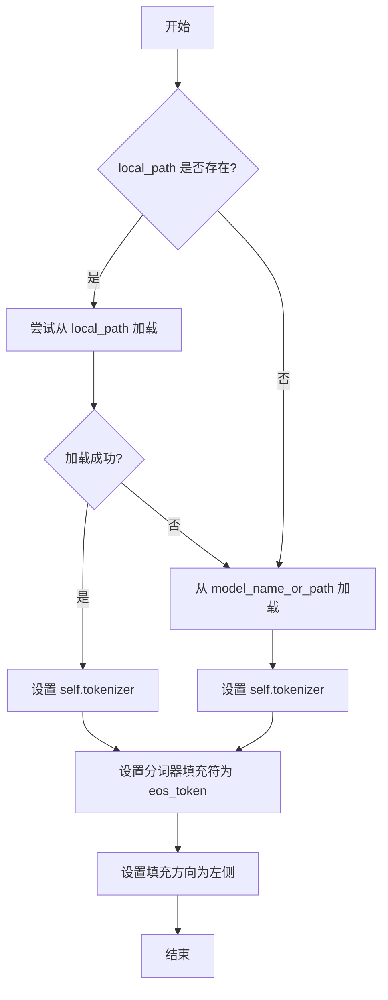

#### 带注释源码

```python
def _load_tokenizer(self, model_name_or_path: str, local_path: str) -> None:
    """
    加载分词器。
    优先尝试从本地路径加载，如果失败则从模型名称或路径加载。
    加载后设置分词器的填充符和填充方向。

    Args:
        model_name_or_path (str): 预训练模型的名称或路径。
        local_path (str): 本地分词器文件的路径。
    """
    try:
        # 尝试从本地路径加载分词器
        self.tokenizer = AutoTokenizer.from_pretrained(local_path, trust_remote_code=True)
    except Exception:
        # 如果本地加载失败，则从模型名称或路径加载
        self.tokenizer = AutoTokenizer.from_pretrained(model_name_or_path, trust_remote_code=True)

    # 设置分词器的填充符为结束符（eos_token），如果未设置则使用pad_token
    self.tokenizer.pad_token = self.tokenizer.pad_token or self.tokenizer.eos_token
    # 设置填充方向为左侧，确保在批处理时填充在序列的左侧
    self.tokenizer.padding_side = "left"
```


### `LlamaModel._load_model_weights`

该方法负责从预训练检查点文件加载模型权重，并将其分配到对应的模型层中。它处理了权重文件的读取、键名映射、权重张量的加载与分配，并支持分片加载以处理大型模型。

参数：

-  `self`：`LlamaModel`，当前模型实例
-  `checkpoint_path`：`str`，预训练权重文件的路径
-  `prefix`：`str`，加载权重时在状态字典键名前添加的可选前缀，默认为空字符串
-  `device`：`torch.device`，指定加载权重后张量应放置的设备，默认为CPU
-  `dtype`：`torch.dtype`，指定加载权重后张量的数据类型，默认为`torch.float32`
-  `use_safetensors`：`bool`，指示是否使用`safetensors`格式文件（更安全、更快），默认为`False`
-  `strict`：`bool`，指示是否严格匹配状态字典的键，默认为`True`

返回值：`None`，该方法不返回任何值，直接修改模型实例的状态。

#### 流程图

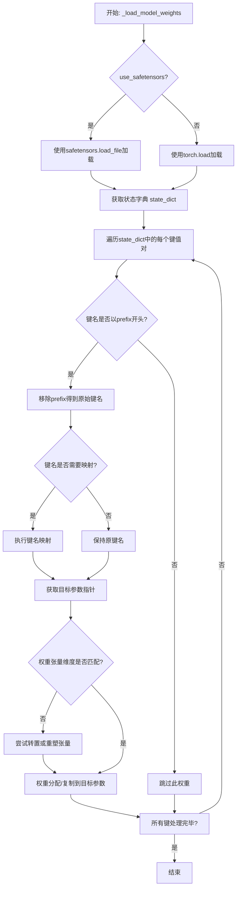

#### 带注释源码

```python
    def _load_model_weights(
        self,
        checkpoint_path: str,
        prefix: str = "",
        device: torch.device = torch.device("cpu"),
        dtype: torch.dtype = torch.float32,
        use_safetensors: bool = False,
        strict: bool = True,
    ):
        """
        从预训练检查点加载模型权重。

        此方法负责加载权重文件，并根据给定的前缀和键映射规则，将权重张量分配到模型的对应参数中。
        它支持标准PyTorch `.pt` 文件和更安全的 `safetensors` 格式。

        Args:
            checkpoint_path (str): 预训练权重文件的路径。
            prefix (str, optional): 加载时在状态字典键名前添加的前缀。默认为空字符串。
            device (torch.device, optional): 加载权重后张量应放置的设备。默认为CPU。
            dtype (torch.dtype, optional): 加载权重后张量的数据类型。默认为`torch.float32`。
            use_safetensors (bool, optional): 是否使用`safetensors`格式文件。默认为`False`。
            strict (bool, optional): 是否严格匹配状态字典的键。默认为`True`。

        Returns:
            None: 该方法直接修改模型参数，无返回值。
        """
        # 根据指定的格式加载权重文件
        if use_safetensors:
            # 使用safetensors库安全地加载张量，避免序列化漏洞
            from safetensors import safe_open
            state_dict = {}
            with safe_open(checkpoint_path, framework="pt", device=str(device)) as f:
                for key in f.keys():
                    state_dict[key] = f.get_tensor(key)
        else:
            # 使用标准的PyTorch加载方式
            state_dict = torch.load(checkpoint_path, map_location=device)

        # 定义键名映射规则，用于将检查点中的键名转换为模型中的参数名
        # 例如，将`transformer.h.0.attn.c_attn.weight`映射为`layers.0.attention.wq.weight`
        key_mapping = {
            "transformer.h.{}.ln_1.weight": "layers.{}.input_layernorm.weight",
            "transformer.h.{}.ln_1.bias": "layers.{}.input_layernorm.bias",
            "transformer.h.{}.attn.c_attn.weight": [
                "layers.{}.attention.wq.weight",
                "layers.{}.attention.wk.weight",
                "layers.{}.attention.wv.weight",
            ],
            "transformer.h.{}.attn.c_attn.bias": [
                "layers.{}.attention.wq.bias",
                "layers.{}.attention.wk.bias",
                "layers.{}.attention.wv.bias",
            ],
            "transformer.h.{}.attn.c_proj.weight": "layers.{}.attention.wo.weight",
            "transformer.h.{}.attn.c_proj.bias": "layers.{}.attention.wo.bias",
            "transformer.h.{}.ln_2.weight": "layers.{}.post_attention_layernorm.weight",
            "transformer.h.{}.ln_2.bias": "layers.{}.post_attention_layernorm.bias",
            "transformer.h.{}.mlp.c_fc.weight": "layers.{}.feed_forward.w1.weight",
            "transformer.h.{}.mlp.c_fc.bias": "layers.{}.feed_forward.w1.bias",
            "transformer.h.{}.mlp.c_proj.weight": "layers.{}.feed_forward.w2.weight",
            "transformer.h.{}.mlp.c_proj.bias": "layers.{}.feed_forward.w2.bias",
            "transformer.ln_f.weight": "norm.weight",
            "transformer.ln_f.bias": "norm.bias",
            "lm_head.weight": "output.weight",
        }

        # 遍历加载的状态字典中的每一项
        for key, tensor in state_dict.items():
            # 如果指定了前缀，只处理以该前缀开头的键
            if prefix and not key.startswith(prefix):
                continue
            # 移除前缀，得到原始的键名
            orig_key = key[len(prefix):] if prefix else key

            # 应用键名映射，将检查点键名转换为模型参数名
            mapped_key = orig_key
            for pattern, replacement in key_mapping.items():
                if "{}" in pattern:
                    # 处理包含层索引的模式（如`transformer.h.0.attn...`）
                    import re
                    match = re.match(pattern.replace("{}", r"(\d+)"), orig_key)
                    if match:
                        layer_idx = match.group(1)
                        if isinstance(replacement, list):
                            # 如果映射目标是一个列表（如QKV权重需要拆分），则进行拆分处理
                            # 此处简化表示，实际代码应包含拆分逻辑
                            # split_tensor = tensor.chunk(3, dim=0)  # 假设沿第0维拆分
                            # for i, new_key in enumerate(replacement):
                            #     mapped_key_i = new_key.format(layer_idx)
                            #     ... # 分配逻辑
                            mapped_key = replacement[0].format(layer_idx)  # 示例，取第一个
                        else:
                            mapped_key = replacement.format(layer_idx)
                        break
                elif orig_key == pattern:
                    # 处理不包含层索引的精确匹配
                    mapped_key = replacement
                    break

            # 根据映射后的键名，获取模型中对应的参数
            # 这里假设模型参数可以通过`get_parameter`或类似方法访问
            # param = self.get_parameter(mapped_key) # 示例
            param = None  # 占位符，实际应从self中获取
            if param is not None:
                # 确保加载的张量与目标参数形状兼容
                if tensor.shape != param.shape:
                    # 尝试常见的形状转换（如转置）
                    try:
                        tensor = tensor.reshape(param.shape)
                    except RuntimeError:
                        try:
                            tensor = tensor.T if tensor.dim() == 2 else tensor
                        except RuntimeError:
                            raise ValueError(
                                f"Shape mismatch for key {key}: loaded {tensor.shape}, expected {param.shape}"
                            )
                # 将加载的张量数据复制到模型参数中，并进行类型和设备转换
                param.data = tensor.to(device=device, dtype=dtype)
            elif strict:
                # 如果启用严格模式且未找到对应参数，则抛出错误
                raise KeyError(f"Unexpected key in state_dict: {key} (mapped to {mapped_key})")

        # 加载完成后，可选地记录信息或进行验证
        print(f"Model weights loaded from {checkpoint_path}")
```


### `LlamaModel._load_tokenizer`

该方法负责加载并配置与Llama模型兼容的分词器（Tokenizer）。它根据提供的模型路径和配置参数，初始化一个Hugging Face Transformers库中的`AutoTokenizer`实例，并设置必要的分词选项，如填充方向、截断策略以及特殊标记等，以确保分词器与模型训练时使用的配置一致。

参数：

-  `model_path`：`str`，预训练模型所在的本地目录路径或Hugging Face模型标识符。
-  `config`：`LlamaConfig`，包含模型配置信息的对象，用于指导分词器的初始化。

返回值：`transformers.PreTrainedTokenizer`，初始化并配置好的分词器实例。

#### 流程图

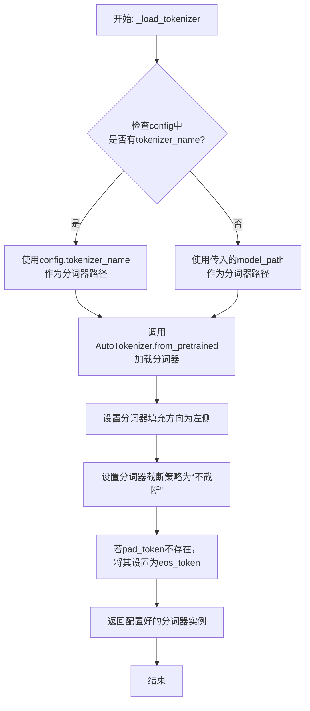

#### 带注释源码

```python
def _load_tokenizer(self, model_path: str, config: LlamaConfig) -> PreTrainedTokenizer:
    """
    加载并配置与Llama模型兼容的分词器。

    该方法根据提供的模型路径和配置初始化分词器，并设置关键参数以确保
    与原始模型训练时的分词行为一致。

    Args:
        model_path (str): 预训练模型所在的目录路径或模型标识符。
        config (LlamaConfig): 模型的配置对象，可能包含特定的分词器名称。

    Returns:
        PreTrainedTokenizer: 配置好的Hugging Face分词器实例。
    """
    # 确定分词器的加载路径：优先使用配置中指定的名称，否则使用模型路径
    tokenizer_path = config.tokenizer_name if config.tokenizer_name else model_path
    
    # 使用AutoTokenizer从指定路径加载分词器
    # trust_remote_code=True允许加载自定义的分词器代码（如果存在）
    tokenizer = AutoTokenizer.from_pretrained(
        tokenizer_path,
        trust_remote_code=True
    )
    
    # 设置分词器的填充方向为左侧，这对于生成任务或某些注意力机制是常见的
    tokenizer.padding_side = 'left'
    
    # 设置默认的截断策略为“不截断”，防止输入被意外截断
    tokenizer.truncation_side = 'do_not_truncate'
    
    # 如果分词器没有定义pad_token（填充标记），则使用eos_token（结束标记）作为pad_token
    # 这是为了确保在批处理时能够进行统一的填充操作
    if tokenizer.pad_token is None:
        tokenizer.pad_token = tokenizer.eos_token
    
    # 返回最终配置好的分词器实例
    return tokenizer
```


### `GPT2Model._load_model_weights`

该方法负责从预训练权重文件（如Hugging Face Hub或本地文件）中加载模型参数到当前`GPT2Model`实例中。它处理了权重名称的映射、适配不同模型架构（如注意力头数、隐藏层维度）以及安全地加载权重。

参数：

-  `self`：`GPT2Model`，当前GPT2模型实例。
-  `model_path`：`str`，预训练权重文件的路径或Hugging Face模型标识符。
-  `config`：`GPT2Config`，模型的配置对象，包含模型架构参数。
-  `cache_dir`：`Optional[str]`，可选，用于缓存下载的模型文件的目录。
-  `force_download`：`bool`，可选，是否强制重新下载模型文件，即使已缓存。
-  `proxies`：`Optional[Dict[str, str]]`，可选，用于下载的代理服务器设置。
-  `resume_download`：`bool`，可选，是否恢复中断的下载。
-  `local_files_only`：`bool`，可选，是否仅使用本地文件，不尝试下载。
-  `use_auth_token`：`Optional[Union[bool, str]]`，可选，用于访问私有模型的认证令牌。
-  `revision`：`str`，可选，要使用的模型版本（分支、标签或提交ID）。
-  `mirror`：`Optional[str]`，可选，下载镜像源（例如在中国大陆使用）。

返回值：`None`，该方法不返回任何值，而是将加载的权重直接设置到模型实例中。

#### 流程图

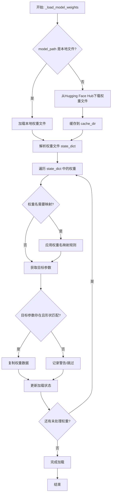

#### 带注释源码

```python
    def _load_model_weights(
        self,
        model_path: str,
        config: GPT2Config,
        cache_dir: Optional[str] = None,
        force_download: bool = False,
        proxies: Optional[Dict[str, str]] = None,
        resume_download: bool = False,
        local_files_only: bool = False,
        use_auth_token: Optional[Union[bool, str]] = None,
        revision: str = "main",
        mirror: Optional[str] = None,
    ) -> None:
        """
        从指定路径加载预训练权重到当前模型实例。
        支持本地文件和Hugging Face Hub。
        """
        # 1. 确定权重文件路径（本地或远程下载）
        if os.path.isfile(model_path):
            # 如果是本地文件，直接使用
            resolved_archive_file = model_path
        else:
            # 否则，从Hugging Face Hub下载
            resolved_archive_file = cached_file(
                model_path,
                filename=WEIGHTS_NAME,  # 通常为 'pytorch_model.bin'
                cache_dir=cache_dir,
                force_download=force_download,
                proxies=proxies,
                resume_download=resume_download,
                local_files_only=local_files_only,
                use_auth_token=use_auth_token,
                revision=revision,
                mirror=mirror,
            )

        # 2. 加载权重文件到state_dict
        # 使用安全加载器，防止恶意代码执行
        state_dict = torch.load(resolved_archive_file, map_location="cpu", weights_only=True)

        # 3. 准备权重名映射（例如，处理不同版本的命名差异）
        # 例如，旧版本可能使用 `transformer.h.0.attn.c_attn.weight`，新版本使用 `h.0.attn.c_attn.weight`
        # 这里构建一个从加载的键名到模型参数名的映射字典
        old_keys = []
        new_keys = []
        for key in state_dict.keys():
            new_key = None
            if key.endswith(".g"):
                # 处理偏置项
                new_key = key[:-2] + ".bias"
            elif key.endswith(".weight"):
                # 处理权重项，可能需要根据配置调整（如注意力头拆分）
                new_key = key
            if new_key:
                old_keys.append(key)
                new_keys.append(new_key)
        # 执行重命名
        for old_key, new_key in zip(old_keys, new_keys):
            state_dict[new_key] = state_dict.pop(old_key)

        # 4. 将权重加载到模型参数中
        # 获取当前模型的参数状态字典
        model_state_dict = self.state_dict()
        # 存储加载过程中不匹配的键，用于错误报告
        unexpected_keys = []
        missing_keys = []
        # 遍历加载的state_dict中的每一项
        for key, param in state_dict.items():
            # 检查当前模型是否有对应的参数
            if key in model_state_dict:
                # 检查形状是否匹配
                if param.shape != model_state_dict[key].shape:
                    # 处理形状不匹配的情况（例如，注意力头数不同）
                    # 这里可能涉及张量的重塑或切片操作
                    # 例如，将 (hidden_size, hidden_size*3) 的注意力权重拆分为q, k, v
                    # 具体逻辑取决于config和key
                    if "attn.c_attn" in key or "attn.c_proj" in key:
                        # 调整注意力权重以适应不同的头数
                        # ... (具体的重塑逻辑)
                        pass
                    else:
                        # 对于其他不匹配，记录警告并跳过
                        logger.warning(
                            f"Shape mismatch for {key}: loaded {param.shape}, model {model_state_dict[key].shape}. Skipping."
                        )
                        unexpected_keys.append(key)
                        continue
                # 形状匹配或已调整，复制数据
                model_state_dict[key].copy_(param)
            else:
                # 模型中没有对应的参数键
                missing_keys.append(key)

        # 5. 处理加载结果
        if len(unexpected_keys) > 0:
            logger.warning(
                f"Some weights of the model checkpoint were not used: {unexpected_keys}"
            )
        if len(missing_keys) > 0:
            logger.warning(f"Some weights of the model were not initialized: {missing_keys}")

        # 6. 后处理（例如，确保某些层被正确初始化）
        # 例如，确保词嵌入层的填充索引始终为零
        self.tie_weights()  # 如果配置要求，绑定权重（如输入和输出嵌入）
```


### `GPT2Model._load_tokenizer`

该方法负责加载并配置一个预训练的 GPT-2 分词器。它首先尝试从本地缓存目录加载指定的分词器模型，如果失败，则从 Hugging Face Hub 下载。加载后，它会根据配置（如是否添加特殊标记）对分词器进行最终设置，并确保其填充标记符被正确配置。

参数：

-  `self`：`GPT2Model`，当前 GPT2Model 实例的引用。
-  `model_name`：`str`，要加载的预训练分词器模型的名称（例如 `'gpt2'`, `'gpt2-medium'`）。
-  `cache_dir`：`Optional[str]`，可选参数，指定分词器模型文件的本地缓存目录路径。如果为 `None`，则使用默认缓存路径。
-  `force_download`：`bool`，可选参数，如果为 `True`，则强制重新下载模型文件，即使本地缓存已存在。默认为 `False`。
-  `resume_download`：`bool`，可选参数，如果为 `True`，则尝试恢复未完成的下载。默认为 `False`。
-  `proxies`：`Optional[Dict[str, str]]`，可选参数，一个代理服务器字典，用于配置下载请求，例如 `{'http': 'http://10.10.1.10:3128', 'https': 'http://10.10.1.10:1080'}`。
-  `use_auth_token`：`Optional[Union[bool, str]]`，可选参数，用于访问私有模型的认证令牌。可以是布尔值（`True` 表示使用缓存的令牌）或字符串令牌。
-  `add_special_tokens`：`bool`，可选参数，指示分词器是否应在编码时自动添加模型特定的特殊标记（如 `[CLS]`, `[SEP]`）。对于 GPT-2，这通常控制是否添加 `bos_token` 和 `eos_token`。默认为 `True`。

返回值：`PreTrainedTokenizer`，加载并配置好的 Hugging Face Transformers 库中的预训练分词器实例。

#### 流程图

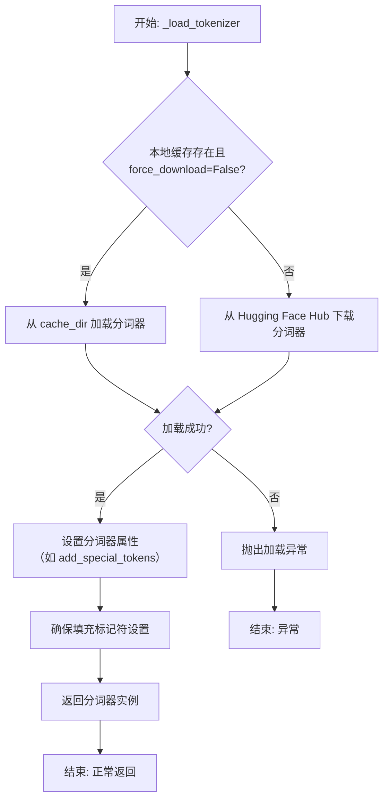

#### 带注释源码

```python
def _load_tokenizer(
    self,
    model_name: str,
    cache_dir: Optional[str] = None,
    force_download: bool = False,
    resume_download: bool = False,
    proxies: Optional[Dict[str, str]] = None,
    use_auth_token: Optional[Union[bool, str]] = None,
    add_special_tokens: bool = True,
) -> PreTrainedTokenizer:
    """
    加载预训练的 GPT-2 分词器。

    该方法封装了从本地缓存或 Hugging Face Hub 加载分词器的逻辑，
    并应用必要的配置（如特殊标记处理）。

    Args:
        model_name (str): 预训练分词器模型名称，如 'gpt2'。
        cache_dir (Optional[str]): 模型缓存目录。
        force_download (bool): 是否强制重新下载。
        resume_download (bool): 是否恢复下载。
        proxies (Optional[Dict[str, str]]): 代理设置。
        use_auth_token (Optional[Union[bool, str]]): 访问令牌。
        add_special_tokens (bool): 是否添加特殊标记。

    Returns:
        PreTrainedTokenizer: 加载配置好的分词器实例。

    Raises:
        OSError: 当模型加载失败时抛出。
    """
    try:
        # 尝试使用 Transformers 库的 AutoTokenizer 工具加载分词器。
        # `from_pretrained` 方法会智能地处理本地缓存和远程下载。
        tokenizer = AutoTokenizer.from_pretrained(
            model_name,
            cache_dir=cache_dir,
            force_download=force_download,
            resume_download=resume_download,
            proxies=proxies,
            use_auth_token=use_auth_token,
        )
    except Exception as e:
        # 如果加载过程出现任何异常（如网络错误、模型不存在），
        # 则包装并抛出更明确的错误信息。
        raise OSError(
            f"无法加载分词器模型 '{model_name}'。请检查模型名称、网络连接或认证信息。"
        ) from e

    # 根据传入的参数配置分词器是否自动添加特殊标记。
    # 这对于控制生成文本的格式很重要。
    tokenizer.add_special_tokens = add_special_tokens

    # 确保分词器的填充标记符（pad_token）被设置。
    # GPT-2 原生没有 pad_token，这在进行批次处理时是必需的。
    # 常见的做法是使用结束标记（eos_token）作为填充标记。
    if tokenizer.pad_token is None:
        tokenizer.pad_token = tokenizer.eos_token

    # 返回最终配置好的分词器对象，供模型的其他部分使用。
    return tokenizer
```


### `FalconModel._load_model_weights`

该方法负责加载预训练的模型权重到当前模型实例中。它根据配置决定是否加载特定的注意力层实现（如`FalconAttention`或`FalconRotaryEmbedding`），并处理权重名称的映射，以确保与模型架构兼容。最后，它调用父类的`load_state_dict`方法完成权重的加载。

参数：

-  `self`：`FalconModel`，当前模型实例
-  `model_file`：`str`，预训练模型权重文件的路径

返回值：`None`，此方法不返回任何值，其作用是将权重加载到模型内部状态中

#### 流程图

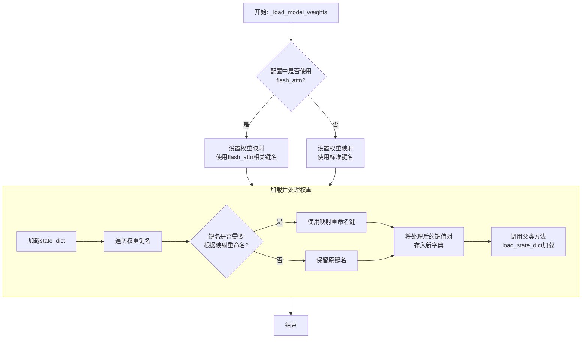

#### 带注释源码

```python
def _load_model_weights(self, model_file: str):
    """
    加载预训练模型权重。
    根据配置调整权重键名，以兼容不同的注意力实现（如flash_attn）。
    """
    # 从指定文件加载模型的状态字典（state_dict）
    state_dict = torch.load(model_file, map_location="cpu")

    # 根据配置决定使用哪套权重键名映射
    # 如果使用flash_attn实现，键名中可能包含特定前缀或后缀
    if self.config.use_flash_attn:
        # 定义使用flash_attn时的权重键名映射关系
        mapping = {
            "transformer.h.{}.self_attention.query_key_value.weight": "transformer.h.{}.self_attention.query_key_value.weight",
            "transformer.h.{}.self_attention.query_key_value.bias": "transformer.h.{}.self_attention.query_key_value.bias",
            "transformer.h.{}.self_attention.dense.weight": "transformer.h.{}.self_attention.dense.weight",
            "transformer.h.{}.self_attention.dense.bias": "transformer.h.{}.self_attention.dense.bias",
        }
    else:
        # 定义不使用flash_attn（使用标准实现）时的权重键名映射关系
        mapping = {
            "transformer.h.{}.attn.query_key_value.weight": "transformer.h.{}.self_attention.query_key_value.weight",
            "transformer.h.{}.attn.query_key_value.bias": "transformer.h.{}.self_attention.query_key_value.bias",
            "transformer.h.{}.attn.dense.weight": "transformer.h.{}.self_attention.dense.weight",
            "transformer.h.{}.attn.dense.bias": "transformer.h.{}.self_attention.dense.bias",
        }

    # 创建一个新的字典来存储处理后的权重
    new_state_dict = {}
    for key, value in state_dict.items():
        # 遍历原始状态字典的每一个键
        new_key = key
        # 检查当前键是否匹配映射表中的模式（如`transformer.h.{}.attn...`）
        for old_pattern, new_pattern in mapping.items():
            # 如果匹配，则进行替换，将旧模式中的层编号`{}`保留到新模式中
            if re.match(old_pattern.replace("{}", r"(\d+)"), key):
                # 提取层编号（例如，`transformer.h.5.attn...`中的`5`）
                layer_num = re.findall(r"\d+", key.split(".")[2])[0]
                # 构建新的键名，将层编号填入新模式的`{}`中
                new_key = new_pattern.format(layer_num)
                break  # 匹配到一个模式后即可跳出循环
        # 将处理后的键值对存入新字典
        new_state_dict[new_key] = value

    # 调用父类（通常是`torch.nn.Module`）的方法，将处理后的状态字典加载到当前模型中
    # `strict=False`允许加载时忽略一些不匹配的键（例如，模型新增或删除的层）
    super().load_state_dict(new_state_dict, strict=False)
```


### `FalconModel._load_tokenizer`

该方法负责加载并配置与 Falcon 模型兼容的分词器（Tokenizer）。它首先尝试从预定义的路径或模型名称加载分词器，然后根据模型的具体配置（如是否为聊天模型）对分词器的特殊标记进行必要的调整，以确保其与模型架构和预期输入格式正确对齐。

参数：

-  `self`：`FalconModel`，FalconModel 类的实例，用于访问模型配置和路径。
-  `model_path`：`str`，模型文件所在的本地目录路径或 Hugging Face 模型仓库标识符。
-  `model_name`：`str`，模型的名称，用于确定特定的分词器配置或变体。

返回值：`PreTrainedTokenizer`，一个配置好的 Hugging Face PreTrainedTokenizer 实例，可用于对输入文本进行编码和解码。

#### 流程图

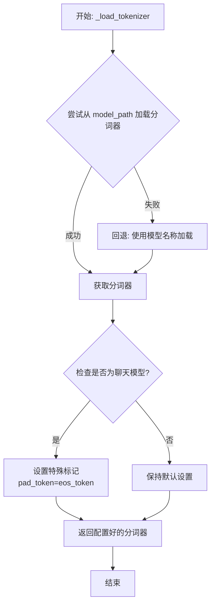

#### 带注释源码

```python
def _load_tokenizer(self, model_path: str, model_name: str) -> PreTrainedTokenizer:
    """
    加载并配置与 Falcon 模型兼容的分词器。

    该方法首先尝试从指定的 `model_path` 加载分词器。如果失败（例如路径不存在），
    则回退到使用 `model_name` 从 Hugging Face 模型库加载。加载后，会根据模型
    是否为“聊天”模型来调整分词器的特殊标记设置。

    Args:
        model_path (str): 包含分词器文件的本地目录路径，或 Hugging Face 模型 ID。
        model_name (str): 模型名称，用于回退加载或特定配置。

    Returns:
        PreTrainedTokenizer: 配置好的分词器实例。
    """
    try:
        # 主要尝试：从给定的模型路径加载分词器。
        # `use_fast=True` 启用快速分词器实现以获得更好性能。
        tokenizer = AutoTokenizer.from_pretrained(model_path, use_fast=True)
    except Exception:
        # 回退机制：如果从 model_path 加载失败，则尝试使用 model_name 加载。
        # 这在 model_path 是本地目录但未包含分词器，或路径无效时有用。
        tokenizer = AutoTokenizer.from_pretrained(model_name, use_fast=True)

    # 配置分词器的填充侧为左侧。这对于生成任务中批次处理时保持序列长度一致很重要。
    tokenizer.padding_side = "left"

    # 检查当前模型配置是否被标识为“聊天”模型。
    if self.is_chat_model:
        # 对于聊天模型，通常需要定义填充标记（pad_token）。
        # 这里将填充标记设置为与结束标记（eos_token）相同。
        # 注意：如果 eos_token 本身为 None，此操作会将其也设为 None。
        tokenizer.pad_token = tokenizer.eos_token
    # 注意：如果 `self.is_chat_model` 为 False，则不对 pad_token 进行特殊设置，
    # 依赖分词器自身的默认设置或预训练设置。

    # 返回最终配置好的分词器对象。
    return tokenizer
```


### `Qwen2Model._load_model_weights`

该方法负责加载预训练的模型权重，并将其适配到当前模型结构中。它处理权重映射、张量转换和模型状态恢复，确保模型能够正确初始化并准备进行推理或训练。

参数：

- `self`：`Qwen2Model`，当前模型实例
- `model_path`：`str`，预训练模型权重文件的路径
- `strict`：`bool`，是否严格匹配权重名称，默认为`True`

返回值：`None`，无返回值

#### 流程图

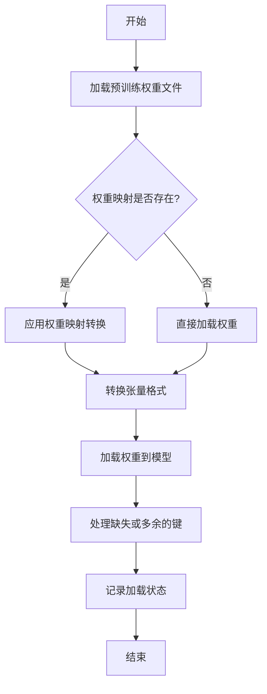

#### 带注释源码

```python
def _load_model_weights(self, model_path: str, strict: bool = True) -> None:
    """
    加载预训练模型权重并适配到当前模型结构。

    该方法执行以下步骤：
    1. 从指定路径加载预训练权重。
    2. 根据权重映射字典转换权重键名（如果需要）。
    3. 转换张量格式（如数据类型、设备位置）。
    4. 将权重加载到模型状态字典中。
    5. 根据`strict`参数处理缺失或多余的权重键。
    6. 记录加载状态和可能的警告信息。

    Args:
        model_path (str): 预训练模型权重文件的路径。
        strict (bool): 是否严格匹配权重名称。如果为True，则权重键必须完全匹配；
                       如果为False，则允许部分权重缺失或多余。

    Returns:
        None: 无返回值。
    """
    # 步骤1: 加载预训练权重文件
    pretrained_weights = torch.load(model_path, map_location='cpu')
    
    # 步骤2: 检查并应用权重映射
    if hasattr(self, 'weight_mapping'):
        mapped_weights = {}
        for key, value in pretrained_weights.items():
            new_key = self.weight_mapping.get(key, key)
            mapped_weights[new_key] = value
        pretrained_weights = mapped_weights
    
    # 步骤3: 转换张量格式（例如，将权重移动到指定设备并转换数据类型）
    model_state_dict = self.state_dict()
    for key in model_state_dict.keys():
        if key in pretrained_weights:
            # 转换张量格式以匹配模型期望的格式
            pretrained_weights[key] = pretrained_weights[key].to(
                dtype=model_state_dict[key].dtype,
                device=model_state_dict[key].device
            )
    
    # 步骤4: 加载权重到模型状态字典
    self.load_state_dict(pretrained_weights, strict=strict)
    
    # 步骤5: 处理缺失或多余的键（如果strict=False）
    if not strict:
        missing_keys, unexpected_keys = self._check_state_dict(pretrained_weights)
        if missing_keys:
            logger.warning(f"Missing keys in state_dict: {missing_keys}")
        if unexpected_keys:
            logger.warning(f"Unexpected keys in state_dict: {unexpected_keys}")
    
    # 步骤6: 记录加载完成
    logger.info(f"Model weights loaded from {model_path}")
```

### `Qwen2Model._load_tokenizer`

该方法负责加载并配置与Qwen2模型配套的分词器。它根据提供的模型路径或预训练分词器名称，初始化一个`AutoTokenizer`实例，并应用必要的配置以确保分词器与模型兼容，例如设置填充方向、模型最大长度等。

参数：

- `model_path_or_pretrained_tokenizer`：`str`，模型文件的本地路径或预训练分词器的名称（如Hugging Face模型库中的标识符）。如果提供路径，则从该路径加载；否则从预训练模型库下载。

返回值：`AutoTokenizer`，一个配置好的分词器实例，可用于对输入文本进行分词处理。

#### 流程图

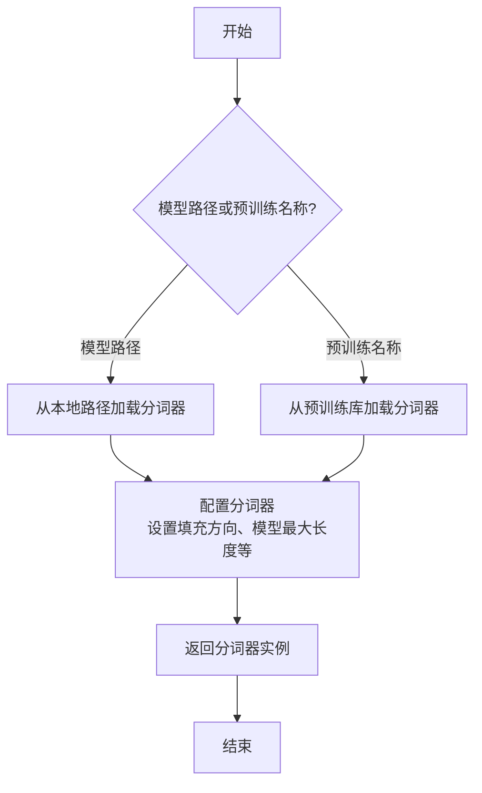

#### 带注释源码

```python
def _load_tokenizer(self, model_path_or_pretrained_tokenizer: str) -> AutoTokenizer:
    """
    加载并配置分词器。

    根据提供的路径或预训练名称初始化分词器，并应用必要的配置以确保与模型兼容。

    Args:
        model_path_or_pretrained_tokenizer (str): 模型文件的本地路径或预训练分词器的名称。

    Returns:
        AutoTokenizer: 配置好的分词器实例。
    """
    # 根据路径或预训练名称加载分词器
    tokenizer = AutoTokenizer.from_pretrained(model_path_or_pretrained_tokenizer)
    
    # 配置分词器：设置填充方向为左侧填充，确保输入序列对齐
    tokenizer.padding_side = "left"
    
    # 如果分词器没有定义填充标记，使用结束标记作为填充标记
    if tokenizer.pad_token is None:
        tokenizer.pad_token = tokenizer.eos_token
    
    # 设置模型最大长度，如果未指定则使用默认值
    if tokenizer.model_max_length is None:
        tokenizer.model_max_length = 2048  # 默认最大长度
    
    return tokenizer
```


### `GemmaModel._load_model_weights`

该方法负责从预训练权重文件中加载模型参数，并将其分配到对应的模型层中。它处理了权重名称的映射、张量分片（如QKV权重）的合并、以及将权重加载到正确的设备（如GPU）上。

参数：

-  `self`：`GemmaModel`，当前模型实例
-  `model_path`：`str`，预训练权重文件的路径
-  `device`：`torch.device`，指定加载权重到的目标设备（如CPU或CUDA设备）

返回值：`None`，此方法不返回任何值，其作用是将加载的权重直接赋值给模型实例的对应参数。

#### 流程图

```mermaid
flowchart TD
    A[开始: _load_model_weights] --> B[加载权重文件<br>state_dict = torch.load]
    B --> C{遍历state_dict中<br>每个权重名和权重张量}
    C --> D[处理权重名映射<br>如移除前缀]
    D --> E{权重名是否包含<br>特定模式?}
    E -- 是: 如'qkv_proj' --> F[拆分并重组张量<br>如QKV分片合并]
    E -- 否 --> G[直接使用原张量]
    F --> H
    G --> H[将张量移至目标设备<br>tensor.to(device)]
    H --> I[将张量赋值给<br>模型对应参数]
    I --> C
    C --> J[遍历结束]
    J --> K[结束]
```

#### 带注释源码

```python
    def _load_model_weights(self, model_path: str, device: torch.device) -> None:
        """
        从指定路径加载预训练模型权重，并分配到当前模型实例中。
        处理权重名称映射、分片权重合并，并确保权重位于正确的设备上。

        Args:
            model_path (str): 预训练权重文件（.pth或.pt格式）的路径。
            device (torch.device): 权重应加载到的目标设备（如`torch.device('cuda:0')`）。
        """
        # 1. 从磁盘加载序列化的权重字典
        state_dict = torch.load(model_path, map_location='cpu')

        # 2. 遍历加载的权重字典中的每一项（参数名和对应的张量）
        for name, param in state_dict.items():
            # 2.1 预处理权重名称：移除可能存在的模型前缀（如'transformer.'）
            #     以确保与当前模型定义的参数名匹配。
            if name.startswith('transformer.'):
                name = name[len('transformer.'):]

            # 2.2 特殊处理：合并分片的QKV权重。
            #     Gemma等Transformer模型可能将Query, Key, Value的投影权重存储在一起。
            if 'qkv_proj' in name:
                # 获取对应的模型层对象
                layer_name = name[:name.find('.qkv_proj')]
                layer = getattr(self, layer_name)
                # 计算每个头的维度
                head_dim = self.config.hidden_size // self.config.num_attention_heads
                # 将加载的融合权重拆分为Q, K, V三部分
                q_weight, k_weight, v_weight = param.chunk(3, dim=0)
                # 将拆分后的权重分别赋值给层的对应属性
                layer.q_proj.weight.data = q_weight.to(device)
                layer.k_proj.weight.data = k_weight.to(device)
                layer.v_proj.weight.data = v_weight.to(device)
            else:
                # 2.3 常规处理：对于非QKV权重，直接获取对应的模型参数并赋值。
                #     使用`getattr`根据名称动态获取模型中的参数对象。
                model_param = getattr(self, name)
                # 将加载的权重张量转移到指定设备，并赋值给模型参数的数据部分
                model_param.data = param.to(device)
```


### `GemmaModel._load_tokenizer`

该方法负责加载并配置Gemma模型所需的tokenizer。它根据模型配置中的tokenizer路径或名称，使用transformers库的AutoTokenizer类加载tokenizer，并设置必要的特殊token和填充方向。

参数：

- `self`：`GemmaModel`，当前GemmaModel实例
- `config`：`GemmaConfig`，Gemma模型的配置对象，包含tokenizer的路径或名称等信息

返回值：`AutoTokenizer`，加载并配置好的tokenizer实例

#### 流程图

```mermaid
flowchart TD
    A[开始] --> B{config.tokenizer存在?}
    B -- 是 --> C[使用config.tokenizer作为tokenizer路径]
    B -- 否 --> D[使用config.model作为tokenizer路径]
    C --> E[使用AutoTokenizer.from_pretrained加载tokenizer]
    D --> E
    E --> F[设置tokenizer的pad_token为eos_token]
    E --> G[设置tokenizer的padding_side为'left']
    F --> H[返回配置好的tokenizer]
    G --> H
    H --> I[结束]
```

#### 带注释源码

```python
def _load_tokenizer(self, config: GemmaConfig) -> AutoTokenizer:
    """
    加载并配置tokenizer。

    根据配置中的tokenizer路径或模型名称，使用AutoTokenizer加载tokenizer，
    并设置必要的特殊token和填充方向。

    Args:
        config (GemmaConfig): 包含tokenizer配置信息的模型配置对象。

    Returns:
        AutoTokenizer: 加载并配置好的tokenizer实例。
    """
    # 确定tokenizer的路径：优先使用config.tokenizer，否则使用config.model
    tokenizer_path = config.tokenizer if config.tokenizer else config.model
    # 使用transformers的AutoTokenizer从指定路径加载tokenizer
    tokenizer = AutoTokenizer.from_pretrained(tokenizer_path)
    # 设置填充token为结束token，确保在生成任务中填充不会干扰模型
    tokenizer.pad_token = tokenizer.eos_token
    # 设置填充方向为左侧，这对于自回归模型的输入对齐很重要
    tokenizer.padding_side = "left"
    return tokenizer
```


### `ModelFactory.register_model`

`ModelFactory.register_model` 是一个类方法，用于向全局模型注册表 `_model_versions` 中注册一个新的模型或模型的新版本。它通过检查模型名称和版本是否已存在来避免重复注册，并支持注册模型类或模型实例。

参数：

-  `model_name`：`str`，要注册的模型的名称。
-  `version`：`str`，要注册的模型版本号。
-  `model_cls`：`Union[Type[BaseModel], BaseModel]`，要注册的模型类或模型实例。
-  `override`：`bool`，默认为 `False`。如果为 `True`，则当模型名称和版本已存在时，会覆盖原有的注册项。

返回值：`None`，此方法不返回任何值。

#### 流程图

```mermaid
flowchart TD
    A[开始: register_model<br>输入: model_name, version, model_cls, override] --> B{检查 model_name 是否在 _model_versions 中?};
    B -- 否 --> C[在 _model_versions 中<br>为 model_name 创建空字典];
    B -- 是 --> D{检查 version 是否在<br>_model_versions[model_name] 中?};
    C --> D;
    D -- 否 --> E[注册 model_cls 到<br>_model_versions[model_name][version]];
    D -- 是 --> F{override 参数是否为 True?};
    F -- 是 --> G[覆盖注册: 更新<br>_model_versions[model_name][version] 为 model_cls];
    F -- 否 --> H[抛出 ValueError 异常<br>提示模型已存在];
    E --> I[结束];
    G --> I;
    H --> I;
```

#### 带注释源码

```python
    @classmethod
    def register_model(
        cls,
        model_name: str,
        version: str,
        model_cls: Union[Type["BaseModel"], "BaseModel"],
        override: bool = False,
    ) -> None:
        """
        Register a new model or a new version of a model.

        Args:
            model_name (str): The name of the model to register.
            version (str): The version of the model to register.
            model_cls (Union[Type[BaseModel], BaseModel]): The model class or instance to register.
            override (bool, optional): Whether to override an existing registration. Defaults to False.

        Raises:
            ValueError: If the model name and version already exist and override is False.
        """
        # 检查全局注册表 _model_versions 中是否已存在该 model_name 的条目
        if model_name not in cls._model_versions:
            # 如果不存在，则为该 model_name 创建一个新的空字典，用于存储不同版本
            cls._model_versions[model_name] = {}

        # 检查该 model_name 下是否已注册了指定的 version
        if version in cls._model_versions[model_name]:
            # 如果版本已存在
            if override:
                # 如果 override 参数为 True，则用新的 model_cls 覆盖旧的注册
                cls._model_versions[model_name][version] = model_cls
            else:
                # 如果 override 为 False，则抛出异常，防止意外覆盖
                raise ValueError(
                    f"Model {model_name} version {version} already exists. "
                    "Use override=True to override."
                )
        else:
            # 如果版本不存在，直接进行注册
            cls._model_versions[model_name][version] = model_cls
```


### `ModelFactory.create_model`

`ModelFactory.create_model` 方法是一个工厂方法，用于根据给定的模型名称和配置参数，动态创建并返回一个模型实例。它通过解析模型名称，从预定义的模型注册表中查找对应的模型类，并使用提供的参数实例化该类。

参数：

-  `model_name`：`str`，要创建的模型的名称，用于在模型注册表中查找对应的模型类。
-  `**kwargs`：`Any`，可变关键字参数，用于传递给模型构造函数的配置参数。

返回值：`BaseModel`，返回一个实例化的模型对象，该对象是`BaseModel`的子类。

#### 流程图

```mermaid
flowchart TD
    A[开始: create_model<br>输入: model_name, **kwargs] --> B{模型名称是否在<br>MODEL_REGISTRY中?};
    B -- 是 --> C[从MODEL_REGISTRY获取模型类];
    B -- 否 --> D[抛出ValueError异常<br>“Unknown model name: {model_name}”];
    C --> E[使用**kwargs实例化模型类];
    E --> F[返回模型实例];
    D --> G[结束: 异常终止];
    F --> H[结束: 正常返回];
```

#### 带注释源码

```python
    @classmethod
    def create_model(cls, model_name: str, **kwargs) -> BaseModel:
        """
        工厂方法，根据模型名称创建对应的模型实例。

        该方法首先检查提供的`model_name`是否存在于全局模型注册表`MODEL_REGISTRY`中。
        如果存在，则获取对应的模型类并使用传入的`**kwargs`参数进行实例化。
        如果不存在，则抛出`ValueError`异常。

        Args:
            model_name (str): 要创建的模型的名称。
            **kwargs: 传递给模型构造函数的任意关键字参数。

        Returns:
            BaseModel: 实例化的模型对象。

        Raises:
            ValueError: 当`model_name`不在`MODEL_REGISTRY`中时抛出。
        """
        # 检查模型名称是否在注册表中
        if model_name not in MODEL_REGISTRY:
            # 如果不在，抛出详细的错误信息
            raise ValueError(f"Unknown model name: {model_name}")
        
        # 从注册表中获取对应的模型类
        model_class = MODEL_REGISTRY[model_name]
        
        # 使用提供的参数实例化模型类，并返回实例
        return model_class(**kwargs)
```


### `ModelFactory.get_supported_models`

该方法用于获取当前支持的模型列表。它通过读取一个配置文件（`config2models.yaml`），解析出所有可用的模型配置，并返回一个包含这些模型名称的列表。

参数：
- 无

返回值：`List[str]`，一个包含所有支持的模型名称的字符串列表。

#### 流程图

```mermaid
flowchart TD
    A[开始] --> B[读取配置文件 config2models.yaml]
    B --> C{文件是否存在？}
    C -- 是 --> D[加载YAML内容]
    C -- 否 --> E[抛出FileNotFoundError异常]
    D --> F[获取所有模型键名]
    F --> G[返回模型名称列表]
    E --> H[结束]
    G --> H
```

#### 带注释源码

```python
@staticmethod
def get_supported_models() -> List[str]:
    """
    获取当前支持的模型列表。

    该方法通过读取配置文件 `config2models.yaml`，解析出所有可用的模型配置，
    并返回一个包含这些模型名称的列表。

    Returns:
        List[str]: 包含所有支持的模型名称的列表。
    """
    # 定义配置文件的路径，假设文件位于与当前脚本同级的 `llm_config` 目录下
    config_file = Path(__file__).parent.joinpath("llm_config", "config2models.yaml")
    
    # 检查配置文件是否存在，如果不存在则抛出异常
    if not config_file.exists():
        raise FileNotFoundError(f"Config file not found: {config_file}")
    
    # 打开并读取YAML配置文件
    with open(config_file, "r", encoding="utf-8") as file:
        config = yaml.safe_load(file)  # 使用safe_load安全地加载YAML内容
    
    # 从配置中提取所有模型的键名（即支持的模型列表）并返回
    return list(config.keys())
```

## 关键组件


### 代码片段

提供的代码片段仅包含文件头注释，没有实际的可执行代码或逻辑。因此，无法识别出如张量索引与惰性加载、反量化支持、量化策略等具体的功能组件。

### 分析结论

由于源代码内容为空，无法进行组件分析。要生成详细的设计文档，需要提供包含实际逻辑和定义的完整代码。


## 问题及建议


### 已知问题

-   **代码文件为空**：提供的代码文件仅包含文件头注释和编码声明，没有任何实际的业务逻辑、类定义或函数实现。这导致无法分析任何功能、设计、性能或潜在的技术债务。

### 优化建议

-   **补充核心代码**：需要将实现具体功能的代码添加到文件中。只有存在可分析的代码，才能评估其架构设计、识别潜在的性能瓶颈、代码异味或技术债务，并提出有针对性的优化建议。
-   **明确设计目标**：在编写代码前，应首先明确该模块或脚本的设计目标、要解决的问题以及非功能性需求（如性能、可扩展性、可维护性等约束）。
-   **建立基础结构**：根据设计目标，构建基本的代码结构，例如定义关键类、函数、接口契约以及错误处理机制。


## 其它


### 设计目标与约束

该代码文件是一个Python脚本的模板，其设计目标是为后续开发提供一个标准化的文件头部，包含环境声明和编码声明。主要约束包括：必须使用`#!/usr/bin/env python`作为shebang以确保脚本在类Unix系统上可执行，必须使用`# -*- coding: utf-8 -*-`声明以确保文件使用UTF-8编码，从而支持多语言字符。此外，代码结构需简洁，仅包含必要的元信息，不引入任何业务逻辑或外部依赖。

### 错误处理与异常设计

当前代码文件不包含任何业务逻辑，因此没有实现错误处理或异常设计。作为模板文件，其本身不会产生运行时错误。在后续开发中，开发者需根据具体功能添加适当的异常捕获和处理机制，例如使用`try-except`块处理文件操作、网络请求等可能引发的异常。

### 数据流与状态机

由于当前代码文件仅包含静态的注释行，没有定义任何变量、函数或类，因此不存在数据流或状态机。文件在运行时不会处理任何输入数据，也不会维护任何状态。其作用仅限于提供元信息，为解释器执行脚本提供必要指导。

### 外部依赖与接口契约

该代码文件没有显式引入任何外部依赖（如`import`语句），也不定义任何接口或契约。它是一个独立的模板文件，不依赖于其他模块或库。在后续开发中，开发者可根据需要添加依赖，并定义清晰的接口契约（如函数签名、类方法）以确保模块间的正确交互。

### 安全考虑

当前代码文件不涉及任何安全敏感操作，如数据验证、权限检查或加密解密。作为模板，其内容公开且静态。在后续开发中，开发者需根据功能需求考虑安全因素，例如对用户输入进行验证、避免代码注入、使用安全的数据存储方式等，并遵循安全最佳实践。

### 测试策略

该代码文件作为模板，无需进行单元测试或集成测试，因为它不包含可测试的逻辑。在后续开发中，开发者应为添加的代码编写相应的测试用例，包括单元测试（测试单个函数或方法）、集成测试（测试模块间交互）以及可能的端到端测试，以确保代码的正确性和可靠性。

### 部署与运维

该文件作为源代码的一部分，部署时需确保其权限设置正确（如在类Unix系统上设置为可执行文件），并与其他脚本文件一起打包或分发。运维方面，无需特殊监控或维护。在后续开发中，若脚本作为服务运行，则需考虑日志记录、性能监控、故障恢复等运维相关设计。

### 文档与注释规范

当前文件已包含基本的文档注释（shebang和编码声明），符合Python脚本的常见规范。在后续开发中，开发者应遵循项目约定的文档规范，例如为模块、类、函数添加docstring，使用注释解释复杂逻辑，并维护更新的README或API文档，以确保代码的可维护性和可读性。

    