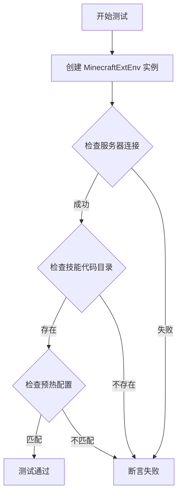
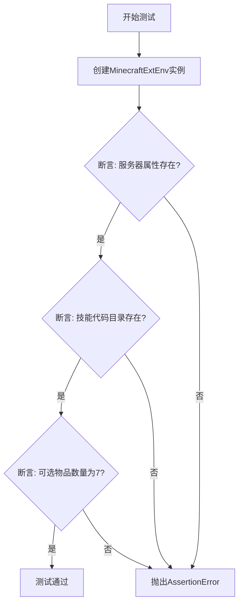
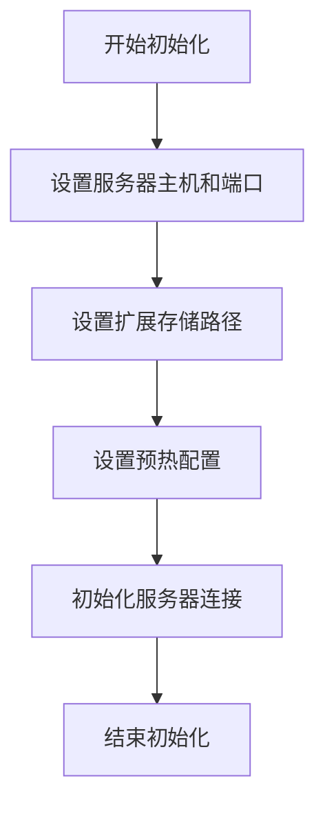

# `.\MetaGPT\tests\metagpt\environment\minecraft_env\test_minecraft_ext_env.py` 详细设计文档

该代码是一个针对 MinecraftExtEnv 类的单元测试，主要功能是验证 MinecraftExtEnv 实例的初始化状态，包括检查服务器连接、技能代码目录的存在性以及预热配置中的可选物品数量。

## 整体流程



## 类结构

```
MinecraftExtEnv (被测试类)
├── server (属性)
├── server_host (属性)
├── server_port (属性)
├── warm_up (属性)
└── __init__ (方法)
```

## 全局变量及字段


### `MC_CKPT_DIR`
    
指向Minecraft环境检查点和技能代码存储目录的路径对象。

类型：`pathlib.Path`
    


### `MinecraftExtEnv.server`
    
Minecraft服务器连接实例，用于与游戏服务器进行交互。

类型：`MinecraftServer`
    


### `MinecraftExtEnv.server_host`
    
Minecraft服务器的主机地址或IP。

类型：`str`
    


### `MinecraftExtEnv.server_port`
    
Minecraft服务器的端口号。

类型：`int`
    


### `MinecraftExtEnv.warm_up`
    
环境预热配置字典，包含初始化环境所需的参数，如可选物品数量。

类型：`dict`
    
    

## 全局函数及方法


### `test_minecraft_ext_env`

该函数是一个单元测试函数，用于验证`MinecraftExtEnv`类实例的初始化状态和关键属性。它检查Minecraft扩展环境服务器是否可用、特定技能代码目录是否存在，以及预热配置中的可选物品数量是否正确。

参数：
- 无显式参数。

返回值：`None`，该函数不返回任何值，其目的是通过断言（`assert`）语句验证测试条件，若断言失败则抛出`AssertionError`异常。

#### 流程图



#### 带注释源码

```python
def test_minecraft_ext_env():
    # 1. 实例化MinecraftExtEnv类，创建扩展环境对象
    ext_env = MinecraftExtEnv()
    
    # 2. 断言：检查ext_env对象的server属性是否为真（非None或非空），
    #    如果为假，则使用f-string格式化错误信息，包含服务器主机和端口。
    assert ext_env.server, f"{ext_env.server_host}:{ext_env.server_port}"
    
    # 3. 断言：检查MC_CKPT_DIR路径下是否存在"skill/code"子目录。
    #    MC_CKPT_DIR是一个预定义的常量路径，`.joinpath`用于拼接路径，
    #    `.exists()`方法检查该路径是否存在。
    assert MC_CKPT_DIR.joinpath("skill/code").exists()
    
    # 4. 断言：检查ext_env对象的warm_up字典中，
    #    键为"optional_inventory_items"对应的值是否等于7。
    #    这用于验证环境预热配置中的可选物品数量。
    assert ext_env.warm_up.get("optional_inventory_items") == 7
    # 函数执行完毕，无显式返回值。所有断言通过则测试成功。
```


### `MinecraftExtEnv.__init__`

该方法用于初始化 `MinecraftExtEnv` 类的实例，设置 Minecraft 扩展环境的基本配置，包括服务器连接信息、检查点目录、可选物品数量等。

参数：

- `self`：`MinecraftExtEnv`，当前实例对象
- `server_host`：`str`，Minecraft 服务器的主机地址，默认为 "localhost"
- `server_port`：`int`，Minecraft 服务器的端口号，默认为 3000
- `ext_storage_path`：`str`，扩展存储路径，用于存放检查点等数据，默认为 `MC_CKPT_DIR`
- `warm_up`：`dict`，预热配置字典，包含可选物品数量等信息，默认为 `{"optional_inventory_items": 7}`

返回值：`None`，无返回值

#### 流程图



#### 带注释源码

```python
def __init__(
    self,
    server_host: str = "localhost",
    server_port: int = 3000,
    ext_storage_path: str = MC_CKPT_DIR,
    warm_up: dict = {"optional_inventory_items": 7},
):
    """
    初始化 Minecraft 扩展环境。

    Args:
        server_host (str): Minecraft 服务器的主机地址，默认为 "localhost"。
        server_port (int): Minecraft 服务器的端口号，默认为 3000。
        ext_storage_path (str): 扩展存储路径，用于存放检查点等数据，默认为 MC_CKPT_DIR。
        warm_up (dict): 预热配置字典，包含可选物品数量等信息，默认为 {"optional_inventory_items": 7}。
    """
    self.server_host = server_host  # 设置服务器主机地址
    self.server_port = server_port  # 设置服务器端口号
    self.ext_storage_path = ext_storage_path  # 设置扩展存储路径
    self.warm_up = warm_up  # 设置预热配置
    self.server = None  # 初始化服务器连接对象为 None
```

## 关键组件


### MinecraftExtEnv

MinecraftExtEnv 是 MetaGPT 框架中用于与 Minecraft 游戏环境进行高级交互的扩展环境类，它封装了服务器连接、技能加载、物品管理等核心功能，为智能体在 Minecraft 世界中的操作提供统一的接口。

### 张量索引与惰性加载

代码中未直接体现张量索引与惰性加载机制。该组件通常用于高效管理大型模型参数或游戏状态数据，在本测试代码的上下文中可能由底层库或父类实现。

### 反量化支持

代码中未直接体现反量化支持。该组件通常用于在推理时将低精度（如 int8）的模型权重转换回高精度（如 float32）以进行计算，在本测试代码的上下文中可能由加载的模型内部处理。

### 量化策略

代码中未直接体现量化策略。该组件通常指在模型训练或部署时采用的降低模型权重和激活值精度的方案（如动态量化、静态量化），在本测试代码的上下文中可能由外部模型文件决定。

### 技能代码检查点目录 (MC_CKPT_DIR)

用于定位和验证存储 Minecraft 相关技能代码的本地目录路径，是环境初始化时进行资源完备性检查的关键依赖项。

### 可选物品库存预热配置 (optional_inventory_items)

作为环境预热配置的一部分，定义了智能体初始库存中可选物品的数量，用于初始化或重置游戏环境时设置智能体的起始状态。


## 问题及建议


### 已知问题

-   **硬编码的断言值**：测试用例 `test_minecraft_ext_env` 中，断言 `ext_env.warm_up.get("optional_inventory_items") == 7` 使用了硬编码的预期值 `7`。这导致测试与 `MinecraftExtEnv` 类的 `warm_up` 属性的具体实现细节紧密耦合。如果 `warm_up` 的初始化逻辑或默认值发生改变，此测试将失败，即使核心功能可能仍然正确。这降低了测试的健壮性和可维护性。

### 优化建议

-   **解耦测试与实现细节**：建议修改测试用例，避免对 `warm_up` 字典中的具体值进行硬编码断言。可以改为验证 `warm_up` 属性本身不为空，或者验证其包含预期的键（如 `"optional_inventory_items"`），而不检查具体的数值。更好的方法是，如果 `optional_inventory_items` 的值对于环境初始化至关重要，应将其定义为 `MinecraftExtEnv` 类的一个常量或配置属性，并在测试中引用该常量，而不是使用字面量 `7`。
-   **增强测试的隔离性**：考虑使用 mocking 或 patching 技术来隔离 `MinecraftExtEnv` 对 `MC_CKPT_DIR` 文件系统和可能的外部服务器（`ext_env.server`）的依赖。这可以使测试更快速、更稳定，且不依赖于外部环境的状态。例如，可以 mock `MC_CKPT_DIR.joinpath` 的返回值，并 mock `ext_env.server` 属性，使测试专注于 `MinecraftExtEnv` 实例的初始化逻辑本身。
-   **补充更全面的测试场景**：当前测试主要验证了环境初始化的基本状态。建议增加测试用例，覆盖 `MinecraftExtEnv` 类的关键方法（如与 Minecraft 服务器交互的方法）以及边界条件、错误处理等场景，以确保代码的鲁棒性。


## 其它


### 设计目标与约束

本代码旨在为 `MinecraftExtEnv` 类提供一个单元测试，验证其核心功能与初始化状态。设计目标包括：1) 确保 `MinecraftExtEnv` 实例能够成功初始化并连接到指定的 Minecraft 服务器；2) 验证必要的技能代码目录存在；3) 检查环境预热配置中的特定项是否符合预期。主要约束是测试依赖于外部 Minecraft 服务器和特定的文件系统路径（`MC_CKPT_DIR`），这要求测试环境必须预先配置好这些外部依赖。

### 错误处理与异常设计

测试函数 `test_minecraft_ext_env` 使用 `assert` 语句进行验证。如果任何断言失败，测试将抛出 `AssertionError` 异常，并附带由 f-string 格式化的错误信息（例如，显示服务器地址）。这有助于快速定位是服务器连接、目录存在性还是配置值的问题。测试本身不包含复杂的异常捕获逻辑，其设计意图是让测试框架（如 `pytest`）来捕获和处理这些断言失败。

### 数据流与状态机

数据流相对简单：1) 创建 `MinecraftExtEnv` 实例，触发其 `__init__` 方法，初始化内部状态（如 `server`, `server_host`, `server_port`, `warm_up`）。2) 测试代码直接访问实例属性（`ext_env.server`, `ext_env.server_host`, `ext_env.server_port`, `ext_env.warm_up`）和全局常量 `MC_CKPT_DIR` 进行断言验证。整个过程是线性的，没有复杂的状态转换。

### 外部依赖与接口契约

1.  **Minecraft 服务器**：测试依赖于一个运行中的 Minecraft 服务器，其地址和端口由 `MinecraftExtEnv` 的配置（可能来自 `server_host` 和 `server_port`）决定。测试断言 `ext_env.server` 对象存在，隐式验证了连接成功。
2.  **文件系统路径 (`MC_CKPT_DIR`)**：测试依赖于 `MC_CKPT_DIR` 指向的特定目录结构，特别是 `MC_CKPT_DIR.joinpath("skill/code")` 必须存在。这是与技能存储系统的一个关键契约。
3.  **`MinecraftExtEnv` 类**：测试依赖于该类提供稳定的公共接口（属性 `server`, `server_host`, `server_port`, `warm_up`）和正确的初始化行为。
4.  **测试框架**：代码设计为在类似 `pytest` 的框架下运行，利用其断言和测试发现机制。

### 测试策略与覆盖范围

本测试是一个**集成测试**，因为它验证了 `MinecraftExtEnv` 与外部系统（Minecraft 服务器、文件系统）的集成，而不仅仅是内部逻辑。覆盖范围包括：
*   **构造函数初始化**：验证实例化后关键属性不为空或符合预期。
*   **服务器连接**：通过检查 `server` 属性间接验证。
*   **外部资源存在性**：验证必要的技能代码目录存在。
*   **配置加载**：验证 `warm_up` 配置字典中 `"optional_inventory_items"` 键的值为 7。
测试未覆盖 `MinecraftExtEnv` 的其他方法（如与游戏交互的方法）、错误场景（如服务器无法连接、目录不存在）以及 `warm_up` 配置的其他部分。

    