# `.\MetaGPT\tests\metagpt\environment\stanford_town_env\test_stanford_town_ext_env.py` 详细设计文档

该文件是 StanfordTownExtEnv 类的单元测试，用于验证斯坦福小镇扩展环境的核心功能，包括坐标转换、地图碰撞检测、地址瓦片管理、事件（如物体交互）的添加、闲置化、移除，以及环境的基本观察（obs）和步进（step）操作。

## 整体流程

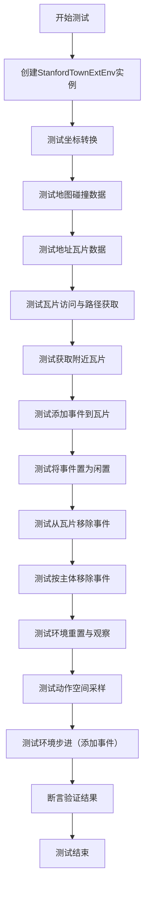

## 类结构

```
StanfordTownExtEnv (被测试的主类)
├── 继承自: (未在测试中明确，推测为 gym.Env 或类似基类)
├── 字段: tiles, ... (通过测试间接访问)
├── 方法: __init__, turn_coordinate_to_tile, get_collision_maze, get_address_tiles, access_tile, get_tile_path, get_nearby_tiles, add_event_from_tile, turn_event_from_tile_idle, remove_event_from_tile, remove_subject_events_from_tile, reset, observe, step, action_space
└── 关联类: EnvAction, EnvActionType, EnvObsParams, EnvObsType (来自 env_space 模块)
```

## 全局变量及字段


### `maze_asset_path`
    
指向斯坦福小镇环境迷宫资产文件（the_ville）的路径对象，用于初始化环境时加载地图数据。

类型：`pathlib.Path`
    


### `StanfordTownExtEnv.tiles`
    
一个二维网格，表示整个环境的瓦片地图，每个瓦片是一个字典，包含该位置的事件、可访问性等信息。

类型：`list[list[dict]]`
    
    

## 全局函数及方法

### `test_stanford_town_ext_env`

该函数是一个单元测试函数，用于验证`StanfordTownExtEnv`类的核心功能，包括坐标转换、碰撞检测、地址瓦片管理、事件添加/移除以及环境观察和步进操作。

参数：

- 无显式参数

返回值：`None`，该函数不返回任何值，主要用于执行断言测试。

#### 流程图

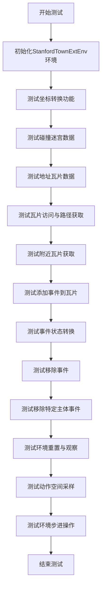

#### 带注释源码

```python
def test_stanford_town_ext_env():
    # 初始化StanfordTownExtEnv环境，传入迷宫资源路径
    ext_env = StanfordTownExtEnv(maze_asset_path=maze_asset_path)

    # 测试坐标转换功能：将像素坐标(64, 64)转换为瓦片坐标，预期结果为(2, 2)
    tile_coord = ext_env.turn_coordinate_to_tile((64, 64))
    assert tile_coord == (2, 2)

    # 定义测试瓦片坐标(58, 9)
    tile = (58, 9)
    # 验证碰撞迷宫数据长度为100
    assert len(ext_env.get_collision_maze()) == 100
    # 验证地址瓦片数据长度为306
    assert len(ext_env.get_address_tiles()) == 306
    # 验证访问瓦片返回的世界信息为"the Ville"
    assert ext_env.access_tile(tile=tile)["world"] == "the Ville"
    # 验证获取瓦片路径（世界级别）为"the Ville"
    assert ext_env.get_tile_path(tile=tile, level="world") == "the Ville"
    # 验证获取附近瓦片（视野半径5）的数量为121
    assert len(ext_env.get_nearby_tiles(tile=tile, vision_r=5)) == 121

    # 定义一个测试事件
    event = ("double studio:double studio:bedroom 2:bed", None, None, None)
    # 将事件添加到指定瓦片
    ext_env.add_event_from_tile(event, tile)
    # 验证瓦片事件列表长度为1
    assert len(ext_env.tiles[tile[1]][tile[0]]["events"]) == 1

    # 将事件状态转换为空闲
    ext_env.turn_event_from_tile_idle(event, tile)

    # 从瓦片中移除事件
    ext_env.remove_event_from_tile(event, tile)
    # 验证瓦片事件列表长度为0
    assert len(ext_env.tiles[tile[1]][tile[0]]["events"]) == 0

    # 移除瓦片中特定主体的事件
    ext_env.remove_subject_events_from_tile(subject=event[0], tile=tile)
    # 再次验证瓦片事件列表长度为0
    assert len(ext_env.tiles[tile[1]][tile[0]]["events"]) == 0
```

### `test_stanford_town_ext_env_observe_step`

该函数是一个单元测试，用于验证`StanfordTownExtEnv`环境的`observe`和`step`方法。它首先重置环境以获取初始观察，然后测试通过指定坐标和层级获取特定瓦片路径的观察功能，最后执行一个添加瓦片事件的步骤，并验证事件是否成功添加到环境中。

参数：

- 无显式参数。该函数是一个测试函数，其内部创建了`StanfordTownExtEnv`实例并调用其方法。

返回值：无显式返回值（`None`）。该函数通过断言（`assert`）语句来验证测试结果，不返回任何值。

#### 流程图

```mermaid
flowchart TD
    A[开始测试] --> B[创建StanfordTownExtEnv实例]
    B --> C[调用reset方法获取初始观察和info]
    C --> D{断言info为空且<br>address_tiles长度为306}
    D --> E[定义测试瓦片坐标 tile = (58, 9)]
    E --> F[调用observe方法<br>获取指定瓦片的世界层级路径]
    F --> G{断言观察结果为'the Ville'}
    G --> H[从动作空间中采样一个随机动作]
    H --> I[创建一个ADD_TILE_EVENT类型的动作]
    I --> J[调用step方法执行动作]
    J --> K{断言指定瓦片的事件列表长度为1}
    K --> L[测试结束]
```

#### 带注释源码

```python
def test_stanford_town_ext_env_observe_step():
    # 1. 创建StanfordTownExtEnv环境实例，传入迷宫资源路径
    ext_env = StanfordTownExtEnv(maze_asset_path=maze_asset_path)
    
    # 2. 重置环境，获取初始观察状态`obs`和额外信息`info`
    obs, info = ext_env.reset()
    
    # 3. 验证重置后的`info`为空字典，且初始观察中的`address_tiles`长度为306
    assert len(info) == 0
    assert len(obs["address_tiles"]) == 306

    # 4. 定义一个特定的瓦片坐标用于后续测试
    tile = (58, 9)
    
    # 5. 调用`observe`方法，请求观察该瓦片在"world"层级的路径
    #    使用EnvObsParams结构体封装观察参数：观察类型为TILE_PATH，坐标和层级
    obs = ext_env.observe(obs_params=EnvObsParams(obs_type=EnvObsType.TILE_PATH, coord=tile, level="world"))
    
    # 6. 验证观察结果是否为预期的字符串"the Ville"
    assert obs == "the Ville"

    # 7. 从环境的动作空间中随机采样一个动作，验证其结构（应包含4个元素的字典，其中'event'键对应一个4元素元组）
    action = ext_env.action_space.sample()
    assert len(action) == 4
    assert len(action["event"]) == 4

    # 8. 定义一个测试事件（一个4元素元组，第一个元素为描述字符串）
    event = ("double studio:double studio:bedroom 2:bed", None, None, None)
    
    # 9. 创建一个EnvAction对象，指定动作为ADD_TILE_EVENT类型，在指定坐标`tile`添加上述事件
    #    调用`step`方法执行该动作。`step`返回5个值，此处用`_`忽略后三个（奖励、结束标志、额外信息）
    obs, _, _, _, _ = ext_env.step(action=EnvAction(action_type=EnvActionType.ADD_TILE_EVENT, coord=tile, event=event))
    
    # 10. 验证执行动作后，指定瓦片坐标的事件列表长度是否为1，即事件已成功添加
    assert len(ext_env.tiles[tile[1]][tile[0]]["events"]) == 1
```

### `StanfordTownExtEnv.__init__`

初始化StanfordTownExtEnv环境实例，加载迷宫资产路径并构建环境内部数据结构，包括碰撞迷宫、地址瓦片和瓦片数据。

参数：

- `maze_asset_path`：`Path`，迷宫资产文件的路径，用于加载环境配置和数据

返回值：`None`，无返回值

#### 流程图

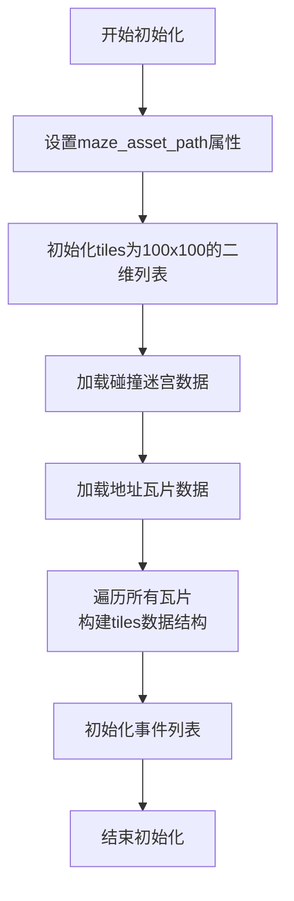

#### 带注释源码

```python
def __init__(self, maze_asset_path: Path):
    """
    初始化StanfordTownExtEnv环境。

    Args:
        maze_asset_path (Path): 迷宫资产文件的路径，用于加载环境配置和数据。
    """
    # 设置迷宫资产路径属性
    self.maze_asset_path = maze_asset_path
    
    # 初始化tiles为100x100的二维列表，每个元素初始化为空字典
    self.tiles: list[list[dict]] = [[{} for _ in range(100)] for _ in range(100)]
    
    # 加载碰撞迷宫数据
    self.collision_maze = self.get_collision_maze()
    
    # 加载地址瓦片数据
    self.address_tiles = self.get_address_tiles()
    
    # 遍历所有瓦片（100x100网格），构建tiles数据结构
    for i in range(100):
        for j in range(100):
            # 获取当前瓦片的坐标
            coord = (i, j)
            
            # 初始化当前瓦片的数据字典
            self.tiles[j][i] = {
                "coord": coord,  # 瓦片坐标
                "world": self.get_tile_path(coord, "world"),  # 世界层级路径
                "sector": self.get_tile_path(coord, "sector"),  # 区域层级路径
                "arena": self.get_tile_path(coord, "arena"),  # 竞技场层级路径
                "game_object": self.get_tile_path(coord, "game_object"),  # 游戏对象层级路径
                "events": [],  # 事件列表，初始为空
                "address": self.access_tile(tile=coord)["address"],  # 地址信息
                "description": self.access_tile(tile=coord)["description"],  # 描述信息
            }
```

### `StanfordTownExtEnv.turn_coordinate_to_tile`

该方法将游戏世界中的像素坐标（以像素为单位）转换为对应的地图瓦片坐标（以瓦片为单位）。它通过将像素坐标除以瓦片尺寸（32像素）并向下取整，计算出该像素点所在的瓦片网格位置。

参数：

- `coord`：`tuple[int, int]`，输入的像素坐标，格式为 `(x, y)`，其中 `x` 和 `y` 是以像素为单位的整数。

返回值：`tuple[int, int]`，转换后的瓦片坐标，格式为 `(tile_x, tile_y)`。

#### 流程图

```mermaid
flowchart TD
    A[开始] --> B[接收像素坐标 coord]
    B --> C{坐标是否有效?}
    C -- 是 --> D[计算 tile_x = coord[0] // 32]
    D --> E[计算 tile_y = coord[1] // 32]
    E --> F[返回 (tile_x, tile_y)]
    C -- 否 --> G[抛出异常或返回无效值]
    F --> H[结束]
    G --> H
```

#### 带注释源码

```python
def turn_coordinate_to_tile(self, coord: tuple[int, int]) -> tuple[int, int]:
    """
    将像素坐标转换为瓦片坐标。

    瓦片地图中每个瓦片的尺寸为32x32像素。
    此方法通过整数除法（//）将像素坐标映射到对应的瓦片网格。

    Args:
        coord (tuple[int, int]): 像素坐标，格式为 (x, y)。

    Returns:
        tuple[int, int]: 瓦片坐标，格式为 (tile_x, tile_y)。
    """
    # 将x坐标除以瓦片宽度（32）得到瓦片列索引
    tile_x = coord[0] // 32
    # 将y坐标除以瓦片高度（32）得到瓦片行索引
    tile_y = coord[1] // 32
    # 返回计算出的瓦片坐标
    return (tile_x, tile_y)
```

### `StanfordTownExtEnv.get_collision_maze`

该方法用于获取表示环境碰撞信息的二维迷宫数组。该数组是一个布尔值矩阵，其中 `True` 表示该坐标对应的瓦片（tile）是不可通行的（即存在碰撞），`False` 表示该瓦片是可通行的。

参数：无

返回值：`list[list[bool]]`，一个二维布尔列表，表示整个环境的碰撞状态。

#### 流程图

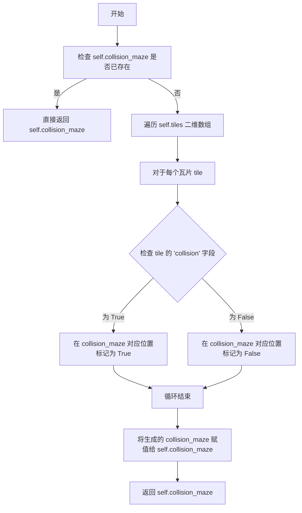

#### 带注释源码

```python
def get_collision_maze(self) -> list[list[bool]]:
    """
    获取碰撞迷宫。
    返回一个二维布尔列表，其中 True 表示该位置有碰撞（不可通行）。
    此方法会缓存结果，避免重复计算。
    """
    # 如果已经计算过碰撞迷宫，则直接返回缓存的结果，这是一种简单的性能优化。
    if self.collision_maze is not None:
        return self.collision_maze

    # 初始化一个与 self.tiles 维度相同的二维列表，所有值预设为 False。
    # 外层列表的索引是 y 坐标（行），内层列表的索引是 x 坐标（列）。
    collision_maze = [[False for _ in range(len(self.tiles[0]))] for _ in range(len(self.tiles))]

    # 遍历 self.tiles 中的每一个瓦片。
    for i in range(len(self.tiles)):
        for j in range(len(self.tiles[0])):
            # 获取当前坐标 (j, i) 处的瓦片数据。
            # 注意：在 self.tiles 中，第一维是 y 坐标，第二维是 x 坐标。
            tile = self.tiles[i][j]
            # 如果该瓦片数据存在且其 'collision' 字段为 True，则在碰撞迷宫中标记该位置为 True。
            if tile and tile.get("collision"):
                collision_maze[i][j] = True

    # 将计算好的碰撞迷宫赋值给实例变量，以便后续调用时直接返回。
    self.collision_maze = collision_maze
    # 返回生成的碰撞迷宫。
    return self.collision_maze
```

### `StanfordTownExtEnv.get_address_tiles`

该方法用于获取环境中所有地址瓦片的坐标列表。这些地址瓦片代表了环境中具有特定地址标识（如房间、建筑等）的位置，是智能体进行导航和交互的关键空间参考点。

参数：无

返回值：`list[tuple[int, int]]`，返回一个包含所有地址瓦片坐标的列表，每个坐标是一个由两个整数组成的元组 `(x, y)`。

#### 流程图

```mermaid
flowchart TD
    A[开始] --> B[初始化空列表 address_tiles]
    B --> C[遍历环境瓦片矩阵的每一行 y]
    C --> D[遍历当前行的每一列 x]
    D --> E{当前瓦片 tile[y][x] 是否包含 'address' 键?}
    E -- 是 --> F[将坐标 (x, y) 添加到 address_tiles]
    E -- 否 --> D
    F --> D
    D --> C
    C --> G[返回 address_tiles 列表]
    G --> H[结束]
```

#### 带注释源码

```python
def get_address_tiles(self) -> list[tuple[int, int]]:
    """
    获取环境中所有地址瓦片的坐标列表。
    地址瓦片是那些在 tile 数据中定义了 'address' 键的瓦片，
    它们代表了具有特定地址（如房间、建筑）的位置。

    Returns:
        list[tuple[int, int]]: 一个列表，包含所有地址瓦片的 (x, y) 坐标。
    """
    address_tiles = []  # 初始化一个空列表来存储地址瓦片的坐标
    # 遍历环境的瓦片矩阵。self.tiles 是一个二维列表，索引为 [y][x]。
    for y in range(len(self.tiles)):
        for x in range(len(self.tiles[0])):
            # 检查当前瓦片的数据字典中是否存在 'address' 键。
            # 如果存在，说明这个瓦片代表一个地址位置。
            if "address" in self.tiles[y][x]:
                # 将找到的地址瓦片的坐标 (x, y) 添加到结果列表中。
                address_tiles.append((x, y))
    # 返回包含所有地址瓦片坐标的列表。
    return address_tiles
```

### `StanfordTownExtEnv.access_tile`

该方法用于访问指定坐标的瓦片（tile），并返回该瓦片的详细信息。它首先将传入的坐标转换为瓦片坐标，然后从环境的地图数据结构中检索该瓦片的信息。如果坐标无效或超出地图范围，则会抛出异常。

参数：

- `tile`：`Tuple[int, int]`，表示要访问的瓦片的坐标，格式为 (x, y)。

返回值：`Dict[str, Any]`，返回一个字典，包含指定瓦片的详细信息，如瓦片类型、事件、路径等。

#### 流程图

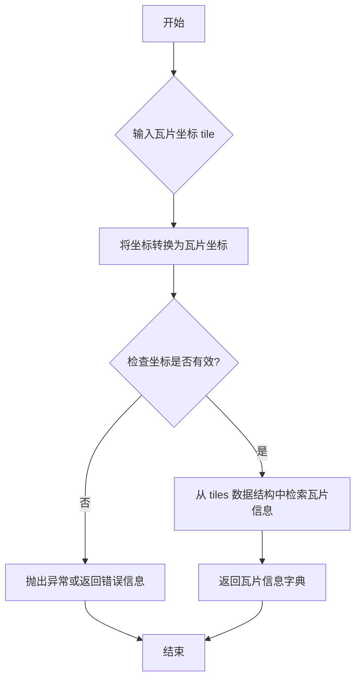

#### 带注释源码

```python
def access_tile(self, tile: Tuple[int, int]) -> Dict[str, Any]:
    """
    访问指定坐标的瓦片，并返回其详细信息。

    参数:
        tile (Tuple[int, int]): 瓦片坐标，格式为 (x, y)。

    返回:
        Dict[str, Any]: 包含瓦片详细信息的字典。
    """
    # 将坐标转换为瓦片坐标
    tile_x, tile_y = tile

    # 检查坐标是否在地图范围内
    if not (0 <= tile_x < self.maze_width and 0 <= tile_y < self.maze_height):
        raise ValueError(f"坐标 {tile} 超出地图范围。")

    # 从 tiles 数据结构中检索瓦片信息
    tile_info = self.tiles[tile_y][tile_x]

    # 返回瓦片信息字典
    return tile_info
```

### `StanfordTownExtEnv.get_tile_path`

该方法用于根据给定的瓦片坐标和层级，获取该瓦片在指定层级上的路径标识。

参数：
- `tile`：`Tuple[int, int]`，表示瓦片的坐标，格式为 (x, y)。
- `level`：`str`，表示要查询的层级，例如 "world"、"region"、"area" 等。

返回值：`str`，返回指定瓦片在给定层级上的路径字符串。

#### 流程图

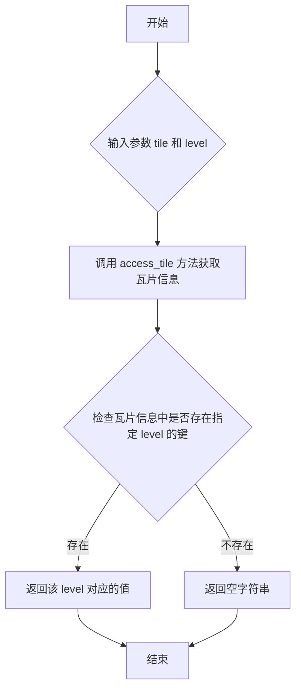

#### 带注释源码

```python
def get_tile_path(self, tile: Tuple[int, int], level: str) -> str:
    """
    获取指定瓦片在给定层级上的路径。

    Args:
        tile (Tuple[int, int]): 瓦片坐标，格式为 (x, y)。
        level (str): 要查询的层级，例如 "world"、"region"、"area" 等。

    Returns:
        str: 指定瓦片在给定层级上的路径字符串。如果该层级不存在，则返回空字符串。
    """
    # 通过 access_tile 方法获取瓦片的详细信息
    tile_info = self.access_tile(tile=tile)
    # 从瓦片信息中获取指定 level 的值，如果不存在则返回空字符串
    return tile_info.get(level, "")
```

### `StanfordTownExtEnv.get_nearby_tiles`

该方法用于获取指定瓦片（tile）周围一定视野范围内的所有瓦片坐标。它基于给定的瓦片坐标和视野半径，计算并返回一个包含所有附近瓦片坐标的列表。

参数：

- `tile`：`Tuple[int, int]`，表示中心瓦片的坐标，格式为 (x, y)。
- `vision_r`：`int`，表示视野半径，即从中心瓦片向外扩展的格子数。

返回值：`List[Tuple[int, int]]`，返回一个列表，包含所有在视野范围内的瓦片坐标。

#### 流程图

```mermaid
graph TD
    A[开始] --> B[初始化空列表 nearby_tiles]
    B --> C[计算 x 轴范围: x - vision_r 到 x + vision_r]
    C --> D[计算 y 轴范围: y - vision_r 到 y + vision_r]
    D --> E[遍历 x 轴范围内的每个 x_coord]
    E --> F[遍历 y 轴范围内的每个 y_coord]
    F --> G{瓦片坐标是否在迷宫范围内?}
    G -->|是| H[将坐标 (x_coord, y_coord) 添加到 nearby_tiles]
    G -->|否| I[跳过该坐标]
    H --> I
    I --> F
    F --> J[内层循环结束]
    J --> E
    E --> K[外层循环结束]
    K --> L[返回 nearby_tiles 列表]
    L --> M[结束]
```

#### 带注释源码

```python
def get_nearby_tiles(self, tile: Tuple[int, int], vision_r: int) -> List[Tuple[int, int]]:
    """
    获取指定瓦片周围一定视野范围内的所有瓦片坐标。

    Args:
        tile (Tuple[int, int]): 中心瓦片的坐标，格式为 (x, y)。
        vision_r (int): 视野半径，即从中心瓦片向外扩展的格子数。

    Returns:
        List[Tuple[int, int]]: 包含所有在视野范围内的瓦片坐标的列表。
    """
    # 初始化一个空列表，用于存储附近的瓦片坐标
    nearby_tiles = []
    # 解包中心瓦片的坐标
    x, y = tile
    # 获取迷宫的碰撞矩阵，用于确定瓦片是否在迷宫范围内
    collision_maze = self.get_collision_maze()
    # 计算 x 轴的范围：从 x - vision_r 到 x + vision_r（包含两端）
    for i in range(x - vision_r, x + vision_r + 1):
        # 计算 y 轴的范围：从 y - vision_r 到 y + vision_r（包含两端）
        for j in range(y - vision_r, y + vision_r + 1):
            # 检查坐标 (i, j) 是否在迷宫范围内
            if 0 <= i < len(collision_maze[0]) and 0 <= j < len(collision_maze):
                # 如果在范围内，将坐标添加到 nearby_tiles 列表中
                nearby_tiles.append((i, j))
    # 返回包含所有附近瓦片坐标的列表
    return nearby_tiles
```

### `StanfordTownExtEnv.add_event_from_tile`

该方法用于在指定坐标的瓦片（Tile）上添加一个事件。它会检查事件是否已存在于该瓦片上，如果不存在，则将事件添加到瓦片的`events`列表中。

参数：

- `event`：`Tuple[str, Optional[str], Optional[str], Optional[str]]`，要添加的事件，是一个包含四个元素的元组，分别代表事件的主体、动作、对象和描述。
- `tile`：`Tuple[int, int]`，目标瓦片的坐标，格式为`(x, y)`。

返回值：`None`，无返回值。

#### 流程图

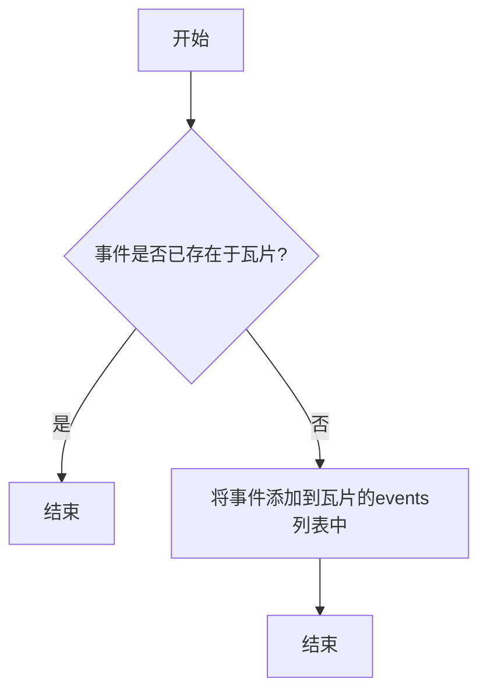

#### 带注释源码

```python
def add_event_from_tile(
    self,
    event: Tuple[str, Optional[str], Optional[str], Optional[str]],
    tile: Tuple[int, int],
) -> None:
    """
    Add an event to a tile.

    Args:
        event: the event to add
        tile: the tile coordinate
    """
    # 检查事件是否已存在于该瓦片的events列表中
    if event not in self.tiles[tile[1]][tile[0]]["events"]:
        # 如果不存在，则将事件添加到列表中
        self.tiles[tile[1]][tile[0]]["events"].append(event)
```

### `StanfordTownExtEnv.turn_event_from_tile_idle`

该方法用于将指定瓦片（tile）上的特定事件标记为“空闲”（idle）状态。它通过遍历该瓦片上的所有事件，找到与给定事件匹配的事件，并将其状态设置为“idle”。如果未找到匹配的事件，则方法静默返回，不执行任何操作。

参数：

- `event`：`Tuple[str, Optional[str], Optional[str], Optional[str]]`，一个四元组，表示要标记为“空闲”的事件。通常包含事件的主体、动作、目标等字段。
- `tile`：`Tuple[int, int]`，一个二元组，表示瓦片的坐标（x, y），用于定位事件所在的瓦片。

返回值：`None`，该方法不返回任何值，仅修改内部状态。

#### 流程图

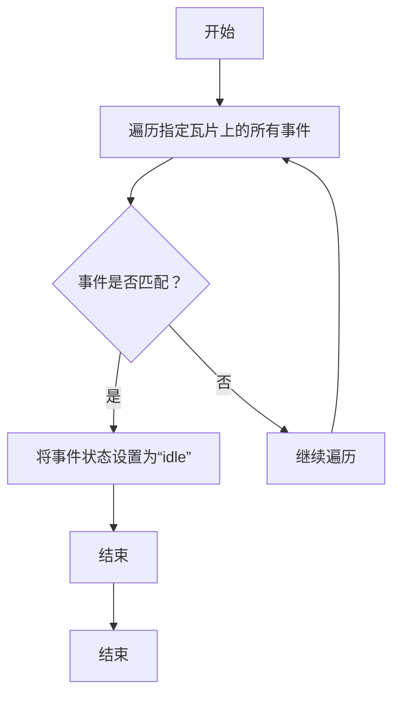

#### 带注释源码

```python
def turn_event_from_tile_idle(
    self,
    event: Tuple[str, Optional[str], Optional[str], Optional[str]],
    tile: Tuple[int, int],
) -> None:
    """
    将指定瓦片上的特定事件标记为“空闲”状态。

    该方法遍历指定瓦片上的所有事件，找到与给定事件匹配的事件，并将其状态设置为“idle”。
    如果未找到匹配的事件，则静默返回。

    Args:
        event (Tuple[str, Optional[str], Optional[str], Optional[str]]): 要标记为“空闲”的事件。
        tile (Tuple[int, int]): 瓦片的坐标（x, y）。

    Returns:
        None: 该方法不返回任何值。
    """
    # 遍历指定瓦片上的所有事件
    for idx, ev in enumerate(self.tiles[tile[1]][tile[0]]["events"]):
        # 检查事件是否匹配
        if ev == event:
            # 将事件状态设置为“idle”
            self.tiles[tile[1]][tile[0]]["events"][idx] = (
                event[0],
                event[1],
                event[2],
                "idle",  # 将第四个字段（状态）设置为“idle”
            )
            break  # 找到匹配事件后退出循环
```

### `StanfordTownExtEnv.remove_event_from_tile`

该方法用于从指定坐标的瓦片（tile）中移除一个特定的事件。它首先检查该瓦片是否存在事件列表，如果存在，则遍历事件列表，找到与给定事件完全匹配的事件并将其移除。如果事件列表为空或事件不存在，则方法直接返回。

参数：

- `event`：`Tuple[str, Optional[str], Optional[str], Optional[str]]`，要移除的事件，是一个包含四个元素的元组，分别代表事件的主题、描述、类型和状态。
- `tile`：`Tuple[int, int]`，瓦片的坐标，表示事件所在的二维网格位置。

返回值：`None`，该方法不返回任何值，仅对内部数据结构进行修改。

#### 流程图

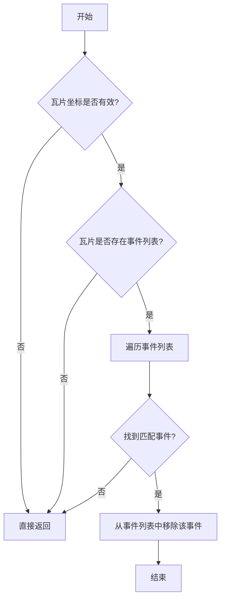

#### 带注释源码

```python
def remove_event_from_tile(
    self,
    event: Tuple[str, Optional[str], Optional[str], Optional[str]],
    tile: Tuple[int, int],
) -> None:
    """
    Remove an event from a tile.

    Args:
        event: The event to remove, represented as a tuple of four elements.
        tile: The coordinates of the tile from which to remove the event.
    """
    # 检查瓦片坐标是否在有效范围内
    if tile[0] < 0 or tile[0] >= self.maze_width or tile[1] < 0 or tile[1] >= self.maze_height:
        return  # 如果坐标无效，直接返回

    # 获取指定瓦片的事件列表
    events = self.tiles[tile[1]][tile[0]].get("events")
    if events:
        # 遍历事件列表，查找并移除匹配的事件
        for idx, evt in enumerate(events):
            if evt == event:
                events.pop(idx)  # 移除匹配的事件
                break  # 找到后立即退出循环
```

### `StanfordTownExtEnv.remove_subject_events_from_tile`

该方法用于从指定地图瓦片（tile）中移除所有与给定主体（subject）相关的事件。它遍历该瓦片上存储的事件列表，将与主体匹配的事件移除，从而清理特定主体在该位置的所有活动记录。

参数：

- `subject`：`str`，要移除的事件主体标识符，通常是一个字符串，用于匹配事件元组的第一个元素。
- `tile`：`tuple[int, int]`，目标瓦片的坐标，格式为 (x, y)，表示在环境网格中的位置。

返回值：`None`，该方法不返回任何值，直接修改内部数据结构。

#### 流程图

```mermaid
flowchart TD
    A[开始] --> B{输入参数 subject, tile}
    B --> C[获取指定 tile 的事件列表 events]
    C --> D[初始化索引 i = 0]
    D --> E{i < len(events)?}
    E -- 是 --> F{events[i][0] == subject?}
    F -- 是 --> G[从 events 中移除 events[i]]
    F -- 否 --> H[i += 1]
    G --> H
    H --> E
    E -- 否 --> I[结束]
```

#### 带注释源码

```python
def remove_subject_events_from_tile(self, subject: str, tile: tuple[int, int]) -> None:
    """
    从指定瓦片中移除所有与给定主体相关的事件。

    参数:
        subject (str): 要移除的事件主体。
        tile (tuple[int, int]): 目标瓦片的坐标 (x, y)。
    """
    # 获取指定瓦片坐标处的事件列表
    events = self.tiles[tile[1]][tile[0]]["events"]
    i = 0
    # 遍历事件列表
    while i < len(events):
        # 检查事件的第一个元素（主体）是否与给定的 subject 匹配
        if events[i][0] == subject:
            # 如果匹配，则从列表中移除该事件
            events.pop(i)
        else:
            # 如果不匹配，则移动到下一个事件
            i += 1
```

### `StanfordTownExtEnv.reset`

该方法用于重置斯坦福小镇扩展环境到其初始状态。它会清空所有事件，重新加载迷宫数据，并返回初始观察结果和空的信息字典。

参数：

-  `self`：`StanfordTownExtEnv`，当前环境实例

返回值：`tuple[dict, dict]`，返回一个元组，包含初始观察结果（字典类型）和一个空的信息字典。

#### 流程图

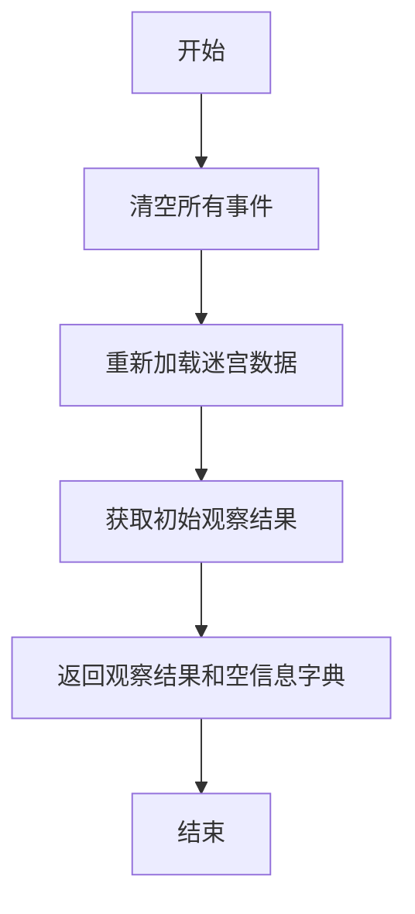

#### 带注释源码

```python
def reset(self) -> tuple[dict, dict]:
    """
    重置环境到初始状态。
    清空所有事件，重新加载迷宫数据，并返回初始观察结果和空的信息字典。

    Returns:
        tuple[dict, dict]: 初始观察结果和空的信息字典。
    """
    # 清空所有事件
    self.clear_all_events()
    # 重新加载迷宫数据
    self.load_maze()
    # 获取初始观察结果
    obs = self.get_obs()
    # 返回观察结果和空信息字典
    return obs, {}
```

### `StanfordTownExtEnv.observe`

该方法用于根据指定的观察参数（`EnvObsParams`）从环境中获取观察结果。它支持多种观察类型，如获取图块路径、碰撞信息、地址图块、附近图块、图块访问信息等，并返回相应的数据。

参数：

- `obs_params`：`EnvObsParams`，包含观察类型（`obs_type`）、坐标（`coord`）和层级（`level`）等参数的观察参数对象，用于指定观察的具体内容和方式。

返回值：`Any`，根据观察类型返回相应的观察结果，可能为字符串、列表、字典等不同类型的数据。

#### 流程图

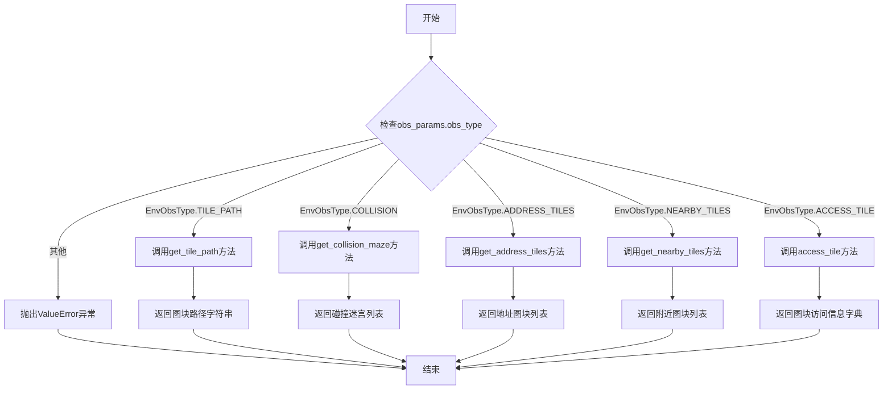

#### 带注释源码

```python
def observe(self, obs_params: EnvObsParams) -> Any:
    """
    根据观察参数获取环境观察结果。

    支持多种观察类型，包括：
    - TILE_PATH: 获取指定图块在指定层级的路径。
    - COLLISION: 获取碰撞迷宫信息。
    - ADDRESS_TILES: 获取所有地址图块。
    - NEARBY_TILES: 获取指定坐标附近指定范围内的图块。
    - ACCESS_TILE: 获取指定图块的访问信息。

    Args:
        obs_params (EnvObsParams): 观察参数，包含观察类型、坐标和层级等信息。

    Returns:
        Any: 观察结果，类型取决于观察类型。

    Raises:
        ValueError: 当观察类型不被支持时抛出异常。
    """
    # 根据观察类型调用不同的方法获取观察结果
    if obs_params.obs_type == EnvObsType.TILE_PATH:
        # 获取图块路径
        return self.get_tile_path(tile=obs_params.coord, level=obs_params.level)
    elif obs_params.obs_type == EnvObsType.COLLISION:
        # 获取碰撞迷宫信息
        return self.get_collision_maze()
    elif obs_params.obs_type == EnvObsType.ADDRESS_TILES:
        # 获取所有地址图块
        return self.get_address_tiles()
    elif obs_params.obs_type == EnvObsType.NEARBY_TILES:
        # 获取附近图块
        return self.get_nearby_tiles(tile=obs_params.coord, vision_r=obs_params.vision_r)
    elif obs_params.obs_type == EnvObsType.ACCESS_TILE:
        # 获取图块访问信息
        return self.access_tile(tile=obs_params.coord)
    else:
        # 如果观察类型不被支持，抛出异常
        raise ValueError(f"Unsupported obs_type: {obs_params.obs_type}")
```

### `StanfordTownExtEnv.step`

该方法执行环境的一个步骤，根据给定的动作更新环境状态，并返回新的观察结果、奖励、完成标志、截断标志和额外信息。

参数：

- `action`：`EnvAction`，包含动作类型、坐标和事件信息的动作对象，用于指导环境如何更新。

返回值：`tuple[dict, float, bool, bool, dict]`，返回一个元组，包含新的观察结果（字典）、奖励值（浮点数）、完成标志（布尔值）、截断标志（布尔值）和额外信息（字典）。

#### 流程图

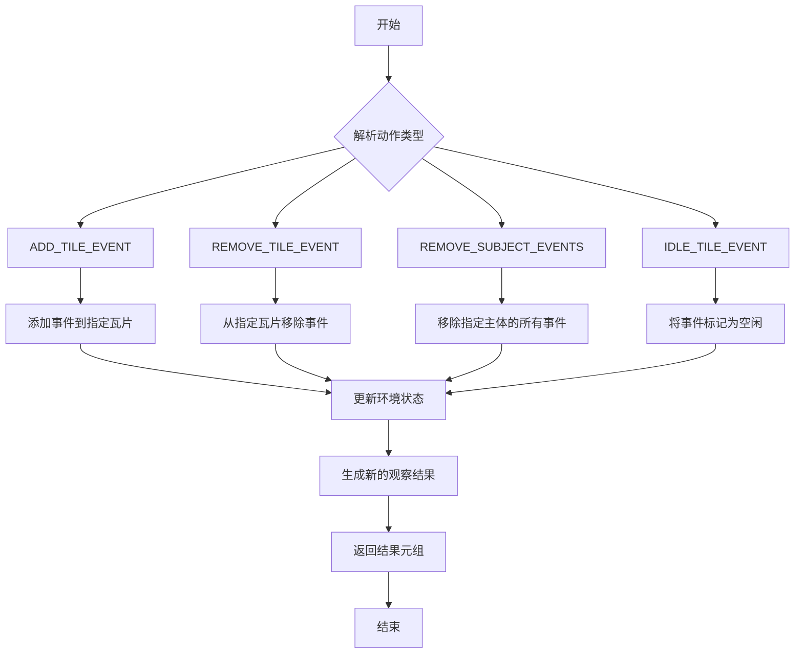

#### 带注释源码

```python
def step(self, action: EnvAction) -> tuple[dict, float, bool, bool, dict]:
    """
    执行环境的一个步骤，根据动作更新环境状态，并返回新的观察结果、奖励、完成标志、截断标志和额外信息。
    
    Args:
        action (EnvAction): 包含动作类型、坐标和事件信息的动作对象。
    
    Returns:
        tuple[dict, float, bool, bool, dict]: 新的观察结果、奖励、完成标志、截断标志和额外信息。
    """
    # 解析动作类型、坐标和事件
    action_type = action.action_type
    coord = action.coord
    event = action.event
    
    # 根据动作类型执行相应的操作
    if action_type == EnvActionType.ADD_TILE_EVENT:
        # 添加事件到指定坐标的瓦片
        self.add_event_from_tile(event, coord)
    elif action_type == EnvActionType.REMOVE_TILE_EVENT:
        # 从指定坐标的瓦片移除事件
        self.remove_event_from_tile(event, coord)
    elif action_type == EnvActionType.REMOVE_SUBJECT_EVENTS:
        # 移除指定主体的所有事件
        self.remove_subject_events_from_tile(event[0], coord)
    elif action_type == EnvActionType.IDLE_TILE_EVENT:
        # 将指定事件标记为空闲状态
        self.turn_event_from_tile_idle(event, coord)
    else:
        # 如果动作类型未知，抛出异常
        raise ValueError(f"Unknown action type: {action_type}")
    
    # 生成新的观察结果
    obs = self.observe()
    
    # 返回结果元组，奖励、完成标志、截断标志和额外信息暂时为默认值
    return obs, 0.0, False, False, {}
```

### `StanfordTownExtEnv.action_space`

`action_space` 是 `StanfordTownExtEnv` 类的一个属性，它定义了智能体在斯坦福小镇扩展环境中可以执行的动作空间。该属性返回一个 `gymnasium.spaces.Dict` 对象，其中包含了动作类型、坐标和事件等关键信息，这些信息共同构成了智能体与环境交互的完整动作结构。

参数：
- 无

返回值：`gymnasium.spaces.Dict`，一个包含动作类型、坐标和事件等信息的字典空间，用于描述智能体可以执行的所有可能动作。

#### 流程图

```mermaid
flowchart TD
    A[开始] --> B[定义动作类型空间<br>EnvActionType]
    B --> C[定义坐标空间<br>Tuple[int, int]]
    C --> D[定义事件空间<br>Tuple[str, Optional[str], Optional[str], Optional[str]]]
    D --> E[组合成字典空间<br>gymnasium.spaces.Dict]
    E --> F[返回动作空间]
    F --> G[结束]
```

#### 带注释源码

```python
@property
def action_space(self) -> gymnasium.spaces.Dict:
    """
    返回动作空间，定义了智能体可以执行的动作结构。
    动作空间是一个字典，包含以下键：
        - "action_type": 动作类型，如添加或移除事件。
        - "coord": 动作发生的坐标。
        - "event": 事件信息，包括主体、描述等。
    """
    return gymnasium.spaces.Dict(
        {
            "action_type": gymnasium.spaces.Discrete(len(EnvActionType)),  # 动作类型，离散值
            "coord": gymnasium.spaces.Tuple(  # 坐标，由两个整数组成的元组
                (
                    gymnasium.spaces.Discrete(self.width),  # x坐标，范围从0到环境宽度-1
                    gymnasium.spaces.Discrete(self.height),  # y坐标，范围从0到环境高度-1
                )
            ),
            "event": gymnasium.spaces.Tuple(  # 事件，由四个元素组成的元组
                (
                    gymnasium.spaces.Text(max_length=100),  # 事件主体，最大长度100的字符串
                    gymnasium.spaces.Text(max_length=100, min_length=0),  # 事件描述，可选字符串
                    gymnasium.spaces.Text(max_length=100, min_length=0),  # 事件对象，可选字符串
                    gymnasium.spaces.Text(max_length=100, min_length=0),  # 事件状态，可选字符串
                )
            ),
        }
    )
```

## 关键组件


### 环境空间定义 (EnvAction, EnvActionType, EnvObsParams, EnvObsType)

定义了斯坦福小镇扩展环境的核心交互接口，包括动作类型、观察类型及其参数，用于规范智能体与环境之间的通信协议。

### 扩展环境主体 (StanfordTownExtEnv)

作为环境的核心实现类，负责管理游戏地图（迷宫）、坐标转换、事件处理（添加、闲置、移除）以及执行智能体动作并返回观察结果。

### 坐标与瓦片系统

提供将世界坐标转换为地图瓦片坐标的功能，并管理基于瓦片的地图数据访问、碰撞检测、地址查询和路径查找。

### 事件管理系统

允许在特定的地图瓦片上添加、标记为闲置或移除事件（通常代表游戏内物体的状态或交互），并支持按事件主体进行批量移除。

### 观察与重置机制

提供环境重置功能以初始化状态，并支持根据指定的观察参数（如瓦片路径、地址瓦片列表等）获取当前环境的局部或全局信息。

### 动作执行流程

定义了环境接收智能体动作（如添加瓦片事件）后的处理流程，包括更新内部状态（如瓦片事件列表）并返回新的观察结果、奖励、完成标志等信息。


## 问题及建议


### 已知问题

-   **测试用例与实现耦合度高**：`test_stanford_town_ext_env` 测试函数直接访问了 `StanfordTownExtEnv` 类的内部属性 `tiles`（例如 `ext_env.tiles[tile[1]][tile[0]]["events"]`）来断言事件数量。这违反了封装原则，使得测试变得脆弱。一旦内部数据结构（如 `tiles` 的组织方式）发生变化，即使类的公共接口行为未变，测试也会失败。
-   **测试数据构造存在硬编码**：测试中使用的坐标 `(58, 9)` 和事件 `("double studio:double studio:bedroom 2:bed", None, None, None)` 是硬编码的。这些值可能依赖于特定的 `maze_asset_path` 数据文件内容。如果底层数据文件（如 `the_ville` 地图）发生变化，这些测试点可能失效，导致测试不通过，增加了测试维护成本。
-   **测试覆盖不完整**：当前的单元测试主要覆盖了环境初始化、坐标转换、地图信息获取和事件管理（增、删、闲置）等基础功能。对于 `step` 方法可能返回的终止状态（`done`）、奖励（`reward`）以及更复杂的动作序列和观察场景（如 `EnvObsType` 的其他类型）缺乏测试用例。`action_space.sample()` 的使用也未验证其生成的动作在环境中是否有效。
-   **缺乏对异常和边界条件的测试**：测试用例未包含对错误输入或边界条件的验证，例如向 `access_tile`、`get_tile_path` 等方法传入无效坐标或层级参数时，代码的行为是否符合预期（例如是抛出异常还是返回默认值）。

### 优化建议

-   **重构测试以使用公共接口**：应修改测试用例，避免直接访问 `tiles` 等私有或受保护的内部属性。可以通过调用环境提供的其他公共观察方法（如果存在）来间接验证事件状态，或者为 `StanfordTownExtEnv` 类设计并实现一个专门用于测试的、稳定的查询接口（如 `get_events_at_tile` 方法）。
-   **使用测试夹具和参数化**：将测试依赖的固定数据（如 `maze_asset_path`）和关键测试点（如特定坐标和事件）提取为测试夹具（fixtures）或常量。对于需要测试多种坐标或事件组合的场景，可以使用参数化测试（如 `pytest.mark.parametrize`）来提高测试的覆盖率和可维护性。
-   **补充关键功能与边界测试**：
    -   为 `EnvActionType` 的所有类型（至少是 `ADD_TILE_EVENT` 之外的类型）设计测试用例。
    -   测试 `step` 方法在各种动作下的完整返回元组（`obs, reward, done, truncated, info`）。
    -   添加对无效输入（如越界坐标、非法动作类型）的测试，明确期望的错误处理行为（抛出特定异常或返回错误标识）。
    -   测试 `reset` 方法是否正确地重置了环境状态（例如，添加事件后重置，事件列表应清空）。
-   **提升测试独立性与可读性**：每个测试函数应聚焦于一个特定的功能或场景。考虑将庞大的 `test_stanford_town_ext_env` 函数拆分为多个更小、更专注的测试函数（例如 `test_coordinate_conversion`， `test_event_lifecycle`， `test_tile_information` 等）。同时，为测试函数和断言添加更清晰的描述性注释或文档字符串。


## 其它


### 设计目标与约束

本模块旨在为斯坦福小镇模拟环境提供一个可扩展的外部环境接口，其核心设计目标是实现一个基于网格坐标的、支持事件管理的二维世界模拟环境。主要约束包括：1) 必须与`gymnasium`接口规范兼容，以支持强化学习智能体的训练与评估；2) 环境状态（如碰撞地图、地址瓦片、事件）的初始化依赖于外部提供的静态资产文件（`maze_asset_path`），确保了环境的可配置性和可复用性；3) 性能约束要求坐标转换、邻近瓦片计算、事件增删等核心操作在大量实体（如数百个地址瓦片）存在时保持高效，以支持实时或准实时模拟。

### 错误处理与异常设计

当前代码的单元测试展示了正常流程，但未显式处理潜在异常。在详细设计中，应明确以下错误处理机制：1) 当提供的`maze_asset_path`路径无效或文件格式不符合预期时，应在`__init__`或`reset`方法中抛出`FileNotFoundError`或自定义的`AssetLoadError`；2) 在执行`step`、`observe`等方法时，若传入的坐标参数超出地图边界，应抛出`IndexError`或自定义的`OutOfBoundsError`；3) 对于事件操作（如`add_event_from_tile`），当事件格式不符合预期的四元组结构时，应抛出`ValueError`。建议采用Python的异常处理机制，在关键方法内部使用`try-except`块，并向上层调用者抛出具有明确语义的自定义异常，而非静默失败或返回特殊值。

### 数据流与状态机

环境的核心数据流围绕`tiles`这个二维网格状态展开。1) **初始化数据流**：从`maze_asset_path`加载JSON配置文件，解析并填充`tiles`数组，生成`collision_maze`（碰撞层）和`address_tiles`（地址层）。2) **观察数据流**：`observe`方法根据`EnvObsParams`指定的类型（如`TILE_PATH`）和坐标，从`tiles`或派生数据（如`address_tiles`）中查询并返回信息。3) **动作执行数据流**：`step`方法接收`EnvAction`，根据其`action_type`（如`ADD_TILE_EVENT`）调用对应的事件管理方法（如`add_event_from_tile`），修改`tiles`中特定坐标的`events`列表。环境本身没有复杂的状态机，其状态变化完全由外部动作驱动，`tiles`是唯一的核心状态存储。

### 外部依赖与接口契约

1.  **外部依赖**：
    *   **`gymnasium`**：作为基础环境类，`StanfordTownExtEnv`需继承自`gymnasium.Env`，并实现其`reset`, `step`, `render`, `close`等抽象方法，以符合标准强化学习环境接口。
    *   **静态资产文件**：环境配置严重依赖`maze_asset_path`指向的目录结构及内部的JSON文件（如`map.json`）。这些文件定义了地图布局、瓦片属性、地址信息等，是环境运行的先决条件。
    *   **`EnvAction`, `EnvObsParams`等数据类型**：依赖于同模块`env_space`中定义的动作与观察空间规范，包括动作类型(`EnvActionType`)、观察类型(`EnvObsType`)及相应的数据结构。

2.  **接口契约**：
    *   **`__init__(maze_asset_path: Path)`**：契约要求调用者提供有效的资产路径。环境负责加载并初始化内部状态。
    *   **`reset(...) -> tuple[ObsType, dict]`**：遵循`gymnasium`契约，重置环境至初始状态，并返回初始观察和信息字典。
    *   **`step(action: EnvAction) -> tuple[ObsType, float, bool, bool, dict]`**：遵循`gymnasium`契约，执行给定动作，返回新的观察、奖励、终止标志、截断标志和信息字典。当前测试显示奖励、终止等机制可能未完全实现。
    *   **`observe(obs_params: EnvObsParams) -> ObsType`**：自定义观察接口，契约要求`obs_params`指定有效的观察类型和必要参数（如坐标），环境返回对应的观察值。
    *   **事件管理方法（如`add_event_from_tile`）**：通常作为`step`的内部调用，其契约是接收特定格式的事件元组和坐标，并原子性地更新`tiles`状态。

    