# `.\MetaGPT\tests\metagpt\environment\test_base_env.py` 详细设计文档

该代码是一个单元测试文件，用于测试一个名为`ForTestEnv`的自定义环境类。该环境类继承自`Environment`基类，并演示了如何通过装饰器`@mark_as_readable`和`@mark_as_writeable`将类方法注册为可读或可写的API。测试验证了这些API的注册、调用以及异步/同步方法的正确性，确保环境能够通过统一的接口（`read_from_api`和`write_thru_api`）执行注册的方法。

## 整体流程

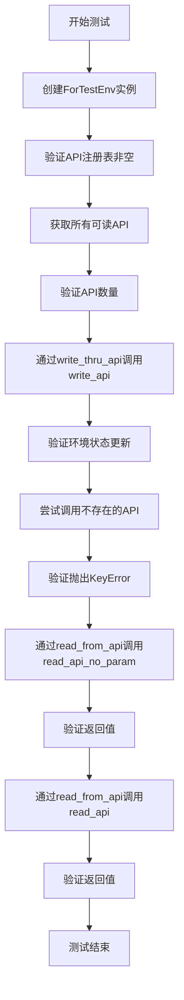

## 类结构

```
Environment (基类)
└── ForTestEnv (测试环境类)
    ├── 字段: value
    ├── 方法: reset, observe, step
    ├── 可读API: read_api_no_param, read_api, async_read_api
    └── 可写API: write_api
```

## 全局变量及字段


### `env_read_api_registry`
    
全局注册表，用于存储所有被标记为可读的环境API函数及其元数据，键为API名称，值为包含函数信息和参数的字典。

类型：`dict[str, dict[str, Any]]`
    


### `env_write_api_registry`
    
全局注册表，用于存储所有被标记为可写的环境API函数及其元数据，键为API名称，值为包含函数信息和参数的字典。

类型：`dict[str, dict[str, Any]]`
    


### `ForTestEnv.value`
    
测试环境类的内部状态值，用于演示可读和可写API如何操作环境状态。

类型：`int`
    
    

## 全局函数及方法

### `test_ext_env`

该函数是一个异步单元测试，用于验证`ForTestEnv`类（继承自`Environment`）中通过装饰器`@mark_as_readable`和`@mark_as_writeable`注册的读写API的功能。测试内容包括：检查API注册表是否非空、验证可读API列表、通过写API修改环境状态、处理不存在的API调用异常，以及通过读API读取环境状态。

参数：
- 无显式参数

返回值：`None`，无返回值

#### 流程图

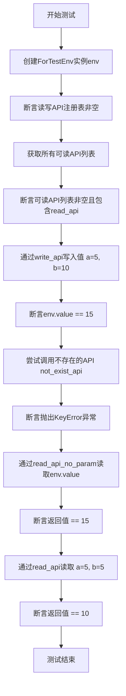

#### 带注释源码

```python
@pytest.mark.asyncio  # 标记为异步测试函数，以便使用await
async def test_ext_env():
    # 1. 创建测试环境实例
    env = ForTestEnv()
    
    # 2. 验证读写API注册表是否已注册了API（通过装饰器）
    assert len(env_read_api_registry) > 0
    assert len(env_write_api_registry) > 0

    # 3. 获取所有可读API，并验证read_api的详细信息（包含参数数量等）
    apis = env.get_all_available_apis(mode="read")
    assert len(apis) > 0
    assert len(apis["read_api"]) == 3  # 假设read_api有三个相关属性（如参数信息）

    # 4. 通过写API修改环境状态：调用write_api，传入参数a=5, b=10
    _ = await env.write_thru_api(EnvAPIAbstract(api_name="write_api", kwargs={"a": 5, "b": 10}))
    # 验证环境值是否被正确更新为15
    assert env.value == 15

    # 5. 测试异常处理：尝试调用一个不存在的API，应抛出KeyError
    with pytest.raises(KeyError):
        await env.read_from_api("not_exist_api")

    # 6. 通过无参数读API读取当前环境值，应返回15
    assert await env.read_from_api("read_api_no_param") == 15
    
    # 7. 通过带参数读API计算并验证结果：a=5, b=5，应返回10
    assert await env.read_from_api(EnvAPIAbstract(api_name="read_api", kwargs={"a": 5, "b": 5})) == 10
```

### `ForTestEnv.reset`

该方法用于重置测试环境的状态，但当前实现为空，仅作为占位符。

参数：

- `seed`：`Optional[int]`，可选的随机种子，用于环境重置时控制随机性
- `options`：`Optional[dict[str, Any]]`，可选的配置字典，用于传递额外的重置参数

返回值：`tuple[dict[str, Any], dict[str, Any]]`，返回一个包含两个字典的元组，分别表示初始观察信息和环境信息

#### 流程图

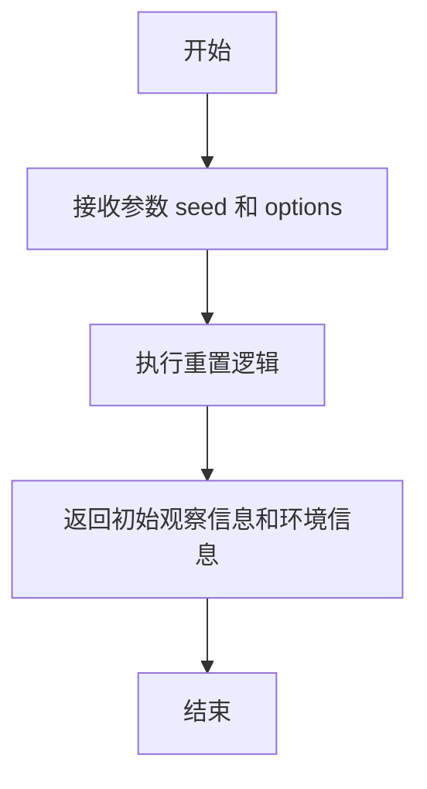

#### 带注释源码

```python
def reset(
    self,
    *,
    seed: Optional[int] = None,
    options: Optional[dict[str, Any]] = None,
) -> tuple[dict[str, Any], dict[str, Any]]:
    pass  # 当前为空实现，仅作为占位符
```

### `ForTestEnv.observe`

该方法用于观察环境状态，返回当前环境的观测值。在测试环境中，该方法被定义为空实现，仅用于满足接口要求。

参数：

- `obs_params`：`Optional[BaseEnvObsParams]`，观测参数，用于指定观测的具体要求或条件，可为空。

返回值：`Any`，返回环境的观测值，具体类型由实现决定，当前为空实现。

#### 流程图

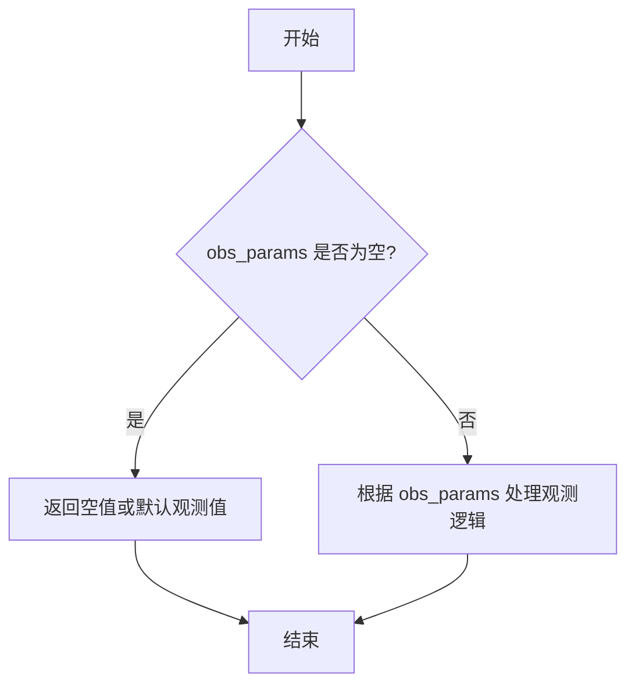

#### 带注释源码

```python
def observe(self, obs_params: Optional[BaseEnvObsParams] = None) -> Any:
    pass  # 空实现，仅用于满足接口要求，实际环境中需根据 obs_params 返回观测值
```

### `ForTestEnv.step`

该方法是一个占位符方法，用于模拟环境执行一个动作后的状态转换。在当前的测试实现中，它没有具体的逻辑，直接返回一个包含默认值的元组，以满足父类`Environment`的接口定义。

参数：
- `action`：`BaseEnvAction`，表示要在环境中执行的动作。

返回值：`tuple[dict[str, Any], float, bool, bool, dict[str, Any]]`，返回一个标准的强化学习环境`step`方法的返回值元组，依次包含：观察状态（observation）、奖励（reward）、是否终止（done）、是否截断（truncated）和额外信息（info）。当前实现返回的都是默认值。

#### 流程图

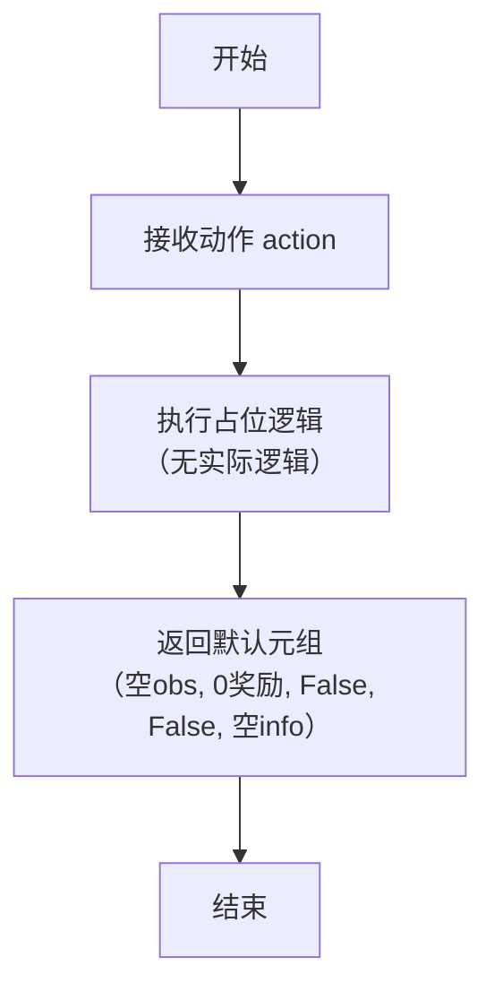

#### 带注释源码

```python
def step(self, action: BaseEnvAction) -> tuple[dict[str, Any], float, bool, bool, dict[str, Any]]:
    # 这是一个占位符方法，用于满足父类 Environment 的接口要求。
    # 在实际的强化学习环境中，此方法应包含：
    # 1. 根据传入的 action 更新环境内部状态。
    # 2. 计算并返回新的观察状态 (observation)。
    # 3. 计算并返回本次动作的奖励 (reward)。
    # 4. 判断当前回合是否结束 (done) 或是否被截断 (truncated)。
    # 5. 返回任何其他调试或辅助信息 (info)。
    # 当前测试实现中，所有返回值均为默认值。
    pass
```

### `ForTestEnv.read_api_no_param`

该方法是一个标记为可读的API，用于返回当前环境实例的`value`字段值，无需任何参数。

参数：无

返回值：`int`，返回当前环境实例的`value`字段值。

#### 流程图

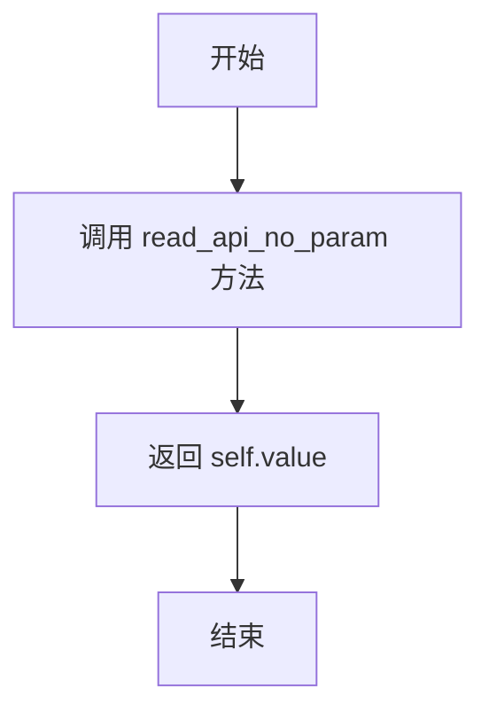

#### 带注释源码

```python
@mark_as_readable  # 装饰器，将此方法标记为可读API，注册到env_read_api_registry中
def read_api_no_param(self):
    return self.value  # 返回当前环境实例的value字段值
```

### `ForTestEnv.read_api`

该方法是一个标记为可读的API，用于计算两个整数的和。

参数：

- `a`：`int`，第一个整数
- `b`：`int`，第二个整数

返回值：`int`，两个整数的和

#### 流程图

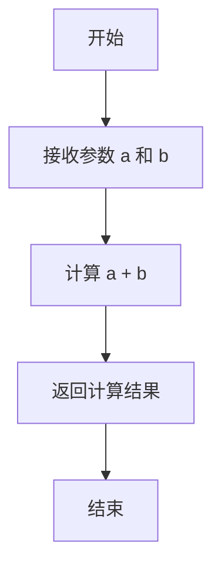

#### 带注释源码

```python
@mark_as_readable  # 装饰器，将该方法标记为可读API，注册到env_read_api_registry中
def read_api(self, a: int, b: int):
    return a + b  # 返回两个整数的和
```

### `ForTestEnv.write_api`

该方法是一个标记为可写的API，用于更新环境的状态。它接收两个整数参数，将它们相加，并将结果赋值给环境的`value`字段。

参数：

- `a`：`int`，第一个整数参数
- `b`：`int`，第二个整数参数

返回值：`None`，无返回值

#### 流程图

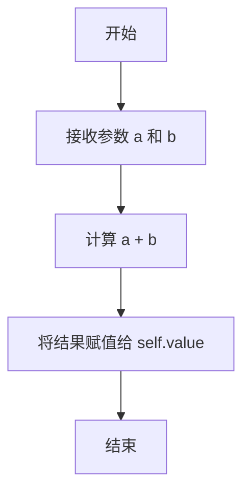

#### 带注释源码

```python
@mark_as_writeable  # 装饰器，将该方法标记为可写API，注册到env_write_api_registry中
def write_api(self, a: int, b: int):
    self.value = a + b  # 将参数a和b相加，结果赋值给实例变量value
```

### `ForTestEnv.async_read_api`

这是一个异步的、可读的API方法，用于计算两个整数的和。它被装饰器`@mark_as_writeable`标记，表明它同时也是一个可写的API（尽管其功能是读取/计算）。该方法主要用于测试环境，模拟异步读取操作。

参数：
- `a`：`int`，第一个加数
- `b`：`int`，第二个加数

返回值：`int`，参数`a`和`b`的和

#### 流程图

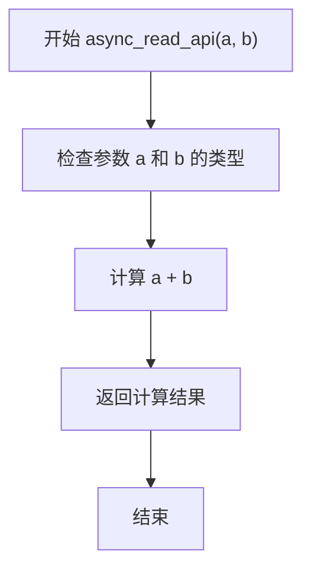

#### 带注释源码

```python
    @mark_as_writeable  # 装饰器，将此方法注册为环境的一个可写API
    async def async_read_api(self, a: int, b: int):
        # 异步方法，接收两个整数参数 a 和 b
        return a + b  # 返回两个参数的和
```

### `ForTestEnv.get_all_available_apis`

该方法用于获取当前环境实例中所有可用的API（应用程序接口）列表，并根据指定的模式（`read` 或 `write`）进行筛选。它通过查询全局的读写API注册表，并结合当前实例的类信息，返回一个字典，其中键为API名称，值为包含API元信息的字典。

参数：

- `mode`：`str`，指定要获取的API模式，可选值为 `"read"`（只读API）或 `"write"`（可写API）。默认为 `"read"`。

返回值：`dict[str, dict]`，一个字典，其键为API名称（字符串），值为包含API详细信息的字典。每个API信息字典包含以下键：`"cls"`（所属类）、`"func"`（函数对象）、`"is_async"`（是否为异步函数）。

#### 流程图

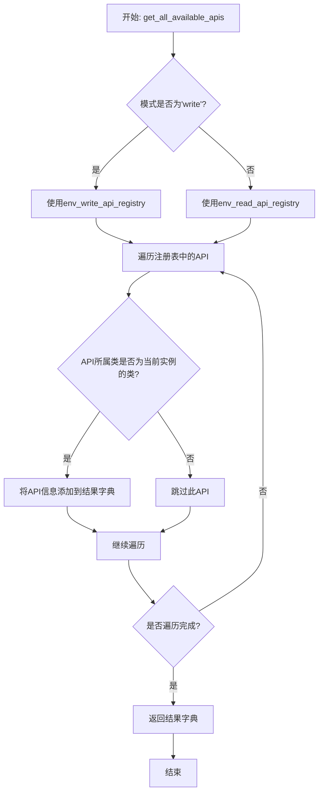

#### 带注释源码

```python
def get_all_available_apis(self, mode: str = "read") -> dict[str, dict]:
    """
    获取当前环境实例中所有可用的API。

    根据指定的模式（'read' 或 'write'），从相应的全局注册表中筛选出属于当前环境类（self.__class__）的API，
    并返回一个包含API名称和详细信息的字典。

    Args:
        mode (str): API模式，'read' 表示只读API，'write' 表示可写API。默认为 'read'。

    Returns:
        dict[str, dict]: 一个字典，键为API名称，值为包含API元信息的字典（如所属类、函数对象、是否异步等）。
    """
    # 根据模式选择要查询的全局API注册表
    if mode == "write":
        registry = env_write_api_registry  # 可写API注册表
    else:
        registry = env_read_api_registry   # 只读API注册表，也是默认值

    # 初始化一个空字典用于存储结果
    apis = {}
    # 遍历选定的注册表
    for name, info in registry.items():
        # 检查当前遍历到的API信息（info）中的类（cls）是否是当前实例的类。
        # 这确保了只返回属于当前特定环境类（例如ForTestEnv）的API，
        # 而不是注册表中所有环境类的API。
        if info["cls"] == self.__class__:
            # 如果属于当前类，则将API名称和其信息字典添加到结果中
            apis[name] = info
    # 返回筛选后的API字典
    return apis
```

### `ForTestEnv.read_from_api`

该方法用于从环境中读取数据，通过调用已注册的可读API来获取信息。它支持传入API名称字符串或EnvAPIAbstract对象，并处理异步和同步API调用。

参数：

- `api`：`Union[str, EnvAPIAbstract]`，要调用的API，可以是API名称字符串或EnvAPIAbstract对象
- `kwargs`：`dict`，传递给API的参数字典

返回值：`Any`，API调用的返回结果

#### 流程图

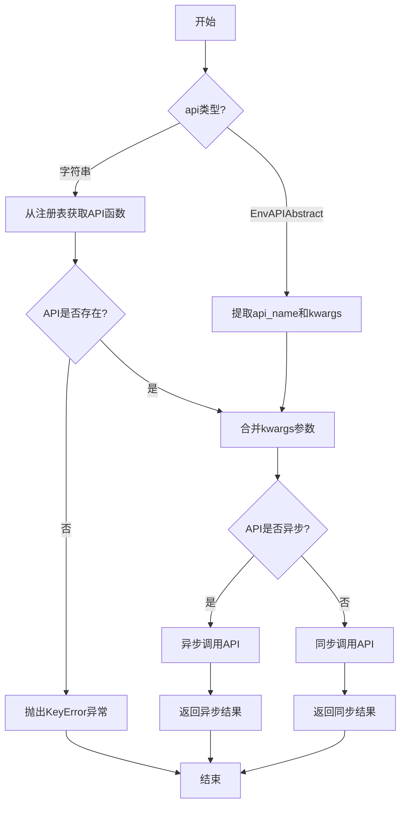

#### 带注释源码

```python
async def read_from_api(self, api: Union[str, EnvAPIAbstract], **kwargs) -> Any:
    """
    从环境中读取数据
    
    Args:
        api: 要调用的API，可以是API名称字符串或EnvAPIAbstract对象
        **kwargs: 传递给API的参数字典
        
    Returns:
        API调用的返回结果
        
    Raises:
        KeyError: 当指定的API不存在时
    """
    # 处理不同类型的api参数
    if isinstance(api, str):
        # 如果是字符串，从注册表获取API函数
        api_name = api
        api_func = env_read_api_registry.get(api_name)
        if api_func is None:
            # API不存在时抛出异常
            raise KeyError(f"Read API '{api_name}' not found")
    else:
        # 如果是EnvAPIAbstract对象，提取相关信息
        api_name = api.api_name
        api_func = env_read_api_registry.get(api_name)
        if api_func is None:
            # API不存在时抛出异常
            raise KeyError(f"Read API '{api_name}' not found")
        # 合并对象中的kwargs和传入的kwargs
        kwargs = {**api.kwargs, **kwargs}
    
    # 检查API函数是否异步
    if inspect.iscoroutinefunction(api_func):
        # 异步调用
        return await api_func(self, **kwargs)
    else:
        # 同步调用
        return api_func(self, **kwargs)
```

### `ForTestEnv.write_thru_api`

该方法用于通过环境API抽象对象执行一个已注册的可写API调用。它接收一个`EnvAPIAbstract`对象，从中提取API名称和参数，然后调用环境中对应的已标记为可写的方法，并返回执行结果。如果指定的API不存在于可写API注册表中，则会引发`KeyError`异常。

参数：

-  `action`：`EnvAPIAbstract`，包含要调用的API名称和参数字典的抽象对象

返回值：`Any`，执行指定API方法后的返回值

#### 流程图

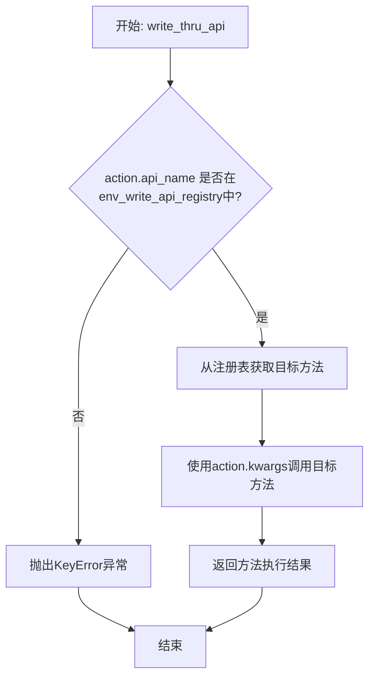

#### 带注释源码

```python
async def write_thru_api(self, action: EnvAPIAbstract) -> Any:
    """
    通过EnvAPIAbstract对象执行一个可写的API调用。

    该方法首先检查传入的action对象中的api_name是否存在于全局的可写API注册表
    `env_write_api_registry`中。如果存在，则从注册表中获取对应的可写方法，并使用
    action.kwargs中提供的参数调用该方法。最后返回该方法的执行结果。
    如果api_name不在注册表中，则抛出KeyError异常。

    Args:
        action (EnvAPIAbstract): 包含要调用的API名称和参数字典的抽象对象。

    Returns:
        Any: 执行指定API方法后的返回值。

    Raises:
        KeyError: 如果指定的API名称未在可写API注册表中注册。
    """
    # 检查传入的API名称是否在全局可写API注册表中注册
    if action.api_name not in env_write_api_registry:
        # 如果未注册，抛出KeyError异常，提示API名称
        raise KeyError(f"API '{action.api_name}' not found in write registry.")
    
    # 从注册表中获取与API名称对应的可写方法
    write_func = env_write_api_registry[action.api_name]
    
    # 使用提供的参数字典调用获取到的方法，并返回执行结果
    return await write_func(self, **action.kwargs)
```

## 关键组件

### 环境基类 (Environment)

作为所有环境类的抽象基类，定义了环境交互的核心接口（如reset, observe, step）和用于注册、管理读写API的机制。

### 读写API注册表 (env_read_api_registry / env_write_api_registry)

全局的注册表，用于收集和存储被`@mark_as_readable`或`@mark_as_writeable`装饰器标记的方法，实现了环境API的动态发现机制。

### API装饰器 (mark_as_readable / mark_as_writeable)

用于装饰环境类方法的装饰器，其核心功能是将被装饰的方法注册到对应的全局API注册表中，从而声明该方法可通过EnvAPIAbstract进行远程或标准化调用。

### 环境API抽象 (EnvAPIAbstract)

一个数据类或结构体，用于封装对环境中某个特定API的调用请求，包含API名称和参数字典，实现了环境动作的标准化表示。

### 环境API接口 (EnvAPIAbstract)

作为EnvAPIAbstract的抽象基类或接口，定义了环境API调用的通用契约，确保不同环境实现提供一致的API访问方式。

## 问题及建议


### 已知问题

-   **测试类 `ForTestEnv` 未实现抽象方法**：`ForTestEnv` 继承自 `Environment`，但未完整实现其抽象方法 `reset`、`observe` 和 `step`。这些方法目前仅包含 `pass` 语句，这可能导致在测试其他依赖于这些核心环境交互逻辑的功能时，测试覆盖不完整或行为不符合预期。
-   **API注册机制可能存在命名冲突风险**：代码使用全局注册表 `env_read_api_registry` 和 `env_write_api_registry` 来管理可读/可写API。如果多个环境类定义了同名的API方法，可能会在注册表中发生覆盖，导致运行时调用错误的方法。当前测试未覆盖此场景。
-   **异步API与同步API混用可能引发线程安全问题**：`ForTestEnv` 中同时存在同步方法（如 `write_api`）和异步方法（如 `async_read_api`）。在并发环境下，如果多个协程或线程同时访问和修改 `self.value`，可能引发数据竞争或不一致的问题。测试用例是顺序执行的，未暴露此问题。
-   **异常处理测试不全面**：测试用例仅验证了调用不存在的API会抛出 `KeyError`。对于API调用时参数类型不匹配、参数缺失或异步API执行失败等异常场景，缺乏相应的测试覆盖。

### 优化建议

-   **完善测试类的实现**：建议在 `ForTestEnv` 中为 `reset`、`observe` 和 `step` 方法提供最小化的、符合接口契约的实现（例如返回空字典或固定值），或者使用 `unittest.mock` 来模拟这些方法的行为，以确保测试的健壮性和可读性。
-   **增强API注册的健壮性**：考虑在API注册时加入类名或命名空间作为前缀，以避免不同环境类间的API名称冲突。例如，可以将API注册为 `{class_name}.{method_name}` 的形式。
-   **明确并发访问策略**：如果 `Environment` 及其子类设计为支持并发访问，应在关键字段（如 `self.value`）和API方法上添加适当的同步机制（如锁）。如果当前设计不支持并发，应在文档中明确说明，并考虑将异步方法改为同步方法以保持一致性，或确保异步方法内部是线程安全的。
-   **补充异常测试用例**：增加测试用例以验证API调用时的各种错误场景，例如：
    -   使用错误类型的参数调用 `read_api`。
    -   调用 `write_api` 时缺少必需的参数。
    -   模拟异步方法 `async_read_api` 抛出异常时的处理。
-   **考虑将测试工具类与生产代码分离**：`ForTestEnv` 作为测试专用类，其包含的 `async_read_api` 等方法可能仅用于测试。建议将其移至单独的测试模块中，或者使用pytest的fixture来动态创建测试环境实例，避免生产代码的注册表被测试专用的API污染。
-   **提升测试的可维护性**：将测试断言中的魔法数字（如 `15`, `10`）提取为常量或变量，并添加更清晰的断言描述信息，这样在测试失败时能更快定位问题。


## 其它


### 设计目标与约束

本代码模块的核心设计目标是实现一个可扩展的环境（Environment）基类，该基类支持通过装饰器动态注册读/写API，并提供统一的同步/异步接口来调用这些API。主要约束包括：1) 需要与`BaseEnvAction`、`BaseEnvObsParams`等基础类型兼容；2) 支持异步操作；3) 通过注册表机制管理API，确保API的可发现性和安全性；4) 作为单元测试的一部分，代码需保持简洁，仅展示核心机制。

### 错误处理与异常设计

错误处理主要通过异常机制实现：1) 当尝试调用未注册的API时，会抛出`KeyError`异常；2) API方法内部的错误（如参数类型错误）会正常抛出，由调用方处理；3) 异步API调用支持`await`语法，其异常传播与同步调用一致。测试用例中明确包含了对`KeyError`的异常测试，验证了错误处理的正确性。

### 数据流与状态机

数据流主要围绕`Environment`子类的状态（如`value`字段）和注册的API展开：1) 初始状态由类字段定义；2) 通过`write_api`等可写API修改内部状态；3) 通过`read_api`等可读API查询状态或进行计算；4) API注册表（`env_read_api_registry`、`env_write_api_registry`）作为元数据存储，不影响主数据流。本示例未展示完整的状态机（如`reset`、`step`），但框架支持其扩展。

### 外部依赖与接口契约

外部依赖包括：1) `pytest`框架，用于单元测试；2) `metagpt.base.base_env_space`中的`BaseEnvAction`、`BaseEnvObsParams`，定义了环境交互的基础类型；3) `metagpt.environment.api.env_api`中的`EnvAPIAbstract`，作为API调用的抽象表示。接口契约体现在：1) `Environment`子类必须实现`reset`、`observe`、`step`方法；2) 可读/写API必须使用`@mark_as_readable`/`@mark_as_writeable`装饰器注册；3) `get_all_available_apis`、`read_from_api`、`write_thru_api`提供了统一的访问接口。

### 并发与异步设计

模块明确支持异步操作：1) `Environment`类提供了`async_read_from_api`、`async_write_thru_api`等异步方法；2) 允许使用`async def`定义异步API（如`async_read_api`）；3) 测试用例使用`@pytest.mark.asyncio`和`await`进行异步测试。这为高并发或IO密集型环境操作提供了基础，同时保持了与同步API的兼容性。

### 配置与元数据管理

配置与元数据主要通过装饰器和全局注册表管理：1) `@mark_as_readable`和`@mark_as_writeable`装饰器在函数定义时将其注册到对应的全局字典中；2) `env_read_api_registry`和`env_write_api_registry`作为全局变量，存储所有注册的API函数引用；3) `get_all_available_apis`方法提供按模式（读/写）查询已注册API的能力。这种设计使得API的发现和权限管理（读/写）可以在运行时动态进行。

### 安全与权限控制

权限控制通过区分“可读”和“可写”API实现：1) 可读API（`@mark_as_readable`）只能查询或计算，不应修改对象状态；2) 可写API（`@mark_as_writeable`）可以修改对象内部状态（如`value`）；3. `get_all_available_apis`方法允许查询特定模式下的API，这为在调用前进行权限检查提供了可能。当前实现主要依赖约定，更严格的权限控制（如基于角色的访问）可在子类或调用上下文中扩展。

    