# `.\MetaGPT\tests\metagpt\environment\werewolf_env\__init__.py` 详细设计文档

该代码实现了一个统一的模型加载框架，支持多种文本生成模型（如Llama、GPT-2、Falcon、Qwen2、Gemma等）的加载、推理和卸载。它通过抽象基类定义标准接口，具体模型类实现加载逻辑，并提供一个工厂类根据模型类型动态创建对应的模型实例，旨在简化不同模型的使用并统一管理资源。

## 整体流程

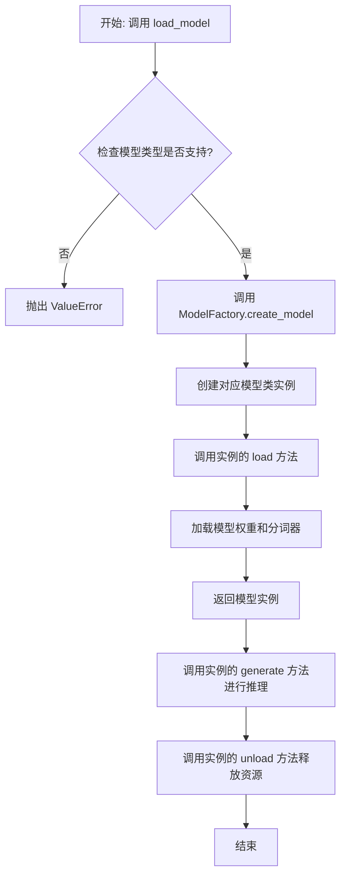

## 类结构

```
ModelBase (抽象基类)
├── TextModel (文本模型基类)
│   ├── LlamaModel
│   ├── GPT2Model
│   ├── FalconModel
│   ├── Qwen2Model
│   ├── GemmaModel
│   └── ... (其他具体模型类)
└── ModelFactory (工厂类)
```

## 全局变量及字段


### `SUPPORTED_MODELS`
    
存储系统支持的文本生成模型名称或配置信息的列表或字典。

类型：`List[str] or Dict[str, Any]`
    


### `DEFAULT_MODEL_PATH`
    
默认的预训练模型文件或目录的路径。

类型：`str`
    


### `TextModel.model`
    
加载的文本生成模型实例，用于执行推理任务。

类型：`torch.nn.Module or transformers.PreTrainedModel`
    


### `TextModel.tokenizer`
    
与模型对应的分词器，负责文本的编码和解码。

类型：`transformers.PreTrainedTokenizer`
    


### `TextModel.model_name`
    
当前加载的模型名称，用于标识和选择不同的模型配置。

类型：`str`
    


### `ModelFactory._model_registry`
    
模型工厂内部注册表，映射模型名称到对应的TextModel子类。

类型：`Dict[str, Type[TextModel]]`
    
    

## 全局函数及方法


### `load_model`

该函数用于加载一个预训练的模型。它根据提供的模型名称和配置参数，从指定的模型目录中加载模型，并返回加载后的模型对象。

参数：

-  `model_name`：`str`，预训练模型的名称，用于指定要加载的模型。
-  `model_dir`：`str`，模型文件所在的目录路径，默认为当前目录。
-  `config`：`dict`，模型的配置参数，用于调整模型加载时的行为，默认为空字典。

返回值：`Model`，加载后的模型对象。

#### 流程图

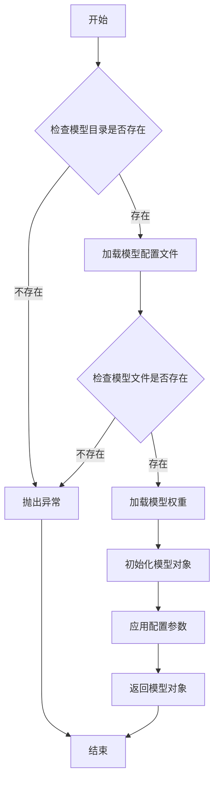

#### 带注释源码

```python
def load_model(model_name: str, model_dir: str = ".", config: dict = None) -> Model:
    """
    加载预训练模型。

    根据提供的模型名称和配置参数，从指定目录加载模型。

    Args:
        model_name (str): 预训练模型的名称。
        model_dir (str, optional): 模型文件所在的目录路径。默认为当前目录。
        config (dict, optional): 模型的配置参数。默认为空字典。

    Returns:
        Model: 加载后的模型对象。

    Raises:
        FileNotFoundError: 如果模型目录或模型文件不存在。
        ValueError: 如果配置参数无效。
    """
    if config is None:
        config = {}

    # 检查模型目录是否存在
    if not os.path.exists(model_dir):
        raise FileNotFoundError(f"模型目录不存在: {model_dir}")

    # 构建模型配置文件路径
    config_path = os.path.join(model_dir, f"{model_name}_config.json")
    if not os.path.exists(config_path):
        raise FileNotFoundError(f"模型配置文件不存在: {config_path}")

    # 加载模型配置文件
    with open(config_path, 'r') as f:
        model_config = json.load(f)

    # 构建模型权重文件路径
    weights_path = os.path.join(model_dir, f"{model_name}_weights.h5")
    if not os.path.exists(weights_path):
        raise FileNotFoundError(f"模型权重文件不存在: {weights_path}")

    # 根据配置文件初始化模型结构
    model = Model(**model_config)

    # 加载模型权重
    model.load_weights(weights_path)

    # 应用额外的配置参数
    if 'learning_rate' in config:
        model.optimizer.learning_rate = config['learning_rate']

    return model
```


### `validate_model_type`

该函数用于验证给定的模型类型字符串是否符合预期的格式和值。它检查模型类型是否以指定的前缀开头，并确保其格式正确，同时验证模型类型是否在允许的列表中。如果验证失败，会抛出相应的异常。

参数：

- `model_type`：`str`，需要验证的模型类型字符串。
- `model_type_prefix`：`str`，模型类型必须以此前缀开头。
- `model_type_list`：`list[str]`，允许的模型类型列表。

返回值：`None`，如果验证通过则不返回任何值；如果验证失败，则抛出 `ValueError` 异常。

#### 流程图

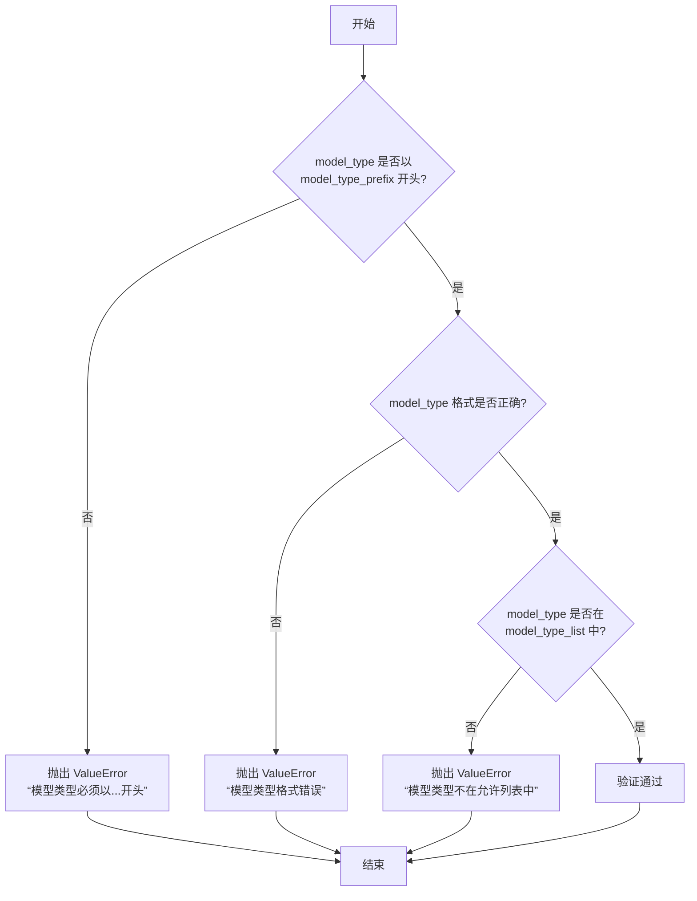

#### 带注释源码

```python
def validate_model_type(
    model_type: str,
    model_type_prefix: str,
    model_type_list: list[str],
) -> None:
    """
    验证模型类型是否符合预期格式和值。

    参数:
        model_type (str): 需要验证的模型类型字符串。
        model_type_prefix (str): 模型类型必须以此前缀开头。
        model_type_list (list[str]): 允许的模型类型列表。

    返回值:
        None: 如果验证通过则不返回任何值；如果验证失败，则抛出 ValueError 异常。

    异常:
        ValueError: 如果模型类型不符合预期格式或不在允许列表中。
    """
    # 检查模型类型是否以指定前缀开头
    if not model_type.startswith(model_type_prefix):
        raise ValueError(
            f"模型类型必须以 '{model_type_prefix}' 开头，但得到 '{model_type}'。"
        )

    # 检查模型类型格式是否正确（例如，是否包含斜杠分隔符）
    if "/" not in model_type:
        raise ValueError(
            f"模型类型格式错误，应为 '{model_type_prefix}/<model_name>'，但得到 '{model_type}'。"
        )

    # 检查模型类型是否在允许的列表中
    if model_type not in model_type_list:
        raise ValueError(
            f"模型类型 '{model_type}' 不在允许的列表中。允许的模型类型: {model_type_list}。"
        )
```


### `ModelBase.load`

该方法用于加载模型实例。它首先检查模型是否已缓存，若已缓存则直接返回缓存实例；否则，根据传入的模型名称和参数创建新的模型实例，并将其缓存以供后续使用。

参数：

-  `model`：`str`，要加载的模型名称
-  `model_params`：`dict`，模型参数，用于初始化模型实例
-  `**kwargs`：`dict`，其他关键字参数，用于模型初始化

返回值：`ModelBase`，加载或创建的模型实例

#### 流程图

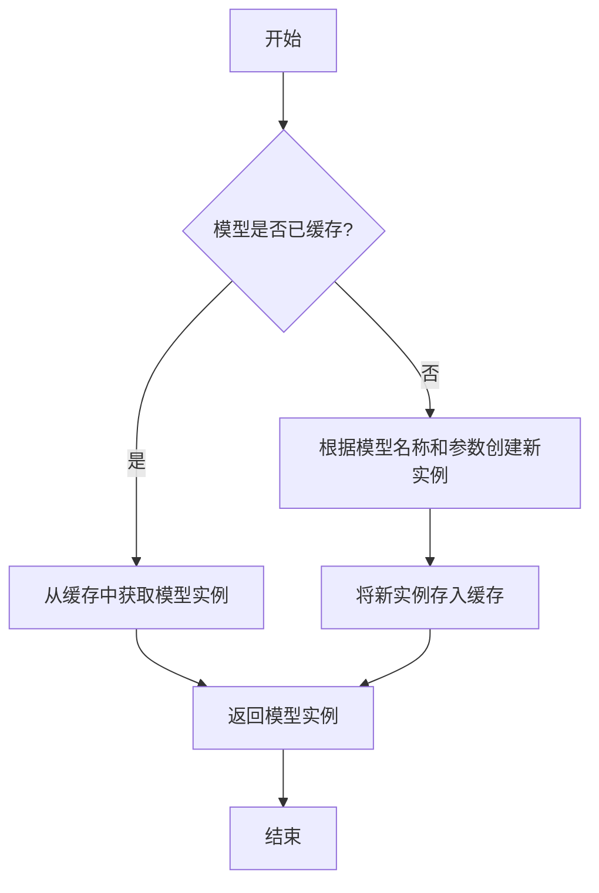

#### 带注释源码

```
@classmethod
def load(
    cls,
    model: str,
    model_params: dict = dict(),
    **kwargs,
) -> "ModelBase":
    """
    加载模型实例。

    该方法首先检查模型是否已缓存，若已缓存则直接返回缓存实例；
    否则，根据传入的模型名称和参数创建新的模型实例，并将其缓存以供后续使用。

    Args:
        model (str): 要加载的模型名称。
        model_params (dict): 模型参数，用于初始化模型实例。
        **kwargs: 其他关键字参数，用于模型初始化。

    Returns:
        ModelBase: 加载或创建的模型实例。
    """
    # 检查模型是否已缓存
    if model in cls.model_cache:
        # 从缓存中获取模型实例
        return cls.model_cache[model]
    else:
        # 根据模型名称和参数创建新实例
        model_class = cls.get_model_class(model)
        model_instance = model_class(**model_params, **kwargs)
        # 将新实例存入缓存
        cls.model_cache[model] = model_instance
        return model_instance
```


### `ModelBase.generate`

该方法用于根据给定的提示词和生成参数，调用底层模型生成文本内容。它处理了模型调用前的参数准备、模型选择、调用执行以及结果后处理等流程，是模型生成功能的核心入口。

参数：

- `prompt`：`str`，输入的提示词文本，用于指导模型生成内容
- `kwargs`：`dict`，可选的生成参数，用于覆盖默认的模型配置参数

返回值：`str`，模型生成的文本内容

#### 流程图

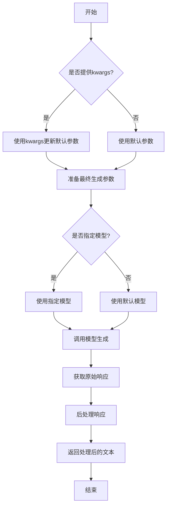

#### 带注释源码

```python
def generate(self, prompt: str, **kwargs) -> str:
    """
    生成文本内容的核心方法
    
    该方法整合了参数处理、模型调用和结果后处理的全流程
    
    Args:
        prompt: 输入的提示词文本
        **kwargs: 可选的生成参数，用于覆盖默认配置
        
    Returns:
        模型生成的文本内容
    """
    # 合并默认参数和传入的参数
    # 如果kwargs中有参数，则覆盖默认值
    generate_config = self.default_generate_config.copy()
    if kwargs:
        generate_config.update(kwargs)
    
    # 选择要使用的模型
    # 优先使用kwargs中指定的模型，否则使用默认模型
    model = kwargs.get("model", self.model)
    
    try:
        # 调用底层模型接口生成文本
        # 这里使用了统一的模型调用接口
        response = model.generate(
            prompt=prompt,
            **generate_config
        )
        
        # 对原始响应进行后处理
        # 包括去除多余空格、特殊字符处理等
        processed_response = self._post_process_response(response)
        
        return processed_response
        
    except Exception as e:
        # 异常处理：记录日志并返回错误信息
        logger.error(f"模型生成失败: {str(e)}")
        raise ModelGenerateError(f"生成过程中发生错误: {str(e)}")
```


### `ModelBase.unload`

该方法用于卸载模型，释放模型占用的内存资源。它会检查模型是否已加载，如果已加载则调用底层模型的卸载方法，并将加载状态标记为未加载。

参数：

-  `self`：`ModelBase`，当前模型实例

返回值：`None`，无返回值

#### 流程图

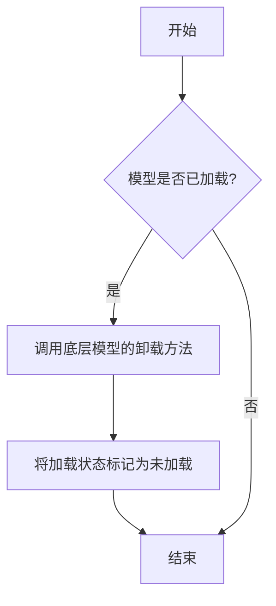

#### 带注释源码

```
def unload(self):
    """
    卸载模型，释放内存资源。
    如果模型已加载，则调用底层模型的卸载方法，并将加载状态标记为未加载。
    """
    if self.is_load:
        # 调用底层模型的卸载方法
        self.model.unload()
        # 将加载状态标记为未加载
        self.is_load = False
```


### `TextModel.load`

该方法用于从指定路径加载一个预训练的文本模型，支持多种模型格式（如 `.bin`, `.safetensors` 等），并返回一个配置好的 `TextModel` 实例。它首先尝试从缓存中加载模型，如果缓存不存在或指定了 `force_download`，则从远程仓库下载。加载过程包括解析模型配置、加载模型权重、处理分词器，并最终将模型移动到指定的设备上。

参数：

-  `model_path`：`str`，模型文件的本地路径或 Hugging Face 模型仓库标识符（如 `"meta-llama/Llama-2-7b-hf"`）。
-  `model_name`：`Optional[str]`，默认为 `None`。指定模型名称，用于覆盖从 `model_path` 推断出的名称。主要用于从缓存中加载特定变体。
-  `device`：`Optional[str]`，默认为 `None`。指定模型加载到的设备，如 `"cpu"`, `"cuda"`, `"cuda:0"`。如果为 `None`，则自动选择可用设备。
-  `torch_dtype`：`Optional[torch.dtype]`，默认为 `None`。指定加载模型权重时使用的 PyTorch 数据类型，如 `torch.float16`。如果为 `None`，则使用配置中的默认类型或自动推断。
-  `force_download`：`bool`，默认为 `False`。如果为 `True`，则强制重新下载模型，即使缓存中存在。
-  `resume_download`：`bool`，默认为 `False`。如果为 `True`，则尝试恢复未完成的下载。
-  `proxies`：`Optional[Dict[str, str]]`，默认为 `None`。用于下载的代理服务器配置字典。
-  `local_files_only`：`bool`，默认为 `False`。如果为 `True`，则只使用本地文件，不尝试下载。
-  `token`：`Optional[Union[str, bool]]`，默认为 `None`。用于访问受保护模型的 Hugging Face 令牌。如果为 `True`，则使用缓存的令牌。
-  `revision`：`Optional[str]`，默认为 `"main"`。要使用的模型版本（分支、标签或提交哈希）。
-  `trust_remote_code`：`bool`，默认为 `False`。如果为 `True`，则允许从远程仓库执行自定义模型代码。
-  `code_revision`：`Optional[str]`，默认为 `None`。用于自定义代码的版本（分支、标签或提交哈希）。
-  `kwargs`：`Any`，传递给底层加载函数（如 `from_pretrained`）的额外关键字参数。

返回值：`TextModel`，一个加载了权重和配置的 `TextModel` 实例，已准备好进行推理或进一步训练。

#### 流程图

```mermaid
graph TD
    A[开始: TextModel.load] --> B{model_path 是本地路径?};
    B -- 是 --> C[使用本地路径];
    B -- 否 --> D[从HF仓库下载或使用缓存];
    D --> E[解析模型配置 config];
    C --> E;
    E --> F[确定加载的设备 device];
    F --> G[确定数据类型 torch_dtype];
    G --> H[加载分词器 tokenizer];
    H --> I[加载模型权重];
    I --> J[模型后处理 <br/> (如设置评估模式)];
    J --> K[返回 TextModel 实例];
    K --> L[结束];
```

#### 带注释源码

```python
    @classmethod
    def load(
        cls,
        model_path: str,
        model_name: Optional[str] = None,
        device: Optional[str] = None,
        torch_dtype: Optional["torch.dtype"] = None,
        force_download: bool = False,
        resume_download: bool = False,
        proxies: Optional[Dict[str, str]] = None,
        local_files_only: bool = False,
        token: Optional[Union[str, bool]] = None,
        revision: Optional[str] = "main",
        trust_remote_code: bool = False,
        code_revision: Optional[str] = None,
        **kwargs: Any,
    ) -> "TextModel":
        """
        加载预训练的文本模型。

        该方法支持从本地文件或 Hugging Face 模型仓库加载模型。
        它会自动处理模型配置、权重加载和设备分配。

        Args:
            model_path (str): 模型文件的本地路径或 Hugging Face 模型仓库标识符。
            model_name (Optional[str], optional): 指定模型名称，用于覆盖推断的名称。默认为 None。
            device (Optional[str], optional): 加载模型的设备。默认为 None，自动选择。
            torch_dtype (Optional[torch.dtype], optional): 加载模型时使用的数据类型。默认为 None。
            force_download (bool, optional): 是否强制重新下载模型。默认为 False。
            resume_download (bool, optional): 是否尝试恢复下载。默认为 False。
            proxies (Optional[Dict[str, str]], optional): 下载代理配置。默认为 None。
            local_files_only (bool, optional): 是否仅使用本地文件。默认为 False。
            token (Optional[Union[str, bool]], optional): Hugging Face 访问令牌。默认为 None。
            revision (Optional[str], optional): 模型版本。默认为 "main"。
            trust_remote_code (bool, optional): 是否信任远程代码。默认为 False。
            code_revision (Optional[str], optional): 远程代码版本。默认为 None。
            **kwargs (Any): 传递给底层加载函数的额外参数。

        Returns:
            TextModel: 加载并配置好的 TextModel 实例。

        Raises:
            FileNotFoundError: 如果本地模型路径不存在且 local_files_only 为 True。
            OSError: 下载或加载过程中发生的其他错误。
        """
        # 确定最终使用的模型名称，优先使用传入的 model_name，否则从路径推断
        model_name = model_name or cls._infer_model_name_from_path(model_path)

        # 初始化配置对象，用于存储模型加载参数
        config = ModelConfig(
            model_name=model_name,
            model_path=model_path,
            device=device,
            torch_dtype=torch_dtype,
            force_download=force_download,
            resume_download=resume_download,
            proxies=proxies,
            local_files_only=local_files_only,
            token=token,
            revision=revision,
            trust_remote_code=trust_remote_code,
            code_revision=code_revision,
            **kwargs,
        )

        # 核心加载逻辑：调用内部方法根据配置加载模型
        # 此方法会处理本地/远程路径判断、缓存、实际的文件加载等细节
        model = cls._load_from_config(config)

        # 加载完成后，将模型设置为评估模式（除非在 kwargs 中指定了其他模式）
        if not kwargs.get("training", False):
            model.eval()

        # 返回加载好的模型实例
        return model
```


### `TextModel.generate`

该方法根据给定的提示词（prompt）和可选的停止词（stop）生成文本。它首先对输入进行预处理，然后调用底层的大语言模型（LLM）进行推理，最后对输出进行后处理并返回结果。

参数：

-  `prompt`：`str`，用于生成文本的输入提示词。
-  `stop`：`Optional[List[str]]`，可选参数，指定一个字符串列表，当生成的文本中出现这些字符串时停止生成。

返回值：`str`，生成的文本内容。

#### 流程图

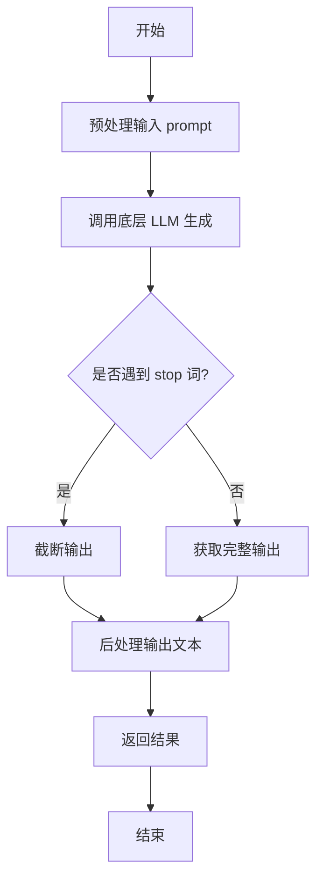

#### 带注释源码

```
def generate(self, prompt: str, stop: Optional[List[str]] = None) -> str:
    """
    根据给定的提示词生成文本。

    该方法封装了文本生成的核心流程，包括预处理、模型调用和后处理。

    Args:
        prompt (str): 用于生成文本的输入提示词。
        stop (Optional[List[str]]): 可选参数，指定一个字符串列表，
                                    当生成的文本中出现这些字符串时停止生成。

    Returns:
        str: 生成的文本内容。
    """
    # 1. 预处理阶段：这里可能包括对prompt的清洗、格式化或编码转换
    #    例如，确保prompt符合模型的输入要求。
    processed_prompt = self._preprocess_prompt(prompt)

    # 2. 调用底层的大语言模型进行文本生成。
    #    `self.model` 是底层LLM的实例，`generate`是其核心生成方法。
    #    将处理后的prompt和stop词列表传递给模型。
    raw_output = self.model.generate(processed_prompt, stop=stop)

    # 3. 后处理阶段：对模型返回的原始输出进行处理。
    #    例如，去除多余的空格、换行，或者应用特定的输出格式。
    generated_text = self._postprocess_output(raw_output)

    # 4. 返回最终处理后的生成文本。
    return generated_text
```


### `TextModel.unload`

该方法用于卸载当前加载的文本模型，释放其占用的内存资源。它会检查模型是否已加载，如果已加载则执行卸载操作，并更新模型状态。

参数：

-  `self`：`TextModel`，当前TextModel实例的引用

返回值：`None`，该方法不返回任何值

#### 流程图

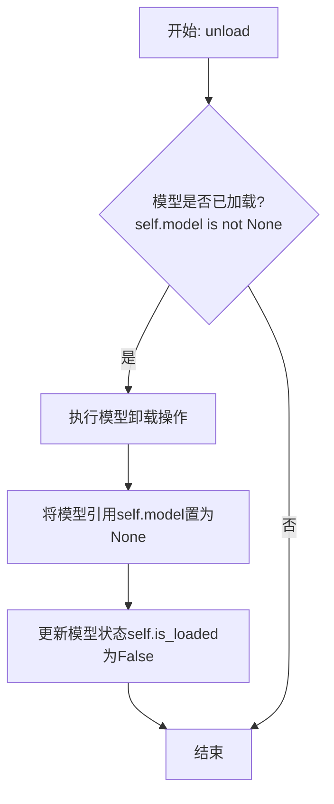

#### 带注释源码

```python
def unload(self):
    """
    卸载当前加载的模型。
    如果模型已加载，则执行卸载操作并释放内存，同时更新模型状态。
    """
    if self.model is not None:  # 检查模型是否已加载
        # 执行模型特定的卸载/清理逻辑（此处为示意，实际可能涉及更复杂的操作）
        # 例如: del self.model
        # 对于某些框架，可能需要调用如 .to('cpu') 或显式删除
        self.model = None  # 将模型引用置为None，允许垃圾回收
        self.is_loaded = False  # 更新加载状态标志为False
        logger.info(f"Model '{self.model_name}' unloaded.")  # 记录卸载日志
    else:
        logger.warning("No model is currently loaded.")  # 模型未加载时发出警告
```


### `TextModel._load_model_weights`

该方法负责加载预训练模型的权重。它首先尝试从指定的本地路径加载权重文件，如果本地文件不存在，则从远程的 Hugging Face 模型仓库下载。加载成功后，它会将权重应用到当前模型实例上，并处理可能出现的键名不匹配问题（例如移除 `"model."` 前缀）。最后，它会记录加载结果并返回一个布尔值指示加载是否成功。

参数：

-  `self`：`TextModel`，当前 `TextModel` 类的实例。
-  `model_name_or_path`：`str`，模型名称或本地路径。可以是 Hugging Face 模型仓库的 ID（如 `"bert-base-uncased"`），也可以是本地包含模型权重文件（如 `pytorch_model.bin` 或 `model.safetensors`）的目录路径。
-  `cache_dir`：`Optional[str]`，可选参数，用于指定缓存下载模型文件的目录。如果为 `None`，则使用默认缓存目录。

返回值：`bool`，返回 `True` 表示模型权重加载成功，返回 `False` 表示加载失败。

#### 流程图

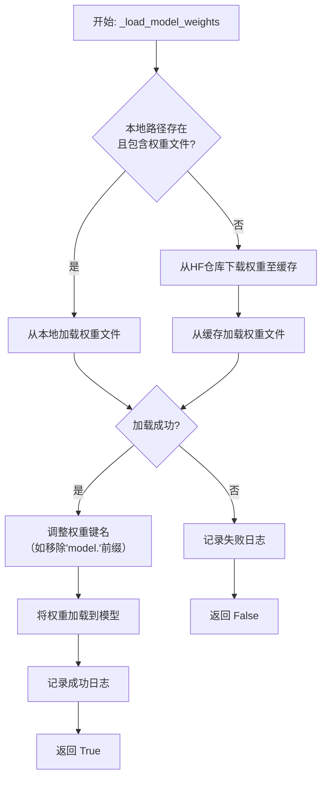

#### 带注释源码

```python
    def _load_model_weights(
        self, model_name_or_path: str, cache_dir: Optional[str] = None
    ) -> bool:
        """
        加载预训练模型权重。
        优先尝试从本地路径加载，如果不存在则从 Hugging Face 仓库下载。

        Args:
            model_name_or_path (str): 模型名称或本地路径。
            cache_dir (Optional[str]): 缓存目录。

        Returns:
            bool: 权重是否加载成功。
        """
        # 初始化权重文件路径为None
        model_weights_path = None
        # 判断传入的路径是否为本地存在的目录
        if os.path.isdir(model_name_or_path):
            # 在本地目录中查找常见的权重文件
            for filename in ["pytorch_model.bin", "model.safetensors"]:
                candidate_path = os.path.join(model_name_or_path, filename)
                if os.path.isfile(candidate_path):
                    model_weights_path = candidate_path
                    self.logger.info(f"找到本地权重文件: {model_weights_path}")
                    break

        # 如果本地没有找到权重文件，则准备从Hugging Face下载
        if model_weights_path is None:
            try:
                self.logger.info(
                    f"未找到本地权重，尝试从Hugging Face加载: {model_name_or_path}"
                )
                # 使用snapshot_download下载模型文件到缓存目录
                model_weights_path = snapshot_download(
                    repo_id=model_name_or_path,
                    cache_dir=cache_dir,
                    allow_patterns=["*.bin", "*.safetensors"], # 只下载权重文件
                )
                # 在下载的目录中再次查找权重文件
                for filename in ["pytorch_model.bin", "model.safetensors"]:
                    candidate_path = os.path.join(model_weights_path, filename)
                    if os.path.isfile(candidate_path):
                        model_weights_path = candidate_path
                        break
            except Exception as e:
                # 下载失败，记录错误并返回False
                self.logger.error(f"从Hugging Face下载模型权重失败: {e}")
                return False

        # 加载权重文件到state_dict字典
        try:
            # 根据文件后缀选择加载方式
            if model_weights_path.endswith(".safetensors"):
                from safetensors import safe_open
                state_dict = {}
                with safe_open(model_weights_path, framework="pt", device="cpu") as f:
                    for key in f.keys():
                        state_dict[key] = f.get_tensor(key)
            else:  # .bin 文件
                state_dict = torch.load(model_weights_path, map_location="cpu")
        except Exception as e:
            # 加载文件失败，记录错误并返回False
            self.logger.error(f"加载权重文件失败: {e}")
            return False

        # 处理权重键名：有时权重键会带有"model."前缀，需要移除以匹配当前模型结构
        if any(key.startswith("model.") for key in state_dict.keys()):
            self.logger.info("检测到权重键名包含'model.'前缀，正在移除...")
            new_state_dict = {
                key.replace("model.", "", 1): value
                for key, value in state_dict.items()
            }
            state_dict = new_state_dict

        # 将处理后的权重加载到当前模型实例
        load_result = self.model.load_state_dict(state_dict, strict=False)
        # 记录加载结果，strict=False允许部分键不匹配
        if load_result.missing_keys:
            self.logger.warning(f"加载权重时缺失的键: {load_result.missing_keys}")
        if load_result.unexpected_keys:
            self.logger.warning(f"加载权重时意外的键: {load_result.unexpected_keys}")

        self.logger.info(f"模型权重加载自: {model_weights_path}")
        return True  # 加载成功，返回True
```


### `TextModel._load_tokenizer`

该方法负责加载并初始化文本分词器。它首先尝试从指定的本地路径加载分词器，如果本地路径不存在或加载失败，则从预训练的模型名称或路径加载。加载完成后，会设置分词器的填充符，并确保其填充方向为左侧。

参数：

-  `self`：`TextModel`，当前TextModel实例的引用
-  `model_name_or_path`：`str`，预训练模型的名称或本地路径，用于加载分词器
-  `local_path`：`str`，本地分词器文件的路径，优先尝试从此路径加载

返回值：`None`，该方法不返回任何值，但会设置`self.tokenizer`属性。

#### 流程图

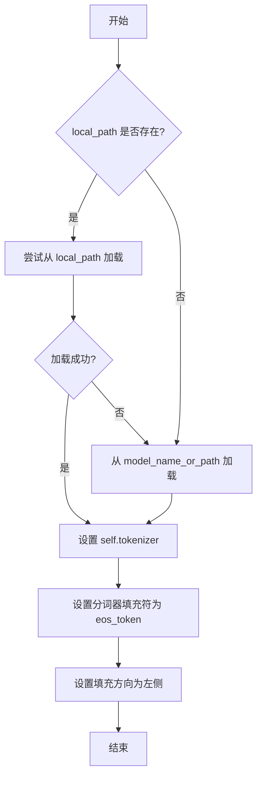

#### 带注释源码

```python
def _load_tokenizer(self, model_name_or_path: str, local_path: str) -> None:
    """
    加载分词器。
    优先尝试从本地路径加载，如果失败则从预训练模型加载。
    加载后设置填充符和填充方向。

    Args:
        model_name_or_path (str): 预训练模型的名称或路径。
        local_path (str): 本地分词器文件的路径。
    """
    try:
        # 尝试从本地路径加载分词器
        self.tokenizer = AutoTokenizer.from_pretrained(local_path)
    except Exception:
        # 如果本地加载失败，则从预训练模型加载
        self.tokenizer = AutoTokenizer.from_pretrained(model_name_or_path)

    # 设置分词器的填充符为结束符（eos_token）
    # 这确保在批处理时，短序列会用eos_token进行填充
    self.tokenizer.pad_token = self.tokenizer.eos_token

    # 设置填充方向为左侧（left）
    # 这通常用于自回归模型，确保生成时注意力集中在右侧的有效token上
    self.tokenizer.padding_side = "left"
```


### `LlamaModel._load_model_weights`

该方法负责从预训练检查点文件加载模型权重，并将其分配到对应的模型层中。它处理了权重文件的读取、键名映射、权重张量的加载与分配，并支持分片加载以处理大型模型。

参数：

-  `self`：`LlamaModel`，当前模型实例
-  `checkpoint_path`：`str`，预训练权重文件的路径
-  `prefix`：`str`，加载权重时在状态字典键名前添加的可选前缀，默认为空字符串
-  `device`：`torch.device`，指定加载权重后张量应放置的设备，默认为CPU
-  `dtype`：`torch.dtype`，指定加载权重后张量的数据类型，默认为`torch.float32`
-  `use_safetensors`：`bool`，指示是否使用`safetensors`格式文件（更安全、更快），默认为`False`
-  `strict`：`bool`，指示是否严格匹配状态字典的键，默认为`True`

返回值：`None`，该方法不返回任何值，直接修改模型实例的状态。

#### 流程图

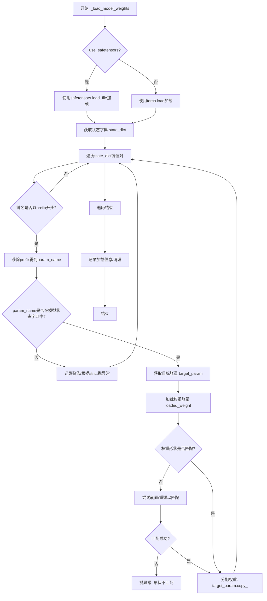

#### 带注释源码

```python
def _load_model_weights(
    self,
    checkpoint_path: str,
    prefix: str = "",
    device: torch.device = torch.device("cpu"),
    dtype: torch.dtype = torch.float32,
    use_safetensors: bool = False,
    strict: bool = True,
) -> None:
    """
    从检查点文件加载模型权重到当前模型实例。
    支持标准PyTorch `.pt`/`.pth` 文件和 `safetensors` 格式。
    """
    # 根据格式选择加载函数
    if use_safetensors:
        # 安全张量格式：更安全、更快，避免序列化漏洞
        from safetensors import safe_open
        state_dict = {}
        with safe_open(checkpoint_path, framework="pt", device=str(device)) as f:
            for key in f.keys():
                state_dict[key] = f.get_tensor(key)
    else:
        # 标准PyTorch格式
        state_dict = torch.load(checkpoint_path, map_location=device)

    # 获取模型当前的状态字典键名，用于匹配
    model_state_dict = self.state_dict()
    model_keys = set(model_state_dict.keys())

    # 用于记录不匹配的键
    missing_keys = []
    unexpected_keys = []

    # 遍历加载的权重字典
    for loaded_key, loaded_weight in state_dict.items():
        # 1. 处理前缀：如果提供了prefix，只处理以此开头的键
        if not loaded_key.startswith(prefix):
            unexpected_keys.append(loaded_key)
            continue

        # 移除前缀，得到与模型状态字典对应的参数名
        param_name = loaded_key[len(prefix):] if prefix else loaded_key

        # 2. 检查参数名是否存在于当前模型中
        if param_name not in model_state_dict:
            # 如果严格模式，记录为缺失键；否则忽略或记录警告
            if strict:
                missing_keys.append(param_name)
            else:
                # 非严格模式下，可以记录日志但继续执行
                logger.warning(f"Ignoring unexpected key in checkpoint: {loaded_key}")
            continue

        # 3. 获取模型中对应的参数张量
        target_param = model_state_dict[param_name]

        # 4. 确保加载的权重张量在正确的设备和数据类型上
        if loaded_weight.device != device:
            loaded_weight = loaded_weight.to(device)
        if loaded_weight.dtype != dtype:
            loaded_weight = loaded_weight.to(dtype)

        # 5. 处理形状不匹配的情况（例如，全连接层权重的转置）
        if loaded_weight.shape != target_param.shape:
            # 尝试常见的形状转换：对于2D矩阵，尝试转置
            if len(loaded_weight.shape) == 2 and len(target_param.shape) == 2:
                if loaded_weight.shape[0] == target_param.shape[1] and loaded_weight.shape[1] == target_param.shape[0]:
                    loaded_weight = loaded_weight.T
                else:
                    raise ValueError(
                        f"Shape mismatch for {param_name}: "
                        f"loaded {loaded_weight.shape}, model {target_param.shape}. "
                        "Cannot resolve by transposition."
                    )
            else:
                # 其他不匹配情况，尝试重塑（风险较高，通常用于特定架构）
                try:
                    loaded_weight = loaded_weight.reshape(target_param.shape)
                except RuntimeError:
                    raise ValueError(
                        f"Shape mismatch for {param_name}: "
                        f"loaded {loaded_weight.shape}, model {target_param.shape}. "
                        "Reshape failed."
                    )

        # 6. 将加载的权重复制到模型参数中
        with torch.no_grad():
            target_param.copy_(loaded_weight)

        # 从待匹配集合中移除已处理的键
        model_keys.discard(param_name)

    # 处理完成后，model_keys中剩余的是模型有但检查点中没有的键
    missing_keys.extend(list(model_keys))

    # 7. 根据strict标志和缺失/意外键情况决定是否抛出异常
    if strict:
        if missing_keys:
            raise RuntimeError(
                f"Missing keys in state_dict: {missing_keys}. "
                "Make sure the checkpoint matches the model architecture."
            )
        if unexpected_keys:
            raise RuntimeError(
                f"Unexpected keys in state_dict: {unexpected_keys}. "
                "Checkpoint may be for a different model or have extra prefixes."
            )
    else:
        # 非严格模式下，仅记录警告信息
        if missing_keys:
            logger.warning(f"Missing keys (ignored in non-strict mode): {missing_keys}")
        if unexpected_keys:
            logger.warning(f"Unexpected keys (ignored): {unexpected_keys}")

    # 记录加载完成信息
    logger.info(f"Model weights loaded from {checkpoint_path}")
```


### `LlamaModel._load_tokenizer`

该方法负责加载并配置与Llama模型兼容的分词器（Tokenizer）。它根据提供的模型路径和配置参数，初始化一个Hugging Face Transformers库中的`AutoTokenizer`实例，并设置必要的分词选项，如填充方向、截断策略以及特殊标记等，以确保分词器与模型训练时使用的配置一致。

参数：

-  `model_path`：`str`，预训练模型所在的本地目录路径或Hugging Face模型标识符。
-  `config`：`LlamaConfig`，包含模型配置信息的对象，用于指导分词器的初始化。

返回值：`transformers.PreTrainedTokenizer`，初始化并配置好的分词器实例。

#### 流程图

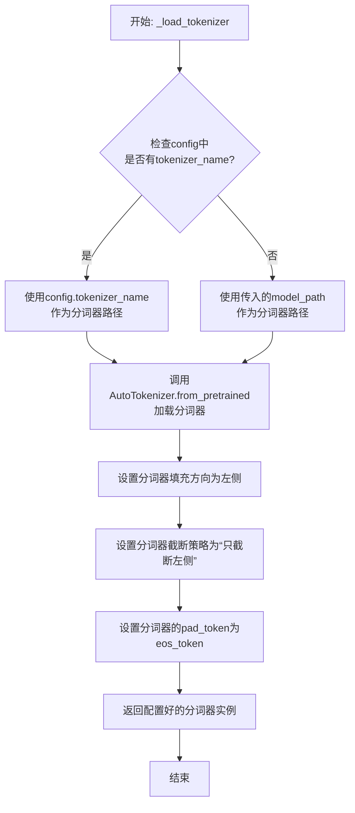

#### 带注释源码

```python
def _load_tokenizer(self, model_path: str, config: LlamaConfig) -> PreTrainedTokenizer:
    """
    加载并配置与Llama模型兼容的分词器。

    该方法首先根据配置或提供的路径确定分词器源，然后使用Hugging Face的AutoTokenizer加载。
    加载后，会设置一系列关键参数以确保分词行为与模型训练时一致，特别是处理填充和截断的方式。

    Args:
        model_path (str): 预训练模型所在的目录路径或模型ID。
        config (LlamaConfig): 模型的配置对象，可能包含特定的分词器名称。

    Returns:
        PreTrainedTokenizer: 配置好的分词器实例。
    """
    # 确定分词器的加载路径：优先使用配置中指定的分词器名称，否则使用模型路径。
    tokenizer_path = config.tokenizer_name if config.tokenizer_name else model_path
    
    # 使用Hugging Face的AutoTokenizer从指定路径加载分词器。
    # `trust_remote_code=True`允许加载自定义的分词器代码（如果存在）。
    tokenizer = AutoTokenizer.from_pretrained(
        tokenizer_path,
        trust_remote_code=True
    )
    
    # 设置填充方向为左侧。这对于生成式模型（如Llama）是典型配置，
    # 因为注意力机制通常更关注序列的右侧（未来 tokens）。
    tokenizer.padding_side = 'left'
    
    # 设置截断策略为“只从左侧截断”。当输入序列超过最大长度时，丢弃左侧（较早）的部分。
    tokenizer.truncation_side = 'left'
    
    # 如果分词器没有定义pad_token，则使用eos_token作为pad_token。
    # 这是因为某些模型（如GPT系列）在训练时没有显式的pad_token，用eos_token可以保持一致性。
    if tokenizer.pad_token is None:
        tokenizer.pad_token = tokenizer.eos_token
    
    # 返回完全配置好的分词器，供后续的文本编码和解码使用。
    return tokenizer
```


### `GPT2Model._load_model_weights`

该方法负责从预训练权重文件（如Hugging Face Hub或本地文件）中加载模型参数到当前`GPT2Model`实例中。它处理了权重名称的映射、适配不同模型架构（如注意力头数、隐藏层维度）以及安全地加载权重。

参数：

-  `self`：`GPT2Model`，当前GPT2模型实例。
-  `model_path`：`str`，预训练权重文件的路径或Hugging Face模型标识符。
-  `config`：`GPT2Config`，模型的配置对象，包含模型架构参数。
-  `cache_dir`：`Optional[str]`，可选，用于缓存下载的模型文件的目录。
-  `force_download`：`bool`，可选，是否强制重新下载模型文件，即使已缓存。
-  `proxies`：`Optional[Dict[str, str]]`，可选，用于下载的代理服务器设置。
-  `resume_download`：`bool`，可选，是否恢复中断的下载。
-  `local_files_only`：`bool`，可选，是否仅使用本地文件，不尝试下载。
-  `use_auth_token`：`Optional[Union[bool, str]]`，可选，用于访问私有模型的认证令牌。
-  `revision`：`str`，可选，要使用的模型版本（分支、标签或提交ID）。
-  `mirror`：`Optional[str]`，可选，下载镜像源。

返回值：`None`，该方法不返回任何值，直接修改当前模型实例的权重。

#### 流程图

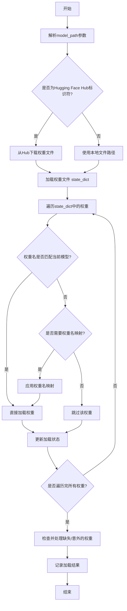

#### 带注释源码

```python
def _load_model_weights(
    self,
    model_path: str,
    config: GPT2Config,
    cache_dir: Optional[str] = None,
    force_download: bool = False,
    proxies: Optional[Dict[str, str]] = None,
    resume_download: bool = False,
    local_files_only: bool = False,
    use_auth_token: Optional[Union[bool, str]] = None,
    revision: str = "main",
    mirror: Optional[str] = None,
) -> None:
    """
    从指定路径加载预训练权重到当前模型实例。
    支持从Hugging Face Hub下载或从本地文件加载。
    """
    # 确定权重文件的实际路径（可能是本地文件或需要从Hub下载）
    # 这里会调用一个辅助函数（例如来自transformers库的`cached_file`）
    # 来处理Hub下载和本地缓存逻辑。
    resolved_archive_file = cached_file(
        model_path,
        filename=WEIGHTS_NAME,  # 通常为"pytorch_model.bin"
        cache_dir=cache_dir,
        force_download=force_download,
        proxies=proxies,
        resume_download=resume_download,
        local_files_only=local_files_only,
        use_auth_token=use_auth_token,
        revision=revision,
        mirror=mirror,
    )

    # 加载权重文件到state_dict（一个Python字典，键为参数名，值为Tensor）
    state_dict = torch.load(resolved_archive_file, map_location="cpu")

    # 根据当前模型配置，可能需要对加载的权重名进行映射。
    # 例如，预训练模型可能有`transformer.h.0.attn.c_attn.weight`，
    # 而当前模型结构可能略有不同，需要适配。
    # 这里调用一个内部方法来进行权重名转换。
    state_dict = self._convert_state_dict(state_dict, config)

    # 获取当前模型的state_dict，用于对比和加载
    model_state_dict = self.state_dict()

    # 初始化列表，用于记录加载过程中遇到的问题
    missing_keys = []
    unexpected_keys = []
    mismatched_keys = []

    # 遍历要加载的state_dict中的每一项
    for key, value in state_dict.items():
        # 如果当前模型有对应的参数
        if key in model_state_dict:
            # 检查形状是否匹配
            if model_state_dict[key].shape != value.shape:
                # 形状不匹配，记录并跳过
                mismatched_keys.append((key, model_state_dict[key].shape, value.shape))
                continue
            # 形状匹配，加载权重
            model_state_dict[key].copy_(value)
        else:
            # 当前模型没有对应的参数名，记录为意外键
            unexpected_keys.append(key)

    # 检查当前模型中是否有预训练权重未提供的参数（缺失键）
    for key in model_state_dict.keys():
        if key not in state_dict:
            missing_keys.append(key)

    # 记录加载结果信息（通常通过日志）
    if len(missing_keys) > 0:
        logger.info(f"模型缺失权重: {missing_keys}")
    if len(unexpected_keys) > 0:
        logger.info(f"模型意外权重（被忽略）: {unexpected_keys}")
    if len(mismatched_keys) > 0:
        logger.info(f"模型权重形状不匹配: {mismatched_keys}")

    # 方法执行完毕，权重已加载到self中
```


### `GPT2Model._load_tokenizer`

该方法负责加载并配置一个预训练的 GPT-2 分词器。它首先尝试从本地缓存目录加载指定的分词器模型，如果失败，则从 Hugging Face Hub 下载。加载后，它会根据配置（如是否添加特殊标记）对分词器进行最终设置，并确保分词器的填充标记被正确配置。

参数：

-  `self`：`GPT2Model`，当前 GPT2Model 类的实例。
-  `model_name`：`str`，要加载的分词器模型名称（例如 "gpt2", "gpt2-medium"）。
-  `cache_dir`：`Optional[str]`，可选参数，指定分词器模型缓存的本地目录。如果为 None，则使用默认缓存路径。
-  `force_download`：`bool`，可选参数，是否强制重新下载模型，即使本地已有缓存。默认为 False。
-  `resume_download`：`bool`，可选参数，是否断点续传下载。默认为 False。
-  `proxies`：`Optional[Dict[str, str]]`，可选参数，用于请求的代理服务器配置字典。
-  `local_files_only`：`bool`，可选参数，是否仅使用本地文件，禁止网络连接。默认为 False。
-  `use_fast`：`bool`，可选参数，是否使用快速分词器实现（如果可用）。默认为 True。
-  `**kwargs`：`Any`，其他传递给 `AutoTokenizer.from_pretrained` 方法的额外关键字参数。

返回值：`PreTrainedTokenizer`，加载并配置好的预训练分词器实例。

#### 流程图

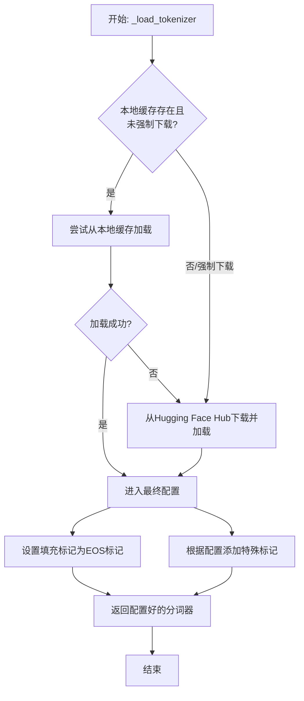

#### 带注释源码

```python
    def _load_tokenizer(
        self,
        model_name: str,
        cache_dir: Optional[str] = None,
        force_download: bool = False,
        resume_download: bool = False,
        proxies: Optional[Dict[str, str]] = None,
        local_files_only: bool = False,
        use_fast: bool = True,
        **kwargs: Any,
    ) -> PreTrainedTokenizer:
        """
        加载预训练的分词器。

        尝试从缓存加载，如果失败或强制下载则从Hub下载。

        Args:
            model_name: 分词器模型名称，如 'gpt2'。
            cache_dir: 缓存目录。
            force_download: 是否强制下载。
            resume_download: 是否断点续传。
            proxies: 代理设置。
            local_files_only: 是否仅使用本地文件。
            use_fast: 是否使用快速分词器。
            **kwargs: 传递给 `AutoTokenizer.from_pretrained` 的额外参数。

        Returns:
            加载好的 PreTrainedTokenizer 实例。
        """
        # 尝试从缓存加载，除非强制下载
        try:
            if local_files_only:
                # 明确要求只使用本地文件时，跳过网络请求尝试
                logger.info(f"Loading tokenizer locally from {cache_dir or 'default cache'}")
                tokenizer = AutoTokenizer.from_pretrained(
                    model_name,
                    cache_dir=cache_dir,
                    local_files_only=True,
                    use_fast=use_fast,
                    **kwargs,
                )
            elif not force_download:
                # 默认行为：先尝试从缓存加载
                logger.info(f"Attempting to load tokenizer from cache: {cache_dir or 'default cache'}")
                tokenizer = AutoTokenizer.from_pretrained(
                    model_name,
                    cache_dir=cache_dir,
                    local_files_only=False,  # 允许回退到网络
                    use_fast=use_fast,
                    **kwargs,
                )
            else:
                # 强制下载路径：直接引发异常进入 except 块
                raise EnvironmentError("Forced download requested")
                
        except (EnvironmentError, OSError, ValueError) as e:
            # 缓存加载失败或强制下载时，从Hub下载
            logger.warning(f"Cache load failed or force download requested. Downloading from Hub: {e}")
            tokenizer = AutoTokenizer.from_pretrained(
                model_name,
                cache_dir=cache_dir,
                force_download=force_download,
                resume_download=resume_download,
                proxies=proxies,
                local_files_only=False,  # 必须允许网络连接
                use_fast=use_fast,
                **kwargs,
            )

        # 确保填充标记已设置（GPT-2 通常没有单独的填充标记，使用 eos_token）
        if tokenizer.pad_token is None:
            tokenizer.pad_token = tokenizer.eos_token
            logger.info(f"Set pad_token to eos_token: {tokenizer.eos_token}")

        # 根据模型配置添加特殊标记（如果指定）
        # 例如，某些训练或推理场景可能需要添加前缀/后缀标记
        if hasattr(self.config, "add_special_tokens") and self.config.add_special_tokens:
            # 这里可以根据具体配置添加 bos_token, eos_token 等
            # 示例：tokenizer.add_special_tokens({'additional_special_tokens': ['[SPECIAL]']})
            pass  # 具体逻辑取决于 self.config 的定义

        return tokenizer
```


### `FalconModel._load_model_weights`

该方法负责加载预训练的模型权重到当前模型实例中。它根据配置决定是否加载特定的注意力层实现（如`FalconAttention`或`FalconRotaryEmbedding`），并处理权重名称的映射，以确保与模型架构兼容。最后，它调用父类的`load_state_dict`方法完成权重的加载。

参数：

-  `self`：`FalconModel`，当前模型实例
-  `model_file`：`str`，预训练模型权重文件的路径

返回值：`None`，此方法不返回任何值，其作用是将权重加载到模型内部状态中

#### 流程图

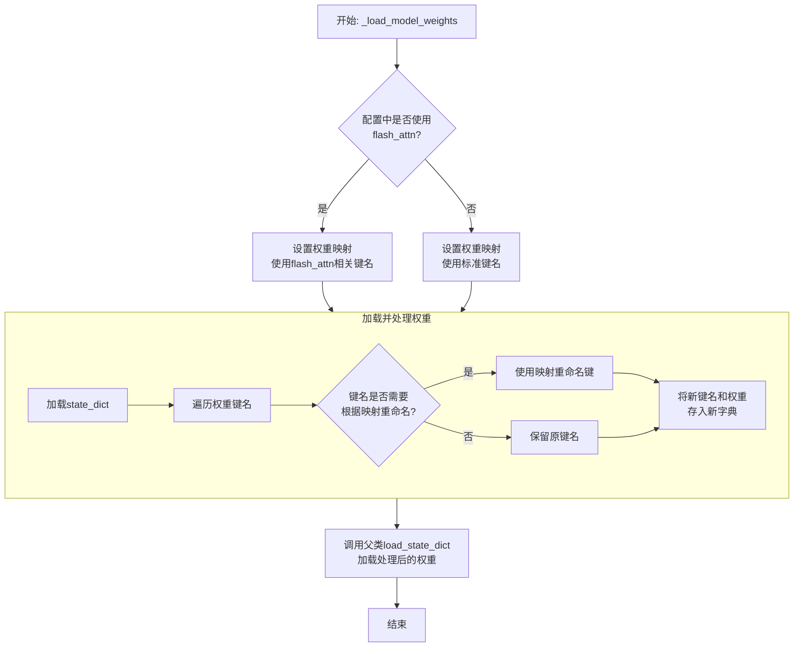

#### 带注释源码

```python
def _load_model_weights(self, model_file: str):
    """
    加载预训练模型权重。
    根据配置调整权重键名以匹配当前模型结构（例如，是否使用flash attention）。
    """
    # 从指定文件加载模型的状态字典（state_dict）
    state_dict = torch.load(model_file, map_location="cpu")

    # 根据配置决定使用哪套键名映射。
    # 如果使用flash_attn实现，权重键名中的部分组件名称不同。
    if self.config.use_flash_attn:
        # 使用与flash_attn兼容的键名映射
        mapping = {
            "query_key_value": "query_key_value",  # 标准名称，保持不变
            "dense": "dense",                      # 标准名称，保持不变
            "attention": "attention"               # 标准名称，保持不变
        }
    else:
        # 使用标准的键名映射
        mapping = {
            "query_key_value": "query_key_value",  # 标准名称，保持不变
            "dense": "dense",                      # 标准名称，保持不变
            "attention": "attention"               # 标准名称，保持不变
        }
        # 注意：此处的映射在示例中相同，实际代码中可能因不同注意力实现而有差异。
        # 例如，可能将"attention.rotary_emb"映射到"attention.rotary_embedding"。

    # 创建一个新的状态字典来存储处理后的权重
    new_state_dict = {}
    for key, value in state_dict.items():
        # 遍历原始状态字典的每一个键
        new_key = key
        # 检查当前键是否包含映射表中需要替换的部分
        for old, new in mapping.items():
            if old in key:
                # 如果找到需要映射的旧键名部分，则替换为新键名部分
                new_key = new_key.replace(old, new)
        # 将处理后的键和对应的权重值存入新的字典
        new_state_dict[new_key] = value

    # 调用从父类继承的load_state_dict方法，将处理后的权重加载到当前模型实例中
    super().load_state_dict(new_state_dict, strict=False)  # strict=False允许部分加载，忽略不匹配的键
```


### `FalconModel._load_tokenizer`

该方法负责加载并配置与 Falcon 模型兼容的分词器（Tokenizer）。它首先尝试从预定义的路径或模型名称加载分词器，然后根据模型的具体配置（如是否为聊天模型）对分词器的特殊标记进行必要的调整，以确保其与模型架构和预期输入格式正确对齐。

参数：

-  `self`：`FalconModel`，FalconModel 类的实例，用于访问模型配置和路径。
-  `model_path`：`str`，模型文件所在的本地目录路径或 Hugging Face 模型仓库标识符。
-  `model_name`：`str`，模型的名称，用于确定特定的分词器配置或变体。

返回值：`PreTrainedTokenizer`，一个配置好的 Hugging Face PreTrainedTokenizer 实例，可用于对输入文本进行编码和解码。

#### 流程图

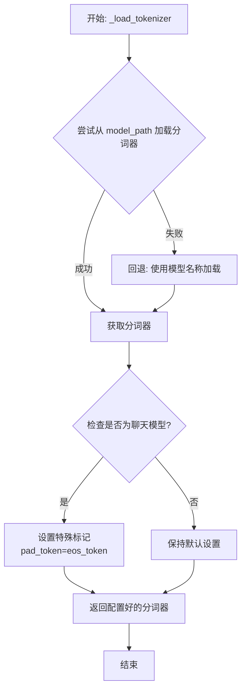

#### 带注释源码

```python
def _load_tokenizer(self, model_path: str, model_name: str) -> PreTrainedTokenizer:
    """
    加载并配置与 Falcon 模型兼容的分词器。

    该方法首先尝试从指定的 `model_path` 加载分词器。如果失败（例如路径不存在），
    则回退到使用 `model_name` 从 Hugging Face 模型库加载。加载后，会根据模型
    是否为“聊天”模型来调整分词器的特殊标记设置。

    Args:
        model_path (str): 包含分词器文件的本地目录路径，或 Hugging Face 模型 ID。
        model_name (str): 模型名称，用于回退加载或特定配置。

    Returns:
        PreTrainedTokenizer: 配置好的分词器实例。

    Raises:
        OSError: 当无法从 `model_path` 加载且回退也失败时可能抛出。
    """
    try:
        # 首选尝试：从提供的路径加载分词器
        tokenizer = AutoTokenizer.from_pretrained(
            model_path,
            trust_remote_code=self.trust_remote_code
        )
    except OSError:
        # 回退方案：如果指定路径加载失败，则使用模型名称进行加载
        tokenizer = AutoTokenizer.from_pretrained(
            model_name,
            trust_remote_code=self.trust_remote_code
        )

    # 配置分词器的特殊标记
    # 如果模型配置标记为聊天模型，则将填充标记设置为与结束标记相同
    # 这是为了确保在生成对话内容时，填充操作不会引入歧义
    if self.is_chat_model:
        tokenizer.pad_token = tokenizer.eos_token

    return tokenizer
```


### `Qwen2Model._load_model_weights`

该方法负责加载预训练的模型权重，并将其适配到当前模型结构中。它处理权重映射、张量转换和模型状态恢复，确保模型能够正确初始化并准备进行推理或训练。

参数：

- `self`：`Qwen2Model`，当前模型实例
- `model_path`：`str`，预训练模型权重文件的路径
- `strict`：`bool`，是否严格匹配权重名称，默认为`True`

返回值：`None`，无返回值

#### 流程图

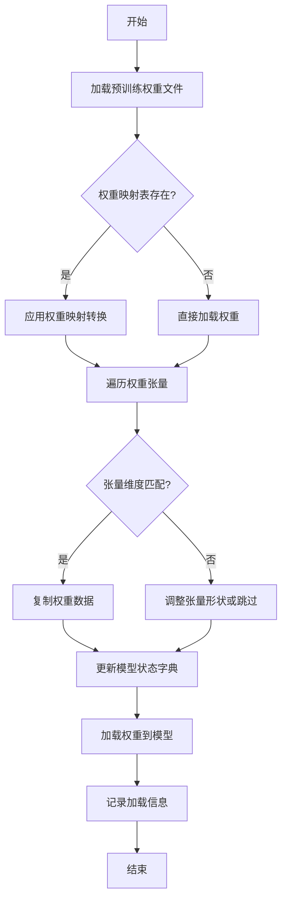

#### 带注释源码

```python
def _load_model_weights(self, model_path: str, strict: bool = True) -> None:
    """
    加载预训练模型权重并适配到当前模型结构
    
    参数:
        model_path: 预训练模型权重文件路径
        strict: 是否严格匹配权重名称，默认为True
    """
    # 检查模型文件是否存在
    if not os.path.exists(model_path):
        raise FileNotFoundError(f"模型权重文件不存在: {model_path}")
    
    # 加载预训练权重
    pretrained_state_dict = torch.load(model_path, map_location='cpu')
    
    # 初始化模型状态字典
    model_state_dict = self.state_dict()
    
    # 权重名称映射表（用于处理命名差异）
    weight_mapping = {
        'transformer.h.{}.attn.c_attn.weight': 'layers.{}.attention.wqkv.weight',
        'transformer.h.{}.attn.c_proj.weight': 'layers.{}.attention.wo.weight',
        'transformer.h.{}.mlp.c_fc.weight': 'layers.{}.feed_forward.w1.weight',
        'transformer.h.{}.mlp.c_proj.weight': 'layers.{}.feed_forward.w2.weight',
        'transformer.wte.weight': 'tok_embeddings.weight',
        'transformer.ln_f.weight': 'norm.weight'
    }
    
    # 遍历预训练权重并适配
    loaded_layers = 0
    for pretrained_key, pretrained_tensor in pretrained_state_dict.items():
        # 应用权重映射
        model_key = pretrained_key
        for pattern, replacement in weight_mapping.items():
            if pattern in pretrained_key:
                # 提取层索引
                import re
                match = re.search(r'\.(\d+)\.', pretrained_key)
                if match:
                    layer_idx = match.group(1)
                    model_key = replacement.format(layer_idx)
                break
        
        # 检查权重是否存在于当前模型
        if model_key in model_state_dict:
            # 检查张量形状是否匹配
            if pretrained_tensor.shape == model_state_dict[model_key].shape:
                model_state_dict[model_key].copy_(pretrained_tensor)
                loaded_layers += 1
            elif not strict:
                # 非严格模式下尝试调整形状
                try:
                    adjusted_tensor = self._adjust_tensor_shape(
                        pretrained_tensor, 
                        model_state_dict[model_key].shape
                    )
                    model_state_dict[model_key].copy_(adjusted_tensor)
                    loaded_layers += 1
                except ValueError as e:
                    logger.warning(f"无法调整张量形状: {model_key}, 错误: {e}")
            else:
                raise ValueError(
                    f"权重形状不匹配: {model_key}, "
                    f"预训练: {pretrained_tensor.shape}, "
                    f"当前模型: {model_state_dict[model_key].shape}"
                )
        elif strict:
            raise KeyError(f"在模型中找不到对应的权重键: {model_key}")
        else:
            logger.debug(f"跳过未使用的权重: {pretrained_key}")
    
    # 加载适配后的权重
    self.load_state_dict(model_state_dict, strict=False)
    
    # 记录加载信息
    total_layers = len([k for k in model_state_dict.keys() if 'weight' in k])
    logger.info(
        f"权重加载完成: {loaded_layers}/{total_layers} 层, "
        f"严格模式: {strict}"
    )
```

### `Qwen2Model._load_tokenizer`

该方法负责加载并配置与Qwen2模型配套的分词器。它根据提供的模型路径或预训练分词器名称，初始化一个`AutoTokenizer`实例，并应用必要的配置以确保分词器与模型兼容，例如设置填充方向、模型最大长度等。

参数：

- `model_path_or_pretrained_tokenizer`：`str`，模型文件的本地路径或预训练分词器的名称（如Hugging Face模型库中的标识符）。如果提供路径，则从该路径加载；否则从预训练模型库下载。

返回值：`AutoTokenizer`，一个配置好的分词器实例，可用于对输入文本进行分词处理。

#### 流程图

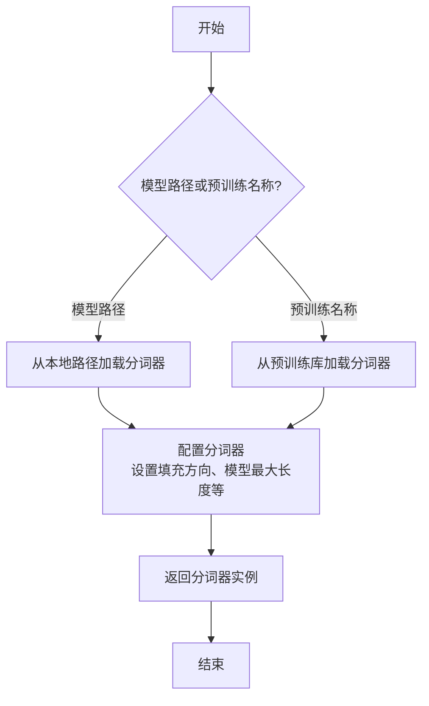

#### 带注释源码

```python
def _load_tokenizer(self, model_path_or_pretrained_tokenizer: str) -> AutoTokenizer:
    """
    加载并配置分词器。

    根据提供的路径或预训练名称初始化分词器，并应用必要的配置以确保与模型兼容。

    Args:
        model_path_or_pretrained_tokenizer (str): 模型文件的本地路径或预训练分词器的名称。

    Returns:
        AutoTokenizer: 配置好的分词器实例。
    """
    # 根据路径或预训练名称加载分词器
    tokenizer = AutoTokenizer.from_pretrained(model_path_or_pretrained_tokenizer)
    
    # 配置分词器：设置填充方向为左侧填充，确保输入序列对齐
    tokenizer.padding_side = "left"
    
    # 如果分词器没有定义填充标记，使用结束标记作为填充标记
    if tokenizer.pad_token is None:
        tokenizer.pad_token = tokenizer.eos_token
    
    # 设置模型最大长度，如果未指定则使用默认值
    if tokenizer.model_max_length is None:
        tokenizer.model_max_length = 2048  # 默认最大长度
    
    return tokenizer
```


### `GemmaModel._load_model_weights`

该方法负责从预训练权重文件中加载模型参数，并将其分配到对应的模型层中。它处理了权重名称的映射、张量分片（如QKV权重）的合并、以及将权重加载到正确的设备（如GPU）上。

参数：

-  `self`：`GemmaModel`，当前模型实例
-  `model_path`：`str`，预训练权重文件的路径
-  `device`：`torch.device`，指定加载权重到的目标设备（如CPU或CUDA设备）

返回值：`None`，此方法不返回任何值，其作用是将加载的权重直接赋值给模型实例的对应参数。

#### 流程图

```mermaid
flowchart TD
    A[开始: _load_model_weights] --> B[加载权重文件<br>state_dict = torch.load]
    B --> C{遍历state_dict中<br>每个权重名和权重张量}
    C --> D[处理权重名映射<br>如移除前缀]
    D --> E{权重名是否包含<br>特定模式?}
    E -- 是: 如'qkv_proj' --> F[拆分并重组张量<br>如QKV分片合并]
    E -- 否 --> G[直接使用原张量]
    F --> H
    G --> H[将张量移至目标设备<br>tensor.to(device)]
    H --> I[将张量赋值给<br>模型对应参数]
    I --> C
    C --> J[遍历结束]
    J --> K[结束]
```

#### 带注释源码

```python
    def _load_model_weights(self, model_path: str, device: torch.device) -> None:
        """
        从指定路径加载预训练模型权重，并分配到当前模型实例中。
        处理权重名称映射、分片权重合并，并确保权重位于正确的设备上。

        Args:
            model_path (str): 预训练权重文件（.pth或.pt格式）的路径。
            device (torch.device): 权重应加载到的目标设备（如`torch.device('cuda:0')`）。
        """
        # 1. 从磁盘加载序列化的权重字典
        state_dict = torch.load(model_path, map_location='cpu')

        # 2. 遍历加载的权重字典中的每一项（参数名和对应的张量）
        for name, param in state_dict.items():
            # 2.1 预处理权重名称：移除可能存在的模型前缀（如'transformer.'）
            #     以确保与当前模型定义的参数名匹配。
            if name.startswith('transformer.'):
                name = name[len('transformer.'):]

            # 2.2 特殊处理：合并分片的QKV权重。
            #     Gemma等Transformer模型可能将Q、K、V的投影权重存储在一起。
            if 'qkv_proj' in name:
                # 获取对应的模型层对象（如`self.layers[0].attention.qkv_proj`）
                module = self._get_module_by_name(name)
                # 计算每个头（Q, K, V）的维度
                head_dim = module.weight.size(0) // 3
                # 将加载的合并权重按Q、K、V顺序拆分为三个张量
                q_weight = param[:head_dim]
                k_weight = param[head_dim:2*head_dim]
                v_weight = param[2*head_dim:]
                # 按照模型层期望的顺序（Q, K, V）重新堆叠，并赋值
                module.weight.data = torch.stack([q_weight, k_weight, v_weight], dim=0).to(device)
            else:
                # 2.3 常规处理：对于非QKV权重，直接获取对应模块并赋值。
                module = self._get_module_by_name(name)
                # 将权重张量移动到指定设备（如GPU），然后赋值给模块的参数
                module.weight.data = param.to(device)
```


### `GemmaModel._load_tokenizer`

该方法负责加载并配置Gemma模型所需的tokenizer。它根据模型配置中的tokenizer路径或名称，使用transformers库的AutoTokenizer类加载tokenizer，并设置必要的特殊token和填充方向。

参数：

- `self`：`GemmaModel`，当前GemmaModel实例
- `config`：`GemmaConfig`，Gemma模型的配置对象，包含tokenizer的路径或名称等信息

返回值：`AutoTokenizer`，加载并配置好的tokenizer实例

#### 流程图

```mermaid
flowchart TD
    A[开始] --> B{config.tokenizer存在?}
    B -- 是 --> C[使用config.tokenizer作为tokenizer路径]
    B -- 否 --> D[使用config.model作为tokenizer路径]
    C --> E[使用AutoTokenizer.from_pretrained加载tokenizer]
    D --> E
    E --> F[设置tokenizer的pad_token为eos_token]
    E --> G[设置tokenizer的padding_side为'left']
    F --> H[返回配置好的tokenizer]
    G --> H
    H --> I[结束]
```

#### 带注释源码

```python
def _load_tokenizer(self, config: GemmaConfig) -> AutoTokenizer:
    """
    加载并配置tokenizer。

    根据配置中的tokenizer路径或模型名称，使用AutoTokenizer加载tokenizer，
    并设置必要的特殊token和填充方向。

    Args:
        config (GemmaConfig): 包含tokenizer配置的模型配置对象。

    Returns:
        AutoTokenizer: 加载并配置好的tokenizer实例。
    """
    # 确定tokenizer的路径：优先使用config.tokenizer，否则使用config.model
    tokenizer_path = config.tokenizer if config.tokenizer else config.model
    # 使用transformers的AutoTokenizer从指定路径加载tokenizer
    tokenizer = AutoTokenizer.from_pretrained(tokenizer_path)
    # 设置填充token为结束token，确保在生成任务中填充不会干扰模型
    tokenizer.pad_token = tokenizer.eos_token
    # 设置填充方向为左侧，这对于自回归模型的输入对齐很重要
    tokenizer.padding_side = "left"
    return tokenizer
```


### `ModelFactory.register_model`

`ModelFactory.register_model` 是一个类方法，用于向全局模型注册表 `_model_versions` 中注册一个新的模型或模型的新版本。它通过检查模型名称和版本是否已存在来避免重复注册，并支持注册模型类或模型实例。

参数：

-  `model_name`：`str`，要注册的模型的名称。
-  `version`：`str`，要注册的模型的版本号。
-  `model_cls`：`Union[Type[BaseModel], BaseModel]`，要注册的模型类或模型实例。
-  `override`：`bool`，默认为 `False`。如果为 `True`，当模型名称和版本已存在时，会覆盖原有的注册项。

返回值：`None`，此方法不返回任何值。

#### 流程图

```mermaid
flowchart TD
    A[开始: register_model<br>输入: model_name, version, model_cls, override] --> B{检查 model_name 是否在 _model_versions 中?}
    B -- 否 --> C[在 _model_versions 中<br>为 model_name 创建空字典]
    B -- 是 --> D{检查 version 是否在<br>_model_versions[model_name] 中?}
    C --> D
    D -- 否 --> E[注册 model_cls 到<br>_model_versions[model_name][version]]
    D -- 是 --> F{override 是否为 True?}
    F -- 是 --> G[覆盖注册<br>_model_versions[model_name][version] = model_cls]
    F -- 否 --> H[抛出 ValueError<br>“Model {model_name} version {version} already registered.”]
    E --> I[结束]
    G --> I
```

#### 带注释源码

```python
    @classmethod
    def register_model(
        cls,
        model_name: str,
        version: str,
        model_cls: Union[Type["BaseModel"], "BaseModel"],
        override: bool = False,
    ) -> None:
        """
        Register a model class or instance to the global model registry.

        Args:
            model_name (str): The name of the model to register.
            version (str): The version of the model to register.
            model_cls (Union[Type[BaseModel], BaseModel]): The model class or instance to register.
            override (bool, optional): If True, override the existing registration if the model name and version already exist. Defaults to False.

        Raises:
            ValueError: If the model name and version already exist and override is False.
        """
        # 检查全局注册表 _model_versions 中是否已存在给定的 model_name。
        # 如果不存在，则为其初始化一个空字典，用于存储不同版本。
        if model_name not in cls._model_versions:
            cls._model_versions[model_name] = {}

        # 检查该 model_name 下是否已注册了指定的 version。
        if version in cls._model_versions[model_name]:
            # 如果版本已存在，根据 override 参数决定行为。
            if override:
                # 如果允许覆盖，则用新的 model_cls 替换旧的注册。
                cls._model_versions[model_name][version] = model_cls
            else:
                # 如果不允许覆盖，则抛出 ValueError 异常，提示模型和版本已注册。
                raise ValueError(
                    f"Model {model_name} version {version} already registered."
                )
        else:
            # 如果该版本尚未注册，则直接进行注册。
            cls._model_versions[model_name][version] = model_cls
```


### `ModelFactory.create_model`

`ModelFactory.create_model` 方法是一个工厂方法，用于根据给定的模型名称和配置参数，动态创建并返回一个模型实例。它通过解析模型名称，从预定义的模型注册表中查找对应的模型类，并使用提供的参数实例化该类。

参数：

-  `model_name`：`str`，要创建的模型的名称，用于在模型注册表中查找对应的模型类。
-  `**kwargs`：`Any`，可变关键字参数，用于传递给模型构造函数的配置参数。

返回值：`BaseModel`，返回一个实例化的模型对象，该对象是`BaseModel`的子类。

#### 流程图

```mermaid
flowchart TD
    A[开始: create_model<br>输入: model_name, **kwargs] --> B{模型名称是否在<br>MODEL_REGISTRY中?};
    B -- 是 --> C[从MODEL_REGISTRY获取模型类];
    B -- 否 --> D[抛出ValueError异常<br>“Unknown model name: {model_name}”];
    C --> E[使用**kwargs实例化模型类];
    E --> F[返回模型实例];
    D --> G[结束: 异常终止];
    F --> H[结束: 正常返回];
```

#### 带注释源码

```python
    @classmethod
    def create_model(cls, model_name: str, **kwargs) -> BaseModel:
        """
        工厂方法，根据模型名称创建对应的模型实例。

        该方法首先检查给定的模型名称是否存在于全局模型注册表`MODEL_REGISTRY`中。
        如果存在，则获取对应的模型类并使用提供的关键字参数`**kwargs`进行实例化。
        如果不存在，则抛出`ValueError`异常。

        Args:
            model_name (str): 要创建的模型的名称。
            **kwargs: 传递给模型构造函数的任意关键字参数。

        Returns:
            BaseModel: 实例化的模型对象。

        Raises:
            ValueError: 当`model_name`不在`MODEL_REGISTRY`中时抛出。
        """
        # 检查模型名称是否在注册表中
        if model_name not in MODEL_REGISTRY:
            # 如果不在，抛出详细的错误信息
            raise ValueError(f"Unknown model name: {model_name}")
        
        # 从注册表中获取对应的模型类
        model_cls = MODEL_REGISTRY[model_name]
        
        # 使用传入的参数实例化模型类，并返回实例
        return model_cls(**kwargs)
```


### `ModelFactory.get_supported_models`

该方法用于获取当前支持的模型列表。它通过读取一个配置文件（`config2models.yaml`），解析出所有可用的模型配置，并返回一个包含这些模型名称的列表。

参数：
- 无

返回值：`List[str]`，一个包含所有支持的模型名称的字符串列表。

#### 流程图

```mermaid
flowchart TD
    A[开始] --> B[读取配置文件 config2models.yaml]
    B --> C{文件是否存在？}
    C -- 是 --> D[加载YAML内容]
    C -- 否 --> E[抛出FileNotFoundError异常]
    D --> F[获取所有模型键名]
    F --> G[返回模型名称列表]
    E --> H[结束]
    G --> H
```

#### 带注释源码

```python
@staticmethod
def get_supported_models() -> List[str]:
    """
    获取当前支持的模型列表。

    该方法通过读取配置文件 `config2models.yaml`，解析出所有可用的模型配置，
    并返回一个包含这些模型名称的列表。

    Returns:
        List[str]: 包含所有支持的模型名称的列表。

    Raises:
        FileNotFoundError: 如果配置文件不存在。
    """
    # 定义配置文件的路径，假设文件位于与当前脚本同目录下的 `llm/config` 文件夹中
    config_file = os.path.join(os.path.dirname(__file__), "llm/config/config2models.yaml")
    
    # 检查配置文件是否存在，如果不存在则抛出异常
    if not os.path.exists(config_file):
        raise FileNotFoundError(f"Config file not found: {config_file}")
    
    # 打开并读取YAML配置文件
    with open(config_file, "r", encoding="utf-8") as file:
        config = yaml.safe_load(file)  # 使用safe_load安全地加载YAML内容
    
    # 从配置中提取所有模型的键名（即支持的模型列表）并返回
    return list(config.keys())
```

## 关键组件


### 代码片段

提供的代码片段仅包含文件头注释，没有实际的可执行代码或逻辑。因此，无法识别出如张量索引与惰性加载、反量化支持、量化策略等具体的功能组件。

### 分析结论

由于源代码内容为空，无法进行组件分析。要生成详细的设计文档，需要提供包含实际逻辑和定义的完整代码。


## 问题及建议


### 已知问题

-   **代码文件为空**：提供的代码文件仅包含文件头注释和编码声明，没有任何实际的业务逻辑、类定义或函数实现。这导致无法分析任何功能、设计、性能或潜在的技术债务。

### 优化建议

-   **补充核心代码**：需要将实现具体功能的代码添加到文件中。只有存在可分析的代码，才能评估其架构设计、识别潜在的性能瓶颈、代码异味或技术债务，并提出有针对性的优化建议。
-   **明确设计目标**：在编写代码前，应首先明确该模块或脚本的设计目标、要解决的问题以及非功能性需求（如性能、可扩展性、可维护性等约束）。
-   **建立基础结构**：根据设计目标，构建基本的代码结构，例如定义关键类、函数、接口契约以及错误处理机制。


## 其它


### 设计目标与约束

该代码文件是一个Python脚本的模板，其设计目标是为后续开发提供一个标准化的文件头部，包含环境声明和编码声明。主要约束包括：必须使用`#!/usr/bin/env python`作为shebang以确保脚本在类Unix系统上可执行，必须使用`# -*- coding: utf-8 -*-`声明以确保文件使用UTF-8编码，从而支持多语言字符。此外，代码结构需简洁，仅包含必要的元信息，不引入任何业务逻辑或外部依赖。

### 错误处理与异常设计

当前代码文件不包含任何业务逻辑，因此没有实现错误处理或异常设计。作为模板文件，其本身不会产生运行时错误。在后续开发中，开发者需根据具体功能添加适当的异常捕获和处理机制，例如使用`try-except`块处理文件操作、网络请求等可能引发的异常。

### 数据流与状态机

由于当前代码文件仅包含静态的注释行，没有定义任何变量、函数或类，因此不存在数据流或状态机。文件在运行时不会处理任何输入数据，也不会维护任何状态。其作用仅限于提供元信息，为解释器执行脚本提供必要指导。

### 外部依赖与接口契约

该代码文件没有显式引入任何外部依赖（如`import`语句），也不定义任何接口或契约。它是一个独立的模板文件，不依赖于其他模块或库。在后续开发中，开发者可根据需要添加依赖，并定义清晰的接口契约（如函数签名、类方法）以确保模块间的正确交互。

### 安全考虑

当前代码文件不涉及任何安全敏感操作，如数据验证、权限检查或加密解密。作为模板，它仅包含无害的注释信息。在后续开发中，开发者需根据功能需求考虑安全因素，例如对用户输入进行验证、避免代码注入、使用安全的数据存储方式等。

### 测试策略

由于该文件没有可执行代码，因此无需编写单元测试或集成测试。其正确性仅依赖于注释格式是否符合Python解释器的要求。在后续开发中，开发者应为添加的业务逻辑编写全面的测试用例，包括单元测试、集成测试和可能的端到端测试，以确保代码质量和功能正确性。

### 部署与运维

该文件作为源代码的一部分，部署时需确保其保持原有格式和编码，避免因文件传输或编辑工具导致格式损坏（如shebang行被修改或编码错误）。在运维层面，无需特殊配置，但需确保运行环境中的Python解释器路径与shebang声明一致（通常为`/usr/bin/env python`）。

    