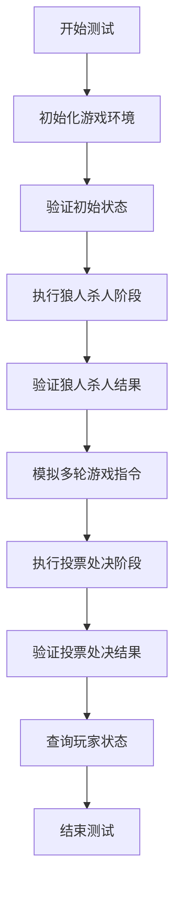
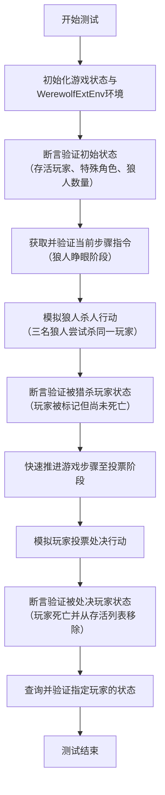

# `.\MetaGPT\tests\metagpt\environment\werewolf_env\test_werewolf_ext_env.py` 详细设计文档

该文件是狼人杀扩展环境（WerewolfExtEnv）的单元测试，主要功能是测试狼人杀游戏环境中核心逻辑的正确性，包括游戏状态初始化、角色管理、游戏流程指令生成、狼人杀人、女巫救人、投票处决等关键操作的执行与状态更新。

## 整体流程



## 类结构

```
Role (基类)
├── Werewolf
├── Villager
├── Witch
└── Guard
```

## 全局变量及字段


### `Werewolf.profile`
    
表示狼人角色的身份标识，其值固定为RoleType.WEREWOLF.value。

类型：`str`
    


### `Villager.profile`
    
表示村民角色的身份标识，其值固定为RoleType.VILLAGER.value。

类型：`str`
    


### `Witch.profile`
    
表示女巫角色的身份标识，其值固定为RoleType.WITCH.value。

类型：`str`
    


### `Guard.profile`
    
表示守卫角色的身份标识，其值固定为RoleType.GUARD.value。

类型：`str`
    
    

## 全局函数及方法


### `test_werewolf_ext_env`

该函数是一个单元测试函数，用于测试`WerewolfExtEnv`类的核心功能。它模拟了狼人杀游戏环境中的关键流程，包括环境初始化、狼人杀人、女巫/守卫行动、投票处决以及状态查询等环节，以验证`WerewolfExtEnv`类在各种游戏状态下的行为是否符合预期。

参数：无

返回值：`None`，该函数不返回任何值，其目的是通过断言（assert）语句验证代码逻辑的正确性。

#### 流程图



#### 带注释源码

```python
def test_werewolf_ext_env():
    # 1. 初始化测试数据：定义5名玩家的初始角色和状态。
    players_state = {
        "Player0": (RoleType.WEREWOLF.value, RoleState.ALIVE),
        "Player1": (RoleType.WEREWOLF.value, RoleState.ALIVE),
        "Player2": (RoleType.VILLAGER.value, RoleState.ALIVE),
        "Player3": (RoleType.WITCH.value, RoleState.ALIVE),
        "Player4": (RoleType.GUARD.value, RoleState.ALIVE),
    }
    # 2. 创建狼人杀扩展环境实例，传入玩家状态、起始步骤索引和特殊角色玩家列表。
    ext_env = WerewolfExtEnv(players_state=players_state, step_idx=4, special_role_players=["Player3", "Player4"])

    # 3. 断言验证环境初始化的正确性。
    assert len(ext_env.living_players) == 5  # 所有玩家初始状态为存活
    assert len(ext_env.special_role_players) == 2  # 特殊角色（女巫、守卫）数量正确
    assert len(ext_env.werewolf_players) == 2  # 狼人玩家数量正确

    # 4. 获取当前步骤（步骤索引5，对应狼人行动阶段）的指令并验证。
    curr_instr = ext_env.curr_step_instruction()
    assert ext_env.step_idx == 5  # 步骤索引应自动递增
    assert "Werewolves, please open your eyes" in curr_instr["content"]  # 指令内容包含狼人行动提示

    # 5. 模拟狼人杀人阶段。当前步骤索引为5。
    #    注意：第一个调用使用了不存在的狼人"Player10"，可能用于测试错误处理或会被忽略。
    ext_env.wolf_kill_someone(wolf_name="Player10", player_name="Player4")
    ext_env.wolf_kill_someone(wolf_name="Player0", player_name="Player4")
    ext_env.wolf_kill_someone(wolf_name="Player1", player_name="Player4")
    # 断言验证：玩家"Player4"应被标记为被猎杀目标。
    assert ext_env.player_hunted == "Player4"
    # 断言验证：被猎杀玩家尚未从存活列表中移除（因为女巫可能使用解药）。
    assert len(ext_env.living_players) == 5

    # 6. 快速推进游戏步骤，模拟从步骤6到步骤18的过程（可能包括女巫、守卫行动，白天讨论等）。
    for idx in range(13):
        _ = ext_env.curr_step_instruction()

    # 7. 模拟投票处决阶段。当前步骤索引为18。
    assert ext_env.step_idx == 18
    # 模拟5名玩家的投票。
    ext_env.vote_kill_someone(voter_name="Player0", player_name="Player2")
    ext_env.vote_kill_someone(voter_name="Player1", player_name="Player3")
    ext_env.vote_kill_someone(voter_name="Player2", player_name="Player3")
    ext_env.vote_kill_someone(voter_name="Player3", player_name="Player4")
    ext_env.vote_kill_someone(voter_name="Player4", player_name="Player2")
    # 断言验证：根据投票结果（Player2得2票，Player3得2票，Player4得1票），Player2应被处决。
    #           （假设平票规则或得票最多者被处决，此处验证逻辑依赖于`WerewolfExtEnv`的内部实现）。
    assert ext_env.player_current_dead == "Player2"
    # 断言验证：被处决玩家应从存活列表中移除。
    assert len(ext_env.living_players) == 4

    # 8. 测试状态查询功能：获取指定玩家列表的当前状态。
    player_names = ["Player0", "Player2"]
    # 预期结果：Player0存活，Player2已被处决（KILLED）。
    assert ext_env.get_players_state(player_names) == dict(zip(player_names, [RoleState.ALIVE, RoleState.KILLED]))
```


## 关键组件


### WerewolfExtEnv

狼人杀游戏扩展环境，负责管理游戏状态、执行游戏回合逻辑（如狼人杀人、女巫救人、投票处决）并跟踪玩家状态（存活/死亡）。

### RoleType

角色类型枚举，定义了狼人杀游戏中的不同角色，如狼人(WEREWOLF)、村民(VILLAGER)、女巫(WITCH)、守卫(GUARD)等。

### RoleState

角色状态枚举，定义了玩家在游戏中的状态，如存活(ALIVE)、被狼人猎杀(HUNTED)、被投票处决(KILLED)等。

### 玩家状态管理

通过`players_state`字典维护所有玩家的角色类型和当前状态，并动态更新`living_players`、`special_role_players`、`werewolf_players`等关键列表。

### 回合制指令生成

根据`step_idx`（回合索引）生成当前回合的游戏指令，驱动游戏流程（如“狼人请睁眼”、“女巫请行动”、“开始投票”等）。

### 狼人猎杀动作

通过`wolf_kill_someone`方法处理狼人阵营的猎杀动作，记录被猎杀的目标玩家（`player_hunted`），并允许后续被女巫解救。

### 投票处决动作

通过`vote_kill_someone`方法处理白天的投票处决动作，根据票数决定被处决的玩家（`player_current_dead`），并更新存活玩家列表。

### 状态查询接口

提供`get_players_state`方法，用于查询指定玩家列表的当前状态，支持游戏逻辑判断和外部观察。


## 问题及建议


### 已知问题

-   **测试用例设计不完整**：当前测试仅覆盖了部分游戏流程（如狼人杀人、女巫救人、投票环节），但未测试守卫守护、女巫毒人等关键技能，也未覆盖游戏结束条件（如狼人或村民全部死亡）的判定逻辑。
-   **硬编码的步骤索引**：测试中通过循环调用 `curr_step_instruction()` 来推进 `step_idx`，依赖于对内部步骤顺序的隐式知识。如果 `WerewolfExtEnv` 的内部步骤逻辑发生变化，此测试将可能失败，且难以维护。
-   **状态验证不充分**：在 `wolf_kill_someone` 和 `vote_kill_someone` 操作后，仅验证了 `player_hunted` 或 `player_current_dead` 等最终状态，未验证中间状态（如投票计数、玩家状态变更的中间过程）的正确性。
-   **魔法数字**：测试中使用了硬编码的数字（如 `range(13)` 来推进步骤到18），降低了代码的可读性和可维护性。
-   **异常和边界条件测试缺失**：未测试无效输入（如不存在的玩家名）、重复操作（如对同一玩家多次投票）或非法状态转换（如已死亡玩家参与投票）等情况。

### 优化建议

-   **完善测试覆盖**：增加测试用例，覆盖所有角色技能（守卫守护、女巫毒人）、所有游戏阶段以及游戏结束的各种条件。使用参数化测试来系统性地验证不同场景。
-   **解耦测试与内部状态**：避免直接操作和断言内部的 `step_idx`。应通过公共接口（如调用代表不同游戏阶段的方法）来驱动测试，或者使用测试替身（Mock/Stub）来隔离对复杂状态机的依赖。
-   **增强状态断言**：在关键操作前后，增加对 `living_players`、`werewolf_players`、`special_role_players` 等集合状态的断言，以验证状态转换的完整性和正确性。
-   **消除魔法数字**：将步骤索引等常量定义为有意义的变量或枚举，例如 `NIGHT_PHASE_STEPS = 13`，使测试意图更清晰。
-   **增加负面测试**：添加测试用例来验证代码在无效输入或非法操作下的行为，例如抛出预期的异常或保持状态不变。
-   **重构测试结构**：考虑使用 `setUp` 方法初始化公共测试数据，或将长的测试流程分解为多个小的、专注的测试方法，每个方法测试一个特定的功能点。


## 其它


### 设计目标与约束

本模块旨在为狼人杀游戏提供一个可扩展的环境（ExtEnv），用于模拟游戏流程、管理玩家状态和执行游戏规则。核心设计目标包括：1) 支持多角色（狼人、村民、女巫、守卫等）的动态状态管理；2) 实现游戏回合（夜晚行动、白天投票）的流程控制；3) 提供清晰的接口供外部系统（如智能体）查询环境状态和提交行动。主要约束包括：代码需与MetaGPT框架中的`Role`基类兼容；状态管理需保证在并发操作下的数据一致性（当前为单线程测试环境）；游戏逻辑需遵循典型狼人杀规则。

### 错误处理与异常设计

当前代码为单元测试，未显式展示生产环境中的错误处理机制。基于测试逻辑，潜在需要处理的异常包括：1) 无效玩家名（如`"Player10"`）参与行动时，应抛出`ValueError`或`KeyError`；2) 非法游戏状态转换（如已死亡玩家参与投票）应被阻止并抛出`RuntimeError`；3) 输入数据格式错误（如`players_state`字典结构不符预期）应在初始化时进行验证。测试中通过`assert`语句验证预期行为，在生产环境中应替换为更健壮的异常处理或状态校验。

### 数据流与状态机

环境的核心数据流围绕`players_state`字典展开，该字典映射玩家名到（角色类型， 状态）元组。主要状态转换包括：1) `ALIVE` -> `HUNTED`（被狼人选中，但可被女巫解救）；2) `ALIVE` -> `KILLED`（被投票处决或女巫毒杀）；3) `HUNTED` -> `SAVED`（被女巫解救）。环境内部通过`step_idx`驱动状态机，根据当前步骤索引决定可执行的操作（如夜晚狼人杀人、白天投票）。`living_players`、`werewolf_players`等列表是核心状态的衍生视图。

### 外部依赖与接口契约

1.  **内部依赖**：依赖于`metagpt.environment.werewolf.const`模块中的`RoleState`和`RoleType`枚举类，用于定义角色和状态常量。
2.  **基类依赖**：`WerewolfExtEnv`可能继承自某个`Environment`基类（代码中未显示），`Werewolf`、`Villager`等角色类继承自`metagpt.roles.role.Role`。
3.  **接口契约**：
    *   `__init__(players_state: dict, step_idx: int, special_role_players: list)`: 初始化环境，需提供初始玩家状态、起始步骤和特殊角色玩家列表。
    *   `curr_step_instruction() -> dict`: 获取当前步骤的指令描述，返回包含`content`等键的字典。
    *   `wolf_kill_someone(wolf_name: str, player_name: str) -> None`: 提交狼人的杀人行动。
    *   `vote_kill_someone(voter_name: str, player_name: str) -> None`: 提交玩家的投票行动。
    *   `get_players_state(player_names: list) -> dict`: 查询指定玩家的状态。

### 测试策略与覆盖范围

当前文件是一个单元测试，测试策略包括：1) **状态初始化验证**：检查环境是否正确解析初始`players_state`，生成正确的存活玩家、狼人玩家等列表。2) **流程控制验证**：通过调用`curr_step_instruction`推进`step_idx`，并验证特定步骤的指令内容。3) **核心动作验证**：测试`wolf_kill_someone`和`vote_kill_someone`方法，验证它们能正确更新内部状态（如`player_hunted`、`player_current_dead`）和衍生数据（如`living_players`）。4) **状态查询验证**：测试`get_players_state`方法返回正确的状态映射。测试覆盖了环境的主要状态管理和动作接口。

    