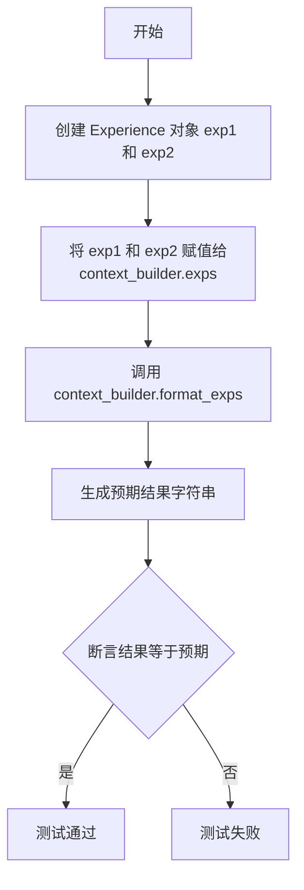
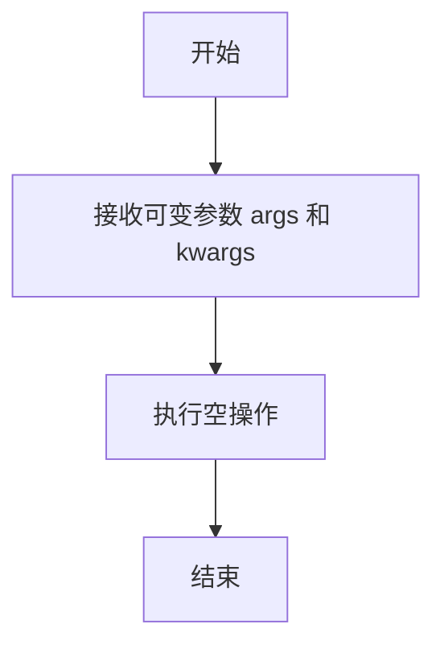

# `.\MetaGPT\tests\metagpt\exp_pool\test_context_builders\test_base_context_builder.py` 详细设计文档

该文件是一个使用 pytest 框架编写的单元测试文件，用于测试经验池（exp_pool）模块中基础上下文构建器（BaseContextBuilder）的功能。它通过创建一个具体的上下文构建器子类，并测试其格式化经验数据（Experience）的方法，验证经验对象能否按照预定义的模板正确转换为字符串格式。

## 整体流程

```mermaid
graph TD
    A[开始测试] --> B[创建测试夹具 context_builder]
    B --> C[创建两个 Experience 对象 exp1, exp2]
    C --> D[将 exp1, exp2 赋值给 context_builder.exps]
    D --> E[调用 context_builder.format_exps()]
    E --> F[将返回结果与预期字符串进行比较]
    F --> G{断言是否相等?}
    G -- 是 --> H[测试通过]
    G -- 否 --> I[测试失败]
```

## 类结构

```
TestBaseContextBuilder (测试类)
└── ConcreteContextBuilder (内部类，继承自 BaseContextBuilder)
    └── build (异步方法，占位实现)
```

## 全局变量及字段


### `EXP_TEMPLATE`
    
一个字符串模板，用于格式化经验条目，定义了经验展示的标准格式，通常包含请求、响应和评分等字段的占位符。

类型：`str`
    


    

## 全局函数及方法

### `TestBaseContextBuilder.test_format_exps`

该方法用于测试 `BaseContextBuilder` 类的 `format_exps` 方法。它创建了两个 `Experience` 对象，将其赋值给 `context_builder` 的 `exps` 属性，然后调用 `format_exps` 方法，并验证返回的格式化字符串是否符合预期。

参数：

- `self`：`TestBaseContextBuilder`，测试类实例自身。
- `context_builder`：`ConcreteContextBuilder`，通过 `@pytest.fixture` 装饰器注入的 `BaseContextBuilder` 的具体实现实例。

返回值：`None`，这是一个测试方法，不返回任何值，仅通过断言进行验证。

#### 流程图



#### 带注释源码

```python
def test_format_exps(self, context_builder):
    # 创建两个 Experience 对象，用于测试
    exp1 = Experience(req="req1", resp="resp1", metric=Metric(score=Score(val=8)))
    exp2 = Experience(req="req2", resp="resp2", metric=Metric(score=Score(val=9)))
    # 将这两个经验对象赋值给 context_builder 的 exps 属性
    context_builder.exps = [exp1, exp2]

    # 调用待测试的 format_exps 方法
    result = context_builder.format_exps()
    # 构造预期的格式化字符串
    expected = "\n".join(
        [
            f"1. {EXP_TEMPLATE.format(req='req1', resp='resp1', score=8)}",
            f"2. {EXP_TEMPLATE.format(req='req2', resp='resp2', score=9)}",
        ]
    )
    # 断言实际结果与预期结果一致
    assert result == expected
```

### `ConcreteContextBuilder.build`

该方法是一个异步方法，用于构建上下文。在提供的测试代码中，它是一个具体的实现占位符，实际功能为空。

参数：
- `*args`：`tuple`，可变位置参数，用于接收任意数量的位置参数。
- `**kwargs`：`dict`，可变关键字参数，用于接收任意数量的关键字参数。

返回值：`None`，此方法不返回任何值。

#### 流程图



#### 带注释源码

```python
async def build(self, *args, **kwargs):
    # 这是一个异步方法，用于构建上下文。
    # 在当前的测试实现中，它只是一个占位符，没有具体的逻辑。
    # *args: 用于接收任意数量的位置参数。
    # **kwargs: 用于接收任意数量的关键字参数。
    # 返回值: None，此方法不返回任何值。
    pass
```

## 关键组件


### BaseContextBuilder

一个抽象基类，用于定义构建经验上下文的通用接口和基础功能，包括经验列表的管理和格式化。

### Experience

一个数据类，用于封装单次经验交互的请求、响应和评估指标。

### Metric

一个数据类，用于封装对经验响应的评估指标，例如分数。

### Score

一个数据类，用于封装具体的评分值。

### EXP_TEMPLATE

一个全局字符串模板，用于定义格式化单条经验记录时的输出格式。

### TestBaseContextBuilder

一个测试类，用于验证`BaseContextBuilder`及其子类的功能，特别是`format_exps`方法。

### ConcreteContextBuilder

`TestBaseContextBuilder`内部定义的`BaseContextBuilder`具体实现类，用于测试目的，其`build`方法为空实现。

### test_format_exps

一个测试函数，用于验证`BaseContextBuilder.format_exps`方法能正确地将经验列表格式化为指定的字符串。


## 问题及建议


### 已知问题

-   **测试类设计过于具体**：`TestBaseContextBuilder` 内部定义了一个具体的 `ConcreteContextBuilder` 类，这可能导致测试与具体实现细节过度耦合。如果 `BaseContextBuilder` 的接口或行为发生变化，可能需要同时修改这个具体的测试实现类，增加了维护成本。
-   **测试数据硬编码**：测试方法 `test_format_exps` 中使用的测试数据（如 `"req1"`, `"resp1"`, 分数 `8` 和 `9`）是硬编码的。这虽然对于简单的单元测试可以接受，但如果测试逻辑变得更复杂或需要多种测试场景，硬编码数据会降低测试的可读性和可维护性。
-   **未测试边界和异常情况**：当前的测试用例只覆盖了正常情况（两个经验条目）。没有对空经验列表、单个经验条目、分数为边界值（如最小值、最大值）或 `metric`/`score` 为 `None` 等异常情况进行测试，测试覆盖不全面。
-   **异步方法未测试**：`ConcreteContextBuilder` 的 `build` 方法是一个异步方法（`async def`），但测试中并未对其进行任何测试。这可能导致 `build` 方法中的逻辑错误无法被及时发现。

### 优化建议

-   **使用更通用的测试替身**：考虑使用 `unittest.mock` 或 `pytest-mock` 来创建 `BaseContextBuilder` 的 Mock 或 MagicMock 对象，而不是定义一个具体的子类。这样可以更灵活地模拟 `build` 方法的行为，并减少测试代码与具体实现的耦合。
-   **参数化测试数据**：使用 `@pytest.mark.parametrize` 装饰器来参数化 `test_format_exps` 方法。可以为不同的测试场景（如空列表、单一条目、多个条目、边界分数）提供多组测试数据，从而提高测试的覆盖率和可维护性。
-   **补充边界和异常测试**：增加新的测试方法来验证 `format_exps` 在边界和异常情况下的行为。例如，测试当 `exps` 列表为空时返回空字符串，或者当 `Experience` 对象的某些字段为 `None` 时方法的健壮性。
-   **添加异步方法测试**：为 `ConcreteContextBuilder.build` 方法编写异步测试用例（使用 `pytest.mark.asyncio`）。即使 `build` 方法在当前测试中只是 `pass`，也应该验证其被正确调用或模拟其返回特定值，以确保测试的完整性。
-   **考虑测试 `EXP_TEMPLATE` 的稳定性**：测试中直接使用了全局常量 `EXP_TEMPLATE`。建议验证 `EXP_TEMPLATE` 的格式是否稳定，或者考虑在测试中捕获对它的依赖，以防其变更导致测试失败。


## 其它


### 设计目标与约束

该代码模块的设计目标是提供一个可扩展的、用于构建经验（Experience）上下文的基类（`BaseContextBuilder`），并包含一个用于测试其核心功能（`format_exps`方法）的单元测试。主要约束包括：
1.  **可测试性**：通过`pytest`框架编写单元测试，确保`BaseContextBuilder`的派生类能正确格式化经验列表。
2.  **可扩展性**：`BaseContextBuilder`是一个抽象基类，其`build`方法需要子类具体实现，以适应不同的上下文构建逻辑。
3.  **数据模型一致性**：格式化输出严格依赖于`Experience`、`Metric`、`Score`等数据模型的结构以及预定义的`EXP_TEMPLATE`模板字符串。

### 错误处理与异常设计

当前代码片段主要专注于单元测试，未显式展示生产环境中的错误处理逻辑。基于代码结构，可以推断出以下潜在的异常处理点：
1.  **`BaseContextBuilder.build`方法**：作为抽象方法，具体的实现类需要处理构建过程中可能出现的异常，如数据获取失败、格式错误等。
2.  **`format_exps`方法**：假设`self.exps`列表中的每个`Experience`对象都包含有效的`req`、`resp`和`metric.score.val`属性。如果`exps`为`None`或其中的对象缺少必要属性，方法可能会抛出`AttributeError`。生产代码应考虑添加空值或类型检查。
3.  **测试用例**：测试本身通过断言（`assert`）来验证行为，如果断言失败，`pytest`会抛出`AssertionError`并标记测试为失败。

### 数据流与状态机

本模块的数据流相对简单：
1.  **初始化**：`TestBaseContextBuilder.ConcreteContextBuilder`实例被创建（通过`context_builder` fixture），其`exps`字段初始为空列表。
2.  **数据准备**：在`test_format_exps`方法中，两个`Experience`对象被创建并赋值给`context_builder.exps`。这代表了上下文构建器的输入状态。
3.  **数据处理**：调用`context_builder.format_exps()`方法。该方法内部遍历`exps`列表，根据每个`Experience`对象的属性，使用`EXP_TEMPLATE`模板生成格式化的字符串片段，并将它们用换行符和序号连接起来。
4.  **输出与验证**：`format_exps`方法返回最终的格式化字符串。测试用例将这个结果与一个手工构建的期望字符串进行比较，以验证格式化逻辑的正确性。不涉及复杂的状态变迁。

### 外部依赖与接口契约

1.  **外部依赖**：
    *   **`pytest`**：测试框架，用于编写和运行单元测试。提供了`@pytest.fixture`装饰器和测试运行环境。
    *   **`metagpt.exp_pool.context_builders.base`**：导入了`EXP_TEMPLATE`、`BaseContextBuilder`、`Experience`。这是模块的核心依赖，定义了基类和数据结构。
    *   **`metagpt.exp_pool.schema`**：导入了`Metric`和`Score`数据模型。
2.  **接口契约**：
    *   **`BaseContextBuilder`类契约**：任何继承自`BaseContextBuilder`的具体上下文构建器必须实现异步的`build`方法。它应该维护一个`exps`列表（类型为`List[Experience]`）并提供`format_exps`方法。
    *   **`format_exps`方法契约**：该方法应无参数，返回一个字符串。该字符串是`self.exps`列表中所有经验按照`EXP_TEMPLATE`格式化后的有序拼接。
    *   **`Experience`数据契约**：`format_exps`方法期望每个`Experience`实例至少拥有`req`（字符串）、`resp`（字符串）和`metric.score.val`（数值）属性，以便正确填充模板。

    