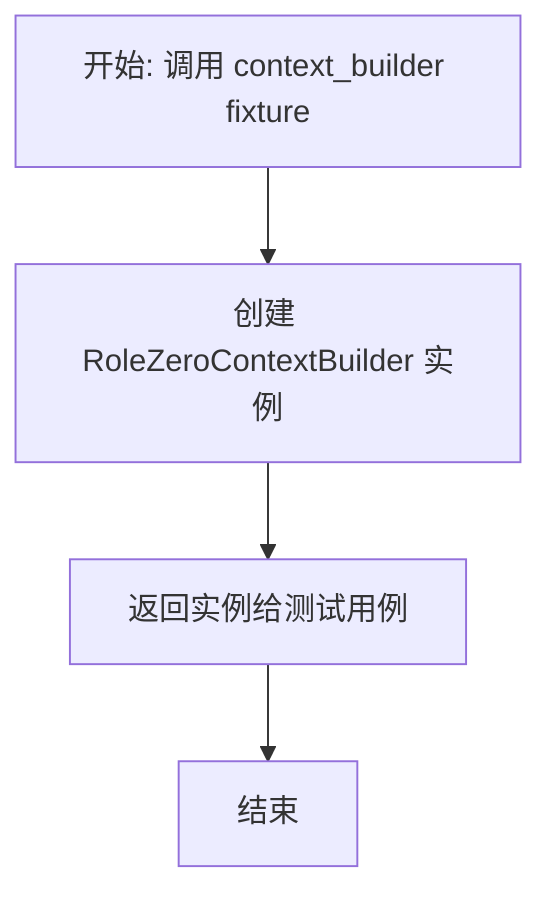
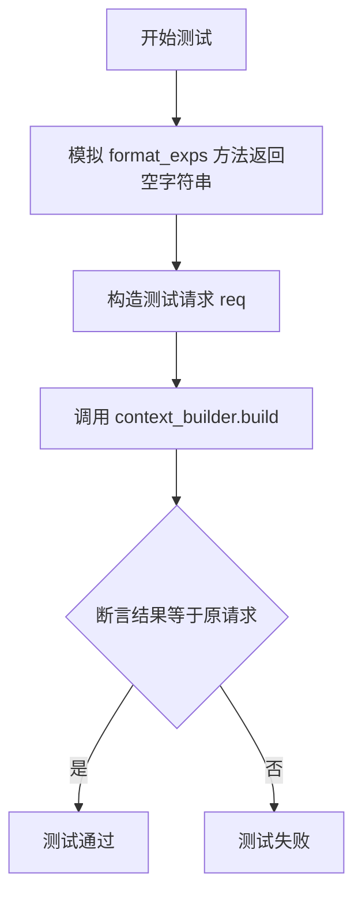
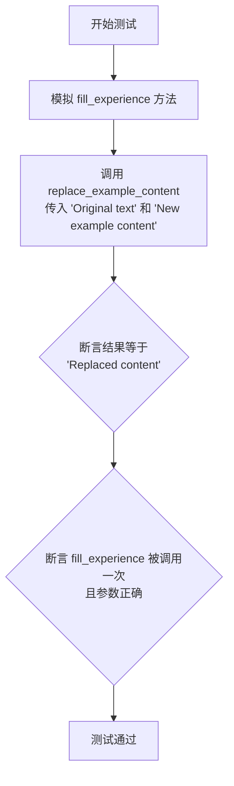
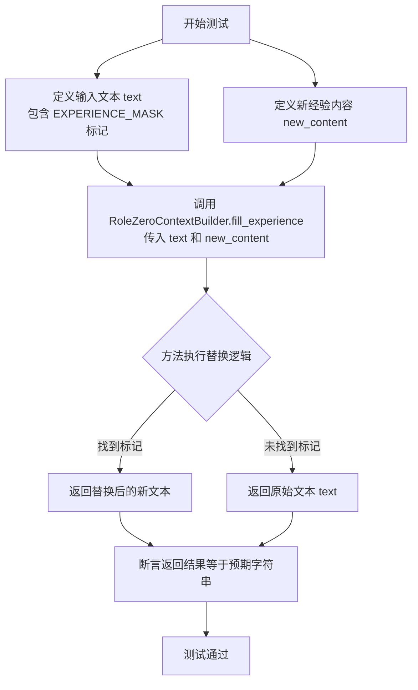
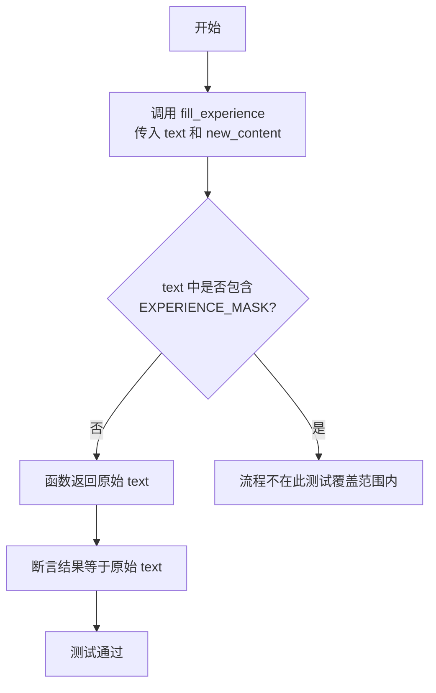

# `.\MetaGPT\tests\metagpt\exp_pool\test_context_builders\test_rolezero_context_builder.py` 详细设计文档

该文件是一个单元测试文件，用于测试 `RoleZeroContextBuilder` 类的功能。`RoleZeroContextBuilder` 是一个上下文构建器，其核心功能是处理包含经验标记的文本模板，并用新的经验内容替换模板中的标记，从而为角色（例如AI代理）构建动态的上下文。测试覆盖了空请求处理、无经验内容处理、有经验内容替换以及具体的标记替换逻辑。

## 整体流程

```mermaid
graph TD
    A[开始执行测试] --> B{选择测试用例}
    B --> C[test_build_empty_req]
    B --> D[test_build_no_experiences]
    B --> E[test_build_with_experiences]
    B --> F[test_replace_example_content]
    B --> G[test_fill_experience]
    B --> H[test_fill_experience_no_match]
    C --> C1[调用 build([])]
    C1 --> C2[断言返回空列表]
    D --> D1[模拟 format_exps 返回空]
    D1 --> D2[调用 build([有内容请求])]
    D2 --> D3[断言返回原请求]
    E --> E1[模拟 format_exps 返回经验]
    E1 --> E2[模拟 replace_example_content 返回新内容]
    E2 --> E3[调用 build([有内容请求])]
    E3 --> E4[断言返回更新后的请求]
    F --> F1[模拟 fill_experience 返回内容]
    F1 --> F2[调用 replace_example_content]
    F2 --> F3[断言返回模拟内容并验证调用]
    G --> G1[构造带标记的文本]
    G1 --> G2[调用 fill_experience 替换标记]
    G2 --> G3[断言替换结果正确]
    H --> H1[构造无标记文本]
    H1 --> H2[调用 fill_experience]
    H2 --> H3[断言文本未改变]
    C2 --> I[测试结束]
    D3 --> I
    E4 --> I
    F3 --> I
    G3 --> I
    H3 --> I
```

## 类结构

```
TestRoleZeroContextBuilder (测试类)
├── context_builder (fixture)
├── test_build_empty_req (异步方法)
├── test_build_no_experiences (异步方法)
├── test_build_with_experiences (异步方法)
├── test_replace_example_content (方法)
├── test_fill_experience (静态方法测试)
└── test_fill_experience_no_match (静态方法测试)
```

## 全局变量及字段


### `EXPERIENCE_MASK`
    
一个用于在文本中标记经验占位符的常量字符串，通常用于标识需要被替换或填充的经验内容部分。

类型：`str`
    


    

## 全局函数及方法

### `TestRoleZeroContextBuilder.context_builder`

这是一个 pytest fixture 方法，用于为 `TestRoleZeroContextBuilder` 测试类中的测试方法提供 `RoleZeroContextBuilder` 实例。它简化了测试设置，确保每个测试都能获得一个干净、独立的待测对象。

参数：

-   `self`：`TestRoleZeroContextBuilder`，测试类实例自身。

返回值：`RoleZeroContextBuilder`，返回一个 `RoleZeroContextBuilder` 类的实例。

#### 流程图



#### 带注释源码

```python
    @pytest.fixture
    # 定义一个名为 `context_builder` 的 pytest fixture。
    # fixture 是 pytest 用于测试准备和清理的机制，它可以被测试函数作为参数注入。
    def context_builder(self):
        # 此 fixture 的唯一操作是创建并返回一个 `RoleZeroContextBuilder` 对象。
        # 这使得所有依赖此 fixture 的测试方法都能获得一个全新的、独立的 builder 实例。
        return RoleZeroContextBuilder()
```

### `TestRoleZeroContextBuilder.test_build_empty_req`

这是一个单元测试方法，用于测试 `RoleZeroContextBuilder.build` 方法在接收到空请求列表（`req=[]`）时的行为。它验证了当输入为空列表时，`build` 方法是否正确地返回一个空列表。

参数：

- `self`：`TestRoleZeroContextBuilder`，测试类实例的引用。
- `context_builder`：`RoleZeroContextBuilder`，由 `@pytest.fixture` 装饰器提供的 `RoleZeroContextBuilder` 实例，作为测试的依赖项。

返回值：`None`，这是一个测试方法，其主要目的是通过断言（`assert`）来验证代码行为，不返回业务逻辑值。

#### 流程图

```mermaid
flowchart TD
    A[开始测试] --> B[调用 context_builder.build<br>传入空列表 req=[]]
    B --> C{方法执行}
    C --> D[返回结果 result]
    D --> E[断言 result == []]
    E --> F[测试通过]
```

#### 带注释源码

```python
    @pytest.mark.asyncio  # 标记此测试为异步测试，以便 pytest-asyncio 插件能正确处理
    async def test_build_empty_req(self, context_builder):
        # 调用被测的异步方法 `build`，并传入一个空列表作为请求参数
        result = await context_builder.build(req=[])
        # 断言：验证 `build` 方法在输入为空列表时，返回的结果也是一个空列表。
        # 这是测试 `RoleZeroContextBuilder` 对边界条件（空输入）的处理。
        assert result == []
```

### `TestRoleZeroContextBuilder.test_build_no_experiences`

该方法用于测试 `RoleZeroContextBuilder` 类的 `build` 方法在传入的请求列表中没有关联经验数据时的行为。它模拟了 `BaseContextBuilder.format_exps` 方法返回空字符串的场景，并验证 `build` 方法是否原样返回了输入的请求列表。

参数：

- `context_builder`：`RoleZeroContextBuilder`，由 `pytest.fixture` 提供的 `RoleZeroContextBuilder` 实例。
- `mocker`：`MockerFixture`，`pytest-mock` 提供的模拟对象，用于模拟依赖的方法。

返回值：`None`，这是一个测试方法，其主要目的是通过断言（`assert`）来验证代码行为，不返回业务值。

#### 流程图



#### 带注释源码

```python
    @pytest.mark.asyncio  # 标记此测试为异步测试
    async def test_build_no_experiences(self, context_builder, mocker):
        # 模拟 BaseContextBuilder 类的 format_exps 方法，使其返回空字符串
        # 这模拟了“没有经验数据”的场景
        mocker.patch.object(BaseContextBuilder, "format_exps", return_value="")
        
        # 构造一个模拟的请求列表，其中包含一个字典，代表一条原始内容
        req = [{"content": "Original content"}]
        
        # 异步调用被测试的 build 方法
        result = await context_builder.build(req=req)
        
        # 断言：当没有格式化经验时，build 方法应原样返回输入的请求列表
        assert result == req
```

### `TestRoleZeroContextBuilder.test_build_with_experiences`

这是一个单元测试方法，用于测试 `RoleZeroContextBuilder` 类的 `build` 方法在传入的请求（`req`）包含经验数据时的行为。它通过模拟（mocking）依赖方法来验证当 `format_exps` 返回格式化后的经验字符串，并且 `replace_example_content` 方法返回更新后的内容时，`build` 方法是否正确地将原始请求内容替换为更新后的内容。

参数：

- `context_builder`：`RoleZeroContextBuilder`，由 `pytest.fixture` 提供的 `RoleZeroContextBuilder` 实例，作为测试对象。
- `mocker`：`MockerFixture`，`pytest-mock` 提供的模拟对象，用于模拟（mock）类的方法。

返回值：`None`，这是一个测试方法，其主要目的是通过断言（assert）来验证代码行为，不返回业务值。

#### 流程图

```mermaid
flowchart TD
    A[开始测试] --> B[模拟BaseContextBuilder.format_exps<br>返回“Formatted experiences”]
    B --> C[模拟RoleZeroContextBuilder.replace_example_content<br>返回“Updated content”]
    C --> D[调用context_builder.build<br>传入req]
    D --> E{断言<br>result == [<br>{"content": "Updated content"}<br>]}
    E --> F[测试通过]
```

#### 带注释源码

```python
    @pytest.mark.asyncio  # 标记此测试为异步测试
    async def test_build_with_experiences(self, context_builder, mocker):
        # 模拟（Mock）BaseContextBuilder类的format_exps方法，使其返回固定的字符串"Formatted experiences"
        mocker.patch.object(BaseContextBuilder, "format_exps", return_value="Formatted experiences")
        # 模拟（Mock）RoleZeroContextBuilder类的replace_example_content方法，使其返回固定的字符串"Updated content"
        mocker.patch.object(RoleZeroContextBuilder, "replace_example_content", return_value="Updated content")
        # 准备测试输入：一个包含字典的列表，字典中有"content"键
        req = [{"content": "Original content 1"}]
        # 调用被测试的异步build方法
        result = await context_builder.build(req=req)
        # 断言：验证build方法的返回结果等于预期的列表，其中内容已被替换为模拟的"Updated content"
        assert result == [{"content": "Updated content"}]
```

### `TestRoleZeroContextBuilder.test_replace_example_content`

该方法是一个单元测试，用于验证 `RoleZeroContextBuilder` 类的 `replace_example_content` 方法的功能。它通过模拟（mocking）`fill_experience` 方法，测试 `replace_example_content` 是否正确调用 `fill_experience` 并返回其结果。

参数：

- `self`：`TestRoleZeroContextBuilder`，测试类实例，用于访问测试上下文。
- `context_builder`：`RoleZeroContextBuilder`，被测试的 `RoleZeroContextBuilder` 实例，作为 pytest fixture 注入。
- `mocker`：`MockerFixture`，pytest-mock 提供的模拟对象，用于创建和管理模拟。

返回值：`None`，这是一个测试方法，其主要目的是进行断言验证，不返回业务值。

#### 流程图



#### 带注释源码

```python
def test_replace_example_content(self, context_builder, mocker):
    # 模拟 RoleZeroContextBuilder 的 fill_experience 方法，使其返回固定的字符串 "Replaced content"
    mocker.patch.object(RoleZeroContextBuilder, "fill_experience", return_value="Replaced content")
    
    # 调用被测试的 replace_example_content 方法，传入原始文本和新的示例内容
    result = context_builder.replace_example_content("Original text", "New example content")
    
    # 断言：方法返回的结果应等于模拟的返回值 "Replaced content"
    assert result == "Replaced content"
    
    # 断言：模拟的 fill_experience 方法应被调用一次，且调用时的参数为 "Original text" 和 "New example content"
    context_builder.fill_experience.assert_called_once_with("Original text", "New example content")
```

### `TestRoleZeroContextBuilder.test_fill_experience`

这是一个单元测试方法，用于测试 `RoleZeroContextBuilder.fill_experience` 静态方法的功能。它验证了该方法能否正确地将新的经验内容（`new_content`）替换到包含特定标记（`EXPERIENCE_MASK`）的原始文本（`text`）中，以及在未找到标记时能否原样返回文本。

参数：
-  `self`：`TestRoleZeroContextBuilder`，测试类实例的引用。
-  无其他显式参数，但测试方法内部使用了硬编码的 `text` 和 `new_content` 变量。

返回值：`None`，这是一个测试方法，其主要目的是通过断言（`assert`）来验证代码行为，不返回业务逻辑值。

#### 流程图



#### 带注释源码

```python
def test_fill_experience(self):
    # 1. 准备测试数据：创建一个包含特定标记 EXPERIENCE_MASK 的模板字符串。
    #    EXPERIENCE_MASK 是一个占位符，预期会被新内容替换。
    text = f"Start\n# Past Experience\n{EXPERIENCE_MASK}\n\n# Instruction\nEnd"
    # 2. 定义将要插入到模板中的新内容。
    new_content = "New content"

    # 3. 执行测试：调用待测试的静态方法 `fill_experience`。
    #    传入原始文本和新的经验内容。
    result = RoleZeroContextBuilder.fill_experience(text, new_content)

    # 4. 定义期望的结果：即模板中的 EXPERIENCE_MASK 被 `new_content` 替换后的字符串。
    expected = "Start\n# Past Experience\nNew content\n\n# Instruction\nEnd"

    # 5. 断言：验证方法的实际返回值 `result` 是否与期望值 `expected` 完全相等。
    #    如果相等，则测试通过，证明替换功能工作正常。
    assert result == expected
```

### `TestRoleZeroContextBuilder.test_fill_experience_no_match`

该方法用于测试 `RoleZeroContextBuilder.fill_experience` 函数在输入文本中不包含经验掩码标记 `EXPERIENCE_MASK` 时的行为。它验证当没有匹配的标记时，函数应原样返回输入文本，而不进行任何替换。

参数：

-  `self`：`TestRoleZeroContextBuilder`，测试类实例的引用。
-  `text`：`str`，输入的文本字符串，其中不包含 `EXPERIENCE_MASK` 标记。
-  `new_content`：`str`，用于替换的新内容字符串。

返回值：`None`，这是一个测试方法，不返回业务值，仅通过断言验证结果。

#### 流程图



#### 带注释源码

```python
def test_fill_experience_no_match(self):
    # 准备测试数据：一个不包含 EXPERIENCE_MASK 标记的文本
    text = "Start\nNo markers\nEnd"
    # 准备用于替换的新内容
    new_content = "New content"
    # 调用被测试的静态方法 fill_experience
    result = RoleZeroContextBuilder.fill_experience(text, new_content)
    # 断言：由于文本中没有掩码标记，结果应与原始文本完全相同
    assert result == text
```

## 关键组件


### 张量索引与惰性加载

代码中未直接涉及张量索引与惰性加载机制。

### 反量化支持

代码中未直接涉及反量化支持机制。

### 量化策略

代码中未直接涉及量化策略。


## 问题及建议


### 已知问题

-   **测试用例对实现细节耦合过强**：`test_build_with_experiences` 和 `test_replace_example_content` 测试用例通过 `mocker.patch.object` 直接模拟了被测试类 `RoleZeroContextBuilder` 及其父类 `BaseContextBuilder` 的内部方法（如 `format_exps`, `replace_example_content`, `fill_experience`）。这种“白盒测试”方式使得测试与具体实现紧密绑定。一旦这些内部方法的实现逻辑、名称或调用方式发生改变，即使 `RoleZeroContextBuilder.build` 方法的对外行为（输入/输出）没有变化，这些测试用例也会失败，增加了不必要的维护成本。

### 优化建议

-   **重构测试用例以减少实现耦合**：建议将测试重点放在 `RoleZeroContextBuilder` 的公共接口（即 `build` 方法）的行为上，而非其内部实现路径。对于 `test_build_with_experiences`，可以创建一个模拟的 `BaseContextBuilder.format_exps` 返回固定值，但应避免模拟 `RoleZeroContextBuilder` 自身的 `replace_example_content` 方法。相反，测试应验证在给定特定输入（`req`）和模拟的父类方法返回值时，`build` 方法的最终输出是否符合预期。这可以通过更精细地构造 `req` 参数和模拟 `format_exps` 的返回值来实现，从而触发 `replace_example_content` 和 `fill_experience` 的真实逻辑，使测试成为更健壮的“黑盒”或“灰盒”测试。
-   **考虑补充边界和异常场景测试**：当前测试覆盖了空请求、无经验、有经验等主要路径。可以考虑增加更多边界条件测试，例如：当 `req` 中包含多个消息字典时；当 `EXPERIENCE_MASK` 在文本中出现多次或格式略有偏差时 `fill_experience` 的行为；当 `new_content` 为空字符串或包含特殊字符（如换行符）时 `fill_experience` 的行为。这有助于提高代码的鲁棒性。
-   **提升测试可读性**：可以为关键的测试用例（如 `test_fill_experience`）添加更详细的断言注释，说明替换逻辑的具体规则，便于其他开发者理解测试意图。


## 其它


### 设计目标与约束

该代码模块的设计目标是提供一个用于构建角色上下文（特别是“RoleZero”角色）的测试套件。它旨在验证 `RoleZeroContextBuilder` 类在多种场景下的行为，包括处理空请求、无经验数据、有经验数据以及其内部方法（如 `fill_experience`）的正确性。约束包括：必须使用 `pytest` 框架进行异步和同步测试；必须模拟（mock）依赖项（如 `BaseContextBuilder.format_exps`）以隔离测试单元；测试用例需覆盖正常流程和边界情况（如无标记文本）。

### 错误处理与异常设计

当前测试代码主要关注正常功能验证，未显式包含错误处理或异常测试。`RoleZeroContextBuilder` 类的方法（如 `fill_experience`）在输入文本不包含特定标记（`EXPERIENCE_MASK`）时，设计为静默返回原文本，这是一种防御性编程策略，避免了抛出异常。测试用例 `test_fill_experience_no_match` 验证了此行为。然而，测试套件未涵盖可能的外部依赖错误（如 `format_exps` 抛出异常）或输入数据格式无效的情况。

### 数据流与状态机

该测试套件验证的数据流主要围绕 `RoleZeroContextBuilder.build` 方法：1) 输入请求 (`req`) 列表；2) 调用 `format_exps`（模拟）获取格式化经验字符串；3) 若经验字符串非空，则对每个请求项调用 `replace_example_content`；4) `replace_example_content` 内部调用 `fill_experience` 方法，用新内容替换文本中的 `EXPERIENCE_MASK` 占位符；5) 返回更新后的请求列表或原列表。测试用例清晰地划分了数据流的不同状态：空请求流、无经验数据流、有经验数据流。代码本身不涉及复杂的状态机，但测试验证了基于输入条件（经验有无）的分支逻辑。

### 外部依赖与接口契约

1.  **pytest**: 测试框架，提供测试发现、运行、断言及夹具（fixture）功能。
2.  **metagpt.const.EXPERIENCE_MASK**: 常量，定义了用于标记经验插入位置的字符串。测试中直接使用该常量进行字符串操作验证。
3.  **BaseContextBuilder**: 父类。测试通过 `mocker.patch.object` 模拟了其 `format_exps` 方法，约定了该异步方法应返回一个字符串（格式化后的经验）。这定义了 `RoleZeroContextBuilder` 对父类方法的依赖契约。
4.  **RoleZeroContextBuilder**: 被测类。测试定义了对其公共接口 `build`（异步）、`replace_example_content`（同步）和静态方法 `fill_experience` 的调用契约，验证其输入输出行为符合预期。

### 测试策略与覆盖范围

测试策略采用单元测试，聚焦于 `RoleZeroContextBuilder` 类的独立功能。通过夹具 (`context_builder`) 提供测试实例，并使用 `mocker` 进行依赖隔离。覆盖范围包括：
*   **方法覆盖**: 测试了 `build`, `replace_example_content`, `fill_experience` 三个主要方法。
*   **场景覆盖**: 包括空输入、无经验数据、有经验数据、标记匹配与不匹配等关键场景。
*   **断言覆盖**: 验证返回值是否与预期完全相等。
未覆盖的方面可能包括：更多边界输入（如 `req` 包含多个复杂项）、`format_exps` 返回异常情况、以及与其他模块整合的集成测试。

    