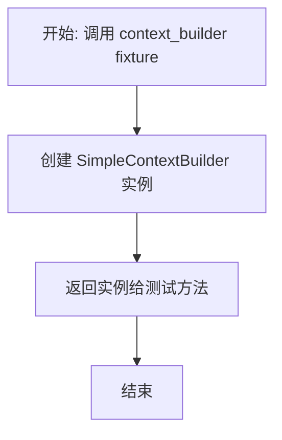
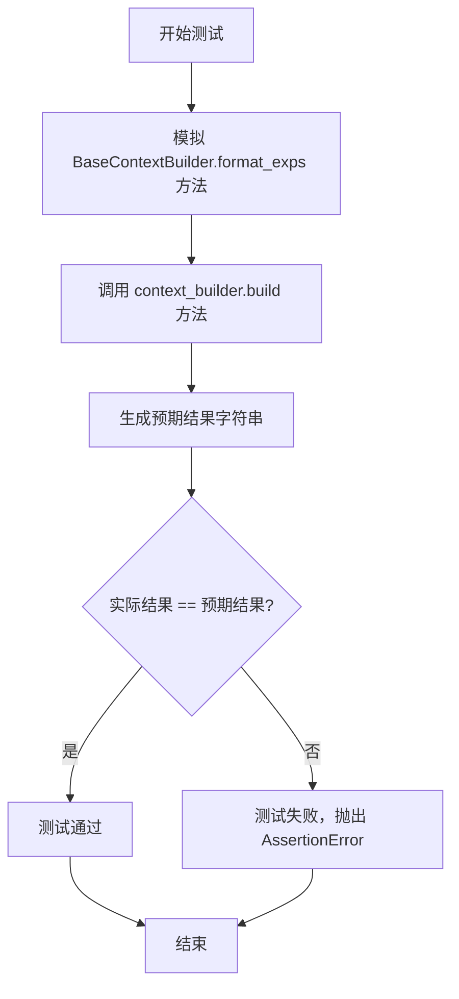
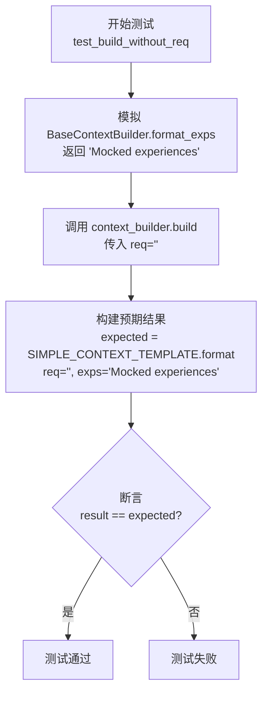

# `.\MetaGPT\tests\metagpt\exp_pool\test_context_builders\test_simple_context_builder.py` 详细设计文档

这是一个使用 pytest 框架编写的单元测试文件，用于测试 SimpleContextBuilder 类的 build 方法。该测试验证了在传入不同参数（有/无请求内容、有/无经验数据）的情况下，build 方法是否能正确调用基类的 format_exps 方法，并按照 SIMPLE_CONTEXT_TEMPLATE 模板格式生成预期的上下文字符串。

## 整体流程

```mermaid
graph TD
    A[开始执行测试] --> B{选择测试用例}
    B --> C[test_build_with_experiences]
    B --> D[test_build_without_experiences]
    B --> E[test_build_without_req]
    C --> F[准备测试数据: req, mock_exps]
    D --> G[准备测试数据: req, 空exps]
    E --> H[准备测试数据: 空req, mock_exps]
    F --> I[调用 context_builder.build(req)]
    G --> I
    H --> I
    I --> J[内部调用 BaseContextBuilder.format_exps]
    J --> K[使用 SIMPLE_CONTEXT_TEMPLATE 格式化结果]
    K --> L[断言结果与预期模板字符串一致]
    L --> M[测试通过]
```

## 类结构

```
TestSimpleContextBuilder (测试类)
├── context_builder (fixture)
├── test_build_with_experiences (测试方法)
├── test_build_without_experiences (测试方法)
└── test_build_without_req (测试方法)
```

## 全局变量及字段


### `SIMPLE_CONTEXT_TEMPLATE`
    
一个字符串模板，用于格式化构建简单上下文的最终输出，通常包含请求和经验的占位符。

类型：`str`
    


    

## 全局函数及方法

### `TestSimpleContextBuilder.context_builder`

这是一个 Pytest 测试夹具（fixture），用于为 `TestSimpleContextBuilder` 测试类中的测试方法提供 `SimpleContextBuilder` 类的实例。它简化了测试设置，确保每个测试方法都能获得一个干净、独立的 `SimpleContextBuilder` 对象。

参数：

-   `self`：`TestSimpleContextBuilder`，指向当前测试类实例的引用。

返回值：`SimpleContextBuilder`，返回一个 `SimpleContextBuilder` 类的新实例。

#### 流程图



#### 带注释源码

```python
    @pytest.fixture
    # 定义一个名为 `context_builder` 的 Pytest 夹具。
    def context_builder(self):
        # 夹具的主体逻辑：创建并返回一个 `SimpleContextBuilder` 类的新实例。
        # 这个实例将被自动注入到任何请求了 `context_builder` 参数的测试方法中。
        return SimpleContextBuilder()
```

### `TestSimpleContextBuilder.test_build_with_experiences`

这是一个使用 `pytest` 和 `pytest-asyncio` 编写的异步单元测试方法，用于测试 `SimpleContextBuilder` 类的 `build` 方法在传入请求字符串和模拟经验数据时的行为。它验证了 `build` 方法是否正确地将请求和格式化后的经验数据填充到预定义的模板中，并返回预期的上下文字符串。

参数：

- `mocker`：`pytest-mock` 提供的 `MockerFixture` 类型对象，用于创建和管理测试中的模拟对象。
- `context_builder`：`SimpleContextBuilder` 类型，由同名的 `@pytest.fixture` 提供，是被测试的 `SimpleContextBuilder` 实例。

返回值：`None`，测试方法通常不返回值，其核心功能是通过断言（`assert`）来验证代码行为是否符合预期。

#### 流程图



#### 带注释源码

```python
    @pytest.mark.asyncio  # 标记此测试函数为异步函数，以便 pytest-asyncio 插件能够正确处理
    async def test_build_with_experiences(self, mocker, context_builder: SimpleContextBuilder):
        # Mock the format_exps method
        # 模拟 BaseContextBuilder 基类中的 format_exps 方法，使其返回一个固定的字符串 "Mocked experiences"
        # 这样可以将测试焦点隔离在 SimpleContextBuilder.build 方法本身，而不依赖 format_exps 的具体实现或外部数据
        mock_exps = "Mocked experiences"
        mocker.patch.object(BaseContextBuilder, "format_exps", return_value=mock_exps)

        # 定义一个测试用的请求字符串
        req = "Test request"
        # 异步调用被测试的 build 方法，传入请求字符串
        result = await context_builder.build(req=req)

        # 根据 SIMPLE_CONTEXT_TEMPLATE 模板、请求字符串和模拟的经验数据，生成预期的结果字符串
        expected = SIMPLE_CONTEXT_TEMPLATE.format(req=req, exps=mock_exps)
        # 使用断言验证 build 方法的实际返回值是否与预期结果完全一致
        # 如果不一致，pytest 将标记此测试为失败
        assert result == expected
```

### `TestSimpleContextBuilder.test_build_without_experiences`

这是一个单元测试方法，用于测试 `SimpleContextBuilder` 类的 `build` 方法在传入的请求（`req`）不为空，但经验（`exps`）为空字符串时的行为。它通过模拟（Mock）父类 `BaseContextBuilder` 的 `format_exps` 方法返回空字符串，来验证 `build` 方法是否能正确处理没有经验数据的情况，并生成符合预期的上下文字符串。

参数：

- `mocker`：`pytest-mock` 提供的 `MockerFixture` 对象，用于创建和管理模拟对象。
- `context_builder`：`SimpleContextBuilder`，由类级别的 `@pytest.fixture` 提供的测试对象实例。

返回值：`None`，这是一个测试方法，其主要目的是通过断言（`assert`）来验证代码行为，不返回业务值。

#### 流程图


#### 带注释源码

```python
    @pytest.mark.asyncio  # 标记此测试为异步测试，需要异步执行环境
    async def test_build_without_experiences(self, mocker, context_builder: SimpleContextBuilder):
        # Mock the format_exps method to return an empty string
        # 模拟（Mock）父类 BaseContextBuilder 的 format_exps 方法，使其返回一个空字符串。
        # 这样做的目的是隔离测试，确保测试只关注 `build` 方法本身在 `exps` 为空时的逻辑，
        # 而不依赖 `format_exps` 的真实实现或外部数据。
        mocker.patch.object(BaseContextBuilder, "format_exps", return_value="")

        # 定义一个测试用的请求字符串。
        req = "Test request"
        # 异步调用被测试的 `build` 方法，并传入请求。
        result = await context_builder.build(req=req)

        # 根据 `SIMPLE_CONTEXT_TEMPLATE` 模板，使用给定的请求（req）和空的模拟经验（exps）构建预期的结果字符串。
        expected = SIMPLE_CONTEXT_TEMPLATE.format(req=req, exps="")
        # 使用断言验证 `build` 方法的实际返回结果是否与预期结果完全一致。
        # 如果不一致，测试将失败，并报告差异。
        assert result == expected
```

### `TestSimpleContextBuilder.test_build_without_req`

这是一个单元测试方法，用于测试 `SimpleContextBuilder` 类的 `build` 方法在传入空请求字符串 (`req=""`) 时的行为。它模拟了父类 `BaseContextBuilder` 的 `format_exps` 方法，并验证 `build` 方法返回的上下文字符串是否符合预期模板。

参数：

- `self`：`TestSimpleContextBuilder`，测试类实例的引用。
- `mocker`：`pytest-mock` 提供的 `MockerFixture` 对象，用于模拟（mock）对象和方法。
- `context_builder`：`SimpleContextBuilder`，由 `@pytest.fixture` 装饰的 `context_builder` 方法提供的 `SimpleContextBuilder` 实例，作为被测对象。

返回值：`None`，测试方法通常不显式返回值，其成功与否由断言决定。

#### 流程图



#### 带注释源码

```python
    @pytest.mark.asyncio  # 标记此测试为异步测试，需要异步执行环境
    async def test_build_without_req(self, mocker, context_builder: SimpleContextBuilder):
        # Mock the format_exps method
        # 模拟 BaseContextBuilder 类的 format_exps 方法，使其返回固定的字符串 "Mocked experiences"
        # 这样测试可以专注于 build 方法本身对空请求的处理逻辑，而不依赖 format_exps 的具体实现
        mock_exps = "Mocked experiences"
        mocker.patch.object(BaseContextBuilder, "format_exps", return_value=mock_exps)

        # 调用被测对象 SimpleContextBuilder 实例的 build 方法，传入一个空字符串作为请求
        result = await context_builder.build(req="")

        # 构建期望的结果：使用 SIMPLE_CONTEXT_TEMPLATE 模板，将空请求和模拟的经验字符串进行格式化
        expected = SIMPLE_CONTEXT_TEMPLATE.format(req="", exps=mock_exps)
        
        # 断言：实际返回的结果必须与期望的结果完全一致
        assert result == expected
```

## 关键组件


### SimpleContextBuilder

一个用于构建简单上下文的类，它继承自BaseContextBuilder，通过模板格式化请求和经验数据来生成最终的上下文字符串。

### SIMPLE_CONTEXT_TEMPLATE

一个字符串模板，定义了SimpleContextBuilder构建上下文时使用的格式，通过替换占位符`{req}`和`{exps}`来整合请求和经验信息。

### BaseContextBuilder

上下文构建器的基类，定义了构建上下文的基本接口和通用方法（如`format_exps`），为具体实现（如SimpleContextBuilder）提供基础框架和可扩展性。

### pytest 测试框架

用于编写和运行单元测试的框架，通过装饰器（如`@pytest.mark.asyncio`）和fixture（如`@pytest.fixture`）支持异步测试和测试资源的生命周期管理。

### mocker 对象

pytest-mock插件提供的模拟对象，用于在测试中替换（patch）真实对象或方法的行为，实现测试隔离并验证代码的交互逻辑。


## 问题及建议


### 已知问题

-   **测试用例对空请求的处理不够严谨**：`test_build_without_req` 测试用例仅测试了空字符串 `req=""` 的情况，但未测试 `req=None` 或其他可能被视为“无请求”的边界情况。这可能导致生产环境中遇到非预期的输入时，代码行为与测试预期不符。
-   **测试用例对 `format_exps` 方法的模拟过于简单**：所有测试用例都使用 `mocker.patch.object` 直接模拟了 `BaseContextBuilder.format_exps` 的返回值，但未验证 `format_exps` 方法是否被以正确的参数调用（例如，是否传入了 `req` 参数）。这可能导致即使 `build` 方法的内部调用逻辑出错，测试也能通过。
-   **缺少对 `SIMPLE_CONTEXT_TEMPLATE` 格式字符串的验证测试**：测试用例假设 `SIMPLE_CONTEXT_TEMPLATE.format(...)` 总能成功。如果模板字符串格式不正确（例如，缺少 `{req}` 或 `{exps}` 占位符），测试将失败，但当前的测试集没有专门针对模板本身健壮性的测试。
-   **测试用例未覆盖 `SimpleContextBuilder` 特有的逻辑**：`SimpleContextBuilder` 可能继承或重写了 `BaseContextBuilder` 的其他方法（如 `format_exps`），但当前的测试完全依赖于模拟父类方法，没有测试子类自身的实现逻辑，这降低了测试的有效性。

### 优化建议

-   **增加边界条件测试**：为 `build` 方法的 `req` 参数增加更多边界值测试用例，例如 `req=None`、`req` 为超长字符串、`req` 包含特殊字符或换行符等，以确保代码的鲁棒性。
-   **增强模拟验证**：在模拟 `format_exps` 方法时，使用 `mocker.spy` 或检查模拟对象的调用参数（如 `mocker.patch.object(..., side_effect=...)` 并在 `side_effect` 函数中验证参数），以确保 `build` 方法内部正确地调用了 `format_exps` 并传递了预期的参数。
-   **补充模板验证测试**：添加一个独立的测试用例或测试函数，专门验证 `SIMPLE_CONTEXT_TEMPLATE` 常量是否是一个有效的格式字符串，并且包含所有必需的占位符。
-   **补充集成或子类逻辑测试**：添加不模拟 `format_exps` 方法的测试用例，直接测试 `SimpleContextBuilder` 实例。这可以测试从 `BaseContextBuilder` 继承来的 `format_exps` 方法的实际行为，或者如果 `SimpleContextBuilder` 重写了该方法，则测试其重写后的逻辑。这能更真实地反映类的行为。
-   **考虑使用参数化测试**：使用 `@pytest.mark.parametrize` 将 `test_build_without_experiences` 和 `test_build_without_req` 等类似测试合并，以减少代码重复并更清晰地表达测试意图。


## 其它


### 设计目标与约束

该测试代码的设计目标是验证 `SimpleContextBuilder` 类在不同输入场景下（包括有/无经验数据、有/无请求内容）的 `build` 方法行为是否符合预期。其核心约束是必须遵循 `BaseContextBuilder` 的接口契约，并确保生成的上下文字符串严格遵循预定义的 `SIMPLE_CONTEXT_TEMPLATE` 模板格式。测试本身不涉及复杂的业务逻辑，旨在保证单元测试的隔离性、可重复性和对边界条件的覆盖。

### 错误处理与异常设计

当前测试代码主要关注正常路径（Happy Path）的验证，未显式测试错误或异常情况。例如，未测试当 `format_exps` 方法抛出异常时 `build` 方法的行为，也未测试 `SIMPLE_CONTEXT_TEMPLATE.format` 调用失败（如模板变量不匹配）的情况。这表明测试覆盖在异常处理方面存在缺口。理想情况下，应补充测试以验证被测试代码在依赖组件异常时的容错性或异常传播行为。

### 数据流与状态机

本测试的数据流相对简单直接：
1.  **输入**：测试用例提供 `req`（请求字符串）参数，并通过 Mock 控制 `format_exps` 方法的返回值（`mock_exps`）。
2.  **处理**：调用 `context_builder.build(req)` 方法。该方法内部调用被 Mock 的 `format_exps`，然后将 `req` 和格式化后的经验字符串 `exps` 填入 `SIMPLE_CONTEXT_TEMPLATE`。
3.  **输出**：生成一个格式化的上下文字符串。
4.  **验证**：将实际输出与根据相同输入和 Mock 数据手动构建的 `expected` 字符串进行比较。

整个测试过程是无状态的，每个测试方法都是独立的，不依赖于共享状态或前序测试的执行结果。

### 外部依赖与接口契约

1.  **外部依赖**：
    *   **pytest & pytest-asyncio**: 测试框架，用于定义测试类、测试方法、夹具（fixture）并支持异步测试。
    *   **metagpt.exp_pool.context_builders.base.BaseContextBuilder**: 被测试类 `SimpleContextBuilder` 的父类。测试中通过 `mocker.patch.object` Mock 了其 `format_exps` 方法，以控制测试输入并隔离对父类实际实现的依赖。
    *   **metagpt.exp_pool.context_builders.simple.SIMPLE_CONTEXT_TEMPLATE**: 一个全局模板字符串，定义了上下文生成的格式。测试验证了输出是否符合此模板。

2.  **接口契约**：
    *   测试验证了 `SimpleContextBuilder.build(req: str) -> Awaitable[str]` 方法遵循的契约：接收一个字符串请求，返回一个异步的字符串上下文。其行为契约是内部调用 `format_exps()` 获取经验字符串，并将 `req` 和该字符串填入固定模板。
    *   通过 Mock `BaseContextBuilder.format_exps`，测试假设了子类与父类之间的一个隐含契约：子类的 `build` 方法会调用父类的 `format_exps` 方法。测试的成功执行依赖于这一调用关系的稳定性。

    