# `.\MetaGPT\tests\metagpt\exp_pool\test_decorator.py` 详细设计文档

该文件是一个针对 MetaGPT 框架中经验池（Experience Pool）缓存机制的单元测试文件。它主要测试了 `ExpCacheHandler` 类和 `exp_cache` 装饰器的功能，验证了它们是否能够正确地根据配置从经验池中读取已有的“完美”经验来避免重复计算，以及在计算新结果后如何评估、打分并存储为新经验。

## 整体流程

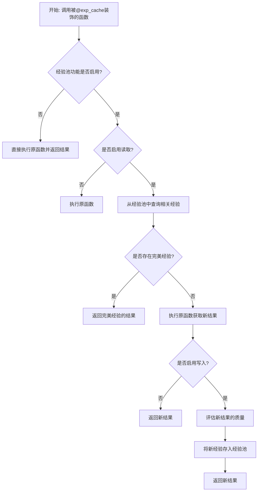

## 类结构

```
TestExpCacheHandler (测试类)
├── mock_func (fixture)
├── mock_exp_manager (fixture)
├── mock_scorer (fixture)
├── mock_perfect_judge (fixture)
├── mock_context_builder (fixture)
├── exp_cache_handler (fixture)
├── test_fetch_experiences (async method)
├── test_get_one_perfect_exp (async method)
├── test_execute_function (async method)
├── test_process_experience (async method)
├── test_evaluate_experience (async method)
├── test_save_experience (method)
├── test_choose_wrapper_async (method)
├── test_choose_wrapper_sync (method)
├── test_validate_params (method)
└── test_generate_tag (method)
TestExpCache (测试类)
├── mock_exp_manager (fixture)
├── mock_scorer (fixture)
├── mock_perfect_judge (fixture)
├── mock_config (fixture)
├── test_exp_cache_disabled (async method)
├── test_exp_cache_enabled_no_perfect_exp (async method)
└── test_exp_cache_enabled_with_perfect_exp (async method)
```

## 全局变量及字段


    

## 全局函数及方法

### `TestExpCacheHandler.mock_func`

这是一个用于单元测试的pytest fixture，它创建并返回一个模拟的异步函数对象。该fixture的主要目的是为`TestExpCacheHandler`类中的其他测试方法提供一个可控制的、模拟的待装饰函数，以便测试`ExpCacheHandler`装饰器逻辑时，无需依赖真实的业务函数实现。

参数：

-  `mocker`：`pytest_mock.plugin.MockerFixture`，pytest-mock插件提供的mocker对象，用于创建模拟对象（mock）。

返回值：`unittest.mock.AsyncMock`，一个模拟的异步函数对象。

#### 流程图

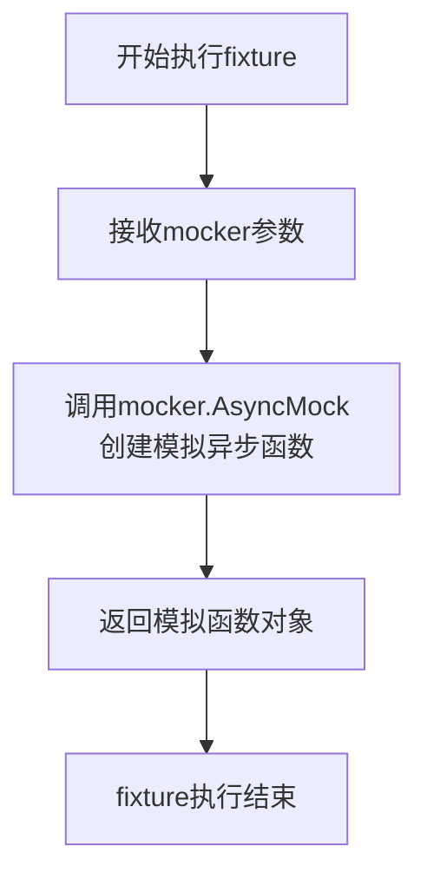

#### 带注释源码

```python
    @pytest.fixture
    # 定义一个pytest fixture，名称为`mock_func`。
    # fixture会在测试函数需要时被自动调用，其返回值会注入到测试函数中。
    def mock_func(self, mocker):
        # 使用pytest-mock插件提供的`mocker`参数来创建一个模拟的异步函数。
        # `AsyncMock`是专门用于模拟异步函数或协程的Mock对象。
        return mocker.AsyncMock()
```

### `TestExpCacheHandler.mock_exp_manager`

这是一个用于测试的 Pytest fixture 函数，用于创建并配置一个模拟的 `ExperienceManager` 对象。它使用 `mocker.MagicMock` 来模拟 `ExperienceManager` 及其关键属性和方法，以便在单元测试中隔离 `ExpCacheHandler` 对真实经验管理器的依赖。

参数：

- `mocker`：`pytest_mock.plugin.MockerFixture`，Pytest-mock 插件提供的模拟对象创建器，用于生成测试替身（如 MagicMock）。

返回值：`unittest.mock.MagicMock`，一个被配置为模拟 `ExperienceManager` 行为的 MagicMock 对象。

#### 流程图

```mermaid
flowchart TD
    A[开始: mock_exp_manager(mocker)] --> B[使用 mocker.MagicMock 创建<br>模拟的 ExperienceManager 对象]
    B --> C[为 manager 对象配置模拟属性<br>storage, config]
    C --> D[为 manager.config.exp_pool<br>赋值为 ExperiencePoolConfig 对象]
    D --> E[为 manager 对象配置模拟方法<br>query_exps, create_exp]
    E --> F[返回配置好的模拟 manager 对象]
    F --> G[结束]
```

#### 带注释源码

```python
    @pytest.fixture
    # 定义一个名为 `mock_exp_manager` 的 Pytest fixture。
    # `mocker` 参数是 pytest-mock 插件注入的，用于创建模拟对象。
    def mock_exp_manager(self, mocker):
        # 使用 mocker.MagicMock 创建一个模拟对象，并通过 spec 参数指定其模拟的是 ExperienceManager 类。
        # 这确保了模拟对象具有与 ExperienceManager 相同的接口，有助于在测试中捕获接口不匹配的错误。
        manager = mocker.MagicMock(spec=ExperienceManager)
        # 为模拟的 manager 对象设置一个名为 `storage` 的属性，并模拟为 SimpleEngine 类型。
        manager.storage = mocker.MagicMock(spec=SimpleEngine)
        # 为模拟的 manager 对象设置一个名为 `config` 的属性，并模拟为 Config 类型。
        manager.config = mocker.MagicMock(spec=Config)
        # 进一步配置 config 对象的 `exp_pool` 属性，将其设置为一个真实的 ExperiencePoolConfig 实例。
        # 这是为了在测试中能够访问 exp_pool 的配置项（如 enabled, enable_read 等）。
        manager.config.exp_pool = ExperiencePoolConfig()
        # 将 manager 的 `query_exps` 方法模拟为一个异步方法 (AsyncMock)。
        # 在测试中，可以设置这个方法的返回值（如 return_value）或断言其被调用情况。
        manager.query_exps = mocker.AsyncMock()
        # 将 manager 的 `create_exp` 方法模拟为一个普通方法 (MagicMock)。
        manager.create_exp = mocker.MagicMock()
        # 返回完全配置好的模拟 manager 对象，供测试用例使用。
        return manager
```

### `TestExpCacheHandler.mock_scorer`

这是一个用于单元测试的pytest fixture，用于创建一个模拟的`SimpleScorer`对象。它使用`mocker.MagicMock`来模拟`SimpleScorer`类，并为其`evaluate`方法配置一个异步模拟对象，以便在测试中控制评分器的行为。

参数：

- `mocker`：`pytest_mock.plugin.MockerFixture`，pytest-mock插件提供的模拟对象创建工具，用于创建和管理测试中的模拟对象。

返回值：`unittest.mock.MagicMock`，一个被配置为模拟`SimpleScorer`行为的MagicMock对象。

#### 流程图

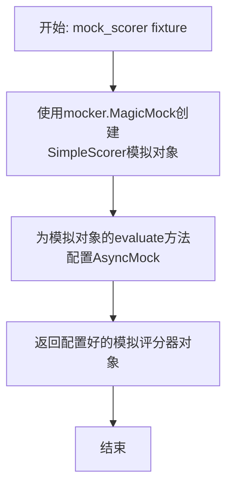

#### 带注释源码

```python
    @pytest.fixture
    def mock_scorer(self, mocker):
        # 使用mocker创建一个MagicMock对象，并指定其spec为SimpleScorer类
        # 这确保了模拟对象具有与SimpleScorer相同的接口
        scorer = mocker.MagicMock(spec=SimpleScorer)
        # 为模拟对象的evaluate方法配置一个AsyncMock（异步模拟）
        # 这允许在异步测试中模拟evaluate方法的调用和返回值
        scorer.evaluate = mocker.AsyncMock()
        # 返回配置好的模拟评分器对象，供测试用例使用
        return scorer
```

### `TestExpCacheHandler.mock_perfect_judge`

这是一个用于单元测试的pytest fixture，用于创建并返回一个模拟的`SimplePerfectJudge`对象。它简化了测试环境，允许测试代码在不依赖真实完美判断器的情况下，模拟其行为。

参数：

-  `mocker`：`pytest_mock.plugin.MockerFixture`，pytest-mock插件提供的mocker对象，用于创建模拟对象。

返回值：`unittest.mock.MagicMock`，一个被模拟的`SimplePerfectJudge`对象实例。

#### 流程图

```mermaid
flowchart TD
    A[开始: mock_perfect_judge(mocker)] --> B[使用mocker.MagicMock创建<br>SimplePerfectJudge的模拟对象]
    B --> C[返回模拟对象]
    C --> D[结束]
```

#### 带注释源码

```python
    @pytest.fixture
    # 定义一个pytest fixture，名为`mock_perfect_judge`。
    # 它的作用是提供一个模拟的`SimplePerfectJudge`对象，供测试用例使用。
    def mock_perfect_judge(self, mocker):
        # 使用传入的`mocker`对象创建一个MagicMock模拟对象。
        # `spec=SimplePerfectJudge`参数指定了这个模拟对象应该模仿`SimplePerfectJudge`类的接口。
        # 这确保了模拟对象具有与真实`SimplePerfectJudge`相同的方法和属性，便于在测试中调用。
        return mocker.MagicMock(spec=SimplePerfectJudge)
```

### `TestExpCacheHandler.mock_context_builder`

这是一个用于测试的 Pytest fixture 方法。它的核心功能是创建一个 `SimpleContextBuilder` 类的模拟（Mock）对象，并将其作为依赖项提供给 `TestExpCacheHandler` 类中的其他测试方法使用。通过模拟，测试可以隔离对 `SimpleContextBuilder` 真实实现的依赖，专注于测试 `ExpCacheHandler` 的行为。

参数：

-  `mocker`：`pytest_mock.plugin.MockerFixture`，Pytest-mock 插件提供的 Mock 夹具，用于创建和管理模拟对象。

返回值：`unittest.mock.MagicMock`，一个被配置为模拟 `SimpleContextBuilder` 类的 `MagicMock` 对象。

#### 流程图

```mermaid
flowchart TD
    A[开始: mock_context_builder(mocker)] --> B[使用 mocker.MagicMock<br>创建 SimpleContextBuilder 的模拟对象]
    B --> C[返回模拟对象]
    C --> D[结束]
```

#### 带注释源码

```python
    @pytest.fixture
    # 定义一个名为 `mock_context_builder` 的 Pytest fixture。
    # Fixture 是测试的依赖项，会在测试函数执行前被调用并注入。
    def mock_context_builder(self, mocker):
        # 使用 `mocker.MagicMock` 创建一个模拟对象。
        # `spec=SimpleContextBuilder` 参数确保模拟对象具有与 `SimpleContextBuilder` 类相同的接口（属性和方法），
        # 这有助于在测试中捕获错误的属性访问或方法调用，提高测试的健壮性。
        return mocker.MagicMock(spec=SimpleContextBuilder)
```

### `TestExpCacheHandler.exp_cache_handler`

这是一个 `pytest` 测试夹具（fixture），用于为 `TestExpCacheHandler` 测试类中的测试方法创建并提供一个配置好的 `ExpCacheHandler` 实例。它通过组合多个模拟依赖项（如函数、经验管理器、评分器等）来构建一个可用于测试的处理器对象。

参数：

- `mock_func`：`mocker.AsyncMock`，一个模拟的异步函数，将被 `ExpCacheHandler` 包装和执行。
- `mock_exp_manager`：`mocker.MagicMock`，一个模拟的 `ExperienceManager` 实例，用于管理经验池的读写操作。
- `mock_scorer`：`mocker.MagicMock`，一个模拟的 `SimpleScorer` 实例，用于评估生成的经验。
- `mock_perfect_judge`：`mocker.MagicMock`，一个模拟的 `SimplePerfectJudge` 实例，用于判断经验是否为“完美”经验。
- `mock_context_builder`：`mocker.MagicMock`，一个模拟的 `SimpleContextBuilder` 实例，用于为被包装的函数构建调用上下文。

返回值：`ExpCacheHandler`，返回一个使用上述模拟对象初始化的 `ExpCacheHandler` 实例，用于后续的单元测试。

#### 流程图

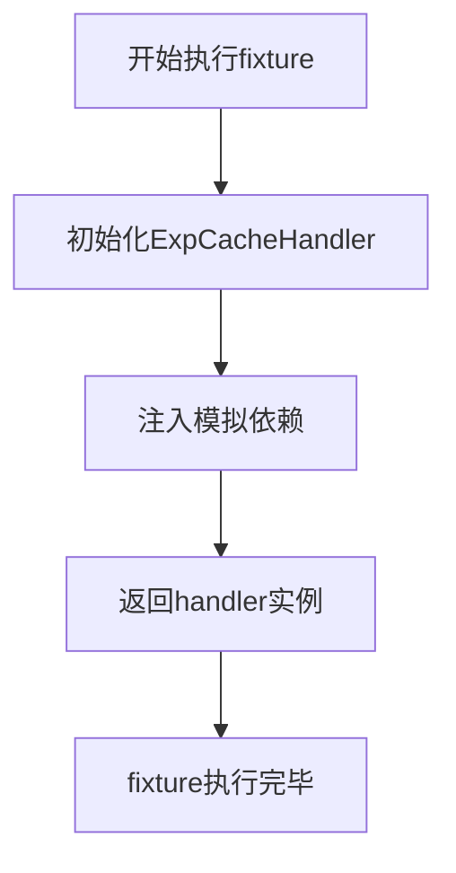

#### 带注释源码

```python
    @pytest.fixture
    # 定义名为 `exp_cache_handler` 的测试夹具
    def exp_cache_handler(self, mock_func, mock_exp_manager, mock_scorer, mock_perfect_judge, mock_context_builder):
        # 创建并返回一个 ExpCacheHandler 实例，所有参数均来自其他夹具提供的模拟对象
        return ExpCacheHandler(
            func=mock_func, # 模拟的待包装函数
            args=(), # 位置参数元组，此处为空
            kwargs={"req": "test_req"}, # 关键字参数字典，包含一个测试请求
            exp_manager=mock_exp_manager, # 模拟的经验管理器
            exp_scorer=mock_scorer, # 模拟的经验评分器
            exp_perfect_judge=mock_perfect_judge, # 模拟的完美经验判断器
            context_builder=mock_context_builder, # 模拟的上下文构建器
        )
```

### `TestExpCacheHandler.test_fetch_experiences`

该方法用于测试 `ExpCacheHandler` 类的 `fetch_experiences` 方法。它模拟了从经验池中查询经验的过程，并验证查询是否被正确调用以及查询结果是否被正确存储。

参数：

-  `exp_cache_handler`：`ExpCacheHandler`，一个已配置好模拟依赖项的 `ExpCacheHandler` 测试实例。
-  `mock_exp_manager`：`MagicMock`，一个模拟的 `ExperienceManager` 对象，用于验证其 `query_exps` 方法是否被调用。

返回值：`None`，这是一个单元测试方法，不返回业务值，仅通过断言验证测试逻辑。

#### 流程图

```mermaid
flowchart TD
    A[开始测试] --> B[设置模拟返回值<br>mock_exp_manager.query_exps.return_value]
    B --> C[调用被测方法<br>exp_cache_handler.fetch_experiences]
    C --> D[验证模拟方法调用<br>mock_exp_manager.query_exps.assert_called_once_with]
    D --> E[验证经验列表长度<br>assert len(exp_cache_handler._exps) == 1]
    E --> F[测试结束]
```

#### 带注释源码

```python
    @pytest.mark.asyncio
    async def test_fetch_experiences(self, exp_cache_handler, mock_exp_manager):
        # 1. 设置模拟行为：当调用 mock_exp_manager.query_exps 时，返回一个包含单个 Experience 对象的列表。
        mock_exp_manager.query_exps.return_value = [Experience(req="test_req", resp="test_resp")]
        
        # 2. 执行被测方法：调用 exp_cache_handler 的 fetch_experiences 方法。
        await exp_cache_handler.fetch_experiences()
        
        # 3. 验证调用：确认 mock_exp_manager.query_exps 被调用了一次，且参数正确。
        #    预期参数为请求字符串 "test_req"，查询类型为语义查询，并带上处理器的标签。
        mock_exp_manager.query_exps.assert_called_once_with(
            "test_req", query_type=QueryType.SEMANTIC, tag=exp_cache_handler.tag
        )
        
        # 4. 验证状态：确认 exp_cache_handler 内部的经验列表 `_exps` 现在包含一个元素。
        assert len(exp_cache_handler._exps) == 1
```

### `TestExpCacheHandler.test_get_one_perfect_exp`

这是一个单元测试方法，用于测试 `ExpCacheHandler` 类的 `get_one_perfect_exp` 方法。它验证了当经验缓存处理器（`ExpCacheHandler`）的缓存列表中存在一个被完美判定器（`SimplePerfectJudge`）判定为“完美”的经验时，`get_one_perfect_exp` 方法能够正确返回该经验的响应内容。

参数：

- `exp_cache_handler`：`ExpCacheHandler`，一个由 `@pytest.fixture` 提供的、经过模拟依赖项配置的 `ExpCacheHandler` 实例，用于测试。
- `mock_perfect_judge`：`SimplePerfectJudge`，一个由 `@pytest.fixture` 提供的、模拟的完美经验判定器。

返回值：`None`，这是一个测试方法，不返回业务值，仅通过断言（`assert`）来验证测试结果。

#### 流程图

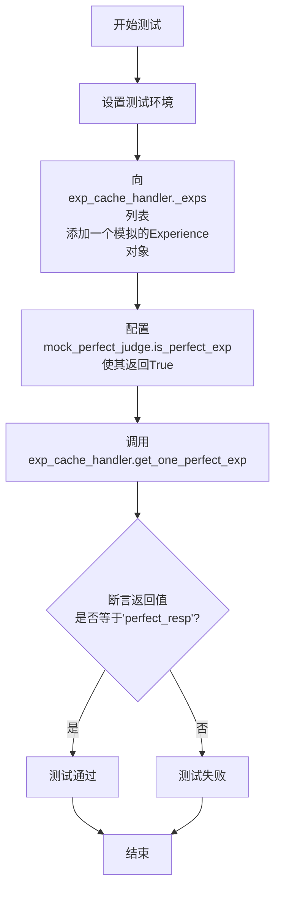

#### 带注释源码

```python
    @pytest.mark.asyncio  # 标记此测试为异步测试，以便pytest-asyncio插件能正确处理
    async def test_get_one_perfect_exp(self, exp_cache_handler, mock_perfect_judge):
        # 1. 准备测试数据：创建一个模拟的“经验”对象
        exp = Experience(req="test_req", resp="perfect_resp")
        # 2. 设置测试场景：将模拟的经验对象放入待测试的handler的内部经验列表 `_exps` 中
        exp_cache_handler._exps = [exp]
        # 3. 配置模拟对象行为：让完美判定器（mock_perfect_judge）对任何经验都返回“是完美的”
        mock_perfect_judge.is_perfect_exp.return_value = True
        # 4. 执行被测试方法：调用 `get_one_perfect_exp` 方法
        result = await exp_cache_handler.get_one_perfect_exp()
        # 5. 验证结果：断言返回的结果是模拟经验中预设的响应内容
        assert result == "perfect_resp"
```

### `TestExpCacheHandler.test_execute_function`

该方法用于测试 `ExpCacheHandler` 类的 `execute_function` 方法。它模拟了 `execute_function` 的执行过程，验证了上下文构建器是否正确构建了上下文，以及被装饰的原始函数是否被正确调用并返回结果。同时，它还检查了 `ExpCacheHandler` 实例是否正确存储了原始响应和处理后的响应。

参数：

-  `exp_cache_handler`：`ExpCacheHandler`，一个配置好的 `ExpCacheHandler` 测试实例，包含了模拟的依赖项。
-  `mock_func`：`AsyncMock`，一个模拟的异步函数，用于替代被 `exp_cache` 装饰器包装的原始函数。
-  `mock_context_builder`：`MagicMock`，一个模拟的上下文构建器，用于构建函数调用所需的上下文。

返回值：`None`，这是一个单元测试方法，不返回任何值，其目的是通过断言来验证代码行为。

#### 流程图

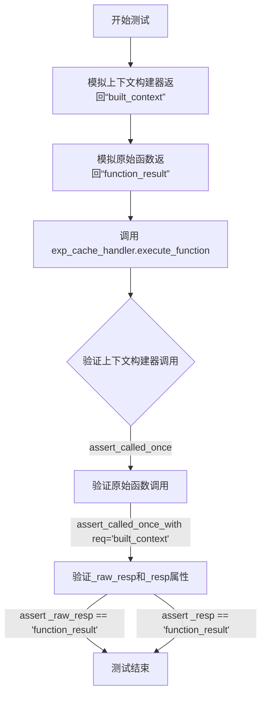

#### 带注释源码

```python
    @pytest.mark.asyncio
    async def test_execute_function(self, exp_cache_handler, mock_func, mock_context_builder):
        # 1. 设置模拟对象的行为
        # 模拟上下文构建器，使其在调用 `build` 方法时返回字符串 "built_context"
        mock_context_builder.build.return_value = "built_context"
        # 模拟被装饰的原始函数，使其在调用时返回字符串 "function_result"
        mock_func.return_value = "function_result"

        # 2. 执行被测试的核心方法
        # 调用 ExpCacheHandler 实例的 `execute_function` 方法。
        # 该方法内部会：
        #   a. 使用 context_builder 构建调用上下文。
        #   b. 使用构建好的上下文调用原始函数 (mock_func)。
        #   c. 将原始函数的返回值分别存储到 `_raw_resp` 和 `_resp` 属性中。
        await exp_cache_handler.execute_function()

        # 3. 验证模拟对象的调用情况
        # 断言上下文构建器的 `build` 方法被调用了一次。
        mock_context_builder.build.assert_called_once()
        # 断言原始函数 (mock_func) 被调用了一次，并且调用参数是 req="built_context"。
        # 这验证了上下文构建的结果被正确传递给了原始函数。
        mock_func.assert_called_once_with(req="built_context")

        # 4. 验证 ExpCacheHandler 实例的状态
        # 断言 `_raw_resp` 属性被设置为原始函数的返回值 "function_result"。
        assert exp_cache_handler._raw_resp == "function_result"
        # 断言 `_resp` 属性也被设置为原始函数的返回值 "function_result"。
        # 在这个测试场景中，`_resp` 和 `_raw_resp` 是相同的，因为还没有进行后续的评分或处理。
        assert exp_cache_handler._resp == "function_result"
```

### `TestExpCacheHandler.test_process_experience`

这是一个单元测试方法，用于测试 `ExpCacheHandler` 类的 `process_experience` 方法。它验证了当处理经验时，评分器（scorer）会被正确调用以评估响应，并且经验管理器（exp_manager）会基于评估结果创建新的经验条目。

参数：

-   `self`：`TestExpCacheHandler`，测试类实例。
-   `exp_cache_handler`：`ExpCacheHandler`，通过 `@pytest.fixture` 装饰器注入的 `ExpCacheHandler` 实例，用于测试。
-   `mock_scorer`：`SimpleScorer`，通过 `@pytest.fixture` 装饰器注入的 `SimpleScorer` 模拟对象，用于模拟评分器。
-   `mock_exp_manager`：`ExperienceManager`，通过 `@pytest.fixture` 装饰器注入的 `ExperienceManager` 模拟对象，用于模拟经验管理器。

返回值：`None`，无返回值。

#### 流程图

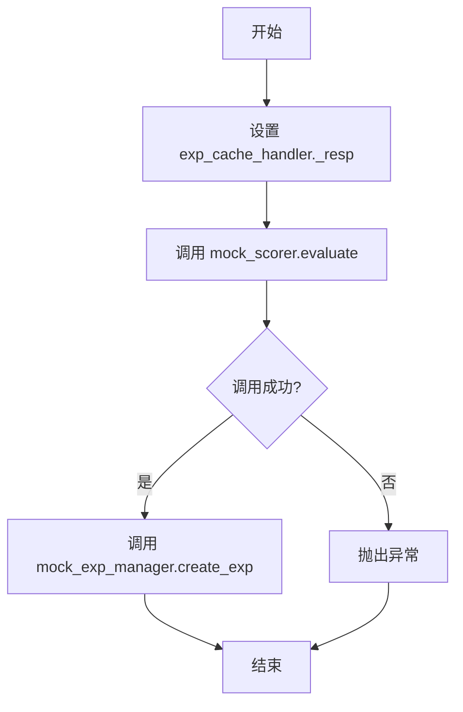

#### 带注释源码

```python
    @pytest.mark.asyncio
    async def test_process_experience(self, exp_cache_handler, mock_scorer, mock_exp_manager):
        # 设置待测试的 ExpCacheHandler 实例的响应内容
        exp_cache_handler._resp = "test_resp"
        # 配置模拟评分器的 evaluate 方法返回一个预设的分数对象
        mock_scorer.evaluate.return_value = Score(val=8)
        # 调用待测试的 process_experience 方法
        await exp_cache_handler.process_experience()
        # 断言评分器的 evaluate 方法被调用了一次
        mock_scorer.evaluate.assert_called_once()
        # 断言经验管理器的 create_exp 方法被调用了一次
        mock_exp_manager.create_exp.assert_called_once()
```

### `TestExpCacheHandler.test_evaluate_experience`

该方法用于测试 `ExpCacheHandler` 类的 `evaluate_experience` 方法。它模拟了经验评估的过程，验证了评分器（`exp_scorer`）被正确调用，并且评估得到的分数被正确设置到处理器的 `_score` 属性中。

参数：

-  `exp_cache_handler`：`ExpCacheHandler`，一个配置好的 `ExpCacheHandler` 测试实例，用于执行测试。
-  `mock_scorer`：`SimpleScorer`，一个模拟的评分器对象，用于验证 `evaluate` 方法是否被调用。

返回值：`None`，这是一个单元测试方法，不返回任何值，仅通过断言来验证测试结果。

#### 流程图

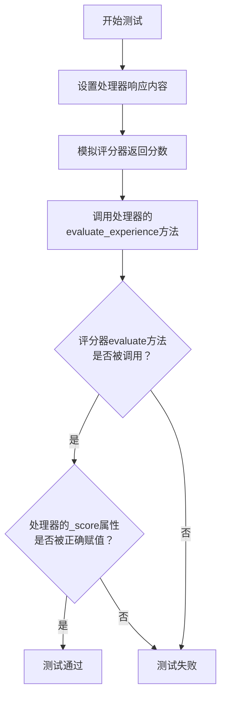

#### 带注释源码

```python
    @pytest.mark.asyncio
    async def test_evaluate_experience(self, exp_cache_handler, mock_scorer):
        # 1. 准备阶段：设置处理器内部的响应内容，模拟一个待评估的响应结果。
        exp_cache_handler._resp = "test_resp"
        # 2. 准备阶段：配置模拟评分器，使其在被调用时返回一个预设的分数对象（Score(val=9)）。
        mock_scorer.evaluate.return_value = Score(val=9)

        # 3. 执行阶段：调用被测试的异步方法 `evaluate_experience`。
        await exp_cache_handler.evaluate_experience()

        # 4. 断言阶段：验证处理器的 `_score` 属性是否被正确设置为模拟评分器返回的分数值（9）。
        assert exp_cache_handler._score.val == 9
```

### `TestExpCacheHandler.test_save_experience`

该方法是一个单元测试，用于验证 `ExpCacheHandler` 类的 `save_experience` 方法是否能够正确调用经验管理器的 `create_exp` 方法来保存经验数据。它通过设置 `ExpCacheHandler` 实例的内部状态（请求、响应、分数），然后调用 `save_experience` 方法，并断言 `mock_exp_manager.create_exp` 被调用了一次。

参数：

-  `exp_cache_handler`：`ExpCacheHandler`，一个配置好的 `ExpCacheHandler` 测试实例，其内部状态（`_req`, `_resp`, `_score`）已被预设。
-  `mock_exp_manager`：`MagicMock`，一个模拟的 `ExperienceManager` 对象，用于验证 `create_exp` 方法是否被调用。

返回值：`None`，该测试方法不返回任何值，仅用于执行断言。

#### 流程图

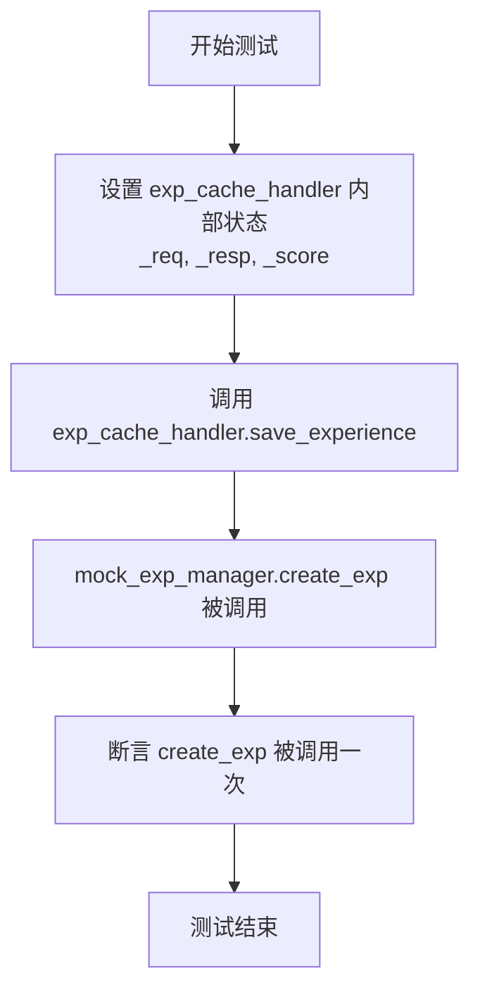

#### 带注释源码

```python
def test_save_experience(self, exp_cache_handler, mock_exp_manager):
    # 设置 ExpCacheHandler 实例的内部状态，模拟一个待保存的经验
    exp_cache_handler._req = "test_req"  # 设置请求内容
    exp_cache_handler._resp = "test_resp" # 设置响应内容
    exp_cache_handler._score = Score(val=7) # 设置经验评分

    # 调用待测试的 save_experience 方法
    exp_cache_handler.save_experience()

    # 验证经验管理器的 create_exp 方法是否被调用了一次
    # 这是测试的核心断言，确保保存逻辑被正确触发
    mock_exp_manager.create_exp.assert_called_once()
```

### `TestExpCacheHandler.test_choose_wrapper_async`

这是一个单元测试方法，用于测试 `ExpCacheHandler.choose_wrapper` 静态方法在传入异步函数时的行为。它验证了当传入一个协程函数时，`choose_wrapper` 方法返回的包装器函数也是一个协程函数。

参数：

-  `mocker`：`pytest-mock` 提供的 `MockerFixture` 类型对象，用于创建和管理测试替身（如 Mock 和 AsyncMock）。

返回值：`None`，这是一个测试方法，其主要目的是进行断言验证，不返回业务逻辑值。

#### 流程图

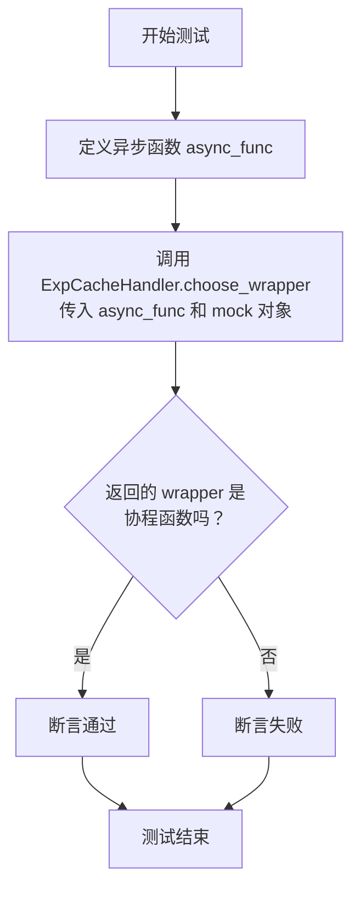

#### 带注释源码

```python
def test_choose_wrapper_async(self, mocker):
    # 1. 定义一个空的异步函数，作为待测试的输入函数
    async def async_func():
        pass

    # 2. 调用被测试的静态方法 `choose_wrapper`。
    #    第一个参数是上面定义的异步函数 `async_func`。
    #    第二个参数是一个 `AsyncMock` 对象，模拟 `ExpCacheHandler` 的实例（在此测试中未使用其具体功能）。
    wrapper = ExpCacheHandler.choose_wrapper(async_func, mocker.AsyncMock())

    # 3. 断言：验证 `choose_wrapper` 方法返回的 `wrapper` 函数是一个协程函数。
    #    这确保了装饰器能正确处理异步函数，保持其异步特性。
    assert asyncio.iscoroutinefunction(wrapper)
```

### `TestExpCacheHandler.test_choose_wrapper_sync`

这是一个单元测试方法，用于测试 `ExpCacheHandler.choose_wrapper` 静态方法在传入同步函数时的行为。它验证了当传入一个同步函数时，`choose_wrapper` 方法返回的包装器函数本身也是一个同步函数（即不是协程函数）。

参数：

-  `mocker`：`pytest-mock` 提供的 `MockerFixture` 类型，用于创建和管理测试替身（Mock/Stub/Spy）。

返回值：`None`，这是一个测试方法，不返回业务值，其目的是通过断言来验证代码行为。

#### 流程图

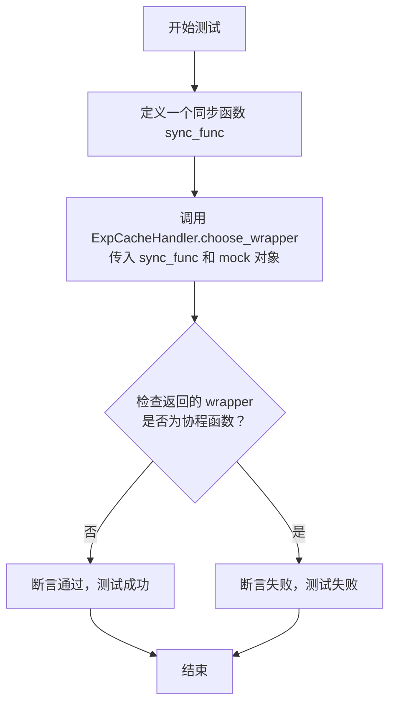

#### 带注释源码

```python
def test_choose_wrapper_sync(self, mocker):
    # 1. 定义一个简单的同步函数作为测试输入
    def sync_func():
        pass

    # 2. 调用被测试的静态方法 `choose_wrapper`。
    #    第一个参数是上面定义的同步函数 `sync_func`。
    #    第二个参数是一个模拟的 `ExperienceManager` 对象（由 `mocker.AsyncMock()` 创建），
    #    用于模拟 `choose_wrapper` 方法内部可能需要的管理器依赖。
    wrapper = ExpCacheHandler.choose_wrapper(sync_func, mocker.AsyncMock())

    # 3. 核心断言：验证 `choose_wrapper` 返回的 `wrapper` 函数不是一个协程函数。
    #    `asyncio.iscoroutinefunction` 用于判断一个函数对象是否是异步的协程函数。
    #    对于同步函数，它应该返回 `False`。这个断言确保了当装饰器应用于同步函数时，
    #    生成的包装器保持了同步性，不会错误地将其转换为异步函数，从而避免调用时的行为异常。
    assert not asyncio.iscoroutinefunction(wrapper)
```

### `TestExpCacheHandler.test_validate_params`

这是一个单元测试方法，用于验证 `ExpCacheHandler` 类的构造函数在接收到无效参数（例如，一个普通的 `lambda` 函数）时，是否会按照预期抛出 `ValueError` 异常。它测试了 `ExpCacheHandler` 对函数签名的基本验证逻辑。

参数：
-  `self`：`TestExpCacheHandler`，测试类实例的引用。

返回值：`None`，此方法不返回任何值，其成功与否由 `pytest.raises` 上下文管理器断言。

#### 流程图

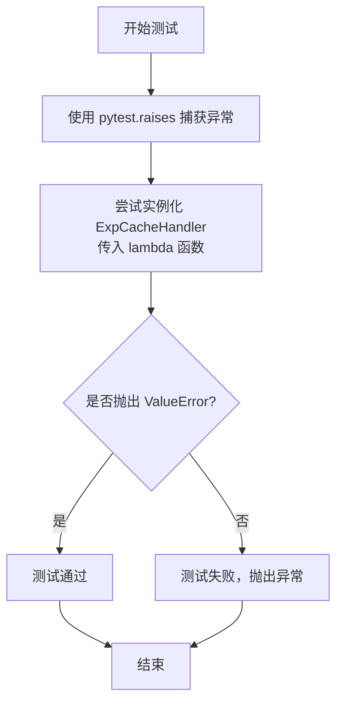

#### 带注释源码

```python
def test_validate_params(self):
    # 使用 pytest.raises 上下文管理器来断言，当尝试使用一个简单的 lambda 函数
    # 实例化 ExpCacheHandler 时，应该会抛出一个 ValueError 异常。
    # 这验证了 ExpCacheHandler 的构造函数对传入的 `func` 参数有特定的要求
    # （例如，需要是一个可获取 `__qualname__` 属性的函数或方法）。
    with pytest.raises(ValueError):
        # 传入一个 lambda 函数作为 `func` 参数，这通常没有 `__qualname__` 属性，
        # 或者其 `__qualname__` 不符合 ExpCacheHandler 的预期，从而触发验证失败。
        ExpCacheHandler(func=lambda x: x, args=(), kwargs={})
```

### `TestExpCacheHandler.test_generate_tag`

这是一个单元测试方法，用于测试 `ExpCacheHandler` 类的 `_generate_tag` 私有方法。该方法的核心功能是根据被装饰的函数对象生成一个唯一的标签（tag），用于在经验池中标识和查询相关的经验。测试验证了当传入一个类方法和一个匿名函数（lambda）时，`_generate_tag` 方法能正确生成预期的标签字符串。

参数：

-  `self`：`TestExpCacheHandler`，测试类实例的引用。

返回值：`None`，这是一个测试方法，不返回业务值，其成功与否由 `assert` 语句判定。

#### 流程图

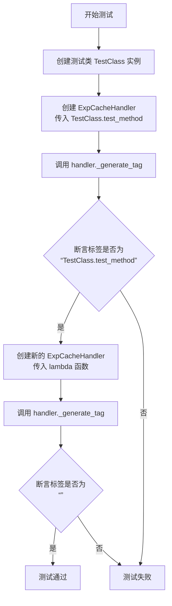

#### 带注释源码

```python
def test_generate_tag(self):
    # 定义一个内部测试类，用于模拟一个包含方法的类
    class TestClass:
        def test_method(self):
            pass

    # 测试场景1：传入一个类实例的方法
    # 创建 ExpCacheHandler 实例，其 func 参数为 TestClass 实例的 test_method 方法
    # args 参数包含 TestClass 实例本身，kwargs 包含一个模拟的请求参数
    handler = ExpCacheHandler(func=TestClass().test_method, args=(TestClass(),), kwargs={"req": "test"})
    # 断言：调用内部方法 _generate_tag 生成的标签应为 “TestClass.test_method”
    # 这验证了对于绑定方法，标签由类名和方法名组成
    assert handler._generate_tag() == "TestClass.test_method"

    # 测试场景2：传入一个匿名函数（lambda）
    # 创建另一个 ExpCacheHandler 实例，其 func 参数为一个简单的 lambda 函数
    handler = ExpCacheHandler(func=lambda x: x, args=(), kwargs={"req": "test"})
    # 断言：对于 lambda 函数，生成的标签应为固定的字符串 “<lambda>”
    assert handler._generate_tag() == "<lambda>"
```

### `TestExpCache.mock_exp_manager`

这是一个 Pytest fixture 方法，用于在 `TestExpCache` 测试类中创建并配置一个模拟的 `ExperienceManager` 对象。它通过 `mocker` 库创建了 `ExperienceManager` 及其关键依赖组件的模拟对象，并设置了它们的默认行为，以便在测试 `exp_cache` 装饰器时，可以隔离并控制外部依赖。

参数：

-   `mocker`：`pytest_mock.plugin.MockerFixture`，Pytest-mock 插件提供的模拟对象创建工具，用于生成测试替身（Mock/MagicMock）。
-   `mock_config`：`pytest.fixture`，另一个 fixture 方法，用于提供模拟的 `Config` 配置对象。

返回值：`unittest.mock.MagicMock`，一个被配置为模拟 `ExperienceManager` 实例的 `MagicMock` 对象。

#### 流程图

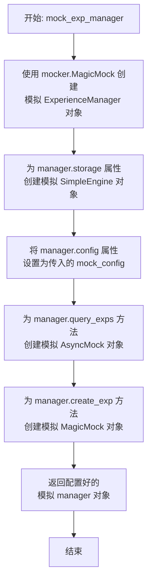

#### 带注释源码

```python
    @pytest.fixture
    # 定义名为 `mock_exp_manager` 的 Pytest fixture，接收 `mocker` 和另一个 fixture `mock_config` 作为参数。
    def mock_exp_manager(self, mocker, mock_config):
        # 使用 mocker.MagicMock 创建一个模拟对象，并指定其规格（spec）为 ExperienceManager 类。
        # 这确保模拟对象具有与 ExperienceManager 相同的接口，但所有方法都是模拟的。
        manager = mocker.MagicMock(spec=ExperienceManager)
        # 为 manager 的 `storage` 属性创建一个模拟对象，规格为 SimpleEngine 类。
        # 这模拟了经验管理器的底层存储引擎。
        manager.storage = mocker.MagicMock(spec=SimpleEngine)
        # 将 manager 的 `config` 属性设置为传入的 `mock_config` fixture 提供的模拟配置对象。
        # 这使得测试可以控制经验池的配置（如是否启用、读写开关等）。
        manager.config = mock_config
        # 为 manager 的 `query_exps` 方法创建一个异步模拟对象（AsyncMock）。
        # 该方法在测试中用于模拟从经验池中查询经验的行为。
        manager.query_exps = mocker.AsyncMock()
        # 为 manager 的 `create_exp` 方法创建一个模拟对象（MagicMock）。
        # 该方法在测试中用于模拟向经验池中创建新经验的行为。
        manager.create_exp = mocker.MagicMock()
        # 返回完全配置好的模拟 manager 对象，供测试用例使用。
        return manager
```

### `TestExpCache.mock_scorer`

这是一个pytest fixture，用于在测试中创建并返回一个模拟的`SimpleScorer`对象。它使用`mocker.MagicMock`来模拟`SimpleScorer`类及其异步方法`evaluate`，以便在测试`exp_cache`装饰器时，可以控制评分器的行为，而无需依赖真实的评分逻辑。

参数：

- `mocker`：`pytest_mock.plugin.MockerFixture`，pytest-mock插件提供的模拟对象创建工具，用于生成测试替身（如Mock和MagicMock）。

返回值：`unittest.mock.MagicMock`，一个被配置为模拟`SimpleScorer`行为的MagicMock对象。其`evaluate`方法被设置为一个返回`Score()`对象的异步Mock。

#### 流程图

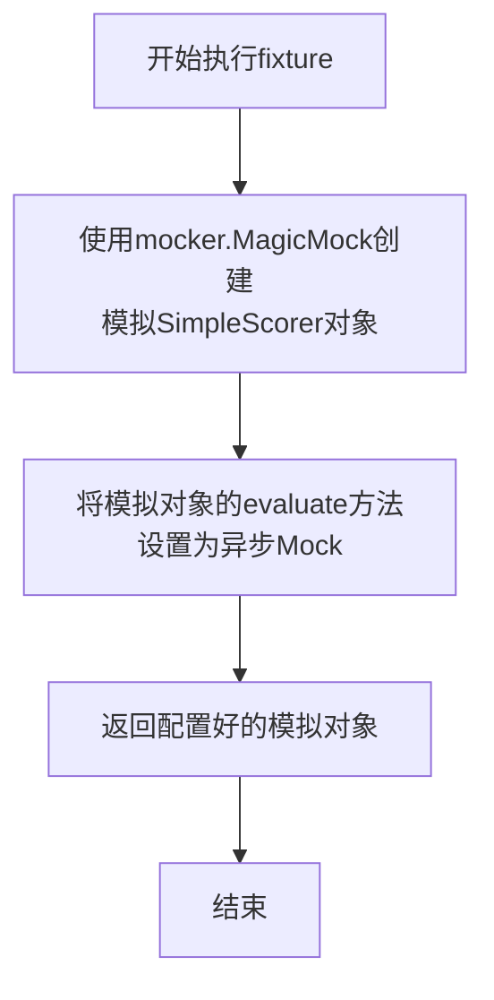

#### 带注释源码

```python
    @pytest.fixture
    def mock_scorer(self, mocker):
        # 使用mocker创建一个MagicMock对象，并指定其spec为SimpleScorer类。
        # 这确保了模拟对象具有与SimpleScorer相同的接口，有助于类型检查和IDE提示。
        scorer = mocker.MagicMock(spec=SimpleScorer)
        # 将模拟对象的`evaluate`方法替换为一个异步Mock对象（AsyncMock）。
        # `return_value=Score()` 设置了这个异步Mock被调用时的默认返回值是一个新的Score实例。
        # 这允许测试用例控制`evaluate`方法的返回结果。
        scorer.evaluate = mocker.AsyncMock(return_value=Score())
        # 返回配置好的模拟评分器对象，供测试函数使用。
        return scorer
```

### `TestExpCache.mock_perfect_judge`

这是一个用于测试的Pytest fixture，用于创建并返回一个模拟的`SimplePerfectJudge`对象。它简化了测试环境，允许测试代码在不依赖真实完美判断器的情况下，模拟其行为。

参数：

-  `mocker`：`pytest_mock.plugin.MockerFixture`，Pytest-mock插件提供的mocker fixture，用于创建模拟对象。

返回值：`unittest.mock.MagicMock`，一个模拟的`SimplePerfectJudge`对象实例。

#### 流程图

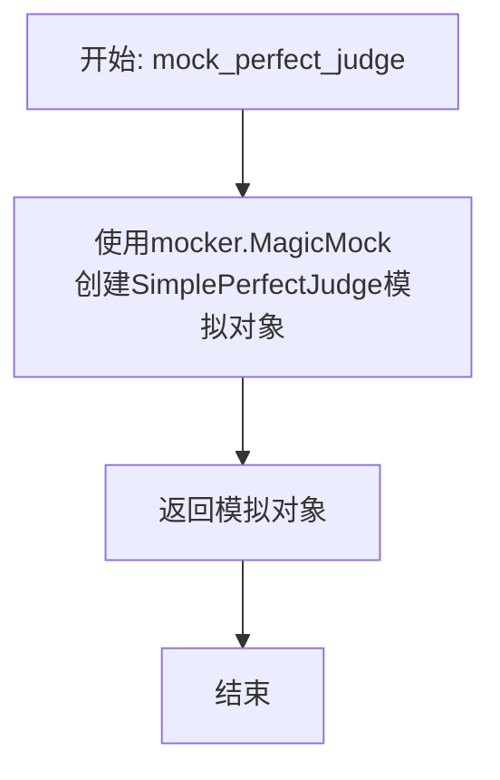

#### 带注释源码

```python
    @pytest.fixture
    def mock_perfect_judge(self, mocker):
        # 使用pytest-mock的mocker fixture创建一个MagicMock对象，
        # 并将其spec设置为SimplePerfectJudge类。
        # 这确保了模拟对象具有与SimplePerfectJudge相同的接口，
        # 便于在测试中模拟其方法（如is_perfect_exp）的行为。
        return mocker.MagicMock(spec=SimplePerfectJudge)
```

### `TestExpCache.mock_config`

这是一个pytest fixture，用于为`TestExpCache`测试类创建一个模拟的`Config`对象。它通过深度复制默认配置并打补丁`Config.default`方法，确保测试使用一个独立的、可修改的配置实例，从而避免测试间的相互影响。

参数：

-  `mocker`：`pytest-mock`库提供的`MockerFixture`对象，用于创建模拟对象和打补丁。

返回值：`Config`，一个模拟的、深度复制的默认配置对象。

#### 流程图

```mermaid
flowchart TD
    A[开始: mock_config(mocker)] --> B[调用 Config.default() 获取默认配置]
    B --> C[深度复制默认配置对象]
    C --> D[使用 mocker.patch 打补丁<br>将 Config.default 替换为返回模拟配置的函数]
    D --> E[返回模拟的配置对象]
    E --> F[结束]
```

#### 带注释源码

```python
@pytest.fixture
def mock_config(self, mocker):
    # 1. 获取默认配置对象
    config = Config.default().model_copy(deep=True)
    # 2. 打补丁：将 Config.default 方法替换为一个返回上面配置对象的模拟函数
    #    这确保了在测试中调用 Config.default() 时，返回的是这个独立的模拟配置，而不是全局默认配置。
    default = mocker.patch("metagpt.config2.Config.default")
    default.return_value = config
    # 3. 返回这个模拟的配置对象，供测试用例使用
    return config
```

### `TestExpCache.test_exp_cache_disabled`

该方法是 `TestExpCache` 测试类中的一个单元测试，用于验证当经验池功能被全局禁用时，`@exp_cache` 装饰器是否能够正确地绕过所有缓存逻辑，直接执行被装饰的原始函数。

参数：

-   `mock_config`：`Config`，一个模拟的配置对象，用于控制测试中的配置状态。
-   `mock_exp_manager`：`ExperienceManager`，一个模拟的经验管理器对象，用于验证其方法是否被调用。

返回值：`None`，该测试方法不返回任何值，其目的是通过断言来验证功能。

#### 流程图

```mermaid
flowchart TD
    A[开始测试] --> B[设置配置<br>mock_config.exp_pool.enabled = False]
    B --> C[定义被装饰的异步函数 test_func]
    C --> D[调用被装饰函数 test_func]
    D --> E{经验池是否启用？}
    E -- 否 --> F[直接执行原始函数<br>返回 'result']
    E -- 是 --> G[执行缓存逻辑<br>（此分支在本次测试中不会执行）]
    F --> H[断言结果等于 'result']
    H --> I[验证经验管理器未执行查询<br>mock_exp_manager.query_exps.assert_not_called]
    I --> J[测试通过]
```

#### 带注释源码

```python
@pytest.mark.asyncio
async def test_exp_cache_disabled(self, mock_config, mock_exp_manager):
    # 1. 设置测试前提：将经验池功能全局禁用
    mock_config.exp_pool.enabled = False

    # 2. 定义一个使用 @exp_cache 装饰的异步函数。
    #    装饰器接收一个模拟的经验管理器作为参数。
    @exp_cache(manager=mock_exp_manager)
    async def test_func(req):
        # 这是被装饰的原始函数，当缓存逻辑被绕过时，它将直接执行。
        return "result"

    # 3. 调用被装饰的函数。
    result = await test_func(req="test")

    # 4. 断言：验证函数返回了原始结果，而不是任何缓存结果。
    assert result == "result"
    # 5. 断言：验证经验管理器的 `query_exps` 方法没有被调用。
    #    这证明了当 `exp_pool.enabled` 为 False 时，装饰器跳过了所有缓存查询逻辑。
    mock_exp_manager.query_exps.assert_not_called()
```

### `TestExpCache.test_exp_cache_enabled_no_perfect_exp`

这是一个单元测试方法，用于测试当经验缓存功能启用，但经验池中没有“完美”经验时，`@exp_cache`装饰器的行为。它验证了在这种情况下，被装饰的函数会被正常执行，其结果会被作为新的经验存储到经验池中。

参数：

-  `self`：`TestExpCache`，测试类实例的引用。
-  `mock_config`：`pytest.fixture`，一个模拟的配置对象，用于控制经验池的启用状态。
-  `mock_exp_manager`：`pytest.fixture`，一个模拟的经验管理器对象，用于模拟经验池的读写操作。
-  `mock_scorer`：`pytest.fixture`，一个模拟的评分器对象，用于对新生成的经验进行评分。

返回值：`None`，这是一个测试方法，不返回业务值，其成功与否由断言（`assert`）决定。

#### 流程图

```mermaid
graph TD
    A[开始测试] --> B[配置经验池为启用状态]
    B --> C[模拟经验管理器返回空经验列表]
    C --> D[使用@exp_cache装饰异步函数test_func]
    D --> E[调用被装饰的test_func]
    E --> F{经验池是否启用?}
    F -- 是 --> G{是否启用读取?}
    G -- 是 --> H[查询经验池]
    H --> I{查询到完美经验?}
    I -- 否 --> J[执行原函数test_func]
    J --> K{是否启用写入?}
    K -- 是 --> L[对结果评分并创建新经验]
    L --> M[断言结果等于原函数返回值]
    M --> N[断言经验管理器被调用查询]
    N --> O[断言经验管理器被调用创建]
    O --> P[测试通过]
    F -- 否 --> Q[直接执行原函数]
    Q --> P
    G -- 否 --> Q
    I -- 是 --> R[返回完美经验结果]
    R --> P
```

#### 带注释源码

```python
    @pytest.mark.asyncio
    async def test_exp_cache_enabled_no_perfect_exp(self, mock_config, mock_exp_manager, mock_scorer):
        # 1. 设置测试前提条件：启用经验池的读取和写入功能
        mock_config.exp_pool.enabled = True
        mock_config.exp_pool.enable_read = True
        mock_config.exp_pool.enable_write = True
        # 2. 模拟经验管理器查询返回空列表，表示没有找到相关经验
        mock_exp_manager.query_exps.return_value = []

        # 3. 定义一个将被@exp_cache装饰的异步测试函数
        @exp_cache(manager=mock_exp_manager, scorer=mock_scorer)
        async def test_func(req):
            # 这个函数体在测试中会被执行，因为查询不到完美经验
            return "computed_result"

        # 4. 执行测试：调用被装饰的函数
        result = await test_func(req="test")
        # 5. 验证结果：应返回原函数计算的结果
        assert result == "computed_result"
        # 6. 验证行为：经验管理器的query_exps方法应该被调用过（因为启用了读取）
        mock_exp_manager.query_exps.assert_called()
        # 7. 验证行为：经验管理器的create_exp方法应该被调用过（因为启用了写入，且没有命中缓存）
        mock_exp_manager.create_exp.assert_called()
```

### `TestExpCache.test_exp_cache_enabled_with_perfect_exp`

这是一个单元测试方法，用于测试当经验缓存功能启用且存在“完美经验”时，`@exp_cache`装饰器的行为。它验证了当从经验池中查询到一条被判定为“完美”的经验时，装饰的函数不会被调用，而是直接返回该完美经验的响应结果。

参数：

-  `mock_config`：`<class '_pytest.fixtures.FixtureRequest'>`，pytest fixture，用于提供模拟的配置对象。
-  `mock_exp_manager`：`<class '_pytest.fixtures.FixtureRequest'>`，pytest fixture，用于提供模拟的经验管理器对象。
-  `mock_perfect_judge`：`<class '_pytest.fixtures.FixtureRequest'>`，pytest fixture，用于提供模拟的完美经验判定器对象。

返回值：`<class 'NoneType'>`，无返回值。这是一个测试方法，其目的是通过断言来验证功能，不返回业务值。

#### 流程图

```mermaid
graph TD
    A[开始测试] --> B[设置配置: 启用经验池/读/写]
    B --> C[设置经验管理器: 返回一个完美经验]
    C --> D[设置完美判定器: 判定经验为完美]
    D --> E[定义被装饰的异步函数 test_func]
    E --> F[调用被装饰的函数 test_func]
    F --> G{装饰器逻辑执行}
    G --> H[查询经验池]
    H --> I[获取到完美经验]
    I --> J[判定为完美经验]
    J --> K[直接返回完美经验的响应]
    K --> L[断言: 返回结果为完美响应]
    L --> M[断言: 经验管理器查询被调用一次]
    M --> N[断言: 经验管理器未创建新经验]
    N --> O[测试通过]
```

#### 带注释源码

```python
    @pytest.mark.asyncio
    async def test_exp_cache_enabled_with_perfect_exp(self, mock_config, mock_exp_manager, mock_perfect_judge):
        # 1. 配置准备阶段：启用经验池相关功能
        mock_config.exp_pool.enabled = True
        mock_config.exp_pool.enable_read = True
        mock_config.exp_pool.enable_write = True
        
        # 2. 数据准备阶段：创建一个模拟的“完美经验”
        perfect_exp = Experience(req="test", resp="perfect_result")
        # 设置经验管理器的查询方法，使其返回包含该完美经验的列表
        mock_exp_manager.query_exps.return_value = [perfect_exp]
        # 设置完美经验判定器，使其总是将经验判定为“完美”
        mock_perfect_judge.is_perfect_exp.return_value = True

        # 3. 测试对象构建阶段：使用exp_cache装饰器装饰一个测试函数
        @exp_cache(manager=mock_exp_manager, perfect_judge=mock_perfect_judge)
        async def test_func(req):
            # 这个函数体不应该被执行，因为期望从缓存中返回完美经验
            return "should_not_be_called"

        # 4. 测试执行阶段：调用被装饰的函数
        result = await test_func(req="test")
        
        # 5. 断言验证阶段：
        # 5.1 验证返回的结果是来自完美经验的响应，而不是函数体计算的结果
        assert result == "perfect_result"
        # 5.2 验证经验管理器的查询方法被调用了一次
        mock_exp_manager.query_exps.assert_called_once()
        # 5.3 验证经验管理器没有创建新的经验（因为使用了完美缓存，无需保存）
        mock_exp_manager.create_exp.assert_not_called()
```

## 关键组件


### 经验缓存处理器 (ExpCacheHandler)

负责协调经验池的读取、执行、评估和写入流程的核心组件。它封装了被装饰的函数，在执行前尝试从经验池中查找完美匹配的经验，执行后对结果进行评估并决定是否将新经验存入池中。

### 经验缓存装饰器 (exp_cache)

一个函数装饰器，用于为异步或同步函数自动添加经验缓存能力。它根据配置决定是否启用缓存，并负责创建和管理`ExpCacheHandler`实例来执行完整的缓存逻辑。

### 经验管理器 (ExperienceManager)

经验池的中央管理器，负责与底层存储引擎（如RAG引擎）交互，执行经验的查询和创建操作。它是连接缓存逻辑与持久化存储的桥梁。

### 经验评分器 (Scorer)

负责评估函数执行结果（经验）质量的组件。通过`evaluate`方法为经验生成一个`Score`对象，用于决定该经验是否值得存入经验池。

### 完美经验判定器 (PerfectJudge)

负责判断从经验池中检索到的经验是否为“完美”匹配当前请求的组件。通过`is_perfect_exp`方法进行判定，如果找到完美经验，则直接返回该经验结果，无需执行原函数。

### 上下文构建器 (ContextBuilder)

负责在执行被装饰函数前，根据原始请求参数构建执行上下文的组件。通过`build`方法，可以将原始请求转换为函数执行所需的格式，提供了请求预处理和转换的灵活性。

### 经验池配置 (ExperiencePoolConfig)

控制经验池行为的配置类，包含是否启用经验池、是否启用读取（查询）和写入（创建）等开关，允许动态调整缓存策略。

### 经验存储引擎 (SimpleEngine)

作为经验池的底层存储后端，具体实现经验的向量化存储和语义检索功能。`ExperienceManager`通过它来执行实际的查询和存储操作。


## 问题及建议

### 已知问题

1.  **测试代码与生产代码耦合**：测试类 `TestExpCacheHandler` 和 `TestExpCache` 直接导入了大量生产代码的类（如 `ExperienceManager`, `SimpleScorer` 等），并对其进行了复杂的模拟（Mock）。这使得测试代码变得冗长、脆弱，且难以维护。任何生产代码的接口变更都可能需要同步修改多个测试用例。
2.  **测试覆盖不完整**：测试主要集中在装饰器 `exp_cache` 和处理器 `ExpCacheHandler` 的“成功路径”上。对于错误处理、边界条件（如评分器返回 `None`、经验管理器存储失败、上下文构建失败等）以及同步函数的包装逻辑，缺乏充分的测试用例。
3.  **模拟（Mock）过于复杂**：测试用例中构建了复杂的模拟对象链（如 `mock_exp_manager` 需要模拟 `storage`, `config`, `query_exps`, `create_exp` 等多个属性和方法）。这不仅增加了测试的编写和维护成本，也可能因为模拟不准确而掩盖了真实的集成问题。
4.  **配置管理在测试中不一致**：`TestExpCache` 使用了 `Config.default().model_copy(deep=True)` 来获取配置，并通过 `mocker.patch` 修改默认配置。这种方式不够直观，且可能与其他测试用例产生意外的配置冲突。`TestExpCacheHandler` 则直接模拟了 `Config` 对象，两种方式并存，缺乏统一模式。
5.  **异步测试潜在问题**：测试方法使用了 `@pytest.mark.asyncio` 装饰器。虽然这是标准做法，但在某些复杂的测试场景或与其他异步库集成时，可能需要更精细的事件循环管理，目前的测试代码未体现这一点。

### 优化建议

1.  **重构测试结构，降低耦合**：
    *   考虑为 `ExpCacheHandler` 和 `exp_cache` 装饰器定义更清晰、更稳定的接口（Interface）或协议（Protocol）。测试代码应依赖于这些抽象接口，而非具体的实现类。
    *   将复杂的模拟对象创建逻辑（如 `mock_exp_manager`）提取到可重用的测试夹具（fixture）或工厂函数中，减少重复代码。
    *   使用 `pytest` 的依赖注入和参数化功能，使测试用例更简洁、更专注于特定行为。

2.  **补充关键场景的测试用例**：
    *   **错误处理**：增加测试用例，验证当 `exp_scorer.evaluate`、`exp_manager.create_exp`、`context_builder.build` 等方法抛出异常时，系统的行为是否符合预期（例如，是否记录日志、是否回退到执行原函数等）。
    *   **边界条件**：测试 `enable_read=False` 或 `enable_write=False` 时的行为。测试当 `perfect_judge.is_perfect_exp` 返回 `False` 时，是否会继续执行原函数。测试当查询到的经验列表为空时的处理逻辑。
    *   **同步函数**：为 `ExpCacheHandler.choose_wrapper` 方法中处理同步函数的分支编写更详尽的测试，确保装饰器对同步和异步函数的包装行为一致且正确。

3.  **简化模拟，引入集成测试**：
    *   在可能的情况下，使用真实的、轻量级的实现（如内存存储的 `SimpleEngine`）替代复杂的模拟，编写一些集成测试。这有助于发现组件间交互的真实问题。
    *   对于必须模拟的复杂依赖，考虑使用 `unittest.mock.patch` 在更小的范围内进行模拟，或者使用专门的测试替身（Test Double）库来创建更逼真的模拟。

4.  **统一并改进测试配置管理**：
    *   创建一个专门的测试配置夹具，明确地为每个测试用例提供其所需的、隔离的配置实例，避免修改全局默认配置。
    *   使用 `pytest` 的 `monkeypatch` 或 `unittest.mock.patch` 在测试方法或夹具级别临时修改配置，确保修改不会泄漏到其他测试。

5.  **提升测试可读性与维护性**：
    *   为每个测试用例添加清晰、描述性的文档字符串，说明测试的目标和场景。
    *   使用 `pytest` 的参数化功能（`@pytest.mark.parametrize`）来测试同一功能在不同输入下的行为，减少重复的测试代码。
    *   考虑将大型的测试类（如 `TestExpCacheHandler`）按职责拆分为多个更小的测试类，例如 `TestExpCacheHandlerFetch`、`TestExpCacheHandlerExecute` 等，使每个测试类更聚焦。

## 其它


### 设计目标与约束

本代码模块的核心设计目标是实现一个基于经验池（Experience Pool）的智能缓存机制，用于包装函数调用。其主要目标包括：
1.  **性能优化**：通过缓存历史经验（函数请求与响应），在后续遇到相似请求时，直接返回高质量的缓存结果，避免重复执行计算密集型或耗时函数。
2.  **质量保证**：引入评分器（Scorer）和完美判断器（Perfect Judge）对函数响应进行评估和筛选，确保返回的缓存结果满足一定的质量标准。
3.  **非侵入式集成**：通过装饰器（`@exp_cache`）的方式，允许开发者以最小的代码改动为现有函数添加经验缓存能力。
4.  **灵活配置**：支持通过配置（`ExperiencePoolConfig`）动态启用/禁用缓存、读写开关，并允许注入自定义的评分器、完美判断器和上下文构建器。
5.  **异步友好**：原生支持异步函数，并提供了对同步函数的兼容性处理。

主要设计约束包括：
*   对 `ExperienceManager`、`SimpleScorer`、`SimplePerfectJudge`、`SimpleContextBuilder` 等外部组件的接口依赖。
*   缓存逻辑的复杂性需要与业务逻辑解耦，确保装饰器本身职责单一。
*   需要处理异步和同步函数的统一包装逻辑。

### 错误处理与异常设计

模块中的错误处理策略如下：
1.  **参数验证**：`ExpCacheHandler` 的 `__init__` 方法（通过 `validate_params` 方法）会验证被装饰函数（`func`）是否可调用，如果不可调用则抛出 `ValueError`。这是对装饰器使用方式的基础保障。
2.  **组件操作异常**：`fetch_experiences`、`execute_function`、`process_experience` 等方法中调用的外部组件方法（如 `query_exps`、`evaluate`）是异步的，其可能抛出的异常（如网络错误、评估逻辑错误）会直接向上层（装饰器调用者）传播。模块本身没有捕获这些异常，意味着缓存机制的失败不应影响业务函数的核心可用性，但调用者需要知晓缓存可能未生效。
3.  **降级机制**：在 `exp_cache` 装饰器的包装函数 `wrapper` 中，如果经验池功能被全局禁用（`config.exp_pool.enabled == False`），则直接执行原函数，绕过所有缓存逻辑。这是一种显式的功能降级。
4.  **测试覆盖的异常场景**：单元测试 `test_validate_params` 专门验证了参数错误会触发 `ValueError`，确保了错误处理逻辑的正确性。

整体上，错误处理设计偏向“快速失败”和“透明传播”，将非核心缓存组件的异常暴露给调用方，同时提供配置级的开关作为安全兜底。

### 数据流与状态机

`ExpCacheHandler` 对象在处理一次函数调用时，其内部状态和数据流转遵循一个清晰的流程，可以视为一个简化的状态机：

1.  **初始化状态**：Handler 被创建，持有原始函数 `func`、参数、以及各组件（manager, scorer等）的引用。`_exps`（查询到的经验列表）、`_raw_resp`（原始响应）、`_resp`（最终响应）、`_score`（评分）等字段为空。
2.  **读取阶段（`fetch_experiences`）**：如果启用读取（`enable_read`），则根据请求内容查询经验池，结果存入 `_exps`。
3.  **判断阶段（`get_one_perfect_exp`）**：遍历 `_exps`，使用 `perfect_judge` 判断是否存在“完美”经验。如果找到，则将其响应作为最终结果，流程直接跳转到结束，**不执行原函数**。此时 `_resp` 被设置为缓存结果，`_raw_resp` 为空。
4.  **执行阶段（`execute_function`）**：如果未找到完美缓存，则通过 `context_builder` 构建执行上下文，然后调用原始函数 `func`。原始结果存入 `_raw_resp`，并同时赋值给 `_resp`。
5.  **评估与写入阶段**：
    *   **评估（`evaluate_experience`）**：使用 `scorer` 对 `_resp` 进行评分，结果存入 `_score`。
    *   **处理与保存（`process_experience` / `save_experience`）**：如果启用写入（`enable_write`），则将本次请求、响应、评分等信息组合成一个新的 `Experience` 对象，通过 `exp_manager` 保存到经验池中。
6.  **结束状态**：返回 `_resp` 作为函数调用的最终结果。

这个流程由 `exp_cache` 装饰器中的 `wrapper` 函数协调控制。`ExpCacheHandler` 自身的方法（如 `run`）在测试中未直接展示，但可以推断其封装了上述主要步骤的顺序调用。

### 外部依赖与接口契约

本模块严重依赖以下几个外部组件，并遵循明确的接口契约：

1.  **ExperienceManager**：
    *   **契约**：提供经验存储和检索的核心能力。
    *   **关键方法**：`query_exps(query: str, query_type: QueryType, tag: str) -> List[Experience]`（异步），`create_exp(exp: Experience)`。
    *   **用途**：用于读取历史经验和保存新经验。

2.  **SimpleScorer** (或类似 `ExpScorer` 接口)：
    *   **契约**：能够对给定的请求-响应对进行质量评分。
    *   **关键方法**：`evaluate(req: str, resp: str) -> Score`（异步）。
    *   **用途**：在写入缓存前评估新生成经验的质量。

3.  **SimplePerfectJudge** (或类似 `ExpPerfectJudge` 接口)：
    *   **契约**：能够判断一个经验是否“完美”，即可直接作为缓存返回而无需执行函数。
    *   **关键方法**：`is_perfect_exp(exp: Experience) -> bool`。
    *   **用途**：在读取阶段筛选高质量缓存。

4.  **SimpleContextBuilder** (或类似 `ContextBuilder` 接口)：
    *   **契约**：能够将原始的请求参数转换为适合原函数执行的上下文。
    *   **关键方法**：`build(*args, **kwargs) -> Any`。
    *   **用途**：在调用被装饰函数前，可能需要对参数进行预处理或包装。

5.  **Config 与 ExperiencePoolConfig**：
    *   **契约**：提供全局和缓存相关的配置项，如 `enabled`, `enable_read`, `enable_write`。
    *   **用途**：控制缓存功能的开关和行为。

6.  **pytest & mocker**：
    *   **契约**：测试框架和测试工具。
    *   **用途**：仅在单元测试中使用，用于构建测试夹具（fixtures）和模拟（mock）上述依赖组件，实现隔离测试。

这些依赖通过构造函数注入到 `ExpCacheHandler` 中，或作为参数传递给 `@exp_cache` 装饰器，符合依赖反转原则，使得核心缓存逻辑与具体的组件实现解耦。

    