# `.\MetaGPT\tests\metagpt\exp_pool\test_manager.py` 详细设计文档

该文件是一个使用pytest框架编写的单元测试文件，用于测试ExperienceManager类的功能。ExperienceManager是一个经验池管理器，负责管理AI代理的经验数据，包括经验的创建、查询、计数以及根据配置（如是否启用读写、检索类型BM25或Chroma）初始化不同的底层存储引擎。测试覆盖了存储属性的懒加载、读写功能的开关控制、基于精确匹配和标签过滤的查询、经验计数以及不同存储引擎（BM25和Chroma）的解析与创建逻辑。

## 整体流程

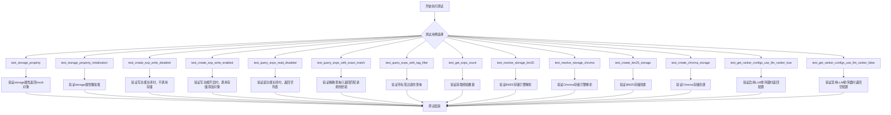

## 类结构

```
TestExperienceManager (测试类)
├── mock_config (fixture)
├── mock_storage (fixture)
├── exp_manager (fixture)
├── test_storage_property (方法)
├── test_storage_property_initialization (方法)
├── test_create_exp_write_disabled (方法)
├── test_create_exp_write_enabled (方法)
├── test_query_exps_read_disabled (方法)
├── test_query_exps_with_exact_match (方法)
├── test_query_exps_with_tag_filter (方法)
├── test_get_exps_count (方法)
├── test_resolve_storage_bm25 (方法)
├── test_resolve_storage_chroma (方法)
├── test_create_bm25_storage (方法)
└── test_create_chroma_storage (方法)
    test_get_ranker_configs_use_llm_ranker_true (方法)
    test_get_ranker_configs_use_llm_ranker_false (方法)
```

## 全局变量及字段


### `ExperienceManager._storage`
    
用于存储和检索经验数据的存储引擎实例，采用懒加载模式初始化。

类型：`Optional[StorageEngine]`
    


### `ExperienceManager.config`
    
包含经验池配置（如读写开关、检索类型等）的应用程序配置对象。

类型：`Config`
    
    

## 全局函数及方法

### `TestExperienceManager.mock_config`

这是一个用于测试的pytest fixture方法，用于创建一个模拟的`Config`对象。该配置对象包含了测试`ExperienceManager`类时所需的最小化配置，特别是启用了经验池的读写功能，并指定了BM25作为检索类型。

参数：
- `self`：`TestExperienceManager`， 测试类实例的引用。

返回值：`Config`， 一个配置了LLM和启用BM25检索的经验池的模拟配置对象。

#### 流程图

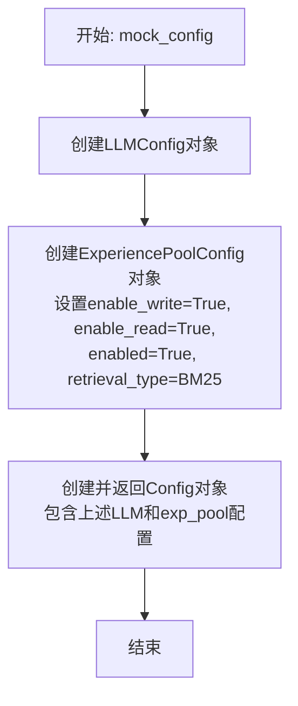

#### 带注释源码

```python
    @pytest.fixture
    # 定义一个pytest fixture，用于在测试函数中作为参数注入。
    def mock_config(self):
        # 返回一个预配置的Config对象，用于模拟测试环境。
        return Config(
            # 配置LLM部分，使用默认的LLMConfig。
            llm=LLMConfig(),
            # 配置经验池部分。
            exp_pool=ExperiencePoolConfig(
                enable_write=True,  # 启用写入功能
                enable_read=True,   # 启用读取功能
                enabled=True,       # 启用整个经验池
                # 指定检索类型为BM25（一种基于词频的检索算法）
                retrieval_type=ExperiencePoolRetrievalType.BM25
            ),
        )
```

### `TestExperienceManager.mock_storage`

这是一个用于单元测试的pytest fixture，用于模拟`ExperienceManager`类所依赖的存储引擎（`storage`）。它创建并配置了一个MagicMock对象，该对象模拟了存储引擎的关键异步和同步方法，以便在测试`ExperienceManager`时隔离其与真实存储后端的交互。

参数：

- `mocker`：`pytest_mock.plugin.MockerFixture`，pytest-mock插件提供的mocker对象，用于创建模拟对象和打补丁。

返回值：`unittest.mock.MagicMock`，一个配置好的模拟存储引擎对象。

#### 流程图

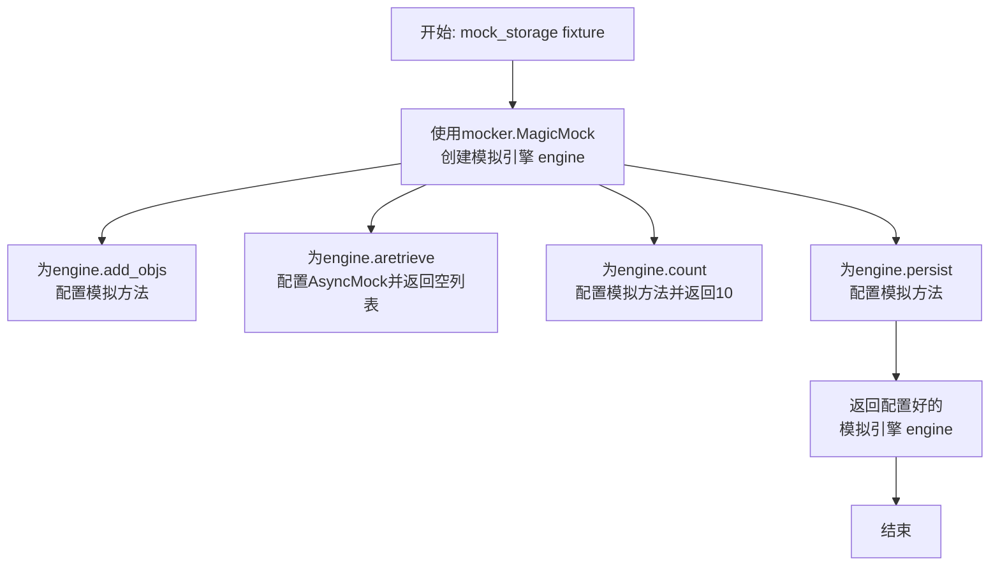

#### 带注释源码

```python
    @pytest.fixture
    # 定义一个名为`mock_storage`的pytest fixture，它接收`mocker`参数。
    def mock_storage(self, mocker):
        # 使用mocker创建一个MagicMock对象，模拟存储引擎。
        engine = mocker.MagicMock()
        # 为模拟引擎的`add_objs`方法配置一个模拟方法。这用于测试写入功能。
        engine.add_objs = mocker.MagicMock()
        # 为模拟引擎的`aretrieve`（异步检索）方法配置一个AsyncMock。
        # 默认返回一个空列表，模拟没有检索到任何经验的情况。
        engine.aretrieve = mocker.AsyncMock(return_value=[])
        # 为模拟引擎的`count`方法配置一个模拟方法。默认返回10，模拟存储中有10条记录。
        engine.count = mocker.MagicMock(return_value=10)
        # 返回配置好的模拟存储引擎，供其他测试用例使用。
        return engine
```

### `TestExperienceManager.exp_manager`

`exp_manager` 是 `TestExperienceManager` 类中的一个 `pytest` 夹具（fixture）。它的核心功能是创建一个用于单元测试的 `ExperienceManager` 实例。这个实例使用模拟的配置（`mock_config`）和模拟的存储引擎（`mock_storage`），确保测试在隔离且可控的环境中进行，不依赖外部系统。

参数：

- `mock_config`：`Config`，一个模拟的配置对象，包含LLM和经验池的配置。
- `mock_storage`：`MagicMock`，一个模拟的存储引擎对象，用于模拟数据持久化和检索操作。

返回值：`ExperienceManager`，一个配置了模拟依赖项的 `ExperienceManager` 实例，专门用于测试。

#### 流程图

```mermaid
flowchart TD
    A[开始: exp_manager fixture] --> B[接收参数 mock_config, mock_storage]
    B --> C[创建 ExperienceManager 实例<br>manager = ExperienceManager(config=mock_config)]
    C --> D[将 manager._storage 赋值为 mock_storage]
    D --> E[返回 manager 实例]
    E --> F[结束]
```

#### 带注释源码

```python
    @pytest.fixture
    # 定义一个名为 `exp_manager` 的 pytest fixture。
    # 它依赖于另外两个 fixture: `mock_config` 和 `mock_storage`。
    def exp_manager(self, mock_config, mock_storage):
        # 使用模拟的配置对象 `mock_config` 创建一个 `ExperienceManager` 实例。
        manager = ExperienceManager(config=mock_config)
        # 将实例的内部存储属性 `_storage` 手动替换为模拟的存储引擎 `mock_storage`。
        # 这绕过了真实的存储初始化逻辑，使测试专注于 `ExperienceManager` 的业务逻辑。
        manager._storage = mock_storage
        # 返回这个配置好的、用于测试的 manager 实例。
        return manager
```

### `TestExperienceManager.test_storage_property`

这是一个单元测试方法，用于验证 `ExperienceManager` 类的 `storage` 属性是否正确返回了其内部存储引擎实例。它通过断言 `exp_manager.storage` 等于预置的 `mock_storage` 来确保属性访问器正常工作。

参数：

- `exp_manager`：`ExperienceManager`，一个通过 `@pytest.fixture` 创建的 `ExperienceManager` 测试实例，其 `_storage` 属性已被设置为 `mock_storage`。
- `mock_storage`：`MagicMock`，一个模拟的存储引擎对象，用于注入到 `exp_manager` 中。

返回值：`None`，这是一个测试方法，不返回业务值，其成功与否由 `assert` 语句决定。

#### 流程图

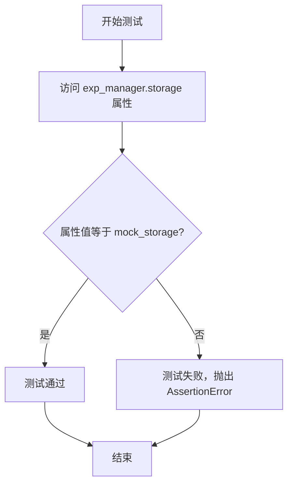

#### 带注释源码

```python
def test_storage_property(self, exp_manager, mock_storage):
    # 断言：验证 exp_manager 的 storage 属性返回的值
    # 是否与通过 fixture 注入的 mock_storage 对象相同。
    # 这测试了 ExperienceManager.storage 属性访问器的正确性。
    assert exp_manager.storage == mock_storage
```

### `TestExperienceManager.test_storage_property_initialization`

该方法是一个单元测试，用于验证 `ExperienceManager` 类的 `storage` 属性是否实现了惰性初始化。它通过模拟 `_resolve_storage` 方法来确保在首次访问 `storage` 属性时，内部的 `_storage` 字段才会被初始化。

参数：
-  `mocker`：`pytest-mock` 提供的 `MockerFixture` 类型，用于创建和管理模拟对象。
-  `mock_config`：`Config` 类型，一个包含 `ExperiencePoolConfig` 的模拟配置对象，用于初始化 `ExperienceManager`。

返回值：`None`，这是一个测试方法，不返回业务值，其目的是通过断言验证代码行为。

#### 流程图

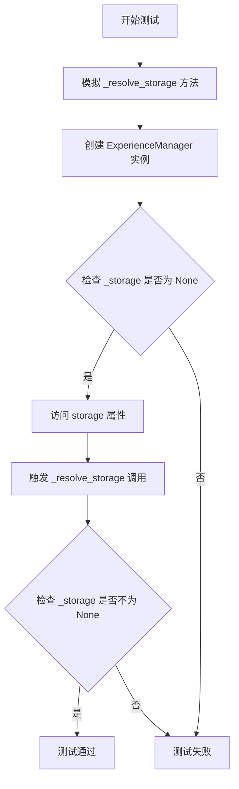

#### 带注释源码

```python
def test_storage_property_initialization(self, mocker, mock_config):
    # 1. 模拟（Mock）ExperienceManager 类的 _resolve_storage 方法。
    #    这确保了在测试中，我们不会真正创建底层的存储引擎，而是使用一个模拟对象。
    mocker.patch.object(ExperienceManager, "_resolve_storage", return_value=mocker.MagicMock())
    
    # 2. 使用模拟的配置对象创建一个 ExperienceManager 实例。
    manager = ExperienceManager(config=mock_config)
    
    # 3. 断言：在首次访问 storage 属性之前，内部的 _storage 字段应该为 None。
    #    这验证了惰性初始化的前提条件。
    assert manager._storage is None
    
    # 4. 首次访问 manager 的 storage 属性。
    #    根据属性描述符的逻辑，这将触发对 _resolve_storage 方法的调用，
    #    并将返回值赋值给 _storage。
    _ = manager.storage
    
    # 5. 断言：在访问 storage 属性之后，内部的 _storage 字段应该不再为 None。
    #    这验证了惰性初始化确实发生，并且 _resolve_storage 被成功调用。
    assert manager._storage is not None
```

### `TestExperienceManager.test_create_exp_write_disabled`

该方法用于测试当经验池的写入功能被禁用时，`ExperienceManager.create_exp` 方法的行为。它验证了在 `enable_write` 配置为 `False` 的情况下，调用 `create_exp` 不会将经验对象存储到持久化引擎中。

参数：

-  `exp_manager`：`ExperienceManager`，通过 `@pytest.fixture` 注入的 `ExperienceManager` 实例，其内部存储引擎已被模拟。
-  `mock_config`：`Config`，通过 `@pytest.fixture` 注入的模拟配置对象，用于动态修改配置。

返回值：`None`，这是一个单元测试方法，不返回任何值，其目的是通过断言来验证代码行为。

#### 流程图

```mermaid
flowchart TD
    A[开始测试] --> B[修改配置<br>将 exp_pool.enable_write 设为 False]
    B --> C[创建 Experience 对象]
    C --> D[调用 exp_manager.create_exp(exp)]
    D --> E{检查存储引擎的<br>add_objs 方法是否被调用}
    E -->|否| F[测试通过]
    E -->|是| G[测试失败]
    F --> H[结束]
    G --> H
```

#### 带注释源码

```python
def test_create_exp_write_disabled(self, exp_manager, mock_config):
    # 1. 修改配置：将经验池的写入功能禁用。
    #    这是测试的前提条件，确保系统处于“只读”或“写入禁用”模式。
    mock_config.exp_pool.enable_write = False

    # 2. 创建一个模拟的经验对象。
    #    `Experience` 对象包含请求（req）和响应（resp）信息，是待存储的数据单元。
    exp = Experience(req="test", resp="response")

    # 3. 调用被测方法：尝试创建（即存储）一个经验。
    #    根据设计，当 `enable_write` 为 False 时，此调用应跳过实际的存储操作。
    exp_manager.create_exp(exp)

    # 4. 验证断言：检查存储引擎的 `add_objs` 方法是否被调用。
    #    `assert_not_called` 确保在写入禁用的情况下，存储逻辑没有被执行。
    #    这是本测试的核心验证点，确认了功能开关按预期工作。
    exp_manager.storage.add_objs.assert_not_called()
```

### `TestExperienceManager.test_create_exp_write_enabled`

该方法用于测试当经验池的写入功能启用时，`ExperienceManager.create_exp` 方法的行为。它验证了在写入启用的情况下，传入的 `Experience` 对象会被正确地添加到存储引擎中，并且会触发持久化操作。

参数：

-  `exp_manager`：`ExperienceManager`，一个通过 fixture 创建的、已注入模拟存储引擎的 `ExperienceManager` 实例。
-  `self`：`TestExperienceManager`，测试类实例本身。

返回值：`None`，这是一个单元测试方法，不返回任何值，其目的是通过断言来验证代码行为。

#### 流程图

```mermaid
graph TD
    A[开始测试] --> B[创建 Experience 对象 exp]
    B --> C[调用 exp_manager.create_exp(exp)]
    C --> D{写入功能是否启用?}
    D -- 是 --> E[调用 storage.add_objs([exp])]
    E --> F[调用 storage.persist]
    F --> G[断言: add_objs 被调用一次]
    G --> H[断言: persist 被调用一次]
    D -- 否 --> I[断言: add_objs 未被调用]
    H --> Z[测试通过]
    I --> Z
```

#### 带注释源码

```python
def test_create_exp_write_enabled(self, exp_manager):
    # 1. 准备测试数据：创建一个 Experience 对象，包含请求和响应内容。
    exp = Experience(req="test", resp="response")
    
    # 2. 执行待测试的方法：调用 ExperienceManager 的 create_exp 方法。
    exp_manager.create_exp(exp)
    
    # 3. 验证行为：断言存储引擎的 `add_objs` 方法被调用了一次，且参数是包含 `exp` 的列表。
    exp_manager.storage.add_objs.assert_called_once_with([exp])
    
    # 4. 验证行为：断言存储引擎的 `persist` 方法被调用了一次，参数是配置中指定的持久化路径。
    exp_manager.storage.persist.assert_called_once_with(exp_manager.config.exp_pool.persist_path)
```

### `TestExperienceManager.test_query_exps_read_disabled`

这是一个单元测试方法，用于测试 `ExperienceManager.query_exps` 方法在配置中 `enable_read` 为 `False` 时的行为。当读取功能被禁用时，无论查询内容如何，该方法都应返回一个空列表。

参数：

- `self`：`TestExperienceManager`，测试类实例的引用。
- `exp_manager`：`ExperienceManager`，通过 `@pytest.fixture` 注入的 `ExperienceManager` 实例，用于执行测试。
- `mock_config`：`Config`，通过 `@pytest.fixture` 注入的模拟配置对象，用于在测试中修改配置。

返回值：`None`，这是一个测试方法，不返回业务值，其目的是通过断言验证代码行为。

#### 流程图

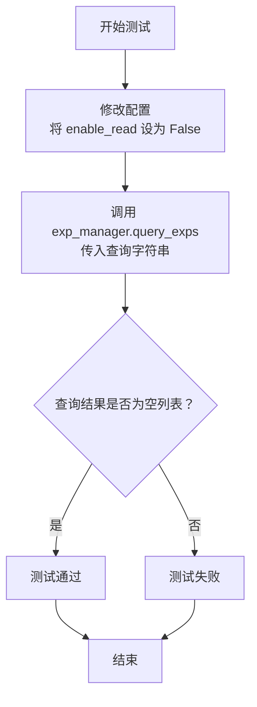

#### 带注释源码

```python
@pytest.mark.asyncio  # 标记此测试为异步测试，因为被测试的 query_exps 方法是异步的
async def test_query_exps_read_disabled(self, exp_manager, mock_config):
    # 1. 前置条件设置：将配置中的 enable_read 标志设置为 False，模拟“读取禁用”的场景。
    mock_config.exp_pool.enable_read = False

    # 2. 执行操作：调用 ExperienceManager 实例的 query_exps 方法进行查询。
    #    传入一个任意查询字符串 "query"。由于读取被禁用，预期不会执行实际的存储检索。
    result = await exp_manager.query_exps("query")

    # 3. 断言验证：验证返回的结果是否为一个空列表。
    #    这是本测试的核心断言，确保在读取禁用时，query_exps 方法返回预期的空结果。
    assert result == []
```

### `TestExperienceManager.test_query_exps_with_exact_match`

该方法是一个单元测试，用于验证 `ExperienceManager.query_exps` 方法在指定 `query_type=QueryType.EXACT`（精确匹配）时的行为。它模拟了存储引擎返回多个经验对象，并断言查询结果只包含请求字符串完全匹配的经验。

参数：
-  `exp_manager`：`ExperienceManager`，一个配置了模拟存储引擎的 `ExperienceManager` 实例。
-  `mocker`：`MockerFixture`，pytest-mock 提供的模拟对象，用于创建和管理测试替身（如 MagicMock）。

返回值：`None`，这是一个测试方法，不返回业务值，其目的是通过断言来验证功能。

#### 流程图

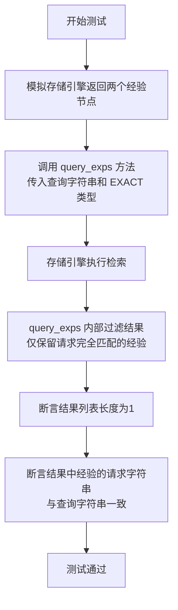

#### 带注释源码

```python
    @pytest.mark.asyncio
    async def test_query_exps_with_exact_match(self, exp_manager, mocker):
        # 1. 准备测试数据：定义一个用于精确匹配的请求字符串和两个经验对象。
        req = "exact query"
        exp1 = Experience(req=req, resp="response1")
        exp2 = Experience(req="different query", resp="response2")

        # 2. 模拟存储引擎返回的节点：创建两个模拟节点，其元数据中分别包含上面两个经验对象。
        mock_node1 = mocker.MagicMock(metadata={"obj": exp1})
        mock_node2 = mocker.MagicMock(metadata={"obj": exp2})

        # 3. 配置模拟存储引擎的行为：当调用其 `aretrieve` 方法时，返回上面创建的两个模拟节点。
        exp_manager.storage.aretrieve.return_value = [mock_node1, mock_node2]

        # 4. 执行测试：调用被测方法 `query_exps`，传入查询字符串和精确匹配类型。
        result = await exp_manager.query_exps(req, query_type=QueryType.EXACT)

        # 5. 验证结果：断言返回的结果列表长度为1（即只匹配到一个经验）。
        assert len(result) == 1
        # 6. 验证结果内容：断言匹配到的经验的请求字符串与初始查询字符串完全一致。
        assert result[0].req == req
```

### `TestExperienceManager.test_query_exps_with_tag_filter`

这是一个单元测试方法，用于测试 `ExperienceManager.query_exps` 方法在传入 `tag` 参数进行过滤时的功能。它模拟了存储引擎返回两个带有不同标签的经验对象，并验证查询结果是否只返回了指定标签的经验。

参数：

-  `exp_manager`：`ExperienceManager`，通过 `@pytest.fixture` 注入的 `ExperienceManager` 实例，其内部存储已被模拟。
-  `mocker`：`pytest-mock` 提供的 `MockerFixture` 对象，用于创建模拟对象和打桩。

返回值：`None`，这是一个测试方法，不返回业务值，其通过 `assert` 语句验证测试结果。

#### 流程图

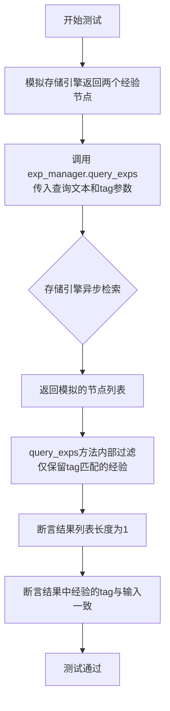

#### 带注释源码

```python
    @pytest.mark.asyncio
    async def test_query_exps_with_tag_filter(self, exp_manager, mocker):
        # 1. 测试准备：定义用于过滤的标签，并创建两个带有不同标签的Experience对象。
        tag = "test_tag"
        exp1 = Experience(req="query1", resp="response1", tag=tag)
        exp2 = Experience(req="query2", resp="response2", tag="other_tag")

        # 2. 模拟存储层返回的节点：将Experience对象包装在模拟的Node对象中。
        mock_node1 = mocker.MagicMock(metadata={"obj": exp1})
        mock_node2 = mocker.MagicMock(metadata={"obj": exp2})

        # 3. 为被测试的exp_manager的存储引擎设置桩（stub）：
        #    当调用其异步检索方法`aretrieve`时，返回上面模拟的两个节点。
        exp_manager.storage.aretrieve.return_value = [mock_node1, mock_node2]

        # 4. 执行测试：调用被测试的`query_exps`方法，传入查询文本和特定的tag。
        result = await exp_manager.query_exps("query", tag=tag)

        # 5. 验证断言：
        #    a. 结果列表应只包含一个元素（即tag匹配的exp1）。
        assert len(result) == 1
        #    b. 该元素的tag属性应与传入的过滤tag一致。
        assert result[0].tag == tag
```

### `TestExperienceManager.test_get_exps_count`

这是一个单元测试方法，用于测试 `ExperienceManager` 类的 `get_exps_count` 方法。它验证了当调用 `get_exps_count` 时，是否正确地返回了模拟存储引擎中预设的经验数量。

参数：

- `exp_manager`：`TestExperienceManager` 类的一个实例，该实例已通过 `@pytest.fixture` 装饰器注入，并配置了模拟的存储引擎。

返回值：`None`，这是一个测试方法，不返回业务值，其目的是通过断言来验证功能。

#### 流程图

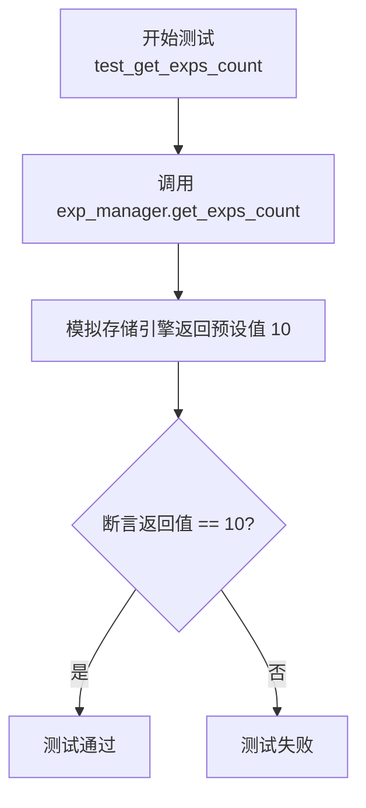

#### 带注释源码

```python
def test_get_exps_count(self, exp_manager):
    # 调用 ExperienceManager 实例的 get_exps_count 方法
    # 该方法预期会调用其内部存储引擎的 `count` 方法
    # 在测试中，`exp_manager` 的 `storage` 属性已被替换为一个模拟对象（mock_storage）
    # 该模拟对象的 `count` 方法被配置为固定返回 10
    assert exp_manager.get_exps_count() == 10
    # 使用断言验证 get_exps_count 的返回值是否等于模拟存储引擎预设的 10
    # 如果相等，则测试通过；否则，测试失败
```

### `TestExperienceManager.test_resolve_storage_bm25`

该方法是一个单元测试，用于验证当配置的检索类型为 `BM25` 时，`ExperienceManager._resolve_storage` 方法能够正确调用 `_create_bm25_storage` 并返回一个非空的存储引擎对象。

参数：

-  `mocker`：`pytest-mock` 提供的 `MockerFixture` 类型，用于创建和管理测试中的模拟对象。
-  `mock_config`：`Config` 类型，一个通过 `@pytest.fixture` 装饰器提供的模拟配置对象，用于初始化 `ExperienceManager`。

返回值：`None`，这是一个测试方法，其主要目的是进行断言验证，不返回业务值。

#### 流程图

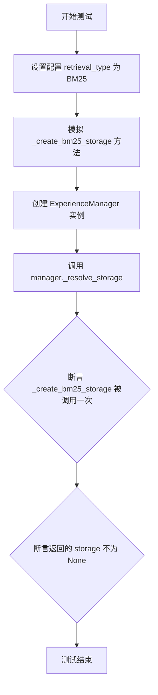

#### 带注释源码

```python
def test_resolve_storage_bm25(self, mocker, mock_config):
    # 1. 设置测试条件：将配置中的检索类型设置为 BM25
    mock_config.exp_pool.retrieval_type = ExperiencePoolRetrievalType.BM25
    # 2. 模拟（Mock）目标方法 `_create_bm25_storage`，使其返回一个模拟的 MagicMock 对象
    #    这确保了测试不会真正执行创建存储的复杂逻辑，只关注方法调用关系。
    mocker.patch.object(ExperienceManager, "_create_bm25_storage", return_value=mocker.MagicMock())
    # 3. 使用模拟后的配置创建 ExperienceManager 实例
    manager = ExperienceManager(config=mock_config)
    # 4. 执行待测试的私有方法 `_resolve_storage`
    storage = manager._resolve_storage()
    # 5. 验证断言1：确认 `_create_bm25_storage` 方法被调用了一次
    manager._create_bm25_storage.assert_called_once()
    # 6. 验证断言2：确认 `_resolve_storage` 方法返回了一个非 None 的对象
    assert storage is not None
```

### `TestExperienceManager.test_resolve_storage_chroma`

这是一个单元测试方法，用于测试 `ExperienceManager` 类的 `_resolve_storage` 方法在配置为使用 Chroma 向量数据库作为检索后端时的行为。它验证了当 `retrieval_type` 设置为 `CHROMA` 时，`_resolve_storage` 方法会正确地调用 `_create_chroma_storage` 方法并返回一个非空的存储引擎对象。

参数：

- `mocker`：`pytest-mock` 提供的 `MockerFixture` 类型，用于创建和管理测试替身（如模拟对象和补丁）。
- `mock_config`：`Config` 类型，一个预配置的测试配置对象，其 `exp_pool.retrieval_type` 被设置为 `ExperiencePoolRetrievalType.CHROMA`。

返回值：`None`，这是一个测试方法，不返回任何值，其目的是通过断言来验证代码行为。

#### 流程图

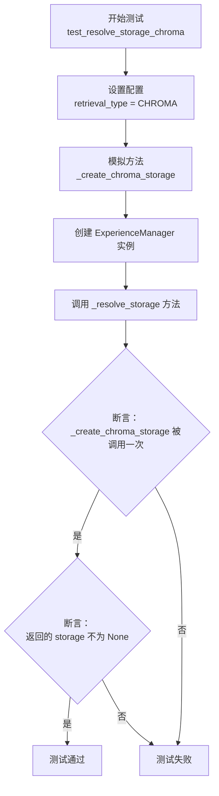

#### 带注释源码

```python
def test_resolve_storage_chroma(self, mocker, mock_config):
    # 1. 准备阶段：修改传入的配置对象，将检索类型设置为 CHROMA。
    mock_config.exp_pool.retrieval_type = ExperiencePoolRetrievalType.CHROMA
    # 2. 模拟（Mock）目标方法：使用 mocker.patch.object 模拟 ExperienceManager 类的 _create_chroma_storage 方法。
    #    这确保在测试中调用此方法时，不会执行真实逻辑，而是返回一个模拟对象，从而隔离测试。
    mocker.patch.object(ExperienceManager, "_create_chroma_storage", return_value=mocker.MagicMock())
    # 3. 创建被测对象：使用修改后的配置实例化 ExperienceManager。
    manager = ExperienceManager(config=mock_config)
    # 4. 执行被测方法：调用 manager 的 _resolve_storage 方法。
    storage = manager._resolve_storage()
    # 5. 验证行为（断言1）：确认 _create_chroma_storage 方法被调用了一次。
    #    这验证了当检索类型为 CHROMA 时，正确的存储创建逻辑被触发。
    manager._create_chroma_storage.assert_called_once()
    # 6. 验证结果（断言2）：确认 _resolve_storage 方法返回了一个非 None 的对象。
    #    这验证了存储引擎被成功创建并返回。
    assert storage is not None
```

### `TestExperienceManager.test_create_bm25_storage`

这是一个单元测试方法，用于测试 `ExperienceManager` 类的 `_create_bm25_storage` 方法。它通过模拟（mocking）所有外部依赖，验证在给定配置下，`_create_bm25_storage` 方法能够成功创建并返回一个非空的存储引擎对象，而不会抛出异常。

参数：

- `self`：`TestExperienceManager`，测试类实例的引用。
- `mocker`：`pytest-mock` 提供的 `MockerFixture` 对象，用于创建和管理模拟对象。
- `mock_config`：`Config`，一个通过 `@pytest.fixture` 装饰器提供的模拟配置对象，包含了经验池的配置信息。

返回值：`None`，这是一个测试方法，其主要目的是断言（assert）而非返回值。

#### 流程图

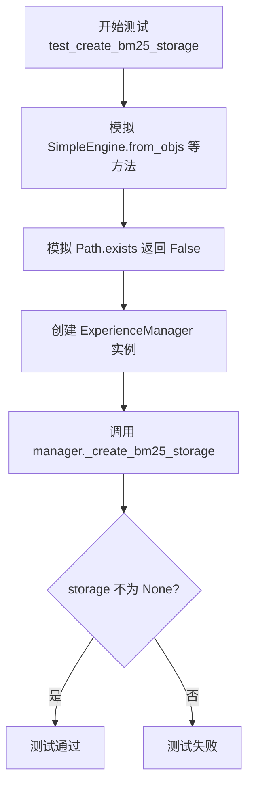

#### 带注释源码

```python
def test_create_bm25_storage(self, mocker, mock_config):
    # 模拟 `metagpt.rag.engines.SimpleEngine` 的类方法 `from_objs`，使其返回一个模拟对象。
    # 这是为了在测试中隔离对真实 `SimpleEngine` 构造过程的依赖。
    mocker.patch("metagpt.rag.engines.SimpleEngine.from_objs", return_value=mocker.MagicMock())
    # 模拟 `SimpleEngine.from_index` 方法，同样返回模拟对象。
    mocker.patch("metagpt.rag.engines.SimpleEngine.from_index", return_value=mocker.MagicMock())
    # 模拟 `SimpleEngine.get_obj_nodes` 方法，使其返回一个空列表。
    # 这模拟了从存储中获取对象节点时没有数据的情况。
    mocker.patch("metagpt.rag.engines.SimpleEngine.get_obj_nodes", return_value=[])
    # 模拟 `SimpleEngine._resolve_embed_model` 方法，返回一个模拟的嵌入模型。
    mocker.patch("metagpt.rag.engines.SimpleEngine._resolve_embed_model", return_value=mocker.MagicMock())
    # 模拟 `llama_index.core.VectorStoreIndex` 类，使其在构造时返回一个模拟对象。
    # 这是为了隔离对 LlamaIndex 向量存储索引的依赖。
    mocker.patch("llama_index.core.VectorStoreIndex", return_value=mocker.MagicMock())
    # 模拟 `metagpt.rag.schema.BM25RetrieverConfig` 类，使其返回一个模拟的配置对象。
    mocker.patch("metagpt.rag.schema.BM25RetrieverConfig", return_value=mocker.MagicMock())
    # 模拟 `pathlib.Path.exists` 方法，使其返回 `False`。
    # 这模拟了持久化索引文件不存在的情况，从而测试从对象创建新索引的路径。
    mocker.patch("pathlib.Path.exists", return_value=False)

    # 使用模拟后的配置，创建一个 `ExperienceManager` 实例。
    manager = ExperienceManager(config=mock_config)
    # 调用被测试的私有方法 `_create_bm25_storage`。
    storage = manager._create_bm25_storage()
    # 断言：确保返回的 `storage` 对象不是 `None`。
    # 这是测试的核心，验证方法在模拟环境下能成功创建存储对象。
    assert storage is not None
```

### `TestExperienceManager.test_create_chroma_storage`

这是一个单元测试方法，用于测试 `ExperienceManager` 类的 `_create_chroma_storage` 方法。它验证了当配置指定使用 Chroma 作为检索后端时，`_create_chroma_storage` 方法能够被正确调用并返回一个非空的存储引擎对象。测试通过模拟（mocking）依赖项来隔离测试逻辑。

参数：

-  `mocker`：`pytest-mock` 提供的 `MockerFixture` 类型，用于创建和管理模拟对象，以替换测试中的外部依赖。
-  `mock_config`：`Config` 类型，一个模拟的配置对象，用于初始化 `ExperienceManager`。在此测试中，其 `exp_pool.retrieval_type` 被设置为 `ExperiencePoolRetrievalType.CHROMA`。

返回值：`None`，这是一个测试方法，其主要目的是进行断言验证，不返回业务值。

#### 流程图

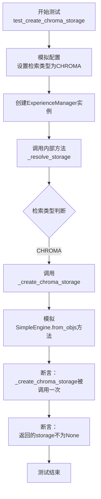

#### 带注释源码

```python
def test_create_chroma_storage(self, mocker, mock_config):
    # 1. 模拟配置：将检索类型设置为 CHROMA，以测试 Chroma 存储的创建路径。
    mock_config.exp_pool.retrieval_type = ExperiencePoolRetrievalType.CHROMA
    # 2. 模拟依赖：模拟 `SimpleEngine.from_objs` 方法，使其返回一个模拟对象。
    #    这是 `_create_chroma_storage` 方法内部调用的关键函数，模拟它以避免真实的存储引擎初始化。
    mocker.patch("metagpt.rag.engines.SimpleEngine.from_objs", return_value=mocker.MagicMock())
    # 3. 创建管理器：使用模拟后的配置实例化 ExperienceManager。
    manager = ExperienceManager(config=mock_config)
    # 4. 调用方法：触发内部存储解析流程。由于配置为CHROMA，会调用 `_create_chroma_storage`。
    storage = manager._resolve_storage()
    # 5. 断言调用：验证 `_create_chroma_storage` 方法被调用了一次。
    #    这确保了配置正确路由到了 Chroma 存储的创建逻辑。
    manager._create_chroma_storage.assert_called_once()
    # 6. 断言结果：验证返回的 storage 对象不是 None，表明存储引擎成功创建（尽管是模拟的）。
    assert storage is not None
```

### `TestExperienceManager.test_get_ranker_configs_use_llm_ranker_true`

该方法用于测试 `ExperienceManager._get_ranker_configs` 方法在配置 `exp_pool.use_llm_ranker = True` 时的行为。它验证了当启用 LLM 排序器时，`_get_ranker_configs` 方法会返回一个包含正确配置的排序器配置列表。

参数：
-  `mock_config`：`Config`，一个通过 `@pytest.fixture` 装饰器提供的模拟配置对象，用于初始化 `ExperienceManager`。

返回值：`None`，这是一个单元测试方法，不返回任何值，仅通过断言来验证行为。

#### 流程图

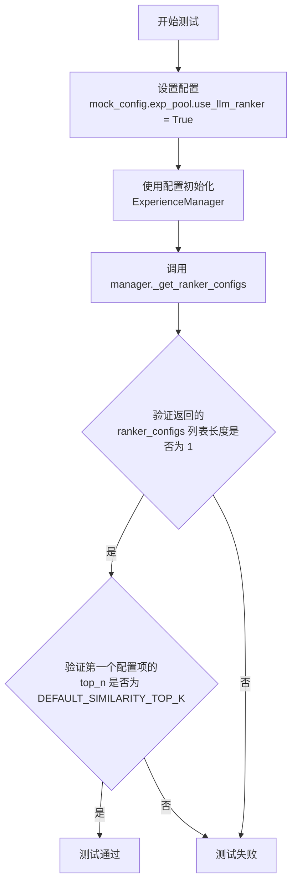

#### 带注释源码

```python
def test_get_ranker_configs_use_llm_ranker_true(self, mock_config):
    # 1. 设置测试前提：将配置中的 `use_llm_ranker` 标志设置为 True。
    mock_config.exp_pool.use_llm_ranker = True
    # 2. 使用该配置创建一个 ExperienceManager 实例。
    manager = ExperienceManager(config=mock_config)
    # 3. 调用被测试的私有方法 `_get_ranker_configs`。
    ranker_configs = manager._get_ranker_configs()
    # 4. 断言：验证返回的排序器配置列表长度为 1（即确实创建了一个 LLM 排序器配置）。
    assert len(ranker_configs) == 1
    # 5. 断言：验证返回的配置项中的 `top_n` 参数等于预定义的默认值 `DEFAULT_SIMILARITY_TOP_K`。
    assert ranker_configs[0].top_n == DEFAULT_SIMILARITY_TOP_K
```

### `TestExperienceManager.test_get_ranker_configs_use_llm_ranker_false`

这是一个单元测试方法，用于验证当配置项 `exp_pool.use_llm_ranker` 设置为 `False` 时，`ExperienceManager._get_ranker_configs` 方法返回一个空的排序器配置列表。

参数：

- `mock_config`：`pytest.fixture`，一个被模拟的 `Config` 对象，用于配置 `ExperienceManager`。

返回值：`None`，这是一个测试方法，不返回业务值，仅通过断言验证逻辑。

#### 流程图

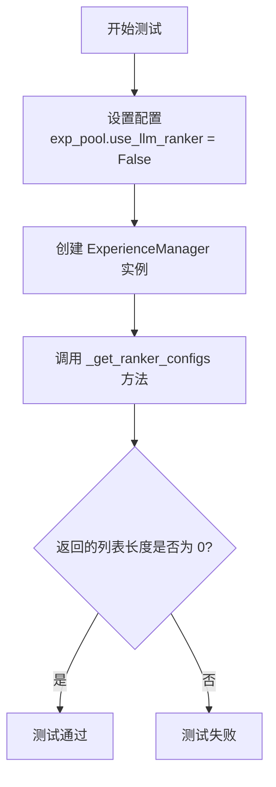

#### 带注释源码

```python
def test_get_ranker_configs_use_llm_ranker_false(self, mock_config):
    # 1. 设置模拟配置：将经验池配置中的 `use_llm_ranker` 标志设为 False。
    mock_config.exp_pool.use_llm_ranker = False
    # 2. 使用上述配置创建一个 ExperienceManager 实例。
    manager = ExperienceManager(config=mock_config)
    # 3. 调用被测试的私有方法 `_get_ranker_configs` 来获取排序器配置列表。
    ranker_configs = manager._get_ranker_configs()
    # 4. 断言：验证返回的配置列表长度为 0，即没有启用 LLM 排序器时，不应返回任何排序器配置。
    assert len(ranker_configs) == 0
```

## 关键组件

### ExperienceManager

负责管理经验池的核心组件，提供经验的创建、查询、计数和存储引擎的初始化与切换功能。

### ExperiencePoolConfig

经验池的配置组件，定义了经验池的读写开关、启用状态、检索类型（如BM25或ChROMA）以及是否使用LLM排序器等关键配置项。

### Experience

经验池中存储的基本数据单元，包含请求（req）、响应（resp）和标签（tag）等字段，用于记录和复用历史交互信息。

### QueryType

查询类型的枚举组件，定义了不同的查询匹配模式，例如精确匹配（EXACT），用于在查询经验时指定匹配策略。

### ExperiencePoolRetrievalType

检索类型的枚举组件，定义了经验池支持的底层存储和检索引擎类型，如BM25和CHROMA，用于配置存储引擎的初始化策略。

### SimpleEngine

一个通用的RAG（检索增强生成）引擎组件，被ExperienceManager内部用于创建和管理基于不同检索策略（如BM25）的存储后端。

## 问题及建议


### 已知问题

-   **测试用例对内部实现细节依赖过强**：多个测试方法（如 `test_create_exp_write_enabled`, `test_query_exps_with_exact_match`）直接调用了 `ExperienceManager` 的内部属性（如 `_storage`）或模拟了其内部方法（如 `_resolve_storage`, `_create_bm25_storage`）。这使得测试变得脆弱，一旦 `ExperienceManager` 的内部实现（如属性名、私有方法）发生改变，即使其公共接口行为不变，这些测试也会失败，增加了维护成本。
-   **模拟对象过于宽泛**：在 `test_create_bm25_storage` 和 `test_create_chroma_storage` 测试中，使用了大量 `mocker.patch` 来模拟外部依赖（如 `SimpleEngine.from_objs`, `llama_index.core.VectorStoreIndex`）。这种“地毯式”模拟掩盖了被测试方法真实的依赖关系，使得测试无法有效验证这些依赖是否被正确调用（例如，传入了正确的参数），降低了测试的置信度。
-   **异步测试存在潜在执行问题**：测试类中混合使用了同步测试方法（`def test_...`）和异步测试方法（`@pytest.mark.asyncio async def test_...`）。虽然 pytest-asyncio 插件可以处理，但在某些复杂场景或与其他插件配合时，可能会遇到事件循环管理的问题。所有测试方法风格不一致。
-   **配置对象在测试中被修改**：在 `test_create_exp_write_disabled` 和 `test_query_exps_read_disabled` 等测试中，直接修改了传入的 `mock_config` 对象的属性（如 `enable_write`）。这可能会对其他共享同一 `mock_config` fixture 的测试用例产生不可预期的副作用，破坏了测试的隔离性。

### 优化建议

-   **重构测试以面向公共接口**：重新设计测试用例，使其仅通过 `ExperienceManager` 的公共方法（如 `create_exp`, `query_exps`, `get_exps_count`）和构造函数进行交互。避免直接访问或操作 `_storage` 等私有属性。对于需要验证存储操作的情况，可以通过在 `mock_storage` fixture 中设置断言，然后在测试中调用公共方法来实现。
-   **采用更精确的模拟策略**：对于 `_create_bm25_storage` 这类内部方法的测试，应聚焦于验证其**输出**（返回的 storage 对象）是否符合预期，或者其**对外部组件的调用**是否正确。可以改为模拟这些外部组件的类或函数，并检查它们是否以预期的参数被调用，而不是模拟所有相关调用。考虑将这些内部方法的测试移至更集成化的测试中，或将其重构为可独立测试的公共/受保护组件。
-   **统一测试方法风格**：评估是否所有测试都需要异步执行。如果 `ExperienceManager` 的公共接口主要是异步的，考虑将整个测试类标记为异步（使用 `@pytest.mark.asyncio` 装饰类），或者将所有测试方法改为异步。如果同步测试足够，则避免混用。这可以提高测试套件的清晰度和一致性。
-   **确保测试隔离性**：为每个需要不同配置的测试用例创建独立的配置 fixture 或使用 `monkeypatch` 临时修改配置。避免在测试方法内部直接修改共享 fixture 返回的对象状态。例如，可以为“写禁用”和“读禁用”场景分别创建 `mock_config_write_disabled` 和 `mock_config_read_disabled` fixture。
-   **补充关键场景的测试**：
    -   **异常处理**：测试当 `retrieval_type` 配置为未知类型时，`_resolve_storage` 是否抛出合适的异常。
    -   **边界条件**：测试 `query_exps` 方法在 `top_k` 参数为 0、负数或极大值时的行为。
    -   **空结果与持久化**：测试当存储引擎返回空列表或 `persist_path` 为 `None` 时，相关方法（如 `create_exp`, `query_exps`）的行为是否健壮。
    -   **`Experience` 对象验证**：测试 `create_exp` 方法在接收到无效或部分缺失的 `Experience` 对象时的行为（尽管当前代码可能未做验证，但测试可以记录这一假设）。


## 其它


### 设计目标与约束

本模块（`ExperienceManager`）的设计目标是提供一个可配置、可扩展的经验池管理组件，用于在Agent执行过程中存储和检索历史经验（`Experience`）。核心约束包括：1) 支持多种检索后端（如BM25、Chroma），通过配置灵活切换；2) 支持读写操作的独立开关，便于在测试或特定场景下控制功能；3) 支持基于精确匹配、标签过滤和相似性检索等多种查询方式；4) 异步设计，确保在I/O密集型操作（如向量检索）时不阻塞主线程。

### 错误处理与异常设计

当前代码主要为单元测试，未显式展示生产环境中的错误处理逻辑。从测试用例推断，预期的错误处理策略可能包括：1) 当存储引擎初始化失败（如配置文件错误、依赖服务不可用）时，应抛出明确的初始化异常；2) 在异步查询过程中，应对网络超时、存储引擎异常等进行捕获，并可能返回空结果或抛出业务异常；3) 对于无效的输入参数（如空的查询字符串），应在方法入口进行校验。测试用例通过模拟（Mock）异常场景来验证功能的健壮性。

### 数据流与状态机

数据流始于`Experience`对象的创建（`create_exp`），根据`enable_write`配置决定是否持久化到存储引擎。查询时（`query_exps`），根据`enable_read`配置、`query_type`（精确/相似）和`tag`参数，向存储引擎发起检索请求，检索结果经过可能的过滤（如精确匹配、标签过滤）和排序后返回。模块本身是无状态的，其状态（如存储引擎连接）在首次访问`storage`属性时懒初始化。存储引擎（如BM25索引、Chroma向量库）内部维护数据的索引状态。

### 外部依赖与接口契约

1.  **配置依赖**：强依赖`Config`对象及其内部的`exp_pool`配置（`ExperiencePoolConfig`），包括启用开关、检索类型、持久化路径等。配置变更直接影响组件行为。
2.  **存储引擎抽象**：依赖一个抽象的存储接口（由`mock_storage`模拟），该接口需提供`add_objs`、`aretrieve`、`count`、`persist`等方法。具体实现由`_resolve_storage`根据配置动态创建（BM25或Chroma）。
3.  **RAG组件**：`_create_bm25_storage`等方法依赖`metagpt.rag.engines.SimpleEngine`及`llama_index.core`等外部RAG（检索增强生成）库来构建检索能力。
4.  **LLM服务**：当配置`use_llm_ranker=True`时，会依赖`LLMConfig`配置的LLM服务对检索结果进行重排序。
5.  **接口契约**：对调用者（如其他Agent组件）提供同步的`create_exp`、`get_exps_count`和异步的`query_exps`方法。`query_exps`的返回值是`Experience`对象列表。

### 测试策略与覆盖

本文件是完整的单元测试套件，采用pytest框架。测试策略包括：
1.  **功能测试**：验证读写开关、精确查询、标签过滤、计数等核心功能。
2.  **配置驱动测试**：测试不同配置（如`retrieval_type`, `use_llm_ranker`）下，内部方法（如`_resolve_storage`, `_get_ranker_configs`）的行为是否正确。
3.  **依赖隔离**：广泛使用`mocker`对所有的外部依赖（存储引擎、RAG引擎、文件系统）进行模拟和打桩，确保测试的独立性和速度。
4.  **边界与异常测试**：测试了读写禁用、空结果等边界情况。但生产代码中更复杂的异常处理（如存储失败）未在本次提供的测试中体现。

    