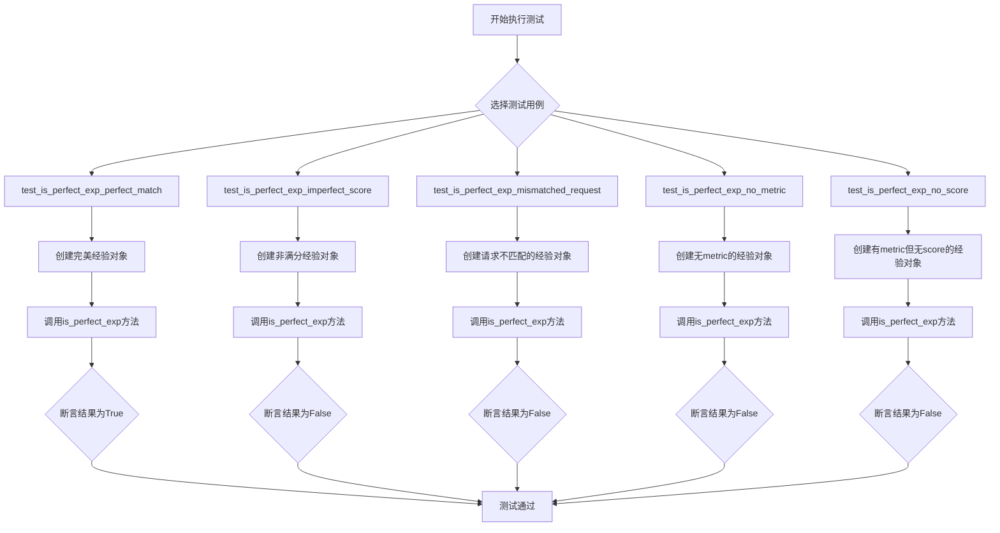
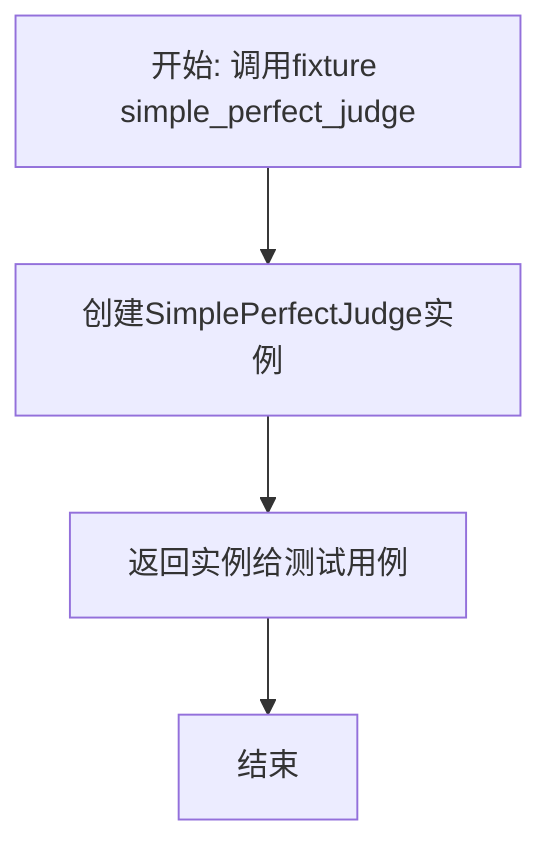
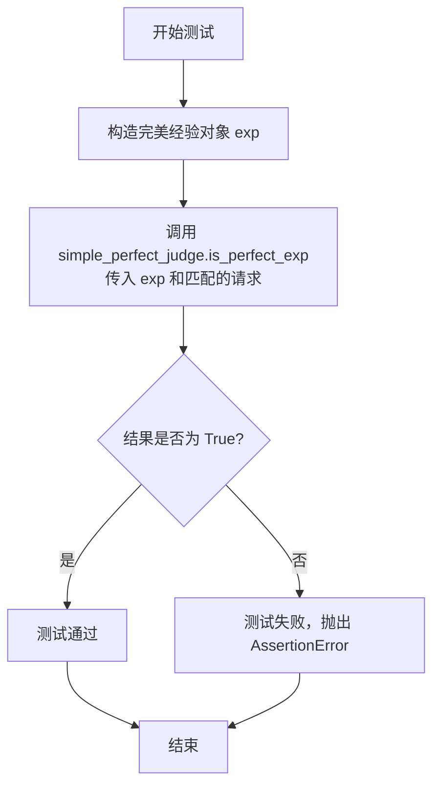
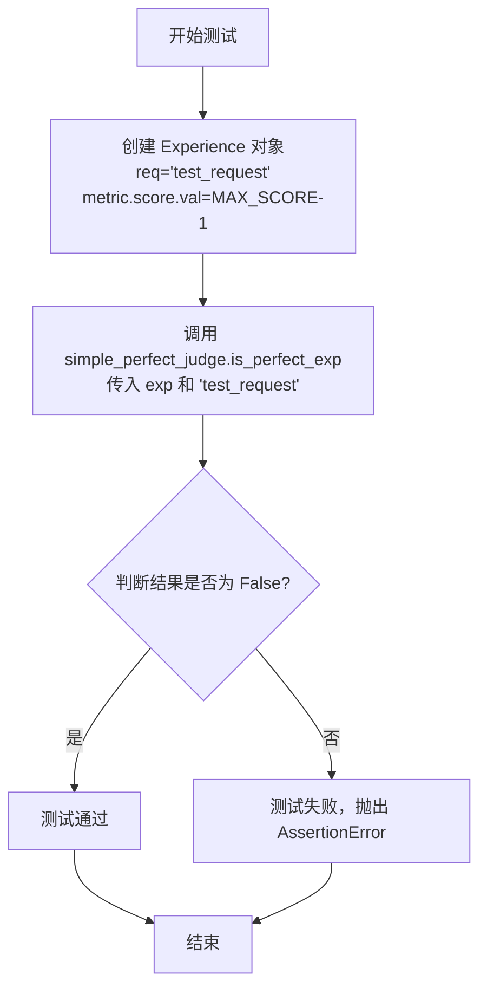
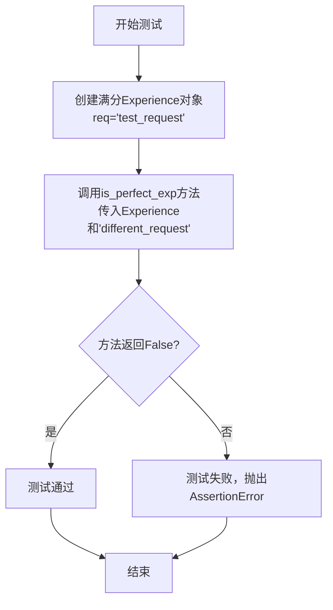
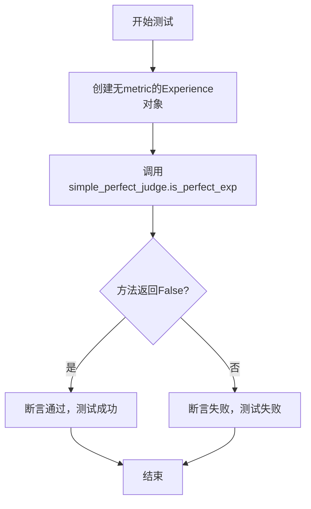
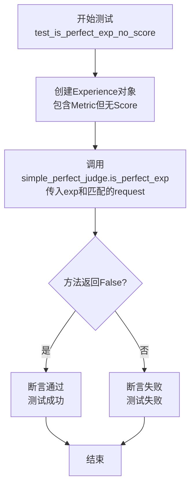

# `.\MetaGPT\tests\metagpt\exp_pool\test_perfect_judges\test_simple_perfect_judge.py` 详细设计文档

该文件是一个使用pytest框架编写的单元测试文件，用于测试`SimplePerfectJudge`类的`is_perfect_exp`方法。该方法用于判断一个给定的`Experience`对象（包含请求、响应和评分指标）是否是一个“完美”的经验，即其请求与给定请求匹配且其评分达到最高分。测试覆盖了完美匹配、分数不完美、请求不匹配、缺少评分指标以及缺少评分值等多种边界情况。

## 整体流程



## 类结构

```
TestSimplePerfectJudge (测试类)
├── simple_perfect_judge (fixture方法)
├── test_is_perfect_exp_perfect_match (测试方法)
├── test_is_perfect_exp_imperfect_score (测试方法)
├── test_is_perfect_exp_mismatched_request (测试方法)
├── test_is_perfect_exp_no_metric (测试方法)
└── test_is_perfect_exp_no_score (测试方法)
```

## 全局变量及字段


### `MAX_SCORE`
    
表示评分的最大值，用于判断经验是否完美的阈值

类型：`int`
    


    

## 全局函数及方法

### `TestSimplePerfectJudge.simple_perfect_judge`

这是一个pytest fixture，用于在`TestSimplePerfectJudge`测试类中创建并提供一个`SimplePerfectJudge`实例。它简化了测试用例的编写，确保每个测试方法都能获得一个干净、独立的`SimplePerfectJudge`对象。

参数：
-  `self`：`TestSimplePerfectJudge`，当前测试类的实例

返回值：`SimplePerfectJudge`，一个`SimplePerfectJudge`类的实例

#### 流程图



#### 带注释源码

```python
    @pytest.fixture
    # 定义一个pytest fixture，命名为'simple_perfect_judge'。
    # fixture在测试运行前被调用，其返回值（这里是SimplePerfectJudge实例）会注入到使用它的测试函数参数中。
    def simple_perfect_judge(self):
        # 创建并返回一个SimplePerfectJudge类的新实例。
        # 这个实例将被用于类中所有标记了`simple_perfect_judge`参数的测试方法。
        return SimplePerfectJudge()
```

### `TestSimplePerfectJudge.test_is_perfect_exp_perfect_match`

该方法是一个单元测试，用于验证 `SimplePerfectJudge.is_perfect_exp` 方法在给定一个“完美”经验（即请求匹配且评分最高）时，是否能正确返回 `True`。

参数：

- `self`：`TestSimplePerfectJudge`，测试类实例自身。
- `simple_perfect_judge`：`SimplePerfectJudge`，由 `@pytest.fixture` 提供的 `SimplePerfectJudge` 实例，作为被测对象。
- `exp`：`Experience`，构造的测试数据，包含请求、响应以及一个最高分的度量指标。
- `request`：`str`，传入的请求字符串，用于与经验中的请求进行匹配。

返回值：`None`，该测试方法不返回任何值，其核心逻辑是通过 `assert` 语句验证异步调用 `is_perfect_exp` 的结果是否为 `True`。

#### 流程图



#### 带注释源码

```python
    @pytest.mark.asyncio  # 标记此测试用例为异步函数，以便 pytest 能正确处理
    async def test_is_perfect_exp_perfect_match(self, simple_perfect_judge):
        # 步骤1：准备测试数据。创建一个“完美”的经验对象。
        # - req: 请求内容为 "test_request"
        # - resp: 响应内容为 "resp" (此测试中具体内容不重要)
        # - metric: 度量指标，其分数为最大值 MAX_SCORE
        exp = Experience(req="test_request", resp="resp", metric=Metric(score=Score(val=MAX_SCORE)))
        
        # 步骤2：执行被测方法。异步调用 `is_perfect_exp` 方法。
        # 传入构造的经验对象 `exp` 和与经验中请求内容相同的字符串 "test_request"。
        result = await simple_perfect_judge.is_perfect_exp(exp, "test_request")
        
        # 步骤3：验证结果。断言返回的结果 `result` 必须为 `True`。
        # 如果断言失败，pytest 会报告测试未通过。
        assert result is True
```

### `TestSimplePerfectJudge.test_is_perfect_exp_imperfect_score`

该方法是一个单元测试，用于验证 `SimplePerfectJudge.is_perfect_exp` 方法在传入一个经验对象（其评分未达到满分）时，能否正确地判断该经验为“不完美”。

参数：
- `self`：`TestSimplePerfectJudge`，测试类实例自身。
- `simple_perfect_judge`：`SimplePerfectJudge`，通过 `@pytest.fixture` 注入的 `SimplePerfectJudge` 实例，作为被测对象。

返回值：`None`，该测试方法不返回任何值，其功能通过断言（`assert`）来验证。

#### 流程图



#### 带注释源码

```python
    @pytest.mark.asyncio  # 标记此测试函数为异步函数，以便 pytest-asyncio 插件能正确处理
    async def test_is_perfect_exp_imperfect_score(self, simple_perfect_judge):
        # 创建一个 Experience 对象，其请求为 "test_request"，评分为最大值减1（即不完美）
        exp = Experience(req="test_request", resp="resp", metric=Metric(score=Score(val=MAX_SCORE - 1)))
        # 异步调用被测方法 `is_perfect_exp`，传入经验对象和请求字符串
        result = await simple_perfect_judge.is_perfect_exp(exp, "test_request")
        # 断言：期望返回结果为 False，因为评分未达到满分
        assert result is False
```

### `TestSimplePerfectJudge.test_is_perfect_exp_mismatched_request`

这是一个单元测试方法，用于测试 `SimplePerfectJudge.is_perfect_exp` 方法在传入的 `Experience` 对象中的请求（`req`）与给定的请求字符串不匹配时的行为。它验证了即使经验（`Experience`）的分数是满分（`MAX_SCORE`），只要请求不匹配，`is_perfect_exp` 方法就应该返回 `False`。

参数：

- `self`：`TestSimplePerfectJudge`，测试类实例的引用。
- `simple_perfect_judge`：`SimplePerfectJudge`，通过 `@pytest.fixture` 注入的 `SimplePerfectJudge` 实例，是测试的目标对象。

返回值：`None`，这是一个测试方法，其主要目的是通过断言（`assert`）来验证逻辑，不返回业务值。

#### 流程图



#### 带注释源码

```python
    @pytest.mark.asyncio  # 标记此测试为异步测试，以便使用`await`
    async def test_is_perfect_exp_mismatched_request(self, simple_perfect_judge):
        # 创建一个Experience对象，其请求为'test_request'，分数为满分(MAX_SCORE)
        exp = Experience(req="test_request", resp="resp", metric=Metric(score=Score(val=MAX_SCORE)))
        # 调用待测试的异步方法`is_perfect_exp`，传入Experience对象和一个不同的请求字符串'different_request'
        result = await simple_perfect_judge.is_perfect_exp(exp, "different_request")
        # 断言：由于请求不匹配，即使分数是满分，结果也应为False
        assert result is False
```

### `TestSimplePerfectJudge.test_is_perfect_exp_no_metric`

该方法用于测试 `SimplePerfectJudge.is_perfect_exp` 函数在传入的 `Experience` 对象缺少 `metric` 字段时的行为。它验证了当经验数据没有关联的评估指标时，系统是否能正确地将其判定为“不完美”。

参数：

- `simple_perfect_judge`：`SimplePerfectJudge`，通过 `pytest.fixture` 注入的 `SimplePerfectJudge` 实例，作为测试对象。
- `exp`：`Experience`，一个不包含 `metric` 字段的 `Experience` 对象，用于模拟缺少评估指标的经验数据。
- `test_request`：`str`，一个字符串，作为请求参数传入 `is_perfect_exp` 方法，用于与经验数据中的请求进行匹配。

返回值：`None`，这是一个单元测试方法，其主要目的是通过断言（`assert`）来验证代码逻辑，不返回业务值。

#### 流程图



#### 带注释源码

```python
    @pytest.mark.asyncio
    async def test_is_perfect_exp_no_metric(self, simple_perfect_judge):
        # 创建一个不包含 `metric` 字段的 Experience 对象。
        # 这模拟了经验数据缺失评估指标的场景。
        exp = Experience(req="test_request", resp="resp")
        
        # 调用被测试的 `is_perfect_exp` 方法。
        # 传入创建的经验对象和与之匹配的请求字符串。
        result = await simple_perfect_judge.is_perfect_exp(exp, "test_request")
        
        # 断言：期望结果为 False。
        # 因为经验数据缺少必要的评估指标（metric），
        # 所以它不应该被判定为“完美”经验。
        assert result is False
```

### `TestSimplePerfectJudge.test_is_perfect_exp_no_score`

该方法用于测试 `SimplePerfectJudge.is_perfect_exp` 方法在传入的 `Experience` 对象包含 `Metric` 但 `Metric` 中不包含 `Score` 对象（即 `score` 字段为 `None`）时的行为。它验证了在这种情况下，`is_perfect_exp` 方法应返回 `False`。

参数：
- `simple_perfect_judge`：`SimplePerfectJudge`，通过 `pytest.fixture` 提供的 `SimplePerfectJudge` 实例，作为测试的依赖项。
- `self`：`TestSimplePerfectJudge`，测试类实例的引用。

返回值：`None`，这是一个测试方法，其主要目的是通过断言（`assert`）来验证代码行为，不直接返回业务值。测试框架会根据断言结果判断测试是否通过。

#### 流程图



#### 带注释源码

```python
    @pytest.mark.asyncio
    async def test_is_perfect_exp_no_score(self, simple_perfect_judge):
        # 创建一个 Experience 对象，其请求为 "test_request"，响应为 "resp"。
        # 为其指定一个 Metric 对象，但该 Metric 对象不包含 Score 对象（即 score 字段为 None）。
        exp = Experience(req="test_request", resp="resp", metric=Metric())
        
        # 异步调用被测试的 `is_perfect_exp` 方法。
        # 传入上面创建的 `exp` 对象和一个与 `exp.req` 匹配的请求字符串 "test_request"。
        result = await simple_perfect_judge.is_perfect_exp(exp, "test_request")
        
        # 断言：期望 `is_perfect_exp` 方法在这种情况下返回 `False`。
        # 因为一个“完美”的经验不仅要求请求匹配，还要求其评分（Score）存在且为最高分（MAX_SCORE）。
        # 此处 `metric.score` 为 `None`，不满足“完美”条件。
        assert result is False
```

## 关键组件


### SimplePerfectJudge

一个用于判断经验（Experience）是否为“完美”的简单评估器，其核心逻辑是检查经验是否与给定请求完全匹配且其评分达到预设的最高分（MAX_SCORE）。

### Experience

表示一次交互或行为的经验数据，包含请求（req）、响应（resp）和可选的评估指标（metric）。

### Metric

表示对经验进行评估的指标，包含一个可选的评分（score）字段。

### Score

表示一个具体的评分值，包含一个数值（val）字段。

### MAX_SCORE

一个全局常量，代表评分的最高可能值，用于定义“完美”的阈值。


## 问题及建议


### 已知问题

-   **测试用例对实现细节依赖过强**：测试类 `TestSimplePerfectJudge` 直接使用了 `SimplePerfectJudge` 类及其依赖的 `Experience`、`Metric`、`Score` 等数据模型。如果 `SimplePerfectJudge.is_perfect_exp` 方法的内部逻辑发生改变（例如，判断“完美”的标准不再是 `MAX_SCORE` 或请求字符串的精确匹配），这些测试用例可能会全部失败，即使被测试的“完美判断”核心功能语义未变。这增加了维护成本。
-   **测试覆盖边界条件不足**：当前测试用例主要覆盖了“完美匹配”、“分数不足”、“请求不匹配”、“无度量标准”、“无分数”这几种情况。但是，对于 `metric` 或 `score` 为 `None` 的情况，以及 `MAX_SCORE` 为0或负数等边界值场景，缺乏相应的测试用例，可能无法发现潜在的异常处理缺陷。
-   **测试数据构造存在重复**：在每个测试方法中，都重复构造了 `Experience` 对象。虽然目前只有几个测试，但随着测试用例增加，这种重复会加剧。如果 `Experience` 类的构造函数发生变化，需要修改多处测试代码。
-   **异步测试标记冗余**：每个测试方法都使用了 `@pytest.mark.asyncio` 装饰器。可以使用 `pytest.fixture` 为整个测试类设置异步环境，或者使用 `pytest-asyncio` 的自动模式来减少样板代码。

### 优化建议

-   **采用更健壮的测试策略**：考虑使用“测试替身”（Test Doubles），如模拟对象（Mock），来隔离 `SimplePerfectJudge` 与其依赖的数据模型。可以测试 `is_perfect_exp` 方法在接收到特定结构的输入时是否返回预期结果，而不必关心数据模型的具体实现。这使测试更关注行为而非状态。
-   **补充边界和异常测试用例**：增加测试用例以覆盖 `metric=None`、`score=None`、`score.val` 为非法值（如非数字、极大/极小值）等情况。这有助于验证 `is_perfect_exp` 方法的鲁棒性。
-   **使用工厂模式或 fixture 重构测试数据创建**：将 `Experience` 对象的创建逻辑提取到一个共享的 `pytest.fixture` 或工厂函数中。这样可以在中心位置管理测试数据的构建，提高代码复用性，并使测试用例更清晰。
-   **简化异步测试配置**：如果项目统一使用 `pytest-asyncio`，可以考虑在 `pytest.ini` 配置文件中启用 `asyncio_mode = auto`，这样就不需要在每个测试方法上显式添加 `@pytest.mark.asyncio` 装饰器。或者，为整个测试类添加一个装饰器。
-   **考虑增加集成测试**：当前测试是纯粹的单元测试。可以补充一些集成测试，将 `SimplePerfectJudge` 与真实或接近真实的 `Experience` 数据流结合，验证其在更复杂场景下的行为是否符合预期。


## 其它


### 设计目标与约束

本测试代码的设计目标是验证 `SimplePerfectJudge` 类的 `is_perfect_exp` 方法在各种边界条件下的行为是否符合预期。约束包括：1) 必须使用 `pytest` 框架进行异步测试；2) 测试用例需覆盖完美匹配、非完美分数、请求不匹配、缺少 `metric` 字段、缺少 `score` 字段等核心场景；3) 测试数据依赖于 `Experience`、`Metric`、`Score` 等外部数据模型。

### 错误处理与异常设计

当前测试代码本身不包含显式的错误处理逻辑，其设计依赖于 `pytest` 框架来捕获和报告断言失败。测试用例预期被测方法 `is_perfect_exp` 在输入参数合法时不会抛出异常，而是返回布尔值。如果 `is_perfect_exp` 方法内部对异常输入（如 `None` 值）未做处理，则可能导致测试因未捕获的异常而失败，这揭示了潜在的被测代码缺陷。

### 数据流与状态机

测试的数据流清晰：每个测试方法通过 `@pytest.fixture` 获取 `SimplePerfectJudge` 实例，构造特定的 `Experience` 对象作为输入，调用 `is_perfect_exp` 方法，并断言其返回值。整个过程是线性的，无复杂的状态转移。`Experience` 对象的状态（`req`, `resp`, `metric` 及其内部的 `score`）是测试的核心驱动数据。

### 外部依赖与接口契约

1.  **框架依赖**: 强依赖于 `pytest` 和 `pytest-asyncio`（通过 `@pytest.mark.asyncio` 推断）来执行异步测试。
2.  **模块依赖**: 依赖于 `metagpt.exp_pool.perfect_judges` 中的 `SimplePerfectJudge` 类，以及 `metagpt.exp_pool.schema` 中的 `MAX_SCORE`、`Experience`、`Metric`、`Score`。测试用例的成功执行隐含了与这些外部类/常量的接口契约，即它们必须按预期被导入且可用。
3.  **方法契约**: 测试定义了 `is_perfect_exp` 方法的预期行为契约：它应接受一个 `Experience` 对象和一个字符串请求，并返回一个布尔值，表示该经验是否完美匹配给定请求。

### 测试策略与覆盖分析

测试策略采用基于场景的单元测试，针对 `is_perfect_exp` 这一单一方法。通过五个测试用例，覆盖了以下逻辑分支：1) 请求匹配且分数为最大值（真）；2) 请求匹配但分数非最大值（假）；3) 分数为最大值但请求不匹配（假）；4) 请求匹配但经验无 `metric` 字段（假）；5) 请求匹配但 `metric` 中无 `score` 字段（假）。这有效地覆盖了该方法的正常与边界条件。

### 环境与配置假设

测试代码假设运行环境已正确安装 `pytest`、`pytest-asyncio` 以及 `metagpt` 包。没有显式的配置加载或环境变量检查。测试执行依赖于这些包及其特定版本（未在代码中指定）的可用性。

    