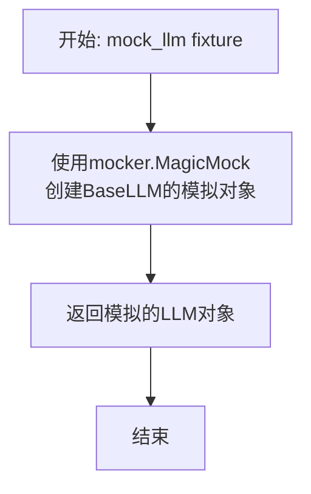
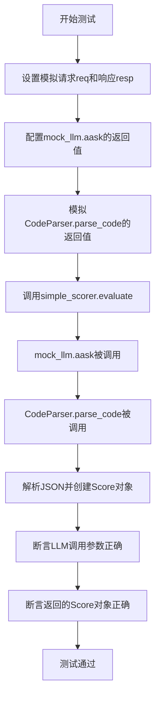
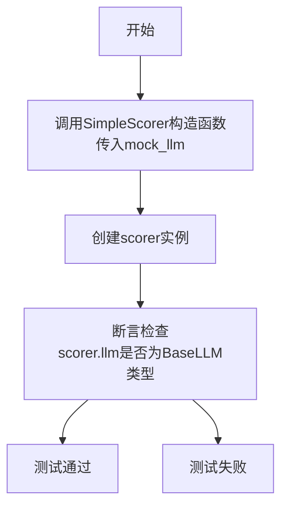
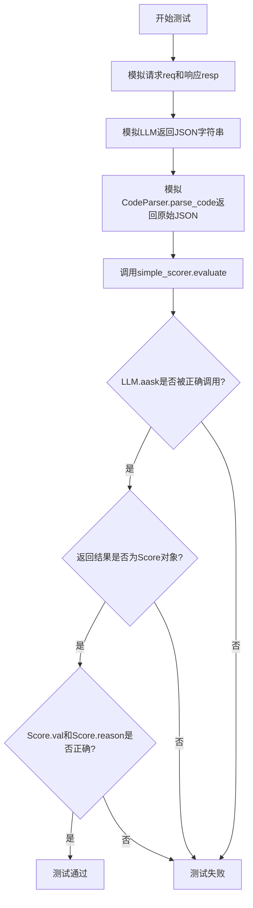
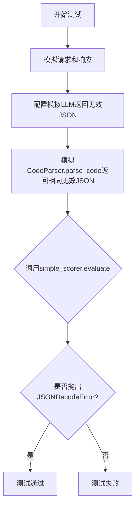

# `.\MetaGPT\tests\metagpt\exp_pool\test_scorers\test_simple_scorer.py` 详细设计文档

该文件是一个使用 pytest 框架编写的单元测试文件，用于测试 `SimpleScorer` 类的功能。`SimpleScorer` 是一个评分器，它利用大语言模型（LLM）根据给定的请求（`req`）和响应（`resp`）生成一个包含分数值和理由的 `Score` 对象。测试主要验证 `SimpleScorer` 的初始化和 `evaluate` 方法，包括正常调用和异常处理（如LLM返回无效JSON）的场景。

## 整体流程

```mermaid
graph TD
    A[开始执行测试] --> B{测试方法?}
    B -- test_init --> C[创建SimpleScorer实例]
    C --> D[断言实例的llm属性类型正确]
    D --> Z[测试通过]
    B -- test_evaluate --> E[模拟LLM请求与响应]
    E --> F[调用simple_scorer.evaluate(req, resp)]
    F --> G[LLM.aask被调用，传入格式化后的提示词]
    G --> H[模拟CodeParser.parse_code解析LLM返回的JSON字符串]
    H --> I[返回Score对象]
    I --> J[断言Score对象的val和reason与模拟值一致]
    J --> Z
    B -- test_evaluate_invalid_response --> K[模拟LLM返回无效JSON字符串]
    K --> L[调用simple_scorer.evaluate(req, resp)]
    L --> M[LLM.aask被调用]
    M --> N[模拟CodeParser.parse_code返回无效字符串]
    N --> O[尝试解析JSON失败，抛出JSONDecodeError异常]
    O --> P[断言捕获到JSONDecodeError异常]
    P --> Z
```

## 类结构

```
TestSimpleScorer (测试类)
├── mock_llm (fixture)
├── simple_scorer (fixture)
├── test_init (测试方法)
├── test_evaluate (异步测试方法)
└── test_evaluate_invalid_response (异步测试方法)
```

## 全局变量及字段


### `SIMPLE_SCORER_TEMPLATE`
    
用于构建评分提示的模板字符串。

类型：`str`
    


### `mock_llm_response`
    
模拟的LLM响应字符串，用于测试。

类型：`str`
    


### `expected_prompt`
    
期望发送给LLM的提示字符串，用于断言测试。

类型：`str`
    


### `req`
    
模拟的请求字符串，用于测试评分器。

类型：`str`
    


### `resp`
    
模拟的响应字符串，用于测试评分器。

类型：`str`
    


### `TestSimpleScorer.mock_llm`
    
模拟的BaseLLM实例，用于测试SimpleScorer。

类型：`MagicMock`
    


### `TestSimpleScorer.simple_scorer`
    
被测试的SimpleScorer实例。

类型：`SimpleScorer`
    


### `TestSimpleScorer.scorer`
    
在test_init方法中创建的SimpleScorer实例。

类型：`SimpleScorer`
    


### `TestSimpleScorer.result`
    
evaluate方法返回的评分结果对象。

类型：`Score`
    
    

## 全局函数及方法

### `TestSimpleScorer.mock_llm`

这是一个用于单元测试的pytest fixture函数，其核心功能是创建一个模拟的`BaseLLM`对象，用于在测试中替换真实的LLM实例，从而隔离外部依赖并控制测试环境。

参数：

- `mocker`：`pytest_mock.plugin.MockerFixture`，pytest-mock插件提供的mocker对象，用于创建模拟对象和打补丁。

返回值：`unittest.mock.MagicMock`，一个被配置为模拟`BaseLLM`类的MagicMock对象。

#### 流程图



#### 带注释源码

```python
    @pytest.fixture
    def mock_llm(self, mocker):
        # 使用pytest-mock的mocker fixture创建一个MagicMock对象。
        # spec=BaseLLM 参数确保模拟对象具有与BaseLLM类相同的接口，
        # 这有助于在测试中捕获不存在的属性或方法调用错误。
        mock_llm = mocker.MagicMock(spec=BaseLLM)
        # 返回创建的模拟对象，供其他测试fixture或测试函数使用。
        return mock_llm
```

### `TestSimpleScorer.test_evaluate`

这是一个单元测试方法，用于测试 `SimpleScorer.evaluate` 方法的功能。它模拟了 `SimpleScorer` 与底层大语言模型（LLM）的交互过程，验证了当给定一个请求和响应时，`evaluate` 方法能够正确调用 LLM 并解析返回的 JSON 数据，最终生成一个 `Score` 对象。

参数：

- `self`：`TestSimpleScorer`，测试类实例的引用。
- `simple_scorer`：`SimpleScorer`，通过 `@pytest.fixture` 注入的 `SimpleScorer` 实例。
- `mock_llm`：`MagicMock`，模拟的 `BaseLLM` 对象。
- `mocker`：`MockerFixture`，pytest-mock 提供的模拟对象创建器。

返回值：`None`，这是一个测试方法，不返回业务值，其成功与否由内部的断言决定。

#### 流程图



#### 带注释源码

```python
    @pytest.mark.asyncio  # 标记此测试为异步测试
    async def test_evaluate(self, simple_scorer, mock_llm, mocker):
        # 1. 准备测试数据：模拟一个请求和对应的响应
        req = "What is the capital of France?"
        resp = "The capital of France is Paris."

        # 2. 模拟LLM的响应：一个包含JSON的字符串，被包裹在代码块标记中
        mock_llm_response = '{"val": 9, "reason": "Accurate and concise answer"}'
        mock_llm.aask.return_value = f"```json\n{mock_llm_response}\n```"

        # 3. 模拟 `CodeParser.parse_code` 方法，使其直接返回解析后的JSON字符串
        #    这模拟了 `SimpleScorer.evaluate` 内部调用 `CodeParser.parse_code` 来提取JSON的行为
        mocker.patch("metagpt.utils.common.CodeParser.parse_code", return_value=mock_llm_response)

        # 4. 执行待测试的方法：调用 `simple_scorer.evaluate`
        result = await simple_scorer.evaluate(req, resp)

        # 5. 验证行为：断言LLM被正确调用，且传入的提示词模板格式正确
        expected_prompt = SIMPLE_SCORER_TEMPLATE.format(req=req, resp=resp)
        mock_llm.aask.assert_called_once_with(expected_prompt)

        # 6. 验证结果：断言返回的对象类型正确，且其字段值与模拟的JSON数据一致
        assert isinstance(result, Score)
        assert result.val == 9
        assert result.reason == "Accurate and concise answer"
```

### `TestSimpleScorer.test_init`

该方法用于测试`SimpleScorer`类的初始化功能，验证在传入一个模拟的`BaseLLM`对象时，`SimpleScorer`实例的`llm`属性是否被正确设置且类型正确。

参数：

- `mock_llm`：`MagicMock`，一个模拟的`BaseLLM`对象，用于作为`SimpleScorer`构造函数的参数。

返回值：`None`，这是一个单元测试方法，不返回任何值，其目的是通过断言来验证代码行为。

#### 流程图



#### 带注释源码

```python
def test_init(self, mock_llm):
    # 使用传入的模拟LLM对象创建一个SimpleScorer实例
    scorer = SimpleScorer(llm=mock_llm)
    # 断言：验证新创建的scorer实例的llm属性确实是BaseLLM类型（或其子类/模拟对象）
    assert isinstance(scorer.llm, BaseLLM)
```

### `TestSimpleScorer.test_evaluate`

这是一个使用 `pytest` 编写的异步单元测试方法，用于测试 `SimpleScorer.evaluate` 方法的功能。它模拟了 `SimpleScorer` 与底层 LLM 的交互过程，验证了在给定请求和响应的情况下，`evaluate` 方法能否正确调用 LLM、解析返回的 JSON 并构造 `Score` 对象。

参数：

- `self`：`TestSimpleScorer`，测试类实例本身。
- `simple_scorer`：`SimpleScorer`，通过 `@pytest.fixture` 注入的 `SimpleScorer` 实例。
- `mock_llm`：`MagicMock`，模拟的 `BaseLLM` 对象。
- `mocker`：`MockerFixture`，`pytest-mock` 提供的模拟对象创建器。

返回值：`None`，这是一个测试方法，不返回业务值，其目的是通过断言验证功能。

#### 流程图



#### 带注释源码

```python
    @pytest.mark.asyncio  # 标记此测试为异步测试
    async def test_evaluate(self, simple_scorer, mock_llm, mocker):
        # Mock request and response
        # 模拟测试用的输入：用户请求和AI响应
        req = "What is the capital of France?"
        resp = "The capital of France is Paris."

        # Mock LLM response
        # 模拟LLM返回的原始字符串，包含一个JSON对象
        mock_llm_response = '{"val": 9, "reason": "Accurate and concise answer"}'
        # 设置模拟LLM的`aask`方法返回一个被代码块包裹的JSON字符串（模拟常见LLM输出格式）
        mock_llm.aask.return_value = f"```json\n{mock_llm_response}\n```"

        # Mock CodeParser.parse_code
        # 模拟`CodeParser.parse_code`方法，使其直接返回JSON字符串，跳过解析步骤
        mocker.patch("metagpt.utils.common.CodeParser.parse_code", return_value=mock_llm_response)

        # Test evaluate method
        # 调用被测试的`evaluate`方法
        result = await simple_scorer.evaluate(req, resp)

        # Assert LLM was called with correct prompt
        # 验证LLM的`aask`方法是否被调用了一次，并且传入的提示词模板正确填充了req和resp
        expected_prompt = SIMPLE_SCORER_TEMPLATE.format(req=req, resp=resp)
        mock_llm.aask.assert_called_once_with(expected_prompt)

        # Assert the result is correct
        # 验证返回的结果：1) 是Score类型；2) 分数值为9；3) 原因为"Accurate and concise answer"
        assert isinstance(result, Score)
        assert result.val == 9
        assert result.reason == "Accurate and concise answer"
```

### `TestSimpleScorer.test_evaluate_invalid_response`

这是一个单元测试方法，用于测试 `SimpleScorer.evaluate` 方法在接收到无效的 LLM 响应（即无法解析为有效 JSON 的字符串）时，是否会正确地抛出 `json.JSONDecodeError` 异常。它通过模拟一个返回无效 JSON 字符串的 LLM 来验证错误处理逻辑。

参数：

- `simple_scorer`：`SimpleScorer`，通过 `@pytest.fixture` 注入的 `SimpleScorer` 实例，是待测试的对象。
- `mock_llm`：`MagicMock`，通过 `@pytest.fixture` 注入的模拟 `BaseLLM` 对象，用于控制 LLM 的响应行为。
- `mocker`：`MockerFixture`，`pytest-mock` 插件提供的模拟工具，用于在测试中替换（patch）其他函数或方法。

返回值：`None`，此测试方法不返回任何值，其成功与否由 `pytest.raises` 上下文管理器是否捕获到预期的异常来判断。

#### 流程图



#### 带注释源码

```python
    @pytest.mark.asyncio
    async def test_evaluate_invalid_response(self, simple_scorer, mock_llm, mocker):
        # 1. 模拟请求和响应：定义测试用的输入数据。
        req = "What is the capital of France?"
        resp = "The capital of France is Paris."

        # 2. 配置模拟LLM返回无效JSON：设置模拟对象 `mock_llm.aask` 的返回值为一个无效的 JSON 字符串。
        mock_llm_response = "Invalid JSON"
        mock_llm.aask.return_value = f"```json\n{mock_llm_response}\n```"

        # 3. 模拟CodeParser.parse_code返回相同无效JSON：使用 `mocker.patch` 替换 `CodeParser.parse_code` 方法，
        #    使其直接返回 `mock_llm_response`，模拟解析步骤也得到无效内容。
        mocker.patch("metagpt.utils.common.CodeParser.parse_code", return_value=mock_llm_response)

        # 4. 测试evaluate方法并断言异常：使用 `pytest.raises` 上下文管理器调用被测试的 `evaluate` 方法。
        #    预期 `json.loads` 在解析无效字符串时会抛出 `json.JSONDecodeError` 异常。
        #    如果异常被成功捕获，则测试通过；否则，测试失败。
        with pytest.raises(json.JSONDecodeError):
            await simple_scorer.evaluate(req, resp)
```

## 关键组件

### SimpleScorer

一个基于大语言模型（LLM）的简单评分器，它通过向LLM发送一个格式化的问题和答案对，并解析LLM返回的JSON字符串来生成一个包含分数值和理由的`Score`对象。

### SIMPLE_SCORER_TEMPLATE

一个用于格式化评分提示的字符串模板，它将用户请求（`req`）和模型响应（`resp`）填充到预定义的提示词中，以构建发送给LLM的完整提示。

### Score

一个数据类（来自`metagpt.exp_pool.schema`），用于封装评分结果，包含数值（`val`）和理由（`reason`）两个字段。

### BaseLLM

一个抽象基类（来自`metagpt.llm`），定义了与大型语言模型交互的接口。`SimpleScorer`依赖此接口来调用LLM的异步问答（`aask`）功能。

### CodeParser

一个工具类（来自`metagpt.utils.common`），用于从LLM返回的文本（通常包含代码块标记）中解析出结构化的代码或数据。在本代码中，它被用于从LLM的响应中提取JSON字符串。

## 问题及建议

### 已知问题

-   **测试用例对实现细节耦合度过高**：`test_evaluate` 和 `test_evaluate_invalid_response` 测试用例中，通过 `mocker.patch` 直接模拟了 `CodeParser.parse_code` 的内部调用。这使得测试与 `SimpleScorer.evaluate` 方法的具体实现（即它使用了 `CodeParser`）紧密耦合。如果未来 `evaluate` 方法重构，不再使用 `CodeParser`，这些测试将毫无意义地失败，增加了维护成本。
-   **异常测试用例设计不完整**：`test_evaluate_invalid_response` 测试用例旨在测试当 LLM 返回无效 JSON 时，`evaluate` 方法会抛出 `json.JSONDecodeError`。然而，测试中模拟的 `CodeParser.parse_code` 返回了一个非 JSON 字符串 `"Invalid JSON"`，这直接导致了后续的 `json.loads` 调用失败。这个测试实际上测试的是 `json.loads` 的行为，而不是 `evaluate` 方法在收到无效 LLM 响应时的整体容错或错误处理逻辑。它没有覆盖 `CodeParser.parse_code` 可能返回 `None` 或其他非字符串值等边界情况。
-   **测试数据硬编码，缺乏灵活性**：测试用例中的请求（`req`）、响应（`resp`）和预期的 LLM 回复都是硬编码的字符串。这使得测试用例难以扩展，例如，如果需要测试不同场景下的评分逻辑，就需要复制多个几乎相同的测试函数或添加复杂的参数化逻辑。

### 优化建议

-   **解耦测试与内部实现**：重构测试用例，避免直接模拟 `CodeParser.parse_code`。相反，应该通过模拟 `SimpleScorer` 所依赖的 `BaseLLM` 实例（`mock_llm`）的 `aask` 方法返回值，来间接控制 `evaluate` 方法的输入。这样，测试将只关注 `SimpleScorer` 的公共接口（`evaluate`）和其与 LLM 的交互契约，而不关心其内部是否使用了 `CodeParser` 或其他工具。这将使测试更加健壮，更能抵御实现细节的变化。
-   **完善异常和边界测试**：设计更全面的测试用例来覆盖 `evaluate` 方法的错误处理路径。例如：
    -   测试当 `llm.aask` 返回 `None` 或空字符串时的情况。
    -   测试当 `CodeParser.parse_code` 返回的字符串无法被解析为有效 `Score` 对象（例如，缺少 `val` 或 `reason` 字段，或 `val` 不是数字）时的情况。
    -   考虑 `SimpleScorer` 是否应该捕获 `json.JSONDecodeError` 并转换为一个默认的 `Score` 或抛出一个更具业务语义的自定义异常。
-   **使用参数化测试提高覆盖率和可维护性**：利用 `pytest.mark.parametrize` 装饰器，将不同的测试输入（请求、响应、模拟的 LLM 输出、期望的评分结果）参数化。这样可以在一组数据上运行同一个测试逻辑，使测试代码更简洁，更容易添加新的测试场景，并清晰地展示不同输入对应的预期行为。例如，可以参数化测试有效响应、无效 JSON 响应、边界分数（如 0, 10）等。

## 其它


### 设计目标与约束

该代码是一个针对 `SimpleScorer` 类的单元测试套件。其设计目标是验证 `SimpleScorer` 类的核心功能，特别是其 `evaluate` 方法，能够正确地与底层 LLM 交互、处理响应并生成 `Score` 对象。主要约束包括：1) 测试必须隔离，不依赖真实的 LLM 服务，因此使用 `pytest-mock` 进行模拟；2) 需要覆盖正常流程和异常流程（如 LLM 返回无效 JSON）；3) 测试方法必须是异步的，以匹配被测试的异步 `evaluate` 方法。

### 错误处理与异常设计

测试套件明确设计了对错误情况的验证。在 `test_evaluate_invalid_response` 测试中，它模拟了 LLM 返回无法解析为 JSON 的字符串的场景。测试期望 `simple_scorer.evaluate` 方法内部在尝试解析该响应时会抛出 `json.JSONDecodeError` 异常，并通过 `pytest.raises` 上下文管理器来断言这一行为。这确保了 `SimpleScorer` 的实现没有对无效的 LLM 响应进行静默处理，而是将解析错误向上层抛出。

### 数据流与状态机

测试中的数据流是线性的、无状态的。每个测试方法都是独立的。流程如下：
1.  **准备阶段 (Arrange)**：通过 `@pytest.fixture` 创建模拟的 `mock_llm` 和 `simple_scorer` 实例。为特定测试用例设置模拟的请求 (`req`)、响应 (`resp`) 以及 `mock_llm.aask` 方法的返回值。
2.  **执行阶段 (Act)**：调用被测试的异步方法 `simple_scorer.evaluate(req, resp)`。
3.  **验证阶段 (Assert)**：
    *   对于正常流程 (`test_evaluate`)：验证 `mock_llm.aask` 是否以正确的提示词模板被调用一次；验证返回的 `result` 是 `Score` 类型，并且其 `val` 和 `reason` 字段与模拟的 LLM 响应内容一致。
    *   对于异常流程 (`test_evaluate_invalid_response`)：验证调用 `evaluate` 会引发预期的 `JSONDecodeError` 异常。
测试本身不涉及复杂的状态转换，其核心是验证函数调用的输入、输出及副作用是否符合预期。

### 外部依赖与接口契约

测试套件明确模拟并定义了以下关键外部依赖的接口契约：
1.  **`BaseLLM` 接口**：测试依赖于 `BaseLLM` 的 `aask` 异步方法。通过 `mocker.MagicMock(spec=BaseLLM)` 创建了一个符合该接口规范的模拟对象，并预设了其返回值。测试验证了 `SimpleScorer` 是否正确调用了此方法。
2.  **`CodeParser.parse_code` 函数**：这是 `metagpt.utils.common` 模块中的一个工具函数。测试通过 `mocker.patch` 模拟了此函数，使其直接返回预设的字符串，从而隔离了 `SimpleScorer.evaluate` 方法内部对该解析器的依赖。这假设了 `SimpleScorer` 会使用 `CodeParser.parse_code` 来处理 LLM 返回的、可能被代码块标记包裹的响应。
3.  **`SIMPLE_SCORER_TEMPLATE` 模板**：测试验证了 `SimpleScorer` 在构造给 LLM 的提示词时，正确使用了这个来自 `metagpt.exp_pool.scorers.simple` 模块的全局模板字符串，并将 `req` 和 `resp` 参数格式化到模板中。

    