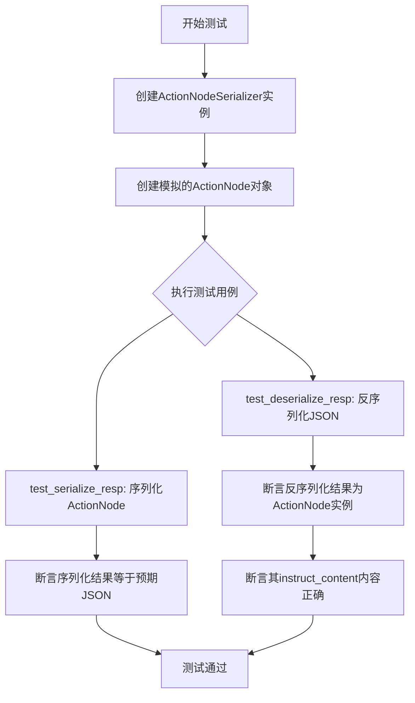
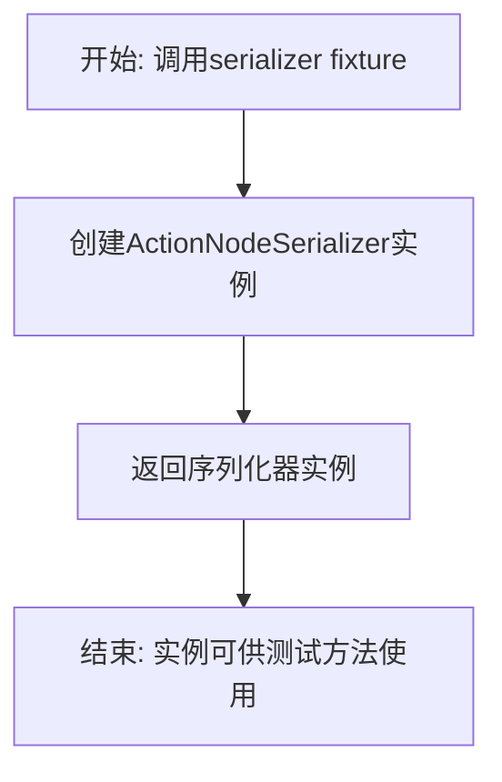
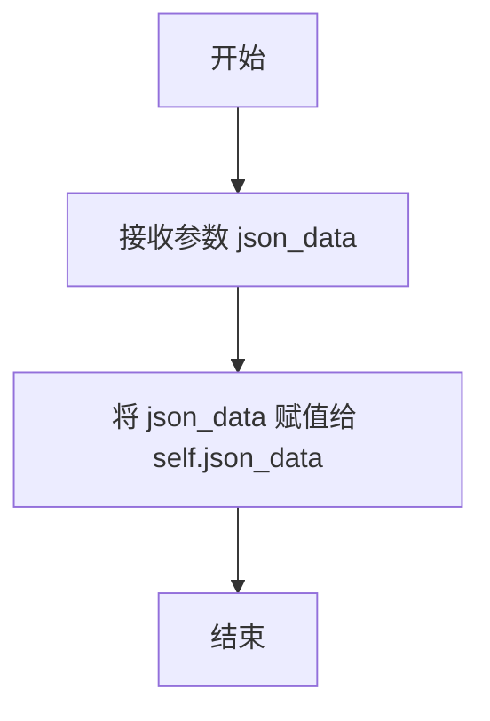
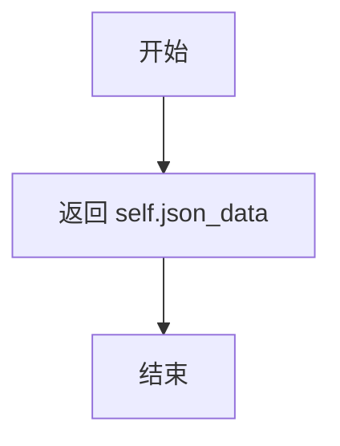

# `.\MetaGPT\tests\metagpt\exp_pool\test_serializers\test_action_node.py` 详细设计文档

该代码是一个使用pytest框架编写的单元测试文件，用于测试ActionNodeSerializer类的序列化与反序列化功能。它验证了ActionNodeSerializer能够正确地将ActionNode对象（包含其instruct_content属性）序列化为JSON字符串，并能将JSON字符串反序列化回ActionNode对象。

## 整体流程



## 类结构

```
TestActionNodeSerializer (测试类)
├── InstructContent (内部模拟类)
│   ├── __init__
│   └── model_dump_json
├── serializer (pytest fixture)
├── action_node (pytest fixture)
├── test_serialize_resp (测试方法)
└── test_deserialize_resp (测试方法)
```

## 全局变量及字段


### `InstructContent.json_data`
    
存储JSON格式数据的字符串，用于模拟ActionNode的instruct_content内容

类型：`str`
    
    

## 全局函数及方法


### `TestActionNodeSerializer.serializer`

这是一个Pytest fixture，用于创建并返回一个`ActionNodeSerializer`类的实例，作为测试类`TestActionNodeSerializer`中测试方法的依赖项。它确保了每个测试方法都能获得一个全新的、干净的序列化器实例。

参数：

-  `self`：`TestActionNodeSerializer`，指向当前测试类实例的引用。

返回值：`ActionNodeSerializer`，返回一个`ActionNodeSerializer`类的实例。

#### 流程图



#### 带注释源码

```python
    @pytest.fixture
    # 定义一个名为'serializer'的Pytest fixture
    def serializer(self):
        # fixture的主体：创建并返回一个ActionNodeSerializer对象
        return ActionNodeSerializer()
```


### `TestActionNodeSerializer.action_node`

这是一个用于测试的 pytest fixture 方法。它的核心功能是创建一个模拟的 `ActionNode` 对象，并为其设置一个包含预设 JSON 数据的 `instruct_content` 属性，以便在 `TestActionNodeSerializer` 类的其他测试方法中使用。

参数：

-   `self`：`TestActionNodeSerializer`，`TestActionNodeSerializer` 类的实例引用。

返回值：`ActionNode`，返回一个配置好的 `ActionNode` 实例，其 `instruct_content` 属性包含 `{"key": "value"}` 的 JSON 字符串表示。

#### 流程图

```mermaid
flowchart TD
    A[开始] --> B[定义内部类 InstructContent]
    B --> C[创建 ActionNode 实例<br/>key='', expected_type=str,<br/>instruction='', example='']
    C --> D[创建 InstructContent 实例<br/>json_data='{"key": "value"}']
    D --> E[将 InstructContent 实例<br/>赋值给 action_node.instruct_content]
    E --> F[返回 action_node]
    F --> G[结束]
```

#### 带注释源码

```python
    @pytest.fixture
    def action_node(self):
        # 定义一个内部类 `InstructContent`，用于模拟 `ActionNode` 中 `instruct_content` 属性的行为。
        class InstructContent:
            def __init__(self, json_data):
                # 初始化时接收一个 JSON 字符串。
                self.json_data = json_data

            def model_dump_json(self):
                # 模拟序列化方法，直接返回存储的 JSON 字符串。
                return self.json_data

        # 创建一个 `ActionNode` 实例，并传入一些基础参数（这些参数在本次测试中并非核心）。
        action_node = ActionNode(key="", expected_type=Type[str], instruction="", example="")
        # 为刚创建的 `action_node` 设置 `instruct_content` 属性。
        # 该属性是一个 `InstructContent` 实例，其内部数据为固定的 JSON 字符串 '{"key": "value"}'。
        action_node.instruct_content = InstructContent('{"key": "value"}')

        # 将此配置好的 `action_node` 实例作为 fixture 的返回值，供测试用例使用。
        return action_node
```

### `TestActionNodeSerializer.test_serialize_resp`

该方法用于测试 `ActionNodeSerializer` 类的 `serialize_resp` 方法。它验证了当传入一个包含特定 `instruct_content` 的 `ActionNode` 对象时，序列化器能够正确地将该对象的响应内容序列化为预期的 JSON 字符串。

参数：

- `serializer`：`ActionNodeSerializer`，用于执行序列化操作的 `ActionNodeSerializer` 实例。
- `action_node`：`ActionNode`，一个预配置的 `ActionNode` 测试对象，其 `instruct_content` 属性包含一个可序列化为 `{"key": "value"}` 的对象。

返回值：`None`，这是一个单元测试方法，不返回任何值，而是通过断言（`assert`）来验证测试结果。

#### 流程图

```mermaid
flowchart TD
    A[开始测试] --> B[获取测试夹具<br>serializer 和 action_node]
    B --> C[调用 serializer.serialize_resp<br>传入 action_node]
    C --> D{断言<br>序列化结果等于 '{"key": "value"}'}
    D --> E[测试通过]
    D --> F[测试失败]
```

#### 带注释源码

```python
def test_serialize_resp(self, serializer: ActionNodeSerializer, action_node: ActionNode):
    # 调用被测试的序列化方法，传入准备好的 ActionNode 对象
    serialized = serializer.serialize_resp(action_node)
    # 断言序列化后的字符串与预期的 JSON 字符串完全一致
    assert serialized == '{"key": "value"}'
```

### `TestActionNodeSerializer.test_deserialize_resp`

该方法用于测试 `ActionNodeSerializer` 类的 `deserialize_resp` 方法。它验证了该方法能够正确地将一个JSON格式的字符串反序列化为一个 `ActionNode` 对象，并且该对象的 `instruct_content` 属性能够正确还原原始数据。

参数：

- `serializer`：`ActionNodeSerializer`，`ActionNodeSerializer` 类的实例，用于执行序列化和反序列化操作。
- `action_node`：`ActionNode`，一个 `ActionNode` 类的实例，用于测试序列化功能。

返回值：`None`，这是一个单元测试方法，不返回任何值，而是通过断言（assert）来验证测试结果。

#### 流程图

```mermaid
graph TD
    A[开始] --> B[调用 serializer.deserialize_resp<br/>传入JSON字符串]
    B --> C{反序列化成功？}
    C -- 是 --> D[验证返回对象类型为 ActionNode]
    D --> E[验证 instruct_content.model_dump_json()<br/>返回原始JSON字符串]
    E --> F[测试通过]
    C -- 否 --> G[测试失败]
    F --> H[结束]
    G --> H
```

#### 带注释源码

```python
def test_deserialize_resp(self, serializer: ActionNodeSerializer):
    # 调用被测试方法：将JSON字符串反序列化为ActionNode对象
    deserialized = serializer.deserialize_resp('{"key": "value"}')
    
    # 断言1：验证反序列化返回的对象是ActionNode类型
    assert isinstance(deserialized, ActionNode)
    
    # 断言2：验证反序列化后对象的instruct_content属性能够通过model_dump_json方法
    # 返回与原始输入相同的JSON字符串，确保数据完整性
    assert deserialized.instruct_content.model_dump_json() == '{"key": "value"}'
```

### `InstructContent.__init__`

该方法用于初始化`InstructContent`类的实例，将传入的JSON数据存储为实例属性。

参数：

- `json_data`：`Any`，传入的JSON格式数据，将被存储为实例的`json_data`属性。

返回值：`None`，无返回值。

#### 流程图



#### 带注释源码

```python
def __init__(self, json_data):
    # 初始化方法，接收一个参数 json_data
    self.json_data = json_data  # 将传入的 json_data 赋值给实例属性 self.json_data
```

### `InstructContent.model_dump_json`

该方法返回`InstructContent`实例中存储的JSON字符串数据。它不进行任何处理或转换，只是简单地返回初始化时传入的`json_data`。

参数：无

返回值：`str`，返回存储在`InstructContent`实例中的原始JSON字符串。

#### 流程图



#### 带注释源码

```python
def model_dump_json(self):
    # 该方法直接返回实例初始化时传入的json_data属性
    return self.json_data
```

## 关键组件


### ActionNodeSerializer

负责序列化和反序列化ActionNode对象，特别是处理其instruct_content属性的JSON数据转换。

### ActionNode

表示一个动作节点，包含指令内容（instruct_content）等属性，其instruct_content属性需要支持序列化为JSON字符串。

### InstructContent（模拟类）

在测试中用于模拟ActionNode的instruct_content属性，提供model_dump_json方法以返回JSON字符串数据。

### pytest Fixtures (serializer, action_node)

用于测试的固定装置，为测试方法提供预配置的ActionNodeSerializer实例和ActionNode实例，确保测试的独立性和可重复性。


## 问题及建议


### 已知问题

-   **测试类`TestActionNodeSerializer`中的`action_node` fixture存在硬编码和类型不匹配问题**：`action_node` fixture创建了一个`ActionNode`实例，其`expected_type`参数被设置为`Type[str]`。然而，`ActionNode`的`expected_type`参数通常期望一个具体的类型（如`str`），而不是`Type[str]`（这是一个`type`对象）。这可能导致测试与生产代码的实际使用方式不符，或者`ActionNode`的`__init__`方法本身对`expected_type`参数的处理存在歧义。
-   **`action_node` fixture中的`InstructContent`类是模拟的，可能无法完全反映真实行为**：测试中创建了一个临时的`InstructContent`类来模拟`instruct_content`属性及其`model_dump_json`方法。如果真实的`InstructContent`类有更复杂的行为（例如，数据验证、序列化格式差异），这个模拟可能不够充分，导致测试覆盖不全。
-   **`test_deserialize_resp`测试用例的断言可能过于宽松**：该测试仅断言反序列化结果是一个`ActionNode`实例，并且其`instruct_content.model_dump_json()`返回特定字符串。它没有验证反序列化后的`ActionNode`的其他关键属性（如`key`, `instruction`, `example`）是否正确恢复，这可能导致反序列化逻辑中的潜在错误被遗漏。

### 优化建议

-   **修正`action_node` fixture中`expected_type`的使用**：审查`ActionNode`类的`__init__`方法，明确`expected_type`参数期望的类型。如果它期望一个具体的类型（如`str`），则将fixture中的`Type[str]`改为`str`。如果它期望一个`type`对象，则保持原样，但建议在代码注释中明确说明。
-   **使用更真实的测试替身或依赖注入**：考虑使用`unittest.mock`库来创建`InstructContent`的Mock或MagicMock对象，这样可以更精确地控制其行为，并验证与`ActionNodeSerializer`的交互。或者，如果可能，使用真实的`InstructContent`实例进行测试，以提高测试的真实性。
-   **增强`test_deserialize_resp`测试的完整性**：在反序列化测试中，除了验证`instruct_content`，还应验证反序列化后的`ActionNode`对象的其他属性是否与序列化前的预期值一致。可以创建一个包含完整属性的`ActionNode`进行序列化/反序列化往返测试。
-   **考虑添加异常处理测试**：当前的测试只覆盖了正常路径。建议添加测试用例来验证`serialize_resp`和`deserialize_resp`方法在接收到无效输入（如`None`、非`ActionNode`对象、无效JSON字符串）时的行为，例如是否抛出预期的异常。
-   **审视测试命名和结构**：测试方法`test_serialize_resp`和`test_deserialize_resp`的名称清晰地表明了它们测试的功能。确保fixture`serializer`和`action_node`的命名也清晰易懂。考虑是否需要为不同的测试场景（如边界条件）创建更多的fixture或测试用例。


## 其它


### 设计目标与约束

本模块的设计目标是提供一个用于序列化和反序列化 `ActionNode` 对象的组件，主要用于实验池（exp_pool）的数据持久化与恢复。其核心约束包括：
1.  **接口一致性**：必须实现 `metagpt.exp_pool.serializers.base.Serializer` 接口定义的 `serialize_resp` 和 `deserialize_resp` 方法。
2.  **数据保真度**：序列化与反序列化过程必须保证 `ActionNode` 对象的核心状态（特别是其 `instruct_content` 属性）能够无损地转换。
3.  **轻量级**：作为底层序列化工具，应避免引入复杂的依赖和过重的处理逻辑，保持高效。
4.  **可测试性**：设计应便于单元测试，能够验证序列化结果的正确性以及反序列化后对象的完整性。

### 错误处理与异常设计

当前代码在测试中未显式展示错误处理逻辑。基于其功能，潜在的异常场景及处理方式应包括：
1.  **无效输入数据**：`deserialize_resp` 方法接收的字符串可能不是有效的 JSON 格式。预期应捕获 `json.JSONDecodeError` 异常，并可能封装或抛出一个更具业务语义的序列化异常（如 `SerializationError`）。
2.  **不兼容的数据结构**：反序列化得到的 JSON 数据结构可能无法正确映射或初始化 `ActionNode` 对象或其 `instruct_content`。预期应进行数据验证，并在数据不匹配时抛出异常（如 `ValidationError` 或 `DeserializationError`）。
3.  **缺失的依赖属性**：在序列化时，如果 `ActionNode` 对象的 `instruct_content` 为 `None` 或缺少 `model_dump_json` 方法，`serialize_resp` 方法应能处理此情况，可能返回一个默认值（如空对象 `{}` 的 JSON 字符串）或抛出异常。
当前测试用例仅覆盖了“理想路径”，错误处理机制需要查阅 `ActionNodeSerializer` 的实际实现代码来确认。

### 数据流与状态机

本模块的数据流相对简单直接，不涉及复杂的状态机：
1.  **序列化数据流**：
    *   **输入**：一个 `ActionNode` 对象实例。
    *   **处理**：调用其 `instruct_content.model_dump_json()` 方法获取 JSON 字符串。
    *   **输出**：该 JSON 字符串。
    *   **状态变化**：无。这是一个纯函数，不改变输入对象的状态。
2.  **反序列化数据流**：
    *   **输入**：一个 JSON 格式的字符串。
    *   **处理**：解析 JSON 字符串，并利用解析后的数据构造一个新的 `ActionNode` 对象（或其 `instruct_content`）。
    *   **输出**：一个新的 `ActionNode` 对象实例。
    *   **状态变化**：从无状态的字符串生成一个新的有状态对象。

### 外部依赖与接口契约

1.  **外部依赖**：
    *   `json` 模块（Python 标准库）：用于 JSON 字符串的解析与生成。这是核心的序列化协议依赖。
    *   `metagpt.actions.action_node.ActionNode`：序列化操作的目标类。`ActionNodeSerializer` 深度依赖于 `ActionNode` 的公共接口，特别是其 `instruct_content` 属性的结构和方法（`model_dump_json`）。
    *   `pytest`：仅用于测试框架，不属于运行时依赖。
2.  **接口契约**：
    *   **对上游（调用方）的契约**：提供 `serialize_resp(obj)` 和 `deserialize_resp(data)` 方法，分别接受 `ActionNode` 对象和 JSON 字符串，并返回 JSON 字符串和 `ActionNode` 对象。调用方需确保传入的 `ActionNode` 对象的 `instruct_content` 符合预期接口。
    *   **对下游（`ActionNode`）的契约**：假设 `ActionNode` 的 `instruct_content` 属性对象拥有一个 `model_dump_json()` 方法，该方法返回一个可序列化的 JSON 字符串。同时，假设 `ActionNode` 的构造函数或某个工厂方法能够根据 `model_dump_json()` 产生的数据重建一个等效的对象。这个契约是隐式且强耦合的。

### 性能考量

1.  **序列化/反序列化开销**：主要性能开销在于 JSON 的编码与解码。对于单个 `ActionNode` 操作，开销可忽略。但在批量处理大量 `ActionNode` 对象（例如，整个实验池的保存与加载）时，需要关注总体耗时。
2.  **内存使用**：序列化过程会生成字符串形式的中间数据。反序列化过程会创建新的 Python 对象。在处理极大规模数据时，需要注意内存峰值。
3.  **优化空间**：当前实现可能直接使用 `json.loads`/`json.dumps`。如果 `instruct_content` 的数据结构非常复杂或庞大，可以考虑使用更高效的 JSON 库（如 `ujson` 或 `orjson`）或实现增量式、流式的序列化策略。但鉴于其作为特定对象的专用序列化器，当前简单实现通常是合理且足够的。

    