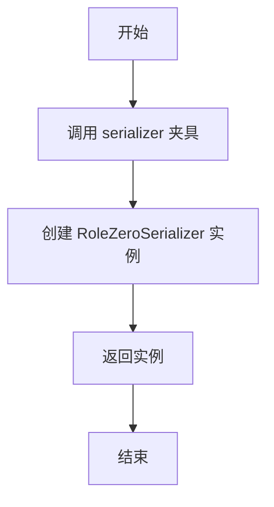
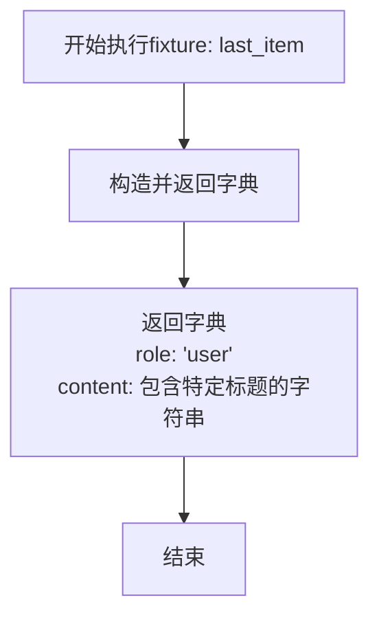
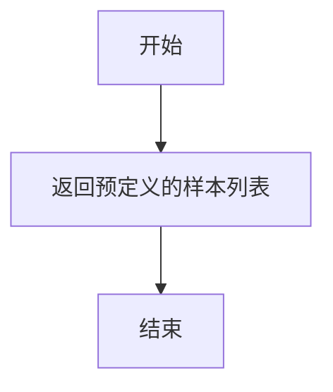

# `.\MetaGPT\tests\metagpt\exp_pool\test_serializers\test_role_zero.py` 详细设计文档

该文件是一个单元测试文件，用于测试 `RoleZeroSerializer` 类的序列化功能，特别是其 `serialize_req` 方法。测试验证了序列化器能正确处理空输入、包含特定内容的请求列表，并能通过内部方法 `_filter_req` 过滤掉非用户角色的消息，确保序列化输出符合预期格式。

## 整体流程

```mermaid
graph TD
    A[开始测试] --> B{测试用例选择}
    B --> C[test_serialize_req_empty_input]
    B --> D[test_serialize_req_with_content]
    B --> E[test_filter_req]
    C --> F[调用 serializer.serialize_req([])]
    F --> G[断言返回空字符串]
    D --> H[准备包含last_item的req]
    H --> I[调用 serializer.serialize_req(req)]
    I --> J[断言返回预期的JSON字符串]
    E --> K[准备包含多角色消息的req]
    K --> L[调用 serializer._filter_req(req)]
    L --> M[断言过滤后列表长度和内容]
    G --> N[测试通过]
    J --> N
    M --> N
    N --> O[结束测试]
```

## 类结构

```
TestRoleZeroSerializer (测试类)
├── serializer (fixture: 返回RoleZeroSerializer实例)
├── last_item (fixture: 返回一个特定的字典作为测试数据)
├── sample_req (fixture: 返回一个示例请求列表)
├── test_serialize_req_empty_input (测试方法: 测试空输入序列化)
├── test_serialize_req_with_content (测试方法: 测试带内容输入序列化)
└── test_filter_req (测试方法: 测试内部过滤方法)
```

## 全局变量及字段


    

## 全局函数及方法

### `TestRoleZeroSerializer.serializer`

这是一个 Pytest 测试夹具（fixture），用于在 `TestRoleZeroSerializer` 测试类中创建并返回一个 `RoleZeroSerializer` 实例。它确保了每个测试方法都能获得一个全新的、独立的序列化器对象，从而避免测试间的状态污染。

参数：

-  `self`：`TestRoleZeroSerializer`，指向当前测试类实例的引用。

返回值：`RoleZeroSerializer`，返回一个 `RoleZeroSerializer` 类的实例。

#### 流程图



#### 带注释源码

```python
    @pytest.fixture
    # 定义一个名为 `serializer` 的 Pytest 夹具。
    # 夹具的返回类型被注解为 `RoleZeroSerializer`。
    def serializer(self) -> RoleZeroSerializer:
        # 夹具的主体逻辑：实例化并返回一个 `RoleZeroSerializer` 对象。
        # 这个对象将被注入到所有依赖它的测试方法中。
        return RoleZeroSerializer()
```

### `TestRoleZeroSerializer.last_item`

这是一个 pytest fixture 方法，用于为测试用例提供一个预定义的、包含特定格式内容的字典对象，模拟对话历史中的最后一条消息。

参数：

-   `self`：`TestRoleZeroSerializer`，测试类实例的引用。

返回值：`dict`，一个包含 `"role"` 和 `"content"` 键的字典，其 `"content"` 值是一个包含多个标题（如 `# Current Plan`、`# Instruction`）的字符串，用于测试序列化器处理复杂或特定格式内容的能力。

#### 流程图



#### 带注释源码

```python
    @pytest.fixture
    # 定义一个名为 `last_item` 的 pytest fixture。
    def last_item(self) -> dict:
        # 返回一个固定的字典，作为测试数据。
        return {
            # 模拟一个用户角色发送的消息。
            "role": "user",
            # 消息内容包含多个用 `#` 标记的标题和内容，用于测试序列化器对复杂或格式化文本的处理。
            "content": "# Current Plan\nsome plan\n# Current Plan\nsome plan\n# Instruction\nsome instruction",
        }
```

### `TestRoleZeroSerializer.sample_req`

这是一个用于测试的pytest fixture方法，它提供了一个标准的、简化的对话请求样本数据。该方法不接受任何参数，返回一个包含两个字典的列表，每个字典代表对话中的一个消息，用于在测试中模拟一个典型的用户-助手交互序列。

参数：
- 无

返回值：`list[dict]`，一个包含两个消息字典的列表，第一个是用户消息，第二个是助手消息。

#### 流程图



#### 带注释源码

```python
    @pytest.fixture
    # 定义一个名为sample_req的pytest fixture
    def sample_req(self):
        # 返回一个预定义的列表，包含两个消息字典
        # 第一个字典代表用户消息，内容为"..."
        # 第二个字典代表助手消息，内容为"..."
        return [{"role": "user", "content": "..."}, {"role": "assistant", "content": "..."}]
```

### `TestRoleZeroSerializer.test_serialize_req_empty_input`

该方法用于测试 `RoleZeroSerializer.serialize_req` 方法在接收到空输入列表时的行为，验证其是否返回预期的空字符串。

参数：
- `serializer`：`RoleZeroSerializer`，`RoleZeroSerializer` 类的实例，通过 `@pytest.fixture` 提供。

返回值：`None`，这是一个测试方法，其主要目的是通过断言（`assert`）来验证功能，不直接返回业务值。

#### 流程图

```mermaid
flowchart TD
    A[开始测试] --> B[调用 serializer.serialize_req<br>传入空列表 req=[]]
    B --> C{返回值是否等于空字符串 ''?}
    C -- 是 --> D[测试通过]
    C -- 否 --> E[测试失败，抛出 AssertionError]
    D --> F[结束]
    E --> F
```

#### 带注释源码

```python
def test_serialize_req_empty_input(self, serializer: RoleZeroSerializer):
    # 调用被测试方法 `serializer.serialize_req`，传入一个空列表 `req=[]`
    # 断言（assert）其返回值应等于空字符串 `""`
    # 这是一个边界条件测试，确保当输入为空时，序列化器能正确处理并返回空结果
    assert serializer.serialize_req(req=[]) == ""
```

### `TestRoleZeroSerializer.test_serialize_req_with_content`

该方法是一个单元测试，用于验证 `RoleZeroSerializer.serialize_req` 方法在传入包含特定内容的请求列表时的行为。它构造了一个包含多个消息的请求列表，其中最后一个消息是一个复杂的字典，然后断言序列化器的输出与预期的 JSON 字符串匹配。

参数：

- `serializer`：`RoleZeroSerializer`，由 `pytest.fixture` 提供的 `RoleZeroSerializer` 实例，用于执行序列化操作。
- `last_item`：`dict`，由 `pytest.fixture` 提供的字典，模拟请求列表中的最后一个消息项，包含 `role` 和 `content` 字段。

返回值：`None`，这是一个测试方法，不返回任何值，其目的是通过断言来验证功能。

#### 流程图

```mermaid
flowchart TD
    A[开始测试] --> B[获取fixture: serializer]
    A --> C[获取fixture: last_item]
    B --> D[构造测试请求列表req]
    C --> D
    D --> E[调用serializer.serialize_req(req)]
    E --> F[获取实际输出]
    F --> G[构造预期输出JSON字符串]
    G --> H{实际输出 == 预期输出?}
    H -- 是 --> I[测试通过]
    H -- 否 --> J[测试失败]
    I --> K[结束]
    J --> K
```

#### 带注释源码

```python
def test_serialize_req_with_content(self, serializer: RoleZeroSerializer, last_item: dict):
    # 构造一个包含三个消息字典的请求列表 `req`。
    # 第一个是用户命令，第二个是助手回复，第三个是来自fixture的复杂用户消息。
    req = [
        {"role": "user", "content": "Command Editor.read executed: file_path=test.py"},
        {"role": "assistant", "content": "Some other content"},
        last_item, # 使用fixture提供的字典作为最后一个元素
    ]
    # 定义预期的输出。根据测试逻辑，序列化器应只保留第一个消息。
    # 这里将第一个消息转换为JSON字符串作为预期结果。
    expected_output = json.dumps([{"role": "user", "content": "Command Editor.read executed: file_path=test.py"}])
    # 断言：调用序列化器的 `serialize_req` 方法处理 `req`，
    # 其结果应严格等于 `expected_output`。
    assert serializer.serialize_req(req=req) == expected_output
```

### `TestRoleZeroSerializer.test_filter_req`

这是一个单元测试方法，用于测试 `RoleZeroSerializer` 类的 `_filter_req` 方法。它验证了 `_filter_req` 方法能够正确地从给定的请求列表中筛选出所有角色为“user”的条目。

参数：

- `self`：`TestRoleZeroSerializer`，测试类实例的引用。
- `serializer`：`RoleZeroSerializer`，通过 `pytest.fixture` 注入的 `RoleZeroSerializer` 实例，用于执行测试。

返回值：`None`，这是一个测试方法，不返回任何值，其目的是通过断言来验证代码行为。

#### 流程图

```mermaid
flowchart TD
    A[开始测试] --> B[准备测试数据 req]
    B --> C[调用 serializer._filter_req(req)]
    C --> D{断言: 筛选后列表长度是否为 2?}
    D -- 是 --> E{断言: 第一个元素内容是否正确?}
    E -- 是 --> F{断言: 第二个元素内容是否正确?}
    F -- 是 --> G[测试通过]
    D -- 否 --> H[测试失败]
    E -- 否 --> H
    F -- 否 --> H
```

#### 带注释源码

```python
def test_filter_req(self, serializer: RoleZeroSerializer):
    # 1. 准备测试数据：一个包含 user 和 assistant 角色的混合请求列表。
    req = [
        {"role": "user", "content": "Command Editor.read executed: file_path=test1.py"},
        {"role": "assistant", "content": "Some other content"},
        {"role": "user", "content": "Command Editor.read executed: file_path=test2.py"},
        {"role": "assistant", "content": "Final content"},
    ]
    # 2. 调用被测试的私有方法 `_filter_req` 对请求列表进行筛选。
    filtered_req = serializer._filter_req(req)
    # 3. 断言：验证筛选后的列表长度是否为 2（即只包含两个 user 条目）。
    assert len(filtered_req) == 2
    # 4. 断言：验证筛选后第一个条目的内容是否正确。
    assert filtered_req[0]["content"] == "Command Editor.read executed: file_path=test1.py"
    # 5. 断言：验证筛选后第二个条目的内容是否正确。
    assert filtered_req[1]["content"] == "Command Editor.read executed: file_path=test2.py"
```

## 关键组件


### RoleZeroSerializer

一个用于序列化请求数据的序列化器，它通过过滤掉特定角色（如"assistant"）的消息，仅保留"user"角色的消息，并将过滤后的结果转换为JSON字符串格式。

### 请求过滤机制

在序列化过程中，通过内部方法`_filter_req`过滤输入请求列表，移除所有角色为"assistant"的消息，仅保留角色为"user"的消息，以实现对请求数据的精简和格式化。

### 序列化流程

序列化流程包括两个主要步骤：首先，调用`_filter_req`方法过滤请求数据；其次，将过滤后的数据转换为JSON字符串。如果输入请求为空列表，则直接返回空字符串。

### 测试框架

使用pytest框架进行单元测试，通过fixture提供测试数据（如序列化器实例、模拟请求数据等），确保序列化器的功能正确性，包括处理空输入、包含内容的请求以及过滤逻辑的验证。


## 问题及建议


### 已知问题

-   **测试用例覆盖不完整**：`test_serialize_req_with_content` 测试用例中，`expected_output` 的生成逻辑依赖于 `json.dumps` 对列表的序列化。如果 `RoleZeroSerializer.serialize_req` 方法的内部实现发生变化（例如，输出格式或排序规则改变），此测试用例可能无法有效捕获回归错误，因为它验证的是最终字符串的精确匹配，而非业务逻辑（如过滤规则）。
-   **测试数据硬编码**：测试数据（如 `last_item` fixture 中的 `content` 字段）被硬编码在测试文件中。如果被测试的过滤或序列化逻辑依赖于 `content` 字段的特定模式（例如，以特定标题开头），当这些模式发生变化时，需要同步更新多个测试用例中的数据，增加了维护成本。
-   **未测试边界和异常情况**：当前测试套件缺少对 `serialize_req` 和 `_filter_req` 方法边界条件（如输入为 `None`、包含非字典类型的列表）和异常情况（如字典缺少 `role` 或 `content` 键）的测试。这可能导致生产代码中存在未处理的潜在错误。
-   **内部方法测试暴露**：测试 `_filter_req` 方法（一个以下划线开头、暗示为私有的方法）可能导致测试与实现细节过度耦合。如果未来重构改变了私有方法的名称或签名，即使公共接口 `serialize_req` 的行为不变，相关测试也会失败。

### 优化建议

-   **增强测试用例的健壮性**：对于 `test_serialize_req_with_content`，建议将断言从精确的字符串匹配改为验证业务逻辑。例如，可以反序列化 `expected_output` 和实际输出，然后比较两个列表的内容，或者验证过滤后的列表是否只包含 `role` 为 `"user"` 且 `content` 符合特定模式（如以 `"Command"` 开头）的项。这使测试更关注行为而非具体实现。
-   **使用参数化测试和测试数据工厂**：对于 `test_filter_req` 等测试，考虑使用 `@pytest.mark.parametrize` 来覆盖多种输入场景（如空列表、全助理消息、混合消息）。同时，可以创建一个辅助函数（测试数据工厂）来动态生成符合特定模式的测试消息，减少硬编码，提高测试数据的可维护性和可读性。
-   **补充边界和异常测试**：为 `serialize_req` 方法添加测试用例，验证其对非法输入（如 `None`、非列表、列表项格式错误）的处理方式（是抛出异常、返回默认值还是静默处理）。这有助于明确方法契约并提高代码鲁棒性。
-   **优先测试公共接口**：考虑将测试重点完全放在公共方法 `serialize_req` 上，通过验证其输入输出行为来间接测试 `_filter_req` 的逻辑。如果必须测试私有方法以覆盖复杂逻辑，应意识到这带来的耦合风险，并在重构时准备更新测试。可以为私有方法添加详细的文档字符串，说明其职责和预期行为，作为测试的补充。
-   **提升测试可读性**：在测试方法中添加更清晰的注释，说明每个测试用例旨在验证什么特定行为或规则。使用更具描述性的变量名（例如，`user_messages`, `assistant_messages`）来构建测试数据，使测试意图一目了然。


## 其它


### 设计目标与约束

本测试代码的设计目标是验证 `RoleZeroSerializer` 类的核心功能，特别是其 `serialize_req` 和 `_filter_req` 方法在处理特定格式的对话请求列表时的行为。约束包括：测试应覆盖边界情况（如空输入）、验证序列化输出格式符合预期（JSON字符串），并确保内部过滤逻辑能正确筛选出“user”角色的消息。

### 错误处理与异常设计

当前测试代码主要使用 `assert` 语句进行验证，未显式测试 `RoleZeroSerializer` 类可能抛出的异常。例如，未测试当输入 `req` 参数不是列表、列表元素格式不正确或包含无法序列化为JSON的内容时，`serialize_req` 方法的行为。测试设计应补充这些负面测试用例，以验证代码的健壮性。

### 数据流与状态机

数据流始于测试夹具（`serializer`, `last_item`, `sample_req`）准备测试数据。在测试方法中，数据（`req` 列表）流入被测试的 `serialize_req` 或 `_filter_req` 方法。`serialize_req` 方法内部调用 `_filter_req` 进行数据筛选，然后将结果序列化为JSON字符串输出。测试断言则验证输出数据与预期值是否一致。整个过程是无状态的，不涉及状态转换。

### 外部依赖与接口契约

1.  **外部依赖**：
    *   `json`：用于序列化列表为JSON字符串。
    *   `pytest`：测试框架，用于定义测试类、夹具和运行测试。
    *   `metagpt.exp_pool.serializers.RoleZeroSerializer`：被测试的目标类。测试代码依赖于其公开接口 `serialize_req` 和内部方法 `_filter_req`（尽管是内部方法，但测试中直接调用）。
2.  **接口契约**：
    *   `RoleZeroSerializer.serialize_req(req: list) -> str`：接受一个字典列表，返回一个JSON字符串。测试验证了其过滤和序列化逻辑。
    *   `RoleZeroSerializer._filter_req(req: list) -> list`：（内部方法）接受一个字典列表，返回一个过滤后的字典列表，预期仅保留“role”为“user”的项。测试验证了其过滤逻辑的正确性。
    *   测试夹具接口：为测试方法提供预配置的 `RoleZeroSerializer` 实例和测试数据样本。

### 测试策略与覆盖范围

测试策略采用基于夹具的单元测试，针对 `RoleZeroSerializer` 类的关键方法设计测试用例。覆盖范围包括：
*   **功能路径**：测试了 `serialize_req` 在输入为空列表、包含常规内容以及包含特定格式的`last_item`时的行为。
*   **内部逻辑**：通过直接调用 `_filter_req`，验证了其过滤“user”角色消息的内部逻辑。
*   **边界条件**：包含了空输入 (`[]`) 的测试。
*   **未覆盖区域**：未测试异常输入（如非列表、格式错误的字典）、`last_item` 中“content”字段包含更多复杂标记或换行符的情况，以及 `serialize_req` 与 `_filter_req` 在更复杂数据下的集成行为。也未测试性能或并发场景。

### 可维护性与扩展性

当前测试代码结构清晰，使用 `pytest` 夹具提高了代码复用性。每个测试方法专注于一个特定功能点，符合单元测试的最佳实践。为了提升可维护性，可以考虑：
1.  将硬编码的预期JSON字符串提取为常量或使用 `json.dumps` 动态生成，以减少错误。
2.  为 `_filter_req` 的测试添加更多边界用例（如混合角色、空内容）。
3.  考虑使用参数化测试（`@pytest.mark.parametrize`）来覆盖更多输入组合，使测试用例更易于管理和扩展。

    