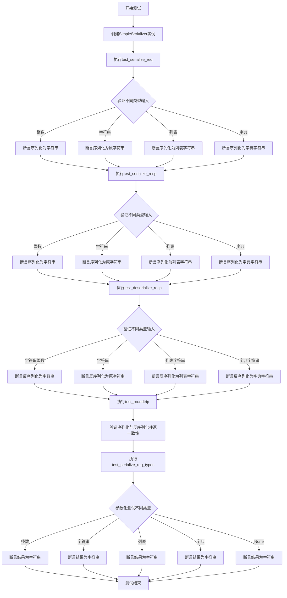
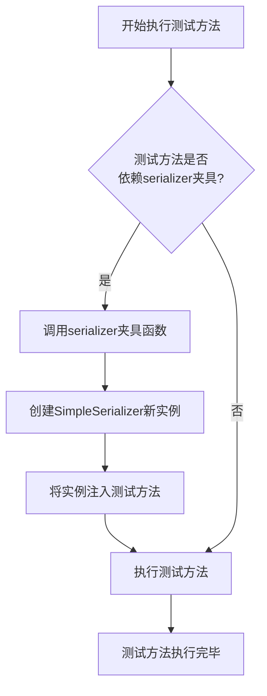
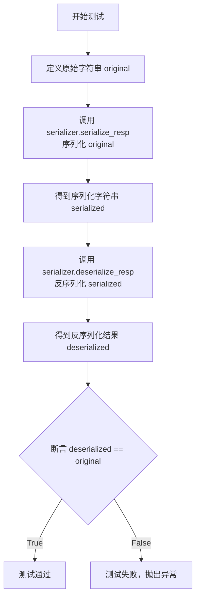

# `.\MetaGPT\tests\metagpt\exp_pool\test_serializers\test_simple.py` 详细设计文档

这是一个使用pytest框架编写的单元测试文件，用于测试SimpleSerializer类的序列化和反序列化功能。测试覆盖了不同类型输入的处理，包括整数、字符串、列表、字典和None，并验证了序列化与反序列化的往返一致性。

## 整体流程



## 类结构

```
TestSimpleSerializer (测试类)
├── serializer (fixture方法)
├── test_serialize_req (测试方法)
├── test_serialize_resp (测试方法)
├── test_deserialize_resp (测试方法)
├── test_roundtrip (测试方法)
└── test_serialize_req_types (参数化测试方法)
```

## 全局变量及字段


    

## 全局函数及方法

### `TestSimpleSerializer.serializer`

这是一个使用 `pytest.fixture` 装饰器定义的测试夹具（fixture）。它的核心功能是为 `TestSimpleSerializer` 测试类中的每个测试方法提供一个全新的、已初始化的 `SimpleSerializer` 实例，确保测试的独立性和可重复性。

参数：

-   `self`：`TestSimpleSerializer`，指向当前测试类实例的引用。

返回值：`SimpleSerializer`，返回一个 `SimpleSerializer` 类的实例。

#### 流程图



#### 带注释源码

```python
    @pytest.fixture
    # 使用pytest的fixture装饰器，标记此方法为一个测试夹具。
    # 夹具会在测试运行前被调用，其返回值可供依赖它的测试方法使用。
    def serializer(self):
        # 夹具方法定义。`self`参数是pytest夹具机制自动传递的测试类实例。
        return SimpleSerializer()
        # 夹具的核心逻辑：创建并返回一个全新的SimpleSerializer实例。
        # 这确保了每个依赖此夹具的测试方法都获得一个独立的、干净的测试对象。
```

### `TestSimpleSerializer.test_serialize_req`

该方法用于测试 `SimpleSerializer` 类的 `serialize_req` 方法，验证其能否正确地将不同类型的输入（如整数、字符串、列表、字典）序列化为字符串。

参数：
- `self`：`TestSimpleSerializer`，测试类实例
- `serializer`：`SimpleSerializer`，通过 `@pytest.fixture` 注入的 `SimpleSerializer` 实例，用于执行序列化操作

返回值：`None`，测试方法不返回任何值，通过断言验证测试结果

#### 流程图

```mermaid
flowchart TD
    A[开始测试] --> B[调用serializer.serialize_req<br>输入整数123]
    B --> C{断言结果等于'123'?}
    C -->|是| D[调用serializer.serialize_req<br>输入字符串'test']
    C -->|否| Z[测试失败]
    D --> E{断言结果等于'test'?}
    E -->|是| F[调用serializer.serialize_req<br>输入列表[1, 2, 3]]
    E -->|否| Z
    F --> G{断言结果等于'[1, 2, 3]'?}
    G -->|是| H[调用serializer.serialize_req<br>输入字典{'a': 1}]
    G -->|否| Z
    H --> I{断言结果等于"{'a': 1}"?}
    I -->|是| J[测试通过]
    I -->|否| Z
```

#### 带注释源码

```python
def test_serialize_req(self, serializer: SimpleSerializer):
    # Test with different types of input
    # 测试整数输入：验证序列化整数 123 结果为字符串 "123"
    assert serializer.serialize_req(req=123) == "123"
    # 测试字符串输入：验证序列化字符串 "test" 结果为原字符串 "test"
    assert serializer.serialize_req(req="test") == "test"
    # 测试列表输入：验证序列化列表 [1, 2, 3] 结果为字符串 "[1, 2, 3]"
    assert serializer.serialize_req(req=[1, 2, 3]) == "[1, 2, 3]"
    # 测试字典输入：验证序列化字典 {'a': 1} 结果为字符串 "{'a': 1}"
    assert serializer.serialize_req(req={"a": 1}) == "{'a': 1}"
```

### `TestSimpleSerializer.test_serialize_resp`

该方法用于测试 `SimpleSerializer` 类的 `serialize_resp` 方法，验证其能否正确地将不同类型的输入（整数、字符串、列表、字典）序列化为字符串。

参数：

- `serializer`：`SimpleSerializer`，由 `pytest.fixture` 提供的 `SimpleSerializer` 实例，用于执行序列化操作。
- `self`：`TestSimpleSerializer`，测试类实例的引用。

返回值：`None`，测试方法通常不返回值，而是通过断言（`assert`）来验证结果。

#### 流程图

```mermaid
graph TD
    A[开始测试 test_serialize_resp] --> B[获取 serializer 实例]
    B --> C[断言: serializer.serialize_resp(456) == '456']
    C --> D[断言: serializer.serialize_resp('response') == 'response']
    D --> E[断言: serializer.serialize_resp([4, 5, 6]) == '[4, 5, 6]']
    E --> F[断言: serializer.serialize_resp({'b': 2}) == '{'b': 2}']
    F --> G[所有断言通过]
    G --> H[测试结束]
```

#### 带注释源码

```python
def test_serialize_resp(self, serializer: SimpleSerializer):
    # Test with different types of input
    # 测试整数 456 的序列化，预期结果为字符串 "456"
    assert serializer.serialize_resp(456) == "456"
    # 测试字符串 "response" 的序列化，预期结果为原字符串 "response"
    assert serializer.serialize_resp("response") == "response"
    # 测试列表 [4, 5, 6] 的序列化，预期结果为字符串 "[4, 5, 6]"
    assert serializer.serialize_resp([4, 5, 6]) == "[4, 5, 6]"
    # 测试字典 {'b': 2} 的序列化，预期结果为字符串 "{'b': 2}"
    assert serializer.serialize_resp({"b": 2}) == "{'b': 2}"
```

### `TestSimpleSerializer.test_deserialize_resp`

该方法用于测试 `SimpleSerializer` 类的 `deserialize_resp` 方法。它通过提供不同类型的字符串输入（如整数、字符串、列表和字典的字符串表示），验证 `deserialize_resp` 方法是否能正确地将这些字符串反序列化并返回原始字符串值。测试旨在确保反序列化过程对于这些基本数据类型是正确且一致的。

参数：
- `serializer`：`SimpleSerializer`，一个 `SimpleSerializer` 类的实例，作为测试的夹具（fixture），用于调用其 `deserialize_resp` 方法。

返回值：`None`，测试方法通常不返回值，而是通过断言（assert）来验证预期结果。

#### 流程图

```mermaid
flowchart TD
    A[开始测试] --> B[调用 serializer.deserialize_resp<br>输入: '789']
    B --> C{断言返回值 == '789'?}
    C -->|是| D[调用 serializer.deserialize_resp<br>输入: 'test_response']
    C -->|否| Z[测试失败]
    D --> E{断言返回值 == 'test_response'?}
    E -->|是| F[调用 serializer.deserialize_resp<br>输入: '[7, 8, 9]']
    E -->|否| Z
    F --> G{断言返回值 == '[7, 8, 9]'?}
    G -->|是| H[调用 serializer.deserialize_resp<br>输入: "{'c': 3}"]
    G -->|否| Z
    H --> I{断言返回值 == "{'c': 3}"?}
    I -->|是| J[测试通过]
    I -->|否| Z
```

#### 带注释源码

```python
def test_deserialize_resp(self, serializer: SimpleSerializer):
    # Test with different types of input
    # 测试整数字符串的反序列化，期望返回字符串 '789'
    assert serializer.deserialize_resp("789") == "789"
    # 测试普通字符串的反序列化，期望返回原字符串 'test_response'
    assert serializer.deserialize_resp("test_response") == "test_response"
    # 测试列表字符串的反序列化，期望返回字符串 '[7, 8, 9]'
    assert serializer.deserialize_resp("[7, 8, 9]") == "[7, 8, 9]"
    # 测试字典字符串的反序列化，期望返回字符串 "{'c': 3}"
    assert serializer.deserialize_resp("{'c': 3}") == "{'c': 3}"
```

### `TestSimpleSerializer.test_roundtrip`

该方法用于测试 `SimpleSerializer` 类的序列化与反序列化功能的往返一致性。它首先将一个原始字符串进行序列化，然后将序列化后的结果进行反序列化，最后验证反序列化后的结果是否与原始字符串相等，以此确保序列化/反序列化过程没有数据丢失或损坏。

参数：

- `self`：`TestSimpleSerializer`，测试类实例的引用。
- `serializer`：`SimpleSerializer`，通过 `pytest.fixture` 注入的 `SimpleSerializer` 实例，用于执行序列化和反序列化操作。

返回值：`None`，该测试方法不返回任何值，其核心功能是通过 `assert` 语句验证测试结果。

#### 流程图



#### 带注释源码

```python
def test_roundtrip(self, serializer: SimpleSerializer):
    # Test serialization and deserialization roundtrip
    # 定义原始数据，用于测试往返流程
    original = "test_roundtrip"
    # 调用序列化方法，将原始数据转换为字符串
    serialized = serializer.serialize_resp(original)
    # 调用反序列化方法，将字符串转换回数据
    deserialized = serializer.deserialize_resp(serialized)
    # 断言：反序列化后的数据应与原始数据完全一致
    assert deserialized == original
```

### `TestSimpleSerializer.test_serialize_req_types`

该方法是一个参数化测试，用于验证 `SimpleSerializer.serialize_req` 方法能够正确处理多种类型的输入（整数、字符串、列表、字典、None），并确保序列化结果为字符串且与 `str(input_value)` 的结果一致。

参数：

- `serializer`：`SimpleSerializer`，由 `pytest.fixture` 提供的 `SimpleSerializer` 实例，用于执行序列化操作。
- `input_value`：`Any`，由 `@pytest.mark.parametrize` 装饰器提供的测试输入值，包括 `123`、`"test"`、`[1, 2, 3]`、`{"a": 1}` 和 `None`。

返回值：`None`，测试方法不返回任何值，通过断言（`assert`）来验证测试结果。

#### 流程图

```mermaid
flowchart TD
    A[开始测试] --> B{遍历参数化输入值};
    B --> C[调用 serializer.serialize_req];
    C --> D[检查结果是否为字符串];
    D --> E[检查结果是否等于 str(input_value)];
    E --> F{是否所有断言通过?};
    F -- 是 --> G[测试通过];
    F -- 否 --> H[测试失败];
    G --> I[结束];
    H --> I;
```

#### 带注释源码

```python
    @pytest.mark.parametrize("input_value", [123, "test", [1, 2, 3], {"a": 1}, None])
    # 使用pytest的参数化装饰器，为测试方法提供多组输入数据。
    def test_serialize_req_types(self, serializer: SimpleSerializer, input_value):
        # 测试方法定义，接收fixture提供的serializer和参数化提供的input_value。
        # Test serialize_req with various input types
        # 注释：测试serialize_req方法处理多种输入类型的能力。
        result = serializer.serialize_req(req=input_value)
        # 调用serializer的serialize_req方法，传入当前测试的input_value。
        assert isinstance(result, str)
        # 断言1：验证序列化结果是一个字符串类型。
        assert result == str(input_value)
        # 断言2：验证序列化结果与Python内置str函数转换input_value的结果完全一致。
```

## 关键组件


### SimpleSerializer

一个简单的序列化器，用于将不同类型的请求和响应数据转换为字符串格式，以及将字符串格式的响应数据反序列化回原始格式。它通过调用Python内置的`str()`函数实现序列化，反序列化则直接返回输入的字符串。

### 测试框架 (pytest)

用于对`SimpleSerializer`类进行单元测试的框架。它通过定义测试类`TestSimpleSerializer`和多个测试方法，验证序列化器的核心功能，包括序列化请求、序列化响应、反序列化响应以及序列化-反序列化的往返一致性。

### 参数化测试

一种测试技术，允许使用不同的输入数据多次运行同一个测试方法。在代码中，通过`@pytest.mark.parametrize`装饰器为`test_serialize_req_types`方法提供了多种类型的输入值（如整数、字符串、列表、字典、None），以验证`serialize_req`方法能正确处理各种数据类型。

### 测试夹具 (Fixture)

一种用于设置测试前提条件（如创建测试对象）的机制。代码中通过`@pytest.fixture`装饰器定义了`serializer`夹具，它在每个测试方法运行前创建一个新的`SimpleSerializer`实例，确保测试的独立性和隔离性。


## 问题及建议


### 已知问题

-   **序列化结果不一致**：`serialize_req` 和 `serialize_resp` 方法功能完全相同（都是调用 `str()`），但作为两个独立的公共方法存在，违反了DRY（Don't Repeat Yourself）原则，增加了不必要的维护成本和潜在的混淆。
-   **反序列化功能缺失**：`deserialize_resp` 方法并未真正执行反序列化操作，它只是原样返回输入的字符串。这与方法名所暗示的功能（将序列化后的字符串还原为原始对象）不符，是一个功能缺陷或命名误导。
-   **类型安全与健壮性不足**：当前实现简单依赖Python内置的`str()`函数。对于复杂对象（如自定义类实例），`str()`可能无法提供可逆或有效的序列化表示。同时，代码没有处理输入为`None`等边界情况（尽管测试中包含了`None`，但`str(None)`会返回`'None'`字符串，这可能不是期望的序列化结果）。
-   **测试用例覆盖不完整**：测试主要验证了序列化结果与`str()`一致，但缺少对`deserialize_resp`方法实际反序列化能力的测试（例如，将序列化后的字符串还原为原始类型的对象）。`test_roundtrip`测试由于上述反序列化问题，实际上只测试了字符串的往返，并未测试其他数据类型的完整往返。

### 优化建议

-   **重构方法，消除冗余**：考虑将 `serialize_req` 和 `serialize_resp` 合并为一个通用的 `serialize` 方法，或者重新评估这两个方法是否真的需要不同的行为。如果它们逻辑必须独立，应明确其差异并写在文档中。
-   **实现真正的反序列化**：重写 `deserialize_resp` 方法，使其能够根据序列化字符串的内容（例如，通过`json.loads`、`ast.literal_eval`或更复杂的机制）尝试还原为原始的Python对象。这需要定义清晰的序列化格式契约。
-   **增强序列化策略**：评估是否继续使用`str()`。对于更可靠的结构化数据交换，建议采用标准格式如JSON（使用`json.dumps`/`json.loads`），它支持基本数据类型、列表和字典的可逆序列化，且更通用。如果必须支持任意对象，需设计更强大的序列化协议（如`pickle`，但需注意安全风险）或明确支持的类型范围。
-   **完善错误处理**：在序列化和反序列化方法中添加异常处理（如`json.JSONDecodeError`, `ValueError`, `TypeError`），以优雅地处理无效输入，并可能抛出更具业务含义的异常。
-   **补充针对性测试**：
    -   为 `deserialize_resp` 添加测试，验证其能否将序列化后的字符串正确还原为对应类型的Python对象（例如，`"[1,2,3]"` 反序列化为 `[1,2,3]`）。
    -   添加对异常输入（如格式错误的字符串）的测试，确保错误处理逻辑正确。
    -   为 `serialize_req` 和 `serialize_resp` 添加对更多边界情况（如嵌套结构、特殊字符）的测试。
-   **明确设计契约**：在类的文档字符串中，明确说明序列化/反序列化所支持的输入/输出数据类型、格式以及可能抛出的异常，作为与调用者之间的明确接口契约。


## 其它


### 设计目标与约束

该代码是一个针对 `SimpleSerializer` 类的单元测试套件。其设计目标是验证 `SimpleSerializer` 的序列化与反序列化功能在各种输入类型（整数、字符串、列表、字典、None）下的正确性和一致性。核心约束包括：1) 测试必须覆盖 `serialize_req`、`serialize_resp` 和 `deserialize_resp` 三个主要方法；2) 测试应验证序列化结果始终为字符串类型；3) 测试应确保序列化与反序列化的往返过程（roundtrip）不改变原始数据；4) 测试代码应简洁、可维护，并利用 pytest 框架的特性（如 fixture 和参数化）来减少重复代码。

### 错误处理与异常设计

当前测试代码未显式测试 `SimpleSerializer` 在异常输入下的行为。根据测试用例推断，`SimpleSerializer` 的实现可能依赖于 Python 内置的 `str()` 函数进行序列化，并使用 `ast.literal_eval` 或类似安全方法进行反序列化。因此，其错误处理可能包括：1) 序列化过程应能处理任何可被 `str()` 转换的对象，对于无法转换的对象可能抛出 `TypeError`；2) 反序列化过程应能安全地处理格式正确的字符串字面量，对于格式错误或非字面量的字符串（如包含任意代码的字符串）应抛出 `ValueError` 或 `SyntaxError`。测试套件未来可补充针对这些异常场景的测试用例。

### 数据流与状态机

该测试套件的数据流相对简单直接：1) **准备阶段**：通过 `@pytest.fixture` 装饰的 `serializer` 函数为每个测试方法提供一个干净的 `SimpleSerializer` 实例。2) **执行阶段**：每个测试方法调用 `serializer` 实例的方法（`serialize_req`, `serialize_resp`, `deserialize_resp`）并传入特定的输入数据。3) **验证阶段**：使用 `assert` 语句将方法返回的结果与预期值（通常是 `str(input)`）进行比较。对于 `test_roundtrip` 测试，数据流形成一个闭环：原始数据 -> `serialize_resp` -> 序列化字符串 -> `deserialize_resp` -> 反序列化数据，最终验证反序列化数据与原始数据相等。整个测试过程无复杂的状态变化，每个测试都是独立的。

### 外部依赖与接口契约

1.  **外部依赖**：
    *   **pytest**: 测试框架，用于组织、发现和运行测试用例。提供了 `@pytest.fixture`、`@pytest.mark.parametrize` 等装饰器。
    *   **metagpt.exp_pool.serializers.simple.SimpleSerializer**: 被测试的类，是测试套件的核心依赖。测试假设其提供了 `serialize_req`、`serialize_resp` 和 `deserialize_resp` 这三个公共方法。
2.  **接口契约**：
    *   **SimpleSerializer.serialize_req(req: Any) -> str**: 接受任意类型的请求对象 `req`，返回其字符串表示。
    *   **SimpleSerializer.serialize_resp(resp: Any) -> str**: 接受任意类型的响应对象 `resp`，返回其字符串表示。（根据测试，其行为与 `serialize_req` 似乎一致，但语义不同）。
    *   **SimpleSerializer.deserialize_resp(resp_str: str) -> str**: 接受一个字符串 `resp_str`，返回一个字符串。**注意**：根据测试用例，此方法并未将字符串解析回原始Python对象（如列表、字典），而是原样返回字符串。这可能意味着当前的 `SimpleSerializer` 的“反序列化”在功能上是一个占位符或仅用于特定上下文，或者测试用例仅验证了其字符串处理能力。这是接口行为的一个关键点。

    