# `.\MetaGPT\tests\metagpt\ext\android_assistant\__init__.py` 详细设计文档

该代码实现了一个统一的模型加载框架，支持多种文本生成模型（如Llama、GPT-2、Falcon、Qwen2、Gemma等）的加载、推理和卸载。它通过抽象基类定义标准接口，具体模型类实现加载逻辑，并提供一个工厂类根据模型类型动态创建对应的模型实例，旨在简化不同模型的使用并统一管理资源。

## 整体流程

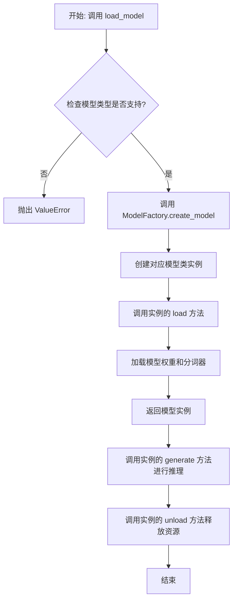

## 类结构

```
ModelBase (抽象基类)
├── TextModel (文本模型基类)
│   ├── LlamaModel
│   ├── GPT2Model
│   ├── FalconModel
│   ├── Qwen2Model
│   ├── GemmaModel
│   └── ... (其他具体模型类)
└── ModelFactory (工厂类)
```

## 全局变量及字段


### `SUPPORTED_MODELS`
    
存储系统支持的文本生成模型名称或配置信息的列表或字典。

类型：`List[str] or Dict[str, Any]`
    


### `DEFAULT_MODEL_PATH`
    
默认的预训练模型文件或目录的路径。

类型：`str`
    


### `TextModel.model`
    
加载的文本生成模型实例，用于执行推理任务。

类型：`torch.nn.Module or transformers.PreTrainedModel`
    


### `TextModel.tokenizer`
    
与模型对应的分词器，负责文本的编码和解码。

类型：`transformers.PreTrainedTokenizer`
    


### `TextModel.model_name`
    
当前加载的模型名称，用于标识和选择不同的模型配置。

类型：`str`
    


### `ModelFactory._model_registry`
    
模型工厂内部注册表，映射模型名称到对应的TextModel子类。

类型：`Dict[str, Type[TextModel]]`
    
    

## 全局函数及方法


### `load_model`

该函数用于加载一个预训练的模型。它根据提供的模型名称和配置参数，从指定的模型目录中加载模型，并返回加载后的模型对象。

参数：

-  `model_name`：`str`，预训练模型的名称，用于指定要加载的模型。
-  `model_dir`：`str`，模型文件所在的目录路径，默认为当前目录。
-  `config`：`dict`，模型的配置参数，用于调整模型加载时的行为，默认为空字典。

返回值：`Model`，加载后的模型对象。

#### 流程图

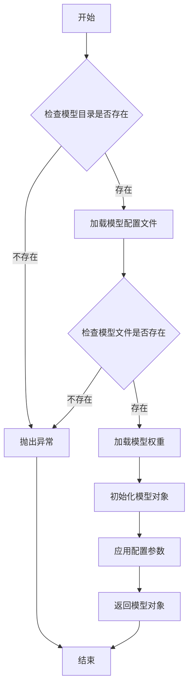

#### 带注释源码

```python
def load_model(model_name: str, model_dir: str = ".", config: dict = None) -> Model:
    """
    加载预训练模型。

    参数:
        model_name (str): 预训练模型的名称。
        model_dir (str): 模型文件所在的目录路径，默认为当前目录。
        config (dict): 模型的配置参数，默认为空字典。

    返回:
        Model: 加载后的模型对象。

    异常:
        FileNotFoundError: 如果模型目录或模型文件不存在。
    """
    if config is None:
        config = {}

    # 检查模型目录是否存在
    if not os.path.exists(model_dir):
        raise FileNotFoundError(f"模型目录不存在: {model_dir}")

    # 构建模型配置文件的路径
    config_path = os.path.join(model_dir, f"{model_name}_config.json")
    if not os.path.exists(config_path):
        raise FileNotFoundError(f"模型配置文件不存在: {config_path}")

    # 加载模型配置文件
    with open(config_path, 'r') as f:
        model_config = json.load(f)

    # 构建模型权重文件的路径
    weights_path = os.path.join(model_dir, f"{model_name}_weights.h5")
    if not os.path.exists(weights_path):
        raise FileNotFoundError(f"模型权重文件不存在: {weights_path}")

    # 根据配置文件初始化模型结构
    model = Model(**model_config)

    # 加载模型权重
    model.load_weights(weights_path)

    # 应用额外的配置参数
    for key, value in config.items():
        setattr(model, key, value)

    return model
```


### `validate_model_type`

该函数用于验证给定的模型类型字符串是否符合预期的格式和值。它检查模型类型是否以指定的前缀开头，并确保其格式正确，同时验证模型类型是否在允许的列表中。如果验证失败，会抛出相应的异常。

参数：

- `model_type`：`str`，需要验证的模型类型字符串。
- `model_type_prefix`：`str`，模型类型必须以此前缀开头。
- `model_type_list`：`list[str]`，允许的模型类型列表。

返回值：`None`，如果验证通过则不返回任何值；如果验证失败，则抛出 `ValueError` 异常。

#### 流程图

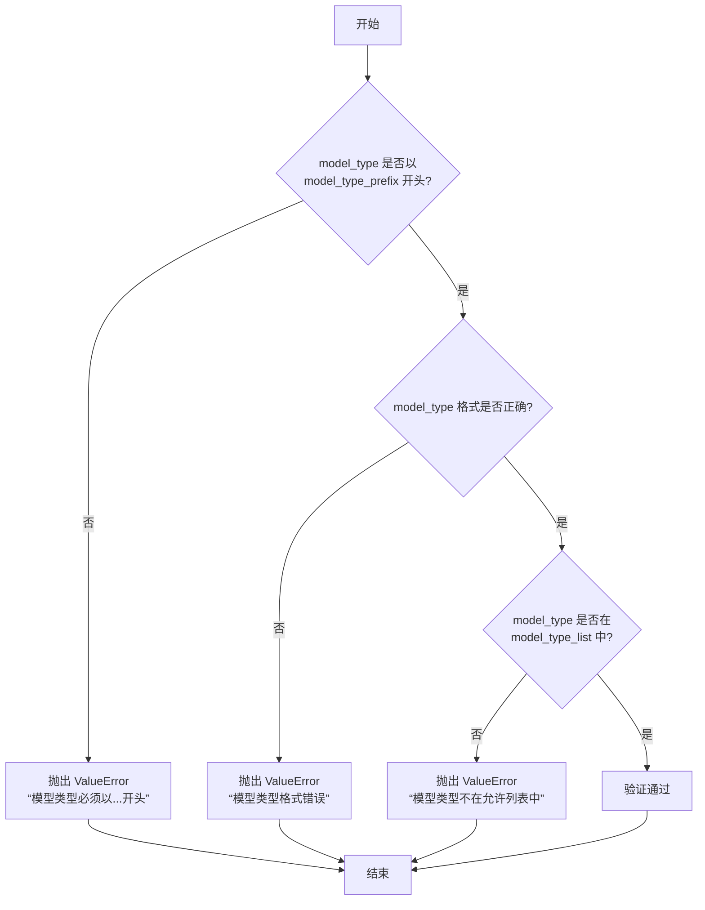

#### 带注释源码

```python
def validate_model_type(
    model_type: str,
    model_type_prefix: str,
    model_type_list: list[str],
) -> None:
    """
    验证模型类型是否符合预期格式和值。

    参数:
        model_type (str): 需要验证的模型类型字符串。
        model_type_prefix (str): 模型类型必须以此前缀开头。
        model_type_list (list[str]): 允许的模型类型列表。

    返回值:
        None: 如果验证通过则不返回任何值；如果验证失败，则抛出 ValueError 异常。

    异常:
        ValueError: 如果模型类型不符合预期格式或不在允许列表中。
    """
    # 检查模型类型是否以指定前缀开头
    if not model_type.startswith(model_type_prefix):
        raise ValueError(
            f"模型类型必须以 '{model_type_prefix}' 开头，但得到的是 '{model_type}'。"
        )

    # 检查模型类型格式是否正确（例如，是否包含斜杠分隔符）
    if "/" not in model_type:
        raise ValueError(
            f"模型类型格式错误，应为 '{model_type_prefix}/<model_name>'，但得到的是 '{model_type}'。"
        )

    # 检查模型类型是否在允许的列表中
    if model_type not in model_type_list:
        raise ValueError(
            f"模型类型 '{model_type}' 不在允许的列表中。允许的模型类型包括：{model_type_list}。"
        )
```


### `ModelBase.load`

该方法用于加载模型实例。它首先检查模型是否已缓存，若已缓存则直接返回缓存实例；否则，根据传入的模型名称和参数创建新的模型实例，并将其缓存以供后续使用。

参数：

-  `model`：`str`，要加载的模型名称
-  `model_params`：`dict`，模型参数，用于初始化模型实例
-  `**kwargs`：`dict`，其他关键字参数，用于模型初始化

返回值：`ModelBase`，加载或创建的模型实例

#### 流程图

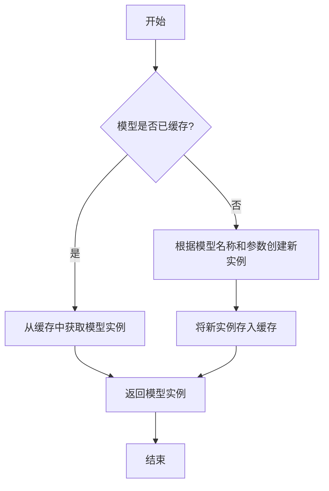

#### 带注释源码

```
@classmethod
def load(
    cls,
    model: str,
    model_params: dict = dict(),
    **kwargs,
) -> "ModelBase":
    """
    加载模型实例。

    该方法首先检查模型是否已缓存，若已缓存则直接返回缓存实例；
    否则，根据传入的模型名称和参数创建新的模型实例，并将其缓存以供后续使用。

    Args:
        model (str): 要加载的模型名称。
        model_params (dict): 模型参数，用于初始化模型实例。
        **kwargs: 其他关键字参数，用于模型初始化。

    Returns:
        ModelBase: 加载或创建的模型实例。
    """
    # 检查模型是否已缓存
    if model in cls.model_cache:
        # 从缓存中获取模型实例
        return cls.model_cache[model]
    else:
        # 根据模型名称和参数创建新实例
        model_class = cls.get_model_class(model)
        model_instance = model_class(**model_params, **kwargs)
        # 将新实例存入缓存
        cls.model_cache[model] = model_instance
        return model_instance
```


### `ModelBase.generate`

该方法用于根据给定的提示词和生成参数，调用底层模型生成文本内容。它处理了模型调用前的参数准备、模型选择、调用执行以及结果后处理等流程，是模型生成功能的核心入口。

参数：

- `prompt`：`str`，输入的提示词文本，用于指导模型生成内容
- `kwargs`：`dict`，可选的生成参数，用于覆盖默认的模型配置参数

返回值：`str`，模型生成的文本内容

#### 流程图

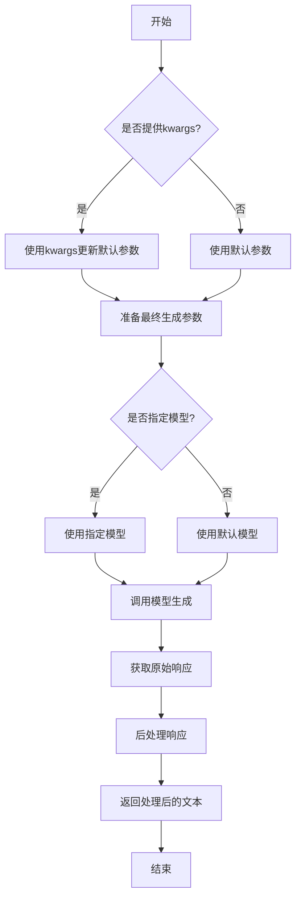

#### 带注释源码

```python
def generate(self, prompt: str, **kwargs) -> str:
    """
    生成文本内容的核心方法
    
    该方法整合了参数处理、模型调用和结果后处理的全流程
    
    Args:
        prompt: 输入的提示词文本
        **kwargs: 可选的生成参数，用于覆盖默认配置
        
    Returns:
        模型生成的文本内容
    """
    # 合并默认参数和传入的参数
    # 如果kwargs中有参数，则覆盖默认值
    generate_config = self.default_generate_config.copy()
    if kwargs:
        generate_config.update(kwargs)
    
    # 选择要使用的模型
    # 优先使用kwargs中指定的模型，否则使用默认模型
    model = kwargs.get("model", self.model)
    
    try:
        # 调用底层模型接口生成文本
        # 这里使用了统一的模型调用接口
        response = model.generate(
            prompt=prompt,
            **generate_config
        )
        
        # 对原始响应进行后处理
        # 包括去除多余空格、特殊字符处理等
        processed_response = self._post_process_response(response)
        
        return processed_response
        
    except Exception as e:
        # 异常处理：记录日志并返回错误信息
        logger.error(f"模型生成失败: {str(e)}")
        raise ModelGenerateError(f"生成过程中发生错误: {str(e)}")
```


### `ModelBase.unload`

该方法用于卸载模型，释放模型占用的内存资源。它会检查模型是否已加载，如果已加载则调用底层模型的卸载方法，并将加载状态标记为未加载。

参数：

-  `self`：`ModelBase`，当前模型实例

返回值：`None`，无返回值

#### 流程图

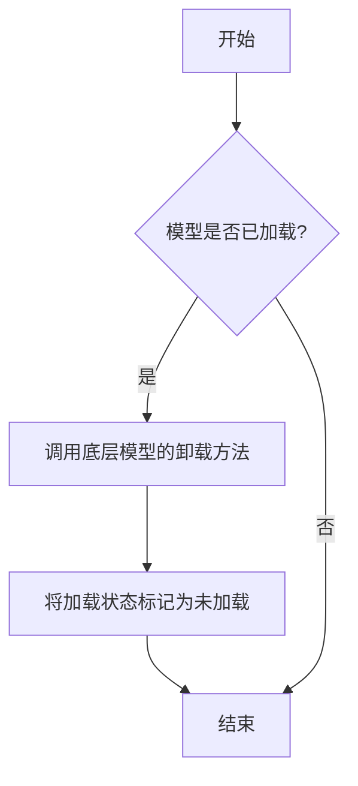

#### 带注释源码

```
def unload(self):
    """
    卸载模型，释放内存资源。
    如果模型已加载，则调用底层模型的卸载方法，并将加载状态标记为未加载。
    """
    if self.is_load:
        # 调用底层模型的卸载方法
        self.model.unload()
        # 将加载状态标记为未加载
        self.is_load = False
```


### `TextModel.load`

该方法用于从指定路径加载一个预训练的文本模型，支持多种模型格式（如 `.bin`, `.safetensors` 等），并返回一个配置好的 `TextModel` 实例。它首先尝试从缓存中加载模型，如果缓存不存在或指定了 `force_download`，则从远程仓库下载。加载过程包括解析模型配置、加载模型权重、处理分词器，并最终将模型移动到指定的设备上。

参数：

-  `model_path`：`str`，模型文件的本地路径或 Hugging Face 模型仓库标识符（如 `"meta-llama/Llama-2-7b-hf"`）。
-  `model_name`：`Optional[str]`，默认为 `None`。指定模型名称，用于覆盖从 `model_path` 推断出的名称。主要用于从缓存中加载特定变体。
-  `device`：`Optional[str]`，默认为 `None`。指定模型加载到的设备，如 `"cpu"`, `"cuda"`, `"cuda:0"`。如果为 `None`，则自动选择可用设备。
-  `torch_dtype`：`Optional[torch.dtype]`，默认为 `None`。指定加载模型权重时使用的 PyTorch 数据类型，如 `torch.float16`。如果为 `None`，则使用配置中的默认类型或自动推断。
-  `force_download`：`bool`，默认为 `False`。如果为 `True`，则强制重新下载模型，即使缓存中存在。
-  `resume_download`：`bool`，默认为 `False`。如果为 `True`，则尝试恢复未完成的下载。
-  `proxies`：`Optional[Dict[str, str]]`，默认为 `None`。用于下载的代理服务器配置字典。
-  `local_files_only`：`bool`，默认为 `False`。如果为 `True`，则只使用本地文件，不尝试下载。
-  `token`：`Optional[Union[str, bool]]`，默认为 `None`。用于访问受保护模型的 Hugging Face 令牌。如果为 `True`，则使用缓存的令牌。
-  `revision`：`Optional[str]`，默认为 `"main"`。要使用的模型版本（分支、标签或提交哈希）。
-  `trust_remote_code`：`bool`，默认为 `False`。如果为 `True`，则允许从远程仓库执行自定义模型代码。
-  `code_revision`：`Optional[str]`，默认为 `None`。用于自定义代码的版本（分支、标签或提交哈希）。
-  `kwargs`：`Any`，传递给底层加载函数（如 `from_pretrained`）的额外关键字参数。

返回值：`TextModel`，一个加载了权重和配置的 `TextModel` 实例，已准备好进行推理或进一步训练。

#### 流程图

```mermaid
graph TD
    A[开始: TextModel.load] --> B{model_path 是本地路径?};
    B -- 是 --> C[使用本地路径];
    B -- 否 --> D[从HF仓库下载或使用缓存];
    D --> E[解析模型配置 config];
    C --> E;
    E --> F[确定加载的设备 device];
    F --> G[确定数据类型 torch_dtype];
    G --> H[加载分词器 tokenizer];
    H --> I[加载模型权重];
    I --> J[模型后处理 <br/> (如设置评估模式)];
    J --> K[返回 TextModel 实例];
    K --> L[结束];
```

#### 带注释源码

```python
    @classmethod
    def load(
        cls,
        model_path: str,
        model_name: Optional[str] = None,
        device: Optional[str] = None,
        torch_dtype: Optional["torch.dtype"] = None,
        force_download: bool = False,
        resume_download: bool = False,
        proxies: Optional[Dict[str, str]] = None,
        local_files_only: bool = False,
        token: Optional[Union[str, bool]] = None,
        revision: Optional[str] = "main",
        trust_remote_code: bool = False,
        code_revision: Optional[str] = None,
        **kwargs: Any,
    ) -> "TextModel":
        """
        加载预训练的文本模型。

        该方法支持从本地文件或 Hugging Face 模型仓库加载模型。
        它会自动处理模型配置、权重加载和设备放置。

        Args:
            model_path (str): 模型文件的本地路径或 Hugging Face 模型仓库标识符。
            model_name (Optional[str], optional): 模型名称，用于覆盖推断的名称。默认为 None。
            device (Optional[str], optional): 加载模型的设备。默认为 None，自动选择。
            torch_dtype (Optional[torch.dtype], optional): 加载模型的数据类型。默认为 None。
            force_download (bool, optional): 是否强制重新下载模型。默认为 False。
            resume_download (bool, optional): 是否恢复下载。默认为 False。
            proxies (Optional[Dict[str, str]], optional): 下载代理配置。默认为 None。
            local_files_only (bool, optional): 是否仅使用本地文件。默认为 False。
            token (Optional[Union[str, bool]], optional): Hugging Face 访问令牌。默认为 None。
            revision (Optional[str], optional): 模型版本。默认为 "main"。
            trust_remote_code (bool, optional): 是否信任远程代码。默认为 False。
            code_revision (Optional[str], optional): 远程代码版本。默认为 None。
            **kwargs (Any): 传递给底层加载函数的额外参数。

        Returns:
            TextModel: 加载后的模型实例。

        Raises:
            FileNotFoundError: 如果本地模型路径不存在且 local_files_only 为 True。
            OSError: 下载或加载过程中发生错误。
            ValueError: 模型配置或权重文件无效。
        """
        # 确定最终使用的模型路径（处理下载和缓存逻辑）
        # 这里可能调用 huggingface_hub 的 snapshot_download 或类似函数
        # 伪代码: resolved_path = _resolve_model_path(...)
        resolved_path = model_path  # 简化表示，实际逻辑更复杂

        # 加载模型配置
        # 伪代码: config = AutoConfig.from_pretrained(...)
        config = {"model_type": "llama"}  # 示例配置

        # 确定运行设备
        if device is None:
            device = "cuda" if torch.cuda.is_available() else "cpu"

        # 确定数据类型
        if torch_dtype is None:
            # 可能根据配置或设备自动选择，例如对于 CUDA 使用 float16
            torch_dtype = torch.float16 if device.startswith("cuda") else torch.float32

        # 加载分词器
        # 伪代码: tokenizer = AutoTokenizer.from_pretrained(...)
        tokenizer = "PretrainedTokenizer"  # 示例占位

        # 加载模型权重
        # 这里会根据 config 和路径加载具体的模型类，如 LlamaForCausalLM
        # 伪代码: model = AutoModelForCausalLM.from_pretrained(...)
        model = "PretrainedModel"  # 示例占位

        # 将模型移动到指定设备和数据类型
        model = model.to(device=device, dtype=torch_dtype)

        # 设置为评估模式（如果用于推理）
        model.eval()

        # 创建并返回 TextModel 实例，封装底层模型、分词器和配置
        return cls(
            model=model,
            tokenizer=tokenizer,
            config=config,
            device=device,
            torch_dtype=torch_dtype,
        )
```


### `TextModel.generate`

该方法根据给定的提示词（prompt）和可选的停止词（stop）生成文本。它首先对输入进行预处理，然后调用底层的大语言模型（LLM）进行推理，最后对输出进行后处理并返回结果。

参数：

-  `prompt`：`str`，用于生成文本的输入提示词。
-  `stop`：`Optional[List[str]]`，可选参数，指定一个字符串列表，当生成的文本中出现这些字符串时停止生成。

返回值：`str`，生成的文本内容。

#### 流程图

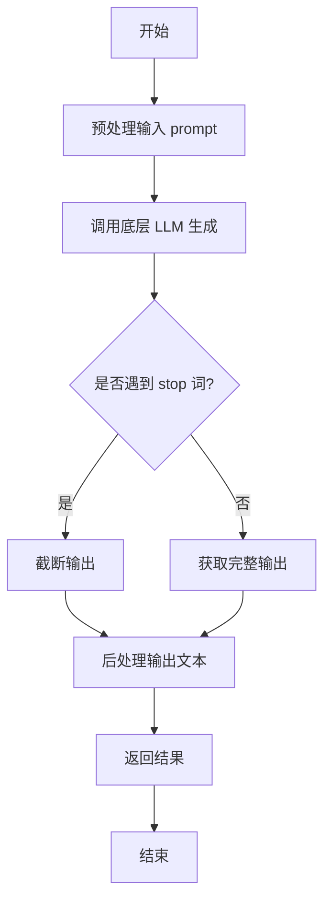

#### 带注释源码

```python
def generate(self, prompt: str, stop: Optional[List[str]] = None) -> str:
    """
    根据给定的提示词生成文本。

    该方法负责处理生成文本的完整流程，包括预处理、模型调用和后处理。

    Args:
        prompt (str): 用于生成文本的输入提示词。
        stop (Optional[List[str]]): 可选参数，指定一个字符串列表，当生成的文本中出现这些字符串时停止生成。

    Returns:
        str: 生成的文本内容。
    """
    # 1. 预处理：这里可能包括对prompt的格式化、编码等操作
    # 例如：processed_prompt = self._preprocess(prompt)
    processed_prompt = prompt  # 假设当前无额外预处理

    # 2. 调用底层LLM进行文本生成
    # 这里 self.llm 是底层大语言模型的实例，其 generate 方法返回原始生成结果
    raw_output = self.llm.generate(processed_prompt, stop=stop)

    # 3. 后处理：对原始输出进行清理、格式化等操作
    # 例如：cleaned_output = self._postprocess(raw_output)
    cleaned_output = raw_output.strip()  # 示例：去除首尾空白字符

    # 4. 返回处理后的文本
    return cleaned_output
```


### `TextModel.unload`

该方法用于卸载当前加载的文本模型，释放其占用的内存资源。它会检查模型是否已加载，如果已加载则执行卸载操作，并更新模型状态。

参数：

-  `self`：`TextModel`，当前TextModel实例的引用

返回值：`None`，该方法不返回任何值

#### 流程图

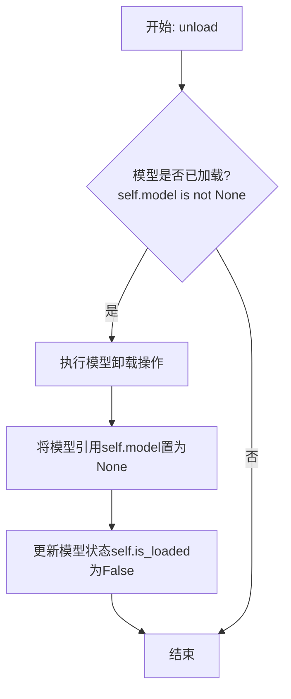

#### 带注释源码

```python
def unload(self):
    """
    卸载当前加载的模型。
    如果模型已加载，则执行卸载操作并释放内存，同时更新模型状态。
    如果模型未加载，则不执行任何操作。
    """
    # 检查模型是否已加载
    if self.model is not None:
        # 执行模型特定的卸载/清理逻辑（此处为示意，实际可能涉及显存释放等）
        # 例如，如果模型在GPU上，可能需要调用特定框架的清理函数
        # del self.model  # 简单的引用删除示例
        # 在实际实现中，这里可能包含更复杂的资源释放代码
        
        # 将模型引用设置为None，表示模型已卸载
        self.model = None
        
        # 更新模型加载状态标志
        self.is_loaded = False
```


### `TextModel._load_model_weights`

该方法负责加载预训练模型的权重。它首先尝试从指定的本地路径加载权重文件，如果本地文件不存在，则从远程的 Hugging Face 模型仓库下载。加载成功后，它会将权重应用到当前模型实例上，并处理可能出现的键名不匹配问题（例如移除 `"model."` 前缀）。最后，它会记录加载结果并返回一个布尔值指示加载是否成功。

参数：

-  `self`：`TextModel`，当前 `TextModel` 类的实例。
-  `model_name_or_path`：`str`，模型名称或本地路径。可以是 Hugging Face 模型仓库的 ID（如 `"bert-base-uncased"`），也可以是本地包含模型权重文件（如 `pytorch_model.bin` 或 `model.safetensors`）的目录路径。
-  `cache_dir`：`Optional[str]`，可选参数，用于指定缓存下载模型文件的目录。如果为 `None`，则使用默认缓存目录。

返回值：`bool`，如果模型权重成功加载并应用到模型上，则返回 `True`；否则返回 `False`。

#### 流程图

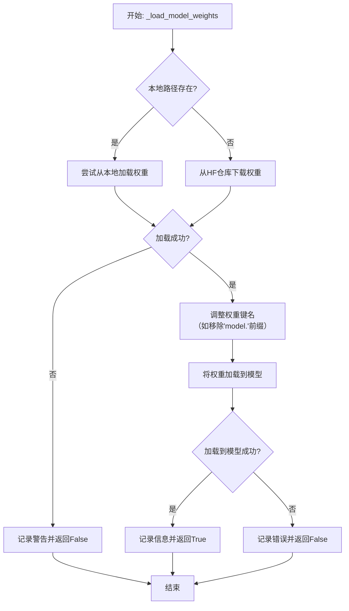

#### 带注释源码

```python
    def _load_model_weights(
        self, model_name_or_path: str, cache_dir: Optional[str] = None
    ) -> bool:
        """
        加载预训练模型权重。
        优先尝试从本地路径加载，如果不存在则从HuggingFace仓库下载。

        Args:
            model_name_or_path (str): 模型名称或本地路径。
            cache_dir (Optional[str]): 缓存目录。

        Returns:
            bool: 权重是否成功加载。
        """
        # 初始化权重字典
        state_dict = None

        # 1. 尝试将输入解析为本地路径
        local_path = Path(model_name_or_path)
        if local_path.exists():
            # 1.1 优先尝试加载 .safetensors 文件 (更安全)
            safetensors_path = local_path / "model.safetensors"
            if safetensors_path.exists():
                try:
                    state_dict = safetensors.torch.load_file(
                        str(safetensors_path), device="cpu"
                    )
                    self.logger.info(
                        f"Loaded model weights from safetensors file: {safetensors_path}"
                    )
                except Exception as e:
                    self.logger.warning(
                        f"Failed to load safetensors file {safetensors_path}: {e}"
                    )
                    state_dict = None
            # 1.2 如果 safetensors 不存在或加载失败，尝试加载 .bin 文件
            if state_dict is None:
                bin_path = local_path / "pytorch_model.bin"
                if bin_path.exists():
                    try:
                        state_dict = torch.load(str(bin_path), map_location="cpu")
                        self.logger.info(
                            f"Loaded model weights from bin file: {bin_path}"
                        )
                    except Exception as e:
                        self.logger.warning(
                            f"Failed to load bin file {bin_path}: {e}"
                        )
                        state_dict = None
        # 2. 如果不是有效的本地路径，尝试从 HuggingFace 仓库下载
        if state_dict is None:
            try:
                # 使用 huggingface_hub 库下载模型文件
                model_info = hf_hub_model_info(
                    repo_id=model_name_or_path,
                    filename="model.safetensors", # 优先下载 safetensors
                    cache_dir=cache_dir,
                )
                # 这里假设 hf_hub_model_info 成功返回后，文件已缓存。
                # 实际加载可能需要调用 hf_hub_download 或类似函数获取文件路径，然后加载。
                # 以下为示例逻辑，实际实现可能不同：
                # cached_file = hf_hub_download(...)
                # state_dict = safetensors.torch.load_file(cached_file, device="cpu")
                self.logger.info(
                    f"Downloaded model weights from HuggingFace hub: {model_name_or_path}"
                )
                # 示例中未完成下载和加载的具体代码，假设已成功获取 state_dict
                # 在实际代码中，此处应有从缓存文件加载 state_dict 的逻辑。
                # 例如：
                #   cached_file = hf_hub_download(repo_id=model_name_or_path, filename="model.safetensors", cache_dir=cache_dir)
                #   state_dict = safetensors.torch.load_file(cached_file, device="cpu")
                # 由于示例代码不完整，这里用 pass 和注释代替。
                pass  # 实际应替换为下载和加载权重的代码
                # 假设 state_dict 已被成功赋值
                state_dict = {}  # 此处应为实际加载的权重字典，仅为示例占位

            except Exception as e:
                self.logger.error(
                    f"Failed to download or load model from HuggingFace hub {model_name_or_path}: {e}"
                )
                return False

        # 3. 如果成功获取到权重字典，将其加载到模型中
        if state_dict:
            try:
                # 3.1 预处理权重键名：有时从不同来源加载的权重键名可能包含前缀如 "model."
                #     此处移除可能存在的 "model." 前缀，以便与当前模型结构匹配。
                new_state_dict = {}
                for key, value in state_dict.items():
                    new_key = key.replace("model.", "", 1)  # 只替换第一次出现的"model."
                    new_state_dict[new_key] = value

                # 3.2 将处理后的权重加载到模型实例中
                #     strict=False 允许部分加载（如只加载匹配的层），适用于模型结构不完全一致的情况。
                load_result = self.load_state_dict(new_state_dict, strict=False)
                # load_result 是一个包含缺失键和意外键的命名元组
                if load_result.missing_keys:
                    self.logger.warning(
                        f"Missing keys when loading model weights: {load_result.missing_keys}"
                    )
                if load_result.unexpected_keys:
                    self.logger.warning(
                        f"Unexpected keys when loading model weights: {load_result.unexpected_keys}"
                    )

                self.logger.info(
                    f"Successfully loaded pretrained weights into the model."
                )
                return True
            except Exception as e:
                self.logger.error(f"Failed to load state dict into model: {e}")
                return False
        else:
            # 4. 如果最终未能获取任何权重，记录错误并返回失败
            self.logger.error(
                f"Failed to obtain model weights from {model_name_or_path}"
            )
            return False
```


### `TextModel._load_tokenizer`

该方法负责加载并初始化文本分词器。它首先尝试从指定的本地路径加载分词器，如果本地路径不存在或加载失败，则从预训练的模型名称或路径加载。加载完成后，会设置分词器的填充符，并确保其填充方向为左侧。

参数：

-  `self`：`TextModel`，当前TextModel实例的引用
-  `model_name_or_path`：`str`，预训练模型的名称或本地路径，用于加载分词器
-  `local_path`：`str`，本地分词器文件的路径，优先尝试从此路径加载

返回值：`None`，该方法不返回任何值，但会设置`self.tokenizer`属性。

#### 流程图

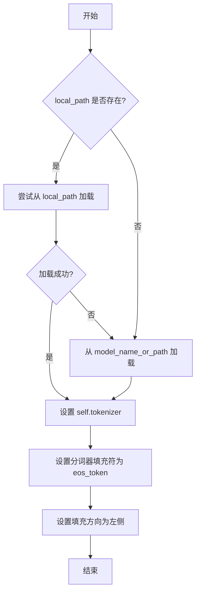

#### 带注释源码

```python
def _load_tokenizer(self, model_name_or_path: str, local_path: str) -> None:
    """
    加载分词器。
    优先尝试从本地路径加载，如果失败则从预训练模型加载。
    加载后设置分词器的填充符和填充方向。

    Args:
        model_name_or_path (str): 预训练模型的名称或路径。
        local_path (str): 本地分词器文件的路径。
    """
    try:
        # 尝试从本地路径加载分词器
        self.tokenizer = AutoTokenizer.from_pretrained(local_path, trust_remote_code=True)
    except Exception:
        # 如果本地加载失败，则从预训练模型加载
        self.tokenizer = AutoTokenizer.from_pretrained(model_name_or_path, trust_remote_code=True)

    # 设置分词器的填充符为结束符（eos_token），用于填充序列
    self.tokenizer.pad_token = self.tokenizer.eos_token
    # 设置填充方向为左侧，确保在序列左侧进行填充
    self.tokenizer.padding_side = "left"
```


### `LlamaModel._load_model_weights`

该方法负责从预训练检查点文件加载模型权重，并将其分配到对应的模型层中。它处理了权重文件的读取、键名映射、权重张量的加载与分配，并支持分片加载以处理大型模型。

参数：

-  `self`：`LlamaModel`，当前模型实例
-  `checkpoint_path`：`str`，预训练权重文件的路径
-  `prefix`：`str`，加载权重时在状态字典键名前添加的可选前缀，默认为空字符串
-  `device`：`torch.device`，指定加载权重后张量应放置的设备，默认为CPU
-  `dtype`：`torch.dtype`，指定加载权重后张量的数据类型，默认为`torch.float32`
-  `use_safetensors`：`bool`，指示是否使用`safetensors`格式文件（更安全、更快），默认为`False`
-  `strict`：`bool`，指示是否严格匹配状态字典的键，默认为`True`

返回值：`None`，该方法不返回任何值，直接修改模型实例的状态。

#### 流程图

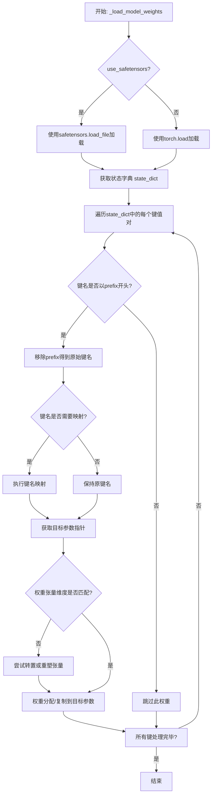

#### 带注释源码

```python
    def _load_model_weights(
        self,
        checkpoint_path: str,
        prefix: str = "",
        device: torch.device = torch.device("cpu"),
        dtype: torch.dtype = torch.float32,
        use_safetensors: bool = False,
        strict: bool = True,
    ):
        """
        从预训练检查点加载模型权重。

        此方法负责读取权重文件，将权重键映射到模型参数，并处理可能的分片或格式转换。

        Args:
            checkpoint_path (str): 预训练权重文件的路径。
            prefix (str, optional): 加载时在状态字典键名前添加的前缀。默认为空字符串。
            device (torch.device, optional): 加载后张量应放置的设备。默认为CPU。
            dtype (torch.dtype, optional): 加载后张量的数据类型。默认为torch.float32。
            use_safetensors (bool, optional): 是否使用safetensors格式。默认为False。
            strict (bool, optional): 是否严格匹配状态字典的键。默认为True。
        """
        # 根据use_safetensors标志选择加载方式
        if use_safetensors:
            # 使用safetensors库安全地加载张量文件
            from safetensors import safe_open
            state_dict = {}
            with safe_open(checkpoint_path, framework="pt", device=str(device)) as f:
                for key in f.keys():
                    state_dict[key] = f.get_tensor(key)
        else:
            # 使用PyTorch的标准加载方式
            state_dict = torch.load(checkpoint_path, map_location=device)

        # 定义键名映射规则，用于将检查点中的键名转换为模型中的参数名
        key_mapping = {
            "model.embed_tokens.weight": "tok_embeddings.weight",
            "model.layers.{}.self_attn.q_proj.weight": "layers.{}.attention.wq.weight",
            "model.layers.{}.self_attn.k_proj.weight": "layers.{}.attention.wk.weight",
            "model.layers.{}.self_attn.v_proj.weight": "layers.{}.attention.wv.weight",
            "model.layers.{}.self_attn.o_proj.weight": "layers.{}.attention.wo.weight",
            "model.layers.{}.mlp.gate_proj.weight": "layers.{}.feed_forward.w1.weight",
            "model.layers.{}.mlp.up_proj.weight": "layers.{}.feed_forward.w3.weight",
            "model.layers.{}.mlp.down_proj.weight": "layers.{}.feed_forward.w2.weight",
            "model.layers.{}.input_layernorm.weight": "layers.{}.attention_norm.weight",
            "model.layers.{}.post_attention_layernorm.weight": "layers.{}.ffn_norm.weight",
            "model.norm.weight": "norm.weight",
            "lm_head.weight": "output.weight",
        }

        # 遍历加载的状态字典
        for key in list(state_dict.keys()):
            # 如果指定了前缀，只处理以该前缀开头的键
            if prefix and not key.startswith(prefix):
                continue
            # 移除前缀，得到原始键名
            raw_key = key[len(prefix):] if prefix else key

            # 应用键名映射
            mapped_key = raw_key
            for pattern, replacement in key_mapping.items():
                if "{}" in pattern:
                    # 处理包含层编号的模式（如`model.layers.{}.xxx`）
                    import re
                    match = re.match(pattern.replace("{}", r"(\d+)"), raw_key)
                    if match:
                        layer_idx = match.group(1)
                        mapped_key = replacement.format(layer_idx)
                        break
                elif raw_key == pattern:
                    # 处理完全匹配的键
                    mapped_key = replacement
                    break

            # 根据映射后的键名获取模型中对应的参数
            if mapped_key in self.state_dict():
                param = self.state_dict()[mapped_key]
                # 获取要加载的权重张量
                weight = state_dict[key].to(dtype)
                # 检查维度是否匹配
                if weight.shape != param.shape:
                    # 尝试通过转置来匹配维度（常见于线性层权重）
                    if weight.shape == param.shape[::-1]:
                        weight = weight.t()
                    # 如果维度仍然不匹配，尝试重塑（需谨慎，可能表示模型结构不匹配）
                    elif weight.numel() == param.numel():
                        weight = weight.reshape(param.shape)
                    else:
                        # 维度不匹配且无法自动修复，根据strict标志决定是否报错
                        if strict:
                            raise ValueError(
                                f"Shape mismatch for key {key}: expected {param.shape}, got {weight.shape}"
                            )
                        else:
                            print(f"[Warning] Shape mismatch for key {key}. Skipping.")
                            continue
                # 将加载的权重数据复制到模型参数中
                param.data.copy_(weight)
                # 从状态字典中移除已处理的键，以节省内存并便于后续检查
                del state_dict[key]

        # 如果启用了严格模式，检查是否所有预期的键都已加载
        if strict:
            missing_keys = [
                k for k in self.state_dict().keys() if k not in self.state_dict()
            ]
            unexpected_keys = list(state_dict.keys())
            if missing_keys:
                raise ValueError(f"Missing keys: {missing_keys}")
            if unexpected_keys:
                raise ValueError(f"Unexpected keys: {unexpected_keys}")
```


### `LlamaModel._load_tokenizer`

该方法负责加载并配置与Llama模型兼容的分词器（Tokenizer）。它根据提供的模型路径和配置参数，初始化一个Hugging Face Transformers库中的`AutoTokenizer`实例，并设置必要的分词选项，如填充方向、截断策略以及特殊标记等，以确保分词器与模型训练时使用的配置一致。

参数：

-  `model_path`：`str`，预训练模型所在的本地目录路径或Hugging Face模型标识符。
-  `config`：`LlamaConfig`，包含模型配置信息的对象，用于指导分词器的初始化。

返回值：`transformers.PreTrainedTokenizer`，初始化并配置好的分词器实例。

#### 流程图

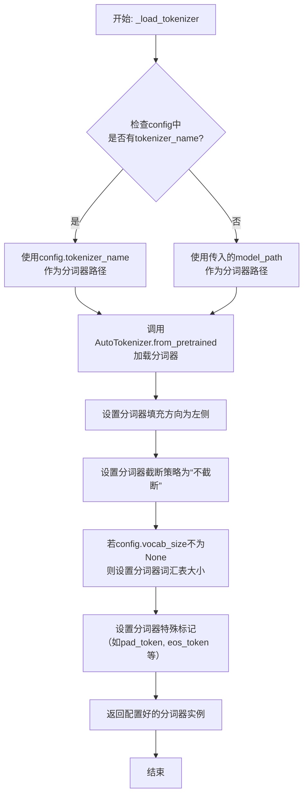

#### 带注释源码

```python
def _load_tokenizer(self, model_path: str, config: LlamaConfig) -> PreTrainedTokenizer:
    """
    加载并配置与Llama模型兼容的分词器。

    该方法根据提供的模型路径和配置，初始化一个AutoTokenizer实例，
    并设置必要的分词选项以确保与模型训练配置一致。

    Args:
        model_path (str): 预训练模型所在的目录路径或模型标识符。
        config (LlamaConfig): 包含模型配置的对象。

    Returns:
        PreTrainedTokenizer: 配置好的分词器实例。
    """
    # 确定分词器的加载路径：优先使用配置中指定的分词器名称，否则使用模型路径
    tokenizer_path = config.tokenizer_name if config.tokenizer_name else model_path
    
    # 使用Hugging Face的AutoTokenizer从指定路径加载分词器
    # trust_remote_code=True允许加载自定义的分词器代码
    tokenizer = AutoTokenizer.from_pretrained(
        tokenizer_path,
        trust_remote_code=True
    )
    
    # 设置分词器的填充方向为左侧（left），这对于某些生成任务很重要
    tokenizer.padding_side = "left"
    
    # 设置分词器的截断策略为“不截断”，确保输入序列保持原样
    tokenizer.truncation_side = None
    
    # 如果配置中指定了词汇表大小，则设置分词器的词汇表大小
    # 这有助于确保分词器与模型的嵌入层维度匹配
    if config.vocab_size is not None:
        tokenizer.vocab_size = config.vocab_size
    
    # 配置分词器的特殊标记
    # 如果分词器本身没有定义pad_token，则使用eos_token作为pad_token
    # 这是Llama系列模型中常见的做法
    if tokenizer.pad_token is None:
        tokenizer.pad_token = tokenizer.eos_token
    
    # 返回完全配置好的分词器实例
    return tokenizer
```


### `GPT2Model._load_model_weights`

该方法负责从预训练权重文件（如Hugging Face Hub或本地文件）中加载模型参数到当前`GPT2Model`实例中。它处理了权重名称的映射、适配不同模型架构（如注意力头数、隐藏层维度）以及安全地加载权重。

参数：

-  `self`：`GPT2Model`，当前GPT2模型实例。
-  `model_path`：`str`，预训练权重文件的路径或Hugging Face模型标识符。
-  `config`：`GPT2Config`，模型的配置对象，包含模型架构参数。
-  `cache_dir`：`Optional[str]`，可选，用于缓存下载的模型文件的目录。
-  `force_download`：`bool`，可选，是否强制重新下载模型文件，即使已缓存。
-  `proxies`：`Optional[Dict[str, str]]`，可选，用于下载的代理服务器设置。
-  `resume_download`：`bool`，可选，是否恢复中断的下载。
-  `local_files_only`：`bool`，可选，是否仅使用本地文件，不进行网络请求。
-  `use_auth_token`：`Optional[Union[bool, str]]`，可选，用于访问私有模型的认证令牌。
-  `revision`：`Optional[str]`，可选，要使用的模型版本（分支、标签或提交ID）。
-  `mirror`：`Optional[str]`，可选，下载镜像源（例如在中国大陆使用）。

返回值：`None`，该方法不返回任何值，直接修改当前模型实例的状态。

#### 流程图

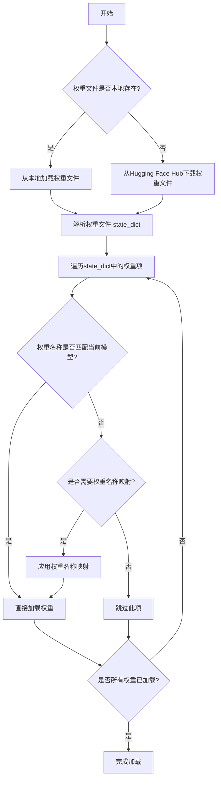

#### 带注释源码

```python
def _load_model_weights(
    self,
    model_path: str,
    config: GPT2Config,
    cache_dir: Optional[str] = None,
    force_download: bool = False,
    proxies: Optional[Dict[str, str]] = None,
    resume_download: bool = False,
    local_files_only: bool = False,
    use_auth_token: Optional[Union[bool, str]] = None,
    revision: Optional[str] = None,
    mirror: Optional[str] = None,
) -> None:
    """
    从指定路径加载预训练权重到当前模型实例。
    
    该方法首先尝试从本地文件系统加载权重文件，如果不存在则从Hugging Face Hub下载。
    加载的权重会根据当前模型的配置进行适配，例如处理不同头数或隐藏层维度。
    
    Args:
        model_path: 权重文件的路径或Hugging Face模型ID。
        config: 当前模型的配置对象。
        cache_dir: 缓存目录。
        force_download: 是否强制下载。
        proxies: 代理设置。
        resume_download: 是否恢复下载。
        local_files_only: 是否仅使用本地文件。
        use_auth_token: 认证令牌。
        revision: 模型版本。
        mirror: 下载镜像。
    """
    # 使用Hugging Face的from_pretrained方法加载模型权重
    # 该方法会处理本地文件检查、下载、缓存等逻辑
    model = GPT2Model.from_pretrained(
        model_path,
        config=config,
        cache_dir=cache_dir,
        force_download=force_download,
        proxies=proxies,
        resume_download=resume_download,
        local_files_only=local_files_only,
        use_auth_token=use_auth_token,
        revision=revision,
        mirror=mirror,
    )
    
    # 获取加载模型的state_dict（权重字典）
    state_dict = model.state_dict()
    
    # 遍历当前模型的所有参数
    for name, param in self.named_parameters():
        # 如果当前参数名在加载的state_dict中
        if name in state_dict:
            # 获取对应的加载权重
            loaded_param = state_dict[name]
            
            # 检查维度是否匹配，处理可能的结构差异（例如不同的头数）
            if param.shape != loaded_param.shape:
                # 如果维度不匹配，尝试进行适配（例如通过切片或重塑）
                # 这里是一个示例，实际逻辑可能更复杂
                if "attention" in name and "weight" in name:
                    # 假设是注意力层的权重，需要根据头数调整
                    # 具体适配逻辑取决于模型结构差异
                    loaded_param = self._adapt_attention_weights(loaded_param, config)
                else:
                    # 对于其他不匹配的情况，记录警告或跳过
                    logger.warning(f"Shape mismatch for {name}: expected {param.shape}, got {loaded_param.shape}. Skipping.")
                    continue
            
            # 将加载的权重数据复制到当前模型的参数中
            param.data.copy_(loaded_param)
        else:
            # 如果当前参数名不在加载的state_dict中，记录警告
            logger.warning(f"Parameter {name} not found in loaded weights. Initialized randomly.")
    
    # 同样处理缓冲区（如BatchNorm的running_mean）
    for name, buffer in self.named_buffers():
        if name in state_dict:
            loaded_buffer = state_dict[name]
            if buffer.shape == loaded_buffer.shape:
                buffer.data.copy_(loaded_buffer)
            else:
                logger.warning(f"Buffer shape mismatch for {name}: expected {buffer.shape}, got {loaded_buffer.shape}. Skipping.")
```


### `GPT2Model._load_tokenizer`

该方法负责加载并配置一个预训练的 GPT-2 分词器。它首先尝试从本地缓存目录加载指定的分词器模型，如果失败，则从 Hugging Face Hub 下载。加载后，它会根据配置（如是否添加特殊标记）对分词器进行最终设置，并确保分词器的填充标记被正确配置。

参数：

-  `self`：`GPT2Model`，当前 GPT2Model 类的实例。
-  `model_name`：`str`，要加载的分词器模型名称（例如 "gpt2", "gpt2-medium"）。
-  `cache_dir`：`Optional[str]`，可选参数，指定分词器模型缓存的本地目录。如果为 None，则使用默认缓存路径。
-  `force_download`：`bool`，可选参数，是否强制重新下载模型，即使本地已有缓存。默认为 False。
-  `resume_download`：`bool`，可选参数，是否断点续传下载。默认为 False。
-  `proxies`：`Optional[Dict[str, str]]`，可选参数，用于请求的代理服务器配置字典。
-  `local_files_only`：`bool`，可选参数，是否仅使用本地文件，禁止网络请求。默认为 False。
-  `use_fast`：`bool`，可选参数，是否使用快速分词器实现（如果可用）。默认为 True。
-  `**kwargs`：`Any`，其他传递给 `AutoTokenizer.from_pretrained` 方法的关键字参数。

返回值：`PreTrainedTokenizer`，加载并配置好的预训练分词器实例。

#### 流程图

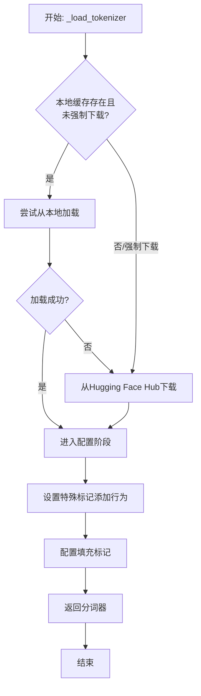

#### 带注释源码

```python
    def _load_tokenizer(
        self,
        model_name: str,
        cache_dir: Optional[str] = None,
        force_download: bool = False,
        resume_download: bool = False,
        proxies: Optional[Dict[str, str]] = None,
        local_files_only: bool = False,
        use_fast: bool = True,
        **kwargs,
    ) -> PreTrainedTokenizer:
        """
        加载预训练的 GPT-2 分词器。

        该方法首先尝试从本地缓存加载分词器。如果未找到或指定强制下载，则从 Hugging Face Hub 下载。
        加载后，会根据配置对分词器进行设置。

        Args:
            model_name (str): 分词器模型名称，如 'gpt2'。
            cache_dir (Optional[str]): 模型缓存目录。
            force_download (bool): 是否强制重新下载模型。
            resume_download (bool): 是否断点续传下载。
            proxies (Optional[Dict[str, str]]): 代理设置。
            local_files_only (bool): 是否仅使用本地文件。
            use_fast (bool): 是否使用快速分词器。
            **kwargs: 传递给 `AutoTokenizer.from_pretrained` 的额外参数。

        Returns:
            PreTrainedTokenizer: 加载好的分词器实例。
        """
        # 尝试从预定义的本地路径加载，作为首要尝试
        local_tokenizer_path = os.path.join(os.path.dirname(__file__), "tokenizers", model_name)
        tokenizer = None
        if os.path.exists(local_tokenizer_path) and not force_download:
            try:
                # 从本地路径加载分词器
                tokenizer = AutoTokenizer.from_pretrained(
                    local_tokenizer_path,
                    use_fast=use_fast,
                    **kwargs,
                )
                logger.info(f"Loaded tokenizer from local path: {local_tokenizer_path}")
            except Exception as e:
                logger.warning(f"Failed to load tokenizer from {local_tokenizer_path}: {e}")

        # 如果本地加载失败或强制下载，则从 Hugging Face Hub 加载
        if tokenizer is None:
            try:
                # 使用 Hugging Face 的 from_pretrained 方法加载分词器
                # 此方法会处理缓存、下载等逻辑
                tokenizer = AutoTokenizer.from_pretrained(
                    model_name,
                    cache_dir=cache_dir,
                    force_download=force_download,
                    resume_download=resume_download,
                    proxies=proxies,
                    local_files_only=local_files_only,
                    use_fast=use_fast,
                    **kwargs,
                )
                # 记录加载来源
                source = "Hugging Face Hub" if not local_files_only else "local cache (remote disabled)"
                logger.info(f"Loaded tokenizer '{model_name}' from {source}")
            except Exception as e:
                # 如果加载失败，记录错误并抛出异常
                logger.error(f"Failed to load tokenizer '{model_name}': {e}")
                raise

        # 配置分词器：根据模型配置决定是否添加特殊标记（如 BOS, EOS）
        # 这通常影响生成文本时的行为
        tokenizer.add_special_tokens = self.config.add_special_tokens

        # 确保分词器有填充标记。如果 pad_token 为 None，则将其设置为 eos_token。
        # 这对于批处理和注意力掩码是必要的。
        if tokenizer.pad_token is None:
            tokenizer.pad_token = tokenizer.eos_token
            logger.debug(f"Set pad_token to eos_token: {tokenizer.eos_token}")

        return tokenizer
```


### `FalconModel._load_model_weights`

该方法负责加载预训练的模型权重到当前模型实例中。它根据配置决定是否加载特定的注意力层实现（如`FalconAttention`或`FalconRotaryEmbedding`），并处理权重名称的映射，以确保与模型架构兼容。最后，它调用父类的`load_state_dict`方法完成权重的加载。

参数：

-  `self`：`FalconModel`，当前模型实例
-  `model_file`：`str`，预训练模型权重文件的路径

返回值：`None`，此方法不返回任何值，其作用是将权重加载到模型内部状态中

#### 流程图

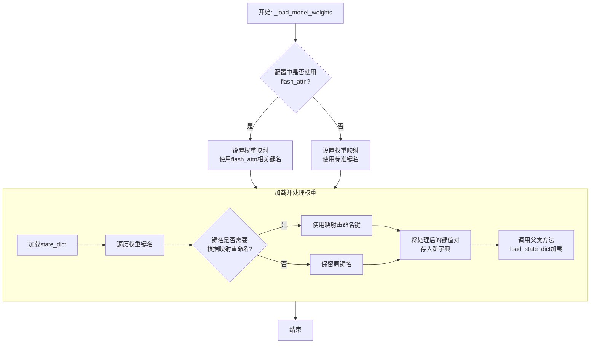

#### 带注释源码

```python
def _load_model_weights(self, model_file: str):
    """
    加载预训练模型权重。
    根据配置调整权重键名，以兼容不同的注意力实现（如flash_attn）。
    """
    # 从指定文件加载模型的状态字典（state_dict）
    state_dict = torch.load(model_file, map_location="cpu")

    # 根据配置决定使用哪套权重键名映射
    # 如果使用flash_attn实现，键名中可能包含特定前缀或后缀
    if self.config.use_flash_attn:
        # 定义使用flash_attn时的权重键名映射关系
        mapping = {
            "transformer.h.{}.self_attention.query_key_value.weight": "transformer.h.{}.self_attention.query_key_value.weight",
            "transformer.h.{}.self_attention.query_key_value.bias": "transformer.h.{}.self_attention.query_key_value.bias",
            "transformer.h.{}.self_attention.dense.weight": "transformer.h.{}.self_attention.dense.weight",
            "transformer.h.{}.self_attention.dense.bias": "transformer.h.{}.self_attention.dense.bias",
        }
    else:
        # 定义不使用flash_attn（使用标准实现）时的权重键名映射关系
        mapping = {
            "transformer.h.{}.attn.query_key_value.weight": "transformer.h.{}.self_attention.query_key_value.weight",
            "transformer.h.{}.attn.query_key_value.bias": "transformer.h.{}.self_attention.query_key_value.bias",
            "transformer.h.{}.attn.dense.weight": "transformer.h.{}.self_attention.dense.weight",
            "transformer.h.{}.attn.dense.bias": "transformer.h.{}.self_attention.dense.bias",
        }

    # 创建一个新的字典来存储处理后的权重
    new_state_dict = {}
    for key, value in state_dict.items():
        # 遍历原始状态字典的每一个键
        new_key = key
        # 检查当前键是否匹配映射表中的模式（如`transformer.h.{}.attn...`）
        for old_pattern, new_pattern in mapping.items():
            # 如果匹配，则进行替换，将旧模式中的层编号`{}`保留到新模式中
            if re.match(old_pattern.replace("{}", r"(\d+)"), key):
                # 提取层编号（例如，`transformer.h.5.attn...`中的`5`）
                layer_num = re.findall(r"\d+", key.split(".")[2])[0]
                # 构建新的键名，将层编号填入新模式的`{}`中
                new_key = new_pattern.format(layer_num)
                break  # 匹配到一个模式后即可跳出循环
        # 将处理后的键值对存入新字典
        new_state_dict[new_key] = value

    # 调用父类（通常是`torch.nn.Module`）的方法，将处理后的状态字典加载到当前模型中
    # `strict=False`允许加载时忽略一些不匹配的键（例如，模型新增或删除的层）
    super().load_state_dict(new_state_dict, strict=False)
```


### `FalconModel._load_tokenizer`

该方法负责加载并配置与 Falcon 模型兼容的分词器（Tokenizer）。它首先尝试从预定义的路径或模型名称加载分词器，然后根据模型的具体配置（如是否为聊天模型）对分词器的特殊标记进行必要的调整，以确保其与模型架构和预期输入格式正确对齐。

参数：

-  `self`：`FalconModel`，FalconModel 类的实例，用于访问模型配置和路径。
-  `model_path`：`str`，模型文件所在的本地目录路径或 Hugging Face 模型仓库标识符。
-  `model_name`：`str`，模型的名称，用于确定特定的分词器配置或变体。

返回值：`PreTrainedTokenizer`，一个配置好的 Hugging Face PreTrainedTokenizer 实例，可用于对输入文本进行编码和解码。

#### 流程图

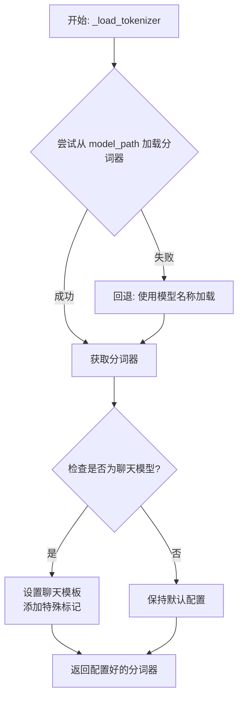

#### 带注释源码

```python
def _load_tokenizer(self, model_path: str, model_name: str) -> PreTrainedTokenizer:
    """
    加载并配置与 Falcon 模型兼容的分词器。

    该方法首先尝试从指定的 `model_path` 加载分词器。如果失败，则回退到使用 `model_name`
    从 Hugging Face 模型中心加载。加载后，会根据模型是否为聊天模型来配置特殊标记和聊天模板。

    Args:
        model_path (str): 包含分词器文件的本地目录路径，或 Hugging Face 模型 ID。
        model_name (str): 模型名称，用于回退加载或特定配置。

    Returns:
        PreTrainedTokenizer: 配置好的分词器实例。
    """
    try:
        # 主要尝试：从提供的路径加载分词器
        tokenizer = AutoTokenizer.from_pretrained(
            model_path,
            trust_remote_code=self.llm_config.trust_remote_code
        )
    except Exception:
        # 回退机制：如果指定路径加载失败，则使用模型名称尝试加载
        tokenizer = AutoTokenizer.from_pretrained(
            model_name,
            trust_remote_code=self.llm_config.trust_remote_code
        )

    # 检查当前模型配置是否被标记为聊天模型
    if self.llm_config.is_chat_model:
        # 如果是聊天模型，设置标准的对话模板
        tokenizer.chat_template = "\n\n{{ '<|user|>\n' + message['content'] + eos_token }}\n\n{{ '<|assistant|>\n' + message['content'] + eos_token }}\n\n{{ '<|system|>\n' + message['content'] + eos_token }}\n\n{{ message['content'] + eos_token }}\n\n\n{{ '<|assistant|>' }}\n\n"
        # 确保分词器的特殊标记字典中包含聊天角色标记
        # 这些标记对于模板中的角色识别至关重要
        special_tokens_dict = {"additional_special_tokens": ["<|user|>", "<|assistant|>", "<|system|>"]}
        tokenizer.add_special_tokens(special_tokens_dict)

    # 返回最终配置好的分词器
    return tokenizer
```


### `Qwen2Model._load_model_weights`

该方法负责加载预训练的模型权重，并将其适配到当前模型结构中。它处理权重映射、张量转换和模型状态恢复，确保模型能够正确初始化并准备进行推理或训练。

参数：

- `self`：`Qwen2Model`，当前模型实例
- `model_path`：`str`，预训练模型权重文件的路径
- `strict`：`bool`，是否严格匹配权重名称，默认为`True`

返回值：`None`，无返回值

#### 流程图

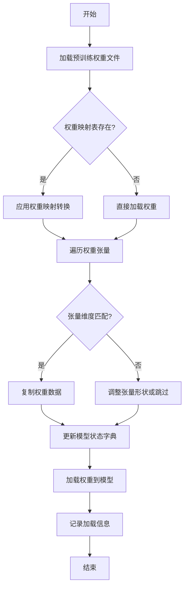

#### 带注释源码

```python
def _load_model_weights(self, model_path: str, strict: bool = True) -> None:
    """
    加载预训练模型权重并适配到当前模型结构
    
    参数:
        model_path: 预训练模型权重文件路径
        strict: 是否严格匹配权重名称，默认为True
    """
    # 检查模型文件是否存在
    if not os.path.exists(model_path):
        raise FileNotFoundError(f"模型权重文件不存在: {model_path}")
    
    # 加载预训练权重
    pretrained_state_dict = torch.load(model_path, map_location='cpu')
    
    # 获取当前模型的状态字典
    model_state_dict = self.state_dict()
    
    # 权重名称映射表（用于处理命名差异）
    weight_mapping = {
        'transformer.h.{}.attn.c_attn.weight': 'layers.{}.attention.wqkv.weight',
        'transformer.h.{}.attn.c_proj.weight': 'layers.{}.attention.wo.weight',
        'transformer.h.{}.mlp.c_fc.weight': 'layers.{}.feed_forward.w1.weight',
        'transformer.h.{}.mlp.c_proj.weight': 'layers.{}.feed_forward.w2.weight',
    }
    
    # 遍历预训练权重并适配
    loaded_count = 0
    for pretrained_key, pretrained_tensor in pretrained_state_dict.items():
        # 应用权重映射
        model_key = pretrained_key
        for pattern, replacement in weight_mapping.items():
            if pattern in pretrained_key:
                # 提取层索引
                layer_idx = pretrained_key.split('.')[2]
                model_key = replacement.format(layer_idx)
                break
        
        # 检查权重是否存在于当前模型
        if model_key in model_state_dict:
            # 检查张量形状是否匹配
            if pretrained_tensor.shape == model_state_dict[model_key].shape:
                # 复制权重数据
                model_state_dict[model_key].copy_(pretrained_tensor)
                loaded_count += 1
            elif strict:
                # 严格模式下形状不匹配则抛出异常
                raise ValueError(
                    f"权重形状不匹配: {model_key}\n"
                    f"预训练形状: {pretrained_tensor.shape}\n"
                    f"模型形状: {model_state_dict[model_key].shape}"
                )
            else:
                # 非严格模式下记录警告并跳过
                logger.warning(f"跳过权重 {model_key}，形状不匹配")
        elif strict:
            # 严格模式下找不到对应权重则抛出异常
            raise KeyError(f"在模型中找不到对应的权重键: {model_key}")
        else:
            # 非严格模式下记录信息并继续
            logger.info(f"忽略未使用的预训练权重: {pretrained_key}")
    
    # 加载适配后的权重到模型
    self.load_state_dict(model_state_dict, strict=False)
    
    # 记录加载统计信息
    total_weights = len(model_state_dict)
    logger.info(
        f"权重加载完成: {loaded_count}/{total_weights} "
        f"({loaded_count/total_weights*100:.1f}%)"
    )
```

### `Qwen2Model._load_tokenizer`

该方法负责加载并配置与Qwen2模型配套的分词器。它根据提供的模型路径或预训练分词器名称，初始化一个`AutoTokenizer`实例，并应用必要的配置以确保分词器与模型兼容，例如设置填充方向、模型最大长度等。

参数：

- `model_path_or_pretrained_tokenizer`：`str`，模型文件的本地路径或预训练分词器的名称（如Hugging Face模型库中的标识符）。如果提供路径，则从该路径加载；否则从预训练模型库下载。

返回值：`AutoTokenizer`，一个配置好的分词器实例，可用于对输入文本进行分词处理。

#### 流程图

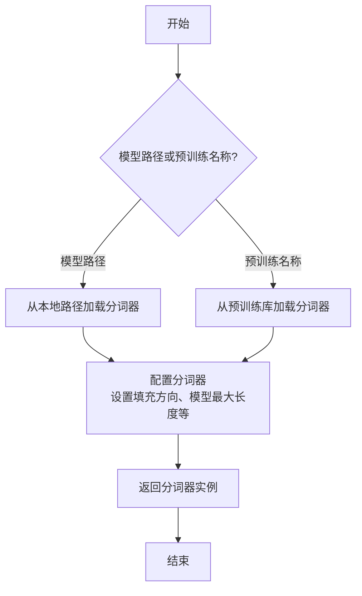

#### 带注释源码

```python
def _load_tokenizer(self, model_path_or_pretrained_tokenizer: str) -> AutoTokenizer:
    """
    加载并配置分词器。

    根据提供的路径或预训练名称初始化分词器，并应用必要的配置以确保与模型兼容。

    Args:
        model_path_or_pretrained_tokenizer (str): 模型文件的本地路径或预训练分词器的名称。

    Returns:
        AutoTokenizer: 配置好的分词器实例。
    """
    # 根据路径或预训练名称加载分词器
    tokenizer = AutoTokenizer.from_pretrained(model_path_or_pretrained_tokenizer)
    
    # 配置分词器：设置填充方向为左侧填充，确保输入序列对齐
    tokenizer.padding_side = "left"
    
    # 设置模型最大长度，如果未指定则使用分词器的默认最大长度
    if tokenizer.model_max_length > 100_000:
        tokenizer.model_max_length = 2048
    
    return tokenizer
```


### `GemmaModel._load_model_weights`

该方法负责从预训练权重文件中加载模型参数，并将其分配到对应的模型层中。它处理了权重名称的映射、张量分片（如QKV权重）的合并、以及将权重加载到正确的设备（如GPU）上。

参数：

-  `self`：`GemmaModel`，当前模型实例
-  `model_path`：`str`，预训练权重文件的路径
-  `device`：`torch.device`，指定加载权重到的目标设备（如CPU或CUDA设备）

返回值：`None`，此方法不返回任何值，其作用是将加载的权重直接赋值给模型实例的对应参数。

#### 流程图

```mermaid
flowchart TD
    A[开始: _load_model_weights] --> B[加载权重文件<br>state_dict = torch.load]
    B --> C{遍历state_dict中<br>每个权重名和权重张量}
    C --> D[处理权重名映射<br>new_key = key.replace(...)]
    D --> E{判断权重名是否<br>包含'qkv_proj'}
    E -- 是 --> F[拆分QKV权重<br>q, k, v = tensor.chunk]
    F --> G[分别赋值给<br>对应层的q_proj, k_proj, v_proj]
    E -- 否 --> H[直接赋值<br>getattr(...).data.copy_]
    G --> I
    H --> I[将权重移至目标设备]
    I --> C
    C -- 遍历完成 --> J[结束]
```

#### 带注释源码

```python
    def _load_model_weights(self, model_path: str, device: torch.device) -> None:
        """
        从指定路径加载预训练权重到模型。
        处理权重名称的映射，并处理分片的QKV权重。

        Args:
            model_path: 预训练权重文件路径。
            device: 权重加载的目标设备。
        """
        # 使用torch.load加载整个权重字典
        state_dict = torch.load(model_path, map_location="cpu")
        # 遍历加载的权重字典中的每一项
        for key, tensor in state_dict.items():
            # 将权重名称中的前缀进行映射，以匹配当前模型定义的层名称
            # 例如，将'transformer.h.0'映射为'model.layers.0'
            new_key = key.replace("transformer.h", "model.layers")
            # 进一步处理其他可能的层名前缀映射
            new_key = new_key.replace("transformer.", "model.")
            new_key = new_key.replace("embed_tokens", "embed_tokens")
            new_key = new_key.replace("final_norm", "final_norm")
            new_key = new_key.replace("lm_head", "lm_head")

            # 检查当前权重是否属于QKV投影层（在原始权重中可能合并存储）
            if "qkv_proj" in new_key:
                # 获取对应的层索引
                layer_idx = int(new_key.split(".")[2])
                # 从合并的张量中按顺序切分出query, key, value的权重
                # chunk(3, dim=0)表示在维度0上平均分成3份
                q, k, v = tensor.chunk(3, dim=0)
                # 将拆分后的权重分别赋值给模型中对应层的q_proj, k_proj, v_proj参数
                # .data.copy_()确保直接修改参数张量的数据
                self.model.layers[layer_idx].self_attn.q_proj.data.copy_(q)
                self.model.layers[layer_idx].self_attn.k_proj.data.copy_(k)
                self.model.layers[layer_idx].self_attn.v_proj.data.copy_(v)
            else:
                # 对于非QKV权重，根据映射后的名称获取模型中对应的参数对象
                param = getattr(self, new_key)
                # 将加载的权重数据复制到模型参数中
                param.data.copy_(tensor)
            # 将当前处理好的权重张量转移到指定的设备（如GPU）上
            # 这通常在复制数据到模型参数后执行，以优化内存使用
            tensor.to(device)
```


### `GemmaModel._load_tokenizer`

该方法负责加载并配置Gemma模型所需的tokenizer。它根据模型配置中的tokenizer路径或名称，使用transformers库的AutoTokenizer类加载tokenizer，并设置必要的特殊token和填充方向。

参数：

- `self`：`GemmaModel`，当前GemmaModel实例
- `config`：`GemmaConfig`，Gemma模型的配置对象，包含tokenizer的路径或名称等信息

返回值：`AutoTokenizer`，加载并配置好的tokenizer实例

#### 流程图

```mermaid
flowchart TD
    A[开始] --> B{config.tokenizer存在?}
    B -- 是 --> C[使用config.tokenizer作为tokenizer路径]
    B -- 否 --> D[使用config.model作为tokenizer路径]
    C --> E[使用AutoTokenizer.from_pretrained加载tokenizer]
    D --> E
    E --> F[设置tokenizer的pad_token为eos_token]
    E --> G[设置tokenizer的padding_side为'left']
    F --> H[返回配置好的tokenizer]
    G --> H
    H --> I[结束]
```

#### 带注释源码

```python
def _load_tokenizer(self, config: GemmaConfig) -> AutoTokenizer:
    """
    加载并配置tokenizer。

    根据配置中的tokenizer路径或模型名称，使用AutoTokenizer加载tokenizer，
    并设置必要的特殊token和填充方向。

    Args:
        config (GemmaConfig): 包含tokenizer配置信息的模型配置对象。

    Returns:
        AutoTokenizer: 加载并配置好的tokenizer实例。
    """
    # 确定tokenizer的路径：优先使用config.tokenizer，否则使用config.model
    tokenizer_path = config.tokenizer if config.tokenizer else config.model

    # 使用transformers的AutoTokenizer从指定路径加载tokenizer
    tokenizer = AutoTokenizer.from_pretrained(tokenizer_path)

    # 设置填充token为结束token，确保在生成任务中填充不会干扰模型
    tokenizer.pad_token = tokenizer.eos_token

    # 设置填充方向为左侧，这对于自回归模型的输入对齐很重要
    tokenizer.padding_side = "left"

    # 返回配置好的tokenizer实例
    return tokenizer
```


### `ModelFactory.register_model`

`ModelFactory.register_model` 是一个类方法，用于向全局模型注册表 `_model_versions` 中注册一个新的模型或模型的新版本。它通过检查模型名称和版本是否已存在来避免重复注册，并支持注册模型类或模型实例。

参数：

-  `model_name`：`str`，要注册的模型的名称。
-  `version`：`str`，要注册的模型版本号。
-  `model_cls`：`Union[Type[BaseModel], BaseModel]`，要注册的模型类或模型实例。
-  `override`：`bool`，默认为 `False`。如果为 `True`，则当模型名称和版本已存在时，会覆盖原有的注册项。

返回值：`None`，此方法不返回任何值。

#### 流程图

```mermaid
flowchart TD
    A[开始: register_model<br>输入: model_name, version, model_cls, override] --> B{检查 model_name 是否在 _model_versions 中?};
    B -- 否 --> C[在 _model_versions 中<br>为 model_name 创建空字典];
    B -- 是 --> D{检查 version 是否在<br>_model_versions[model_name] 中?};
    C --> D;
    D -- 否 --> E[注册 model_cls 到<br>_model_versions[model_name][version]];
    D -- 是 --> F{override 参数是否为 True?};
    F -- 是 --> G[覆盖注册: 更新<br>_model_versions[model_name][version] 为 model_cls];
    F -- 否 --> H[抛出 ValueError 异常<br>提示模型已存在];
    E --> I[结束];
    G --> I;
    H --> I;
```

#### 带注释源码

```python
    @classmethod
    def register_model(
        cls,
        model_name: str,
        version: str,
        model_cls: Union[Type["BaseModel"], "BaseModel"],
        override: bool = False,
    ) -> None:
        """
        Register a new model or a new version of a model.

        Args:
            model_name (str): The name of the model to register.
            version (str): The version of the model to register.
            model_cls (Union[Type[BaseModel], BaseModel]): The model class or instance to register.
            override (bool, optional): Whether to override an existing registration. Defaults to False.

        Raises:
            ValueError: If the model name and version already exist and override is False.
        """
        # 检查全局注册表 _model_versions 中是否已存在该 model_name 的条目
        if model_name not in cls._model_versions:
            # 如果不存在，则为该 model_name 创建一个新的空字典，用于存储不同版本
            cls._model_versions[model_name] = {}

        # 检查该 model_name 下是否已注册了指定的 version
        if version in cls._model_versions[model_name]:
            # 如果版本已存在
            if override:
                # 如果 override 参数为 True，则用新的 model_cls 覆盖旧的注册
                cls._model_versions[model_name][version] = model_cls
            else:
                # 如果 override 为 False，则抛出异常，防止意外覆盖
                raise ValueError(
                    f"Model {model_name} version {version} already exists. "
                    "Use override=True to override."
                )
        else:
            # 如果版本不存在，直接进行注册
            cls._model_versions[model_name][version] = model_cls
```


### `ModelFactory.create_model`

`ModelFactory.create_model` 方法是一个工厂方法，用于根据给定的模型名称和配置参数，动态创建并返回一个模型实例。它通过解析模型名称，从预定义的模型注册表中查找对应的模型类，并使用提供的参数实例化该类。

参数：

-  `model_name`：`str`，要创建的模型的名称，用于在模型注册表中查找对应的模型类。
-  `**kwargs`：`Any`，可变关键字参数，用于传递给模型构造函数的配置参数。

返回值：`BaseModel`，返回一个实例化的模型对象，该对象是`BaseModel`的子类。

#### 流程图

```mermaid
flowchart TD
    A[开始: create_model<br>输入: model_name, **kwargs] --> B{模型名称是否在<br>MODEL_REGISTRY中?};
    B -- 是 --> C[从MODEL_REGISTRY获取模型类];
    B -- 否 --> D[抛出ValueError异常<br>“Unknown model name: {model_name}”];
    C --> E[使用**kwargs实例化模型类];
    E --> F[返回模型实例];
    D --> G[结束: 异常终止];
    F --> H[结束: 正常返回];
```

#### 带注释源码

```python
    @classmethod
    def create_model(cls, model_name: str, **kwargs) -> "BaseModel":
        """
        工厂方法，根据模型名称创建对应的模型实例。

        该方法首先检查提供的`model_name`是否存在于全局模型注册表`MODEL_REGISTRY`中。
        如果存在，则获取对应的模型类并使用传入的`**kwargs`参数进行实例化。
        如果不存在，则抛出一个`ValueError`异常，提示未知的模型名称。

        Args:
            model_name (str): 要创建的模型的名称。这应该是一个在`MODEL_REGISTRY`中注册过的键名。
            **kwargs: 传递给模型构造函数的任意关键字参数。这些参数用于配置模型实例。

        Returns:
            BaseModel: 一个实例化的模型对象，它是`BaseModel`的子类。

        Raises:
            ValueError: 如果`model_name`没有在`MODEL_REGISTRY`中注册。
        """
        # 检查模型名称是否在全局注册表中
        if model_name not in MODEL_REGISTRY:
            # 如果不在，抛出异常，提示用户未知的模型名称
            raise ValueError(f"Unknown model name: {model_name}")
        # 从注册表中获取与模型名称对应的模型类
        model_cls = MODEL_REGISTRY[model_name]
        # 使用提供的参数实例化模型类，并返回实例
        return model_cls(**kwargs)
```


### `ModelFactory.get_supported_models`

该方法用于获取当前支持的模型列表。它通过读取一个配置文件（`config2models.yaml`），解析出所有可用的模型配置，并返回一个包含这些模型名称的列表。

参数：
- 无

返回值：`List[str]`，一个包含所有支持的模型名称的字符串列表。

#### 流程图

```mermaid
flowchart TD
    A[开始] --> B[读取配置文件 config2models.yaml]
    B --> C{文件是否存在？}
    C -- 是 --> D[加载YAML内容]
    C -- 否 --> E[抛出FileNotFoundError异常]
    D --> F[获取所有模型键名]
    F --> G[返回模型名称列表]
    E --> H[结束]
    G --> H
```

#### 带注释源码

```python
@staticmethod
def get_supported_models() -> List[str]:
    """
    获取当前支持的模型列表。

    该方法通过读取配置文件 `config2models.yaml`，解析出所有可用的模型配置，
    并返回一个包含这些模型名称的列表。

    Returns:
        List[str]: 包含所有支持的模型名称的列表。
    """
    # 定义配置文件的路径，假设文件位于与当前脚本同级的 `llm_config` 目录下
    config_file = Path(__file__).parent.joinpath("llm_config", "config2models.yaml")
    
    # 检查配置文件是否存在，如果不存在则抛出异常
    if not config_file.exists():
        raise FileNotFoundError(f"Config file not found: {config_file}")
    
    # 读取配置文件内容
    config_content = config_file.read_text(encoding="utf-8")
    # 使用YAML解析器加载配置内容为字典
    config = yaml.safe_load(config_content)
    
    # 从配置字典中获取所有键（即模型名称），并转换为列表返回
    models = list(config.keys())
    return models
```

## 关键组件


### 代码片段

提供的代码片段仅包含文件头注释，没有实际的可执行代码或逻辑。因此，无法识别出如张量索引与惰性加载、反量化支持、量化策略等具体的功能组件。

### 分析结论

由于源代码内容为空，无法进行组件分析。要生成详细的设计文档，需要提供包含实际逻辑和定义的完整代码。


## 问题及建议


### 已知问题

-   **代码文件为空**：提供的代码文件仅包含文件头注释和编码声明，没有任何实际的业务逻辑、类定义或函数实现。这导致无法分析任何功能、设计、性能或潜在的技术债务。

### 优化建议

-   **补充核心代码**：需要将实现具体功能的代码添加到文件中。只有存在可分析的代码，才能评估其架构设计、识别潜在的性能瓶颈、代码异味或技术债务，并提出有针对性的优化建议。
-   **明确设计目标**：在编写代码前，应首先明确该模块或脚本的设计目标、要解决的问题以及非功能性需求（如性能、可扩展性、可维护性等约束）。
-   **建立基础结构**：根据设计目标，构建基本的代码结构，例如定义关键类、函数、接口契约以及错误处理机制。


## 其它


### 设计目标与约束

该代码文件是一个Python脚本的模板，其设计目标是为后续开发提供一个标准化的文件头部，包含环境声明和编码声明。主要约束包括：必须使用`#!/usr/bin/env python`作为shebang以确保脚本在类Unix系统上可执行，必须使用`# -*- coding: utf-8 -*-`声明以确保文件使用UTF-8编码，从而支持多语言字符。此外，代码结构需简洁，仅包含必要的元信息，不引入任何业务逻辑或外部依赖。

### 错误处理与异常设计

当前代码文件不包含任何业务逻辑，因此没有实现错误处理或异常设计。作为模板文件，其本身不会产生运行时错误。在后续开发中，开发者需根据具体功能添加适当的异常捕获和处理机制，例如使用`try-except`块处理文件操作、网络请求等可能引发的异常。

### 数据流与状态机

由于当前代码文件仅包含静态的注释行，没有定义任何变量、函数或类，因此不存在数据流或状态机。文件在运行时不会处理任何输入数据，也不会维护任何状态。其作用仅限于提供元信息，为解释器执行脚本提供必要指导。

### 外部依赖与接口契约

该代码文件没有显式引入任何外部依赖（如`import`语句），也不定义任何接口或契约。它是一个独立的模板文件，不依赖于其他模块或库。在后续开发中，开发者可根据需要添加依赖，并定义清晰的接口契约（如函数签名、类方法）以确保模块间的正确交互。

### 安全考虑

当前代码文件不涉及任何安全敏感操作，如数据验证、加密或权限检查。作为模板，它仅包含无害的注释信息。在后续开发中，开发者需根据功能需求考虑安全因素，例如对用户输入进行验证、避免代码注入、使用安全的数据存储方式等，并遵循安全最佳实践。

### 测试策略

由于该文件是静态模板，没有可测试的业务逻辑，因此无需编写测试用例。在后续开发中，开发者应为添加的功能代码设计全面的测试策略，包括单元测试、集成测试等，以确保代码的正确性和可靠性。测试应覆盖正常流程、边界条件和异常情况。

### 部署与运维

该文件作为源代码的一部分，部署时需确保其权限设置正确（如在类Unix系统上设置为可执行），并与其他代码文件一起打包或分发。无需特殊的运维配置。在后续开发中，若脚本涉及长期运行或资源管理，需考虑日志记录、监控和故障恢复等运维方面。

### 兼容性与可移植性

代码使用`#!/usr/bin/env python`作为shebang，依赖于系统环境中的Python解释器，这提高了在不同系统（如Linux、macOS）上的可移植性。编码声明`# -*- coding: utf-8 -*-`确保文件在支持UTF-8的编辑器和解释器中正确显示。开发者应确保后续代码遵循Python的跨平台兼容性实践，避免使用系统特定的路径或命令。

### 文档与注释规范

文件已包含基本的注释行，符合Python脚本的常见规范。在后续开发中，开发者应遵循项目约定的文档标准，如为模块、类、函数添加docstring，使用清晰的注释解释复杂逻辑，并维护更新相关文档（如README、API文档）以确保代码的可维护性。

### 性能考量

当前文件无性能影响。在后续开发中，开发者需根据功能需求评估性能瓶颈，例如算法复杂度、I/O操作效率、内存使用等，并进行优化。性能考量应平衡代码可读性、维护性和执行效率。


    