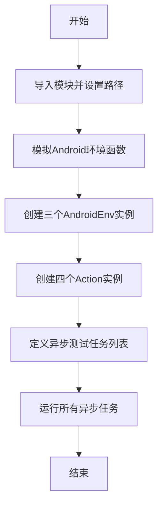
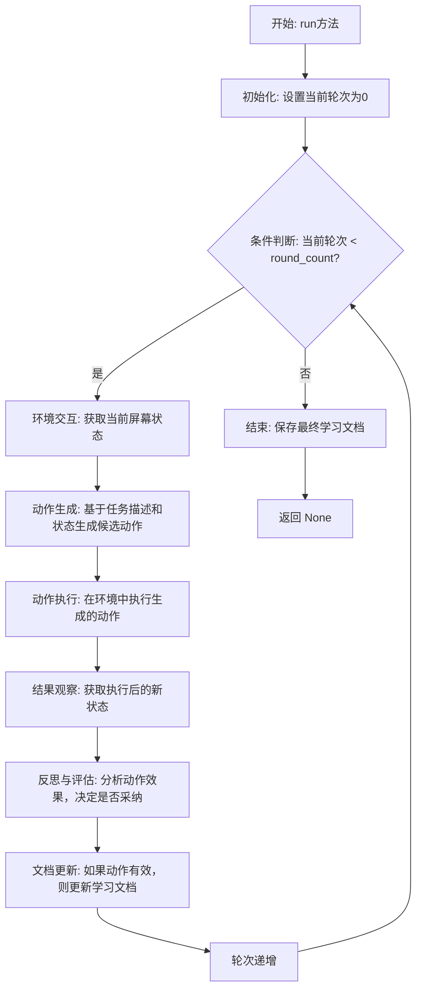
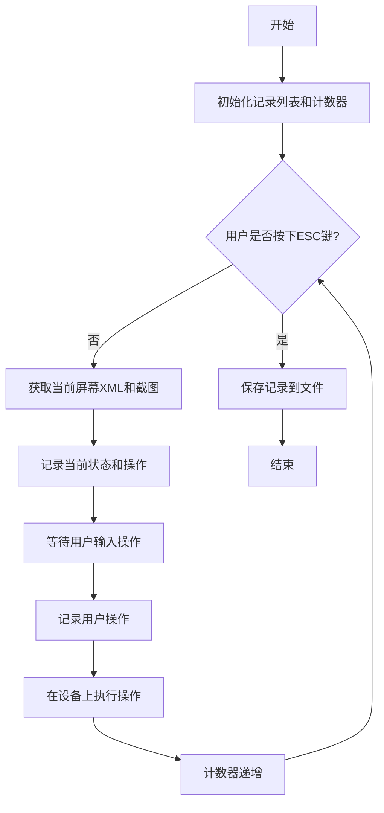
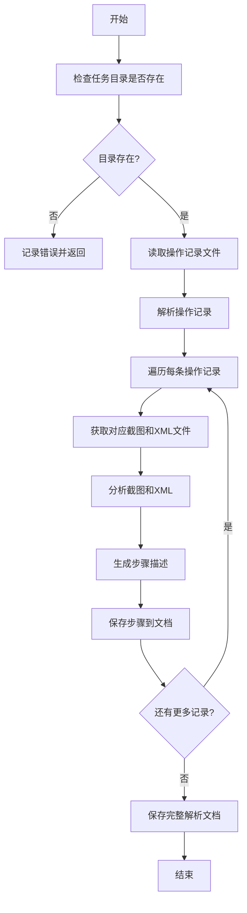
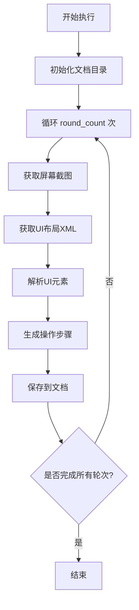

# `.\MetaGPT\tests\metagpt\ext\android_assistant\test_an.py` 详细设计文档

该代码是一个用于测试Android模拟器上自动化操作的脚本，它通过创建多个测试任务（包括自我学习、手动记录、解析记录和截图解析）来验证MetaGPT框架中Android助手相关功能模块（如SelfLearnAndReflect, ManualRecord, ParseRecord, ScreenshotParse）在模拟环境中的协同工作能力。

## 整体流程



## 类结构

```
外部依赖/导入模块
├── asyncio
├── time
├── pathlib.Path
├── metagpt
├── metagpt.const.TEST_DATA_PATH
├── metagpt.environment.android.android_env.AndroidEnv
├── metagpt.ext.android_assistant.actions.manual_record.ManualRecord
├── metagpt.ext.android_assistant.actions.parse_record.ParseRecord
├── metagpt.ext.android_assistant.actions.screenshot_parse.ScreenshotParse
└── metagpt.ext.android_assistant.actions.self_learn_and_reflect.SelfLearnAndReflect
测试辅助函数
├── tests.metagpt.environment.android_env.test_android_ext_env.mock_device_shape
└── tests.metagpt.environment.android_env.test_android_ext_env.mock_list_devices
```

## 全局变量及字段


### `TASK_PATH`
    
测试数据存储的基础路径，指向Android助手单元测试的Contacts任务目录

类型：`pathlib.Path`
    


### `DEMO_NAME`
    
基于当前时间戳生成的唯一标识符，用于区分不同测试运行的输出目录

类型：`str`
    


### `SELF_EXPLORE_DOC_PATH`
    
SelfLearnAndReflect动作生成的自动化探索文档的存储路径

类型：`pathlib.Path`
    


### `PARSE_RECORD_DOC_PATH`
    
ParseRecord动作解析手动记录后生成的文档存储路径

类型：`pathlib.Path`
    


### `device_id`
    
Android设备或模拟器的标识符，用于指定测试目标设备

类型：`str`
    


### `xml_dir`
    
Android设备上UI布局XML文件的存储目录路径

类型：`pathlib.Path`
    


### `screenshot_dir`
    
Android设备上截图文件的存储目录路径

类型：`pathlib.Path`
    


### `test_env_self_learn_android`
    
为SelfLearnAndReflect动作创建的Android环境实例，用于自动化探索测试

类型：`AndroidEnv`
    


### `test_self_learning`
    
SelfLearnAndReflect动作的实例，用于执行自动化探索学习

类型：`SelfLearnAndReflect`
    


### `test_env_manual_learn_android`
    
为ManualRecord和ParseRecord动作创建的Android环境实例，用于手动记录测试

类型：`AndroidEnv`
    


### `test_manual_record`
    
ManualRecord动作的实例，用于记录手动操作步骤

类型：`ManualRecord`
    


### `test_manual_parse`
    
ParseRecord动作的实例，用于解析手动记录的操作

类型：`ParseRecord`
    


### `test_env_screenshot_parse_android`
    
为ScreenshotParse动作创建的Android环境实例，用于截图解析测试

类型：`AndroidEnv`
    


### `test_screenshot_parse`
    
ScreenshotParse动作的实例，用于基于截图解析UI状态

类型：`ScreenshotParse`
    


### `loop`
    
异步事件循环实例，用于并发执行多个测试动作

类型：`asyncio.AbstractEventLoop`
    


### `test_action_list`
    
包含所有待并发执行的测试动作任务的列表

类型：`List[asyncio.Task]`
    


    

## 全局函数及方法


### `SelfLearnAndReflect.run`

该方法是一个异步方法，用于在Android环境中执行一个自我学习和反思的循环过程。它通过与环境交互、解析屏幕截图、生成和评估动作来学习如何完成给定的任务描述。该方法的核心是迭代地尝试、观察、反思并改进其策略，以最终生成一个可执行的任务文档。

参数：

-  `round_count`：`int`，指定学习过程的最大迭代轮数。
-  `task_desc`：`str`，需要完成的任务的文本描述。
-  `last_act`：`str`，上一轮执行的动作描述，用于连续性学习。
-  `task_dir`：`Path`，用于存储学习过程中生成的数据（如截图、XML文件）的目录路径。
-  `docs_dir`：`Path`，用于存储最终生成的任务文档的目录路径。
-  `env`：`AndroidEnv`，提供与Android设备交互的环境实例。

返回值：`None`，此方法不返回任何值，其主要作用是通过副作用（如生成文件、与环境交互）来完成任务。

#### 流程图



#### 带注释源码

```python
    async def run(
        self,
        round_count: int,
        task_desc: str,
        last_act: str,
        task_dir: Path,
        docs_dir: Path,
        env: AndroidEnv,
    ) -> None:
        """
        执行自我学习和反思的主循环。
        
        Args:
            round_count: 学习循环的总轮数。
            task_desc: 要完成的任务描述。
            last_act: 上一轮执行的动作（用于连续性）。
            task_dir: 存储运行时数据（截图、布局文件）的目录。
            docs_dir: 存储最终学习成果（文档）的目录。
            env: Android环境实例，用于与设备交互。
        """
        # 初始化当前轮次计数器
        cur_round = 0
        # 确保文档存储目录存在
        docs_dir.mkdir(parents=True, exist_ok=True)
        
        # 主学习循环：在未达到最大轮次且任务未完成时持续进行
        while cur_round < round_count:
            # 1. 从环境中获取当前设备状态的快照（如屏幕截图、UI布局）
            #    这为后续的动作决策提供了上下文。
            state = await env.observe()
            
            # 2. 基于当前状态、任务描述和上一轮动作，生成一个或多个候选动作。
            #    这一步可能涉及LLM推理或规则匹配。
            action = await self._generate_action(state, task_desc, last_act)
            
            # 3. 在Android环境中执行生成的动作（如点击、输入文本）。
            #    这是学习过程中与真实环境交互的关键步骤。
            await env.execute(action)
            
            # 4. 动作执行后，再次观察环境以获取新的状态。
            #    通过对比执行前后的状态，可以评估动作的效果。
            new_state = await env.observe()
            
            # 5. 对执行的动作进行反思和评估。
            #    判断该动作是否有效，是否推动了任务的完成，或者是否产生了错误。
            reflection = await self._reflect_on_action(state, action, new_state, task_desc)
            
            # 6. 如果反思认为动作是有效且正确的，则将其记录到学习文档中。
            #    这相当于构建一个“成功动作序列”的知识库。
            if reflection.is_effective:
                await self._update_learning_docs(docs_dir, action, reflection.insights)
                # 如果反思认为任务已完成，可以提前退出循环
                if reflection.is_task_complete:
                    break
            
            # 7. 更新`last_act`为当前执行的动作，以便下一轮生成连续性动作。
            last_act = action.description
            # 轮次计数器递增
            cur_round += 1
        
        # 8. 学习循环结束后，将最终的学习文档（即学到的任务执行步骤）保存到指定目录。
        await self._save_final_documentation(docs_dir, task_desc)
        # 方法执行完毕，无返回值。
```


### `ManualRecord.run`

该方法用于在Android环境中执行手动记录任务，通过用户交互（键盘输入）来记录操作步骤，并将记录保存到指定目录。

参数：

- `task_dir`：`Path`，任务目录路径，用于保存记录文件
- `task_desc`：`str`，任务描述，说明要执行的操作
- `env`：`AndroidEnv`，Android环境实例，提供设备交互能力

返回值：`None`，无返回值

#### 流程图



#### 带注释源码

```python
async def run(self, task_dir: Path, task_desc: str, env: AndroidEnv) -> None:
    """
    执行手动记录任务，通过用户交互记录操作步骤。

    Args:
        task_dir (Path): 任务目录路径，用于保存记录文件。
        task_desc (str): 任务描述，说明要执行的操作。
        env (AndroidEnv): Android环境实例，提供设备交互能力。

    Returns:
        None: 无返回值。
    """
    # 初始化记录列表和计数器
    records = []
    idx = 0

    # 循环记录用户操作，直到按下ESC键
    while True:
        # 检查用户是否按下ESC键，如果是则退出循环
        if keyboard.is_pressed("esc"):
            break

        # 获取当前屏幕的XML布局和截图
        xml = await env.observe()
        screenshot = await env.screenshot()

        # 记录当前状态（XML和截图）
        records.append(
            {
                "step": idx,
                "xml": xml,
                "screenshot": screenshot,
            }
        )

        # 等待用户输入操作（键盘按键）
        op = await wait_keyboard_input()

        # 记录用户操作
        records[-1]["op"] = op

        # 在设备上执行用户操作
        await env.execute(op)

        # 计数器递增
        idx += 1

    # 保存记录到文件
    with open(task_dir / "records.json", "w", encoding="utf-8") as f:
        json.dump(records, f, ensure_ascii=False, indent=4)
```


### `ParseRecord.run`

该方法用于解析手动记录的任务数据，将其转换为结构化的文档格式。它从指定的任务目录中读取屏幕截图、XML布局文件和操作记录，通过分析这些数据生成详细的步骤文档，描述在Android设备上执行特定任务的操作流程。

参数：

- `task_dir`：`Path`，包含手动记录任务数据的目录路径，其中应包含截图、XML文件和操作记录。
- `docs_dir`：`Path`，生成的解析文档的保存目录路径。
- `env`：`AndroidEnv`，Android环境实例，提供与设备交互的上下文。

返回值：`None`，该方法不返回任何值，但会将生成的解析文档保存到指定目录。

#### 流程图



#### 带注释源码

```python
async def run(self, task_dir: Path, docs_dir: Path, env: AndroidEnv) -> None:
    """
    执行解析记录的主要方法。
    
    参数:
        task_dir (Path): 任务数据目录。
        docs_dir (Path): 文档保存目录。
        env (AndroidEnv): Android环境实例。
    """
    # 检查任务目录是否存在
    if not task_dir.exists():
        self.logger.error(f"Task directory does not exist: {task_dir}")
        return

    # 确保文档目录存在
    docs_dir.mkdir(parents=True, exist_ok=True)

    # 读取操作记录文件
    record_file = task_dir / "actions_record.txt"
    if not record_file.exists():
        self.logger.error(f"Record file not found: {record_file}")
        return

    with open(record_file, 'r') as f:
        actions = f.readlines()

    parsed_steps = []
    # 遍历每条操作记录
    for idx, action in enumerate(actions):
        action = action.strip()
        if not action:
            continue

        # 获取对应的截图和XML文件
        screenshot_path = task_dir / f"screenshot_{idx}.png"
        xml_path = task_dir / f"ui_xml_{idx}.xml"

        # 分析截图和XML以生成步骤描述
        step_description = self._analyze_step(screenshot_path, xml_path, action)
        parsed_steps.append(step_description)

    # 生成完整的解析文档
    doc_content = self._generate_documentation(parsed_steps)
    doc_path = docs_dir / f"parsed_{task_dir.name}.md"

    # 保存文档
    with open(doc_path, 'w') as f:
        f.write(doc_content)

    self.logger.info(f"Parsed documentation saved to: {doc_path}")
```


### `ScreenshotParse.run`

该方法用于执行基于截图的Android界面解析任务，通过多轮迭代分析屏幕截图和UI布局XML，生成操作步骤文档。

参数：

- `round_count`：`int`，解析的轮次数量
- `task_desc`：`str`，任务描述文本
- `last_act`：`str`，上一轮的操作描述
- `task_dir`：`Path`，任务数据存储目录路径
- `docs_dir`：`Path`，生成的文档存储目录路径
- `env`：`AndroidEnv`，Android环境实例
- `grid_on`：`bool`，是否启用网格模式（默认为False）

返回值：`None`，无返回值，执行结果保存到指定目录

#### 流程图



#### 带注释源码

```python
async def run(
    self,
    round_count: int,
    task_desc: str,
    last_act: str,
    task_dir: Path,
    docs_dir: Path,
    env: AndroidEnv,
    grid_on: bool = False,
) -> None:
    """
    执行基于截图的Android界面解析任务
    
    Args:
        round_count: 解析的轮次数量
        task_desc: 任务描述文本
        last_act: 上一轮的操作描述
        task_dir: 任务数据存储目录路径
        docs_dir: 生成的文档存储目录路径
        env: Android环境实例
        grid_on: 是否启用网格模式
    """
    # 确保文档目录存在
    docs_dir.mkdir(parents=True, exist_ok=True)
    
    # 循环执行指定轮次的解析
    for round_idx in range(round_count):
        # 获取当前屏幕截图
        screenshot = await env.get_screenshot()
        
        # 获取当前UI布局XML
        ui_xml = await env.get_ui_xml()
        
        # 解析UI元素和布局
        ui_elements = self.parse_ui_elements(ui_xml, grid_on)
        
        # 基于任务描述和上一轮操作生成当前操作步骤
        action_steps = self.generate_action_steps(
            task_desc, last_act, ui_elements, screenshot
        )
        
        # 保存操作步骤到文档
        doc_path = docs_dir / f"round_{round_idx}.md"
        self.save_to_document(doc_path, action_steps)
        
        # 更新上一轮操作记录
        last_act = action_steps[-1] if action_steps else ""
        
        # 可选：添加延迟避免过快执行
        await asyncio.sleep(0.5)
```

## 关键组件


### AndroidEnv

Android环境类，用于模拟和管理Android设备环境，包括设备ID、XML目录和截图目录的配置。

### SelfLearnAndReflect

自我学习与反思动作类，通过与环境交互进行多轮学习，生成任务相关的文档。

### ManualRecord

手动记录动作类，用于记录用户在Android设备上的手动操作，并保存相关数据。

### ParseRecord

解析记录动作类，用于解析手动记录的数据，生成结构化的文档。

### ScreenshotParse

截图解析动作类，通过分析Android设备的屏幕截图，解析界面元素并生成操作文档。

### AndroidExtEnv

Android扩展环境类，提供ADB命令执行和设备列表查询的模拟功能，用于测试环境。

### 测试数据路径与任务配置

定义了测试数据的存储路径、任务描述、设备ID等配置信息，用于组织和管理测试任务。

### 异步任务执行

使用asyncio事件循环和gather方法，并发执行多个测试动作，提高测试效率。


## 问题及建议


### 已知问题

-   **代码注释与命名不一致**：`test_manual_parse.run` 方法调用中的注释“修要修改”和“需要修改”表明参数传递可能存在错误或需要调整，但代码中未修正，这可能导致运行时错误或逻辑混乱。
-   **硬编码路径与配置**：脚本中多处使用了硬编码的路径（如 `xml_dir = Path("/sdcard")`）和设备ID（`device_id = "emulator-5554"`），这降低了代码的可移植性和可配置性，更换设备或环境时需要手动修改源码。
-   **全局变量污染**：脚本在全局作用域中定义了多个测试环境实例（如 `test_env_self_learn_android`, `test_env_manual_learn_android`）和动作实例，这可能导致命名冲突，且不利于模块化管理和测试隔离。
-   **异步任务管理简单**：使用 `asyncio.gather` 并发执行所有测试动作，但未考虑任务间的依赖关系（例如，`test_manual_parse` 可能依赖于 `test_manual_record` 生成的数据）。如果存在依赖，当前执行顺序可能导致错误。
-   **缺乏错误处理机制**：脚本中没有对异步任务执行过程中可能出现的异常（如ADB连接失败、文件读写错误）进行捕获和处理，一旦出错可能导致程序崩溃，不便于问题排查。
-   **测试数据管理混乱**：测试数据目录 `TASK_PATH` 基于时间戳动态生成（`DEMO_NAME = str(time.time())`），虽然避免了冲突，但不利于测试结果的追溯和重复测试。同时，多个测试动作共享或修改同一路径下的数据，可能造成相互干扰。
-   **模拟函数注入方式脆弱**：通过直接修改 `metagpt.environment.android.android_ext_env.AndroidExtEnv` 类的方法（`execute_adb_with_cmd`, `list_devices`）来注入模拟函数，这种方式破坏了类的封装性，且可能影响同一进程中其他使用该类的代码，存在副作用风险。

### 优化建议

-   **修正注释与逻辑**：应立即检查并修正 `test_manual_parse.run` 调用中的参数，确保其指向正确的任务目录和文档目录，使注释与实际代码逻辑一致。
-   **配置外部化**：将设备ID、文件目录路径等配置项移出代码，改为从配置文件（如YAML、JSON）或环境变量中读取。这样可以轻松适应不同的测试环境，提升代码的灵活性。
-   **重构为函数或类**：将全局的测试设置和执行逻辑封装到一个或多个函数或测试类中（例如，一个 `AndroidAssistantTest` 类）。这样可以更好地管理测试状态，减少全局命名空间污染，并提高代码的可读性和可维护性。
-   **明确任务依赖与执行顺序**：重新评估测试动作间的依赖关系。如果 `test_manual_parse` 确实需要 `test_manual_record` 的输出，则应使用 `await` 确保顺序执行，或将有依赖的任务组合为一个复合任务，再与其他独立任务并发执行。
-   **增强异常处理与日志记录**：在 `asyncio.gather` 调用周围添加 `try-except` 块，捕获并记录异常。同时，在关键步骤（如ADB操作、文件保存）添加详细的日志输出，便于调试和监控测试过程。
-   **改进测试数据管理**：考虑使用更结构化的方式命名和管理测试运行目录，例如包含测试用例名称和固定时间格式。对于可能产生冲突的测试，确保每个测试动作使用独立的、隔离的数据目录。
-   **使用更安全的测试替身（Test Double）**：避免直接修改生产代码的类方法。应使用依赖注入或Pytest的monkeypatch等机制，在测试范围内安全地替换 `AndroidExtEnv` 实例的方法。或者，为测试创建一个专用的、配置了模拟行为的 `AndroidEnv` 子类或实例。
-   **添加资源清理逻辑**：测试脚本可能会在设备或本地创建临时文件。建议在测试结束后（或在 `finally` 块中）添加清理逻辑，删除生成的临时文件和目录，保持测试环境的整洁。
-   **考虑脚本状态**：文件顶部的注释“After Modify Role Test, this script is discarded.”表明此脚本可能已过时或为临时用途。建议评估其是否仍需保留。若仍需使用，应进行上述重构和维护；若已废弃，应从代码库中移除，避免混淆。


## 其它


### 设计目标与约束

本脚本是一个用于测试Android模拟器上特定动作的集成测试脚本。其核心设计目标是验证`metagpt.ext.android_assistant`模块中多个关键动作类（`SelfLearnAndReflect`, `ManualRecord`, `ParseRecord`, `ScreenshotParse`）在模拟的Android环境中的协同工作能力。主要约束包括：1) 依赖模拟的Android环境（通过mock函数`mock_device_shape`和`mock_list_devices`替代真实ADB命令），确保测试不依赖真实设备或ADB连接。2) 测试数据隔离，使用基于时间戳的目录名（`DEMO_NAME`）和预定义的测试数据路径（`TEST_DATA_PATH`），防止多次运行间的数据污染。3) 脚本被标记为“已废弃”，表明其作为特定修改后的临时验证工具，而非长期维护的测试用例。

### 错误处理与异常设计

脚本本身未包含显式的错误处理逻辑（如try-catch块）。错误处理主要依赖于其调用的底层动作类（如`SelfLearnAndReflect.run`）和`AndroidEnv`类的内部实现。测试执行通过`asyncio.gather`并发运行多个测试任务，如果任一任务抛出未捕获的异常，将导致整个`gather`调用失败，脚本终止。这种设计符合集成测试脚本的定位：快速暴露集成问题，而非优雅地处理运行时错误。脚本层面的潜在风险包括：模拟函数（`mock_device_shape`, `mock_list_devices`）行为与真实环境不一致可能导致测试通过但实际功能失败；异步任务并发执行可能因资源竞争（如写入同一目录）导致非确定性错误。

### 数据流与状态机

脚本的数据流是线性的初始化与并发执行阶段。初始化阶段：定义路径常量、配置模拟环境、实例化Android环境和各个动作类。并发执行阶段：通过`asyncio.gather`同时启动四个测试动作，每个动作代表一个独立的数据处理流程。1) `SelfLearnAndReflect`：接收任务描述，在指定目录进行多轮自我探索学习，生成文档到`SELF_EXPLORE_DOC_PATH`。2) `ManualRecord`：在指定目录记录手动操作过程。3) `ParseRecord`：解析`ManualRecord`生成的记录，生成文档到`PARSE_RECORD_DOC_PATH`。4) `ScreenshotParse`：基于截图进行多轮解析，生成文档到`PARSE_RECORD_DOC_PATH`。这些动作之间没有直接的调用或数据传递依赖，是并行独立的测试用例。它们共享相同的模拟设备ID和基础路径，但使用通过`DEMO_NAME`区分的子目录，构成一个弱耦合的、基于共享文件系统的数据流。

### 外部依赖与接口契约

1.  **内部模块依赖**：强依赖`metagpt.ext.android_assistant.actions`下的四个动作类（`SelfLearnAndReflect`, `ManualRecord`, `ParseRecord`, `ScreenshotParse`）及其`run`方法接口。依赖`metagpt.environment.android.AndroidEnv`类作为测试环境。依赖`metagpt.const.TEST_DATA_PATH`作为基础路径。
2.  **模拟依赖**：通过猴子补丁（monkey-patching）替换了`AndroidExtEnv`类的两个方法：`execute_adb_with_cmd` 和 `list_devices`，使其指向本地定义的`mock_device_shape`和`mock_list_devices`函数。这是脚本能脱离真实Android环境运行的关键，也构成了与`AndroidExtEnv`类的隐式契约——模拟函数需返回符合原方法预期的数据类型。
3.  **异步与文件系统依赖**：依赖`asyncio`库进行并发任务调度。依赖本地文件系统（路径`TEST_DATA_PATH`）进行测试数据的读写和持久化。
4.  **接口契约（动作类run方法）**：脚本调用各动作`run`方法时传递的参数（如`round_count`, `task_desc`, `task_dir`, `docs_dir`, `env`）定义了与这些动作类的核心调用契约。参数的具体含义和必需性由各动作类自行定义和维护。

### 安全与合规性考虑

1.  **数据安全**：测试在本地隔离的目录（`TEST_DATA_PATH`下）进行，不会影响生产数据。但脚本中硬编码了模拟设备ID和SD卡路径（如`/sdcard`），在真实设备上运行可能存在路径不存在的风险。
2.  **隐私合规**：测试任务涉及创建包含姓名（“zjy”）和电话号码（“+86 18831933368”）的联系人。这是一个明显的测试数据，但若在真实环境或测试数据泄露的语境下，仍需注意使用虚构的、非真实的个人身份信息（PII）作为最佳实践。当前脚本使用了固定的测试数据，符合测试场景，但若推广为通用测试工具，应考虑参数化或生成虚构数据。
3.  **权限与访问控制**：脚本通过模拟的Android环境进行操作，避开了对真实设备系统权限（如联系人写入权限）的依赖。这简化了测试，但也意味着测试未覆盖真实的权限申请和处理流程。

    