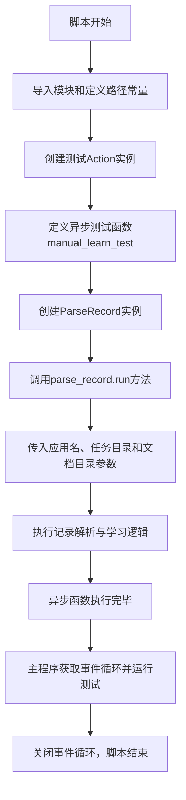
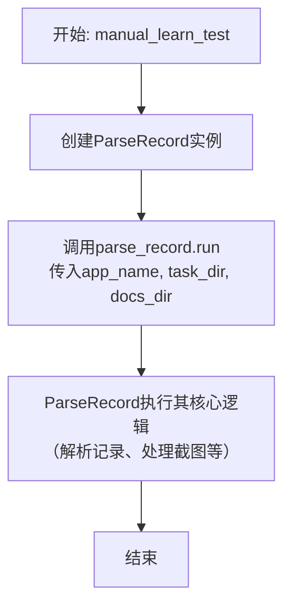
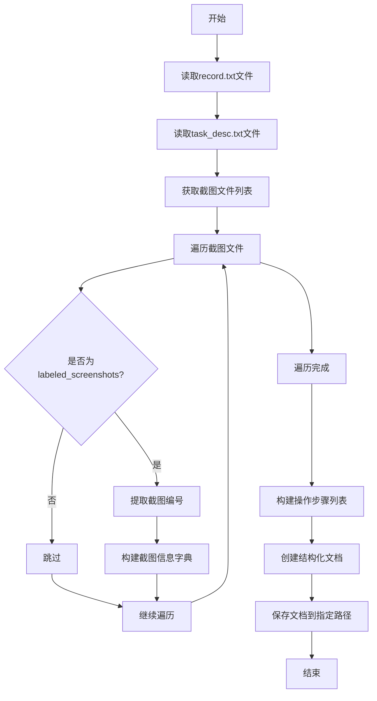

# `.\MetaGPT\tests\metagpt\ext\android_assistant\test_parse_record.py` 详细设计文档

该代码是一个用于测试Android助手功能的测试脚本，主要功能是调用ParseRecord动作来解析Android应用（demo_Contacts）的操作记录，并基于前后截图和任务描述进行学习或验证。

## 整体流程



## 类结构

```
外部依赖类/模块
├── Action (来自metagpt.actions.action)
├── ParseRecord (来自metagpt.ext.android_assistant.actions.parse_record)
└── 标准库/第三方库
    ├── asyncio
    └── pathlib.Path (通过TEST_DATA_PATH等常量体现)
```

## 全局变量及字段


### `TEST_DATA_PATH`
    
指向测试数据根目录的路径对象，用于定位测试资源。

类型：`pathlib.Path`
    


### `TASK_PATH`
    
指向特定任务（demo_Contacts）数据目录的路径对象，包含该任务的所有相关文件。

类型：`pathlib.Path`
    


### `TEST_BEFORE_PATH`
    
指向任务执行前带标签的屏幕截图（0_labeled.png）的路径对象。

类型：`pathlib.Path`
    


### `TEST_AFTER_PATH`
    
指向任务执行后带标签的屏幕截图（1_labeled.png）的路径对象。

类型：`pathlib.Path`
    


### `RECORD_PATH`
    
指向任务操作记录文件（record.txt）的路径对象。

类型：`pathlib.Path`
    


### `TASK_DESC_PATH`
    
指向任务描述文件（task_desc.txt）的路径对象。

类型：`pathlib.Path`
    


### `DOCS_DIR`
    
指向任务文档存储目录（storage）的路径对象。

类型：`pathlib.Path`
    


### `test_action`
    
一个用于测试的Action类实例，其名称为'test'。

类型：`Action`
    


### `loop`
    
异步事件循环实例，用于运行异步函数manual_learn_test。

类型：`asyncio.AbstractEventLoop`
    


### `Action.name`
    
Action实例的名称属性，用于标识该动作。

类型：`str`
    
    

## 全局函数及方法


### `manual_learn_test`

这是一个用于测试 `ParseRecord` 动作的异步函数。它模拟了一个手动学习测试的场景，通过解析指定应用（`demo_Contacts`）在特定任务目录下的记录文件（`record.txt`）和截图，来生成或更新文档。

参数：
-   `无`：`无`，此函数不接受任何参数。

返回值：`None`，此函数不返回任何值。

#### 流程图



#### 带注释源码

```python
async def manual_learn_test():
    # 1. 实例化 ParseRecord 动作类
    parse_record = ParseRecord()
    # 2. 异步调用 ParseRecord 实例的 run 方法，传入应用名称、任务目录和文档存储目录
    await parse_record.run(app_name="demo_Contacts", task_dir=TASK_PATH, docs_dir=DOCS_DIR)
```


### `ParseRecord.run`

该方法用于解析Android应用的操作记录，将截图、操作步骤和任务描述等信息处理并存储为结构化的文档，以便后续的自动化测试或学习任务使用。

参数：

- `app_name`：`str`，应用名称，用于标识当前处理的应用
- `task_dir`：`Path`，任务目录路径，包含操作记录、截图等文件
- `docs_dir`：`Path`，文档存储目录路径，用于保存处理后的结构化文档

返回值：`None`，该方法不返回任何值，处理结果直接保存到指定目录

#### 流程图



#### 带注释源码

```python
async def run(self, app_name: str, task_dir: Path, docs_dir: Path) -> None:
    """
    解析操作记录并生成结构化文档
    
    Args:
        app_name: 应用名称
        task_dir: 任务目录，包含record.txt、task_desc.txt和screenshots
        docs_dir: 文档存储目录
    """
    # 读取操作记录文件
    record_path = task_dir / "record.txt"
    with open(record_path, "r") as f:
        record_content = f.read()
    
    # 读取任务描述文件
    task_desc_path = task_dir / "task_desc.txt"
    with open(task_desc_path, "r") as f:
        task_desc = f.read()
    
    # 获取截图文件列表
    screenshots_dir = task_dir / "screenshots"
    screenshot_files = list(screenshots_dir.glob("*.png"))
    
    # 构建截图信息字典
    screenshots_info = {}
    for screenshot_file in screenshot_files:
        if "labeled_screenshots" in str(screenshot_file):
            # 提取截图编号，如0_labeled.png -> 0
            screenshot_id = screenshot_file.stem.split("_")[0]
            screenshots_info[screenshot_id] = str(screenshot_file)
    
    # 解析操作步骤
    steps = self._parse_steps(record_content)
    
    # 创建结构化文档
    structured_doc = {
        "app_name": app_name,
        "task_description": task_desc,
        "screenshots": screenshots_info,
        "steps": steps,
        "timestamp": datetime.now().isoformat()
    }
    
    # 保存文档
    output_path = docs_dir / f"{app_name}_parsed_record.json"
    with open(output_path, "w") as f:
        json.dump(structured_doc, f, indent=2, ensure_ascii=False)
    
    logger.info(f"解析完成，文档已保存至: {output_path}")
```

## 关键组件


### Action 类

作为所有具体动作的基类，定义了动作执行的基本框架和接口。

### ParseRecord 类

一个具体的动作类，负责解析Android应用的操作记录，并将其转化为结构化的学习数据。

### 异步执行框架

代码使用 `asyncio` 库进行异步任务调度和执行，支持高效的并发操作。

### 路径配置管理

通过 `TEST_DATA_PATH` 等常量集中管理测试数据、任务描述、截图和记录文件的存储路径，便于维护和配置。


## 问题及建议


### 已知问题

-   **硬编码的测试数据路径**：代码中使用了硬编码的路径 `TEST_DATA_PATH.joinpath("andriod_assistant/demo_Contacts")` 来定位测试数据。这使得测试用例与特定的文件结构和数据紧密耦合，降低了代码的可移植性和可维护性。如果测试数据的位置或结构发生变化，需要手动修改代码。
-   **全局变量定义不清晰**：脚本顶部定义了多个全局变量（如 `TASK_PATH`, `TEST_BEFORE_PATH`, `TEST_AFTER_PATH`, `RECORD_PATH`, `TASK_DESC_PATH`, `DOCS_DIR`, `test_action`），其中 `test_action` 被实例化但未在 `manual_learn_test` 函数中使用，这可能导致混淆，让人误以为它是测试的一部分。未使用的变量增加了代码的复杂度和理解成本。
-   **事件循环管理方式过时**：在主入口点，代码使用 `asyncio.get_event_loop()` 和 `loop.run_until_complete()` 来运行异步函数。在较新版本的Python（3.7+）中，推荐使用 `asyncio.run()`，它更简洁且能更好地处理事件循环的创建和清理。当前方式可能在高版本Python中引发弃用警告或行为不一致。
-   **缺乏错误处理机制**：`manual_learn_test` 函数和主执行块中没有包含任何错误处理（如 try-except）。如果 `ParseRecord().run()` 方法执行失败（例如，由于文件不存在、权限问题或内部逻辑错误），程序将直接崩溃，不利于调试和问题定位。
-   **测试意图不明确**：脚本命名为 `test case`，但 `manual_learn_test` 函数主要调用 `ParseRecord` 的 `run` 方法。这更像是一个功能演示或手动执行脚本，而非一个结构化的单元测试或集成测试。缺乏断言（assertions）来验证 `ParseRecord` 操作的结果是否符合预期。

### 优化建议

-   **参数化测试数据路径**：建议将关键路径（如 `TASK_PATH`）作为函数参数或通过配置文件/环境变量传入。例如，可以修改 `manual_learn_test` 函数，使其接受 `task_path` 参数，从而在调用时动态指定测试数据的位置，提高灵活性。
-   **清理未使用的全局变量**：移除未使用的全局变量 `test_action`，因为它没有在代码中发挥作用。对于其他仅在本脚本中使用的路径变量，考虑将它们的作用域限制在 `manual_learn_test` 函数内部，或者作为局部变量，以减少全局命名空间的污染。
-   **更新异步执行模式**：将主入口点的代码替换为使用 `asyncio.run(manual_learn_test())`。这更符合现代Python异步编程的最佳实践，代码更简洁，且由 `asyncio.run()` 负责事件循环的生命周期管理。
-   **添加错误处理与日志记录**：在 `manual_learn_test` 函数和 `asyncio.run` 调用周围添加 try-except 块，捕获可能出现的异常（如 `FileNotFoundError`, `RuntimeError` 等），并打印或记录有意义的错误信息。这有助于快速定位和解决问题。
-   **明确测试目标并添加验证**：如果这是一个测试用例，应明确其测试目标。建议在 `manual_learn_test` 函数中，对 `ParseRecord().run()` 的返回结果或产生的副作用（如生成的文件）进行验证，使用断言来确保行为符合预期。或者，考虑使用标准的测试框架（如 `pytest`）来重构此脚本，使其成为一个真正的自动化测试。
-   **增强代码文档**：在脚本开头、函数定义处添加更详细的文档字符串（docstring），说明脚本的用途、`manual_learn_test` 函数的功能、所需的输入参数及其意义，以及预期的输出或行为。这有助于其他开发者理解和使用此代码。


## 其它


### 设计目标与约束

本代码是一个针对Android助手模块中`ParseRecord`动作的集成测试脚本。其主要设计目标是验证`ParseRecord`类在给定特定测试数据（包括前后截图、操作记录和任务描述）的情况下，能否正确解析并生成文档。代码结构简单，直接调用待测功能，属于功能验证性质。约束包括：依赖外部测试数据文件（位于`TEST_DATA_PATH`下），运行环境需要支持异步操作，并且假设所有输入文件路径均有效且格式正确。

### 错误处理与异常设计

当前代码缺乏显式的错误处理机制。`manual_learn_test`函数直接调用`parse_record.run`，如果输入文件缺失、格式错误或`ParseRecord.run`方法内部出现异常，程序将抛出异常并终止，仅向控制台输出堆栈跟踪信息。这符合测试脚本的典型模式，即快速失败以暴露问题。然而，对于更健壮的测试套件，建议增加`try-except`块来捕获特定异常（如`FileNotFoundError`, `ValueError`等），并输出更具可读性的错误信息，或者将测试失败与程序异常进行区分。

### 数据流与状态机

数据流清晰且线性：
1.  **输入**：脚本通过预定义的常量路径（`TASK_PATH`, `TEST_BEFORE_PATH`, `TEST_AFTER_PATH`, `RECORD_PATH`, `TASK_DESC_PATH`, `DOCS_DIR`）指定输入数据源。这些数据包括应用程序截图、用户操作记录和任务描述文本。
2.  **处理**：`manual_learn_test`函数创建`ParseRecord`实例，并调用其异步`run`方法，传入应用名称（`"demo_Contacts"`）、任务目录和文档输出目录。`ParseRecord.run`方法是核心处理单元，负责读取输入文件、解析内容并生成结构化文档。
3.  **输出**：处理结果（生成的文档）由`ParseRecord.run`方法写入到`DOCS_DIR`指定的目录中。测试脚本本身不直接处理或验证这些输出，其成功执行（即不抛出异常）即视为测试通过。

不存在复杂的状态机，整个流程是单次执行、无状态的过程。

### 外部依赖与接口契约

*   **内部依赖**：
    *   `metagpt.actions.action.Action`：仅用于实例化一个名为`"test"`的`Action`对象（`test_action`），但在当前脚本中未被使用，可能为残留代码或用于其他测试场景。
    *   `metagpt.ext.android_assistant.actions.parse_record.ParseRecord`：核心测试对象，脚本依赖其`run`方法的接口契约。契约包括：`run`为异步方法；接受参数`app_name`（字符串）、`task_dir`（路径对象或字符串）、`docs_dir`（路径对象或字符串）；功能是解析`task_dir`下的数据并在`docs_dir`生成文档。
*   **外部依赖**：
    *   `asyncio`：用于提供异步运行时，执行`manual_learn_test`协程。
    *   文件系统：严重依赖`TEST_DATA_PATH`（来自`metagpt.const`）下的特定目录结构和文件内容。测试的有效性直接取决于这些外部数据文件的正确性和完整性。
*   **环境约束**：需要Python异步环境。`__main__`中的事件循环管理是标准模式。

### 测试策略与覆盖范围

本脚本是一个**集成测试**或**端到端测试**案例，而非单元测试。它测试的是`ParseRecord`动作与其所需外部数据（截图、记录文件）集成的整体功能。覆盖范围包括：
*   **正面路径**：验证在提供正确、完整的测试数据时，`ParseRecord.run`能够成功执行而不抛出异常。
*   **隐式覆盖**：通过使用真实数据，间接测试了文件读取、数据解析和文档生成的连贯性。
未覆盖的范围包括：
*   **负面测试**：未测试输入文件缺失、格式错误、路径无效等异常情况下的行为。
*   **单元测试**：未对`ParseRecord`内部方法进行独立测试。
*   **输出验证**：脚本未对`ParseRecord.run`生成的文档内容进行任何断言或验证，仅检查了过程是否成功。测试的充分性依赖于外部数据是否具有预期的“正确”输出。

### 配置与常量管理

脚本使用硬编码的常量来定义所有测试数据路径：
*   `TEST_DATA_PATH`：从项目配置导入，指向测试数据根目录。
*   `TASK_PATH`等：基于`TEST_DATA_PATH`拼接的具体路径。
这种集中式的常量定义便于管理，但缺乏灵活性。所有路径都相对于固定的`TEST_DATA_PATH`结构。若测试数据位置变更或需要测试多组数据，需要修改源代码。考虑将路径配置或测试用例数据通过外部配置文件或参数化方式提供，以增强可维护性和可复用性。

### 执行与入口点

程序通过标准的`if __name__ == "__main__":`块作为入口点。它使用`asyncio.get_event_loop()`获取事件循环，并运行`manual_learn_test()`协程直到完成，最后关闭循环。这是运行顶层异步函数的典型方法。脚本设计为直接运行，执行单一测试场景。没有提供命令行参数来指定不同的测试数据或配置。

    