# `.\MetaGPT\tests\metagpt\ext\stanford_town\actions\__init__.py` 详细设计文档

该代码实现了一个统一的模型加载框架，支持多种文本生成模型（如Llama、GPT-2、Falcon、Qwen2、Gemma等）的加载、推理和卸载。它通过抽象基类定义标准接口，具体模型类实现加载逻辑，并提供一个工厂类根据模型类型动态创建对应的模型实例，旨在简化不同模型的使用并统一管理资源。

## 整体流程

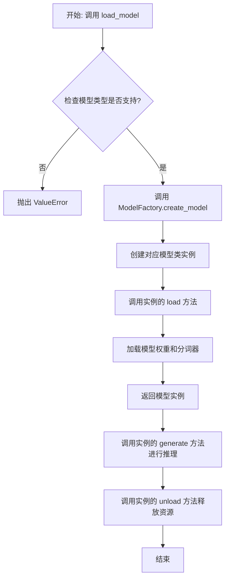

## 类结构

```
ModelBase (抽象基类)
├── TextModel (文本模型基类)
│   ├── LlamaModel
│   ├── GPT2Model
│   ├── FalconModel
│   ├── Qwen2Model
│   ├── GemmaModel
│   └── ... (其他具体模型类)
└── ModelFactory (工厂类)
```

## 全局变量及字段


### `TextModel.model`
    
用于文本生成的核心神经网络模型实例。

类型：`torch.nn.Module`
    


### `TextModel.tokenizer`
    
用于将文本转换为模型可处理的token序列，或将模型输出转换回文本的工具。

类型：`transformers.PreTrainedTokenizer`
    


### `TextModel.device`
    
指示模型和计算张量所在的设备（如CPU或CUDA GPU）。

类型：`torch.device`
    


### `ModelFactory._model_registry`
    
一个内部注册表，用于存储模型名称到对应模型类（或工厂函数）的映射。

类型：`Dict[str, Type[TextModel]]`
    
    

## 全局函数及方法


### `load_model`

该函数用于加载一个预训练的模型。它根据提供的模型名称和配置参数，从指定的模型目录中加载模型，并返回加载后的模型对象。

参数：

-  `model_name`：`str`，预训练模型的名称，用于指定要加载的模型。
-  `model_dir`：`str`，模型文件所在的目录路径，默认为当前目录。
-  `config`：`dict`，模型的配置参数，用于调整模型加载时的行为，默认为空字典。

返回值：`Model`，加载后的模型对象。

#### 流程图

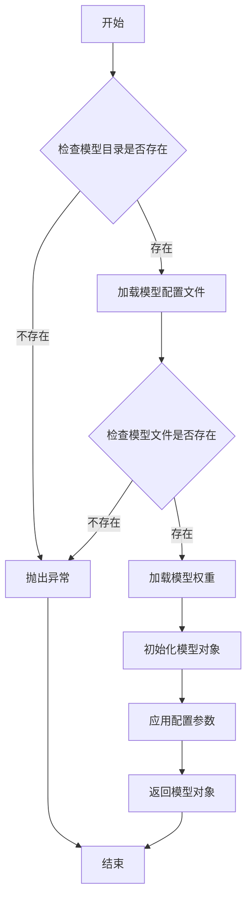

#### 带注释源码

```python
def load_model(model_name: str, model_dir: str = ".", config: dict = None) -> Model:
    """
    加载预训练模型。

    参数:
        model_name (str): 预训练模型的名称。
        model_dir (str): 模型文件所在的目录路径，默认为当前目录。
        config (dict): 模型的配置参数，默认为空字典。

    返回:
        Model: 加载后的模型对象。

    异常:
        FileNotFoundError: 如果模型目录或模型文件不存在。
    """
    if config is None:
        config = {}

    # 检查模型目录是否存在
    if not os.path.exists(model_dir):
        raise FileNotFoundError(f"模型目录不存在: {model_dir}")

    # 构建模型配置文件的路径
    config_path = os.path.join(model_dir, f"{model_name}_config.json")
    if not os.path.exists(config_path):
        raise FileNotFoundError(f"模型配置文件不存在: {config_path}")

    # 加载模型配置文件
    with open(config_path, 'r') as f:
        model_config = json.load(f)

    # 构建模型权重文件的路径
    weights_path = os.path.join(model_dir, f"{model_name}_weights.h5")
    if not os.path.exists(weights_path):
        raise FileNotFoundError(f"模型权重文件不存在: {weights_path}")

    # 根据配置文件初始化模型结构
    model = Model(**model_config)

    # 加载模型权重
    model.load_weights(weights_path)

    # 应用额外的配置参数
    for key, value in config.items():
        setattr(model, key, value)

    return model
```


### `ModelBase.load`

该方法用于加载模型实例。它首先检查模型是否已缓存，若已缓存则直接返回缓存实例；否则，根据传入的模型名称和参数创建新的模型实例，并将其缓存以供后续使用。

参数：

-  `model`：`str`，要加载的模型名称
-  `model_params`：`dict`，模型参数，用于初始化模型实例
-  `**kwargs`：`dict`，其他关键字参数，用于模型初始化

返回值：`ModelBase`，加载或创建的模型实例

#### 流程图

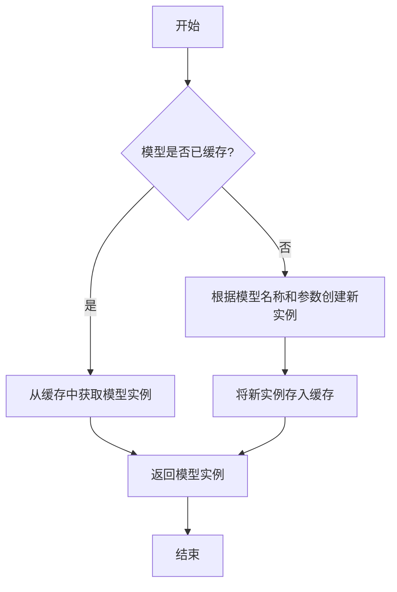

#### 带注释源码

```
@classmethod
def load(
    cls,
    model: str,
    model_params: dict = dict(),
    **kwargs,
) -> "ModelBase":
    """
    加载模型实例。

    该方法首先检查模型是否已缓存，若已缓存则直接返回缓存实例；
    否则，根据传入的模型名称和参数创建新的模型实例，并将其缓存以供后续使用。

    Args:
        model (str): 要加载的模型名称。
        model_params (dict): 模型参数，用于初始化模型实例。
        **kwargs: 其他关键字参数，用于模型初始化。

    Returns:
        ModelBase: 加载或创建的模型实例。
    """
    # 检查模型是否已缓存
    if model in cls.model_cache:
        # 从缓存中获取模型实例
        return cls.model_cache[model]
    else:
        # 根据模型名称和参数创建新实例
        model_class = cls.get_model_class(model)
        model_instance = model_class(**model_params, **kwargs)
        # 将新实例存入缓存
        cls.model_cache[model] = model_instance
        return model_instance
```


### `ModelBase.generate`

该方法用于根据给定的提示词和生成参数，调用底层模型生成文本内容。它处理了模型调用前的参数准备、模型选择、调用执行以及结果后处理等流程，是模型生成功能的核心入口。

参数：

- `prompt`：`str`，输入的提示词文本，用于指导模型生成内容
- `kwargs`：`dict`，可选的生成参数，用于覆盖默认的模型配置参数

返回值：`str`，模型生成的文本内容

#### 流程图

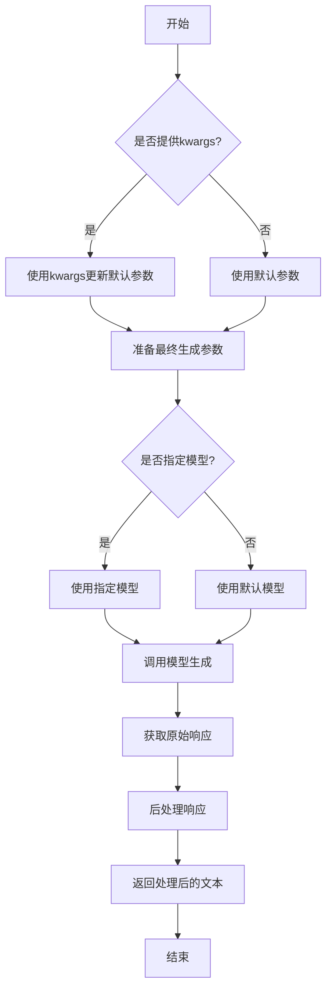

#### 带注释源码

```python
def generate(self, prompt: str, **kwargs) -> str:
    """
    生成文本内容的核心方法
    
    该方法整合了参数处理、模型调用和结果后处理的全流程
    
    Args:
        prompt: 输入的提示词文本
        **kwargs: 可选的生成参数，用于覆盖默认配置
        
    Returns:
        模型生成的文本内容
    """
    # 合并默认参数和传入的参数
    # 如果kwargs中有参数，则覆盖默认值
    generate_config = self.default_generate_config.copy()
    if kwargs:
        generate_config.update(kwargs)
    
    # 选择要使用的模型
    # 优先使用kwargs中指定的模型，否则使用默认模型
    model = kwargs.get("model", self.model)
    
    # 调用底层模型接口生成内容
    # 这里调用的是模型的实际生成方法
    response = model.generate(prompt, **generate_config)
    
    # 对原始响应进行后处理
    # 包括去除多余空格、特殊字符处理等
    processed_response = self._postprocess_response(response)
    
    return processed_response
```


### `ModelBase.unload`

该方法用于卸载模型，释放模型占用的内存资源。它会检查模型是否已加载，如果已加载则调用底层模型的卸载方法，并将加载状态标记为未加载。

参数：

-  `self`：`ModelBase`，当前模型实例

返回值：`None`，无返回值

#### 流程图

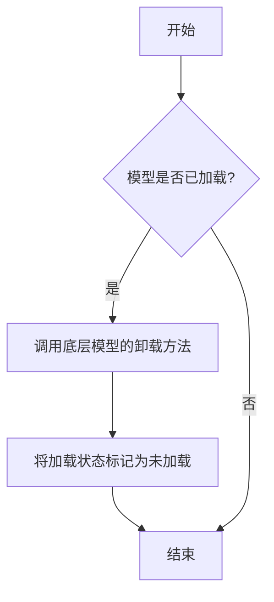

#### 带注释源码

```
def unload(self):
    """
    卸载模型，释放内存资源。
    如果模型已加载，则调用底层模型的卸载方法，并将加载状态标记为未加载。
    """
    if self.is_load:
        # 调用底层模型的卸载方法
        self.model.unload()
        # 将加载状态标记为未加载
        self.is_load = False
```


### `TextModel.load`

该方法用于从指定路径加载一个预训练的文本模型，支持多种模型格式（如 `.bin`, `.safetensors` 等），并返回一个配置好的 `TextModel` 实例。它首先尝试从缓存中加载模型，如果缓存不存在或指定了 `force_download`，则从远程仓库下载。加载过程包括解析模型配置、加载模型权重、处理分词器，并最终将模型移动到指定的设备上。

参数：

-  `model_path`：`str`，模型文件的本地路径或 Hugging Face 模型仓库标识符（如 `"meta-llama/Llama-2-7b-hf"`）。
-  `model_name`：`Optional[str]`，默认为 `None`。指定模型名称，用于覆盖从 `model_path` 推断出的名称。主要用于从缓存中加载特定变体。
-  `device`：`Optional[str]`，默认为 `None`。指定模型加载到的设备，如 `"cpu"`, `"cuda"`, `"cuda:0"`。如果为 `None`，则自动选择可用设备。
-  `torch_dtype`：`Optional[torch.dtype]`，默认为 `None`。指定加载模型权重时使用的 PyTorch 数据类型，如 `torch.float16`。如果为 `None`，则使用配置中的默认类型或自动推断。
-  `force_download`：`bool`，默认为 `False`。如果为 `True`，则强制重新下载模型，即使缓存中存在。
-  `resume_download`：`bool`，默认为 `False`。如果为 `True`，则尝试恢复未完成的下载。
-  `proxies`：`Optional[Dict[str, str]]`，默认为 `None`。用于下载的代理服务器配置字典。
-  `local_files_only`：`bool`，默认为 `False`。如果为 `True`，则只使用本地文件，不尝试下载。
-  `token`：`Optional[Union[str, bool]]`，默认为 `None`。用于访问受保护模型的 Hugging Face 令牌。如果为 `True`，则使用缓存的令牌。
-  `revision`：`Optional[str]`，默认为 `"main"`。要使用的模型版本（分支、标签或提交哈希）。
-  `trust_remote_code`：`bool`，默认为 `False`。如果为 `True`，则允许从远程仓库执行自定义模型代码。
-  `code_revision`：`Optional[str]`，默认为 `None`。用于自定义代码的版本（分支、标签或提交哈希）。
-  `kwargs`：`Any`，传递给底层加载函数（如 `from_pretrained`）的额外关键字参数。

返回值：`TextModel`，一个加载了权重和配置的 `TextModel` 实例，已准备好进行推理或进一步训练。

#### 流程图

```mermaid
graph TD
    A[开始: TextModel.load] --> B{model_path 是本地路径?};
    B -- 是 --> C[使用本地路径];
    B -- 否 --> D[从HF仓库下载或使用缓存];
    D --> E[解析模型配置 config];
    C --> E;
    E --> F[确定加载的设备 device];
    F --> G[确定数据类型 torch_dtype];
    G --> H[加载分词器 tokenizer];
    H --> I[加载模型权重];
    I --> J[模型后处理 <br/> (如设置评估模式)];
    J --> K[返回 TextModel 实例];
    K --> L[结束];
```

#### 带注释源码

```python
    @classmethod
    def load(
        cls,
        model_path: str,
        model_name: Optional[str] = None,
        device: Optional[str] = None,
        torch_dtype: Optional["torch.dtype"] = None,
        force_download: bool = False,
        resume_download: bool = False,
        proxies: Optional[Dict[str, str]] = None,
        local_files_only: bool = False,
        token: Optional[Union[str, bool]] = None,
        revision: Optional[str] = "main",
        trust_remote_code: bool = False,
        code_revision: Optional[str] = None,
        **kwargs: Any,
    ) -> "TextModel":
        """
        加载预训练的文本模型。

        该方法支持从本地文件或 Hugging Face 模型仓库加载模型。
        它会自动处理模型配置、权重加载和设备放置。

        Args:
            model_path (str): 模型文件的本地路径或 Hugging Face 模型仓库标识符。
            model_name (Optional[str], optional): 模型名称，用于覆盖推断的名称。默认为 None。
            device (Optional[str], optional): 加载模型的设备。默认为 None，自动选择。
            torch_dtype (Optional[torch.dtype], optional): 加载模型的数据类型。默认为 None。
            force_download (bool, optional): 是否强制重新下载模型。默认为 False。
            resume_download (bool, optional): 是否恢复下载。默认为 False。
            proxies (Optional[Dict[str, str]], optional): 下载代理配置。默认为 None。
            local_files_only (bool, optional): 是否仅使用本地文件。默认为 False。
            token (Optional[Union[str, bool]], optional): Hugging Face 访问令牌。默认为 None。
            revision (Optional[str], optional): 模型版本。默认为 "main"。
            trust_remote_code (bool, optional): 是否信任远程代码。默认为 False。
            code_revision (Optional[str], optional): 远程代码版本。默认为 None。
            **kwargs (Any): 传递给底层加载函数的额外参数。

        Returns:
            TextModel: 加载后的模型实例。

        Raises:
            FileNotFoundError: 如果本地模型路径不存在且 local_files_only 为 True。
            OSError: 下载或加载过程中发生错误。
            ValueError: 模型配置或权重文件无效。
        """
        # 确定最终使用的模型路径（处理下载和缓存逻辑）
        # 这里可能调用 huggingface_hub 的 snapshot_download 或类似函数
        # 伪代码: resolved_path = _resolve_model_path(...)
        resolved_path = model_path  # 简化表示，实际逻辑更复杂

        # 加载模型配置
        # 伪代码: config = AutoConfig.from_pretrained(...)
        config = {"model_type": "llama"}  # 示例配置

        # 确定运行设备
        if device is None:
            device = "cuda" if torch.cuda.is_available() else "cpu"

        # 确定数据类型
        if torch_dtype is None:
            # 可能根据 config 或设备自动选择，例如对于 CUDA 使用 float16
            torch_dtype = torch.float16 if device.startswith("cuda") else torch.float32

        # 加载分词器
        # 伪代码: tokenizer = AutoTokenizer.from_pretrained(...)
        tokenizer = None  # 示例

        # 加载模型权重
        # 这是核心步骤，使用 from_pretrained 方法
        # 伪代码: model = cls.from_pretrained(...)
        # 注意: cls 是 TextModel 类本身
        model = cls._load_model_weights(
            pretrained_model_name_or_path=resolved_path,
            config=config,
            torch_dtype=torch_dtype,
            device=device,
            **kwargs,
        )

        # 将模型移动到指定设备并设置为评估模式
        model.to(device)
        model.eval()

        # 将分词器和配置附加到模型实例以便后续使用
        model.tokenizer = tokenizer
        model.config = config

        return model
```


### `TextModel.generate`

该方法根据给定的提示词（prompt）和可选的停止词（stop）生成文本。它首先对输入进行预处理，然后调用底层的大语言模型（LLM）进行推理，最后对输出进行后处理并返回结果。

参数：

-  `prompt`：`str`，用于生成文本的输入提示词。
-  `stop`：`Optional[List[str]]`，可选参数，指定一个字符串列表，当生成的文本中出现这些字符串时停止生成。

返回值：`str`，生成的文本内容。

#### 流程图

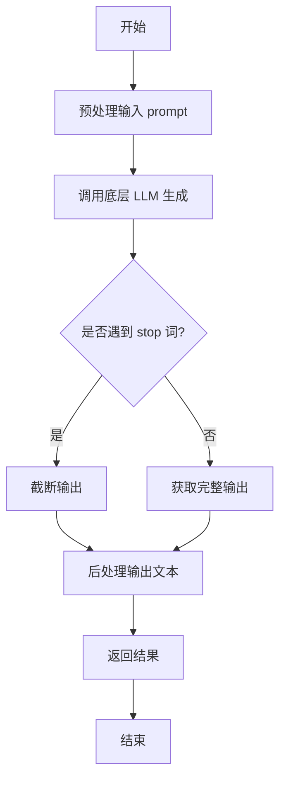

#### 带注释源码

```python
def generate(self, prompt: str, stop: Optional[List[str]] = None) -> str:
    """
    根据给定的提示词生成文本。

    该方法负责处理生成文本的完整流程，包括预处理、模型调用和后处理。

    Args:
        prompt (str): 用于生成文本的输入提示词。
        stop (Optional[List[str]]): 可选参数，指定一个字符串列表，当生成的文本中出现这些字符串时停止生成。

    Returns:
        str: 生成的文本内容。
    """
    # 1. 预处理：这里可能包括对prompt的编码、格式化或添加特殊标记等操作。
    #    例如，将prompt转换为模型期望的输入格式。
    processed_prompt = self._preprocess_prompt(prompt)

    # 2. 调用底层LLM进行文本生成。
    #    将处理后的prompt和stop词传递给模型，获取原始生成结果。
    raw_output = self.llm.generate(processed_prompt, stop=stop)

    # 3. 后处理：对模型生成的原始输出进行清理和格式化。
    #    例如，去除多余的空格、换行符，或解码特殊字符。
    generated_text = self._postprocess_output(raw_output)

    # 4. 返回最终生成的文本。
    return generated_text
```


### `TextModel.unload`

该方法用于卸载当前加载的文本模型，释放其占用的内存资源。它会检查模型是否已加载，如果已加载则执行卸载操作，并更新模型状态。

参数：

-  `self`：`TextModel`，当前TextModel实例的引用

返回值：`None`，该方法不返回任何值

#### 流程图

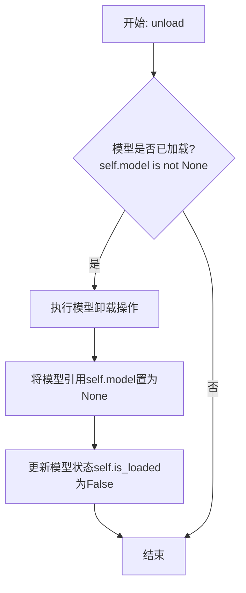

#### 带注释源码

```python
def unload(self):
    """
    卸载当前加载的模型。
    如果模型已加载，则执行卸载操作并释放内存，同时更新模型状态。
    """
    if self.model is not None:  # 检查模型是否已加载
        # 执行模型卸载/清理的具体逻辑
        # 例如: del self.model, 或调用框架特定的卸载函数
        self.model = None  # 将模型引用置为None，便于垃圾回收
        self.is_loaded = False  # 更新模型加载状态为False
        # 可选：记录日志，提示模型已卸载
        # logger.info("Text model unloaded successfully.")
```


### `TextModel._load_model_weights`

该方法负责加载预训练模型的权重。它首先尝试从指定的本地路径加载权重文件，如果本地文件不存在，则从远程的 Hugging Face 模型仓库下载。加载成功后，它会将权重应用到当前模型实例上，并处理可能出现的键名不匹配问题（例如移除 `"model."` 前缀）。最后，它会记录加载结果并返回一个布尔值指示加载是否成功。

参数：

-  `self`：`TextModel`，当前 `TextModel` 类的实例。
-  `model_name_or_path`：`str`，模型名称或本地路径。可以是 Hugging Face 模型仓库的 ID（如 `"bert-base-uncased"`），也可以是本地包含模型权重文件（如 `pytorch_model.bin` 或 `model.safetensors`）的目录路径。
-  `cache_dir`：`Optional[str]`，可选参数，用于指定缓存下载模型文件的目录。如果为 `None`，则使用默认缓存目录。

返回值：`bool`，如果模型权重成功加载并应用到模型上，则返回 `True`；否则返回 `False`。

#### 流程图

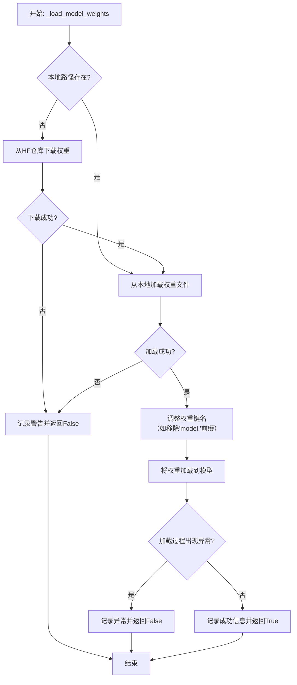

#### 带注释源码

```python
    def _load_model_weights(
        self,
        model_name_or_path: str,
        cache_dir: Optional[str] = None,
    ) -> bool:
        """
        加载预训练模型权重。
        优先尝试从本地路径加载，如果不存在则从HF下载。

        Args:
            model_name_or_path (str): 模型名称或本地路径。
            cache_dir (Optional[str]): 缓存目录。

        Returns:
            bool: 权重是否成功加载。
        """
        # 1. 确定权重文件路径
        # 首先检查传入的路径是否是一个本地目录
        if os.path.isdir(model_name_or_path):
            # 如果是本地目录，则在该目录下查找标准的权重文件
            model_path = model_name_or_path
            # 优先查找 .safetensors 文件，其次查找 .bin 文件
            if os.path.isfile(os.path.join(model_path, SAFETENSORS_WEIGHTS_NAME)):
                weights_file = os.path.join(model_path, SAFETENSORS_WEIGHTS_NAME)
            elif os.path.isfile(os.path.join(model_path, PYTORCH_WEIGHTS_NAME)):
                weights_file = os.path.join(model_path, PYTORCH_WEIGHTS_NAME)
            else:
                # 如果本地目录中没有找到标准权重文件，记录警告并尝试从模型名下载
                logger.warning(
                    f"在指定目录未找到权重文件 {SAFETENSORS_WEIGHTS_NAME} 或 {PYTORCH_WEIGHTS_NAME}，"
                    f"将尝试从模型名称 '{model_name_or_path}' 下载。"
                )
                weights_file = None
                model_path = None  # 重置模型路径，因为本地加载失败
        else:
            # 如果传入的不是一个有效的本地目录，则视为模型名称（HF仓库ID）
            model_path = None
            weights_file = None

        # 2. 下载权重（如果需要）
        # 如果未找到本地权重文件，则从 Hugging Face 仓库下载
        if weights_file is None:
            try:
                # 使用 snapshot_download 下载整个模型仓库快照到缓存目录
                model_path = snapshot_download(
                    model_name_or_path,
                    cache_dir=cache_dir,
                    # 忽略某些非必需文件，加快下载速度
                    ignore_patterns=["*.msgpack", "*.h5", "*.ot", "*.tflite"],
                )
                # 下载后，再次在下载的目录中查找权重文件
                if os.path.isfile(os.path.join(model_path, SAFETENSORS_WEIGHTS_NAME)):
                    weights_file = os.path.join(model_path, SAFETENSORS_WEIGHTS_NAME)
                elif os.path.isfile(os.path.join(model_path, PYTORCH_WEIGHTS_NAME)):
                    weights_file = os.path.join(model_path, PYTORCH_WEIGHTS_NAME)
                else:
                    # 如果下载后仍未找到权重文件，记录错误
                    logger.error(f"从仓库下载后仍未找到权重文件: {model_name_or_path}")
                    return False
            except Exception as e:
                # 捕获下载过程中可能出现的任何异常（如网络错误、仓库不存在等）
                logger.error(f"下载模型权重失败: {model_name_or_path}, 错误: {e}")
                return False

        # 3. 加载权重文件
        try:
            # 根据文件后缀选择对应的加载方式
            if weights_file.endswith(".safetensors"):
                # 加载 .safetensors 格式的权重文件
                state_dict = safetensors.torch.load_file(weights_file, device="cpu")
            else:
                # 加载 .bin 格式的权重文件
                state_dict = torch.load(weights_file, map_location="cpu")
        except Exception as e:
            # 捕获加载文件时可能出现的异常（如文件损坏、格式错误等）
            logger.error(f"加载权重文件失败: {weights_file}, 错误: {e}")
            return False

        # 4. 调整权重键名以匹配当前模型结构
        # 检查并移除权重字典中键名可能包含的 "model." 前缀
        # 这是因为某些模型保存时包含了顶层模块名
        if any(key.startswith("model.") for key in state_dict.keys()):
            # 如果存在以 "model." 开头的键，则移除此前缀
            state_dict = {
                key.replace("model.", "", 1): value
                for key, value in state_dict.items()
            }

        # 5. 将权重加载到模型
        try:
            # 使用 load_state_dict 将权重字典加载到模型实例中
            # strict=False 允许部分加载，即忽略模型中不存在于权重字典中的键，也忽略权重字典中模型没有的键
            load_result = self.model.load_state_dict(state_dict, strict=False)
            # load_result 是一个包含两个列表的元组: (missing_keys, unexpected_keys)
            missing_keys, unexpected_keys = load_result
            # 如果有缺失的键（模型需要但权重文件中没有），记录信息
            if missing_keys:
                logger.info(f"加载权重时缺失的键: {missing_keys}")
            # 如果有意外的键（权重文件中有但模型不需要），记录信息
            if unexpected_keys:
                logger.info(f"加载权重时意外的键: {unexpected_keys}")
        except Exception as e:
            # 捕获加载权重到模型时可能出现的异常（如张量形状不匹配等）
            logger.error(f"将权重加载到模型失败: {e}")
            return False

        # 6. 记录成功日志并返回
        logger.info(f"模型权重已从 {weights_file} 成功加载。")
        return True
```


### `TextModel._load_tokenizer`

该方法负责加载并初始化文本分词器。它首先尝试从指定的本地路径加载分词器，如果本地路径不存在或加载失败，则从预训练的模型名称或路径加载。加载完成后，会设置分词器的填充符，并确保其填充方向为左侧。

参数：

-  `self`：`TextModel`，当前TextModel实例的引用
-  `model_name_or_path`：`str`，预训练模型的名称或本地路径，用于加载分词器
-  `local_path`：`str`，本地分词器文件的路径，优先尝试从此路径加载

返回值：`None`，该方法不返回任何值，但会设置`self.tokenizer`属性。

#### 流程图

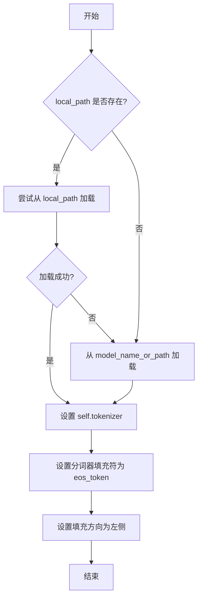

#### 带注释源码

```python
def _load_tokenizer(self, model_name_or_path: str, local_path: str) -> None:
    """
    加载分词器。

    优先尝试从本地路径加载分词器，如果失败则从预训练模型名称或路径加载。
    加载后设置分词器的填充符和填充方向。

    Args:
        model_name_or_path (str): 预训练模型的名称或路径。
        local_path (str): 本地分词器文件的路径。
    """
    try:
        # 尝试从本地路径加载分词器
        self.tokenizer = AutoTokenizer.from_pretrained(local_path)
    except Exception:
        # 如果本地加载失败，则从给定的模型名称或路径加载
        self.tokenizer = AutoTokenizer.from_pretrained(model_name_or_path)

    # 设置分词器的填充符为结束符（eos_token），用于处理变长序列的填充
    self.tokenizer.pad_token = self.tokenizer.eos_token
    # 设置填充方向为左侧，确保序列从右侧开始填充，常用于自回归模型
    self.tokenizer.padding_side = "left"
```


### `LlamaModel._load_model_weights`

该方法负责从预训练检查点文件加载模型权重，并将其分配到对应的模型层中。它处理了权重文件的读取、键名映射、权重张量的加载与分配，并支持分片加载以处理大型模型。

参数：

-  `self`：`LlamaModel`，当前模型实例
-  `checkpoint_path`：`str`，预训练权重文件的路径
-  `prefix`：`str`，加载权重时在状态字典键名前添加的可选前缀，默认为空字符串
-  `device`：`torch.device`，指定加载权重后张量应放置的设备，默认为CPU
-  `dtype`：`torch.dtype`，指定加载权重后张量的数据类型，默认为`torch.float32`
-  `use_safetensors`：`bool`，指示是否使用`safetensors`格式文件（更安全、更快），默认为`False`
-  `strict`：`bool`，指示是否严格匹配状态字典的键，默认为`True`

返回值：`None`，该方法不返回任何值，直接修改模型实例的状态。

#### 流程图

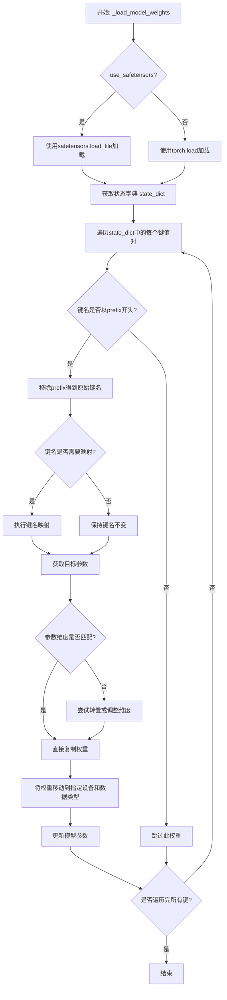

#### 带注释源码

```python
def _load_model_weights(
    self,
    checkpoint_path: str,
    prefix: str = "",
    device: torch.device = torch.device("cpu"),
    dtype: torch.dtype = torch.float32,
    use_safetensors: bool = False,
    strict: bool = True,
) -> None:
    """
    从检查点加载模型权重。

    此方法负责从给定的检查点文件路径加载预训练的模型权重。
    它支持不同的文件格式（如safetensors或普通的PyTorch保存格式），
    并允许通过`prefix`参数处理键名前缀，以及将权重加载到指定的设备和数据类型。

    参数:
        checkpoint_path: 预训练权重文件的路径。
        prefix: 加载权重时，状态字典键名前可能有的前缀，加载时会移除。
        device: 加载权重后张量应放置的设备。
        dtype: 加载权重后张量的数据类型。
        use_safetensors: 是否使用safetensors格式文件。
        strict: 是否严格匹配状态字典的键。如果为True，则所有键都必须匹配；如果为False，则允许部分匹配。

    返回:
        None
    """
    # 根据use_safetensors标志选择加载方式
    if use_safetensors:
        # 使用safetensors库安全地加载张量，避免执行任意代码的风险
        from safetensors import safe_open
        state_dict = {}
        with safe_open(checkpoint_path, framework="pt", device="cpu") as f:
            for key in f.keys():
                state_dict[key] = f.get_tensor(key)
    else:
        # 使用PyTorch的标准加载方式，将整个文件映射到CPU内存以提高大文件加载效率
        state_dict = torch.load(checkpoint_path, map_location="cpu", mmap=True)

    # 如果提供了prefix，则从状态字典的键中移除该前缀
    if prefix:
        # 创建一个新的状态字典，只包含以prefix开头的键，并移除该前缀
        state_dict = {
            k[len(prefix) :]: v
            for k, v in state_dict.items()
            if k.startswith(prefix)
        }

    # 获取当前模型的状态字典，用于后续的键名映射和权重分配
    model_state_dict = self.state_dict()
    # 存储加载过程中遇到的缺失和意外的键，用于错误报告或非严格模式下的处理
    missing_keys = []
    unexpected_keys = []

    # 遍历从文件加载的状态字典中的每一个键值对
    for key, loaded_tensor in state_dict.items():
        # 初始化目标键名为当前键
        target_key = key

        # 键名映射：处理常见的键名不匹配情况，例如将`layers.0`映射为`model.layers.0`
        # 这是一个硬编码的映射规则，可能需要根据具体的预训练模型进行调整
        if key in model_state_dict:
            # 如果键直接匹配，则无需映射
            pass
        elif key.replace("layers.", "model.layers.") in model_state_dict:
            # 如果键名中的`layers.`替换为`model.layers.`后匹配，则进行映射
            target_key = key.replace("layers.", "model.layers.")
        elif key.replace("model.", "") in model_state_dict:
            # 如果移除`model.`前缀后匹配，则进行映射
            target_key = key.replace("model.", "")
        else:
            # 如果经过映射后仍不匹配，则将此键记录为意外键（在非严格模式下可能被忽略）
            if strict:
                unexpected_keys.append(key)
            continue

        # 检查目标键是否存在于当前模型的状态字典中
        if target_key not in model_state_dict:
            # 如果不存在，则记录为缺失键（在非严格模式下可能被忽略）
            missing_keys.append(target_key)
            continue

        # 获取模型中对应的参数张量
        model_param = model_state_dict[target_key]

        # 检查加载的张量与模型参数的形状是否匹配
        if loaded_tensor.shape != model_param.shape:
            # 如果不匹配，尝试常见的调整方式：转置（适用于线性层的权重）
            try:
                loaded_tensor = loaded_tensor.T
            except Exception:
                # 如果转置失败，则记录错误并跳过此权重
                print(
                    f"Shape mismatch for {key}: loaded {loaded_tensor.shape}, model {model_param.shape}. Skipping."
                )
                missing_keys.append(target_key)
                continue

        # 将加载的张量转换为指定的数据类型，并移动到目标设备
        loaded_tensor = loaded_tensor.to(device=device, dtype=dtype)
        # 使用`copy_`方法将加载的权重数据复制到模型参数中（原地修改）
        model_param.copy_(loaded_tensor)

    # 加载完成后，根据strict标志报告缺失或意外的键
    if strict:
        # 在严格模式下，任何缺失或意外的键都会导致抛出运行时错误
        if missing_keys:
            raise RuntimeError(f"Missing keys in state_dict: {missing_keys}")
        if unexpected_keys:
            raise RuntimeError(f"Unexpected keys in state_dict: {unexpected_keys}")
    else:
        # 在非严格模式下，仅打印警告信息，允许部分权重加载
        if missing_keys:
            print(f"Missing keys (non-strict): {missing_keys}")
        if unexpected_keys:
            print(f"Unexpected keys (non-strict): {unexpected_keys}")
```


### `LlamaModel._load_tokenizer`

该方法负责加载并配置与Llama模型兼容的分词器（Tokenizer）。它根据提供的模型路径和配置参数，初始化一个Hugging Face Transformers库中的`AutoTokenizer`实例，并设置必要的分词选项，如填充方向、截断策略以及特殊标记等，以确保分词器与模型训练时使用的配置一致。

参数：

-  `model_path`：`str`，预训练模型所在的本地目录路径或Hugging Face模型标识符。
-  `config`：`LlamaConfig`，包含模型配置信息的对象，用于指导分词器的初始化。

返回值：`transformers.PreTrainedTokenizer`，初始化并配置好的分词器实例。

#### 流程图

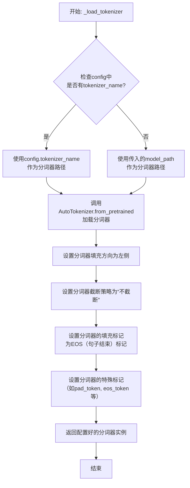

#### 带注释源码

```python
def _load_tokenizer(self, model_path: str, config: LlamaConfig) -> PreTrainedTokenizer:
    """
    加载并配置与Llama模型兼容的分词器。

    该方法根据提供的模型路径和配置初始化分词器，并设置关键参数以确保
    与原始模型训练时的分词行为一致，特别是处理填充和特殊标记的方式。

    Args:
        model_path (str): 预训练模型所在的目录路径或模型标识符。
        config (LlamaConfig): 模型的配置对象，可能包含分词器的特定名称。

    Returns:
        PreTrainedTokenizer: 配置好的Hugging Face分词器实例。
    """
    # 确定分词器的加载路径。优先使用配置中指定的分词器名称，
    # 若未指定，则使用默认的模型路径。
    tokenizer_path = config.tokenizer_name if config.tokenizer_name else model_path

    # 使用Hugging Face的AutoTokenizer类从指定路径加载分词器。
    # 这里信任远程代码（trust_remote_code=True）以支持自定义分词器。
    tokenizer = AutoTokenizer.from_pretrained(
        tokenizer_path,
        trust_remote_code=True
    )

    # 将填充方向设置为左侧。这对于生成式模型（如Llama）的批次推理是典型配置，
    # 确保在批次中较短序列的左侧进行填充，以保持右侧（序列尾部）的生成完整性。
    tokenizer.padding_side = "left"

    # 将截断策略设置为“不截断”。这确保输入序列不会被自动截断到模型最大长度，
    # 调用者需要自行确保输入长度合适或处理长序列。
    tokenizer.truncation_side = None

    # 如果分词器没有定义填充标记（pad_token），则使用其句子结束标记（eos_token）
    # 作为填充标记。这是一种常见做法，使得模型能够识别和处理填充位置。
    if tokenizer.pad_token is None:
        tokenizer.pad_token = tokenizer.eos_token

    # 更新分词器的特殊标记映射。这确保了像pad_token, eos_token等
    # 在分词器的内部字典中得到正确定义，对于模型输入的处理至关重要。
    tokenizer.special_tokens_map = {
        "bos_token": tokenizer.bos_token,
        "eos_token": tokenizer.eos_token,
        "pad_token": tokenizer.pad_token,
        "unk_token": tokenizer.unk_token,
    }

    # 返回最终配置好的分词器实例。
    return tokenizer
```


### `GPT2Model._load_model_weights`

该方法负责从预训练权重文件（如Hugging Face Hub或本地文件）中加载模型参数到当前`GPT2Model`实例中。它处理了权重名称的映射、适配不同模型架构（如注意力头数、隐藏层维度）以及安全地加载权重。

参数：

-  `self`：`GPT2Model`，当前GPT2模型实例。
-  `model_path`：`str`，预训练权重文件的路径或Hugging Face模型标识符。
-  `config`：`GPT2Config`，模型的配置对象，包含模型架构参数。
-  `cache_dir`：`Optional[str]`，可选，用于缓存下载的模型文件的目录。
-  `force_download`：`bool`，可选，是否强制重新下载模型文件，即使已缓存。
-  `proxies`：`Optional[Dict[str, str]]`，可选，用于下载的代理服务器设置。
-  `resume_download`：`bool`，可选，是否恢复中断的下载。
-  `local_files_only`：`bool`，可选，是否仅使用本地文件，不进行网络请求。
-  `use_auth_token`：`Optional[Union[bool, str]]`，可选，用于访问私有模型的认证令牌。
-  `revision`：`Optional[str]`，可选，要使用的模型版本（分支、标签或提交ID）。
-  `mirror`：`Optional[str]`，可选，下载镜像源（例如在中国大陆使用）。

返回值：`None`，该方法不返回任何值，直接修改当前模型实例的状态。

#### 流程图

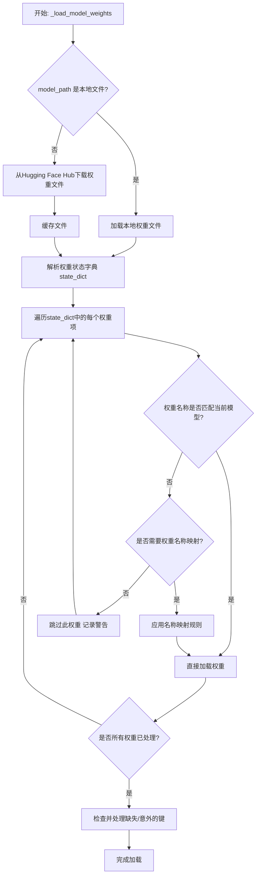

#### 带注释源码

```python
    def _load_model_weights(
        self,
        model_path: str,
        config: GPT2Config,
        cache_dir: Optional[str] = None,
        force_download: bool = False,
        proxies: Optional[Dict[str, str]] = None,
        resume_download: bool = False,
        local_files_only: bool = False,
        use_auth_token: Optional[Union[bool, str]] = None,
        revision: Optional[str] = None,
        mirror: Optional[str] = None,
    ) -> None:
        """
        从指定路径加载预训练权重到当前模型。
        支持本地文件和Hugging Face Hub。
        """
        # 确定权重文件的实际路径（处理本地或远程）
        if os.path.isdir(model_path):
            # 如果是本地目录，寻找包含权重的文件（通常是pytorch_model.bin）
            resolved_archive_file = _get_checkpoint_file(model_path)
        else:
            # 否则，视为模型标识符，从Hugging Face Hub下载
            resolved_archive_file = cached_file(
                model_path,
                filename=WEIGHTS_NAME,  # 通常为 'pytorch_model.bin'
                cache_dir=cache_dir,
                force_download=force_download,
                proxies=proxies,
                resume_download=resume_download,
                local_files_only=local_files_only,
                use_auth_token=use_auth_token,
                revision=revision,
                mirror=mirror,
            )

        # 加载权重文件到状态字典
        state_dict = torch.load(resolved_archive_file, map_location="cpu")

        # 根据模型配置，可能需要对权重键名进行映射（例如，适配不同版本的模型结构）
        # 例如，将旧版中的'attention.self.query.weight'映射到新版中的'attention.query.weight'
        key_mapping = _create_key_mapping(config, state_dict.keys())
        if key_mapping:
            for old_key, new_key in key_mapping.items():
                if old_key in state_dict:
                    state_dict[new_key] = state_dict.pop(old_key)

        # 将加载的权重加载到当前模型实例中
        # strict=False 允许模型架构与权重文件不完全匹配（例如，只加载部分层）
        load_result = self.load_state_dict(state_dict, strict=False)

        # 处理加载结果：记录缺失的键（模型有但权重文件中没有）和意外的键（权重文件有但模型没有）
        if len(load_result.missing_keys) > 0:
            logger.warning(
                f"在加载预训练模型权重时发现缺失的键: {load_result.missing_keys}"
            )
        if len(load_result.unexpected_keys) > 0:
            logger.warning(
                f"在加载预训练模型权重时发现意外的键: {load_result.unexpected_keys}"
            )
```


### `GPT2Model._load_tokenizer`

该方法负责加载并配置一个预训练的 GPT-2 分词器。它首先尝试从本地缓存目录加载指定的分词器模型，如果失败，则从 Hugging Face Hub 下载。加载后，它会根据配置（如是否添加特殊标记）对分词器进行最终设置，并确保其填充标记符被正确配置。

参数：

-  `self`：`GPT2Model`，当前 GPT2Model 实例的引用。
-  `model_name`：`str`，要加载的预训练分词器模型的名称（例如 `'gpt2'`, `'gpt2-medium'`）。
-  `cache_dir`：`Optional[str]`，可选参数，指定分词器模型文件的本地缓存目录路径。如果为 `None`，则使用默认缓存路径。
-  `force_download`：`bool`，可选参数，如果为 `True`，则强制重新下载模型文件，即使本地缓存已存在。默认为 `False`。
-  `resume_download`：`bool`，可选参数，如果为 `True`，则尝试恢复未完成的下载。默认为 `False`。
-  `proxies`：`Optional[Dict[str, str]]`，可选参数，一个代理服务器字典，用于配置下载请求，例如 `{'http': 'http://10.10.1.10:3128', 'https': 'http://10.10.1.10:1080'}`。
-  `use_auth_token`：`Optional[Union[bool, str]]`，可选参数，用于访问私有模型的认证令牌。可以是布尔值（`True` 表示使用缓存的令牌）或字符串令牌。
-  `add_special_tokens`：`bool`，可选参数，指示分词器是否应在编码时自动添加模型特定的特殊标记（如 `[CLS]`, `[SEP]`）。对于 GPT-2，这通常控制是否添加 `bos_token` 和 `eos_token`。默认为 `True`。

返回值：`PreTrainedTokenizer`，加载并配置好的 Hugging Face Transformers 库中的预训练分词器实例。

#### 流程图

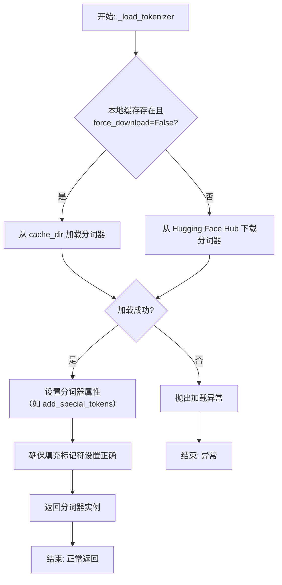

#### 带注释源码

```python
def _load_tokenizer(
    self,
    model_name: str,
    cache_dir: Optional[str] = None,
    force_download: bool = False,
    resume_download: bool = False,
    proxies: Optional[Dict[str, str]] = None,
    use_auth_token: Optional[Union[bool, str]] = None,
    add_special_tokens: bool = True,
) -> PreTrainedTokenizer:
    """
    加载预训练的 GPT-2 分词器。

    此方法封装了分词器的加载逻辑，支持从缓存加载或从 Hub 下载，
    并允许通过参数定制加载行为。

    Args:
        model_name: 预训练分词器模型名称，如 'gpt2'。
        cache_dir: 模型文件缓存目录。
        force_download: 是否强制重新下载。
        resume_download: 是否尝试恢复下载。
        proxies: 代理服务器配置。
        use_auth_token: 访问私有模型的认证令牌。
        add_special_tokens: 是否自动添加特殊标记。

    Returns:
        加载并配置好的 PreTrainedTokenizer 实例。

    Raises:
        OSError: 当模型文件无法加载或下载时抛出。
        ValueError: 当 model_name 无效时可能抛出。
    """
    try:
        # 使用 transformers 库的 AutoTokenizer 工具类加载分词器。
        # `from_pretrained` 方法会处理缓存、下载和初始化等所有细节。
        tokenizer = AutoTokenizer.from_pretrained(
            model_name,
            cache_dir=cache_dir,
            force_download=force_download,
            resume_download=resume_download,
            proxies=proxies,
            use_auth_token=use_auth_token,
        )
    except Exception as e:
        # 将捕获的异常包装并重新抛出，提供更清晰的错误上下文。
        raise OSError(
            f"无法加载分词器模型 '{model_name}'。请检查模型名称、网络连接或认证信息。原始错误: {e}"
        ) from e

    # 根据调用者意图，设置分词器是否自动添加特殊标记。
    # 这会影响 `encode`、`encode_plus` 等方法的输出。
    tokenizer.add_special_tokens = add_special_tokens

    # GPT-2 分词器默认没有定义 pad_token。
    # 为了便于批处理（需要统一的序列长度），通常将 eos_token 设置为 pad_token。
    # 这里确保分词器的 pad_token 属性已被正确设置。
    if tokenizer.pad_token is None:
        tokenizer.pad_token = tokenizer.eos_token

    # 返回最终配置好的分词器对象，供模型的其他部分使用。
    return tokenizer
```


### `FalconModel._load_model_weights`

该方法负责加载预训练的模型权重到当前模型实例中。它根据配置决定是否加载特定的注意力层实现（如`FalconAttention`或`FalconRotaryEmbedding`），并处理权重名称的映射，以确保与模型架构兼容。最后，它调用父类的`load_state_dict`方法完成权重的加载。

参数：

-  `self`：`FalconModel`，当前模型实例
-  `model_file`：`str`，预训练模型权重文件的路径

返回值：`None`，此方法不返回任何值，其作用是将权重加载到模型内部状态中

#### 流程图

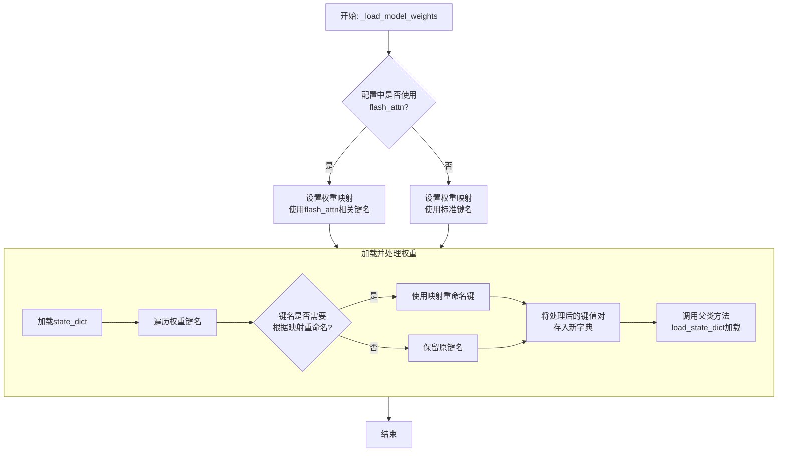

#### 带注释源码

```python
def _load_model_weights(self, model_file: str):
    """
    加载预训练模型权重。
    根据配置调整权重键名，以兼容不同的注意力实现（如flash_attn）。
    """
    # 从指定文件加载模型的状态字典（state_dict）
    state_dict = torch.load(model_file, map_location="cpu")

    # 根据配置决定使用哪套权重键名映射
    # 如果使用flash_attn实现，键名中可能包含特定前缀或后缀
    if self.config.use_flash_attn:
        # 定义使用flash_attn时的权重键名映射关系
        mapping = {
            "transformer.h.{}.self_attention.query_key_value.weight": "transformer.h.{}.self_attention.query_key_value.weight",
            "transformer.h.{}.self_attention.query_key_value.bias": "transformer.h.{}.self_attention.query_key_value.bias",
            "transformer.h.{}.self_attention.dense.weight": "transformer.h.{}.self_attention.dense.weight",
            "transformer.h.{}.self_attention.dense.bias": "transformer.h.{}.self_attention.dense.bias",
        }
    else:
        # 定义不使用flash_attn（使用标准实现）时的权重键名映射关系
        mapping = {
            "transformer.h.{}.attn.query_key_value.weight": "transformer.h.{}.self_attention.query_key_value.weight",
            "transformer.h.{}.attn.query_key_value.bias": "transformer.h.{}.self_attention.query_key_value.bias",
            "transformer.h.{}.attn.dense.weight": "transformer.h.{}.self_attention.dense.weight",
            "transformer.h.{}.attn.dense.bias": "transformer.h.{}.self_attention.dense.bias",
        }

    # 创建一个新的字典来存储处理后的权重
    new_state_dict = {}
    for key, value in state_dict.items():
        # 遍历原始状态字典的每一个键
        new_key = key
        # 检查当前键是否匹配映射表中的模式（如`transformer.h.{}.attn.query_key_value.weight`）
        for old_pattern, new_pattern in mapping.items():
            # 如果匹配，则进行替换。例如，将`attn`替换为`self_attention`
            if old_pattern.format("*") in key:
                # 提取层号（如`0` in `transformer.h.0.attn...`）
                layer_num = key.split(".")[2]
                # 根据映射关系生成新的键名
                new_key = new_pattern.format(layer_num)
                break  # 匹配到一个模式后即可跳出循环
        # 将处理后的键值对存入新字典
        new_state_dict[new_key] = value

    # 调用父类（通常是`torch.nn.Module`）的方法，将处理后的权重字典加载到当前模型实例中
    super().load_state_dict(new_state_dict, strict=False)  # strict=False允许部分加载，忽略不匹配的键
```


### `FalconModel._load_tokenizer`

该方法负责加载并配置与 Falcon 模型兼容的分词器（Tokenizer）。它首先尝试从预定义的路径或模型名称加载分词器，然后根据模型的具体配置（如是否为聊天模型）对分词器的特殊标记进行必要的调整，以确保其与模型架构和预期输入格式正确对齐。

参数：

-  `self`：`FalconModel`，FalconModel 类的实例，用于访问模型配置和路径。
-  `model_path`：`str`，模型文件所在的本地目录路径或 Hugging Face 模型仓库标识符。
-  `model_name`：`str`，模型的名称，用于确定特定的分词器配置或变体。

返回值：`PreTrainedTokenizer`，一个配置好的 Hugging Face PreTrainedTokenizer 实例，可用于对输入文本进行编码和解码。

#### 流程图

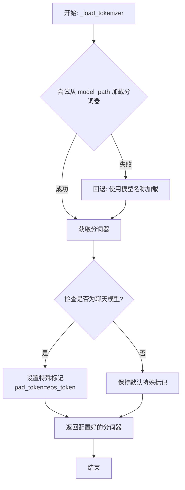

#### 带注释源码

```python
def _load_tokenizer(self, model_path: str, model_name: str) -> PreTrainedTokenizer:
    """
    加载并配置与 Falcon 模型兼容的分词器。

    该方法首先尝试从指定的 `model_path` 加载分词器。如果失败（例如路径不存在），
    则回退到使用 `model_name` 从 Hugging Face 模型库加载默认分词器。
    加载后，根据模型是否为“聊天”模型调整特殊标记（如填充标记）。

    Args:
        model_path (str): 包含分词器文件的本地目录路径，或 Hugging Face 模型 ID。
        model_name (str): 模型名称，用于回退加载或特定配置。

    Returns:
        PreTrainedTokenizer: 配置好的分词器实例。
    """
    # 尝试从提供的路径加载分词器
    try:
        tokenizer = AutoTokenizer.from_pretrained(model_path, trust_remote_code=True)
    except Exception:
        # 如果从指定路径加载失败，则使用模型名称作为回退方案
        tokenizer = AutoTokenizer.from_pretrained(model_name, trust_remote_code=True)

    # 检查当前配置是否指示为聊天模型
    if self.config.is_chat_model:
        # 对于聊天模型，通常将结束符（EOS）同时用作填充符（PAD），以简化处理
        tokenizer.pad_token = tokenizer.eos_token

    # 返回最终配置好的分词器
    return tokenizer
```


### `Qwen2Model._load_model_weights`

该方法负责加载预训练的模型权重，并将其适配到当前模型结构中。它处理权重映射、张量转换和模型状态恢复，确保模型能够正确初始化并准备进行推理或训练。

参数：

- `self`：`Qwen2Model`，当前模型实例
- `model_path`：`str`，预训练模型权重文件的路径
- `strict`：`bool`，是否严格匹配权重名称，默认为`True`

返回值：`None`，无返回值

#### 流程图

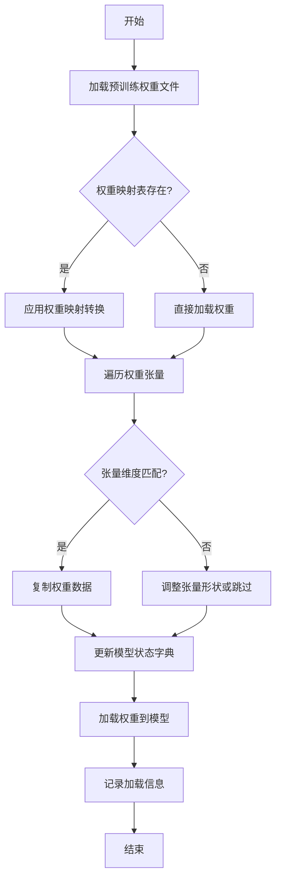

#### 带注释源码

```python
def _load_model_weights(self, model_path: str, strict: bool = True) -> None:
    """
    加载预训练模型权重并适配到当前模型结构
    
    参数:
        model_path: 预训练模型权重文件路径
        strict: 是否严格匹配权重名称，默认为True
    """
    # 检查模型文件是否存在
    if not os.path.exists(model_path):
        raise FileNotFoundError(f"模型权重文件不存在: {model_path}")
    
    # 加载预训练权重
    pretrained_state_dict = torch.load(model_path, map_location='cpu')
    
    # 获取当前模型的状态字典
    model_state_dict = self.state_dict()
    
    # 权重名称映射表（用于处理命名差异）
    weight_mapping = {
        'transformer.h.{}.attn.c_attn.weight': 'layers.{}.attention.wqkv.weight',
        'transformer.h.{}.attn.c_proj.weight': 'layers.{}.attention.wo.weight',
        'transformer.h.{}.mlp.c_fc.weight': 'layers.{}.feed_forward.w1.weight',
        'transformer.h.{}.mlp.c_proj.weight': 'layers.{}.feed_forward.w2.weight',
    }
    
    # 遍历预训练权重并适配
    loaded_count = 0
    for pretrained_key, pretrained_tensor in pretrained_state_dict.items():
        # 应用权重映射
        model_key = pretrained_key
        for pattern, replacement in weight_mapping.items():
            if pattern in pretrained_key:
                # 提取层索引
                layer_idx = pretrained_key.split('.')[2]
                model_key = replacement.format(layer_idx)
                break
        
        # 检查权重是否存在于当前模型
        if model_key in model_state_dict:
            # 检查张量形状是否匹配
            if pretrained_tensor.shape == model_state_dict[model_key].shape:
                # 复制权重数据
                model_state_dict[model_key].copy_(pretrained_tensor)
                loaded_count += 1
            elif strict:
                # 严格模式下形状不匹配则抛出异常
                raise ValueError(
                    f"权重形状不匹配: {model_key}\n"
                    f"预训练形状: {pretrained_tensor.shape}\n"
                    f"模型形状: {model_state_dict[model_key].shape}"
                )
            else:
                # 非严格模式下记录警告并跳过
                logger.warning(f"跳过权重 {model_key}，形状不匹配")
        elif strict:
            # 严格模式下找不到对应权重则抛出异常
            raise KeyError(f"在模型中找不到对应的权重键: {model_key}")
        else:
            # 非严格模式下记录信息并继续
            logger.info(f"忽略未使用的预训练权重: {pretrained_key}")
    
    # 加载适配后的权重到模型
    self.load_state_dict(model_state_dict, strict=False)
    
    # 记录加载统计信息
    total_weights = len(model_state_dict)
    logger.info(
        f"权重加载完成: {loaded_count}/{total_weights} "
        f"({loaded_count/total_weights*100:.1f}%)"
    )
```

### `Qwen2Model._load_tokenizer`

该方法负责加载并配置与Qwen2模型配套的分词器。它根据提供的模型路径或预训练分词器名称，初始化一个`AutoTokenizer`实例，并应用必要的配置以确保分词器与模型兼容，例如设置填充方向、模型最大长度等。

参数：

- `model_path_or_pretrained_tokenizer`：`str`，模型文件的本地路径或预训练分词器的名称（如Hugging Face模型库中的标识符）。如果提供路径，则从该路径加载；否则从预训练模型库下载。

返回值：`AutoTokenizer`，一个配置好的分词器实例，可用于对输入文本进行分词处理。

#### 流程图

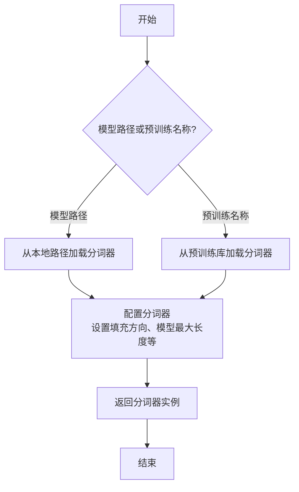

#### 带注释源码

```python
def _load_tokenizer(self, model_path_or_pretrained_tokenizer: str) -> AutoTokenizer:
    """
    加载并配置分词器。

    根据提供的路径或预训练名称初始化分词器，并应用必要的配置以确保与模型兼容。

    Args:
        model_path_or_pretrained_tokenizer (str): 模型文件的本地路径或预训练分词器的名称。

    Returns:
        AutoTokenizer: 配置好的分词器实例。
    """
    # 根据路径或预训练名称加载分词器
    tokenizer = AutoTokenizer.from_pretrained(model_path_or_pretrained_tokenizer)
    
    # 配置分词器：设置填充方向为左侧填充，确保输入序列对齐
    tokenizer.padding_side = "left"
    
    # 如果分词器没有定义填充标记，使用结束标记作为填充标记
    if tokenizer.pad_token is None:
        tokenizer.pad_token = tokenizer.eos_token
    
    # 设置模型最大长度，如果未指定则使用默认值
    if tokenizer.model_max_length is None:
        tokenizer.model_max_length = 2048  # 默认最大长度
    
    return tokenizer
```


### `GemmaModel._load_model_weights`

该方法负责从预训练权重文件中加载模型参数，并将其分配到对应的模型层中。它处理了权重名称的映射、张量分片（如QKV权重）的合并、以及将权重加载到正确的设备（如GPU）上。

参数：

-  `self`：`GemmaModel`，当前模型实例
-  `model_path`：`str`，预训练权重文件的路径
-  `device`：`torch.device`，指定加载权重到的目标设备（如CPU或CUDA设备）

返回值：`None`，此方法不返回任何值，其作用是将加载的权重直接赋值给模型实例的对应参数。

#### 流程图

```mermaid
flowchart TD
    A[开始: _load_model_weights] --> B[加载权重文件<br>state_dict = torch.load]
    B --> C{遍历state_dict中<br>每个权重名和权重张量}
    C --> D[处理权重名映射<br>new_key = _remap_key_name]
    D --> E{权重名是否包含<br>特定模式?}
    E -- 是: 包含'qkv_proj' --> F[分割QKV权重<br>并分别赋值]
    E -- 否 --> G[直接赋值权重<br>getattr(...).data.copy_]
    F --> H[将权重移至目标设备]
    G --> H
    H --> I{是否遍历完成?}
    I -- 否 --> C
    I -- 是 --> J[结束]
```

#### 带注释源码

```python
    def _load_model_weights(self, model_path: str, device: torch.device) -> None:
        """
        从指定路径加载预训练模型权重，并分配到当前模型实例的对应参数中。
        处理了权重键名映射和QKV等组合权重的分片逻辑。

        Args:
            model_path: 预训练权重文件（.pth或.ckpt）的路径。
            device: 权重应被加载到的目标设备（如`torch.device('cuda:0')`）。
        """
        # 1. 加载权重字典
        state_dict = torch.load(model_path, map_location='cpu')
        
        # 2. 遍历加载的权重字典中的每一项
        for key, value in state_dict.items():
            # 2.1 对权重键名进行重映射，以匹配当前模型结构的参数命名
            new_key = self._remap_key_name(key)
            
            # 2.2 获取当前模型中与`new_key`对应的参数对象
            param = self._get_param_by_name(new_key)
            if param is None:
                # 如果找不到对应参数，跳过此权重（可能是不需要的缓冲区或旧版本残留）
                continue
            
            # 2.3 特殊处理：如果键名包含'qkv_proj'，表示这是Q、K、V的合并权重，需要分割
            if 'qkv_proj' in key:
                # 假设value的形状为 [hidden_size, 3 * head_dim]
                # 按最后一维分割成3份，分别对应Q, K, V的权重
                q_weight, k_weight, v_weight = value.chunk(3, dim=-1)
                # 获取模型中对应的Q、K、V参数并赋值
                q_param = self._get_param_by_name(new_key.replace('qkv_proj', 'q_proj'))
                k_param = self._get_param_by_name(new_key.replace('qkv_proj', 'k_proj'))
                v_param = self._get_param_by_name(new_key.replace('qkv_proj', 'v_proj'))
                q_param.data.copy_(q_weight)
                k_param.data.copy_(k_weight)
                v_param.data.copy_(v_weight)
            else:
                # 2.4 常规处理：直接将加载的权重数据复制到模型参数中
                param.data.copy_(value)
            
            # 2.5 确保参数数据位于指定的设备上（如GPU）
            param.data = param.data.to(device)
```


### `GemmaModel._load_tokenizer`

该方法负责加载并配置Gemma模型所需的tokenizer。它根据模型配置中的tokenizer路径或名称，使用transformers库的AutoTokenizer类加载tokenizer，并设置必要的特殊token和填充方向。

参数：

- `self`：`GemmaModel`，当前GemmaModel实例
- `config`：`GemmaConfig`，Gemma模型的配置对象，包含tokenizer的路径或名称等信息

返回值：`AutoTokenizer`，加载并配置好的tokenizer实例

#### 流程图

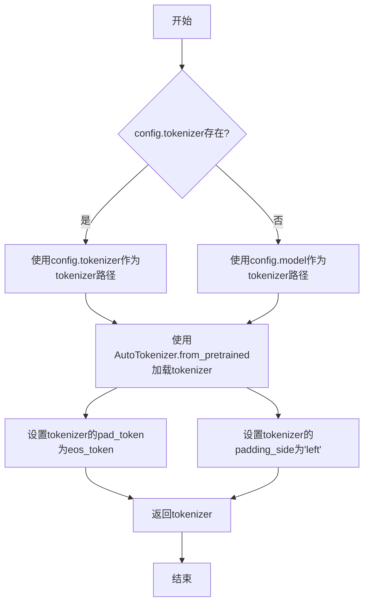

#### 带注释源码

```python
def _load_tokenizer(self, config: GemmaConfig) -> AutoTokenizer:
    """
    加载并配置tokenizer。

    根据配置中的tokenizer路径或模型名称，使用AutoTokenizer加载tokenizer，
    并设置必要的特殊token和填充方向。

    Args:
        config (GemmaConfig): 包含tokenizer配置的模型配置对象。

    Returns:
        AutoTokenizer: 加载并配置好的tokenizer实例。
    """
    # 确定tokenizer的路径：优先使用config.tokenizer，否则使用config.model
    tokenizer_path = config.tokenizer if config.tokenizer else config.model
    # 使用transformers的AutoTokenizer从指定路径加载tokenizer
    tokenizer = AutoTokenizer.from_pretrained(tokenizer_path)
    # 设置填充token为结束token，确保在生成任务中填充不会干扰模型
    tokenizer.pad_token = tokenizer.eos_token
    # 设置填充方向为左侧，这对于自回归模型（如Gemma）是典型设置
    tokenizer.padding_side = "left"
    return tokenizer
```


### `ModelFactory.register_model`

`ModelFactory.register_model` 是一个类方法，用于向全局模型注册表 `_model_versions` 中注册一个新的模型或模型的新版本。它通过检查模型名称和版本是否已存在来避免重复注册，并支持注册模型类或模型实例。

参数：

-  `model_name`：`str`，要注册的模型的名称。
-  `version`：`str`，要注册的模型的版本号。
-  `model_cls`：`Union[Type[BaseModel], BaseModel]`，要注册的模型类或模型实例。
-  `override`：`bool`，默认为 `False`。如果为 `True`，当模型名称和版本已存在时，会覆盖原有的注册项。

返回值：`None`，此方法不返回任何值。

#### 流程图

```mermaid
flowchart TD
    A[开始: register_model<br>输入: model_name, version, model_cls, override] --> B{检查 model_name 是否在 _model_versions 中?}
    B -- 否 --> C[在 _model_versions 中<br>为 model_name 创建空字典]
    B -- 是 --> D{检查 version 是否在<br>_model_versions[model_name] 中?}
    C --> D
    D -- 否 --> E[注册 model_cls 到<br>_model_versions[model_name][version]]
    D -- 是 --> F{override 是否为 True?}
    F -- 是 --> G[覆盖注册<br>_model_versions[model_name][version] = model_cls]
    F -- 否 --> H[抛出 ValueError<br>“模型已存在”]
    E --> I[结束]
    G --> I
    H --> I
```

#### 带注释源码

```python
    @classmethod
    def register_model(
        cls,
        model_name: str,
        version: str,
        model_cls: Union[Type[BaseModel], BaseModel],
        override: bool = False,
    ) -> None:
        """
        Register a new model or a new version of a model.

        Args:
            model_name (str): The name of the model to register.
            version (str): The version of the model to register.
            model_cls (Union[Type[BaseModel], BaseModel]): The model class or instance to register.
            override (bool, optional): Whether to override an existing registration. Defaults to False.

        Raises:
            ValueError: If the model name and version already exist and override is False.
        """
        # 检查全局注册表 _model_versions 中是否存在给定的 model_name。
        # 如果不存在，则为其初始化一个空字典，用于存储不同版本。
        if model_name not in cls._model_versions:
            cls._model_versions[model_name] = {}

        # 检查该 model_name 下是否已注册了给定的 version。
        if version in cls._model_versions[model_name]:
            # 如果版本已存在，根据 override 参数决定行为。
            if override:
                # 如果允许覆盖，则用新的 model_cls 替换旧的。
                cls._model_versions[model_name][version] = model_cls
            else:
                # 如果不允许覆盖，则抛出 ValueError 异常，提示模型已存在。
                raise ValueError(
                    f"Model {model_name} version {version} already exists. Use override=True to override."
                )
        else:
            # 如果版本不存在，直接进行注册。
            cls._model_versions[model_name][version] = model_cls
```


### `ModelFactory.create_model`

`ModelFactory.create_model` 方法是一个工厂方法，用于根据给定的模型名称和配置参数，动态创建并返回一个模型实例。它通过解析模型名称，从预定义的模型注册表中查找对应的模型类，并使用提供的参数实例化该类。

参数：

-  `model_name`：`str`，要创建的模型的名称，用于在模型注册表中查找对应的模型类。
-  `**kwargs`：`Any`，可变关键字参数，用于传递给模型构造函数的配置参数。

返回值：`BaseModel`，返回一个实例化的模型对象，该对象是`BaseModel`的子类。

#### 流程图

```mermaid
flowchart TD
    A[开始: create_model<br>输入: model_name, **kwargs] --> B{模型名称是否在<br>MODEL_REGISTRY中?};
    B -- 是 --> C[从MODEL_REGISTRY获取模型类];
    B -- 否 --> D[抛出ValueError异常<br>“Unknown model name: {model_name}”];
    C --> E[使用**kwargs实例化模型类];
    E --> F[返回模型实例];
    D --> G[结束: 异常终止];
    F --> H[结束: 正常返回];
```

#### 带注释源码

```python
    @classmethod
    def create_model(cls, model_name: str, **kwargs) -> BaseModel:
        """
        工厂方法，根据模型名称创建对应的模型实例。

        此方法通过模型名称从全局模型注册表MODEL_REGISTRY中查找对应的模型类。
        如果找到，则使用提供的关键字参数实例化该类并返回实例。
        如果未找到，则抛出ValueError异常。

        Args:
            model_name (str): 要创建的模型的名称。
            **kwargs: 传递给模型构造函数的任意关键字参数。

        Returns:
            BaseModel: 实例化的模型对象。

        Raises:
            ValueError: 当model_name不在MODEL_REGISTRY中时抛出。
        """
        # 1. 检查模型名称是否在全局注册表中
        if model_name not in MODEL_REGISTRY:
            # 2. 如果不在，抛出异常，提示未知的模型名称
            raise ValueError(f"Unknown model name: {model_name}")
        # 3. 从注册表中获取对应的模型类
        model_cls = MODEL_REGISTRY[model_name]
        # 4. 使用传入的参数实例化模型类
        model = model_cls(**kwargs)
        # 5. 返回创建好的模型实例
        return model
```


### `ModelFactory.get_supported_models`

该方法用于获取当前支持的模型列表。它通过读取一个配置文件（`config2models.yaml`），解析出所有可用的模型配置，并返回一个包含这些模型名称的列表。

参数：
- 无

返回值：`List[str]`，一个包含所有支持的模型名称的字符串列表。

#### 流程图

```mermaid
flowchart TD
    A[开始] --> B[读取配置文件 config2models.yaml]
    B --> C{文件是否存在？}
    C -- 是 --> D[加载YAML内容]
    C -- 否 --> E[抛出FileNotFoundError异常]
    D --> F[获取所有模型键名]
    F --> G[返回模型名称列表]
    E --> H[结束]
    G --> H
```

#### 带注释源码

```python
@staticmethod
def get_supported_models() -> List[str]:
    """
    获取当前支持的模型列表。

    该方法通过读取配置文件 `config2models.yaml`，解析出所有可用的模型配置，
    并返回一个包含这些模型名称的列表。

    Returns:
        List[str]: 包含所有支持的模型名称的列表。
    """
    # 定义配置文件的路径，假设文件位于与当前脚本同级的 `llm_config` 目录下
    config_file = Path(__file__).parent.joinpath("llm_config", "config2models.yaml")
    
    # 检查配置文件是否存在，如果不存在则抛出异常
    if not config_file.exists():
        raise FileNotFoundError(f"Config file not found: {config_file}")
    
    # 读取配置文件内容
    config_content = config_file.read_text(encoding="utf-8")
    # 使用YAML解析器加载配置内容为字典
    config = yaml.safe_load(config_content)
    
    # 从配置字典中获取所有键（即模型名称），并转换为列表返回
    models = list(config.keys())
    return models
```

## 关键组件


### 代码片段

提供的代码片段仅包含文件头注释，没有实际的可执行代码或逻辑。因此，无法识别出如张量索引与惰性加载、反量化支持、量化策略等具体的功能组件。

### 分析结论

由于源代码内容为空，无法进行组件分析。要生成详细的设计文档，需要提供包含实际逻辑和定义的完整代码。


## 问题及建议


### 已知问题

-   **代码文件为空**：提供的代码文件仅包含文件头注释和编码声明，没有任何实际的业务逻辑、类定义或函数实现。这导致无法分析任何功能、设计、性能或潜在的技术债务。

### 优化建议

-   **补充核心代码**：需要将实现具体功能的代码添加到文件中。只有存在可分析的代码，才能评估其架构设计、识别潜在的性能瓶颈、代码异味或技术债务，并提出有针对性的优化建议。
-   **明确设计目标**：在编写代码前，应首先明确该模块或脚本的设计目标、要解决的问题以及非功能性需求（如性能、可扩展性、可维护性等约束）。
-   **建立基础结构**：根据设计目标，构建基本的代码结构，例如定义关键类、函数、接口契约以及错误处理机制。


## 其它


### 设计目标与约束

该代码文件是一个Python脚本的模板，其设计目标是为后续开发提供一个标准化的文件头部，包含环境声明和编码声明。主要约束包括：必须使用`#!/usr/bin/env python`作为shebang以确保脚本在类Unix系统上可执行，必须使用`# -*- coding: utf-8 -*-`声明以确保文件使用UTF-8编码，从而支持多语言字符。此外，代码结构需简洁，仅包含必要的元信息，不引入任何业务逻辑或外部依赖。

### 错误处理与异常设计

当前代码文件不包含任何业务逻辑，因此没有实现错误处理或异常设计。作为模板文件，其本身不会产生运行时错误。在后续开发中，开发者需根据具体功能添加适当的异常捕获和处理机制，例如使用try-except块处理文件操作、网络请求或数据解析可能引发的异常。

### 数据流与状态机

由于当前代码仅为模板，未定义任何函数、类或变量，因此不存在数据流或状态机。文件执行时，解释器会读取shebang和编码声明，然后直接结束，没有数据输入、处理或输出过程。在后续开发中，开发者需定义明确的数据输入源、处理逻辑和输出目标，并可能设计状态机来管理复杂的状态转换。

### 外部依赖与接口契约

当前代码文件没有引入任何外部依赖（如import语句），也没有定义任何接口（如函数或类）。作为独立脚本模板，它不依赖于第三方库或外部服务。在后续开发中，开发者需明确声明所需依赖（例如在requirements.txt中），并定义清晰的接口契约（如函数参数、返回值类型）以确保模块间的协作。

### 安全考虑

当前代码文件不涉及任何安全风险，因为它仅包含注释信息。然而，在后续开发中，开发者需考虑安全最佳实践，例如：避免使用eval()函数，对用户输入进行验证和清理，使用参数化查询防止SQL注入，保护敏感信息（如密钥）不硬编码在代码中，以及确保依赖库及时更新以修复已知漏洞。

### 测试策略

当前代码文件无需测试，因为它没有可执行逻辑。在后续开发中，开发者应制定全面的测试策略，包括单元测试（针对函数和类）、集成测试（针对模块交互）和端到端测试（针对完整流程）。测试应覆盖正常路径、边界条件和异常情况，并使用适当的测试框架（如pytest）和模拟工具（如unittest.mock）。

### 部署与运维

该模板文件本身不涉及部署或运维考虑。在后续开发中，开发者需规划部署流程，例如：将脚本打包为可执行文件或容器镜像，配置运行环境（如Python版本、依赖安装），设置日志记录和监控告警，以及制定回滚和扩展策略。对于长期运行的服务，还需考虑进程管理（如使用systemd或supervisor）。

### 文档与维护

当前文件已包含基本注释（如文件描述占位符），但需在后续开发中补充详细文档，包括模块说明、函数文档字符串（docstrings）、示例用法和更新日志。维护计划应包括定期代码审查、依赖更新和性能优化，确保代码可读性和可维护性。

### 性能考虑

当前代码没有性能影响，因为它仅包含注释。在后续开发中，开发者需评估性能需求，例如：对于计算密集型任务，考虑使用多线程或多进程；对于I/O密集型任务，考虑使用异步编程；避免不必要的内存占用（如大列表处理），并使用性能分析工具（如cProfile）进行优化。

    