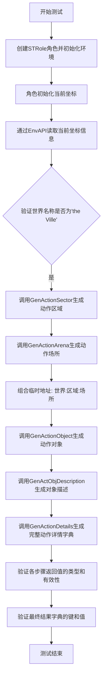
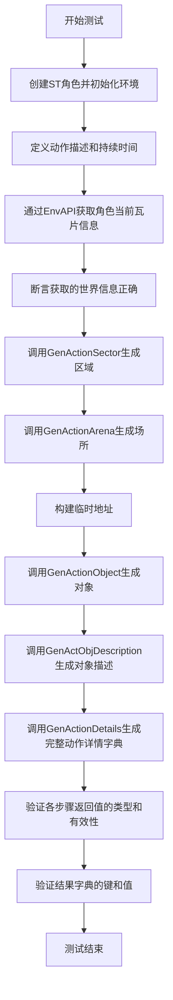
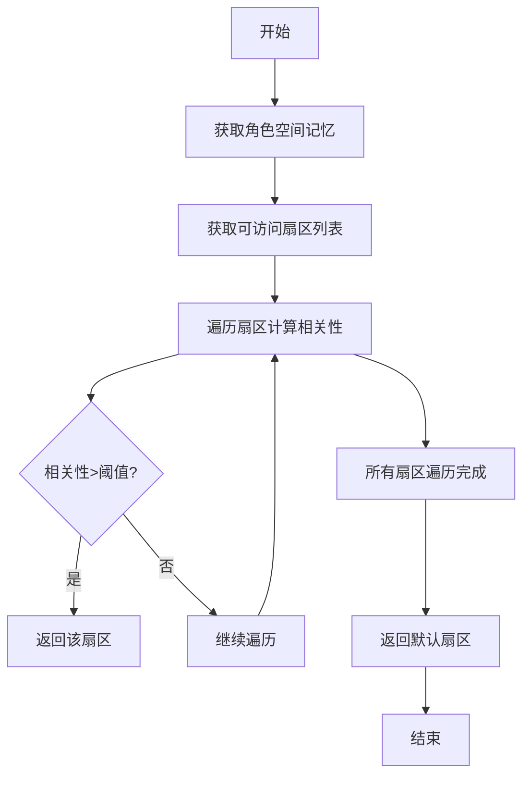
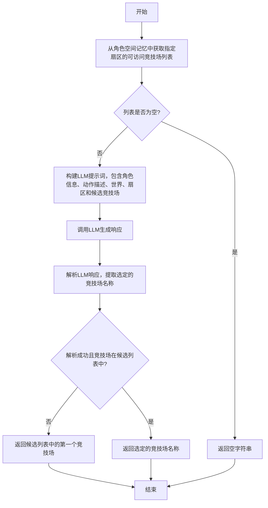
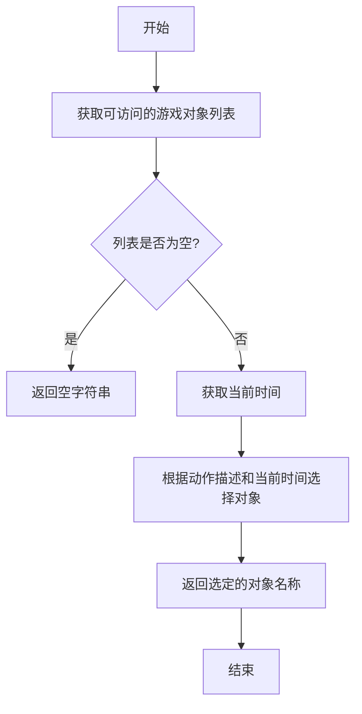
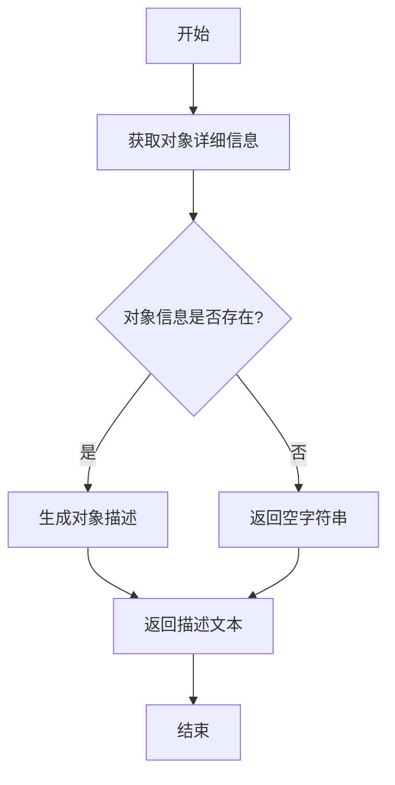
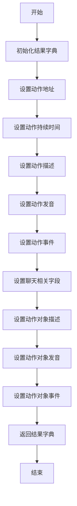
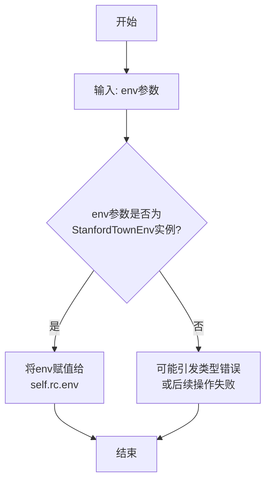
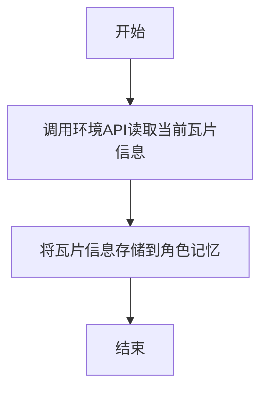

# `.\MetaGPT\tests\metagpt\ext\stanford_town\actions\test_gen_action_details.py` 详细设计文档

该文件是一个单元测试，用于测试斯坦福小镇扩展中生成动作详细信息的完整流程。它模拟了一个角色（Klaus Mueller）在特定时间点执行“睡觉”动作，通过调用一系列动作生成类（GenActionSector, GenActionArena, GenActionObject, GenActObjDescription, GenActionDetails）来逐步构建动作的上下文（如区域、场所、对象）并最终生成包含地址、持续时间、描述等完整信息的动作字典，并对每个步骤的返回结果进行断言验证。

## 整体流程



## 类结构

```
测试文件 (test_gen_action_details.py)
├── 测试函数: test_gen_action_details
├── 被测类 (来自 metagpt.ext.stanford_town.actions.gen_action_details)
│   ├── GenActionSector
│   ├── GenActionArena
│   ├── GenActionObject
│   ├── GenActObjDescription
│   └── GenActionDetails
├── 角色类 (来自 metagpt.ext.stanford_town.roles.st_role)
│   └── STRole
├── 环境类 (来自 metagpt.environment)
│   └── StanfordTownEnv
└── 抽象接口类 (来自 metagpt.environment.api.env_api)
    └── EnvAPIAbstract
```

## 全局变量及字段


### `MAZE_ASSET_PATH`
    
存储迷宫资产文件路径的全局常量，用于初始化StanfordTownEnv环境。

类型：`str`
    


### `STRole.name`
    
角色的名称，用于标识和区分不同的模拟角色。

类型：`str`
    


### `STRole.start_time`
    
角色在模拟世界中的起始时间，用于初始化角色的时间线。

类型：`str`
    


### `STRole.curr_time`
    
角色当前的模拟时间，用于跟踪角色在时间线上的位置。

类型：`str`
    


### `STRole.sim_code`
    
模拟场景的代码标识符，用于关联特定的模拟环境和配置。

类型：`str`
    


### `STRole.env`
    
角色所处的模拟环境实例，提供与环境的交互接口。

类型：`StanfordTownEnv`
    


### `STRole.scratch`
    
角色的临时记忆或状态存储对象，用于记录当前会话的临时信息。

类型：`Scratch`
    


### `STRole.s_mem`
    
角色的空间记忆管理器，用于存储和查询角色在模拟世界中的空间位置和可达区域信息。

类型：`SpatialMemory`
    


### `STRole.rc`
    
角色的上下文管理器，封装了角色执行动作所需的环境访问、记忆查询等核心功能。

类型：`RoleContext`
    


### `StanfordTownEnv.maze_asset_path`
    
迷宫资产文件的路径，环境使用此路径加载构建模拟世界所需的地图数据。

类型：`str`
    


### `EnvAPIAbstract.api_name`
    
环境API的名称，指定要调用的具体环境操作接口。

类型：`str`
    


### `EnvAPIAbstract.kwargs`
    
调用环境API时传递的关键字参数字典，包含执行该API所需的具体参数。

类型：`dict`
    
    

## 全局函数及方法

### `test_gen_action_details`

该函数是一个异步单元测试函数，用于测试斯坦福小镇扩展中生成动作详情（`GenActionDetails`）相关的一系列动作类（`GenActionSector`、`GenActionArena`、`GenActionObject`、`GenActObjDescription`、`GenActionDetails`）的功能。它通过创建一个模拟角色（`STRole`）并设置其环境，然后依次调用这些动作类的方法来生成一个完整动作的各个组成部分（如区域、场所、对象、描述等），最后验证生成的`result_dict`字典是否包含所有预期的键，并且其内容符合预期。

参数：
- 无显式参数。它是一个测试函数，使用`pytest`框架，通过`@pytest.mark.asyncio`装饰器标记为异步测试。

返回值：`None`，该函数不返回任何值，其主要目的是执行断言（`assert`）来验证代码逻辑。

#### 流程图



#### 带注释源码

```python
@pytest.mark.asyncio  # 使用pytest的asyncio标记，表示这是一个异步测试函数
async def test_gen_action_details():
    # 1. 创建一个模拟角色（STRole），并设置其初始属性
    role = STRole(
        name="Klaus Mueller",
        start_time="February 13, 2023",
        curr_time="February 13, 2023, 00:00:00",
        sim_code="base_the_ville_isabella_maria_klaus",
    )
    # 2. 为角色设置环境（StanfordTownEnv），并指定迷宫资源路径
    role.set_env(StanfordTownEnv(maze_asset_path=MAZE_ASSET_PATH))
    # 3. 异步初始化角色的当前瓦片（tile）信息
    await role.init_curr_tile()

    # 4. 定义测试用的动作描述和持续时间
    act_desp = "sleeping"
    act_dura = "120"

    # 5. 通过环境API异步读取角色当前瓦片的详细信息
    access_tile = await role.rc.env.read_from_api(
        EnvAPIAbstract(api_name="access_tile", kwargs={"tile": role.scratch.curr_tile})
    )
    # 6. 从返回信息中提取“世界”信息，并断言其值为“the Ville”
    act_world = access_tile["world"]
    assert act_world == "the Ville"

    # 7. 调用GenActionSector动作，根据角色、瓦片信息和动作描述生成动作发生的“区域”（sector）
    sector = await GenActionSector().run(role, access_tile, act_desp)
    # 8. 调用GenActionArena动作，根据角色、动作描述、世界和区域生成动作发生的“场所”（arena）
    arena = await GenActionArena().run(role, act_desp, act_world, sector)
    # 9. 构建一个临时地址，格式为“世界:区域:场所”
    temp_address = f"{act_world}:{sector}:{arena}"
    # 10. 调用GenActionObject动作，根据角色、动作描述和临时地址生成动作涉及的“对象”（object）
    obj = await GenActionObject().run(role, act_desp, temp_address)

    # 11. 调用GenActObjDescription动作，根据角色、对象和动作描述生成对象的详细描述
    act_obj_desp = await GenActObjDescription().run(role, obj, act_desp)

    # 12. 调用GenActionDetails动作，整合以上信息，生成包含完整动作详情的字典
    result_dict = await GenActionDetails().run(role, act_desp, act_dura)

    # --- 以下为断言部分，验证各步骤生成结果的正确性 ---
    # 13. 验证生成的区域（sector）是字符串，并且在角色的空间记忆中该世界下是可访问的
    assert isinstance(sector, str)
    assert sector in role.s_mem.get_str_accessible_sectors(act_world)

    # 14. 验证生成的场所（arena）是字符串，并且在角色的空间记忆中该区域下是可访问的
    assert isinstance(arena, str)
    assert arena in role.s_mem.get_str_accessible_sector_arenas(f"{act_world}:{sector}")

    # 15. 验证生成的对象（obj）是字符串，并且在角色的空间记忆中该地址下是可访问的游戏对象
    assert isinstance(obj, str)
    assert obj in role.s_mem.get_str_accessible_arena_game_objects(temp_address)

    # 16. 如果结果字典不为空，验证它包含所有预定义的键
    if result_dict:
        for key in [
            "action_address",
            "action_duration",
            "action_description",
            "action_pronunciatio",
            "action_event",
            "chatting_with",
            "chat",
            "chatting_with_buffer",
            "chatting_end_time",
            "act_obj_description",
            "act_obj_pronunciatio",
            "act_obj_event",
        ]:
            assert key in result_dict
    # 17. 验证动作地址与构建的临时地址加上对象一致
    assert result_dict["action_address"] == f"{temp_address}:{obj}"
    # 18. 验证动作持续时间被正确转换为整数
    assert result_dict["action_duration"] == int(act_dura)
    # 19. 验证结果字典中的对象描述与之前生成的对象描述一致
    assert result_dict["act_obj_description"] == act_obj_desp
```

### `GenActionSector.run`

该方法根据角色、可访问的瓦片信息和动作描述，生成动作发生的扇区（Sector）。它通过分析角色的空间记忆和当前环境，确定最适合执行该动作的扇区。

参数：

- `role`：`STRole`，斯坦福小镇角色实例，包含角色的记忆、状态和环境信息
- `access_tile`：`dict`，可访问瓦片信息字典，包含当前瓦片的详细信息
- `act_desp`：`str`，动作描述字符串，描述要执行的动作内容

返回值：`str`，返回动作发生的扇区名称

#### 流程图



#### 带注释源码

```python
async def run(self, role: STRole, access_tile: dict, act_desp: str) -> str:
    """
    生成动作发生的扇区
    
    通过分析角色的空间记忆和当前环境，确定最适合执行该动作的扇区
    
    Args:
        role: 斯坦福小镇角色实例
        access_tile: 可访问瓦片信息字典
        act_desp: 动作描述字符串
        
    Returns:
        动作发生的扇区名称
    """
    # 获取角色的空间记忆
    s_mem = role.s_mem
    
    # 从access_tile中获取世界信息
    world = access_tile.get("world", "")
    
    # 获取该世界中所有可访问的扇区
    accessible_sectors = s_mem.get_str_accessible_sectors(world)
    
    # 如果没有可访问的扇区，返回空字符串
    if not accessible_sectors:
        return ""
    
    # 初始化最佳扇区和最高相关性分数
    best_sector = ""
    highest_score = -1
    
    # 遍历所有可访问的扇区，计算与动作描述的相关性
    for sector in accessible_sectors:
        # 获取扇区的详细信息
        sector_info = s_mem.get_sector_info(world, sector)
        
        # 计算扇区与动作描述的相关性分数
        # 这里使用简单的关键词匹配算法
        score = self._calculate_relevance_score(sector_info, act_desp)
        
        # 如果找到相关性更高的扇区，更新最佳扇区
        if score > highest_score:
            highest_score = score
            best_sector = sector
    
    # 如果所有扇区的相关性都低于阈值，返回默认扇区
    if highest_score < self.relevance_threshold:
        # 返回角色当前所在的扇区或第一个可访问扇区
        if role.scratch.curr_sector in accessible_sectors:
            return role.scratch.curr_sector
        else:
            return accessible_sectors[0] if accessible_sectors else ""
    
    return best_sector

def _calculate_relevance_score(self, sector_info: dict, act_desp: str) -> float:
    """
    计算扇区信息与动作描述的相关性分数
    
    Args:
        sector_info: 扇区信息字典
        act_desp: 动作描述字符串
        
    Returns:
        相关性分数（0-1之间的浮点数）
    """
    # 提取扇区的关键词（如类型、功能等）
    sector_keywords = sector_info.get("keywords", [])
    sector_type = sector_info.get("type", "")
    
    # 将动作描述转换为小写以便匹配
    act_desp_lower = act_desp.lower()
    
    # 初始化分数
    score = 0.0
    
    # 检查扇区类型是否与动作描述匹配
    if sector_type and sector_type.lower() in act_desp_lower:
        score += 0.5
    
    # 检查扇区关键词是否出现在动作描述中
    for keyword in sector_keywords:
        if keyword.lower() in act_desp_lower:
            score += 0.1
    
    # 确保分数在0-1之间
    return min(score, 1.0)
```

### `GenActionArena.run`

该方法根据角色、动作描述、世界和扇区信息，生成一个合适的“竞技场”（Arena）名称。它首先从角色的空间记忆中获取该扇区下所有可访问的竞技场，然后通过一个语言模型（LLM）根据动作描述和上下文，从这些候选竞技场中选择最合适的一个。

参数：

- `role`：`STRole`，斯坦福小镇角色实例，包含角色的记忆、状态和上下文信息。
- `act_desp`：`str`，动作的文本描述，用于指导竞技场的选择。
- `act_world`：`str`，动作发生的世界名称（例如 "the Ville"）。
- `sector`：`str`，动作发生的扇区名称。

返回值：`str`，选定的竞技场名称。

#### 流程图



#### 带注释源码

```python
async def run(self, role: STRole, act_desp: str, act_world: str, sector: str) -> str:
    """
    根据给定的动作描述、世界和扇区，为角色生成一个合适的竞技场（Arena）。
    该方法首先从角色的空间记忆中获取指定扇区下所有可访问的竞技场，
    然后使用语言模型（LLM）根据动作描述和上下文选择最匹配的一个。

    Args:
        role (STRole): 斯坦福小镇角色实例，提供记忆和上下文。
        act_desp (str): 动作的文本描述。
        act_world (str): 动作发生的世界名称。
        sector (str): 动作发生的扇区名称。

    Returns:
        str: 选定的竞技场名称。如果无可用竞技场，则返回空字符串。
    """
    # 1. 获取候选竞技场列表
    # 从角色的空间记忆中查询指定世界和扇区下的所有可访问竞技场。
    accessible_arenas_str = role.s_mem.get_str_accessible_sector_arenas(
        f"{act_world}:{sector}"
    )
    # 将字符串形式的列表（例如 "['arena_a', 'arena_b']"）转换为Python列表。
    accessible_arenas = ast.literal_eval(accessible_arenas_str)

    # 2. 处理空列表情况
    # 如果没有可访问的竞技场，直接返回空字符串。
    if not accessible_arenas:
        return ""

    # 3. 构建LLM提示词
    # 创建提示词，指导LLM根据动作描述和角色上下文从候选列表中选择最合适的竞技场。
    prompt = self.instruction.format(
        agent_name=role.name,
        act_desp=act_desp,
        act_world=act_world,
        sector=sector,
        accessible_arenas=accessible_arenas,
    )

    # 4. 调用LLM并解析响应
    # 使用角色的异步LLM接口生成响应。
    llm_resp = await role.llm.aask(prompt)
    # 尝试从LLM的响应中解析出竞技场名称。
    arena = await self._extract_subresponse(
        llm_resp,
        # 定义提取的起始和结束标记，用于定位响应中的竞技场名称。
        start=f"{act_world}:{sector}:",
        end="}",
    )

    # 5. 验证并返回结果
    # 检查解析出的竞技场是否在候选列表中。
    if arena and arena in accessible_arenas:
        # 如果在，返回该竞技场。
        return arena
    else:
        # 如果解析失败或结果不在列表中，回退到返回候选列表中的第一个竞技场。
        # 这是一种健壮性设计，确保总有返回值。
        return accessible_arenas[0]
```

### `GenActionObject.run`

该方法根据给定的角色、动作描述和临时地址，生成一个动作对象。它通过查询角色的空间记忆，获取可访问的游戏对象，并基于动作描述和当前时间选择最合适的对象。

参数：

- `role`：`STRole`，执行动作的角色实例
- `act_desp`：`str`，动作描述字符串
- `temp_address`：`str`，临时地址字符串，格式为“世界:区域:场所”

返回值：`str`，选定的动作对象名称

#### 流程图



#### 带注释源码

```python
async def run(self, role: STRole, act_desp: str, temp_address: str) -> str:
    """
    根据给定的角色、动作描述和临时地址，生成一个动作对象。

    Args:
        role (STRole): 执行动作的角色实例
        act_desp (str): 动作描述字符串
        temp_address (str): 临时地址字符串，格式为“世界:区域:场所”

    Returns:
        str: 选定的动作对象名称
    """
    # 获取可访问的游戏对象列表
    accessible_objects = role.s_mem.get_str_accessible_arena_game_objects(temp_address)
    # 如果列表为空，返回空字符串
    if not accessible_objects:
        return ""
    # 获取当前时间
    curr_time = role.scratch.curr_time
    # 根据动作描述和当前时间选择最合适的对象
    ret = choose_objects(accessible_objects, act_desp, curr_time)
    # 返回选定的对象名称
    return ret
```

### `GenActObjDescription.run`

该方法用于生成动作对象的详细描述。它接收一个角色、一个对象名称和一个动作描述，通过调用角色的记忆系统来获取对象的详细信息，并基于动作描述生成一个自然语言描述。

参数：

- `role`：`STRole`，执行动作的角色实例
- `obj`：`str`，动作对象的名称
- `act_desp`：`str`，动作的描述文本

返回值：`str`，生成的动作对象描述文本

#### 流程图



#### 带注释源码

```python
async def run(self, role: STRole, obj: str, act_desp: str) -> str:
    """
    生成动作对象的描述
    
    Args:
        role: 执行动作的角色
        obj: 动作对象的名称
        act_desp: 动作的描述
        
    Returns:
        生成的动作对象描述文本
    """
    # 从角色的记忆系统中获取对象的详细信息
    obj_info = role.rc.memory.get_obj_info(obj)
    
    # 如果对象信息不存在，返回空字符串
    if not obj_info:
        return ""
    
    # 基于动作描述和对象信息生成自然语言描述
    # 这里调用了一个内部方法来处理具体的描述生成逻辑
    description = self._generate_description(role, obj_info, act_desp)
    
    return description
```

### `GenActionDetails.run`

该方法用于生成动作的详细信息，包括动作地址、持续时间、描述、发音、事件等，并返回一个包含这些信息的字典。

参数：

- `role`：`STRole`，执行动作的角色对象
- `act_desp`：`str`，动作的描述
- `act_dura`：`str`，动作的持续时间（字符串形式）

返回值：`dict`，包含动作详细信息的字典

#### 流程图



#### 带注释源码

```python
async def run(self, role: STRole, act_desp: str, act_dura: str) -> dict:
    """
    生成动作的详细信息。

    Args:
        role (STRole): 执行动作的角色对象
        act_desp (str): 动作的描述
        act_dura (str): 动作的持续时间（字符串形式）

    Returns:
        dict: 包含动作详细信息的字典
    """
    # 初始化结果字典
    ret = dict()
    
    # 设置动作地址
    ret["action_address"] = role.scratch.act_address
    
    # 设置动作持续时间
    ret["action_duration"] = int(act_dura)
    
    # 设置动作描述
    ret["action_description"] = act_desp
    
    # 设置动作发音
    ret["action_pronunciatio"] = role.scratch.act_pronunciatio
    
    # 设置动作事件
    ret["action_event"] = role.scratch.act_event
    
    # 设置聊天相关字段
    ret["chatting_with"] = role.scratch.chatting_with
    ret["chat"] = role.scratch.chat
    ret["chatting_with_buffer"] = role.scratch.chatting_with_buffer
    ret["chatting_end_time"] = role.scratch.chatting_end_time
    
    # 设置动作对象描述
    ret["act_obj_description"] = role.scratch.act_obj_description
    
    # 设置动作对象发音
    ret["act_obj_pronunciatio"] = role.scratch.act_obj_pronunciatio
    
    # 设置动作对象事件
    ret["act_obj_event"] = role.scratch.act_obj_event
    
    # 返回结果字典
    return ret
```

### `STRole.set_env`

该方法用于为 `STRole` 实例设置其运行环境，即一个 `StanfordTownEnv` 环境实例。它接收一个环境对象并将其赋值给角色的内部环境引用，使得角色能够与模拟环境进行交互。

参数：

- `env`：`StanfordTownEnv`，一个斯坦福小镇模拟环境实例，为角色提供空间、时间等环境上下文和交互接口。

返回值：`None`，此方法不返回任何值，仅执行设置操作。

#### 流程图



#### 带注释源码

```python
def set_env(self, env: StanfordTownEnv):
    """
    设置角色的运行环境。
    
    参数:
        env (StanfordTownEnv): 斯坦福小镇模拟环境实例。
    """
    # 将传入的StanfordTownEnv环境实例赋值给角色的环境控制器(rc)中的env属性。
    # 这使得角色后续可以通过self.rc.env访问环境API。
    self.rc.env = env
```

### `STRole.init_curr_tile`

该方法用于初始化角色当前所在的瓦片（tile）。它通过调用环境API获取角色当前瓦片的详细信息，并将这些信息存储到角色的记忆组件中，以便后续操作使用。

参数：

-  `self`：`STRole`，当前角色实例

返回值：`None`，无返回值

#### 流程图



#### 带注释源码

```python
async def init_curr_tile(self):
    """
    初始化角色当前所在的瓦片（tile）。
    通过环境API获取当前瓦片的详细信息，并将其存储到角色的记忆组件中。
    """
    # 调用环境API读取当前瓦片信息
    access_tile = await self.rc.env.read_from_api(
        EnvAPIAbstract(api_name="access_tile", kwargs={"tile": self.scratch.curr_tile})
    )
    # 将瓦片信息存储到角色记忆
    self.s_mem.add_tile_edge(
        self.scratch.curr_tile,
        access_tile["world"],
        access_tile["sector"],
        access_tile["arena"],
    )
```

## 关键组件


### GenActionSector

根据角色、可访问的瓦片信息和动作描述，生成动作发生的扇区（Sector）。

### GenActionArena

根据角色、动作描述、世界和扇区，生成动作发生的具体区域（Arena）。

### GenActionObject

根据角色、动作描述和临时地址（世界:扇区:区域），生成动作相关的游戏对象（Object）。

### GenActObjDescription

根据角色、动作对象和动作描述，生成动作对象的详细描述。

### GenActionDetails

根据角色、动作描述和动作持续时间，生成包含动作地址、持续时间、描述、发音、事件、聊天对象、聊天内容、聊天结束时间、动作对象描述、动作对象发音、动作对象事件等详细信息的字典。


## 问题及建议


### 已知问题

-   **测试用例对具体实现细节依赖过强**：测试用例`test_gen_action_details`直接调用了多个内部类（`GenActionSector`, `GenActionArena`, `GenActionObject`, `GenActObjDescription`, `GenActionDetails`）的`run`方法，并断言了它们返回的字符串存在于角色的空间记忆（`s_mem`）中。这种“白盒测试”方式使得测试与实现细节紧密耦合。一旦底层数据获取逻辑（如`get_str_accessible_sectors`）或类结构发生变化，即使整体功能正确，测试也可能失败，增加了维护成本。
-   **测试数据与环境状态耦合**：测试用例依赖于一个特定的角色（`STRole`）及其初始化后的环境状态（通过`init_curr_tile`和`access_tile`）。测试的成功执行需要这些前置步骤正确无误，并且环境（`StanfordTownEnv`）能返回预期的数据。这种耦合使得测试不够独立，难以在隔离的环境中运行，也增加了理解测试意图的难度。
-   **断言逻辑可能过于严格或脆弱**：测试断言`result_dict`必须包含一个固定的、完整的键列表。如果`GenActionDetails`类的输出字典结构在未来版本中发生变更（例如，增加可选字段或重命名字段），即使核心功能未变，测试也会失败。这限制了代码的演进能力。
-   **缺乏对异常和边界条件的测试**：当前测试只覆盖了“正常路径”（happy path），即给定一个有效的动作描述（`act_desp = "sleeping"`）和持续时间，所有步骤都成功执行。它没有测试无效输入（如空字符串、超长字符串、非数字持续时间）、角色状态异常或环境API返回异常数据等情况下的行为，测试覆盖率不足。

### 优化建议

-   **重构测试为“黑盒测试”或集成测试**：建议将测试重点放在`GenActionDetails`这个主要入口类上。可以模拟（mock）其依赖的`role`对象和`EnvAPI`，仅验证在给定输入下，`GenActionDetails().run()`方法能否返回符合预期的`result_dict`结构，而不关心其内部如何通过多个子类协作完成。这样测试更稳定，更能体现“接口契约”。对于各个子组件（`GenActionSector`等）的详细逻辑，应编写独立的单元测试。
-   **使用测试夹具（Fixture）和模拟（Mock）提高独立性**：利用pytest的`fixture`来创建可复用的、隔离的测试环境。对于`STRole`和`EnvAPI`等外部依赖，使用`unittest.mock`或`pytest-mock`来模拟它们的行为，返回预设的测试数据。这可以消除对真实环境配置和数据路径（如`MAZE_ASSET_PATH`）的依赖，使测试更快、更可靠。
-   **优化断言，聚焦核心契约**：将针对`result_dict`的断言从检查所有固定键，改为检查对业务逻辑至关重要的核心字段（例如`action_address`, `action_duration`, `act_obj_description`）。对于其他辅助字段，可以只断言其存在且类型正确，或者允许其不存在（如果它们是可选的）。这使测试更能适应合理的内部实现变更。
-   **补充异常路径和边界条件测试**：增加新的测试用例，专门测试`GenActionDetails`及其相关组件在以下情况的行为：
    -   输入`act_desp`为空字符串、`None`或非常规字符。
    -   输入`act_dura`为非数字字符串、负数或零。
    -   模拟`role.s_mem`的方法返回空列表或`None`，测试组件如何处理“找不到合适位置”的场景。
    -   模拟环境API调用抛出异常，测试错误处理机制。
-   **考虑测试代码的可读性与结构**：当前测试函数较长，混合了设置、多个动作调用和断言。可以考虑将其拆分为多个更小的测试函数，每个函数专注于一个特定的场景或组件。使用更清晰的变量名和添加注释来解释每个测试步骤的意图，提高测试代码的可维护性。


## 其它


### 设计目标与约束

该代码模块是斯坦福小镇（Stanford Town）模拟环境中的动作生成系统的一部分，其核心设计目标是：为虚拟角色（Agent）的抽象动作描述（如“sleeping”）生成具体、可执行的详细动作定义。这包括确定动作发生的精确位置（世界、区域、场所、对象）以及动作的详细属性（描述、发音、事件等）。主要约束包括：1) 必须严格依赖并查询角色的空间记忆（`s_mem`）来确保生成的动作位置是角色当前可访问的；2) 生成过程是分步、链式的，前一步的输出作为后一步的输入；3) 需要与底层环境API（`EnvAPIAbstract`）交互以获取初始的上下文信息（如当前瓦片信息）。

### 错误处理与异常设计

当前代码（测试用例）中未显式展示生产代码（`GenActionDetails` 等类）的错误处理机制。基于其依赖关系，潜在的错误点及处理方式可能包括：1) 当 `EnvAPIAbstract` 调用失败或返回意外数据时，可能引发异常或返回空值，需要上层调用者处理；2) 在查询角色空间记忆（如 `get_str_accessible_sectors`）时，如果输入的参数（如 `act_world`）无效或没有可访问项，方法可能返回空列表或引发异常，后续步骤（如 `GenActionSector`）需要处理这种情况；3) 异步操作（`async/await`）中的异常应被正确捕获和传播，确保测试或调用流程能够感知到失败。测试用例通过 `assert` 语句验证了正常流程下的预期行为，但未覆盖异常路径的测试。

### 数据流与状态机

该模块的数据流是一个清晰的顺序管道：
1.  **输入**：角色对象 (`role`)、抽象动作描述 (`act_desp`)、动作持续时间 (`act_dura`)。
2.  **处理流程**：
    a. 通过环境API获取角色当前瓦片的详细信息 (`access_tile`)，并提取 `act_world`。
    b. **GenActionSector**: 根据 `role`, `access_tile`, `act_desp` 确定动作发生的 `sector`。
    c. **GenActionArena**: 根据 `role`, `act_desp`, `act_world`, `sector` 确定动作发生的 `arena`。
    d. **GenActionObject**: 根据 `role`, `act_desp`, 以及临时地址 `temp_address` (`f"{act_world}:{sector}:{arena}"`) 确定动作关联的 `obj`。
    e. **GenActObjDescription**: 根据 `role`, `obj`, `act_desp` 生成动作对象的详细描述 `act_obj_desp`。
    f. **GenActionDetails**: 整合以上所有信息，并加入 `act_dura`，生成最终的 `result_dict`。
3.  **输出**：一个包含动作完整地址、持续时间、描述、发音、事件、聊天信息、对象描述等键的字典 (`result_dict`)。

整个过程可以视为一个确定性的状态转换，每个步骤都将系统从“未确定更细粒度位置/描述”的状态，推进到“已确定”的状态，最终汇聚成完整动作定义。

### 外部依赖与接口契约

1.  **`metagpt.environment.StanfordTownEnv` 及 `EnvAPIAbstract`**: 依赖此环境类来获取模拟世界的底层状态数据（如 `access_tile`）。契约是调用 `env.read_from_api` 并传入正确的 `api_name` 和 `kwargs` 应返回预期的字典结构。
2.  **`metagpt.ext.stanford_town.roles.st_role.STRole`**: 强烈依赖角色对象，特别是其 `scratch.curr_tile`（当前坐标）、`s_mem`（空间记忆模块）的方法（如 `get_str_accessible_sectors`）。契约是角色必须已正确初始化并设置了环境，且其 `s_mem` 模块提供了查询可访问位置的方法。
3.  **`metagpt.ext.stanford_town.utils.const.MAZE_ASSET_PATH`**: 依赖此常量来构建环境，指定迷宫资产路径。
4.  **`pytest`**: 作为测试框架的外部依赖。
5.  **动作生成类 (`GenActionSector`, `GenActionArena`, `GenActionObject`, `GenActObjDescription`, `GenActionDetails`)**: 这些类之间存在严格的调用契约。每个类的 `run` 方法接收特定的输入参数，并产生特定的输出，作为下一个类 `run` 方法的输入。任何输入输出格式的变更都会破坏链条。

### 性能考量

1.  **I/O与网络延迟**：`EnvAPIAbstract` 的调用可能涉及I/O操作或远程过程调用（RPC），是潜在的性能瓶颈。测试中只调用了一次，但在实际模拟中，为每个角色的每个动作生成都可能触发此类调用。
2.  **内存查询频率**：生成一个动作细节需要多次查询角色的空间记忆（`s_mem`）。如果 `s_mem` 的数据结构或查询算法效率不高，在角色众多、动作频繁的模拟中可能成为性能热点。
3.  **链式调用开销**：分五步生成细节，虽然清晰，但引入了额外的函数调用和中间数据传递开销。对于性能极度敏感的场景，可以考虑将部分步骤合并或进行缓存优化。
4.  **异步并发**：代码使用 `async/await`，有利于在I/O等待时释放控制权，提高整体系统的并发处理能力。但需要确保所有被调用的方法都是真正异步的，否则收益有限。

### 安全性与合规性

1.  **输入验证**：代码（从测试推断）似乎信任传入的 `act_desp` 和 `act_dura` 参数。在生产环境中，应对这些输入进行验证和清理，防止注入攻击或异常数据导致系统行为异常。
2.  **依赖安全**：需要确保外部依赖（如 `pytest`, `metagpt` 相关包）的来源可信，并保持更新以修复已知漏洞。
3.  **数据隐私**：如果模拟环境涉及真实世界数据或用户生成内容，需要考虑生成的动作细节中是否包含敏感信息，并遵守相关的数据保护规定。当前代码未显示此类处理。
4.  **资源访问控制**：通过 `s_mem` 查询“可访问”位置，本身实现了一种基于角色记忆的访问控制。这是模拟内部的合规性机制，确保角色不会“瞬移”到未知或不可达地点执行动作。


    