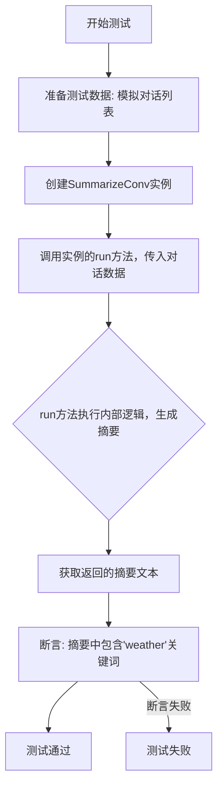
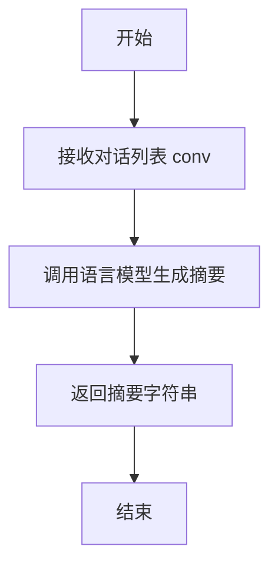
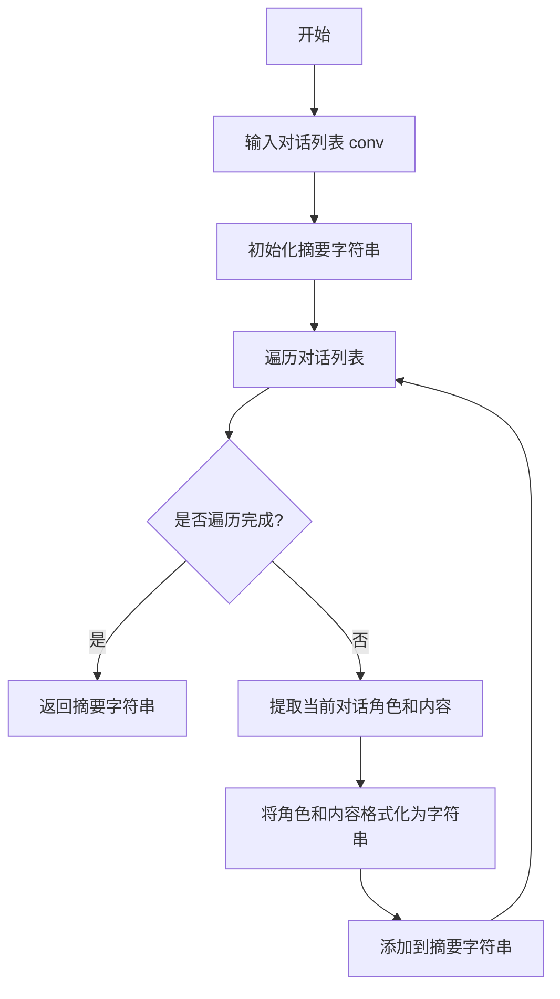

# `.\MetaGPT\tests\metagpt\ext\stanford_town\actions\test_summarize_conv.py` 详细设计文档

该文件是一个单元测试，用于测试SummarizeConv类的run方法。它通过模拟一段简单的对话（包含两个角色关于天气的交流），调用SummarizeConv的功能来生成对话摘要，并验证生成的摘要中是否包含关键词“weather”，以确认摘要功能的基本正确性。

## 整体流程



## 类结构

```
测试文件 (test_summarize_conv.py)
├── 全局导入 (pytest, SummarizeConv)
├── 异步测试函数 (test_summarize_conv)
└── 被测试类 (SummarizeConv - 定义在外部文件)
```

## 全局变量及字段


### `conv`
    
一个包含对话轮次的列表，每个轮次是一个元组，包含说话者角色和对话内容。

类型：`list[tuple[str, str]]`
    


    

## 全局函数及方法


### `SummarizeConv.run`

该方法接收一个对话列表，使用语言模型生成对话的摘要，并返回摘要字符串。

参数：

-  `conv`：`list[tuple[str, str]]`，一个包含对话的列表，每个元素是一个元组，包含说话者角色和说话内容。

返回值：`str`，生成的对话摘要字符串。

#### 流程图



#### 带注释源码

```python
async def run(self, conv: list[tuple[str, str]]) -> str:
    """
    运行方法，接收对话列表并生成摘要。

    Args:
        conv (list[tuple[str, str]]): 对话列表，每个元素为（说话者，内容）元组。

    Returns:
        str: 生成的对话摘要。
    """
    # 调用语言模型生成摘要的逻辑
    # 此处为示例，实际实现可能涉及调用外部API或本地模型
    summary = await self._generate_summary(conv)
    return summary
```


### `SummarizeConv.run`

该方法用于对给定的对话内容进行总结，提取关键信息并生成简洁的摘要。

参数：

- `conv`：`list[tuple[str, str]]`，包含对话内容的列表，每个元素为一个元组，包含说话者角色和对话内容。

返回值：`str`，生成的对话摘要字符串。

#### 流程图



#### 带注释源码

```python
async def run(self, conv: list[tuple[str, str]]) -> str:
    """
    对给定的对话内容进行总结，提取关键信息并生成简洁的摘要。

    Args:
        conv (list[tuple[str, str]]): 包含对话内容的列表，每个元素为一个元组，包含说话者角色和对话内容。

    Returns:
        str: 生成的对话摘要字符串。
    """
    # 初始化摘要字符串
    summary = ""
    
    # 遍历对话列表
    for role, content in conv:
        # 将角色和内容格式化为字符串并添加到摘要中
        summary += f"{role}: {content}\n"
    
    # 返回生成的摘要
    return summary
```

## 关键组件


### SummarizeConv 类

一个用于总结对话内容的动作类，它接收一个对话列表作为输入，并生成一个概括对话核心内容的文本摘要。

### 对话列表 (conv)

一个由元组组成的列表，每个元组代表对话中的一轮发言，格式为 (发言者名称, 发言内容)，作为 `SummarizeConv.run` 方法的主要输入参数。

### 异步运行方法 (run)

`SummarizeConv` 类的核心异步方法，负责执行对话总结的逻辑，接收对话列表并返回总结文本。


## 问题及建议


### 已知问题

-   **测试用例过于简单**：当前测试仅包含一个非常简短的对话轮次，无法充分验证 `SummarizeConv` 类在处理长对话、复杂语境、多轮交互或包含特定领域术语时的总结能力。
-   **断言条件过于宽松**：测试仅断言输出中包含“weather”一词，这无法证明总结的准确性、连贯性或是否捕捉到了对话的核心意图（例如，是询问天气，还是决定去散步）。
-   **缺乏对异步行为的边界测试**：未测试当输入 `conv` 参数为 `None`、空列表、非预期数据结构（如非字符串元组）或包含大量数据时，`run` 方法的异步处理能力和异常处理机制。
-   **测试覆盖不完整**：单元测试仅验证了 `run` 方法的基本功能，未对 `SummarizeConv` 类的初始化过程、可能的内部状态或其他方法（如果存在）进行测试。
-   **依赖外部模型未模拟**：`SummarizeConv` 类很可能依赖外部大语言模型(LLM)或摘要服务。测试中直接调用真实服务，可能导致测试不稳定（受网络、服务可用性影响）、速度慢，且无法在离线环境下运行。

### 优化建议

-   **增强测试用例**：构建更全面的测试数据集，包括长对话、多角色对话、包含行动计划的对话、以及模糊或无关的对话，以验证模型在不同场景下的鲁棒性。
-   **改进断言逻辑**：采用更严格的断言，例如使用正则表达式匹配关键短语、评估总结的长度范围、或者使用相似度算法（如`rouge`）与预期总结进行比较。可以结合 `pytest` 的参数化功能来测试多种输入输出对。
-   **增加边界和异常测试**：编写测试用例来验证方法对无效输入（如 `None`， `[]`， 错误格式）的处理，确保其能抛出合适的异常或返回预期的默认值。
-   **使用测试替身(Mock)**：利用 `unittest.mock` 或 `pytest-mock` 来模拟 `SummarizeConv.run` 方法内部可能调用的外部LLM接口或工具。这样可以实现快速、稳定、可重复的单元测试，并能够模拟各种成功、失败或超时的场景。
-   **补充集成测试**：在单元测试之外，可以设立一个集成测试套件，在可控环境下（如使用测试专用的API key或本地模型）运行少量测试，以验证整个流程与真实服务的集成是否正常。
-   **考虑测试性能**：如果对话总结是性能敏感路径，可以添加测试来确保 `run` 方法在典型负载下的响应时间符合预期。


## 其它


### 设计目标与约束

该代码模块的设计目标是提供一个异步的对话摘要生成功能，专门用于处理斯坦福小镇（Stanford Town）项目中的对话历史。其核心约束包括：
1.  必须能够接收并处理特定格式的对话历史数据（例如，一个由元组组成的列表）。
2.  摘要生成过程必须是异步的，以兼容项目的整体异步架构。
3.  生成的摘要需要准确捕捉对话的核心主题或关键信息（如测试用例中验证的“weather”关键词）。

### 错误处理与异常设计

当前代码片段中未展示显式的错误处理逻辑。在`SummarizeConv`类的`run`方法中，应考虑以下异常情况：
1.  **输入验证**：当`conv`参数不是预期的列表格式，或列表内元素格式不正确时，应抛出`ValueError`或`TypeError`。
2.  **空对话处理**：当传入的对话列表为空时，应返回一个空字符串或特定的提示信息，而不是导致后续处理失败。
3.  **外部依赖故障**：如果摘要生成依赖于外部模型或服务（如LLM API），需要捕获网络超时、认证失败、服务不可用等异常，并进行适当的重试或降级处理（例如，返回一个基于简单规则的摘要）。

### 数据流与状态机

该模块的数据流相对简单直接：
1.  **输入**：一个格式为`List[Tuple[str, str]]`的对话列表，每个元组代表一个发言（说话者，内容）。
2.  **处理**：`SummarizeConv.run`方法接收输入，内部逻辑（可能调用LLM或规则引擎）对对话内容进行分析和总结。
3.  **输出**：一个字符串类型的摘要文本。
该过程是无状态的，每次调用都是独立的，不涉及复杂的状态迁移。

### 外部依赖与接口契约

1.  **外部依赖**：
    *   **`metagpt`框架**：该类继承自`metagpt`框架的某个基类（如`Action`），依赖于其定义的运行生命周期和可能的基础设施（如日志、配置管理）。
    *   **摘要生成引擎**：核心的摘要功能可能依赖于一个大型语言模型（LLM）接口、一个本地模型库或一个规则库。这是最关键的外部依赖，其性能和可用性直接影响本模块的功能。
2.  **接口契约**：
    *   **`SummarizeConv.run`方法**：这是对外的核心接口。它承诺接收一个对话列表，并异步返回一个摘要字符串。调用者需要确保传入正确格式的数据。
    *   **与测试框架的契约**：代码通过`pytest`进行测试，`test_summarize_conv`函数定义了模块的预期行为——对于给定的输入，输出应包含特定关键词。

### 性能考虑

1.  **异步非阻塞**：`run`方法被设计为异步，旨在处理可能耗时的摘要生成操作（尤其是调用外部LLM API时）时不会阻塞主线程。
2.  **输入长度限制**：如果底层摘要引擎有上下文长度限制（如LLM的Token限制），`SummarizeConv`类可能需要实现对话历史的截断、分块或选择性摘要策略，以防止请求失败或性能下降。
3.  **缓存策略**：对于频繁出现的相同或相似对话，可以考虑引入缓存机制来存储摘要结果，避免重复计算，提升响应速度。

### 安全与隐私

1.  **数据泄露**：对话内容可能包含敏感信息。如果摘要生成过程涉及将数据发送到外部API，必须确保通信通道是加密的（HTTPS），并评估服务提供商的数据隐私政策。
2.  **提示词注入**：在构造发送给LLM的提示词（Prompt）时，需要对原始对话内容进行适当的清洗或转义，防止恶意构造的对话内容导致提示词注入攻击，从而引发模型产生意外或有害的输出。

    