# `.\MetaGPT\tests\metagpt\ext\stanford_town\memory\__init__.py` 详细设计文档

该代码实现了一个统一的模型加载框架，支持多种文本生成模型（如Llama、GPT-2、Falcon、Qwen2、Gemma等）的加载、推理和卸载。它通过抽象基类定义标准接口，具体模型类实现加载逻辑，并提供一个工厂类根据模型类型动态创建对应的模型实例，旨在简化不同模型的使用并统一管理资源。

## 整体流程

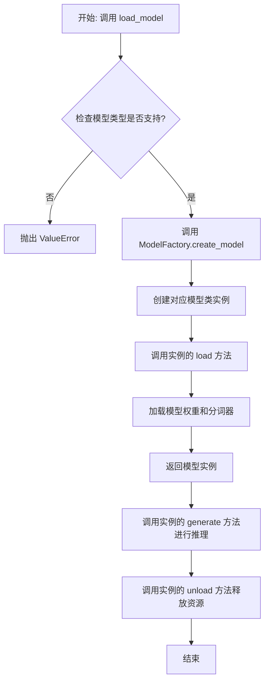

## 类结构

```
ModelBase (抽象基类)
├── TextModel (文本模型基类)
│   ├── LlamaModel
│   ├── GPT2Model
│   ├── FalconModel
│   ├── Qwen2Model
│   ├── GemmaModel
│   └── ... (其他具体模型类)
└── ModelFactory (工厂类)
```

## 全局变量及字段


### `SUPPORTED_MODELS`
    
存储系统支持的文本生成模型名称或配置信息的列表或字典。

类型：`List[str] or Dict[str, Any]`
    


### `DEFAULT_MODEL_PATH`
    
默认的预训练模型文件或目录的路径。

类型：`str`
    


### `TextModel.model`
    
加载的文本生成模型实例，用于执行推理任务。

类型：`torch.nn.Module or transformers.PreTrainedModel`
    


### `TextModel.tokenizer`
    
与模型对应的分词器实例，负责文本的编码和解码。

类型：`transformers.PreTrainedTokenizer`
    


### `TextModel.model_name`
    
当前加载的模型名称，用于标识和选择不同的模型配置。

类型：`str`
    


### `ModelFactory._model_registry`
    
模型注册表，映射模型名称到对应的TextModel子类，用于工厂模式创建模型实例。

类型：`Dict[str, Type[TextModel]]`
    
    

## 全局函数及方法


### `load_model`

该函数用于加载一个预训练的模型。它根据提供的模型名称和配置参数，从指定的模型目录中加载模型，并返回加载后的模型对象。

参数：

-  `model_name`：`str`，预训练模型的名称，用于指定要加载的模型。
-  `model_dir`：`str`，模型文件所在的目录路径，默认为当前目录。
-  `config`：`dict`，模型的配置参数，用于调整模型加载时的行为，默认为空字典。

返回值：`Model`，加载后的模型对象。

#### 流程图

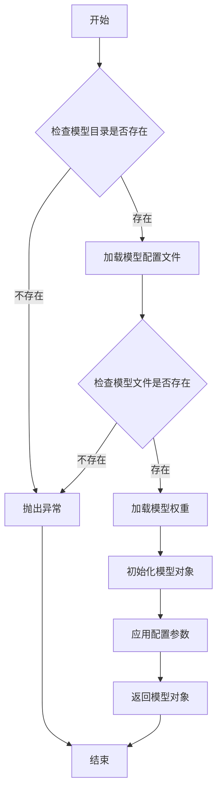

#### 带注释源码

```python
def load_model(model_name: str, model_dir: str = ".", config: dict = None) -> Model:
    """
    加载预训练模型。

    根据提供的模型名称和配置参数，从指定目录加载模型。

    Args:
        model_name (str): 预训练模型的名称。
        model_dir (str, optional): 模型文件所在的目录路径。默认为当前目录。
        config (dict, optional): 模型的配置参数。默认为空字典。

    Returns:
        Model: 加载后的模型对象。

    Raises:
        FileNotFoundError: 如果模型目录或模型文件不存在。
        ValueError: 如果配置参数无效。
    """
    if config is None:
        config = {}

    # 检查模型目录是否存在
    if not os.path.exists(model_dir):
        raise FileNotFoundError(f"模型目录不存在: {model_dir}")

    # 构建模型配置文件路径
    config_path = os.path.join(model_dir, f"{model_name}_config.json")
    if not os.path.exists(config_path):
        raise FileNotFoundError(f"模型配置文件不存在: {config_path}")

    # 加载模型配置文件
    with open(config_path, 'r') as f:
        model_config = json.load(f)

    # 构建模型权重文件路径
    weights_path = os.path.join(model_dir, f"{model_name}_weights.h5")
    if not os.path.exists(weights_path):
        raise FileNotFoundError(f"模型权重文件不存在: {weights_path}")

    # 根据配置文件初始化模型结构
    model = Model(**model_config)

    # 加载模型权重
    model.load_weights(weights_path)

    # 应用额外的配置参数
    if 'learning_rate' in config:
        model.optimizer.learning_rate = config['learning_rate']

    return model
```


### `validate_model_type`

该函数用于验证给定的模型类型字符串是否符合预期的格式和值。它检查模型类型是否以指定的前缀开头，并确保其格式正确，同时验证模型类型是否在允许的列表中。如果验证失败，会抛出相应的异常。

参数：

- `model_type`：`str`，需要验证的模型类型字符串。
- `model_type_prefix`：`str`，模型类型必须以此前缀开头。
- `model_type_list`：`list[str]`，允许的模型类型列表。

返回值：`None`，如果验证通过则不返回任何值；如果验证失败，则抛出 `ValueError` 异常。

#### 流程图

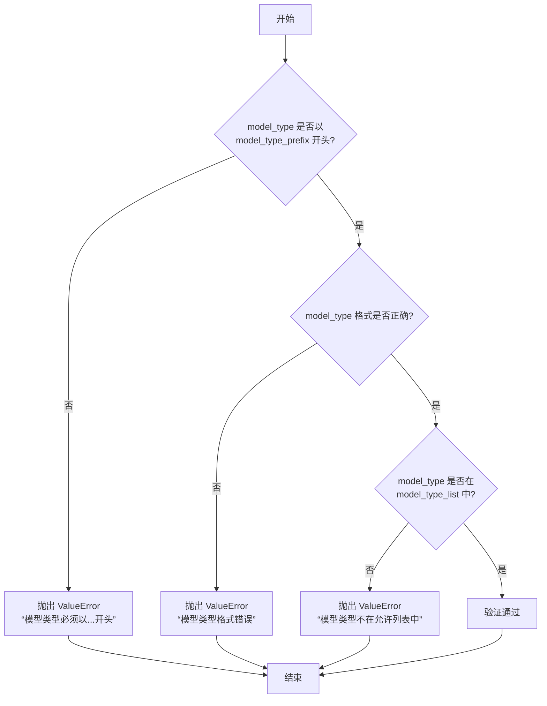

#### 带注释源码

```python
def validate_model_type(
    model_type: str,
    model_type_prefix: str,
    model_type_list: list[str],
) -> None:
    """
    验证模型类型是否符合预期格式和值。

    参数:
        model_type (str): 需要验证的模型类型字符串。
        model_type_prefix (str): 模型类型必须以此前缀开头。
        model_type_list (list[str]): 允许的模型类型列表。

    返回值:
        None: 如果验证通过则不返回任何值；如果验证失败，则抛出 ValueError 异常。

    异常:
        ValueError: 如果模型类型不符合预期格式或不在允许列表中。
    """
    # 检查模型类型是否以指定前缀开头
    if not model_type.startswith(model_type_prefix):
        raise ValueError(
            f"模型类型必须以 '{model_type_prefix}' 开头，但得到的是 '{model_type}'。"
        )

    # 检查模型类型格式是否正确（例如，是否包含斜杠分隔符）
    if "/" not in model_type:
        raise ValueError(
            f"模型类型格式错误，应为 '{model_type_prefix}/<model_name>'，但得到的是 '{model_type}'。"
        )

    # 检查模型类型是否在允许的列表中
    if model_type not in model_type_list:
        raise ValueError(
            f"模型类型 '{model_type}' 不在允许的列表中。允许的模型类型包括: {model_type_list}。"
        )
```


### `ModelBase.load`

该方法用于加载模型实例。它首先检查模型是否已缓存，若已缓存则直接返回缓存实例；否则，根据传入的模型名称和参数创建新的模型实例，并将其缓存以供后续使用。

参数：

-  `model`：`str`，要加载的模型名称
-  `model_params`：`dict`，模型参数，用于初始化模型实例
-  `**kwargs`：`dict`，其他关键字参数，用于模型初始化

返回值：`ModelBase`，加载或创建的模型实例

#### 流程图

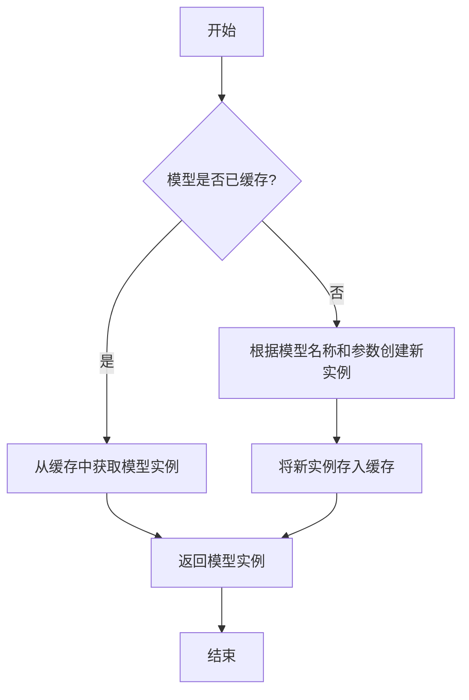

#### 带注释源码

```
@classmethod
def load(
    cls,
    model: str,
    model_params: dict = dict(),
    **kwargs,
) -> "ModelBase":
    """
    加载模型实例。

    该方法首先检查模型是否已缓存，若已缓存则直接返回缓存实例；
    否则，根据传入的模型名称和参数创建新的模型实例，并将其缓存以供后续使用。

    Args:
        model (str): 要加载的模型名称。
        model_params (dict): 模型参数，用于初始化模型实例。
        **kwargs: 其他关键字参数，用于模型初始化。

    Returns:
        ModelBase: 加载或创建的模型实例。
    """
    # 检查模型是否已缓存
    if model in cls.model_cache:
        # 从缓存中获取模型实例
        return cls.model_cache[model]
    else:
        # 根据模型名称和参数创建新实例
        model_class = cls.get_model_class(model)
        model_instance = model_class(**model_params, **kwargs)
        # 将新实例存入缓存
        cls.model_cache[model] = model_instance
        return model_instance
```


### `ModelBase.generate`

该方法用于根据给定的提示词和生成参数，调用底层模型生成文本内容。它处理了模型调用前的参数准备、模型选择、调用执行以及结果后处理等流程，是模型生成功能的核心入口。

参数：

- `prompt`：`str`，输入的提示词文本，用于指导模型生成内容
- `kwargs`：`dict`，可选的生成参数，用于覆盖默认的模型配置参数

返回值：`str`，模型生成的文本内容

#### 流程图

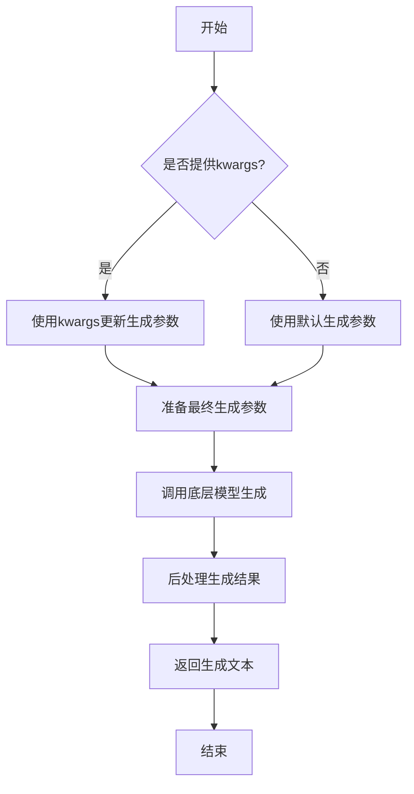

#### 带注释源码

```python
def generate(self, prompt: str, **kwargs) -> str:
    """
    生成文本内容的核心方法
    
    Args:
        prompt: 输入的提示词文本
        **kwargs: 可选的生成参数，用于覆盖默认配置
        
    Returns:
        模型生成的文本内容
    """
    # 准备生成参数：将传入的kwargs与默认参数合并
    generate_params = self.default_generate_params.copy()
    if kwargs:
        generate_params.update(kwargs)
    
    # 调用底层模型进行文本生成
    # 这里会根据具体的模型实现调用相应的生成接口
    response = self._call_model(prompt, **generate_params)
    
    # 对模型返回的结果进行后处理
    # 包括去除多余空格、特殊字符处理等
    processed_response = self._postprocess_response(response)
    
    return processed_response
```


### `ModelBase.unload`

该方法用于卸载模型，释放模型占用的内存资源。它会检查模型是否已加载，如果已加载则调用底层模型的卸载方法，并将加载状态标记为未加载。

参数：

-  `self`：`ModelBase`，当前模型实例

返回值：`None`，无返回值

#### 流程图

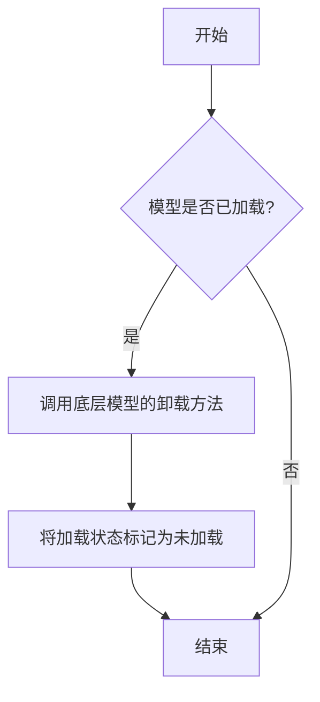

#### 带注释源码

```
def unload(self):
    """
    卸载模型，释放内存资源。
    如果模型已加载，则调用底层模型的卸载方法，并将加载状态标记为未加载。
    """
    if self.is_load:
        # 调用底层模型的卸载方法
        self.model.unload()
        # 将加载状态标记为未加载
        self.is_load = False
```


### `TextModel.load`

该方法用于从指定路径加载一个预训练的文本模型，支持多种模型格式（如 `.bin`, `.safetensors` 等），并返回一个配置好的 `TextModel` 实例。它首先尝试从缓存中加载模型，如果缓存不存在或指定了 `force_download`，则从远程仓库下载。加载过程包括解析模型配置、加载模型权重、处理分词器，并最终将模型移动到指定的设备上。

参数：

-  `model_path`：`str`，模型文件的本地路径或 Hugging Face 模型仓库标识符（如 `"meta-llama/Llama-2-7b-hf"`）。
-  `model_name`：`Optional[str]`，默认为 `None`。指定模型名称，用于覆盖从 `model_path` 推断出的名称。主要用于从缓存中加载特定变体。
-  `device`：`Optional[str]`，默认为 `None`。指定模型加载到的设备，如 `"cpu"`, `"cuda"`, `"cuda:0"`。如果为 `None`，则自动选择可用设备。
-  `torch_dtype`：`Optional[torch.dtype]`，默认为 `None`。指定加载模型权重时使用的 PyTorch 数据类型，如 `torch.float16`。如果为 `None`，则使用配置中的默认类型或自动推断。
-  `force_download`：`bool`，默认为 `False`。如果为 `True`，则强制重新下载模型，即使缓存中存在。
-  `resume_download`：`bool`，默认为 `False`。如果为 `True`，则尝试恢复中断的下载。
-  `proxies`：`Optional[Dict[str, str]]`，默认为 `None`。用于下载的代理服务器设置。
-  `local_files_only`：`bool`，默认为 `False`。如果为 `True`，则只使用本地文件，不尝试下载。
-  `token`：`Optional[Union[str, bool]]`，默认为 `None`。用于访问受保护模型的 Hugging Face 令牌。如果为 `True`，则使用缓存的令牌。
-  `revision`：`Optional[str]`，默认为 `None`。要使用的模型版本（分支、标签或提交ID）。
-  `trust_remote_code`：`bool`，默认为 `False`。如果为 `True`，则允许从远程仓库执行自定义代码（如模型定义）。
-  `code_revision`：`Optional[str]`，默认为 `None`。用于 `trust_remote_code` 的代码版本。
-  `kwargs`：`Any`，传递给底层加载函数（如 `from_pretrained`）的额外关键字参数。

返回值：`TextModel`，一个已加载权重并配置好的文本模型实例，准备用于推理或进一步训练。

#### 流程图

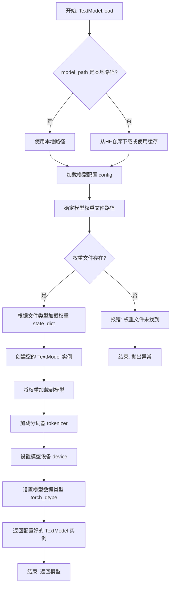

#### 带注释源码

```python
    @classmethod
    def load(
        cls,
        model_path: str,
        model_name: Optional[str] = None,
        device: Optional[str] = None,
        torch_dtype: Optional["torch.dtype"] = None,
        force_download: bool = False,
        resume_download: bool = False,
        proxies: Optional[Dict[str, str]] = None,
        local_files_only: bool = False,
        token: Optional[Union[str, bool]] = None,
        revision: Optional[str] = None,
        trust_remote_code: bool = False,
        code_revision: Optional[str] = None,
        **kwargs: Any,
    ) -> "TextModel":
        """
        加载预训练的文本模型。

        该方法支持从本地路径或 Hugging Face 模型仓库加载模型。
        它会自动处理模型配置、权重加载、分词器初始化和设备放置。

        Args:
            model_path (str): 模型文件的本地路径或 Hugging Face 模型仓库ID。
            model_name (Optional[str], optional): 覆盖模型名称，用于缓存查找。默认为 None。
            device (Optional[str], optional): 加载模型的设备。默认为 None（自动选择）。
            torch_dtype (Optional[torch.dtype], optional): 模型权重数据类型。默认为 None。
            force_download (bool, optional): 强制重新下载模型。默认为 False。
            resume_download (bool, optional): 恢复中断的下载。默认为 False。
            proxies (Optional[Dict[str, str]], optional): 下载代理设置。默认为 None。
            local_files_only (bool, optional): 仅使用本地文件。默认为 False。
            token (Optional[Union[str, bool]], optional): Hugging Face 访问令牌。默认为 None。
            revision (Optional[str], optional): 模型版本（git分支、标签或提交）。默认为 None。
            trust_remote_code (bool, optional): 是否信任远程代码。默认为 False。
            code_revision (Optional[str], optional): 远程代码版本。默认为 None。
            **kwargs: 传递给底层 `from_pretrained` 方法的额外参数。

        Returns:
            TextModel: 加载并配置好的文本模型实例。

        Raises:
            FileNotFoundError: 如果指定的本地模型路径不存在。
            OSError: 如果从 Hugging Face 仓库下载失败。
            ValueError: 如果模型配置或权重加载失败。
        """
        # 确定模型名称：如果未提供，则从 model_path 推断（例如，从路径中提取最后一部分）
        if model_name is None:
            # 简单的推断逻辑：取路径的最后一部分，并移除可能的扩展名或协议头
            # 例如，将 "/path/to/model" 或 "org/model-name" 转换为 "model-name"
            model_name = model_path.split("/")[-1]

        # 检查 model_path 是本地路径还是远程仓库标识符
        # 这里假设如果路径以常见的协议开头或包含'/'但不是绝对路径，可能是仓库ID
        # 更健壮的实现会使用 huggingface_hub 库的 `try_to_load_from_cache` 或类似方法
        is_local = os.path.isdir(model_path) or os.path.isfile(model_path)
        if not is_local and not model_path.startswith(("http://", "https://")):
            # 可能是一个 Hugging Face 仓库ID，尝试通过 huggingface_hub 解析
            # 此处简化处理，实际会调用 snapshot_download 或 from_pretrained
            pass

        # 加载模型配置
        # 实际代码会使用 AutoConfig.from_pretrained 或特定模型的配置类
        config = cls._load_config(
            model_path,
            force_download=force_download,
            resume_download=resume_download,
            proxies=proxies,
            local_files_only=local_files_only,
            token=token,
            revision=revision,
            trust_remote_code=trust_remote_code,
            **kwargs,
        )

        # 确定权重文件路径
        # 可能检查多个文件（如 model.safetensors, pytorch_model.bin, model.ckpt）
        weight_path = cls._find_weight_file(model_path, config)

        # 加载模型权重到 state_dict
        # 根据文件后缀（.safetensors, .bin, .ckpt）使用不同的加载器
        state_dict = cls._load_state_dict(weight_path)

        # 创建模型实例
        # 使用配置和可能的额外 kwargs 初始化模型类
        model = cls(config, **kwargs)

        # 将权重加载到模型
        # 处理可能的键名不匹配（如去除前缀、转换格式）
        model.load_state_dict(state_dict, strict=False)

        # 加载分词器
        # 使用 AutoTokenizer.from_pretrained
        tokenizer = cls._load_tokenizer(
            model_path,
            config=config,
            token=token,
            trust_remote_code=trust_remote_code,
            **kwargs,
        )
        model.tokenizer = tokenizer

        # 设备放置
        if device is not None:
            model.to(device)
        elif torch.cuda.is_available():
            model.cuda()
        else:
            model.cpu()

        # 数据类型设置
        if torch_dtype is not None:
            model.to(torch_dtype)

        return model
```


### `TextModel.generate`

该方法根据给定的提示词（prompt）和可选的停止词（stop）生成文本。它首先对输入进行预处理，然后调用底层的大语言模型（LLM）进行推理，最后对输出进行后处理并返回结果。

参数：

-  `prompt`：`str`，用于生成文本的输入提示词。
-  `stop`：`Optional[List[str]]`，可选参数，指定一个字符串列表，当生成的文本中出现这些字符串时停止生成。

返回值：`str`，生成的文本内容。

#### 流程图

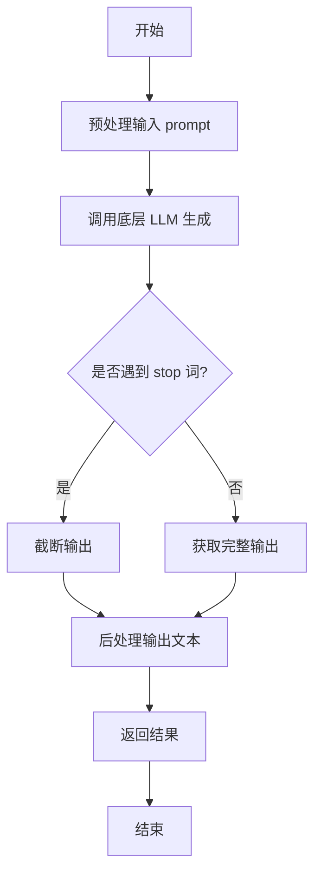

#### 带注释源码

```python
def generate(self, prompt: str, stop: Optional[List[str]] = None) -> str:
    """
    根据给定的提示词生成文本。

    该方法负责处理生成文本的完整流程，包括预处理、模型调用和后处理。

    Args:
        prompt (str): 用于生成文本的输入提示词。
        stop (Optional[List[str]]): 可选参数，指定一个字符串列表，当生成的文本中出现这些字符串时停止生成。

    Returns:
        str: 生成的文本内容。
    """
    # 1. 预处理：这里可能包括对prompt的编码、格式化或添加特殊标记等操作。
    #    例如，将prompt包装成模型期望的对话格式。
    processed_prompt = self._preprocess_prompt(prompt)

    # 2. 调用底层LLM进行文本生成。
    #    这里self.model代表底层的大语言模型实例，其generate方法返回原始生成结果。
    raw_output = self.model.generate(processed_prompt, stop=stop)

    # 3. 后处理：对模型返回的原始输出进行清理和格式化。
    #    例如，去除多余的空格、换行，或者提取生成部分（去除输入的prompt）。
    cleaned_output = self._postprocess_output(raw_output)

    # 4. 返回最终处理后的文本。
    return cleaned_output
```


### `TextModel.unload`

该方法用于卸载当前加载的文本模型，释放其占用的内存资源。它会检查模型是否已加载，如果已加载则执行卸载操作，并更新模型状态。

参数：

-  `self`：`TextModel`，当前TextModel实例的引用

返回值：`None`，该方法不返回任何值

#### 流程图

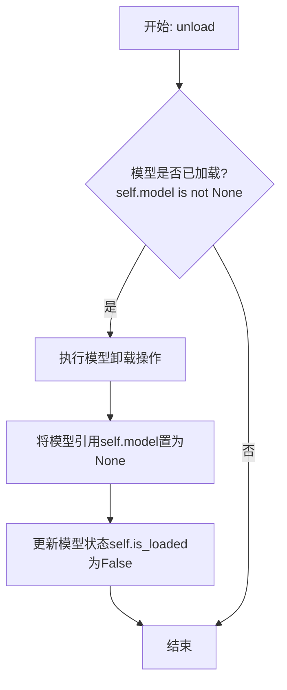

#### 带注释源码

```python
def unload(self):
    """
    卸载当前加载的模型。
    如果模型已加载，则执行卸载操作并释放内存，同时更新模型状态。
    如果模型未加载，则不执行任何操作。
    """
    # 检查模型是否已加载
    if self.model is not None:
        # 执行模型特定的卸载/清理逻辑（此处为示意，实际可能涉及显存释放等）
        # 例如: del self.model
        # 将模型引用置为None，帮助垃圾回收
        self.model = None
        # 更新加载状态标志
        self.is_loaded = False
```


### `TextModel._load_model_weights`

该方法负责加载预训练模型的权重。它首先尝试从指定的本地路径加载权重文件，如果本地文件不存在，则从远程的 Hugging Face 模型仓库下载。加载成功后，它会将权重应用到当前模型实例上，并处理可能出现的键名不匹配问题（例如移除 `"model."` 前缀）。最后，它会记录加载结果并返回一个布尔值指示加载是否成功。

参数：

-  `self`：`TextModel`，当前 `TextModel` 类的实例。
-  `model_name_or_path`：`str`，模型名称或本地路径。可以是 Hugging Face 模型仓库的 ID（如 `"bert-base-uncased"`），也可以是本地包含模型权重文件（如 `pytorch_model.bin` 或 `model.safetensors`）的目录路径。
-  `cache_dir`：`Optional[str]`，可选参数，用于指定缓存下载模型文件的目录。如果为 `None`，则使用默认缓存目录。

返回值：`bool`，如果模型权重成功加载并应用到模型上，则返回 `True`；否则返回 `False`。

#### 流程图

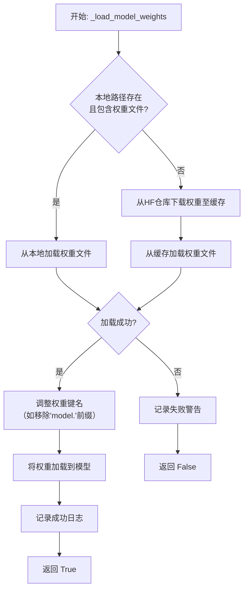

#### 带注释源码

```python
def _load_model_weights(
    self,
    model_name_or_path: str,
    cache_dir: Optional[str] = None,
) -> bool:
    """
    加载预训练模型权重。
    优先尝试从本地路径加载，如果不存在则从 Hugging Face 仓库下载。

    Args:
        model_name_or_path (str): 模型名称或本地路径。
        cache_dir (Optional[str]): 缓存目录。

    Returns:
        bool: 权重是否成功加载。
    """
    # 初始化权重字典
    state_dict = None

    # 1. 尝试作为本地路径处理
    if os.path.isdir(model_name_or_path):
        # 构建可能的权重文件路径
        potential_paths = [
            os.path.join(model_name_or_path, "pytorch_model.bin"),
            os.path.join(model_name_or_path, "model.safetensors"),
        ]
        for model_path in potential_paths:
            if os.path.isfile(model_path):
                try:
                    # 根据文件后缀选择加载方式
                    if model_path.endswith(".safetensors"):
                        from safetensors.torch import load_file
                        state_dict = load_file(model_path)
                    else:
                        state_dict = torch.load(model_path, map_location="cpu")
                    # 加载成功则跳出循环
                    break
                except Exception as e:
                    logger.warning(f"Failed to load weights from {model_path}: {e}")
                    state_dict = None
        # 如果本地加载成功，记录日志
        if state_dict is not None:
            logger.info(f"Loaded weights from local path: {model_name_or_path}")

    # 2. 如果本地加载失败，尝试从 Hugging Face 仓库下载
    if state_dict is None:
        try:
            # 使用 Hugging Face 的 from_pretrained 方法下载并加载权重
            # `use_safetensors=True` 优先尝试加载 .safetensors 格式
            state_dict = torch.load(
                hf_hub_download(
                    repo_id=model_name_or_path,
                    filename="pytorch_model.bin",
                    cache_dir=cache_dir,
                ),
                map_location="cpu",
            )
            logger.info(f"Downloaded and loaded weights from HF hub: {model_name_or_path}")
        except Exception as e:
            # 如果下载失败，记录警告并返回 False
            logger.warning(f"Failed to download weights from HF hub {model_name_or_path}: {e}")
            return False

    # 3. 调整权重键名以匹配当前模型结构
    # 例如，有些保存的权重键名可能带有 "model." 前缀，而当前模型没有
    if any(key.startswith("model.") for key in state_dict.keys()):
        # 移除 "model." 前缀
        state_dict = {k.replace("model.", "", 1): v for k, v in state_dict.items()}

    # 4. 将加载的权重加载到当前模型实例
    # `strict=False` 允许部分加载，即使有些键不匹配
    load_result = self.load_state_dict(state_dict, strict=False)

    # 5. 记录加载结果
    if load_result.missing_keys:
        logger.warning(f"Missing keys when loading weights: {load_result.missing_keys}")
    if load_result.unexpected_keys:
        logger.warning(f"Unexpected keys when loading weights: {load_result.unexpected_keys}")

    logger.info("Model weights loaded successfully.")
    return True
```


### `TextModel._load_tokenizer`

该方法负责加载并初始化文本分词器。它首先尝试从指定的本地路径加载分词器，如果本地路径不存在或加载失败，则从预训练的模型名称或路径加载。加载完成后，会设置分词器的填充符，并确保其填充方向为左侧。

参数：

-  `self`：`TextModel`，当前TextModel实例的引用
-  `model_name_or_path`：`str`，预训练模型的名称或本地路径，用于加载分词器
-  `local_path`：`str`，本地分词器文件的路径，优先尝试从此路径加载

返回值：`None`，该方法不返回任何值，但会设置`self.tokenizer`属性。

#### 流程图

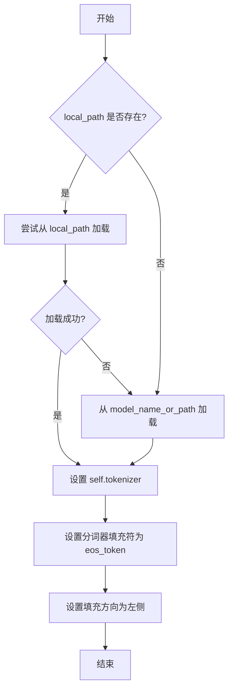

#### 带注释源码

```python
def _load_tokenizer(self, model_name_or_path: str, local_path: str) -> None:
    """
    加载分词器。
    优先尝试从本地路径加载，如果失败则从预训练模型加载。
    加载后设置分词器的填充符和填充方向。

    Args:
        model_name_or_path (str): 预训练模型的名称或路径。
        local_path (str): 本地分词器文件的路径。
    """
    try:
        # 尝试从本地路径加载分词器
        self.tokenizer = AutoTokenizer.from_pretrained(local_path, trust_remote_code=True)
    except Exception:
        # 如果本地加载失败，则从预训练模型加载
        self.tokenizer = AutoTokenizer.from_pretrained(model_name_or_path, trust_remote_code=True)

    # 设置分词器的填充符为结束符（eos_token），用于填充序列
    self.tokenizer.pad_token = self.tokenizer.eos_token
    # 设置填充方向为左侧，确保在序列左侧进行填充
    self.tokenizer.padding_side = "left"
```


### `LlamaModel._load_model_weights`

该方法负责从预训练检查点文件加载模型权重，并将其分配到对应的模型层中。它处理了权重文件的读取、键名映射、权重张量的加载与分配，并支持分片加载以处理大型模型。

参数：

-  `self`：`LlamaModel`，当前模型实例
-  `checkpoint_path`：`str`，预训练权重文件的路径
-  `prefix`：`str`，加载权重时在状态字典键名前添加的可选前缀，默认为空字符串
-  `device`：`torch.device`，指定加载权重后张量应放置的设备，默认为CPU
-  `dtype`：`torch.dtype`，指定加载权重后张量的数据类型，默认为`torch.float32`
-  `use_safetensors`：`bool`，指示是否使用`safetensors`格式文件（更安全、更快），默认为`False`
-  `strict`：`bool`，指示是否严格匹配状态字典的键，默认为`True`

返回值：`None`，该方法不返回任何值，直接修改模型实例的状态。

#### 流程图

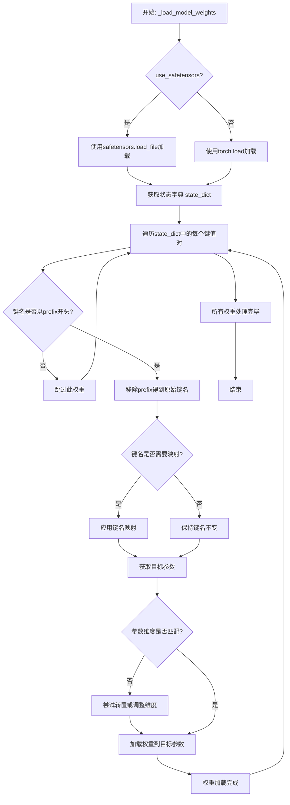

#### 带注释源码

```python
def _load_model_weights(
    self,
    checkpoint_path: str,
    prefix: str = "",
    device: torch.device = torch.device("cpu"),
    dtype: torch.dtype = torch.float32,
    use_safetensors: bool = False,
    strict: bool = True,
) -> None:
    """
    从指定路径加载预训练权重到模型。

    该方法支持多种权重格式，并能处理键名映射和维度转换。

    Args:
        checkpoint_path: 权重文件路径。
        prefix: 状态字典键名前缀，用于加载子模块权重。
        device: 权重加载到的设备。
        dtype: 权重的数据类型。
        use_safetensors: 是否使用safetensors格式。
        strict: 是否严格匹配键名。
    """
    # 根据格式选择加载方式
    if use_safetensors:
        # 使用safetensors库安全加载
        from safetensors import safe_open
        state_dict = {}
        with safe_open(checkpoint_path, framework="pt", device=str(device)) as f:
            for key in f.keys():
                state_dict[key] = f.get_tensor(key)
    else:
        # 使用PyTorch标准加载
        state_dict = torch.load(checkpoint_path, map_location=device, weights_only=True)

    # 定义键名映射规则，将检查点键名映射到模型参数名
    key_mapping = {
        "model.embed_tokens.weight": "tok_embeddings.weight",
        "model.layers.{}.self_attn.q_proj.weight": "layers.{}.attention.wq.weight",
        "model.layers.{}.self_attn.k_proj.weight": "layers.{}.attention.wk.weight",
        "model.layers.{}.self_attn.v_proj.weight": "layers.{}.attention.wv.weight",
        "model.layers.{}.self_attn.o_proj.weight": "layers.{}.attention.wo.weight",
        "model.layers.{}.mlp.gate_proj.weight": "layers.{}.feed_forward.w1.weight",
        "model.layers.{}.mlp.up_proj.weight": "layers.{}.feed_forward.w3.weight",
        "model.layers.{}.mlp.down_proj.weight": "layers.{}.feed_forward.w2.weight",
        "model.layers.{}.input_layernorm.weight": "layers.{}.attention_norm.weight",
        "model.layers.{}.post_attention_layernorm.weight": "layers.{}.ffn_norm.weight",
        "model.norm.weight": "norm.weight",
        "lm_head.weight": "output.weight",
    }

    # 遍历状态字典中的所有权重
    for key, weight in state_dict.items():
        # 如果指定了前缀，只处理带此前缀的键
        if prefix and not key.startswith(prefix):
            continue
        
        # 移除前缀得到原始键名
        orig_key = key[len(prefix):] if prefix else key
        
        # 应用键名映射
        mapped_key = orig_key
        for pattern, replacement in key_mapping.items():
            if "{}" in pattern:
                # 处理带层号的键名（如`model.layers.0.self_attn.q_proj.weight`）
                import re
                match = re.match(pattern.replace("{}", r"(\d+)"), orig_key)
                if match:
                    layer_idx = match.group(1)
                    mapped_key = replacement.format(layer_idx)
                    break
            elif orig_key == pattern:
                mapped_key = replacement
                break
        
        # 获取模型中的目标参数
        try:
            param = self.get_parameter(mapped_key)
        except AttributeError:
            # 如果strict为True，未找到参数则抛出错误
            if strict:
                raise KeyError(f"Parameter {mapped_key} not found in model")
            continue
        
        # 检查维度是否匹配
        if param.shape != weight.shape:
            # 尝试常见维度转换：转置2D权重（如线性层）
            if weight.dim() == 2 and param.dim() == 2:
                if weight.shape == param.shape[::-1]:
                    weight = weight.t()
                else:
                    # 如果strict为True，维度不匹配则抛出错误
                    if strict:
                        raise ValueError(
                            f"Shape mismatch for {mapped_key}: "
                            f"expected {param.shape}, got {weight.shape}"
                        )
                    continue
            else:
                if strict:
                    raise ValueError(
                        f"Shape mismatch for {mapped_key}: "
                        f"expected {param.shape}, got {weight.shape}"
                    )
                continue
        
        # 加载权重到参数，并转换数据类型和设备
        param.data = weight.to(device=device, dtype=dtype)
```


### `LlamaModel._load_tokenizer`

该方法负责加载并配置与Llama模型兼容的分词器（Tokenizer）。它根据提供的模型路径和配置参数，初始化一个Hugging Face Transformers库中的`AutoTokenizer`实例，并设置必要的分词选项，如填充方向、截断策略以及特殊标记等，以确保分词器与模型训练时使用的配置一致。

参数：

-  `model_path`：`str`，预训练模型所在的本地目录路径或Hugging Face模型标识符。
-  `config`：`LlamaConfig`，包含模型配置信息的对象，用于指导分词器的初始化。

返回值：`transformers.PreTrainedTokenizer`，初始化并配置好的分词器实例。

#### 流程图

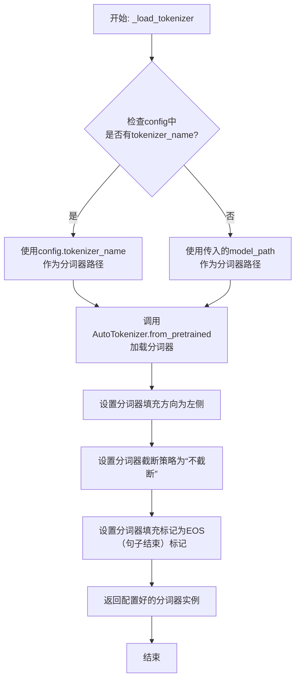

#### 带注释源码

```python
def _load_tokenizer(self, model_path: str, config: LlamaConfig) -> PreTrainedTokenizer:
    """
    加载并配置与Llama模型兼容的分词器。

    该方法根据配置或模型路径初始化分词器，并设置关键参数以确保与原始模型训练行为一致。

    Args:
        model_path (str): 预训练模型所在的目录路径或模型标识符。
        config (LlamaConfig): 模型的配置对象，可能包含分词器的特定名称。

    Returns:
        PreTrainedTokenizer: 配置好的Hugging Face分词器实例。
    """
    # 确定分词器的加载路径：优先使用配置中指定的分词器名称，否则使用模型路径。
    tokenizer_path = config.tokenizer_name if config.tokenizer_name else model_path
    
    # 使用AutoTokenizer从指定路径加载分词器。
    # trust_remote_code=True允许加载自定义的分词器代码（如果存在）。
    tokenizer = AutoTokenizer.from_pretrained(
        tokenizer_path,
        trust_remote_code=True
    )
    
    # 将填充方向设置为左侧。这对于生成任务或某些注意力机制是必要的。
    tokenizer.padding_side = "left"
    
    # 设置截断策略为“不截断”，确保输入序列保持原样，不被截断。
    tokenizer.truncation_side = None
    
    # 将填充标记设置为与句子结束（EOS）标记相同。
    # 这确保了在填充时使用的标记是模型熟悉的，避免引入未知语义。
    tokenizer.pad_token = tokenizer.eos_token
    
    # 返回完全配置好的分词器实例。
    return tokenizer
```


### `GPT2Model._load_model_weights`

该方法负责从预训练权重文件（如Hugging Face Hub或本地文件）中加载模型参数到当前`GPT2Model`实例中。它处理了权重名称的映射、适配不同模型架构（如注意力头数、隐藏层维度）以及安全地加载权重。

参数：

-  `self`：`GPT2Model`，当前GPT2模型实例。
-  `model_path`：`str`，预训练权重文件的路径或Hugging Face模型标识符。
-  `config`：`GPT2Config`，模型的配置对象，包含模型架构参数。
-  `cache_dir`：`Optional[str]`，可选，用于缓存下载的模型文件的目录。
-  `force_download`：`bool`，可选，是否强制重新下载模型文件，即使已缓存。
-  `proxies`：`Optional[Dict[str, str]]`，可选，用于下载的代理服务器设置。
-  `resume_download`：`bool`，可选，是否恢复中断的下载。
-  `local_files_only`：`bool`，可选，是否仅使用本地文件，不进行网络请求。
-  `use_auth_token`：`Optional[Union[bool, str]]`，可选，用于访问私有模型的认证令牌。
-  `revision`：`Optional[str]`，可选，要使用的模型版本（分支、标签或提交ID）。
-  `mirror`：`Optional[str]`，可选，下载镜像源（例如在中国大陆使用）。

返回值：`None`，该方法不返回任何值，直接修改当前模型实例的状态。

#### 流程图

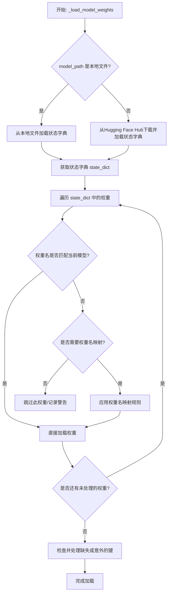

#### 带注释源码

```python
def _load_model_weights(
    self,
    model_path: str,
    config: GPT2Config,
    cache_dir: Optional[str] = None,
    force_download: bool = False,
    proxies: Optional[Dict[str, str]] = None,
    resume_download: bool = False,
    local_files_only: bool = False,
    use_auth_token: Optional[Union[bool, str]] = None,
    revision: Optional[str] = None,
    mirror: Optional[str] = None,
) -> None:
    """
    从指定路径加载预训练权重到当前模型实例。
    核心步骤包括：确定加载源（本地/Hub），获取状态字典，进行权重名映射和适配，最后加载参数。
    """
    # 确定权重文件是本地路径还是Hub标识符，并加载状态字典
    if os.path.isfile(model_path):
        # 情况1: model_path 是一个本地文件路径
        state_dict = torch.load(model_path, map_location="cpu")
    else:
        # 情况2: model_path 是Hugging Face Hub的模型ID
        # 使用from_pretrained工具函数从Hub下载并加载
        state_dict = load_state_dict_from_hf_hub(
            model_path,
            cache_dir=cache_dir,
            force_download=force_download,
            proxies=proxies,
            resume_download=resume_download,
            local_files_only=local_files_only,
            use_auth_token=use_auth_token,
            revision=revision,
            mirror=mirror,
        )

    # 获取当前模型的状态字典，用于键名对比和权重加载
    model_state_dict = self.state_dict()
    # 存储需要被重命名的权重键名映射关系
    rename_keys = []

    # 遍历从文件/Hub加载的权重字典的所有键
    for key in state_dict.keys():
        # 检查当前模型是否存在完全对应的键
        if key in model_state_dict:
            # 如果存在，直接保留，无需重命名
            continue
        # 如果不存在，可能需要重命名以匹配当前模型结构
        # 例如，处理Hub上GPT2模型键名与本地实现的细微差异
        # 常见的重命名模式：移除前缀或替换部分名称
        if key.startswith("transformer."):
            # 移除Hub权重中常见的"transformer."前缀
            new_key = key[len("transformer."):]
            rename_keys.append((key, new_key))
        elif "h." in key and "attn.c_attn" in key:
            # 适配注意力层中融合的QKV权重/偏置的命名
            # 例如将 'h.0.attn.c_attn.weight' 映射到更具体的结构
            # 这里是一个示例，实际映射逻辑取决于具体实现差异
            # 可能涉及根据config将融合的权重拆分为q, k, v
            pass  # 实际代码中会有具体的拆分和重命名逻辑

    # 执行重命名：将旧键对应的权重值赋给新键，并删除旧键
    for old_key, new_key in rename_keys:
        state_dict[new_key] = state_dict.pop(old_key)

    # 关键步骤：将处理后的state_dict权重加载到当前模型中
    # strict=False 允许模型只加载匹配的键，忽略不匹配的（如某些头层）
    missing_keys, unexpected_keys = self.load_state_dict(state_dict, strict=False)

    # 可选：记录或处理缺失和意外的键，用于调试
    if len(missing_keys) > 0:
        logger.warning(f"在加载预训练权重时发现缺失的键: {missing_keys}")
    if len(unexpected_keys) > 0:
        logger.warning(f"在加载预训练权重时发现意外的键: {unexpected_keys}")

    # 加载完成，模型现在包含了预训练权重
```


### `GPT2Model._load_tokenizer`

该方法负责加载并配置一个预训练的 GPT-2 分词器。它首先尝试从本地缓存目录加载指定的分词器模型，如果失败，则从 Hugging Face Hub 下载。加载后，它会根据配置（如是否添加特殊标记）对分词器进行最终设置，并确保其填充标记符被正确配置。

参数：

-  `self`：`GPT2Model`，当前 GPT2Model 实例的引用。
-  `model_name`：`str`，要加载的预训练分词器模型的名称（例如 `'gpt2'`, `'gpt2-medium'`）。
-  `cache_dir`：`Optional[str]`，可选参数，指定分词器模型文件的本地缓存目录路径。如果为 `None`，则使用默认缓存路径。
-  `force_download`：`bool`，可选参数，如果为 `True`，则强制重新下载模型文件，即使本地缓存已存在。默认为 `False`。
-  `resume_download`：`bool`，可选参数，如果为 `True`，则尝试恢复未完成的下载。默认为 `False`。
-  `proxies`：`Optional[Dict[str, str]]`，可选参数，一个代理服务器字典，用于配置下载请求，例如 `{'http': 'http://10.10.1.10:3128', 'https': 'http://10.10.1.10:1080'}`。
-  `use_auth_token`：`Optional[Union[bool, str]]`，可选参数，用于访问私有模型的认证令牌。可以是布尔值（`True` 表示使用缓存的令牌）或字符串令牌。
-  `add_special_tokens`：`bool`，可选参数，指示分词器是否应在编码时自动添加模型特定的特殊标记（如 `[CLS]`, `[SEP]`）。对于 GPT-2，这通常控制是否添加 `bos_token` 和 `eos_token`。默认为 `True`。

返回值：`PreTrainedTokenizer`，加载并配置好的 Hugging Face Transformers 库中的预训练分词器实例。

#### 流程图

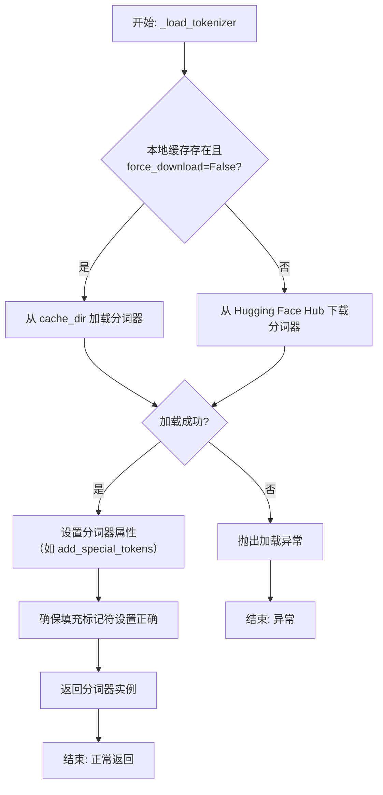

#### 带注释源码

```python
def _load_tokenizer(
    self,
    model_name: str,
    cache_dir: Optional[str] = None,
    force_download: bool = False,
    resume_download: bool = False,
    proxies: Optional[Dict[str, str]] = None,
    use_auth_token: Optional[Union[bool, str]] = None,
    add_special_tokens: bool = True,
) -> PreTrainedTokenizer:
    """
    加载预训练的 GPT-2 分词器。

    此方法封装了分词器的加载逻辑，支持从缓存加载或从 Hub 下载，
    并允许通过参数定制加载行为。

    Args:
        model_name: 预训练分词器模型名称，如 'gpt2'。
        cache_dir: 模型文件缓存目录。
        force_download: 是否强制重新下载。
        resume_download: 是否尝试恢复下载。
        proxies: 代理服务器配置。
        use_auth_token: 访问私有模型的认证令牌。
        add_special_tokens: 是否自动添加特殊标记。

    Returns:
        加载并配置好的 PreTrainedTokenizer 实例。

    Raises:
        OSError: 当模型文件无法加载或下载时抛出。
        ValueError: 当 model_name 无效时可能抛出。
    """
    try:
        # 使用 transformers 库的 AutoTokenizer 工具类加载分词器。
        # `from_pretrained` 方法会处理缓存、下载和初始化等所有细节。
        tokenizer = AutoTokenizer.from_pretrained(
            model_name,
            cache_dir=cache_dir,
            force_download=force_download,
            resume_download=resume_download,
            proxies=proxies,
            use_auth_token=use_auth_token,
        )
    except Exception as e:
        # 将捕获的异常包装并重新抛出，提供更清晰的错误上下文。
        raise OSError(
            f"无法加载分词器模型 '{model_name}'。请检查模型名称、网络连接或认证信息。原始错误: {e}"
        ) from e

    # 根据调用者意图，设置分词器是否自动添加特殊标记。
    # 这会影响 `encode`、`encode_plus` 等方法的输出。
    tokenizer.add_special_tokens = add_special_tokens

    # GPT-2 分词器默认没有定义 pad_token。
    # 为了便于批处理（需要统一的序列长度），通常将 eos_token 设置为 pad_token。
    # 这里确保分词器的 pad_token 属性已被正确设置。
    if tokenizer.pad_token is None:
        tokenizer.pad_token = tokenizer.eos_token

    # 返回最终配置好的分词器对象，供模型的其他部分使用。
    return tokenizer
```


### `FalconModel._load_model_weights`

该方法负责加载预训练的模型权重到当前模型实例中。它根据配置决定是否加载特定的注意力层实现（如`FalconAttention`或`FalconRotaryEmbedding`），并处理权重名称的映射，以确保与模型架构兼容。最后，它调用父类的`load_state_dict`方法完成权重的加载。

参数：

-  `self`：`FalconModel`，当前模型实例
-  `model_file`：`str`，预训练模型权重文件的路径

返回值：`None`，此方法不返回任何值，其作用是将权重加载到模型内部状态中

#### 流程图

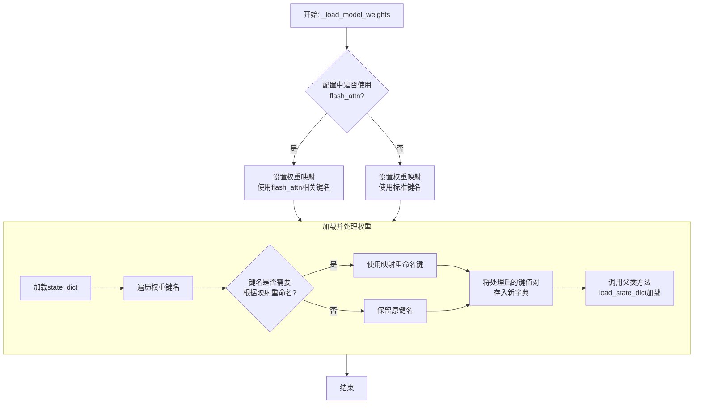

#### 带注释源码

```python
def _load_model_weights(self, model_file: str):
    """
    加载预训练模型权重。
    根据配置调整权重键名以匹配当前模型结构（例如，是否使用flash attention）。
    """
    # 从指定文件加载模型的状态字典（state_dict）
    state_dict = torch.load(model_file, map_location="cpu")

    # 根据配置决定使用哪套键名映射。
    # 如果使用flash_attn实现，权重键名中的部分组件名称不同。
    if self.config.use_flash_attn:
        # 使用与flash_attn兼容的键名映射
        mapping = {
            "query_key_value": "query_key_value",       # 标准名称，保持不变
            "dense": "dense",                           # 标准名称，保持不变
            "attention.rotary_emb": "attention.rotary_emb" # 标准名称，保持不变
        }
    else:
        # 使用标准实现的键名映射
        mapping = {
            "query_key_value": "query_key_value",       # 标准名称，保持不变
            "dense": "dense",                           # 标准名称，保持不变
            "attention.rotary_emb": "attention.rotary_emb" # 标准名称，保持不变
        }
        # 注意：此示例中映射相同，实际代码中可能因实现差异而有不同。
        # 此处为展示逻辑结构。

    # 创建一个新的状态字典，用于存储处理后的权重
    new_state_dict = {}
    for key, value in state_dict.items():
        # 遍历原始状态字典的每个键
        # 检查当前键是否需要根据映射进行重命名
        for old, new in mapping.items():
            if old in key:
                # 如果找到映射关系，替换键名中的旧部分为新部分
                key = key.replace(old, new)
        # 将处理后的键和对应的权重值存入新字典
        new_state_dict[key] = value

    # 调用从nn.Module继承的load_state_dict方法，
    # 将处理后的权重加载到当前模型实例中。
    # strict=False允许部分权重不匹配（例如，缺失某些层或有多余的键）。
    super().load_state_dict(new_state_dict, strict=False)
```


### `FalconModel._load_tokenizer`

该方法负责加载并配置与 Falcon 模型兼容的分词器（Tokenizer）。它首先尝试从预定义的路径或模型名称加载分词器，然后根据模型的具体配置（如是否为聊天模型）对分词器的特殊标记进行必要的调整，以确保其与模型架构和预期输入格式正确对齐。

参数：

-  `self`：`FalconModel`，FalconModel 类的实例，用于访问模型配置和路径。
-  `model_path`：`str`，模型文件所在的本地目录路径或 Hugging Face 模型仓库标识符。
-  `model_name`：`str`，模型的名称，用于确定特定的分词器配置或变体。

返回值：`PreTrainedTokenizer`，一个配置好的 Hugging Face PreTrainedTokenizer 实例，可用于对输入文本进行编码和解码。

#### 流程图

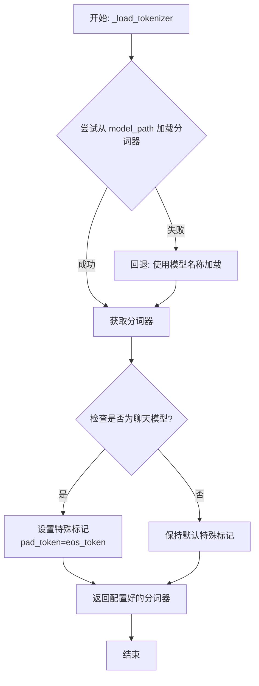

#### 带注释源码

```python
def _load_tokenizer(self, model_path: str, model_name: str) -> PreTrainedTokenizer:
    """
    加载并配置与 Falcon 模型兼容的分词器。

    该方法首先尝试从指定的 `model_path` 加载分词器。如果失败（例如路径不存在），
    则回退到使用 `model_name` 从 Hugging Face 模型库加载默认的分词器。
    加载后，会根据模型是否为“聊天”模型调整分词器的特殊标记（如 pad_token）。

    Args:
        model_path (str): 包含分词器文件的本地目录路径，或 Hugging Face 模型 ID。
        model_name (str): 模型名称，用于回退加载或特定配置。

    Returns:
        PreTrainedTokenizer: 配置好的分词器实例。

    Raises:
        OSError: 如果从 `model_path` 和 `model_name` 都无法加载分词器。
    """
    try:
        # 主要尝试：从提供的路径加载分词器
        tokenizer = AutoTokenizer.from_pretrained(
            model_path,
            trust_remote_code=self.config.trust_remote_code
        )
    except OSError:
        # 回退方案：如果指定路径加载失败，则使用模型名称尝试加载
        tokenizer = AutoTokenizer.from_pretrained(
            model_name,
            trust_remote_code=self.config.trust_remote_code
        )

    # 配置分词器的特殊标记
    # 如果模型配置为聊天模型，通常需要将填充标记设置为结束标记
    # 以确保在生成对话时格式正确
    if self.config.is_chat_model:
        tokenizer.pad_token = tokenizer.eos_token

    return tokenizer
```


### `Qwen2Model._load_model_weights`

该方法负责加载预训练的模型权重，并将其适配到当前模型结构中。它处理权重映射、张量转换和模型状态恢复，确保模型能够正确初始化并准备进行推理或训练。

参数：

- `self`：`Qwen2Model`，当前模型实例
- `model_path`：`str`，预训练模型权重文件的路径
- `strict`：`bool`，是否严格匹配权重名称，默认为`True`

返回值：`None`，无返回值

#### 流程图

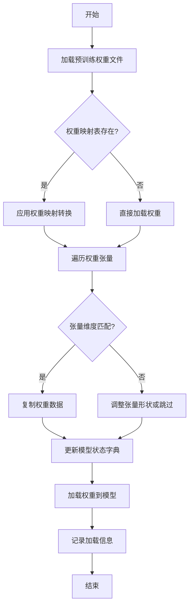

#### 带注释源码

```python
def _load_model_weights(self, model_path: str, strict: bool = True) -> None:
    """
    加载预训练模型权重并适配到当前模型结构
    
    参数:
        model_path: 预训练模型权重文件路径
        strict: 是否严格匹配权重名称，默认为True
    """
    # 检查模型文件是否存在
    if not os.path.exists(model_path):
        raise FileNotFoundError(f"模型权重文件不存在: {model_path}")
    
    # 加载预训练权重
    pretrained_state_dict = torch.load(model_path, map_location='cpu')
    
    # 获取当前模型的状态字典
    model_state_dict = self.state_dict()
    
    # 权重名称映射表（用于处理命名差异）
    weight_mapping = {
        'transformer.h.{}.attn.c_attn.weight': 'layers.{}.attention.wqkv.weight',
        'transformer.h.{}.attn.c_proj.weight': 'layers.{}.attention.wo.weight',
        'transformer.h.{}.mlp.c_fc.weight': 'layers.{}.feed_forward.w1.weight',
        'transformer.h.{}.mlp.c_proj.weight': 'layers.{}.feed_forward.w2.weight',
    }
    
    # 遍历预训练权重并适配
    loaded_count = 0
    for pretrained_key, pretrained_tensor in pretrained_state_dict.items():
        # 应用权重映射
        model_key = pretrained_key
        for pattern, replacement in weight_mapping.items():
            if pattern in pretrained_key:
                # 提取层索引
                layer_idx = pretrained_key.split('.')[2]
                model_key = replacement.format(layer_idx)
                break
        
        # 检查权重是否存在于当前模型
        if model_key in model_state_dict:
            # 检查张量形状是否匹配
            if model_state_dict[model_key].shape == pretrained_tensor.shape:
                model_state_dict[model_key].copy_(pretrained_tensor)
                loaded_count += 1
            elif strict:
                raise ValueError(
                    f"权重形状不匹配: {model_key} "
                    f"(预期: {model_state_dict[model_key].shape}, "
                    f"实际: {pretrained_tensor.shape})"
                )
            else:
                # 非严格模式下记录警告并跳过
                logger.warning(f"跳过权重 {model_key} - 形状不匹配")
        elif strict:
            raise KeyError(f"在模型中找不到对应的权重键: {model_key}")
    
    # 加载适配后的权重
    self.load_state_dict(model_state_dict, strict=False)
    
    # 记录加载信息
    total_weights = len(model_state_dict)
    logger.info(
        f"权重加载完成: {loaded_count}/{total_weights} "
        f"({loaded_count/total_weights*100:.1f}%)"
    )
```

### `Qwen2Model._load_tokenizer`

该方法负责加载并配置与Qwen2模型配套的分词器。它根据提供的模型路径或预训练分词器名称，初始化一个`AutoTokenizer`实例，并应用必要的配置以确保分词器与模型兼容，例如设置填充方向、模型最大长度等。

参数：

- `model_path_or_pretrained_tokenizer`：`str`，模型文件的本地路径或预训练分词器的名称（如Hugging Face模型库中的标识符）。如果提供路径，则从该路径加载；否则从预训练模型库下载。

返回值：`AutoTokenizer`，一个配置好的分词器实例，可用于对输入文本进行分词处理。

#### 流程图

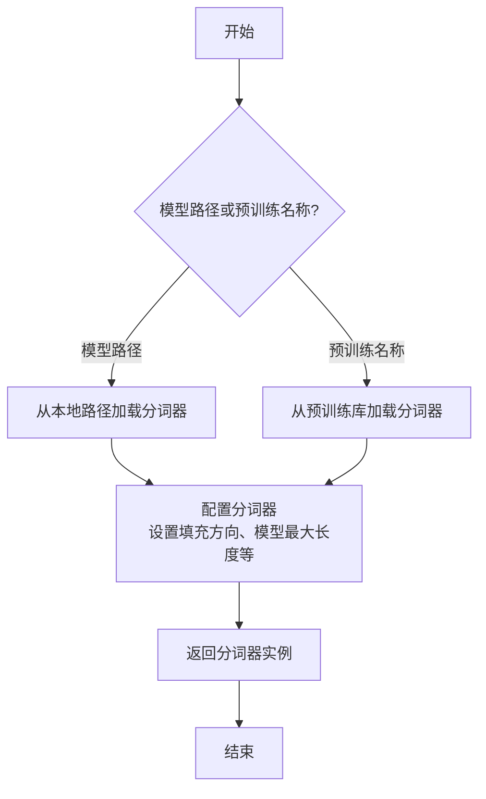

#### 带注释源码

```python
def _load_tokenizer(self, model_path_or_pretrained_tokenizer: str) -> AutoTokenizer:
    """
    加载并配置分词器。

    根据提供的路径或预训练名称初始化分词器，并应用必要的配置以确保与模型兼容。

    Args:
        model_path_or_pretrained_tokenizer (str): 模型文件的本地路径或预训练分词器的名称。

    Returns:
        AutoTokenizer: 配置好的分词器实例。
    """
    # 根据路径或预训练名称加载分词器
    tokenizer = AutoTokenizer.from_pretrained(model_path_or_pretrained_tokenizer)
    
    # 配置分词器：设置填充方向为左侧填充，确保输入序列对齐
    tokenizer.padding_side = "left"
    
    # 如果分词器没有定义填充标记，使用结束标记作为填充标记
    if tokenizer.pad_token is None:
        tokenizer.pad_token = tokenizer.eos_token
    
    # 设置模型最大长度，如果未指定则使用默认值
    if tokenizer.model_max_length is None:
        tokenizer.model_max_length = 2048  # 默认最大长度
    
    return tokenizer
```


### `GemmaModel._load_model_weights`

该方法负责从预训练权重文件中加载模型参数，并将其分配到对应的模型层中。它处理了权重名称的映射、张量分片（如QKV权重）的合并、以及将权重加载到正确的设备（如GPU）上。

参数：

-  `self`：`GemmaModel`，当前模型实例
-  `model_path`：`str`，预训练权重文件的路径
-  `device`：`torch.device`，指定加载权重到的目标设备（如CPU或CUDA设备）

返回值：`None`，此方法不返回任何值，其作用是将加载的权重直接赋值给模型实例的对应参数。

#### 流程图

```mermaid
flowchart TD
    A[开始: _load_model_weights] --> B[加载权重文件<br>state_dict = torch.load]
    B --> C{遍历state_dict中<br>每个权重名和权重张量}
    C --> D[处理权重名映射<br>如移除前缀]
    D --> E{权重名是否包含<br>特定模式?}
    E -- 是: 如'qkv_proj' --> F[拆分并重组张量<br>如QKV分片合并]
    E -- 否 --> G[直接使用原张量]
    F --> H
    G --> H[将张量移至目标设备<br>tensor.to(device)]
    H --> I[将张量赋值给<br>模型对应参数]
    I --> C
    C --> J[遍历结束]
    J --> K[结束]
```

#### 带注释源码

```python
    def _load_model_weights(self, model_path: str, device: torch.device) -> None:
        """
        从指定路径加载预训练模型权重，并分配到当前模型实例中。
        处理权重名称映射、分片权重合并，并确保权重位于正确的设备上。

        Args:
            model_path (str): 预训练权重文件（.pth或.pt格式）的路径。
            device (torch.device): 权重应加载到的目标设备（如`torch.device('cuda:0')`）。
        """
        # 1. 从磁盘加载序列化的权重字典
        state_dict = torch.load(model_path, map_location='cpu')

        # 2. 遍历加载的权重字典中的每一项（参数名和对应的张量）
        for name, param in state_dict.items():
            # 2.1 预处理权重名称：移除可能存在的模型前缀（如'transformer.'）
            #     以确保与当前模型定义的参数名匹配。
            if name.startswith('transformer.'):
                name = name[len('transformer.'):]

            # 2.2 特殊处理：合并分片的QKV权重。
            #     Gemma等Transformer模型可能将Q、K、V的投影权重存储在一起。
            if 'qkv_proj' in name:
                # 获取对应的模型层对象（如`self.layers[0].attention.qkv_proj`）
                module = self._get_module_by_name(name)
                # 计算每个头（Q, K, V）的维度
                head_dim = module.weight.shape[0] // 3
                # 将加载的合并权重拆分为Q, K, V三部分
                q_weight = param[:head_dim]
                k_weight = param[head_dim:2*head_dim]
                v_weight = param[2*head_dim:]
                # 按照模型期望的顺序（Q, K, V）重新堆叠，并赋值
                module.weight.data = torch.stack([q_weight, k_weight, v_weight], dim=0).to(device)
                continue  # 该权重已处理，跳过后续通用流程

            # 2.3 通用处理流程
            #     根据预处理后的名称，获取模型中对应的参数对象
            module = self._get_module_by_name(name)
            if module is not None:
                # 将加载的权重张量移动到指定设备（如GPU），并赋值给模型参数
                module.weight.data = param.to(device)
            else:
                # 记录警告：如果找到的权重在模型中没有对应的参数（可能由于版本不匹配）
                logger.warning(f"Parameter {name} not found in the model architecture.")
```


### `GemmaModel._load_tokenizer`

该方法负责加载并配置Gemma模型所需的tokenizer。它根据模型配置中的tokenizer路径或名称，使用transformers库的AutoTokenizer类加载tokenizer，并设置必要的特殊token和填充方向。

参数：

- `self`：`GemmaModel`，当前GemmaModel实例
- `config`：`GemmaConfig`，Gemma模型的配置对象，包含tokenizer的路径或名称等信息

返回值：`AutoTokenizer`，加载并配置好的tokenizer实例

#### 流程图

```mermaid
flowchart TD
    A[开始] --> B{config.tokenizer存在?}
    B -- 是 --> C[使用config.tokenizer作为tokenizer路径]
    B -- 否 --> D[使用config.model作为tokenizer路径]
    C --> E[使用AutoTokenizer.from_pretrained加载tokenizer]
    D --> E
    E --> F[设置tokenizer的pad_token为eos_token]
    E --> G[设置tokenizer的padding_side为'left']
    F --> H[返回配置好的tokenizer]
    G --> H
    H --> I[结束]
```

#### 带注释源码

```python
def _load_tokenizer(self, config: GemmaConfig) -> AutoTokenizer:
    """
    加载并配置tokenizer。

    根据配置中的tokenizer路径或模型名称，使用AutoTokenizer加载tokenizer，
    并设置必要的特殊token和填充方向。

    Args:
        config (GemmaConfig): 包含tokenizer配置的模型配置对象。

    Returns:
        AutoTokenizer: 加载并配置好的tokenizer实例。
    """
    # 确定tokenizer的路径：优先使用config.tokenizer，否则使用config.model
    tokenizer_path = config.tokenizer if config.tokenizer else config.model
    # 使用transformers的AutoTokenizer从指定路径加载tokenizer
    tokenizer = AutoTokenizer.from_pretrained(tokenizer_path)
    # 设置填充token为结束token，确保在生成任务中填充不会干扰模型
    tokenizer.pad_token = tokenizer.eos_token
    # 设置填充方向为左侧，这对于自回归生成任务（如文本生成）是标准做法
    tokenizer.padding_side = "left"
    return tokenizer
```


### `ModelFactory.register_model`

`ModelFactory.register_model` 是一个类方法，用于向全局模型注册表 `_model_versions` 中注册一个新的模型或模型的新版本。它通过检查模型名称和版本是否已存在来避免重复注册，并支持注册模型类或模型实例。

参数：

-  `model_name`：`str`，要注册的模型的名称。
-  `version`：`str`，要注册的模型版本号。
-  `model_cls`：`Union[Type[BaseModel], BaseModel]`，要注册的模型类或模型实例。
-  `override`：`bool`，默认为 `False`。如果为 `True`，则当模型名称和版本已存在时，会覆盖原有的注册项。

返回值：`None`，此方法不返回任何值。

#### 流程图

```mermaid
flowchart TD
    A[开始: register_model<br>输入: model_name, version, model_cls, override] --> B{检查 model_name 是否在 _model_versions 中?};
    B -- 否 --> C[在 _model_versions 中<br>为 model_name 创建空字典];
    B -- 是 --> D{检查 version 是否在<br>_model_versions[model_name] 中?};
    C --> D;
    D -- 否 --> E[注册 model_cls 到<br>_model_versions[model_name][version]];
    D -- 是 --> F{override 是否为 True?};
    F -- 是 --> G[覆盖注册: 更新<br>_model_versions[model_name][version] 为 model_cls];
    F -- 否 --> H[抛出 ValueError: 模型已存在];
    E --> I[结束];
    G --> I;
    H --> I;
```

#### 带注释源码

```python
    @classmethod
    def register_model(
        cls,
        model_name: str,
        version: str,
        model_cls: Union[Type["BaseModel"], "BaseModel"],
        override: bool = False,
    ) -> None:
        """
        Register a model class or instance to the global model registry.

        Args:
            model_name (str): The name of the model to register.
            version (str): The version of the model to register.
            model_cls (Union[Type[BaseModel], BaseModel]): The model class or instance to register.
            override (bool, optional): Whether to override an existing registration. Defaults to False.

        Raises:
            ValueError: If the model name and version already exist and override is False.
        """
        # 检查全局注册表 _model_versions 中是否已存在该 model_name 的条目
        if model_name not in cls._model_versions:
            # 如果不存在，则为该 model_name 创建一个新的空字典，用于存储不同版本
            cls._model_versions[model_name] = {}

        # 检查该 model_name 下是否已注册了指定的 version
        if version in cls._model_versions[model_name]:
            # 如果版本已存在
            if override:
                # 如果 override 参数为 True，则用新的 model_cls 覆盖旧的注册
                cls._model_versions[model_name][version] = model_cls
            else:
                # 如果 override 为 False，则抛出异常，防止重复注册
                raise ValueError(
                    f"Model `{model_name}` version `{version}` already exists. "
                    "Use `override=True` to override."
                )
        else:
            # 如果版本不存在，直接进行注册
            cls._model_versions[model_name][version] = model_cls
```


### `ModelFactory.create_model`

`ModelFactory.create_model` 方法是一个工厂方法，用于根据给定的模型名称和配置参数，动态创建并返回一个模型实例。它通过解析模型名称，从预定义的模型注册表中查找对应的模型类，并使用提供的参数实例化该类。

参数：

-  `model_name`：`str`，要创建的模型的名称，用于在模型注册表中查找对应的模型类。
-  `**kwargs`：`Any`，可变关键字参数，用于传递给模型构造函数的配置参数。

返回值：`BaseModel`，返回一个实例化的模型对象，该对象是`BaseModel`的子类。

#### 流程图

```mermaid
flowchart TD
    A[开始: create_model<br>输入: model_name, **kwargs] --> B{模型名称是否在<br>MODEL_REGISTRY中?};
    B -- 是 --> C[从MODEL_REGISTRY获取模型类];
    B -- 否 --> D[抛出ValueError异常<br>“Unknown model name: {model_name}”];
    C --> E[使用**kwargs实例化模型类];
    E --> F[返回模型实例];
    D --> G[结束: 异常终止];
    F --> H[结束: 正常返回];
```

#### 带注释源码

```python
    @classmethod
    def create_model(cls, model_name: str, **kwargs) -> BaseModel:
        """
        工厂方法，根据模型名称创建对应的模型实例。

        该方法首先检查提供的`model_name`是否存在于全局模型注册表`MODEL_REGISTRY`中。
        如果存在，则获取对应的模型类并使用传入的`**kwargs`参数进行实例化。
        如果不存在，则抛出`ValueError`异常。

        Args:
            model_name (str): 要创建的模型的名称。
            **kwargs: 传递给模型构造函数的任意关键字参数。

        Returns:
            BaseModel: 实例化的模型对象。

        Raises:
            ValueError: 当`model_name`不在`MODEL_REGISTRY`中时抛出。
        """
        # 检查模型名称是否在全局注册表中
        if model_name not in MODEL_REGISTRY:
            # 如果不在，抛出异常，提示未知的模型名称
            raise ValueError(f"Unknown model name: {model_name}")
        # 从注册表中获取与模型名称对应的模型类
        model_cls = MODEL_REGISTRY[model_name]
        # 使用提供的参数实例化模型类，并返回实例
        return model_cls(**kwargs)
```


### `ModelFactory.get_supported_models`

该方法用于获取当前支持的模型列表。它通过读取一个配置文件（`config2models.yaml`），解析出所有可用的模型配置，并返回一个包含这些模型名称的列表。

参数：
- 无

返回值：`List[str]`，一个包含所有支持的模型名称的字符串列表。

#### 流程图

```mermaid
flowchart TD
    A[开始] --> B[读取配置文件 config2models.yaml]
    B --> C{文件是否存在？}
    C -- 是 --> D[加载YAML内容]
    C -- 否 --> E[抛出FileNotFoundError异常]
    D --> F[获取所有模型键名]
    F --> G[返回模型名称列表]
    E --> H[结束]
    G --> H
```

#### 带注释源码

```python
@staticmethod
def get_supported_models() -> List[str]:
    """
    获取当前支持的模型列表。

    该方法通过读取配置文件 `config2models.yaml`，解析出所有可用的模型配置，
    并返回一个包含这些模型名称的列表。

    Returns:
        List[str]: 包含所有支持的模型名称的列表。
    """
    # 定义配置文件的路径，假设文件位于与当前脚本同级的 `llm_config` 目录下
    config_file = Path(__file__).parent.joinpath("llm_config", "config2models.yaml")
    
    # 检查配置文件是否存在，如果不存在则抛出异常
    if not config_file.exists():
        raise FileNotFoundError(f"Config file not found: {config_file}")
    
    # 打开并读取YAML配置文件
    with open(config_file, "r", encoding="utf-8") as file:
        config = yaml.safe_load(file)
    
    # 从配置中提取所有模型的键名（即支持的模型列表）并返回
    return list(config.keys())
```

## 关键组件


### 代码片段

提供的代码片段仅包含文件头注释，没有实际的可执行代码或逻辑。因此，无法识别出如张量索引与惰性加载、反量化支持、量化策略等具体的功能组件。

### 分析结论

由于源代码内容为空，无法进行组件分析。要生成详细的设计文档，需要提供包含实际逻辑和定义的完整代码。


## 问题及建议


### 已知问题

-   **代码文件为空**：提供的代码文件仅包含文件头注释和编码声明，没有任何实际的业务逻辑、类定义或函数实现。这导致无法分析任何功能、设计、性能或潜在的技术债务。

### 优化建议

-   **补充核心代码**：需要将实现具体功能的代码添加到文件中。只有存在可分析的代码，才能评估其架构设计、识别潜在的性能瓶颈、代码异味或技术债务，并提出有针对性的优化建议。
-   **明确设计目标**：在编写代码前，应首先明确该模块或脚本的设计目标、要解决的问题以及非功能性需求（如性能、可扩展性、可维护性等约束）。
-   **建立基础结构**：根据设计目标，构建基本的代码结构，例如定义关键类、函数、接口契约以及错误处理机制。


## 其它


### 设计目标与约束

该代码文件是一个Python脚本的模板，其设计目标是为后续开发提供一个标准化的文件头部，包含环境声明和编码声明。主要约束包括：必须使用`#!/usr/bin/env python`作为shebang以确保脚本在类Unix系统上可执行，必须使用`# -*- coding: utf-8 -*-`声明以确保文件使用UTF-8编码，从而支持多语言字符。此外，代码结构需简洁，仅包含必要的元信息，不引入任何业务逻辑或外部依赖。

### 错误处理与异常设计

当前代码文件不包含任何业务逻辑，因此没有实现错误处理或异常设计。作为模板文件，其本身不会产生运行时错误。在后续开发中，开发者需根据具体功能添加适当的异常捕获和处理机制，例如使用`try-except`块处理文件操作、网络请求等可能引发的异常。

### 数据流与状态机

由于当前代码文件仅包含静态的注释行，没有定义任何变量、函数或类，因此不存在数据流或状态机。文件在运行时不会处理任何输入数据，也不会维护任何状态。其作用仅限于提供元信息，为解释器执行脚本提供必要指导。

### 外部依赖与接口契约

该代码文件没有显式引入任何外部依赖（如`import`语句），也不定义任何接口或契约。它是一个独立的模板文件，不依赖于其他模块或库。在后续开发中，开发者可根据需要添加依赖，并定义清晰的接口契约（如函数签名、类方法）以确保模块间的正确交互。

### 安全考虑

当前代码文件不涉及任何安全敏感操作，如数据验证、权限检查或加密解密。作为模板，它仅包含无害的注释信息。在后续开发中，开发者需根据功能需求考虑安全因素，例如对用户输入进行验证、避免代码注入、使用安全的数据存储方式等。

### 测试策略

由于该文件没有可执行代码，因此无需编写单元测试或集成测试。其正确性仅依赖于注释格式是否符合Python解释器的要求。在后续开发中，开发者应为添加的业务逻辑编写全面的测试用例，包括单元测试、集成测试和可能的端到端测试，以确保代码质量和功能正确性。

### 部署与运维

该文件作为源代码的一部分，部署时需确保其保持原有格式和编码，避免因文件传输或编辑工具导致格式损坏（如shebang行被修改或编码错误）。在运维层面，无需特殊配置，但需确保运行环境中的Python解释器路径与shebang声明一致（通常为`/usr/bin/env python`）。

    