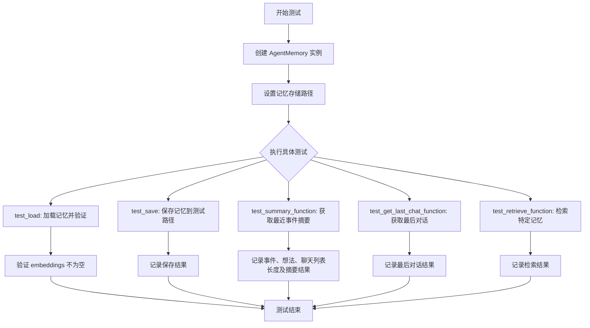
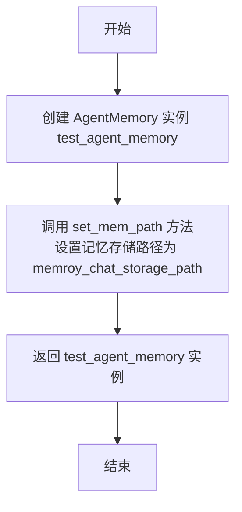
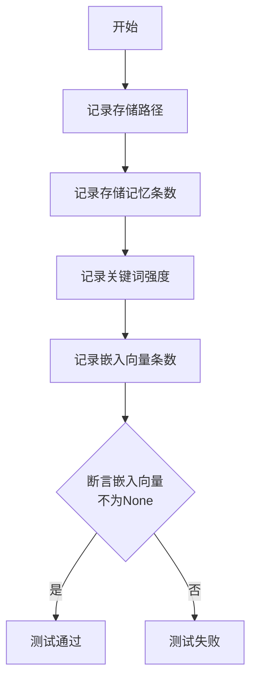
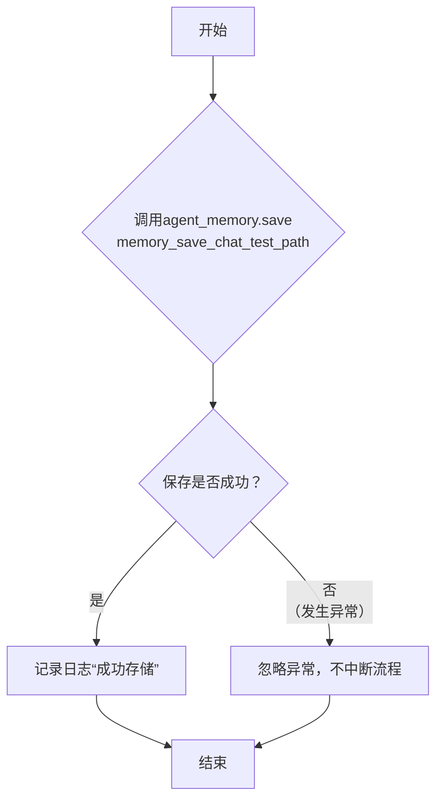
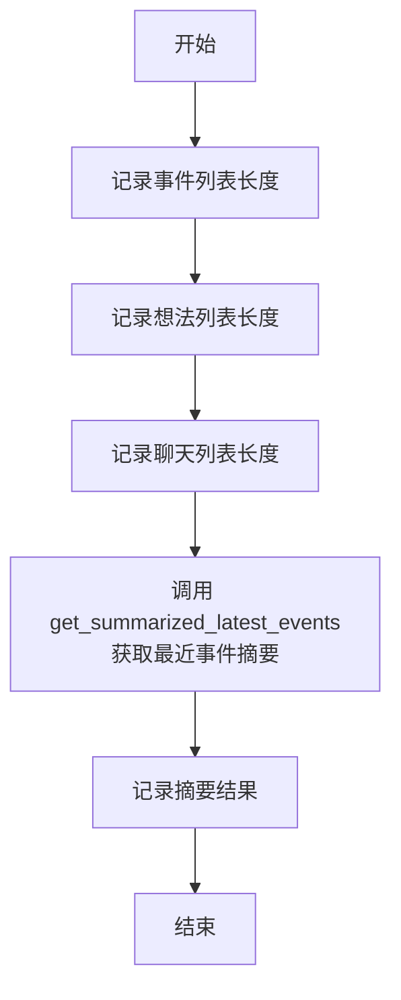
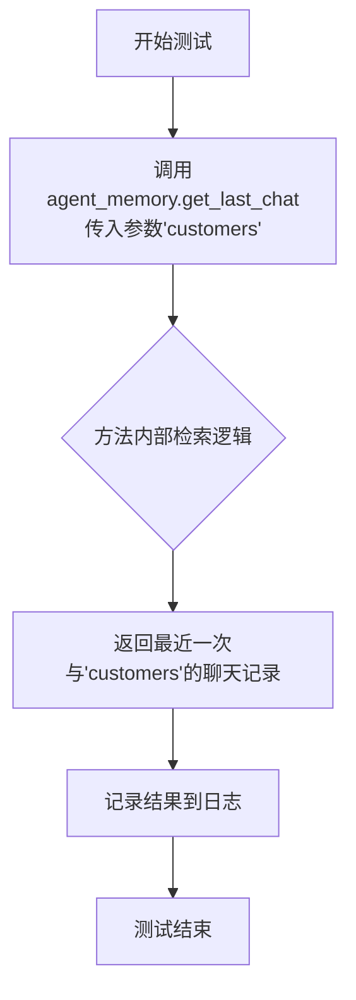
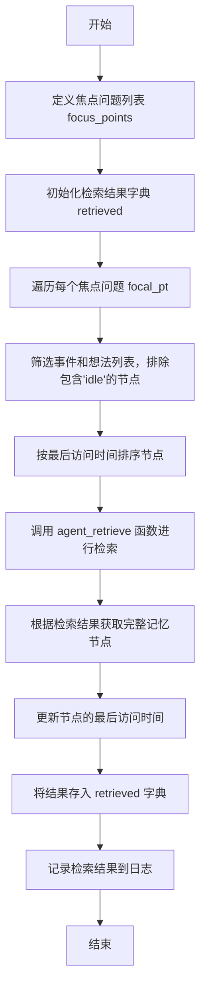

# `.\MetaGPT\tests\metagpt\ext\stanford_town\memory\test_agent_memory.py` 详细设计文档

该文件是 AgentMemory 类的单元测试，用于验证其核心功能，包括加载和保存记忆数据、获取记忆摘要、检索特定记忆以及获取最后对话记录。测试通过 pytest 框架组织，使用预定义的存储路径来模拟真实环境下的数据操作。

## 整体流程



## 类结构

```
TestAgentMemory (测试类)
├── agent_memory (pytest fixture)
├── test_load (测试方法)
├── test_save (测试方法)
├── test_summary_function (测试方法)
├── test_get_last_chat_function (测试方法)
└── test_retrieve_function (测试方法)
```

## 全局变量及字段


### `memory_easy_storage_path`
    
用于基础记忆测试的存储路径，指向Isabella Rodriguez角色的关联记忆目录

类型：`pathlib.Path`
    


### `memroy_chat_storage_path`
    
用于对话记忆测试的存储路径，指向Isabella Rodriguez角色的关联记忆目录

类型：`pathlib.Path`
    


### `memory_save_easy_test_path`
    
用于基础记忆保存测试的路径，指向Isabella Rodriguez角色的测试记忆目录

类型：`pathlib.Path`
    


### `memory_save_chat_test_path`
    
用于对话记忆保存测试的路径，指向Isabella Rodriguez角色的测试记忆目录

类型：`pathlib.Path`
    


    

## 全局函数及方法

### `TestAgentMemory.agent_memory`

`agent_memory` 是 `TestAgentMemory` 类的一个 `pytest` 夹具（fixture）方法。它的核心功能是创建一个 `AgentMemory` 类的实例，并为其设置一个预定义的记忆存储路径，以便在后续的单元测试中作为共享的测试对象使用。该方法确保了测试环境的一致性和可重复性。

参数：

-  `self`：`TestAgentMemory`，`TestAgentMemory` 类的实例引用。

返回值：`AgentMemory`，返回一个已配置好存储路径的 `AgentMemory` 实例。

#### 流程图



#### 带注释源码

```python
    @pytest.fixture
    def agent_memory(self):
        # 创建一个AgentMemory实例并返回，可以在所有测试用例中共享
        test_agent_memory = AgentMemory()  # 实例化 AgentMemory 对象
        test_agent_memory.set_mem_path(memroy_chat_storage_path)  # 为实例设置特定的记忆存储路径
        return test_agent_memory  # 返回配置好的实例，供测试方法使用
```

### `TestAgentMemory.test_load`

该方法用于测试`AgentMemory`类的`load`功能，验证内存加载过程是否正确，包括检查存储路径、记忆条目数量、关键词强度以及嵌入向量的加载情况。

参数：

- `self`：`TestAgentMemory`，测试类实例
- `agent_memory`：`AgentMemory`，通过`@pytest.fixture`提供的`AgentMemory`实例，用于执行测试

返回值：`None`，无返回值，仅执行断言和日志记录

#### 流程图



#### 带注释源码

```python
def test_load(self, agent_memory):
    # 记录AgentMemory实例的存储路径
    logger.info(f"存储路径为：{agent_memory.memory_saved}")
    # 记录AgentMemory实例中存储的记忆条目数量
    logger.info(f"存储记忆条数为：{len(agent_memory.storage)}")
    # 记录AgentMemory实例中事件和思想的关键词强度
    logger.info(f"kw_strength为{agent_memory.kw_strength_event},{agent_memory.kw_strength_thought}")
    # 记录AgentMemory实例中嵌入向量的数量
    logger.info(f"embeeding.json条数为{len(agent_memory.embeddings)}")

    # 断言嵌入向量不为None，验证加载过程是否成功
    assert agent_memory.embeddings is not None
```

### `TestAgentMemory.test_save`

该方法用于测试`AgentMemory`类的`save`方法，验证其能否将内存数据成功保存到指定的文件路径。测试中使用了`try-except`块来捕获并忽略可能发生的异常，确保测试流程不会因保存失败而中断。

参数：

-  `agent_memory`：`AgentMemory`，通过`@pytest.fixture`装饰器注入的`AgentMemory`实例，包含了待保存的内存数据。

返回值：`None`，该测试方法不返回任何值。

#### 流程图



#### 带注释源码

```python
def test_save(self, agent_memory):
    try:
        # 调用AgentMemory实例的save方法，尝试将内存数据保存到指定路径
        agent_memory.save(memory_save_chat_test_path)
        # 如果保存成功，记录日志信息
        logger.info("成功存储")
    except:
        # 如果保存过程中发生任何异常，使用pass语句忽略，防止测试因异常而失败
        pass
```

### `TestAgentMemory.test_summary_function`

该方法用于测试 `AgentMemory` 类的 `get_summarized_latest_events` 方法。它首先记录代理内存中事件、想法和聊天列表的长度，然后调用 `get_summarized_latest_events` 方法获取最近事件的摘要，并记录结果。

参数：

- `self`：`TestAgentMemory`，测试类实例
- `agent_memory`：`AgentMemory`，通过 `pytest.fixture` 提供的 `AgentMemory` 实例，用于测试

返回值：`None`，无返回值

#### 流程图



#### 带注释源码

```python
def test_summary_function(self, agent_memory):
    # 记录代理内存中事件列表的长度
    logger.info(f"event长度为{len(agent_memory.event_list)}")
    # 记录代理内存中想法列表的长度
    logger.info(f"thought长度为{len(agent_memory.thought_list)}")
    # 记录代理内存中聊天列表的长度
    logger.info(f"chat长度为{len(agent_memory.chat_list)}")
    # 调用 get_summarized_latest_events 方法，获取最近4个事件的摘要
    result1 = agent_memory.get_summarized_latest_events(4)
    # 记录获取到的摘要结果
    logger.info(f"总结最近事件结果为:{result1}")
```

### `TestAgentMemory.test_get_last_chat_function`

该方法用于测试 `AgentMemory` 类的 `get_last_chat` 功能，验证其能否正确检索并返回与指定聊天对象（如“customers”）最近一次的聊天记录。

参数：

- `agent_memory`：`AgentMemory`，通过 `pytest.fixture` 提供的已初始化的 `AgentMemory` 实例，包含加载的记忆数据。

返回值：`None`，该测试方法不返回任何值，其主要功能是执行测试并记录日志。

#### 流程图



#### 带注释源码

```python
def test_get_last_chat_function(self, agent_memory):
    # 调用AgentMemory实例的get_last_chat方法，传入聊天对象“customers”
    # 目的是检索并返回与该对象最近一次的聊天记录
    result2 = agent_memory.get_last_chat("customers")
    
    # 使用logger记录检索到的最近一次聊天结果，便于测试验证和调试
    logger.info(f"上一次对话是{result2}")
```

### `TestAgentMemory.test_retrieve_function`

该方法用于测试 `AgentMemory` 类的检索功能。它通过给定的焦点问题（如“who i love?”）从代理的记忆中检索相关的事件和想法，并返回按相关性排序的结果。

参数：

- `agent_memory`：`AgentMemory`，通过 `pytest.fixture` 提供的 `AgentMemory` 实例，用于访问和操作代理的记忆数据。

返回值：`None`，该方法是一个测试函数，不返回任何值，主要用于验证检索功能的正确性。

#### 流程图



#### 带注释源码

```python
def test_retrieve_function(self, agent_memory):
    # 定义焦点问题列表，用于测试检索功能
    focus_points = ["who i love?"]
    # 初始化一个字典，用于存储每个焦点问题的检索结果
    retrieved = dict()
    
    # 遍历每个焦点问题
    for focal_pt in focus_points:
        # 筛选事件和想法列表，排除包含'idle'的节点，并记录每个节点的最后访问时间
        nodes = [
            [i.last_accessed, i]
            for i in agent_memory.event_list + agent_memory.thought_list
            if "idle" not in i.embedding_key
        ]
        # 按最后访问时间对节点进行排序
        nodes = sorted(nodes, key=lambda x: x[0])
        # 提取排序后的节点对象，忽略时间戳
        nodes = [i for created, i in nodes]
        
        # 调用 agent_retrieve 函数进行检索，参数包括：
        # agent_memory: 代理记忆实例
        # datetime.now() - timedelta(days=120): 检索时间范围（120天前到现在）
        # 0.99: 相关性阈值
        # focal_pt: 当前焦点问题
        # nodes: 待检索的节点列表
        # 5: 返回结果的最大数量
        results = agent_retrieve(agent_memory, datetime.now() - timedelta(days=120), 0.99, focal_pt, nodes, 5)
        
        # 初始化最终结果列表
        final_result = []
        # 遍历检索结果中的每个记忆ID
        for n in results:
            # 在代理记忆的存储中查找匹配的记忆节点
            for i in agent_memory.storage:
                if i.memory_id == n:
                    # 更新节点的最后访问时间为120天前（模拟检索操作）
                    i.last_accessed = datetime.now() - timedelta(days=120)
                    # 将节点添加到最终结果列表
                    final_result.append(i)
        
        # 将当前焦点问题的检索结果存入字典
        retrieved[focal_pt] = final_result
    
    # 记录检索结果到日志，用于验证和调试
    logger.info(f"检索结果为{retrieved}")
```

## 关键组件


### AgentMemory

AgentMemory 类负责管理智能体的记忆系统，包括事件的存储、检索、总结和持久化。

### 记忆检索 (agent_retrieve)

agent_retrieve 函数根据给定的焦点问题、时间范围和相关性阈值，从记忆节点列表中检索出最相关的记忆条目。

### 记忆存储路径管理

代码通过 `STORAGE_PATH` 和 `set_mem_path` 方法管理记忆数据的存储和加载路径，支持从文件系统读取和保存记忆状态。

### 记忆类型分类

系统将记忆分为事件（event）、想法（thought）和聊天（chat）三种类型，并分别存储在 `event_list`、`thought_list` 和 `chat_list` 中，便于分类管理和检索。

### 关键词强度配置

通过 `kw_strength_event` 和 `kw_strength_thought` 字段配置不同类型记忆在检索时的关键词强度权重，影响检索结果的排序。

### 记忆嵌入向量

使用 `embeddings` 字段存储记忆条目的向量化表示，支持基于语义相似度的高效记忆检索。

### 记忆总结功能

提供 `get_summarized_latest_events` 方法，用于对最近发生的事件进行自动总结，生成简洁的概述。

### 最近聊天记录获取

提供 `get_last_chat` 方法，用于获取与特定对象（如“customers”）最近一次的聊天记录。

### 记忆持久化

通过 `save` 方法将当前内存状态（包括存储的记忆条目和嵌入向量）保存到指定的文件系统路径。

### 记忆加载与初始化

通过 `load` 方法（在测试中通过 `set_mem_path` 间接触发）从文件系统加载记忆数据，并初始化内存存储和嵌入向量。

### 测试框架集成

使用 `pytest` 框架和 `@pytest.fixture` 装饰器来构建可重用的测试环境，确保 `AgentMemory` 实例在不同测试用例间状态一致。


## 问题及建议


### 已知问题

-   **测试用例的路径变量命名和用途存在混淆**：代码中定义了多个路径变量（如 `memory_easy_storage_path`, `memroy_chat_storage_path`, `memory_save_easy_test_path`, `memory_save_chat_test_path`），但 `memroy_chat_storage_path` 和 `memory_save_chat_test_path` 的实际路径与 `memory_easy_storage_path` 和 `memory_save_easy_test_path` 完全相同，这可能是复制粘贴错误，导致变量名未能准确反映其预期用途，降低了代码的可读性和维护性。
-   **测试用例 `test_save` 的异常处理过于宽泛**：`test_save` 方法使用了一个空的 `except` 语句来捕获所有异常，这会掩盖测试失败的真实原因（如权限错误、路径不存在、序列化问题等），使得调试和问题定位变得困难。
-   **测试数据硬编码且缺乏隔离性**：测试依赖于外部文件系统中的特定路径（如 `base_the_ville_isabella_maria_klaus/personas/Isabella Rodriguez/...`）和固定数据。这导致测试不是自包含的，容易因外部数据变更或环境差异而失败，且无法在CI/CD流水线中可靠运行。
-   **`test_retrieve_function` 测试逻辑复杂且与单元测试目标不符**：该测试方法内嵌了复杂的业务逻辑（如手动排序、过滤、检索和结果组装），更像是一个集成测试或功能测试。这增加了测试的维护成本，并且一旦 `agent_retrieve` 函数或 `AgentMemory` 的内部结构发生变化，测试很容易失效。
-   **测试断言（Assertions）不足**：多个测试方法（如 `test_summary_function`, `test_get_last_chat_function`, `test_retrieve_function`）主要依赖日志输出进行结果观察，缺乏严格的断言来验证方法的返回值或对象状态是否符合预期，降低了测试的自动化和可靠性。

### 优化建议

-   **修正和澄清路径变量**：审查所有路径变量的定义，确保每个变量名准确描述其用途（例如，区分加载路径和保存路径）。考虑使用更具描述性的名称，并消除重复或冗余的定义。
-   **改进异常处理**：在 `test_save` 方法中，应避免使用空的 `except` 语句。至少应捕获特定的预期异常，并在捕获后记录或重新抛出更清晰的错误信息。更好的做法是让测试失败，以暴露潜在问题。
-   **使用测试夹具（Fixtures）和模拟（Mocking）实现测试隔离**：
    -   为 `AgentMemory` 的加载操作创建专用的测试夹具，使用可控的、预定义的测试数据文件或内存中的数据，而不是依赖外部固定路径。
    -   使用 `unittest.mock` 模块模拟 `agent_retrieve` 函数以及文件I/O操作，将测试焦点集中在 `AgentMemory` 类的方法逻辑上，而非其依赖项。
-   **重构 `test_retrieve_function` 并增强测试断言**：
    -   将 `test_retrieve_function` 拆分为更小、更专注的单元测试，分别测试 `AgentMemory` 的属性访问、`agent_retrieve` 的调用等。
    -   在所有测试方法中增加明确的断言语句，验证返回值的类型、结构、内容或对象的状态变化。例如，`test_load` 应断言 `storage` 的长度或特定内容；`test_get_last_chat_function` 应断言返回的聊天对象属性。
-   **提升测试覆盖率和维护性**：
    -   考虑为 `AgentMemory` 类的其他关键方法（如各种 `add` 方法）添加单元测试。
    -   使用参数化测试（`@pytest.mark.parametrize`）来覆盖不同的输入场景和边界条件。
    -   确保测试代码本身遵循良好的代码风格，如添加清晰的注释、使用有意义的变量名。


## 其它


### 设计目标与约束

本测试模块旨在验证 `AgentMemory` 类及其相关功能（如加载、保存、检索、总结）的正确性和可靠性。设计目标包括：1) 确保 `AgentMemory` 能够正确地从指定路径加载记忆数据；2) 验证记忆的保存功能正常工作；3) 测试记忆的检索、总结和获取最近聊天记录等核心方法。主要约束包括：1) 测试依赖于外部存储路径下的特定数据文件；2) 测试环境需要预先配置好 `STORAGE_PATH` 指向有效的测试数据目录；3) 部分测试（如检索）依赖于 `agent_retrieve` 函数的正确实现。

### 错误处理与异常设计

测试代码中使用了 `try-except` 块来捕获 `save` 方法可能抛出的异常，但未对异常进行具体处理或断言，这可能导致测试在失败时静默通过。理想情况下，应使用 `pytest.raises` 来断言特定异常，或对 `save` 操作的成功与否进行明确的断言（例如，检查文件是否被创建）。此外，测试假设外部数据文件存在且格式正确，如果文件缺失或损坏，`load` 测试将失败。测试未包含对这些前置条件失败的显式处理。

### 数据流与状态机

测试的数据流始于通过 `@pytest.fixture` 初始化的 `AgentMemory` 实例。`test_load` 验证从 `memroy_chat_storage_path` 加载数据到 `agent_memory.storage` 和 `agent_memory.embeddings` 等内部状态的过程。`test_save` 尝试将当前内存状态写入 `memory_save_chat_test_path`。`test_summary_function` 和 `test_get_last_chat_function` 分别测试基于当前内存状态（`event_list`, `thought_list`, `chat_list`）生成摘要和查询最新聊天记录的功能。`test_retrieve_function` 展示了更复杂的数据流：它基于焦点问题，通过 `agent_retrieve` 函数从内存中筛选节点，然后根据 `memory_id` 从 `storage` 中匹配出完整的记忆对象，并更新其 `last_accessed` 时间。整个测试套件没有明显的状态机转换，主要是对 `AgentMemory` 对象在不同操作下的状态进行验证。

### 外部依赖与接口契约

1.  **外部依赖**:
    *   `metagpt.ext.stanford_town.memory.agent_memory.AgentMemory`: 被测试的核心类。
    *   `metagpt.ext.stanford_town.memory.retrieve.agent_retrieve`: 用于记忆检索的外部函数。
    *   `metagpt.ext.stanford_town.utils.const.STORAGE_PATH`: 定义了基础存储路径的常量。
    *   `metagpt.logs.logger`: 用于记录测试过程中的信息。
    *   `pytest`: 测试框架，用于夹具管理、测试发现和执行。
    *   文件系统：测试依赖于 `STORAGE_PATH` 下的特定目录结构（如 `base_the_ville_isabella_maria_klaus/personas/...`）中存在有效的记忆数据文件（如 `embeddings.json`）。

2.  **接口契约**:
    *   `AgentMemory.set_mem_path(path)`: 测试中用于设置记忆存储路径。
    *   `AgentMemory.save(path)`: 测试中尝试调用，但未对其成功执行进行强断言。
    *   `AgentMemory.get_summarized_latest_events(count)`: 测试其返回指定数量最新事件的摘要。
    *   `AgentMemory.get_last_chat(target_persona)`: 测试其返回与指定人物最后一次聊天记录的功能。
    *   `AgentMemory` 的属性：测试直接访问了 `memory_saved`, `storage`, `kw_strength_event`, `kw_strength_thought`, `embeddings`, `event_list`, `thought_list`, `chat_list` 等属性，这要求 `AgentMemory` 类必须提供这些公共或受保护的属性。
    *   `agent_retrieve(agent_memory, start_time, retention, focal_pt, nodes, count)`: 测试中调用了此函数，并期望其返回一个记忆ID列表。测试后续逻辑依赖于该返回值的正确性。

### 测试策略与覆盖范围

测试策略主要采用集成测试方法，通过加载真实数据来验证 `AgentMemory` 类与外部存储的交互及其核心方法的整体行为。覆盖范围包括：1) **数据加载**：验证 `load` 过程能正确填充内部数据结构（`storage`, `embeddings` 等）；2) **数据保存**：验证 `save` 方法能够执行（尽管未做结果断言）；3) **功能方法**：验证 `get_summarized_latest_events`, `get_last_chat` 能基于加载的数据返回预期格式的结果；4) **检索流程**：验证结合 `agent_retrieve` 和 `AgentMemory` 内部数据完成复杂检索的流程。未覆盖的范围可能包括：1) 单元测试，如各个 `add` 方法；2) 边界条件测试，如空数据、异常输入；3) `save` 方法的成功性验证；4) 记忆条目的具体内容正确性验证。

### 环境与配置要求

1.  **运行环境**: Python 环境，需安装 `pytest` 及项目相关依赖（`metagpt`）。
2.  **数据配置**: 必须正确设置 `STORAGE_PATH` 环境变量或常量，确保其指向包含测试所需数据文件（位于 `base_the_ville_isabella_maria_klaus/personas/Isabella Rodriguez/bootstrap_memory/associative_memory/` 下）的目录。测试中使用的路径是硬编码的，依赖于特定的项目目录结构。
3.  **测试隔离**: 测试类 `TestAgentMemory` 使用了 `@pytest.fixture` 来为每个测试方法提供独立的 `AgentMemory` 实例，确保了测试间的隔离。`save` 测试写入的路径 (`test_memory`) 可能与原始数据路径不同，以避免污染源数据。


    