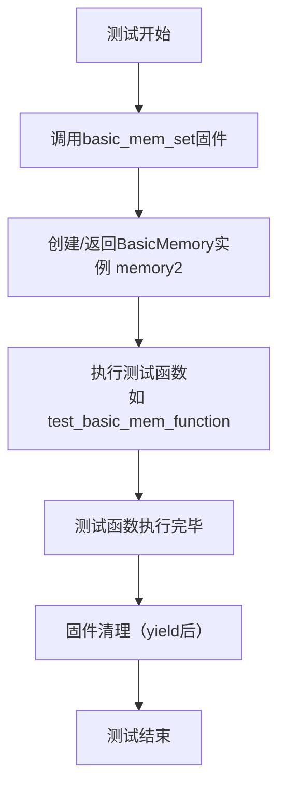
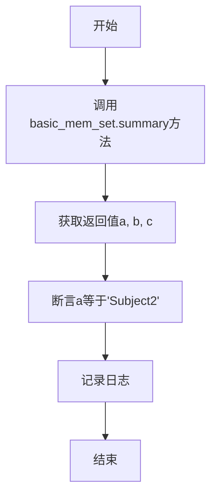
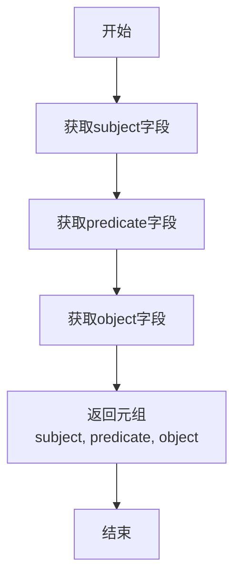
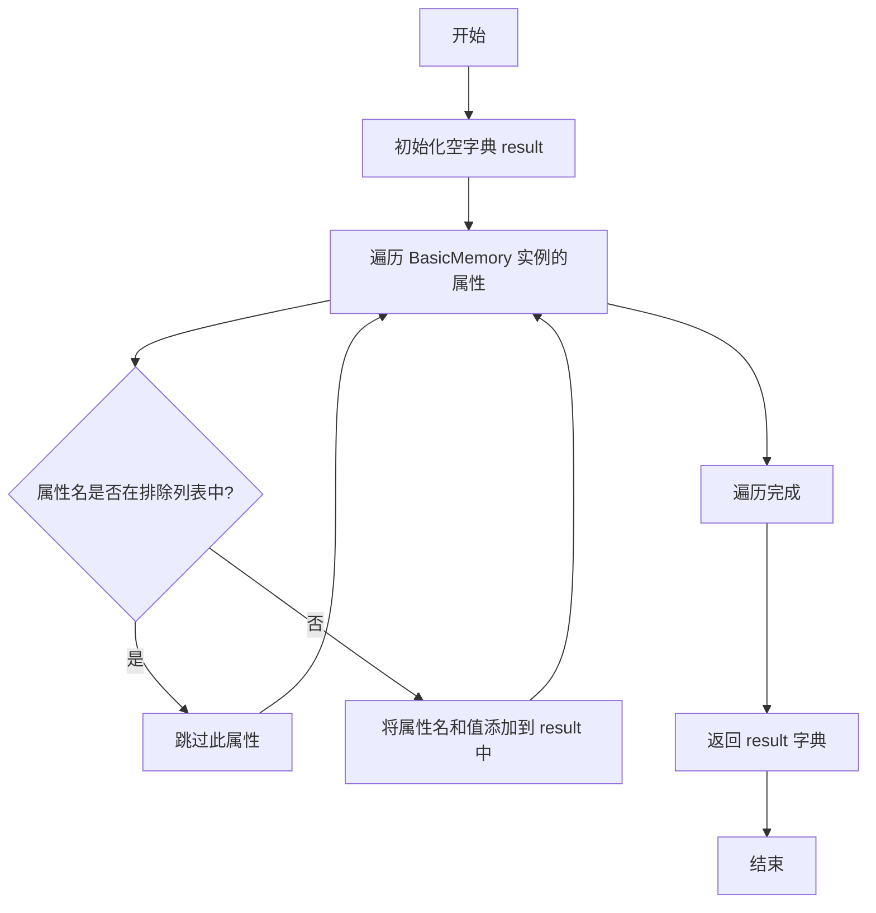

# `.\MetaGPT\tests\metagpt\ext\stanford_town\memory\test_basic_memory.py` 详细设计文档

该文件是 BasicMemory 类的单元测试文件，用于测试 BasicMemory 类的基本功能，包括创建内存实例、测试 summary 方法返回摘要信息、以及测试 save_to_dict 方法将内存对象序列化为字典格式。

## 整体流程

```mermaid
graph TD
    A[开始测试] --> B[创建 BasicMemory 实例 memory1 和 memory2]
    B --> C[定义 pytest fixture basic_mem_set]
    C --> D[执行 test_basic_mem_function]
    D --> E[调用 basic_mem_set.summary()]
    E --> F[断言返回的 subject 为 'Subject2']
    C --> G[执行 test_basic_mem_save]
    G --> H[调用 basic_mem_set.save_to_dict()]
    H --> I[记录并验证序列化结果]
    D & G --> J[测试结束]
```

## 类结构

```
BasicMemory (被测试类)
├── 字段: memory_id, memory_count, type_count, memory_type, depth, created, expiration, subject, predicate, object, content, embedding_key, poignancy, keywords, filling
├── 方法: summary(), save_to_dict()
└── ... (其他可能的方法)
```

## 全局变量及字段


### `memory1`
    
BasicMemory类的第一个测试实例，用于单元测试，包含事件类型记忆的完整属性设置

类型：`BasicMemory`
    


### `memory2`
    
BasicMemory类的第二个测试实例，用于单元测试，包含思想类型记忆的完整属性设置

类型：`BasicMemory`
    


### `BasicMemory.memory_id`
    
记忆的唯一标识符，用于区分不同的记忆实例

类型：`str`
    


### `BasicMemory.memory_count`
    
记忆的计数，表示该记忆在系统中的序号或出现次数

类型：`int`
    


### `BasicMemory.type_count`
    
类型计数，表示该类型记忆在系统中的序号或出现次数

类型：`int`
    


### `BasicMemory.memory_type`
    
记忆的类型，如事件、思想等，用于分类记忆内容

类型：`str`
    


### `BasicMemory.depth`
    
记忆的深度，表示记忆在记忆树或层级结构中的位置

类型：`int`
    


### `BasicMemory.created`
    
记忆的创建时间，记录记忆实例的生成时间戳

类型：`datetime`
    


### `BasicMemory.expiration`
    
记忆的过期时间，表示记忆的有效期限

类型：`datetime`
    


### `BasicMemory.subject`
    
记忆的主体，表示记忆涉及的主要实体或角色

类型：`str`
    


### `BasicMemory.predicate`
    
记忆的谓词，表示主体执行的动作或状态

类型：`str`
    


### `BasicMemory.object`
    
记忆的客体，表示动作的接收者或关联对象

类型：`str`
    


### `BasicMemory.content`
    
记忆的详细内容，描述记忆的具体信息

类型：`str`
    


### `BasicMemory.embedding_key`
    
嵌入键，用于向量化记忆内容以便进行相似性搜索

类型：`str`
    


### `BasicMemory.poignancy`
    
记忆的深刻程度或重要性评分，用于记忆的优先级排序

类型：`int`
    


### `BasicMemory.keywords`
    
记忆的关键词列表，用于快速检索和分类记忆

类型：`List[str]`
    


### `BasicMemory.filling`
    
填充列表，存储与该记忆关联的其他记忆ID，用于构建记忆网络

类型：`List[str]`
    
    

## 全局函数及方法

### `basic_mem_set`

`basic_mem_set` 是一个 `pytest` 测试固件（fixture），用于在测试函数执行前准备一个 `BasicMemory` 实例（`memory2`），并在测试函数执行后自动清理。它确保了测试的独立性和可重复性。

参数：

- 无显式参数。`pytest` 固件通过函数名被隐式调用。

返回值：`BasicMemory` 实例，具体为预先定义的 `memory2` 对象。

#### 流程图



#### 带注释源码

```python
@pytest.fixture
def basic_mem_set():
    # 固件函数，用于在测试中提供预配置的BasicMemory实例。
    basic_mem2 = memory2  # 将模块级定义的memory2对象赋值给局部变量。
    yield basic_mem2      # 将basic_mem2提供给测试函数使用。
                          # 测试函数执行完毕后，会回到此处继续执行（清理阶段，本例无额外清理）。
```

### `test_basic_mem_function`

该函数是一个单元测试，用于验证`BasicMemory`实例的`summary`方法是否按预期工作。它接收一个`BasicMemory`实例作为参数，调用其`summary`方法，并断言返回的第一个元素等于"Subject2"。

参数：

- `basic_mem_set`：`BasicMemory`，通过`pytest.fixture`提供的`BasicMemory`实例，用于测试其功能。

返回值：`None`，该函数是一个测试函数，不返回任何值，仅通过断言验证测试结果。

#### 流程图



#### 带注释源码

```python
def test_basic_mem_function(basic_mem_set):
    # 调用BasicMemory实例的summary方法，返回三个值
    a, b, c = basic_mem_set.summary()
    # 记录日志，输出summary方法的返回值
    logger.info(f"{a}{b}{c}")
    # 断言第一个返回值a等于"Subject2"，验证summary方法的正确性
    assert a == "Subject2"
```

### `test_basic_mem_save`

该函数是一个单元测试函数，用于测试 `BasicMemory` 类的 `save_to_dict` 方法。它接收一个 `BasicMemory` 实例作为参数，调用其 `save_to_dict` 方法，并将返回的字典结果记录到日志中，以验证该方法是否能正确地将内存对象序列化为字典格式。

参数：

- `basic_mem_set`：`BasicMemory`，一个通过 `pytest.fixture` 提供的 `BasicMemory` 实例，用于测试 `save_to_dict` 方法。

返回值：`None`，该函数不返回任何值，仅用于执行测试和记录日志。

#### 流程图

```mermaid
flowchart TD
    A[开始] --> B[接收 BasicMemory 实例 basic_mem_set]
    B --> C[调用 basic_mem_set.save_to_dict()]
    C --> D[将返回的字典结果记录到日志]
    D --> E[结束]
```

#### 带注释源码

```python
def test_basic_mem_save(basic_mem_set):
    # 调用 BasicMemory 实例的 save_to_dict 方法，将内存对象转换为字典
    result = basic_mem_set.save_to_dict()
    # 使用 logger 记录转换后的字典结果，便于调试和验证
    logger.info(f"save结果为{result}")
```

### `BasicMemory.summary`

该方法用于生成记忆的摘要信息，返回一个包含主题、谓词和对象的元组。

参数：无

返回值：`tuple[str, str, str]`，返回一个包含三个字符串的元组，分别表示记忆的主题（subject）、谓词（predicate）和对象（object）。

#### 流程图



#### 带注释源码

```python
def summary(self) -> tuple[str, str, str]:
    """
    返回记忆的摘要信息，包含主题、谓词和对象。

    Returns:
        tuple[str, str, str]: 一个包含三个字符串的元组，分别表示：
            - 主题 (subject)
            - 谓词 (predicate)
            - 对象 (object)
    """
    return self.subject, self.predicate, self.object
```

### `BasicMemory.save_to_dict`

该方法将 `BasicMemory` 实例的属性和状态序列化为一个字典，便于存储或传输。

参数：
- `self`：`BasicMemory`，当前 `BasicMemory` 实例。

返回值：`dict`，包含 `BasicMemory` 实例所有关键属性的字典。

#### 流程图



#### 带注释源码

```python
def save_to_dict(self):
    """
    将当前 BasicMemory 实例序列化为一个字典。
    该方法遍历实例的属性，排除私有属性（以 '_' 开头）和 'filling' 属性，
    将其他属性及其值存储在一个字典中并返回。

    Returns:
        dict: 包含实例属性的字典。
    """
    # 初始化一个空字典来存储结果
    result = {}
    # 遍历当前实例的所有属性
    for key, value in self.__dict__.items():
        # 跳过以 '_' 开头的私有属性和 'filling' 属性
        if key.startswith("_") or key == "filling":
            continue
        # 将属性名和值添加到结果字典中
        result[key] = value
    # 返回包含序列化属性的字典
    return result
```

## 关键组件


### BasicMemory 类

一个用于表示和管理智能体单一记忆条目的基础数据结构，封装了记忆的元数据（如ID、类型、深度、创建/过期时间）、内容（主题、谓词、对象、详细内容）以及关联属性（如嵌入键、重要性、关键词、关联记忆ID）。

### 记忆持久化与序列化

提供将 `BasicMemory` 实例转换为字典格式 (`save_to_dict` 方法) 的功能，以便于将记忆对象序列化并存储到外部系统（如数据库或文件）。

### 记忆摘要生成

提供从记忆条目中提取核心信息 (`summary` 方法) 的功能，返回一个包含主题、谓词和对象的元组，用于快速概览记忆内容。

### 单元测试框架

使用 `pytest` 框架构建的测试套件，用于验证 `BasicMemory` 类的核心功能，包括对象实例化、摘要生成和序列化操作的正确性。


## 问题及建议


### 已知问题

-   **测试用例设计不完整**：当前测试仅覆盖了 `BasicMemory` 类的 `summary` 和 `save_to_dict` 两个方法，未对构造函数、字段赋值、`filling` 列表操作、`expiration` 逻辑等核心功能进行验证，测试覆盖率不足。
-   **测试数据硬编码且存在耦合**：测试数据（`memory1`, `memory2`）在模块级别硬编码，`basic_mem_set` fixture 直接返回了全局变量 `memory2`。这使得测试数据难以维护，且测试用例与特定测试数据（`memory2`）强耦合，降低了测试的独立性和可读性。
-   **缺乏对边界条件和异常情况的测试**：例如，未测试 `filling` 列表为空或包含无效ID的情况、`expiration` 日期已过期的情况、`keywords` 列表为空的情况等。
-   **测试断言过于简单**：`test_basic_mem_function` 仅断言了摘要的第一个返回值，未全面验证 `summary` 方法返回的三元组 (`a`, `b`, `c`) 是否全部符合预期。
-   **直接调用 `pytest.main()`**：在脚本末尾直接调用 `pytest.main()` 虽然可以运行测试，但这不是标准的 pytest 测试文件组织方式。通常应通过命令行 `pytest <file_name>.py` 来执行，这更符合惯例且便于集成到CI/CD流程。

### 优化建议

-   **补充完整的单元测试**：为 `BasicMemory` 类的所有关键方法（如构造函数、`summary`、`save_to_dict`，以及可能存在的其他方法如 `load_from_dict`）编写测试用例。确保测试覆盖正常流程、边界条件（如空列表、极值日期）和异常输入。
-   **重构测试数据创建逻辑**：将测试数据的创建移到 `fixture` 内部或使用 `@pytest.fixture` 配合参数化。避免使用全局变量。可以为每种测试场景（如不同类型、不同填充状态的内存）创建独立的 fixture，提高测试的模块化和可复用性。
-   **使用参数化测试增强覆盖**：利用 `@pytest.mark.parametrize` 对 `summary` 和 `save_to_dict` 等方法进行参数化测试，传入多组不同的 `BasicMemory` 实例数据，以验证方法在不同输入下的行为。
-   **强化测试断言**：在 `test_basic_mem_function` 中，应详细断言 `summary` 方法返回的所有三个值。在 `test_basic_mem_save` 中，应断言返回的字典包含所有预期的键，并且值是正确的，而不仅仅是打印日志。
-   **遵循标准的 pytest 执行方式**：移除文件末尾的 `if __name__ == "__main__": pytest.main()` 代码块。直接通过命令行工具运行测试，这更清晰，也便于与其他测试工具和报告生成器配合使用。
-   **考虑添加集成测试**：当前测试集中在 `BasicMemory` 模型本身。未来应考虑添加针对 `AgentMemory` 类（如注释中提到的Load/Save, Add, Get方法）的测试，以及 `BasicMemory` 在 `AgentMemory` 上下文中如何被使用的集成测试。


## 其它


### 设计目标与约束

本代码是一个针对 `BasicMemory` 类的单元测试模块。其设计目标是验证 `BasicMemory` 类的核心功能，包括其数据结构的正确性、`summary` 方法的输出以及 `save_to_dict` 方法的序列化能力。主要约束包括：1) 测试应独立，不依赖外部数据库或服务；2) 使用 `pytest` 框架组织测试用例；3) 测试数据通过代码内硬编码的 `BasicMemory` 实例提供。

### 错误处理与异常设计

当前测试代码未显式包含错误处理逻辑。测试用例本身旨在验证 `BasicMemory` 类在正常输入下的行为。如果被测试的 `BasicMemory` 类方法（如 `summary` 或 `save_to_dict`）内部存在错误或异常，`pytest` 框架会捕获这些异常并将测试标记为失败。测试代码本身没有设计针对非法输入或边界条件的测试用例。

### 数据流与状态机

本测试模块的数据流是线性的：
1. **初始化阶段**：在模块加载时，创建两个全局的 `BasicMemory` 实例 (`memory1`, `memory2`) 作为测试数据。
2. **测试准备阶段**：`pytest.fixture` 装饰的 `basic_mem_set` 函数在测试执行前被调用，返回 `memory2` 实例作为测试上下文。
3. **测试执行阶段**：
    - `test_basic_mem_function`：接收 `basic_mem_set` 提供的 `memory2` 实例，调用其 `summary` 方法，断言返回值的第一个元素为 `"Subject2"`。
    - `test_basic_mem_save`：接收 `basic_mem_set` 提供的 `memory2` 实例，调用其 `save_to_dict` 方法，并记录结果。
4. **状态**：测试本身是无状态的，不修改 `memory1` 或 `memory2` 的初始状态。每个测试用例都是独立的。

### 外部依赖与接口契约

1.  **外部依赖**：
    - `pytest`: 测试运行框架。
    - `metagpt.ext.stanford_town.memory.agent_memory.BasicMemory`: 被测试的目标类。
    - `metagpt.logs.logger`: 用于记录测试过程中的信息。
    - `datetime`, `timedelta`: 用于构造测试数据中的时间字段。
2.  **接口契约**：
    - 与 `BasicMemory` 类的契约：测试代码依赖于 `BasicMemory` 的构造函数接受特定参数、`summary` 方法返回一个三元组、`save_to_dict` 方法返回一个字典。这些是测试所验证的核心接口。
    - 与 `pytest` 的契约：遵循 `pytest` 的测试发现规则（函数以 `test_` 开头），并使用 `pytest.fixture` 来提供测试数据。
    - 与 `logger` 的契约：调用 `logger.info` 来输出调试信息，依赖于其接口正常工作（尽管在测试中其输出可能被捕获或忽略）。

### 测试策略与覆盖范围

1.  **测试策略**：采用基于固定测试数据的单元测试。通过预定义的 `BasicMemory` 实例，验证类方法的功能性输出。
2.  **覆盖范围**：
    - **功能覆盖**：测试了 `summary` 方法（验证其返回内容）和 `save_to_dict` 方法（验证其可调用性及输出日志）。
    - **数据覆盖**：使用了 `memory2` 实例（类型为 `"thought"`，`filling` 为空列表）进行测试。但未覆盖 `memory1` 实例（类型为 `"event"`，`filling` 非空）以及 `BasicMemory` 类的其他潜在方法或属性。
    - **边界与异常**：当前测试未涵盖参数边界情况（如极值、空值）、异常输入或 `BasicMemory` 类其他方法的测试。

### 环境与执行说明

1.  **执行环境**：需要安装 `pytest` 和 `metagpt` 包（或其包含 `BasicMemory` 类的子模块）。通过 `python` 解释器执行。
2.  **执行方式**：
    - 命令行执行：在包含该文件的目录下运行 `pytest [文件名]`。
    - 直接执行：运行 `python [文件名]`，会调用 `pytest.main()` 执行模块内所有测试。
3.  **预期输出**：测试通过时，`pytest` 输出通过信息；测试失败时，输出断言错误或异常堆栈。`logger.info` 的输出取决于 `pytest` 的配置（可能被捕获或不显示）。


    