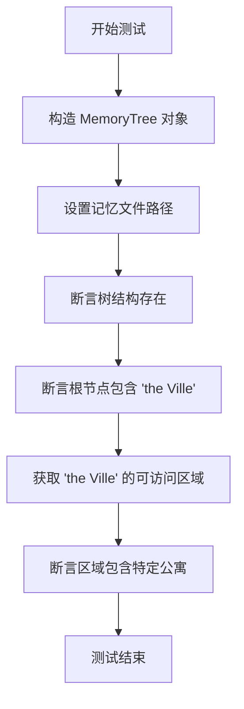
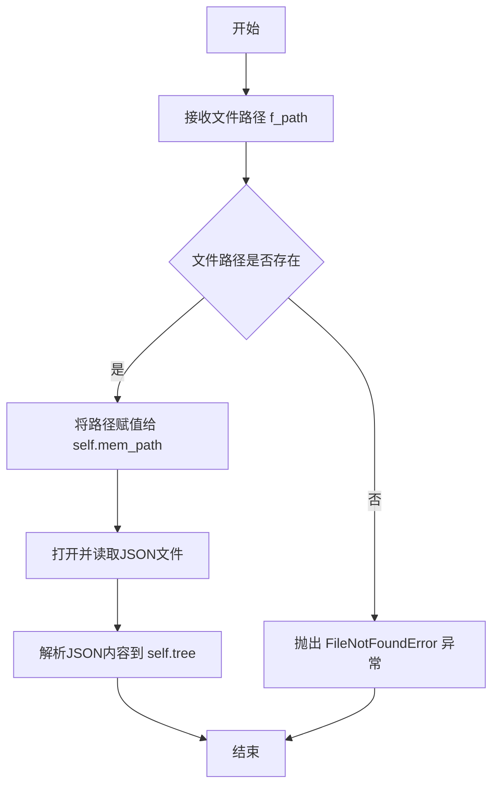

# `.\MetaGPT\tests\metagpt\ext\stanford_town\memory\test_spatial_memory.py` 详细设计文档

该代码是一个针对 MemoryTree 类的单元测试，用于验证空间记忆树的功能，包括从 JSON 文件加载记忆数据、检查树结构的存在性以及验证特定位置的可访问区域。

## 整体流程



## 类结构

```
MemoryTree (空间记忆树类)
├── 字段: tree, mem_path
├── 方法: set_mem_path, get_str_accessible_sectors
└── 其他方法 (未在测试中调用)
```

## 全局变量及字段


### `STORAGE_PATH`
    
项目存储根目录的路径对象，用于定位和加载持久化数据文件。

类型：`pathlib.Path`
    


### `MemoryTree.tree`
    
存储空间记忆的树状数据结构，表示不同地点及其可达性关系。

类型：`dict`
    


### `MemoryTree.mem_path`
    
空间记忆数据文件的存储路径，用于加载和保存记忆树。

类型：`pathlib.Path`
    
    

## 全局函数及方法


### `test_spatial_memory`

该函数是一个单元测试，用于验证 `MemoryTree` 类的空间记忆功能。它通过加载一个预定义的 JSON 文件来初始化一个 `MemoryTree` 实例，并断言其内部数据结构（`tree`）已成功构建，同时验证了特定地点（"the Ville"）存在于该结构中，并且可以从该地点访问另一个特定地点（"Isabella Rodriguez's apartment"）。

参数：
-  无显式参数。

返回值：`None`，该函数不返回任何值，其主要目的是执行断言测试。

#### 流程图

```mermaid
flowchart TD
    A[开始测试] --> B[构造测试文件路径 f_path]
    B --> C[创建 MemoryTree 实例 x]
    C --> D[调用 x.set_mem_path(f_path) 加载记忆]
    D --> E{断言 x.tree 存在}
    E -->|成功| F{断言 “the Ville” 在 x.tree 中}
    F -->|成功| G[调用 x.get_str_accessible_sectors<br>获取“the Ville”的可访问区域]
    G --> H{断言结果包含<br>“Isabella Rodriguez's apartment”}
    H -->|成功| I[测试通过]
    E -->|失败| J[测试失败]
    F -->|失败| J
    H -->|失败| J
```

#### 带注释源码

```python
def test_spatial_memory():
    # 步骤1: 构造测试数据文件路径。
    # 使用项目常量 STORAGE_PATH 与相对路径拼接，指向一个预设的 spatial_memory.json 文件。
    f_path = STORAGE_PATH.joinpath(
        "base_the_ville_isabella_maria_klaus/personas/Isabella Rodriguez/bootstrap_memory/spatial_memory.json"
    )
    
    # 步骤2: 实例化待测试的 MemoryTree 类。
    x = MemoryTree()
    
    # 步骤3: 调用关键方法，从指定文件路径加载空间记忆数据。
    x.set_mem_path(f_path)
    
    # 步骤4: 验证核心断言。
    # 断言1: 确保加载后 tree 属性不为空（即数据已成功加载并解析）。
    assert x.tree
    # 断言2: 确保加载的数据中包含名为 "the Ville" 的顶级地点。
    assert "the Ville" in x.tree
    # 断言3: 验证从 "the Ville" 可以访问到 "Isabella Rodriguez's apartment"。
    #       这测试了 MemoryTree 中地点间连通性的逻辑。
    assert "Isabella Rodriguez's apartment" in x.get_str_accessible_sectors("the Ville")
    # 函数无显式返回值，若所有断言通过，则测试成功。
```


### `MemoryTree.set_mem_path`

该方法用于设置`MemoryTree`实例的内存文件路径，并加载该路径下的JSON文件内容到内存树结构中。

参数：
- `f_path`：`Path`，指向包含空间记忆数据的JSON文件的路径对象。

返回值：`None`，无返回值。

#### 流程图



#### 带注释源码

```python
def set_mem_path(self, f_path):
    """
    设置内存文件路径并加载JSON数据到内存树。

    参数:
        f_path (Path): 指向包含空间记忆数据的JSON文件的路径对象。

    返回值:
        None: 此方法不返回任何值，但会更新实例的 `mem_path` 和 `tree` 属性。

    异常:
        FileNotFoundError: 如果指定的文件路径不存在，则抛出此异常。
    """
    # 将传入的文件路径对象赋值给实例变量 mem_path
    self.mem_path = f_path

    # 使用 'utf-8' 编码打开指定路径的文件
    with open(self.mem_path, "r", encoding="utf-8") as file:
        # 读取文件内容并使用 json.load 解析为Python字典，赋值给实例变量 tree
        self.tree = json.load(file)
```


### `MemoryTree.get_str_accessible_sectors`

该方法用于获取从指定起始节点（通常是某个地点）出发，能够直接访问（即一步可达）的所有相邻节点（通常是其他地点或区域）的名称列表，并以字符串形式返回。

参数：

-  `curr_sector`：`str`，表示当前所在的节点或区域的名称，作为路径查找的起点。

返回值：`str`，返回一个由换行符（`\n`）连接起来的字符串，其中每一行代表一个从`curr_sector`可以直接访问的节点名称。如果`curr_sector`不存在于内存树中或没有可访问的节点，则返回空字符串。

#### 流程图

```mermaid
flowchart TD
    A[开始: get_str_accessible_sectors(curr_sector)] --> B{curr_sector 是否在 self.tree 中?}
    B -- 否 --> C[返回空字符串 '']
    B -- 是 --> D[获取 curr_sector 的节点对象: node = self.tree[curr_sector]]
    D --> E[获取节点的 children 列表: children = node['children']]
    E --> F{children 列表是否为空?}
    F -- 是 --> C
    F -- 否 --> G[遍历 children 列表<br>提取每个子节点的 'node_name']
    G --> H[用换行符 '\n' 连接所有子节点名称]
    H --> I[返回连接后的字符串]
    I --> J[结束]
```

#### 带注释源码

```python
    def get_str_accessible_sectors(self, curr_sector: str):
        """
        获取从当前区域（curr_sector）可以直接访问的所有区域的名称列表，并以字符串形式返回。
        
        参数:
            curr_sector (str): 当前区域的名称。
        
        返回:
            str: 一个由换行符分隔的字符串，列出了所有可访问的区域名称。
                 如果当前区域不存在或没有可访问的区域，则返回空字符串。
        """
        # 检查当前区域是否存在于内存树中
        if curr_sector not in self.tree:
            return ""
        
        # 从树中获取当前区域的节点信息
        node = self.tree[curr_sector]
        
        # 获取当前节点的所有子节点（即可直接访问的区域）
        children = node["children"]
        
        # 如果没有子节点，返回空字符串
        if not children:
            return ""
        
        # 提取每个子节点的名称，并用换行符连接成一个字符串
        ret = "\n".join([c["node_name"] for c in children])
        return ret
```


## 关键组件


### MemoryTree

一个用于管理空间记忆的树状数据结构，支持从JSON文件加载和访问不同区域（sectors）的信息。

### 空间记忆JSON文件

存储空间记忆数据的JSON文件，定义了环境（如“the Ville”）及其包含的可访问区域（如“Isabella Rodriguez's apartment”）。

### 惰性加载机制

通过`set_mem_path`方法设置文件路径，并在首次访问`tree`属性时从JSON文件加载数据，实现按需加载。

### 区域访问接口

提供`get_str_accessible_sectors`等方法，允许查询特定环境下的可访问区域列表。


## 问题及建议


### 已知问题

-   **测试用例依赖外部数据文件**：`test_spatial_memory` 函数依赖于一个特定的外部 JSON 文件路径 (`f_path`)。这使得测试不具备可移植性和可重复性，因为测试的成功与否取决于该特定文件是否存在且内容符合预期。
-   **测试覆盖不完整**：当前的测试用例仅验证了 `MemoryTree` 类的 `set_mem_path` 方法和 `get_str_accessible_sectors` 方法的部分功能。对于类的初始化、其他方法（如 `add_tile`、`get_last_tile` 等）以及异常情况（如文件不存在、文件格式错误）均未进行测试。
-   **硬编码的测试数据**：测试中使用的断言条件（如 `"the Ville"` 和 `"Isabella Rodriguez's apartment"`）是硬编码的，与外部数据文件内容强耦合。一旦数据文件内容变更，测试就会失败，降低了测试的健壮性。
-   **缺乏对 `MemoryTree` 内部状态的独立验证**：测试通过调用 `set_mem_path` 后直接断言 `tree` 属性存在且包含特定内容，但未验证 `tree` 的数据结构是否符合 `MemoryTree` 类的设计预期（例如，是否是一个嵌套字典）。

### 优化建议

-   **使用模拟（Mock）或测试夹具（Fixture）**：重构测试，使用 `unittest.mock` 来模拟文件读取操作，或者使用 `pytest` 的夹具功能创建临时的、可控的测试数据文件。这样可以消除对外部文件的依赖，使测试自包含。
-   **扩展测试范围**：为 `MemoryTree` 类的主要方法编写单元测试，包括但不限于：
    -   `__init__` 方法：测试默认初始化状态。
    -   `add_tile` 和 `get_last_tile` 方法：测试空间记忆的添加和检索逻辑。
    -   `set_mem_path` 方法：应增加对文件不存在、路径无效、JSON 解析错误等异常情况的测试。
    -   `get_str_accessible_sectors` 及其他 `get` 方法：测试各种边界条件和输入。
-   **参数化测试数据**：使用 `@pytest.mark.parametrize` 将测试数据与测试逻辑分离。可以为不同的场景（如不同的起始点、不同的预期可达区域）提供多组测试数据，提高测试的覆盖率和可读性。
-   **引入契约测试或接口测试**：如果 `MemoryTree` 类与其他组件有交互，考虑为其公共接口（API）编写契约测试，确保其行为符合预期，尤其是在作为更大系统的一部分时。
-   **将集成测试与单元测试分离**：当前测试更像是一个集成测试（依赖于外部系统——文件系统）。建议将其明确标记为集成测试，并与不依赖外部资源的纯单元测试分开运行和管理。
-   **增加对序列化/反序列化的验证**：`MemoryTree` 似乎从 JSON 文件加载状态。可以增加测试来验证 `tree` 属性序列化成 JSON 后再反序列化回来的过程是否保持数据一致性和结构正确性。


## 其它


### 设计目标与约束

本模块旨在为斯坦福小镇项目提供一个空间记忆的树形结构管理组件。其核心设计目标是高效地加载、存储和查询基于JSON文件的空间层级数据（如城镇、建筑、房间等）。主要约束包括：1) 数据源为预定义的JSON文件格式；2) 需要支持通过路径字符串快速访问和检索特定的空间节点及其子节点；3) 作为底层数据组件，需保持接口简洁，与上层业务逻辑解耦。

### 错误处理与异常设计

当前代码的错误处理较为基础。`set_mem_path` 方法在文件不存在或JSON格式错误时，会抛出Python内置的`FileNotFoundError`或`JSONDecodeError`。`get_str_accessible_sectors`等方法在传入的`sector`参数不存在于树中时，会返回空列表或空字符串，属于静默处理。建议的优化是：1) 在`set_mem_path`中捕获特定异常并封装为更具业务语义的自定义异常（如`MemoryFileLoadError`）；2) 在查询方法中，对于无效的输入参数，考虑抛出`ValueError`或返回明确的`None`/空集合，并在文档中明确其行为，以增强可调试性。

### 数据流与状态机

数据流是单向和简单的：1) **初始化**：创建`MemoryTree`实例，内部`tree`字段为空字典。2) **加载状态**：通过`set_mem_path`方法从指定JSON文件路径读取数据，解析并填充到`tree`字段中。此后，对象进入**就绪状态**。3) **查询状态**：在就绪状态下，可以调用`get_str_accessible_sectors`、`get_str_arena_path`等方法查询`tree`中的数据。没有复杂的多状态转换，生命周期为：空载 -> 已加载 -> 查询。

### 外部依赖与接口契约

1.  **外部依赖**：
    *   `pathlib.Path`: 用于处理文件路径。
    *   `json`模块：用于加载JSON格式的记忆文件。
    *   `metagpt.ext.stanford_town.utils.const.STORAGE_PATH`: 一个外部定义的常量，指向存储根目录，形成了对项目目录结构的隐式依赖。
2.  **接口契约**：
    *   **记忆文件契约**：`set_mem_path`方法期望传入一个符合特定结构的JSON文件路径。该JSON内容应能反序列化为一个嵌套的字典结构，代表空间记忆树。这是模块正常工作的关键前置条件。
    *   **方法行为契约**：例如`get_str_accessible_sectors(sector)`方法，契约规定其返回一个字符串列表。调用者需保证`sector`参数是树中存在的有效键，否则返回行为（当前返回空列表）需在文档中明确。

### 测试策略与用例分析

提供的单元测试`test_spatial_memory`是一个集成测试用例，它验证了核心流程：1) 对象实例化；2) 从特定项目路径加载记忆文件；3) 断言根节点存在；4) 断言特定查询功能正常工作。为了更健壮，建议补充以下测试：1) **异常路径测试**：使用不存在的文件路径或格式错误的JSON文件调用`set_mem_path`，验证错误处理。2) **边界测试**：测试对空树或不存在节点的查询。3) **方法隔离测试**：在`tree`被正确设置后，单独测试每个查询方法（如`get_str_arena_path`）的各种输入场景。

    