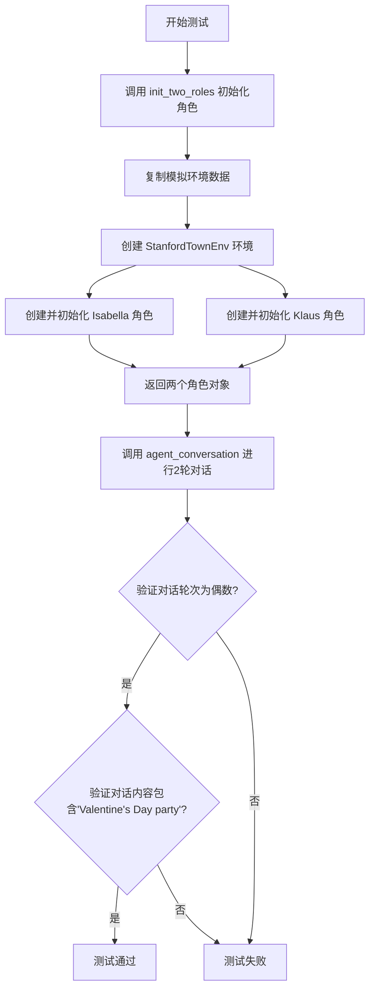
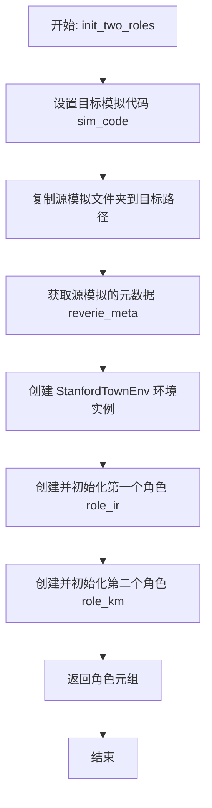
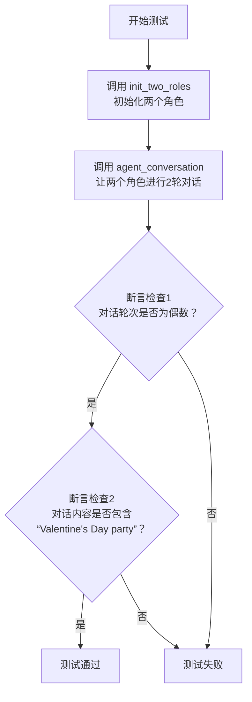
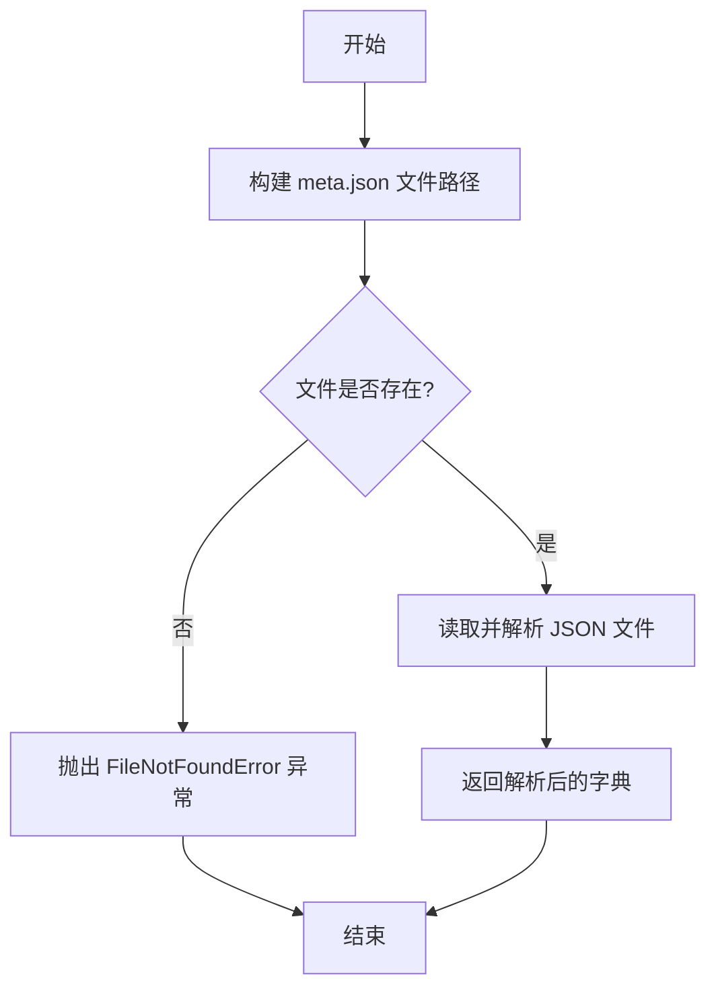
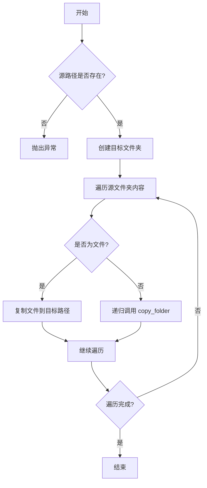
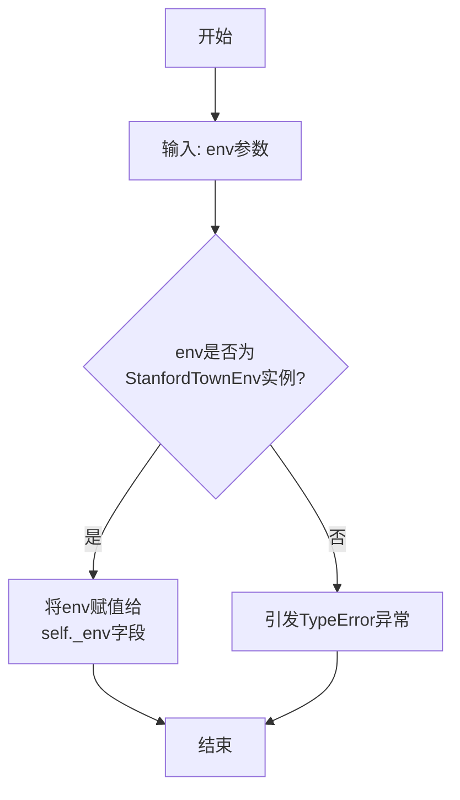
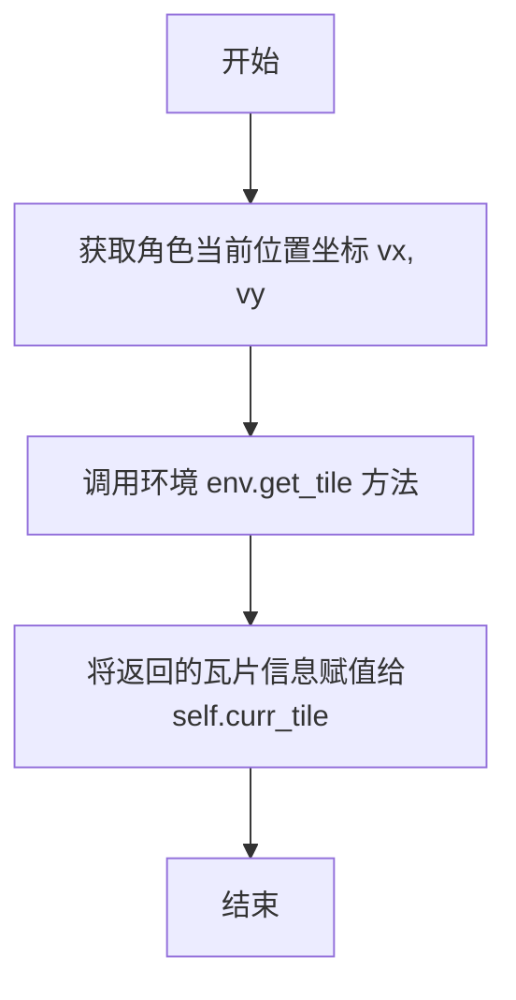

# `.\MetaGPT\tests\metagpt\ext\stanford_town\plan\test_conversation.py` 详细设计文档

该代码是一个针对斯坦福小镇（Stanford Town）智能体对话功能的单元测试。它首先初始化两个具有特定背景和状态的智能体角色（Isabella Rodriguez 和 Klaus Mueller），然后模拟它们之间进行多轮对话，最后验证对话是否按预期发生（例如，包含特定话题）且轮次符合预期。

## 整体流程



## 类结构

```
test_roles_conversation.py (测试模块)
├── 全局函数: init_two_roles
├── 测试函数: test_agent_conversation
├── 外部类: STRole (来自 metagpt.ext.stanford_town.roles.st_role)
└── 外部类: StanfordTownEnv (来自 metagpt.environment)
```

## 全局变量及字段


### `MAZE_ASSET_PATH`
    
迷宫资源文件的存储路径，用于初始化StanfordTownEnv环境。

类型：`Path`
    


### `STORAGE_PATH`
    
模拟数据存储的基础路径，用于复制和读取角色相关的模拟数据。

类型：`Path`
    


### `STRole.name`
    
角色的名称，用于标识和区分不同的模拟角色。

类型：`str`
    


### `STRole.sim_code`
    
模拟代码，标识角色所属的模拟场景或会话。

类型：`str`
    


### `STRole.profile`
    
角色的个人资料或描述，通常与角色名称一致。

类型：`str`
    


### `STRole.step`
    
模拟的当前步数，表示角色在模拟时间线中的位置。

类型：`int`
    


### `STRole.start_time`
    
模拟的开始时间，用于计算和跟踪模拟的时间进度。

类型：`datetime`
    


### `STRole.curr_time`
    
模拟的当前时间，表示角色在模拟中的实时时间点。

类型：`datetime`
    


### `STRole.sec_per_step`
    
每一步模拟代表的真实秒数，用于时间缩放和计算。

类型：`int`
    


### `StanfordTownEnv.maze_asset_path`
    
迷宫资源文件的路径，用于加载和初始化StanfordTownEnv的环境数据。

类型：`Path`
    
    

## 全局函数及方法

### `init_two_roles`

该函数是一个异步工具函数，用于在单元测试中初始化两个特定的 `STRole` 角色实例（Isabella Rodriguez 和 Klaus Mueller）。它通过复制指定的模拟环境数据，加载元数据，并创建配置好的角色对象，为后续的对话测试做准备。

参数：
- `fork_sim_code`：`str`，指定要复制的源模拟环境代码目录名，默认为 `"base_the_ville_isabella_maria_klaus"`。

返回值：`Tuple["STRole"]`，返回一个包含两个已初始化的 `STRole` 实例的元组，顺序为 `(role_ir, role_km)`。

#### 流程图



#### 带注释源码

```python
async def init_two_roles(fork_sim_code: str = "base_the_ville_isabella_maria_klaus") -> Tuple["STRole"]:
    # 1. 定义本次测试使用的模拟环境代码名称
    sim_code = "unittest_sim"

    # 2. 将指定的源模拟环境数据文件夹复制到测试用的目标文件夹
    copy_folder(str(STORAGE_PATH.joinpath(fork_sim_code)), str(STORAGE_PATH.joinpath(sim_code)))

    # 3. 从源模拟环境代码中加载关键的元数据（如时间步、起始时间等）
    reverie_meta = get_reverie_meta(fork_sim_code)
    
    # 4. 定义两个角色的名字
    role_ir_name = "Isabella Rodriguez"
    role_km_name = "Klaus Mueller"

    # 5. 创建 StanfordTown 环境实例，传入迷宫资源路径
    env = StanfordTownEnv(maze_asset_path=MAZE_ASSET_PATH)

    # 6. 创建并初始化第一个角色 (Isabella Rodriguez)
    role_ir = STRole(
        name=role_ir_name,
        sim_code=sim_code,          # 使用新复制的测试环境数据
        profile=role_ir_name,
        step=reverie_meta.get("step"),           # 从元数据获取当前步数
        start_time=reverie_meta.get("start_date"), # 从元数据获取模拟开始时间
        curr_time=reverie_meta.get("curr_time"),   # 从元数据获取当前时间
        sec_per_step=reverie_meta.get("sec_per_step"), # 从元数据获取每步秒数
    )
    role_ir.set_env(env)           # 为角色设置环境
    await role_ir.init_curr_tile() # 异步初始化角色当前所在的位置

    # 7. 创建并初始化第二个角色 (Klaus Mueller)，配置过程与第一个角色相同
    role_km = STRole(
        name=role_km_name,
        sim_code=sim_code,
        profile=role_km_name,
        step=reverie_meta.get("step"),
        start_time=reverie_meta.get("start_date"),
        curr_time=reverie_meta.get("curr_time"),
        sec_per_step=reverie_meta.get("sec_per_step"),
    )
    role_km.set_env(env)
    await role_km.init_curr_tile()

    # 8. 返回初始化完成的两个角色实例
    return role_ir, role_km
```

### `test_agent_conversation`

这是一个使用 `pytest` 编写的异步单元测试函数，用于测试 `agent_conversation` 函数的功能。它首先初始化两个 `STRole` 实例（角色），然后让这两个角色进行两轮对话，最后验证对话结果是否符合预期（对话轮次为偶数，且对话内容中包含特定关键词）。

参数：
- 无显式参数。`pytest` 框架会自动识别并运行此函数。

返回值：`None`，`pytest` 测试函数通常不显式返回值，其通过 `assert` 语句来判定测试是否通过。

#### 流程图



#### 带注释源码

```python
@pytest.mark.asyncio  # 使用pytest的asyncio插件来运行异步测试
async def test_agent_conversation():
    # 1. 初始化两个角色（Isabella Rodriguez 和 Klaus Mueller）
    role_ir, role_km = await init_two_roles()

    # 2. 调用核心测试函数，让两个角色进行2轮对话，并获取对话记录
    curr_chat = await agent_conversation(role_ir, role_km, conv_rounds=2)
    
    # 3. 断言1：验证对话总轮次（utterance数量）是偶数（一来一回）
    assert len(curr_chat) % 2 == 0

    # 4. 断言2：验证对话内容中是否包含特定主题“Valentine's Day party”
    meet = False
    for conv in curr_chat:
        # conv 是一个元组 (speaker, utterance)
        if "Valentine's Day party" in conv[1]:
            # 如果任意一句对话中包含关键词，则标记为满足条件
            meet = True
    assert meet  # 最终断言必须满足条件
```

### `agent_conversation`

`agent_conversation` 函数用于模拟两个角色之间的对话交互。它通过指定的对话轮次，让两个角色依次进行发言，生成对话记录。该函数主要用于测试和模拟角色间的社交互动，确保对话逻辑和内容符合预期。

参数：

- `role_a`：`STRole`，第一个参与对话的角色实例
- `role_b`：`STRole`，第二个参与对话的角色实例
- `conv_rounds`：`int`，对话的总轮次数，每轮包含两个角色的各一次发言

返回值：`list`，返回一个列表，其中每个元素是一个元组 `(speaker_name, utterance)`，表示发言者的名称和发言内容

#### 流程图

```mermaid
graph TD
    A[开始] --> B[初始化空对话列表 curr_chat]
    B --> C{对话轮次 conv_rounds > 0?}
    C -->|是| D[角色A生成发言 utterance_a]
    D --> E[将 (role_a.name, utterance_a) 加入 curr_chat]
    E --> F[角色B生成发言 utterance_b]
    F --> G[将 (role_b.name, utterance_b) 加入 curr_chat]
    G --> H[conv_rounds 减1]
    H --> C
    C -->|否| I[返回 curr_chat]
    I --> J[结束]
```

#### 带注释源码

```python
async def agent_conversation(role_a: STRole, role_b: STRole, conv_rounds: int) -> list:
    """
    模拟两个角色之间的对话。

    参数:
        role_a (STRole): 第一个参与对话的角色。
        role_b (STRole): 第二个参与对话的角色。
        conv_rounds (int): 对话的总轮次数。

    返回:
        list: 对话记录列表，每个元素为 (speaker_name, utterance) 的元组。
    """
    curr_chat = []  # 初始化一个空列表来存储对话记录
    while conv_rounds > 0:  # 当还有剩余的对话轮次时
        # 角色A生成发言
        utterance_a = await role_a.gen_conversation(role_b, curr_chat)
        # 将角色A的发言记录添加到对话列表中
        curr_chat.append([role_a.name, utterance_a])
        
        # 角色B生成发言
        utterance_b = await role_b.gen_conversation(role_a, curr_chat)
        # 将角色B的发言记录添加到对话列表中
        curr_chat.append([role_b.name, utterance_b])
        
        conv_rounds -= 1  # 完成一轮对话，减少剩余轮次
    
    return curr_chat  # 返回完整的对话记录
```

### `get_reverie_meta`

该函数用于从指定的模拟代码（sim_code）中加载并解析Reverie元数据文件（`reverie/meta.json`），返回一个包含模拟配置信息的字典。

参数：

- `sim_code`：`str`，模拟环境的唯一标识符，用于定位存储路径下的特定文件夹。

返回值：`dict`，包含从`meta.json`文件中解析出的模拟配置信息，例如当前步数（step）、开始日期（start_date）、当前时间（curr_time）和每步秒数（sec_per_step）等。

#### 流程图



#### 带注释源码

```python
def get_reverie_meta(sim_code: str) -> dict:
    """
    加载并返回指定 sim_code 对应的 reverie 元数据。

    参数:
        sim_code (str): 模拟环境的唯一标识符。

    返回:
        dict: 包含模拟配置信息的字典。

    异常:
        FileNotFoundError: 如果对应的 meta.json 文件不存在。
    """
    # 构建 meta.json 文件的完整路径
    meta_file = STORAGE_PATH / sim_code / "reverie" / "meta.json"
    
    # 检查文件是否存在，如果不存在则抛出异常
    if not meta_file.exists():
        raise FileNotFoundError(f"Meta file not found: {meta_file}")
    
    # 读取文件内容并解析为 JSON 格式的字典
    with open(meta_file, "r") as file:
        meta_data = json.load(file)
    
    # 返回解析后的元数据字典
    return meta_data
```

### `copy_folder`

该函数用于将一个文件夹及其所有内容复制到另一个位置。

参数：

- `src`：`str`，源文件夹的路径
- `dst`：`str`，目标文件夹的路径

返回值：`None`，无返回值

#### 流程图



#### 带注释源码

```python
def copy_folder(src: str, dst: str) -> None:
    """
    递归复制文件夹及其所有内容到目标位置。

    参数:
        src (str): 源文件夹路径
        dst (str): 目标文件夹路径

    返回:
        None
    """
    import os
    import shutil

    # 检查源文件夹是否存在
    if not os.path.exists(src):
        raise FileNotFoundError(f"源文件夹不存在: {src}")

    # 创建目标文件夹
    os.makedirs(dst, exist_ok=True)

    # 遍历源文件夹中的所有条目
    for item in os.listdir(src):
        src_path = os.path.join(src, item)  # 源条目完整路径
        dst_path = os.path.join(dst, item)  # 目标条目完整路径

        # 如果是文件，直接复制
        if os.path.isfile(src_path):
            shutil.copy2(src_path, dst_path)  # 复制文件并保留元数据
        # 如果是文件夹，递归复制
        elif os.path.isdir(src_path):
            copy_folder(src_path, dst_path)  # 递归调用自身处理子文件夹
```

### `STRole.set_env`

该方法用于为 `STRole` 实例设置其运行环境，即一个 `StanfordTownEnv` 对象。它将该环境实例赋值给角色的内部字段，使角色能够在后续操作中感知和交互于该环境。

参数：

- `env`：`StanfordTownEnv`，角色将要被放置和交互的斯坦福小镇环境实例。

返回值：`None`，此方法不返回任何值。

#### 流程图



#### 带注释源码

```python
def set_env(self, env: "StanfordTownEnv"):
    """
    设置角色的运行环境。

    此方法将一个StanfordTownEnv环境实例与当前角色关联起来。
    角色后续的所有环境感知和交互操作都将基于此环境进行。

    Args:
        env (StanfordTownEnv): 要设置的环境实例。

    Raises:
        TypeError: 如果传入的env参数不是StanfordTownEnv类型。
    """
    # 将传入的环境实例赋值给角色的内部_env字段。
    # 这建立了角色与特定环境之间的关联。
    self._env = env
```

### `STRole.init_curr_tile`

该方法用于初始化角色当前所在的瓦片（tile）。它通过调用环境（`StanfordTownEnv`）的`get_tile`方法，根据角色的当前位置坐标（`vx`和`vy`）获取对应的瓦片信息，并将其赋值给角色的`curr_tile`属性。

参数：
-  `self`：`STRole`，当前角色实例

返回值：`None`，无返回值

#### 流程图



#### 带注释源码

```python
async def init_curr_tile(self):
    """
    初始化角色当前所在的瓦片。
    通过环境获取角色当前位置对应的瓦片信息。
    """
    # 调用环境实例的 get_tile 方法，传入角色的 x 坐标 (vx) 和 y 坐标 (vy)
    # 获取角色当前所在的瓦片对象
    self.curr_tile = await self.env.get_tile(self.vx, self.vy)
```

## 关键组件


### STRole (Stanford Town Role)

代表斯坦福小镇模拟环境中的一个智能体角色，包含角色的基本信息（如姓名、个人资料）、模拟状态（如当前时间、步数）以及环境交互能力，是对话和行为模拟的核心实体。

### StanfordTownEnv (Stanford Town Environment)

提供斯坦福小镇模拟的底层环境，管理迷宫资产和空间信息，为角色提供移动、感知和交互的上下文。

### agent_conversation

协调两个STRole角色之间的对话过程，控制对话轮次，管理对话历史，并返回结构化的对话记录。

### get_reverie_meta

从指定的模拟代码中加载并返回关键的元数据（如模拟步数、开始时间、当前时间、每秒步数），用于初始化角色的模拟状态。

### copy_folder

用于在测试前复制整个模拟数据文件夹，为单元测试创建一个独立的、不影响原始数据的模拟环境副本。


## 问题及建议


### 已知问题

-   **测试数据管理混乱**：`init_two_roles` 函数在每次测试前都会复制整个模拟文件夹 (`copy_folder`)，这可能导致测试间数据污染、测试执行速度慢，并且依赖外部文件系统状态，降低了测试的可靠性和可重复性。
-   **硬编码的测试断言**：测试断言依赖于对话内容中必须包含特定字符串 `"Valentine's Day party"`。这种硬编码的断言非常脆弱，一旦底层业务逻辑或测试数据发生变化，测试就会失败，且无法清晰反映失败的具体原因。
-   **资源未妥善清理**：测试函数 `test_agent_conversation` 在执行后没有清理 `init_two_roles` 中创建的临时模拟文件夹 (`unittest_sim`)。这会在存储路径中留下垃圾数据，长期运行可能导致磁盘空间浪费或影响后续测试。
-   **异步测试标记冗余**：虽然使用了 `@pytest.mark.asyncio` 装饰器，但测试函数名并未以 `async def` 开头（代码中显示为 `async def test_agent_conversation()`，但格式说明可能遗漏），如果实际未使用 `async def`，则此标记无效。若已使用，则需确保 pytest-asyncio 插件正确配置。
-   **初始化函数职责过重且复用性差**：`init_two_roles` 函数集成了环境创建、角色初始化、数据复制等多个职责，并且硬编码了角色名称 (`Isabella Rodriguez`, `Klaus Mueller`) 和模拟代码 (`unittest_sim`)。这使其难以被其他测试用例复用（例如测试不同角色组合或不同初始状态）。

### 优化建议

-   **使用测试固件和临时目录**：利用 pytest 的 `tmp_path` 固件来创建独立的临时目录作为每次测试的 `sim_code` 路径。这可以确保测试隔离，并在测试结束后自动清理，解决数据污染和资源清理问题。
-   **重构初始化逻辑，提高可配置性和复用性**：将 `init_two_roles` 函数重构为一个更通用的角色初始化工厂函数。允许通过参数传入角色名称、模拟代码、初始状态等，使其能够适应不同的测试场景。
-   **采用更健壮、可读性更高的断言**：避免对具体的对话内容进行硬编码断言。可以改为断言对话轮次符合预期（如 `conv_rounds=2` 则对话列表长度为4）、断言对话双方交替发言、或者从业务逻辑层面定义更稳定的成功条件（例如“两个角色成功建立了对话”并检查返回的 `curr_chat` 结构）。
-   **明确异步测试配置**：确保测试函数正确定义为 `async def`，并检查项目依赖中是否包含 `pytest-asyncio`。可以考虑在 `pytest.ini` 或 `conftest.py` 中全局配置异步支持，避免在每个测试函数上重复标记。
-   **引入模拟（Mock）以减少外部依赖**：对于 `StanfordTownEnv`、`get_reverie_meta`、`copy_folder` 等外部依赖，考虑在单元测试中使用 `unittest.mock` 来模拟它们的行为。这可以将测试焦点完全集中在 `agent_conversation` 函数的逻辑上，使测试更快、更稳定，并消除对特定文件结构和内容的依赖。
-   **添加更多边界和异常情况测试**：当前测试只覆盖了“正常对话”场景。建议补充测试用例，例如：测试 `conv_rounds=0` 或负数的边界情况、测试角色无法相遇时的行为、测试传入无效角色对象时的异常处理等。


## 其它


### 设计目标与约束

本代码模块的核心设计目标是提供一个可复用的单元测试框架，用于验证斯坦福小镇（Stanford Town）扩展中两个智能体（角色）之间的对话功能。主要约束包括：1) 依赖外部数据文件（如迷宫资产和模拟存储路径），要求测试环境具备特定的目录结构和文件；2) 异步执行模型，要求测试框架支持异步操作；3) 测试数据隔离，通过复制模拟代码目录来避免污染原始数据；4) 功能验证，不仅测试对话流程的完整性，还验证对话内容中包含预期的关键词。

### 错误处理与异常设计

代码中显式的错误处理较少，主要依赖pytest框架来捕获和报告测试失败（如断言失败）。潜在的错误点包括：1) `copy_folder` 操作可能因源目录不存在或权限问题而失败；2) `get_reverie_meta` 可能无法正确解析元数据文件；3) 角色初始化（如 `init_curr_tile`）可能因环境数据问题而失败；4) `agent_conversation` 函数内部可能产生异常。当前设计将这些潜在异常向上抛出，由测试框架处理，这符合单元测试的常见模式。对于更健壮的测试套件，可以考虑添加更具体的异常捕获和清理逻辑。

### 数据流与状态机

1.  **初始化阶段**：通过 `init_two_roles` 函数，复制指定的模拟数据目录 -> 加载该模拟的元数据（`reverie_meta`） -> 创建共享的 `StanfordTownEnv` 环境实例 -> 使用元数据初始化两个 `STRole` 角色对象 -> 为每个角色设置环境并初始化其当前所在位置（`init_curr_tile`）。此阶段将测试环境与数据准备就绪。
2.  **对话执行阶段**：在 `test_agent_conversation` 函数中，调用 `agent_conversation` 函数，传入两个初始化好的角色和对话轮数（`conv_rounds=2`）。该函数内部驱动两个角色按照其行为模型进行多轮对话，并返回对话记录列表 `curr_chat`。
3.  **验证阶段**：首先验证返回的对话记录条数为偶数（确保对话有来有回）。然后遍历对话记录，检查是否有任何一条发言（`utterance`）包含预期关键词 "Valentine's Day party"，以此验证对话内容符合特定场景预期。

### 外部依赖与接口契约

1.  **文件系统**：依赖 `STORAGE_PATH` 和 `MAZE_ASSET_PATH` 定义的目录结构。`copy_folder` 操作要求源目录存在且可读，目标目录可写。
2.  **元数据接口**：`get_reverie_meta` 函数是获取模拟元数据的关键接口，它接受一个 `sim_code` 字符串，返回一个包含 `step`, `start_date`, `curr_time`, `sec_per_step` 等键的字典。测试代码依赖于该字典的结构和内容。
3.  **角色类（STRole）**：测试代码与 `STRole` 类有强耦合，依赖于其构造函数参数（`name`, `sim_code`, `profile`, `step`, `start_time`, `curr_time`, `sec_per_step`）、`set_env` 方法以及异步的 `init_curr_tile` 方法。`agent_conversation` 函数也接受 `STRole` 实例作为参数。
4.  **环境类（StanfordTownEnv）**：依赖其构造函数，需要传入 `maze_asset_path`。
5.  **对话函数**：`agent_conversation` 函数是核心测试目标，其接口契约为：接受两个 `STRole` 实例和一个整数 `conv_rounds`，返回一个列表，列表每个元素是一个元组 `(speaker_name, utterance)`。
6.  **测试框架**：依赖 `pytest` 和 `pytest.mark.asyncio` 来运行异步测试用例。

    