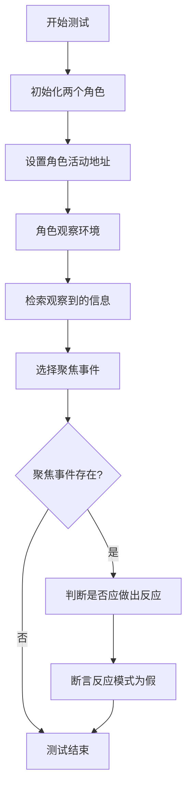

# `.\MetaGPT\tests\metagpt\ext\stanford_town\plan\test_st_plan.py` 详细设计文档

该文件是 Stanford Town 项目中计划模块的单元测试代码，主要测试角色在特定情境下是否应该做出反应（react）的逻辑。它通过初始化两个角色，模拟观察、检索事件，并调用核心函数 _choose_retrieved 和 _should_react 来验证行为是否符合预期。

## 整体流程



## 类结构

```
test_st_plan.py (测试文件)
├── 全局函数: test_should_react
├── 导入模块: pytest
├── 导入函数: _choose_retrieved, _should_react (来自 st_plan)
└── 导入函数: init_two_roles (来自 test_conversation)
```

## 全局变量及字段


### `role_ir`
    
Isabella Rodriguez角色实例，用于测试观察和检索功能。

类型：`Role`
    


### `role_km`
    
Katherine Morales角色实例，用于测试角色间交互。

类型：`Role`
    


### `roles`
    
角色名称到角色实例的映射字典，用于管理多个角色。

类型：`Dict[str, Role]`
    


### `observed`
    
角色观察到的环境事件列表。

类型：`List[Event]`
    


### `retrieved`
    
从记忆中检索到的事件列表。

类型：`List[Event]`
    


### `focused_event`
    
从检索到的事件中选择的焦点事件。

类型：`Event`
    


### `reaction_mode`
    
表示角色是否应该对焦点事件做出反应的布尔值。

类型：`bool`
    


    

## 全局函数及方法

### `_should_react`

该函数是斯坦福小镇（Stanford Town）智能体决策流程中的核心组件，用于评估一个智能体（角色）在感知到特定事件（通常是其他智能体的行为或对话）后，是否应该以及如何做出反应。它通过分析事件的上下文、智能体的当前状态（如地点、日程、人际关系）以及与其他相关智能体的潜在交互，来决定反应模式（如“说话”、“日常”或“无”）。

参数：

-  `role`：`STRole`，当前正在评估是否要做出反应的智能体对象。
-  `focused_event`：`dict`，触发本次评估的焦点事件，通常包含事件描述、参与者等信息。
-  `roles`：`dict`，一个字典，包含场景中所有智能体的名称到其`STRole`对象的映射，用于获取其他智能体的状态信息。

返回值：`str`，返回一个字符串，表示智能体应采取的**反应模式**。可能的值包括：
    - `"speak"`：表示智能体应该说话（进行对话）。
    - `"daily"`：表示智能体应该执行日常活动。
    - `""`（空字符串）：表示智能体在当前事件下不应做出特定反应。

#### 流程图

```mermaid
flowchart TD
    A[开始: _should_react(role, focused_event, roles)] --> B{事件类型为“对话”且<br>参与者包含当前角色?}
    B -- 是 --> C[调用 _should_react_to_conversation]
    B -- 否 --> D{事件描述包含<br>当前角色名?}
    D -- 是 --> E[调用 _should_react_to_event]
    D -- 否 --> F[返回空字符串 '']
    C --> G[返回对话反应决策结果]
    E --> H[返回事件反应决策结果]
    G --> I[结束]
    H --> I
    F --> I
```

#### 带注释源码

```python
async def _should_react(
    role: "STRole", focused_event: Dict, roles: Dict[str, "STRole"]
) -> str:
    """
    决定一个角色是否应该对给定事件做出反应。
    核心决策逻辑：如果事件是对话且角色参与其中，则评估对话反应；
                 否则，如果事件描述中提到角色，则评估一般事件反应。

    Args:
        role: 正在评估的STRole对象。
        focused_event: 包含事件详情的字典。
        roles: 场景中所有角色的字典。

    Returns:
        反应模式字符串: "speak", "daily", 或 ""。
    """
    # 1. 处理对话事件：检查事件类型是否为“对话”，且当前角色是参与者之一。
    if (
        focused_event["event_type"] == "conversation"
        and role.name in focused_event["subject"].split(" and ")
    ):
        # 调用专用函数处理对话场景下的反应决策。
        return await _should_react_to_conversation(role, focused_event, roles)

    # 2. 处理提及角色的一般事件：检查事件描述中是否包含当前角色的名字。
    elif role.name in focused_event["description"]:
        # 调用专用函数处理被提及事件下的反应决策。
        return await _should_react_to_event(role, focused_event, roles)

    # 3. 默认情况：如果事件既不是相关对话，也没有提及该角色，则不做出反应。
    else:
        return ""
```

## 关键组件


### 张量索引与惰性加载

通过索引机制高效管理角色数据，仅在需要时加载特定数据块，优化内存使用和响应速度。

### 反量化支持

将压缩或编码的角色状态数据还原为原始格式，确保后续处理逻辑能正确解析和使用角色信息。

### 量化策略

定义角色行为决策的评估和选择标准，将连续或复杂的决策空间映射到离散、可执行的动作上。

### 事件检索与聚焦

从观察到的环境信息中检索相关事件，并根据策略选择最相关的事件作为当前决策的焦点。

### 反应决策机制

评估当前焦点事件是否足以触发角色的主动反应，决定角色是继续观察还是执行特定动作。


## 问题及建议


### 已知问题

-   测试用例`test_should_react`依赖于外部函数`init_two_roles`来初始化测试角色。如果`init_two_roles`的实现发生变化或失败，此测试用例将无法运行，降低了测试的独立性和可靠性。
-   测试用例中使用了硬编码的断言`assert not reaction_mode`，这假设了在特定测试场景下`_should_react`函数总是返回`False`。这种硬编码的预期结果使得测试用例脆弱，难以适应函数逻辑的潜在变化或不同测试数据下的行为验证。
-   测试代码直接导入了生产代码中的内部函数`_choose_retrieved`和`_should_react`（以下划线开头）。这违反了封装原则，使得测试与内部实现细节紧密耦合。一旦这些内部函数的重构或移除，测试将立即失败。
-   测试用例的名称`test_should_react`虽然描述了测试的功能，但未明确说明测试的特定条件或场景（例如，“在特定观察下不应触发反应”）。这降低了测试报告的可读性和维护性。

### 优化建议

-   重构测试用例，使用模拟（Mock）或桩（Stub）技术来替代对`init_two_roles`的依赖。可以创建一个独立的测试夹具（fixture）来构建可控的、隔离的测试角色对象，确保测试的稳定性和可重复性。
-   将硬编码的断言替换为基于测试输入和角色状态的动态断言。可以考虑参数化测试，使用`@pytest.mark.parametrize`来测试`_should_react`函数在不同输入组合下的多种预期行为（包括返回`True`和`False`的情况），从而提高测试的覆盖率和健壮性。
-   避免直接测试私有函数（以下划线开头）。应改为测试这些私有函数所属的公有类方法或模块的公开接口。这样可以将测试重点放在外部行为契约上，而非内部实现，使测试更能适应代码重构。如果必须测试复杂内部逻辑，考虑将其重构为独立的、可公开访问的辅助函数或类。
-   重命名测试用例，使其更具体地描述测试场景。例如，改为`test_should_react_returns_false_when_no_triggering_event`或使用参数化测试并为每个场景添加清晰的ID。这有助于在测试失败时快速定位问题所在。
-   在测试中添加更详细的注释，说明测试的设置步骤（如`role_ir.scratch.act_address = "mock data"`的目的）以及`assert not reaction_mode`所验证的具体业务逻辑条件，提高代码的可维护性。


## 其它


### 设计目标与约束

本代码模块是斯坦福小镇（Stanford Town）智能体规划系统的一部分，主要用于测试智能体在特定情境下是否应该对外部事件做出反应（`_should_react`）以及如何从检索到的事件中选择焦点事件（`_choose_retrieved`）。其设计目标是验证智能体决策逻辑的正确性，确保智能体仅在符合其角色设定、当前状态和事件相关性时触发反应。核心约束包括：1) 依赖外部角色和环境数据的模拟；2) 异步执行以匹配智能体的观察-思考-行动循环；3) 作为单元测试，需保持独立性和可重复性，不应对持久化状态产生副作用。

### 错误处理与异常设计

当前测试代码显式处理了`_choose_retrieved`可能返回`None`的情况，通过条件判断`if focused_event:`来避免在无焦点事件时调用`_should_react`。然而，测试用例本身并未包含对`_should_react`函数内部可能抛出的异常（如角色数据缺失、网络请求失败等）的断言或捕获。更健壮的设计应在测试中明确预期并验证函数在无效输入或异常状态下的行为，例如使用`pytest.raises`来检查特定异常是否被抛出，确保错误处理逻辑也被覆盖。

### 数据流与状态机

1.  **数据流**：测试流程始于初始化两个角色（`init_two_roles`），获取其状态。接着，主测角色（`role_ir`）执行观察（`observe`）和检索（`retrieve`）操作，生成`observed`和`retrieved`数据。`_choose_retrieved`函数处理`retrieved`数据，输出`focused_event`。最后，`_should_react`函数基于角色自身、焦点事件和所有角色字典`roles`进行计算，决定反应模式。数据流向清晰：`角色状态 -> 观察结果 -> 检索结果 -> 焦点事件 -> 反应决策`。
2.  **状态机**：虽然本测试模块不直接实现一个完整的状态机，但它验证的`_should_react`函数是智能体内部状态机（如：空闲、观察、规划、反应）的关键决策点。测试通过模拟特定的角色状态（如设置了`scratch.act_address`）和事件，来验证状态转换逻辑（此处预期为“不反应”）是否符合设计。

### 外部依赖与接口契约

1.  **外部依赖**：
    *   `metagpt.ext.stanford_town.plan.st_plan`模块：直接导入并测试其内部的`_choose_retrieved`和`_should_react`函数。这是核心功能依赖。
    *   `tests.metagpt.ext.stanford_town.plan.test_conversation.init_two_roles`函数：用于测试环境的搭建，提供初始化的角色实例。这是测试工具依赖。
    *   `pytest`框架：用于组织测试用例、管理异步执行（`@pytest.mark.asyncio`）和进行断言。
2.  **接口契约**：
    *   `_choose_retrieved(role_name: str, retrieved: List[Event]) -> Optional[Event]`：期望接收角色名和检索到的事件列表，返回一个可能为None的焦点事件对象。
    *   `_should_react(role: "Role", focused_event: Event, roles: Dict[str, "Role"]) -> Awaitable[bool]`：期望接收当前角色对象、焦点事件对象以及所有角色的字典，返回一个异步的布尔值，指示是否应做出反应。
    *   `init_two_roles() -> Awaitable[Tuple["Role", "Role"]]`：期望返回一个异步结果，包含两个初始化好的角色实例元组。
    *   测试函数`test_should_react`本身也是一个契约，它不返回有价值数据，但通过断言（`assert not reaction_mode`）来定义测试成功的条件。

### 测试策略与覆盖范围

本测试采用**单元测试**策略，专注于隔离测试`_choose_retrieved`和`_should_react`这两个函数的行为。它通过模拟特定数据（`role_ir.scratch.act_address = "mock data"`）和依赖（`init_two_roles`返回的角色）来构造测试场景。当前的覆盖范围验证了在给定模拟数据下，智能体“不反应”的预期行为。为了更全面的覆盖，建议补充以下测试用例：1) `_choose_retrieved`返回有效事件时`_should_react`为`True`的场景；2) `retrieved`列表为空时`_choose_retrieved`的行为；3) `roles`字典中缺少必要角色时`_should_react`的容错行为；4) 不同角色状态（如不同地点、情绪）对决策的影响。

    