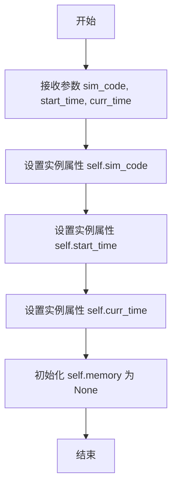
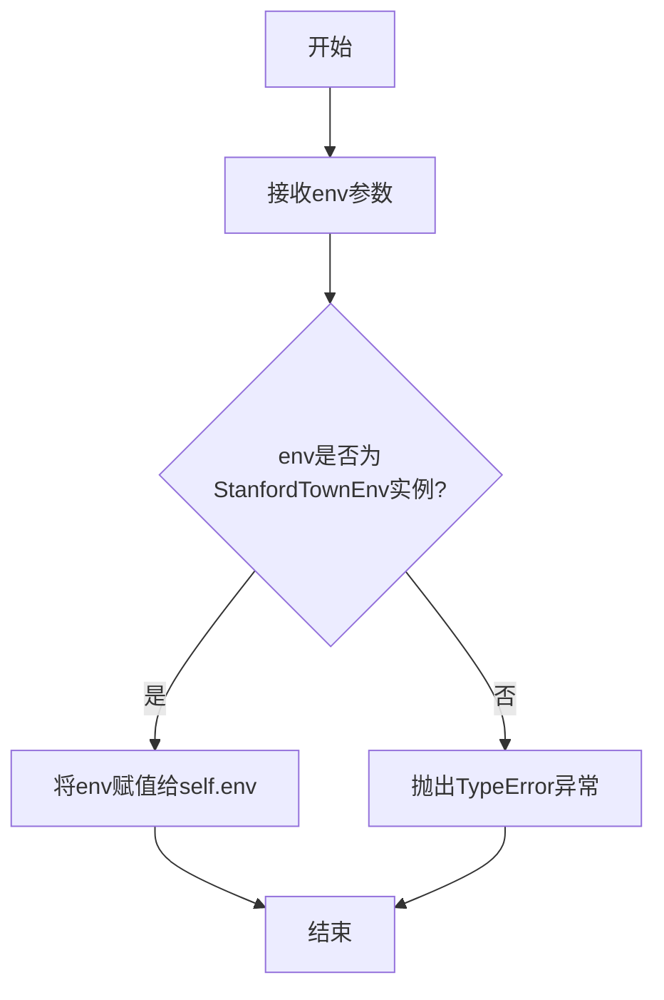
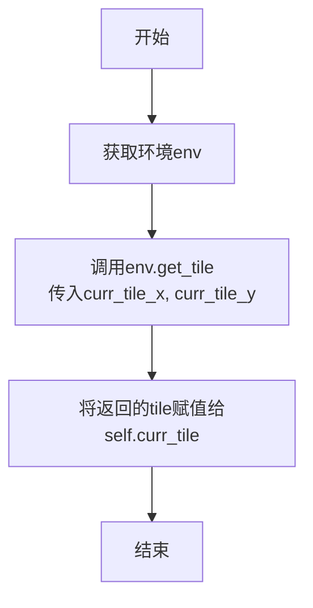
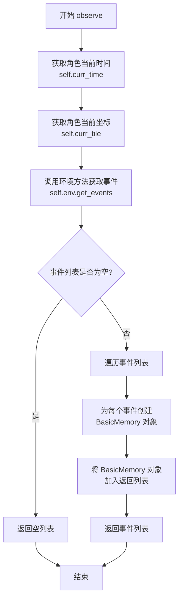
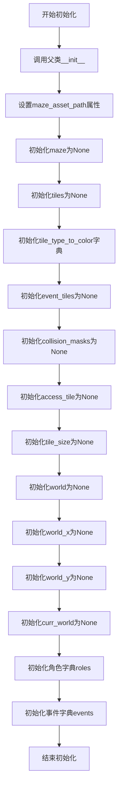

# `.\MetaGPT\tests\metagpt\ext\stanford_town\roles\test_st_role.py` 详细设计文档

该文件是 STRole 角色的单元测试，主要测试 STRole 在特定环境下的观察功能。它创建了一个 STRole 实例，设置其环境，初始化其当前位置，然后调用 observe 方法获取环境事件，并验证返回的事件是 BasicMemory 类型且不为空。

## 整体流程

```mermaid
graph TD
    A[开始测试] --> B[创建 STRole 实例]
    B --> C[设置 StanfordTownEnv 环境]
    C --> D[初始化角色当前位置]
    D --> E[调用 role.observe() 方法]
    E --> F{验证返回结果}
    F -- 结果非空且为 BasicMemory 类型 --> G[测试通过]
    F -- 否则 --> H[测试失败]
```

## 类结构

```
测试文件结构
├── 全局导入模块
├── 全局测试函数 test_observe
└── 引用的外部类
    ├── STRole
    ├── StanfordTownEnv
    ├── BasicMemory
    └── 常量 MAZE_ASSET_PATH
```

## 全局变量及字段


### `MAZE_ASSET_PATH`
    
迷宫资源文件的路径，用于加载Stanford Town环境中的地图数据。

类型：`str`
    


    

## 全局函数及方法

### `STRole.observe`

该方法用于让角色（STRole）观察其当前环境，并返回观察到的环境事件列表。这些事件以`BasicMemory`对象的形式返回，代表了角色在当前时间点感知到的环境状态或发生的事件。

参数：
- 无显式参数（实例方法，通过`self`访问实例属性）

返回值：`List[BasicMemory]`，返回一个包含观察到的环境事件的列表，每个事件都是一个`BasicMemory`对象。

#### 流程图

```mermaid
flowchart TD
    A[开始] --> B[获取角色当前坐标<br>self.curr_tile]
    B --> C[获取角色当前时间<br>self.curr_time]
    C --> D[调用环境方法<br>self.env.get_events_at]
    D --> E[传入坐标和时间<br>获取环境事件]
    E --> F[返回事件列表<br>List[BasicMemory]]
    F --> G[结束]
```

#### 带注释源码

```python
async def observe(self) -> List[BasicMemory]:
    """
    观察当前环境，返回在角色当前位置和当前时间发生的事件。
    
    该方法通过查询环境（StanfordTownEnv）来获取在角色当前坐标（curr_tile）
    和当前时间（curr_time）下发生的事件。这些事件以BasicMemory对象的形式返回，
    代表了角色感知到的环境状态。
    
    Returns:
        List[BasicMemory]: 观察到的环境事件列表。
    """
    # 获取角色当前所在的坐标（瓦片位置）
    curr_tile = self.curr_tile
    # 获取当前时间
    curr_time = self.curr_time
    # 调用环境对象的get_events_at方法，传入坐标和时间，获取该位置该时间发生的事件
    # 返回的事件列表中的每个元素都是BasicMemory类型
    ret_events = self.env.get_events_at(
        curr_tile, curr_time
    )
    return ret_events
```

### `STRole.__init__`

该方法用于初始化 `STRole` 类的实例，设置角色的基本属性，包括模拟代码、开始时间和当前时间，并初始化角色的记忆组件。

参数：

- `sim_code`：`str`，模拟环境的代码标识符，用于指定角色所在的模拟环境。
- `start_time`：`str`，模拟环境的开始时间，表示角色活动的起始时间点。
- `curr_time`：`str`，角色的当前时间，表示角色在模拟环境中的当前时间点。

返回值：`None`，无返回值。

#### 流程图



#### 带注释源码

```python
def __init__(self, sim_code: str, start_time: str, curr_time: str):
    """
    初始化 STRole 实例。

    Args:
        sim_code (str): 模拟环境的代码标识符。
        start_time (str): 模拟环境的开始时间。
        curr_time (str): 角色的当前时间。
    """
    self.sim_code = sim_code  # 设置模拟环境代码
    self.start_time = start_time  # 设置开始时间
    self.curr_time = curr_time  # 设置当前时间
    self.memory = None  # 初始化记忆组件为 None，后续可能通过其他方法设置
```

### `STRole.set_env`

该方法用于为`STRole`角色实例设置其运行环境，即一个`StanfordTownEnv`环境实例。通过此方法，角色可以访问并感知环境中的信息，如地图、其他角色等。

参数：

- `env`：`StanfordTownEnv`，一个斯坦福小镇环境实例，包含角色运行所需的地图、空间信息和其他环境状态。

返回值：`None`，该方法不返回任何值。

#### 流程图



#### 带注释源码

```python
def set_env(self, env: StanfordTownEnv):
    """
    设置角色的运行环境。
    
    参数:
        env (StanfordTownEnv): 斯坦福小镇环境实例。
    
    异常:
        TypeError: 如果传入的env不是StanfordTownEnv类型。
    """
    # 检查传入的环境实例是否为StanfordTownEnv类型
    if not isinstance(env, StanfordTownEnv):
        raise TypeError("env must be an instance of StanfordTownEnv")
    
    # 将环境实例赋值给角色的env属性
    self.env = env
```

### `STRole.init_curr_tile`

该方法用于初始化角色当前所在的瓦片（tile）。它通过调用环境（`env`）的`get_tile`方法，根据角色的当前坐标（`curr_tile_x`和`curr_tile_y`）获取对应的瓦片信息，并将其赋值给角色的`curr_tile`属性。

参数：
- 无显式参数（方法内部使用`self`访问实例属性）

返回值：`None`，无返回值

#### 流程图



#### 带注释源码

```python
async def init_curr_tile(self):
    """
    初始化角色当前所在的瓦片。
    通过环境获取角色坐标对应的瓦片，并赋值给curr_tile属性。
    """
    self.curr_tile = self.env.get_tile(self.curr_tile_x, self.curr_tile_y)
```

### `STRole.observe`

该方法用于让角色（`STRole`）观察其当前环境，并返回一个包含其感知到的事件（`BasicMemory` 对象）的列表。这些事件代表了角色在当前时间点、基于其所在位置（`curr_tile`）所能感知到的环境变化或活动。

参数：
-  `self`：`STRole`，`STRole` 类的实例，代表执行观察行为的角色。

返回值：`List[BasicMemory]`，一个列表，包含角色在当前时间点感知到的所有事件，每个事件都是一个 `BasicMemory` 对象。

#### 流程图



#### 带注释源码

```python
async def observe(self) -> List[BasicMemory]:
    """
    让角色观察其当前环境。
    该方法会获取角色当前时间（`curr_time`）和位置（`curr_tile`），
    然后从环境（`self.env`）中查询在该时间和地点发生的事件。
    这些事件被封装成 `BasicMemory` 对象并返回。

    Returns:
        List[BasicMemory]: 一个列表，包含角色感知到的所有事件。
    """
    # 获取角色当前的游戏内时间
    curr_time = self.curr_time
    # 获取角色当前的坐标位置
    curr_tile = self.curr_tile

    # 调用环境实例的方法，获取在指定时间和地点发生的事件。
    # 返回的是一个事件对象的列表。
    events = self.env.get_events(curr_tile, curr_time)

    # 初始化一个空列表，用于存储封装好的记忆对象。
    ret_events = []

    # 遍历从环境中获取的每一个事件。
    for event in events:
        # 将每个原生事件对象封装成一个 `BasicMemory` 记忆对象。
        # `BasicMemory` 可能包含事件的描述、类型、参与者等更结构化的信息。
        memory = BasicMemory(event)
        # 将创建的记忆对象添加到返回列表中。
        ret_events.append(memory)

    # 返回包含所有感知事件的记忆列表。
    return ret_events
```

### `StanfordTownEnv.__init__`

该方法用于初始化StanfordTownEnv环境实例，主要功能是设置迷宫资产路径、初始化环境状态、加载迷宫数据以及准备角色和事件管理所需的内部数据结构。

参数：

- `maze_asset_path`：`str`，迷宫资产文件的路径，用于加载迷宫配置和地图数据
- `*args`：`tuple`，可变位置参数，用于传递给父类的初始化方法
- `**kwargs`：`dict`，可变关键字参数，用于传递给父类的初始化方法

返回值：`None`，无返回值

#### 流程图



#### 带注释源码

```python
def __init__(self, maze_asset_path: str, *args, **kwargs):
    """
    初始化StanfordTownEnv环境
    
    Args:
        maze_asset_path: 迷宫资产文件路径
        *args: 传递给父类的可变位置参数
        **kwargs: 传递给父类的可变关键字参数
    """
    # 调用父类Environment的初始化方法
    super().__init__(*args, **kwargs)
    
    # 设置迷宫资产路径
    self.maze_asset_path = maze_asset_path
    
    # 初始化迷宫相关属性
    self.maze = None          # 迷宫数据结构
    self.tiles = None         # 迷宫瓦片数据
    self.tile_type_to_color = {}  # 瓦片类型到颜色的映射
    self.event_tiles = None   # 事件瓦片数据
    self.collision_masks = None  # 碰撞掩码
    self.access_tile = None   # 可访问瓦片
    self.tile_size = None     # 瓦片大小
    
    # 初始化世界相关属性
    self.world = None         # 世界地图
    self.world_x = None       # 世界X轴大小
    self.world_y = None       # 世界Y轴大小
    self.curr_world = None    # 当前世界状态
    
    # 初始化角色和事件管理
    self.roles = {}           # 角色字典，key为角色名，value为角色对象
    self.events = {}          # 事件字典，key为事件ID，value为事件对象
```

## 关键组件


### STRole

STRole是Stanford Town模拟环境中的核心角色类，负责管理角色的状态、行为以及与环境的交互。

### StanfordTownEnv

StanfordTownEnv是Stanford Town模拟环境的主要环境类，为角色提供空间（如迷宫）和事件发生的上下文。

### BasicMemory

BasicMemory是Stanford Town中用于存储和表示角色记忆（如观察到的环境事件）的基础内存组件。

### 角色初始化与状态管理

该组件负责角色的创建、初始化（如设置起始时间、位置）以及角色当前状态（如所在瓦片）的管理。

### 环境观察机制

该组件定义了角色如何感知其周围环境，通过`observe`方法获取当前时间点环境中发生的事件，并返回为`BasicMemory`对象列表。


## 问题及建议


### 已知问题

-   **测试用例对具体实现细节依赖过强**：`test_observe` 测试方法直接断言 `ret_events` 中的每个元素都是 `BasicMemory` 类型。这导致测试与 `STRole.observe()` 方法的内部实现（即其返回的数据结构）紧密耦合。如果未来 `observe()` 方法的返回值类型发生变化（例如，返回一个包含 `BasicMemory` 的容器对象或不同的数据类型），即使其核心功能（返回观察到的环境事件）不变，此测试也会失败，增加了维护成本。
-   **测试环境初始化可能不完整或存在隐藏依赖**：测试中创建 `STRole` 实例时仅提供了 `sim_code`、`start_time` 和 `curr_time` 参数。`STRole` 的完整初始化可能还需要其他关键参数（如角色名称、背景描述等），这些在测试中被省略，可能依赖于 `STRole.__init__` 方法的默认值或内部处理。这可能导致测试中的角色状态与生产环境中的典型状态不一致，使得测试覆盖的场景不够真实或全面。
-   **异步测试的潜在资源管理问题**：测试使用了 `@pytest.mark.asyncio` 装饰器，但代码中没有显式地创建或关闭事件循环，也没有对 `StanfordTownEnv` 或 `STRole` 可能持有的资源（如文件句柄、网络连接）进行清理。虽然 pytest-asyncio 通常会管理事件循环，但对于自定义环境或角色中可能存在的需要异步清理的资源，测试当前没有处理，在测试套件规模扩大时可能引发资源泄漏。

### 优化建议

-   **重构测试以关注行为而非实现**：建议修改 `test_observe` 的断言，使其更关注方法的行为契约而非具体类型。例如，可以断言 `ret_events` 是一个非空的可迭代对象，并且其中的每个元素都包含观察事件应有的关键属性（如 `event_type`, `content`, `timestamp` 等），而不直接检查是否为 `BasicMemory` 实例。这提高了测试的健壮性和可维护性。
-   **完善测试角色的初始化数据**：建议查阅 `STRole` 类的文档或源码，明确其初始化所需的所有重要参数。在测试中，应尽可能使用一组完整、有代表性的测试数据来初始化角色，例如提供一个模拟的角色描述档案。这可以使测试更贴近实际使用场景，提高测试的有效性。可以考虑将这些初始化数据提取为测试夹具（fixture）以便复用。
-   **显式管理测试资源**：建议使用 `pytest` 的夹具（fixture）系统来管理 `StanfordTownEnv` 和 `STRole` 实例的生命周期。可以创建一个 `async` 夹具来负责环境的设置和清理，确保在每个测试结束后正确释放资源（例如，调用角色或环境的 `close`/`cleanup` 方法，如果存在的话）。这能保证测试的独立性和稳定性。
-   **增加更多场景的测试用例**：当前测试仅覆盖了 `observe` 方法在初始时刻（`curr_time` 等于 `start_time`）的基本调用。建议补充更多场景的测试，例如：在不同 `curr_time` 下的观察结果、角色位于不同地图位置时的观察结果、当环境中存在其他活动主体时观察结果的变化等。这有助于更全面地验证 `observe` 方法的逻辑。
-   **考虑添加集成测试标签**：鉴于该测试需要初始化 `StanfordTownEnv` 并可能涉及文件系统（`MAZE_ASSET_PATH`），其运行速度可能较慢且依赖外部资源。建议为其添加一个如 `@pytest.mark.integration` 的标记。这样可以在日常快速测试中跳过它，而在需要时专门运行集成测试套件。


## 其它


### 设计目标与约束

本代码是STRole类的单元测试，旨在验证其`observe`方法在特定初始化条件下的正确性。设计目标包括：确保角色能够正确初始化并设置环境；验证`observe`方法能返回预期类型（`BasicMemory`对象列表）且非空；保持测试的独立性和可重复性。主要约束包括：依赖外部测试框架`pytest`和异步支持；需要特定的模拟代码（`sim_code`）和时间参数；依赖于`StanfordTownEnv`环境和`MAZE_ASSET_PATH`常量。

### 错误处理与异常设计

测试代码本身不包含复杂的业务逻辑错误处理，主要依赖`pytest`框架进行断言。预期行为是：如果`observe`方法返回空列表或包含非`BasicMemory`对象，`assert`语句将触发`AssertionError`，导致测试失败。潜在的异常可能源于：`STRole`或`StanfordTownEnv`初始化失败（如无效路径）、异步操作超时或中断、环境状态不一致。这些异常将通过`pytest`的异常传播机制暴露，并标记测试为失败。

### 数据流与状态机

数据流始于测试函数`test_observe`的调用。流程：1) 创建`STRole`实例，传入固定的`sim_code`和起止时间；2) 设置角色环境为`StanfordTownEnv`实例；3) 异步初始化角色当前瓦片（`init_curr_tile`）；4) 调用`observe`方法获取事件列表；5) 验证返回列表非空且每个元素为`BasicMemory`实例。状态变化：角色从初始状态（未设置环境）过渡到环境已设置状态，再通过`init_curr_tile`可能更新内部位置状态，最后`observe`基于当前状态感知环境事件。

### 外部依赖与接口契约

外部依赖包括：`pytest`测试框架及`asyncio`插件，用于测试执行和异步支持；`metagpt.ext.stanford_town`模块中的`STRole`、`StanfordTownEnv`、`BasicMemory`类及`MAZE_ASSET_PATH`常量。接口契约：`STRole`构造函数需接受`sim_code`、`start_time`、`curr_time`参数；`set_env`方法接受`StanfordTownEnv`实例；`init_curr_tile`和`observe`为异步方法，无参数，后者返回`BasicMemory`对象列表。测试假设这些接口行为稳定。

### 测试策略与覆盖范围

测试策略为单元测试，聚焦于`STRole.observe`单一方法的功能验证。覆盖范围包括：角色在特定模拟环境（`base_the_ville_isabella_maria_klaus`）和特定时间点（2023年2月13日午夜）的初始化；环境设置后`observe`方法的基本正确性（返回非空列表且元素类型正确）。未覆盖范围：不同`sim_code`或时间参数下的行为；`observe`返回事件的具体内容或顺序；与`init_curr_tile`失败或环境异常相关的错误路径；并发或性能方面。

### 环境与配置依赖

测试硬编码了特定的配置：模拟代码`"base_the_ville_isabella_maria_klaus"`、起始和当前时间`"February 13, 2023"`及`"February 13, 2023, 00:00:00"`、迷宫资源路径通过`MAZE_ASSET_PATH`常量导入。这些配置决定了测试运行的上下文环境。关键依赖是`MAZE_ASSET_PATH`指向的迷宫资产文件，若该路径无效或资源缺失，`StanfordTownEnv`初始化可能失败，导致测试无法执行或`observe`返回空结果。


    