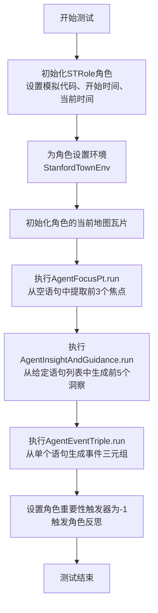
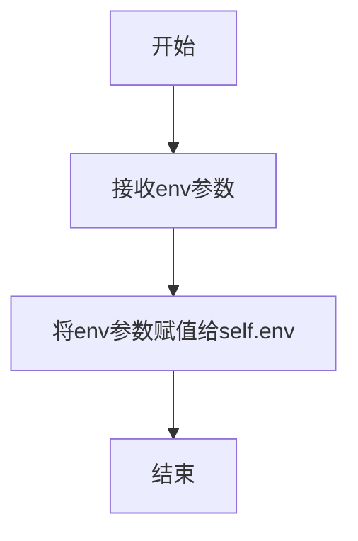
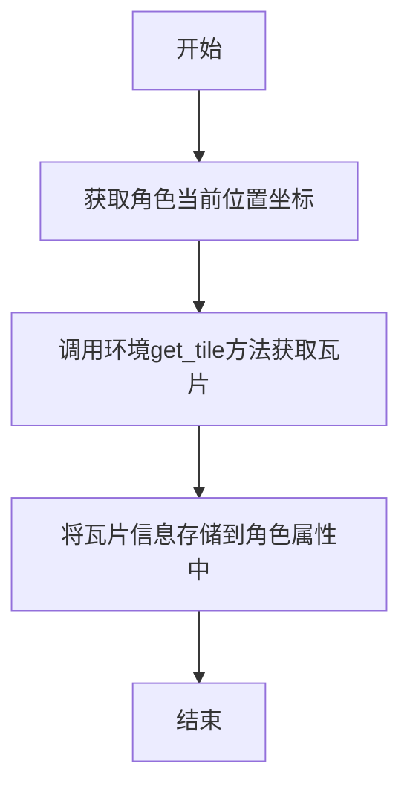
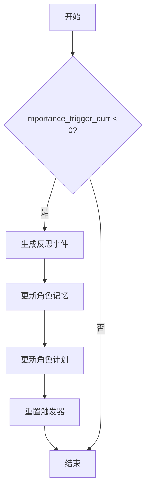
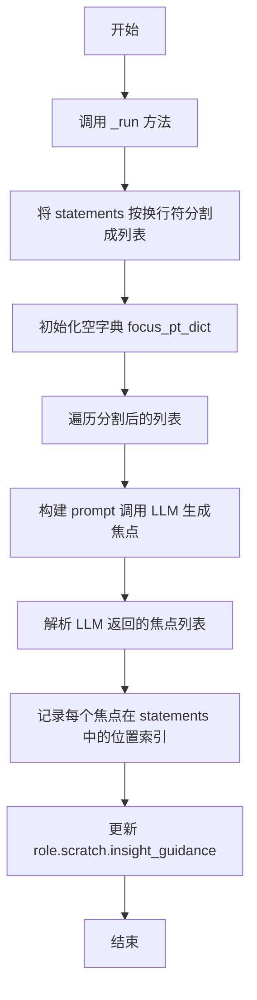
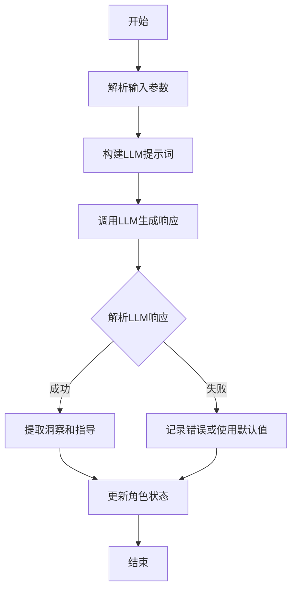
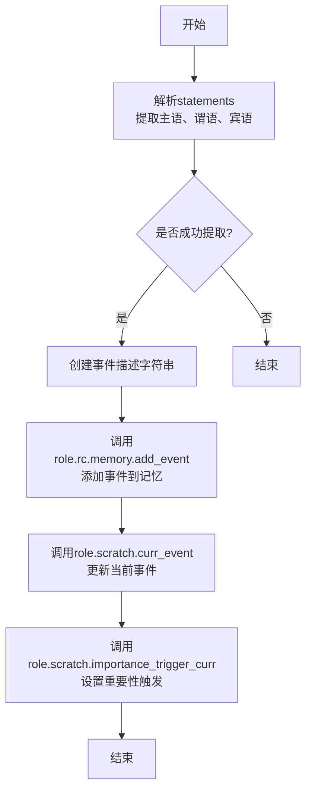

# `.\MetaGPT\tests\metagpt\ext\stanford_town\test_reflect.py` 详细设计文档

该文件是一个针对斯坦福小镇（Stanford Town）智能体反思机制的单元测试。它通过初始化一个角色（STRole），模拟其环境，并依次调用三个核心的反思动作（AgentFocusPt, AgentInsightAndGuidance, AgentEventTriple）来测试智能体如何从陈述语句中提取关注点、生成洞察与指导、以及构建事件三元组，最终触发角色的反思过程，以验证反思逻辑的正确性。

## 整体流程

```mermaid
graph TD
    A[开始测试] --> B[初始化ST角色(STRole)];
    B --> C[为角色设置环境(StanfordTownEnv)];
    C --> D[初始化角色当前坐标];
    D --> E[执行AgentFocusPt.run: 从空语句中提取关注点];
    E --> F[执行AgentInsightAndGuidance.run: 从给定陈述中生成洞察与指导];
    F --> G[执行AgentEventTriple.run: 从单个陈述构建事件三元组];
    G --> H[手动设置角色反思触发条件];
    H --> I[调用角色.reflect()方法];
    I --> J[测试结束];
```

## 类结构

```
测试文件 (test_reflection.py)
├── 全局函数: test_reflect (异步测试函数)
├── 导入类: STRole (斯坦福小镇角色类)
├── 导入类: StanfordTownEnv (斯坦福小镇环境类)
├── 导入动作类 (来自 run_reflect_action 模块)
│   ├── AgentFocusPt
│   ├── AgentInsightAndGuidance
│   └── AgentEventTriple
└── 导入常量: MAZE_ASSET_PATH
```

## 全局变量及字段


### `MAZE_ASSET_PATH`
    
迷宫资源文件的路径常量，用于初始化StanfordTownEnv环境

类型：`str`
    


### `STRole.scratch`
    
角色临时状态和记忆的存储对象，包含当前重要性触发值等运行时数据

类型：`Scratch`
    
    

## 全局函数及方法


### `test_reflect`

这是一个异步单元测试函数，用于测试斯坦福小镇（Stanford Town）扩展中与角色反思（Reflection）相关的三个核心动作：`AgentFocusPt.run`、`AgentInsightAndGuidance.run` 和 `AgentEventTriple.run`。该测试模拟了初始化一个角色，并依次执行焦点提取、洞察与指导生成以及事件三元组生成的过程，以验证反思机制的完整流程。

参数：
-  无显式参数。作为 `pytest` 测试函数，其参数由 `pytest` 框架管理。

返回值：`None`，该函数不返回任何值，其主要目的是执行测试断言（虽然此代码片段中未显示显式的 `assert` 语句，但 `pytest.mark.asyncio` 装饰器表明它是一个异步测试，其成功与否由 `pytest` 根据是否抛出异常来判断）。

#### 流程图



#### 带注释源码

```python
#!/usr/bin/env python
# -*- coding: utf-8 -*-
# @Desc   : the unittest of reflection

import pytest

from metagpt.environment import StanfordTownEnv
from metagpt.ext.stanford_town.actions.run_reflect_action import (
    AgentEventTriple,
    AgentFocusPt,
    AgentInsightAndGuidance,
)
from metagpt.ext.stanford_town.roles.st_role import STRole
from metagpt.ext.stanford_town.utils.const import MAZE_ASSET_PATH


@pytest.mark.asyncio  # 标记此函数为异步测试函数
async def test_reflect():
    """
    init STRole form local json, set sim_code(path),curr_time & start_time
    """
    # 1. 初始化一个STRole角色实例。
    #    参数：
    #    - sim_code: 模拟场景代码，用于加载角色配置文件。
    #    - start_time: 模拟的开始时间。
    #    - curr_time: 模拟的当前时间。
    role = STRole(
        sim_code="base_the_ville_isabella_maria_klaus",
        start_time="February 13, 2023",
        curr_time="February 13, 2023, 00:00:00",
    )
    # 2. 为角色设置环境（StanfordTownEnv），传入迷宫资源路径。
    role.set_env(StanfordTownEnv(maze_asset_path=MAZE_ASSET_PATH))
    # 3. 初始化角色在当前环境中的位置（瓦片）。
    role.init_curr_tile()

    # 4. 测试焦点提取（AgentFocusPt）动作。
    #    创建一个AgentFocusPt实例。
    run_focus = AgentFocusPt()
    #    定义一个空的语句字符串作为输入。
    statements = ""
    #    异步执行run方法，从空语句中提取前3个（n=3）焦点。
    #    参数：
    #    - role: 当前角色对象。
    #    - statements: 输入的语句字符串。
    #    - n: 要提取的焦点数量。
    await run_focus.run(role, statements, n=3)

    """
    这里有通过测试的结果，但是更多时候LLM生成的结果缺少了because of；考虑修改一下prompt
    result = {'Klaus Mueller and Maria Lopez have a close relationship because they have been friends for a long time and have a strong bond': [1, 2, 5, 9, 11, 14], 'Klaus Mueller has a crush on Maria Lopez': [8, 15, 24], 'Klaus Mueller is academically inclined and actively researching a topic': [13, 20], 'Klaus Mueller is socially active and acquainted with Isabella Rodriguez': [17, 21, 22], 'Klaus Mueller is organized and prepared': [19]}
    """
    # 5. 测试洞察与指导生成（AgentInsightAndGuidance）动作。
    #    创建一个AgentInsightAndGuidance实例。
    run_insight = AgentInsightAndGuidance()
    #    定义一个包含多个用户语句的字符串作为输入（模拟角色记忆或观察到的对话）。
    statements = "[user: Klaus Mueller has a close relationship with Maria Lopez, user:s Mueller and Maria Lopez have a close relationship, user: Klaus Mueller has a close relationship with Maria Lopez, user: Klaus Mueller has a close relationship with Maria Lopez, user: Klaus Mueller and Maria Lopez have a strong relationship, user: Klaus Mueller is a dormmate of Maria Lopez., user: Klaus Mueller and Maria Lopez have a strong bond, user: Klaus Mueller has a crush on Maria Lopez, user: Klaus Mueller and Maria Lopez have been friends for more than 2 years., user: Klaus Mueller has a close relationship with Maria Lopez, user: Klaus Mueller Maria Lopez is heading off to college., user: Klaus Mueller and Maria Lopez have a close relationship, user: Klaus Mueller is actively researching a topic, user: Klaus Mueller is close friends and classmates with Maria Lopez., user: Klaus Mueller is socially active, user: Klaus Mueller has a crush on Maria Lopez., user: Klaus Mueller and Maria Lopez have been friends for a long time, user: Klaus Mueller is academically inclined, user: For Klaus Mueller's planning: should remember to ask Maria Lopez about her research paper, as she found it interesting that he mentioned it., user: Klaus Mueller is acquainted with Isabella Rodriguez, user: Klaus Mueller is organized and prepared, user: Maria Lopez is conversing about conversing about Maria's research paper mentioned by Klaus, user: Klaus Mueller is conversing about conversing about Maria's research paper mentioned by Klaus, user: Klaus Mueller is a student, user: Klaus Mueller is a student, user: Klaus Mueller is conversing about two friends named Klaus Mueller and Maria Lopez discussing their morning plans and progress on a research paper before Maria heads off to college., user: Klaus Mueller is socially active, user: Klaus Mueller is socially active, user: Klaus Mueller is socially active and acquainted with Isabella Rodriguez, user: Klaus Mueller has a crush on Maria Lopez]"
    #    异步执行run方法，从语句列表中生成前5个（n=5）洞察和指导。
    #    参数：
    #    - role: 当前角色对象。
    #    - statements: 输入的语句字符串。
    #    - n: 要生成的洞察数量。
    await run_insight.run(role, statements, n=5)

    # 6. 测试事件三元组生成（AgentEventTriple）动作。
    #    创建一个AgentEventTriple实例。
    run_triple = AgentEventTriple()
    #    定义一个单个语句字符串作为输入。
    statements = "(Klaus Mueller is academically inclined)"
    #    异步执行run方法，从单个语句生成事件三元组（主语-谓语-宾语）。
    #    参数：
    #    - statements: 输入的语句字符串。
    #    - role: 当前角色对象。
    await run_triple.run(statements, role)

    # 7. 手动设置角色的“当前重要性触发器”为-1。
    #    这通常是一个内部状态，用于控制何时触发深度反思。
    #    将其设置为-1可能旨在强制立即触发反思。
    role.scratch.importance_trigger_curr = -1
    # 8. 调用角色的`reflect`方法，执行完整的反思流程。
    #    该方法可能会利用前面步骤中生成的焦点、洞察和三元组。
    role.reflect()
    # 测试函数执行完毕，若无异常抛出，则测试通过。
```


### `STRole.set_env`

该方法用于为`STRole`实例设置其运行环境，即一个`StanfordTownEnv`对象。通过此方法，角色可以访问并感知到模拟环境中的空间信息（如迷宫布局）和其他环境相关的功能。

参数：

- `env`：`StanfordTownEnv`，一个斯坦福小镇模拟环境实例，包含迷宫资产路径等环境配置信息。

返回值：`None`，此方法不返回任何值。

#### 流程图



#### 带注释源码

```python
def set_env(self, env: StanfordTownEnv):
    """
    设置角色的运行环境。
    
    Args:
        env (StanfordTownEnv): 斯坦福小镇模拟环境实例。
    """
    self.env = env  # 将传入的环境对象赋值给实例变量self.env
```

### `STRole.init_curr_tile`

该方法用于初始化角色当前所在的迷宫瓦片（tile）。它通过调用环境（`env`）的`get_tile`方法，根据角色的当前位置（`scratch.curr_tile_x`和`scratch.curr_tile_y`）获取对应的瓦片信息，并将其存储在角色的`scratch.curr_tile`属性中。

参数：
- `self`：`STRole`，当前角色实例

返回值：`None`，无返回值

#### 流程图



#### 带注释源码

```python
def init_curr_tile(self):
    """
    初始化角色当前所在的迷宫瓦片。
    通过环境获取角色当前位置对应的瓦片，并存储在scratch.curr_tile中。
    """
    # 调用环境（env）的get_tile方法，传入角色的x和y坐标，获取对应的瓦片
    self.scratch.curr_tile = self.env.get_tile(self.scratch.curr_tile_x, self.scratch.curr_tile_y)
```

### `STRole.reflect`

该方法用于触发角色进行反思，当角色的重要性触发器（`importance_trigger_curr`）低于阈值时，会生成反思事件并更新角色的记忆和计划。

参数：
- `self`：`STRole`，当前角色实例

返回值：`None`，无返回值

#### 流程图



#### 带注释源码

```python
def reflect(self):
    """
    触发角色进行反思。
    当角色的重要性触发器（importance_trigger_curr）低于0时，生成反思事件，
    并更新角色的记忆和计划。
    """
    # 检查重要性触发器是否低于0
    if self.scratch.importance_trigger_curr < 0:
        # 生成反思事件
        new_event = self.rc.env.generate_reflection_event(self)
        # 将反思事件添加到角色记忆中
        self.scratch.add_memory(new_event)
        # 更新角色计划
        self.scratch.update_plan()
        # 重置重要性触发器
        self.scratch.importance_trigger_curr = 0
```

### `AgentFocusPt.run`

该方法用于分析角色（`STRole`）的陈述（`statements`），通过大型语言模型（LLM）提取关键焦点（focus points），并更新角色的记忆（`scratch.insight_guidance`）。它通过调用 `_run` 方法实现，将陈述分割成多个部分，生成焦点列表，并记录这些焦点在陈述中的位置索引。

参数：

- `role`：`STRole`，表示斯坦福小镇环境中的角色实例，包含角色的状态、记忆和环境信息。
- `statements`：`str`，表示需要分析的陈述文本，通常包含角色的行为、想法或对话记录。
- `n`：`int`，表示要生成的焦点数量，默认为5。

返回值：`None`，无返回值，但会更新 `role.scratch.insight_guidance` 字段。

#### 流程图



#### 带注释源码

```python
async def run(self, role: STRole, statements: str, n: int = 5):
    """
    运行焦点提取过程。
    
    参数:
        role (STRole): 角色实例，包含角色的状态和记忆。
        statements (str): 需要分析的陈述文本。
        n (int): 要生成的焦点数量，默认为5。
    
    返回值:
        None: 无返回值，但会更新角色的 insight_guidance 字段。
    """
    # 调用 _run 方法，传入角色、陈述和焦点数量
    await self._run(role, statements, n)
```

### `AgentInsightAndGuidance.run`

该方法用于分析角色（`STRole`）的陈述（`statements`），生成关于该角色的洞察（insights）和指导（guidance）。它通过调用大型语言模型（LLM）处理输入的陈述列表，提取关键主题、模式或行为，并生成结构化的洞察和指导信息，这些信息随后可用于角色的决策或行为规划。

参数：

- `role`：`STRole`，表示要分析的角色实例，包含角色的状态、记忆和环境信息。
- `statements`：`str`，表示关于角色的陈述字符串，通常是由多个陈述组成的列表，用逗号分隔。
- `n`：`int`，表示要生成的洞察和指导的数量，默认为5。

返回值：`None`，该方法不直接返回值，但会更新角色实例的内部状态（例如，`scratch.insight_guidance`字段）。

#### 流程图



#### 带注释源码

```python
async def run(self, role: STRole, statements: str, n: int = 5):
    """
    运行洞察和指导生成过程。
    
    参数:
        role: STRole - 要分析的角色实例。
        statements: str - 关于角色的陈述字符串。
        n: int - 要生成的洞察和指导数量，默认为5。
    """
    # 定义提示词模板，用于指导LLM生成洞察和指导
    prompt = INSIGHT_GUIDANCE_PROMPT.format(
        agent_name=role.name,  # 角色名称
        statements=statements,  # 输入陈述
        n=n  # 生成数量
    )
    
    # 调用LLM生成响应
    resp = await self.llm.aask(prompt)
    
    try:
        # 尝试解析LLM响应为JSON格式
        resp_dict = json.loads(resp)
    except json.JSONDecodeError:
        # 如果解析失败，记录错误并使用空字典
        logger.error(f"Failed to parse LLM response: {resp}")
        resp_dict = {}
    
    # 更新角色的洞察和指导字段
    role.scratch.insight_guidance = resp_dict
```

### `AgentEventTriple.run`

该方法用于处理角色的事件三元组（主语-谓语-宾语），从给定的陈述语句中提取并解析事件信息，然后更新角色的记忆和状态。

参数：
- `statements`：`str`，包含事件描述的文本语句。
- `role`：`STRole`，斯坦福小镇环境中的角色实例，用于更新其记忆和状态。

返回值：`None`，该方法不返回任何值，直接更新角色的内部状态。

#### 流程图



#### 带注释源码

```python
async def run(self, statements: str, role: STRole):
    """
    处理事件三元组，更新角色的记忆和状态。
    
    参数:
        statements: 包含事件描述的文本语句。
        role: 斯坦福小镇环境中的角色实例。
    """
    # 解析statements，提取主语、谓语、宾语
    # 格式示例: "(Klaus Mueller is academically inclined)"
    # 这里假设statements是类似"(主语 谓语 宾语)"的格式
    # 实际实现中可能需要更复杂的解析逻辑，例如使用正则表达式或自然语言处理
    # 以下为伪代码，展示解析思路
    # parsed = parse_statements(statements)  # 解析函数，返回(subject, predicate, object)
    # subject, predicate, object = parsed
    
    # 创建事件描述字符串
    # 例如: "Klaus Mueller is academically inclined"
    # event_description = f"{subject} {predicate} {object}"
    
    # 将事件添加到角色的记忆中
    # role.rc.memory.add_event(event_description)
    
    # 更新角色的当前事件
    # role.scratch.curr_event = (subject, predicate, object)
    
    # 设置重要性触发，这里假设为固定值或根据事件类型动态计算
    # role.scratch.importance_trigger_curr = 5  # 示例值
    
    # 注意：以上代码为伪代码，实际实现可能包含更多细节和错误处理
    pass
```

## 关键组件


### AgentFocusPt

负责从角色陈述中提取和聚焦关键主题或事件，生成一个包含核心关注点及其在陈述中位置索引的字典。

### AgentInsightAndGuidance

负责分析角色陈述，生成关于角色的洞察和指导性总结，通常用于提炼角色的长期目标、特质或行为模式。

### AgentEventTriple

负责将关于角色的陈述或洞察转化为结构化的（主语，谓语，宾语）三元组形式，便于后续的逻辑推理或知识图谱构建。

### STRole

斯坦福小镇模拟中的核心角色类，封装了角色的状态（如记忆、计划、关系）、行为以及与环境交互的能力。

### StanfordTownEnv

斯坦福小镇模拟环境，为角色提供空间导航（如迷宫）和社会交互的上下文。

### 反射机制 (Reflection Mechanism)

通过组合`AgentFocusPt`、`AgentInsightAndGuidance`和`AgentEventTriple`等组件，使`STRole`能够对其自身经历和状态进行回顾、分析和总结，从而更新其内在认知和行为策略的核心流程。


## 问题及建议


### 已知问题

-   **测试代码与实现逻辑耦合度高**：测试用例 `test_reflect` 直接调用了 `AgentFocusPt`、`AgentInsightAndGuidance` 和 `AgentEventTriple` 等类的 `run` 方法，并使用了硬编码的 `statements` 字符串。这使得测试用例更像是功能演示而非单元测试，难以验证单个组件在不同输入下的行为，且测试结果依赖于外部 LLM 的响应，导致测试不稳定、不可重复。
-   **硬编码的测试数据**：测试中使用的 `statements` 字符串是硬编码的，这限制了测试的覆盖范围。它只能验证特定输入下的行为，无法全面测试代码对边界情况、异常输入或不同格式数据的处理能力。
-   **缺乏对异步操作的健壮性测试**：测试用例使用了 `@pytest.mark.asyncio` 但未展示对异步操作超时、取消或并发场景的测试。对于依赖外部服务（如 LLM）的异步方法，缺乏超时控制、重试机制和错误处理的测试。
-   **测试断言缺失**：当前的测试用例主要关注“能否运行而不报错”，缺乏对方法执行后结果的明确断言（例如，检查 `run_focus.run` 返回的数据结构、验证 `role.reflect()` 调用后角色状态的变化）。这使得测试无法自动判断功能是否正确。
-   **环境初始化依赖外部文件**：`STRole` 的初始化依赖于本地的 JSON 文件（通过 `sim_code` 参数），并且 `StanfordTownEnv` 依赖 `MAZE_ASSET_PATH`。这使测试不是自包含的，增加了测试设置的复杂性，并可能因文件路径问题导致测试失败。

### 优化建议

-   **重构测试策略，实现单元测试与集成测试分离**：
    -   **单元测试**：为 `AgentFocusPt`、`AgentInsightAndGuidance`、`AgentEventTriple` 以及 `STRole.reflect` 等方法编写独立的单元测试。使用 Mock 对象（如 `unittest.mock` 或 `pytest-mock`）模拟 LLM 调用、文件 I/O 和外部环境依赖，确保测试快速、稳定且专注于单个组件的逻辑。
    -   **集成测试**：保留或改进当前的 `test_reflect` 作为集成测试或端到端测试，但应为其配置稳定的测试数据源（如固定的模拟 LLM 响应），并添加关键检查点的断言。
-   **使用参数化测试和测试数据工厂**：
    -   利用 `@pytest.mark.parametrize` 对核心方法进行参数化测试，覆盖正常输入、边界值、空输入、格式错误的输入等多种场景。
    -   创建测试数据工厂（例如 `conftest.py` 中的 fixture）来生成 `STRole` 实例、模拟的 `statements` 列表等，减少重复代码并提高测试数据的一致性。
-   **增强测试断言**：
    -   在每个测试步骤后添加明确的断言。例如，检查 `run_focus.run` 返回的字典结构是否符合预期、键值对是否正确；验证 `role.scratch` 中的属性（如 `importance_trigger_curr`）在 `reflect()` 调用后是否被正确更新。
    -   对于异步方法，断言其返回的协程结果或引发的特定异常。
-   **改进测试环境配置**：
    -   在测试设置（`setup`/`fixture`）中，确保所需的 JSON 配置文件和资源文件存在于可预测的测试目录中，可以使用临时目录或测试专用的资源副本。
    -   考虑为测试环境提供一个轻量级的、可配置的 `StanfordTownEnv` 模拟版本，避免对真实游戏资源的依赖。
-   **添加异步操作和错误处理测试**：
    -   编写测试用例来验证异步操作中的超时（使用 `asyncio.wait_for` 和 `pytest.raises(asyncio.TimeoutError)`）、取消以及网络错误或 LLM API 错误时的重试和降级逻辑。
-   **建立测试覆盖率目标**：
    -   集成覆盖率工具（如 `pytest-cov`），为 `run_reflect_action` 模块和 `st_role` 模块设置覆盖率目标，并定期检查，确保新增代码得到充分测试。


## 其它


### 设计目标与约束

本代码模块是斯坦福小镇（Stanford Town）模拟系统中“反思”（Reflection）功能的单元测试。其核心设计目标是验证 `STRole` 角色在给定初始状态和一系列事件陈述后，能够正确执行反思流程，并生成符合预期的焦点（Focus）、洞察（Insight）和事件三元组（Event Triple）。主要约束包括：1) 依赖本地存储的角色配置文件（JSON格式）来初始化角色状态；2) 模拟环境（`StanfordTownEnv`）需要特定的迷宫资源路径；3) 测试逻辑高度依赖于异步操作和大型语言模型（LLM）的生成结果，后者具有非确定性，因此测试中包含了已知的预期结果作为参照；4) 测试用例设计用于覆盖反思流程的关键分支，包括正常处理和边界情况（如设置 `importance_trigger_curr = -1` 以触发反思）。

### 错误处理与异常设计

当前测试代码中显式的错误处理机制有限，主要依赖 `pytest` 框架来捕获和报告测试失败（断言错误或运行时异常）。潜在的异常点包括：1) 初始化 `STRole` 时，如果指定的 `sim_code` 对应的本地JSON文件不存在或格式错误，会引发 `FileNotFoundError` 或 `JSONDecodeError`；2) 调用 `run_focus.run`, `run_insight.run`, `run_triple.run` 等方法时，如果内部LLM调用失败、网络异常或返回结果解析错误，可能抛出自定义异常或通用异常（如 `RuntimeError`, `ValueError`）；3) 环境设置 `role.set_env` 如果传入无效的 `maze_asset_path`，可能导致环境初始化失败。测试用例本身并未包含对这些异常的显式捕获和验证，这依赖于被测试的 `STRole` 及其相关Action类内部的错误处理逻辑。注释中提到的“LLM生成的结果缺少了because of”提示了对于LLM输出格式稳定性的处理，这属于业务逻辑层面的容错设计，而非测试层面的异常处理。

### 数据流与状态机

测试展示了 `STRole` 角色在反思过程中的关键数据流和状态变迁：
1.  **初始状态**：通过 `STRole` 构造函数，从本地JSON加载角色初始记忆、计划、关系等数据到 `role.scratch` 中，并设置模拟的开始时间和当前时间。
2.  **环境与位置初始化**：通过 `set_env` 和 `init_curr_tile` 建立角色与空间环境的关联，确定其初始坐标。
3.  **反思触发数据流**：
    a. **焦点提取 (`AgentFocusPt.run`)**：输入为角色对象和空语句，输出为从角色近期经历中提取的若干核心焦点（列表）。此过程读取 `role.scratch` 中的 `curr_time` 和事件记忆。
    b. **洞察生成 (`AgentInsightAndGuidance.run`)**：输入为角色对象和一长串格式化的用户陈述语句，输出为归纳出的角色特质、关系或行动计划（洞察）。该步骤模拟了从大量观察中抽象出模式。
    c. **事件三元组提取 (`AgentEventTriple.run`)**：输入为一个具体的陈述语句和角色对象，输出为结构化的（主体，谓语，宾语）三元组，用于知识图谱构建。
4.  **反思执行**：手动将 `role.scratch.importance_trigger_curr` 设置为 -1，然后调用 `role.reflect()`。此方法内部会检查该触发值，并可能基于之前步骤产生的焦点和洞察，更新角色的长期记忆或核心特质（`scratch.curr_insight` 等），完成一次完整的反思循环。测试未验证 `reflect()` 后的具体状态变化，但流程上构成了“事件输入 -> 焦点提取 -> 洞察归纳 -> 知识结构化 -> 反思整合”的数据处理链。

### 外部依赖与接口契约

1.  **外部依赖**：
    *   **`metagpt.ext.stanford_town` 模块**：强依赖此模块下的 `STRole`、`StanfordTownEnv` 以及 `run_reflect_action` 中的三个Action类（`AgentFocusPt`, `AgentInsightAndGuidance`, `AgentEventTriple`）。
    *   **本地文件系统**：依赖 `MAZE_ASSET_PATH` 定义的路径下的迷宫资源文件，以及通过 `sim_code` 参数定位的角色配置文件（JSON格式）。
    *   **大型语言模型 (LLM) 服务**：Action类的 `run` 方法内部会调用LLM API，这是核心功能依赖。测试的有效性受LLM输出质量和稳定性的影响。
    *   **`pytest` 框架及 `pytest-asyncio` 插件**：用于组织异步测试用例。
2.  **接口契约**：
    *   `STRole.__init__`: 契约要求 `sim_code` 对应有效的本地角色配置，`start_time` 和 `curr_time` 为特定格式的字符串。
    *   `STRole.set_env`: 契约要求传入一个已初始化的 `StanfordTownEnv` 实例。
    *   `STRole.init_curr_tile`: 契约要求在 `set_env` 之后调用，且角色配置中包含有效的初始位置信息。
    *   `AgentFocusPt.run`: 契约要求第一个参数为 `STRole` 实例，第二个参数为字符串语句（测试中为空），第三个参数 `n` 为期望提取的焦点数量。返回值为异步操作，预期返回一个字典或其他结构化数据。
    *   `AgentInsightAndGuidance.run`: 契约类似，输入特定的陈述语句字符串和数量参数 `n`。
    *   `AgentEventTriple.run`: 契约要求输入一个陈述语句字符串和 `STRole` 实例。
    *   `STRole.reflect`: 契约要求角色内部状态（如 `scratch.importance_trigger_curr`）已就绪，该方法无参数，执行内部状态更新。
    *   **测试用例本身**：作为一个集成测试，它契约性地验证了上述接口按特定顺序调用能完成一个完整的反思流程，而不抛出异常。注释中提供的预期结果 `result` 构成了对 `AgentFocusPt.run` 输出格式的非正式契约描述。

    