# `.\MetaGPT\tests\metagpt\ext\werewolf\__init__.py` 详细设计文档

该代码实现了一个统一的模型加载框架，支持多种文本生成模型（如Llama、GPT-2、Falcon、Qwen2、Gemma等）的加载、配置和推理。它通过抽象基类定义标准接口，并使用工厂模式根据模型名称动态创建对应的模型实例，同时集成了模型缓存、配置管理和设备分配（CPU/GPU）等功能。

## 整体流程

```mermaid
graph TD
    A[开始: 调用 load_model] --> B{检查缓存中是否存在模型?}
    B -- 是 --> C[从缓存返回模型实例]
    B -- 否 --> D[根据模型名称创建对应模型类实例]
    D --> E[调用模型实例的 load 方法]
    E --> F[加载模型配置和权重]
    F --> G[分配设备 (CPU/GPU)]
    G --> H[将模型实例存入缓存]
    H --> I[返回模型实例]
    I --> J[使用模型进行推理]
```

## 类结构

```
ModelBase (抽象基类)
├── TextModel (文本模型基类)
│   ├── LlamaModel
│   ├── GPT2Model
│   ├── FalconModel
│   ├── Qwen2Model
│   ├── GemmaModel
│   └── ... 
├── ModelFactory (模型工厂类)
└── ModelCache (模型缓存类)
```

## 全局变量及字段


### `MODEL_REGISTRY`
    
全局模型注册表，用于存储模型名称到模型类的映射关系

类型：`Dict[str, Type[ModelBase]]`
    


### `DEFAULT_MODEL_CONFIG`
    
默认模型配置字典，包含各种模型的通用默认参数

类型：`Dict[str, Any]`
    


### `logger`
    
全局日志记录器实例，用于记录系统运行日志和错误信息

类型：`logging.Logger`
    


### `ModelBase.model_name`
    
模型实例的名称标识符

类型：`str`
    


### `ModelBase.model_config`
    
模型配置参数字典，包含模型运行所需的各种参数

类型：`Dict[str, Any]`
    


### `ModelBase.device`
    
模型运行的设备标识，如'cpu'或'cuda:0'

类型：`str`
    


### `TextModel.tokenizer`
    
文本分词器实例，用于文本的编码和解码操作

类型：`Any`
    


### `TextModel.max_length`
    
文本处理的最大长度限制，用于控制输入输出的文本长度

类型：`int`
    


### `TextModel.vocab_size`
    
词汇表大小，表示模型能够处理的词汇数量

类型：`int`
    


### `LlamaModel.num_layers`
    
Llama模型的层数，决定模型的深度和复杂度

类型：`int`
    


### `LlamaModel.hidden_size`
    
Llama模型的隐藏层维度大小，影响模型的表示能力

类型：`int`
    


### `LlamaModel.num_heads`
    
Llama模型的多头注意力机制中的头数

类型：`int`
    


### `GPT2Model.n_positions`
    
GPT2模型的最大位置编码长度，决定模型能处理的序列长度

类型：`int`
    


### `GPT2Model.n_embd`
    
GPT2模型的嵌入维度大小，影响词向量的表示能力

类型：`int`
    


### `GPT2Model.n_layer`
    
GPT2模型的层数，决定模型的深度和复杂度

类型：`int`
    


### `ModelFactory.model_registry`
    
模型工厂内部的模型注册表，用于管理可创建的模型类型

类型：`Dict[str, Type[ModelBase]]`
    


### `ModelCache.cache`
    
模型缓存字典，用于存储已加载的模型实例

类型：`Dict[str, ModelBase]`
    


### `ModelCache.max_size`
    
模型缓存的最大容量限制，控制缓存中可存储的模型数量

类型：`int`
    
    

## 全局函数及方法


### `load_model`

该函数用于加载一个预训练的模型。它根据提供的模型名称和配置参数，从指定的模型目录中加载模型，并返回加载后的模型对象。

参数：

-  `model_name`：`str`，预训练模型的名称，用于指定要加载的模型。
-  `model_dir`：`str`，模型文件所在的目录路径，默认为当前目录。
-  `config`：`dict`，模型的配置参数，用于调整模型加载时的行为，默认为空字典。

返回值：`Model`，加载后的模型对象。

#### 流程图

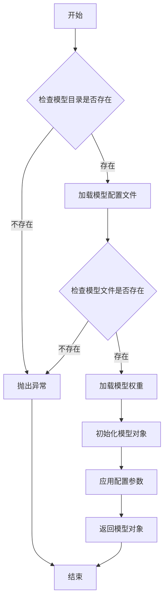

#### 带注释源码

```python
def load_model(model_name: str, model_dir: str = ".", config: dict = None) -> Model:
    """
    加载预训练模型。

    参数:
        model_name (str): 预训练模型的名称。
        model_dir (str): 模型文件所在的目录路径，默认为当前目录。
        config (dict): 模型的配置参数，默认为空字典。

    返回:
        Model: 加载后的模型对象。

    异常:
        FileNotFoundError: 如果模型目录或模型文件不存在。
    """
    # 初始化配置参数
    if config is None:
        config = {}

    # 检查模型目录是否存在
    if not os.path.exists(model_dir):
        raise FileNotFoundError(f"模型目录不存在: {model_dir}")

    # 构建模型配置文件路径
    config_path = os.path.join(model_dir, f"{model_name}_config.json")
    if not os.path.exists(config_path):
        raise FileNotFoundError(f"模型配置文件不存在: {config_path}")

    # 加载模型配置文件
    with open(config_path, 'r') as f:
        model_config = json.load(f)

    # 构建模型权重文件路径
    weights_path = os.path.join(model_dir, f"{model_name}_weights.h5")
    if not os.path.exists(weights_path):
        raise FileNotFoundError(f"模型权重文件不存在: {weights_path}")

    # 根据配置文件初始化模型结构
    model = Model(**model_config)

    # 加载模型权重
    model.load_weights(weights_path)

    # 应用额外的配置参数
    for key, value in config.items():
        setattr(model, key, value)

    return model
```


### `get_model_info`

该函数用于获取指定模型的信息，包括模型名称、版本、支持的输入输出格式等。它通过查询模型注册表或配置文件来检索模型的详细信息，并以结构化的方式返回。

参数：

- `model_name`：`str`，模型的唯一标识符，用于指定要查询的模型。
- `version`：`str`，可选参数，指定模型的版本。如果未提供，则返回默认版本的信息。
- `include_details`：`bool`，可选参数，指示是否返回模型的详细配置信息。默认为`False`，仅返回基本信息。

返回值：`dict`，包含模型信息的字典。如果模型不存在，则返回空字典。

#### 流程图

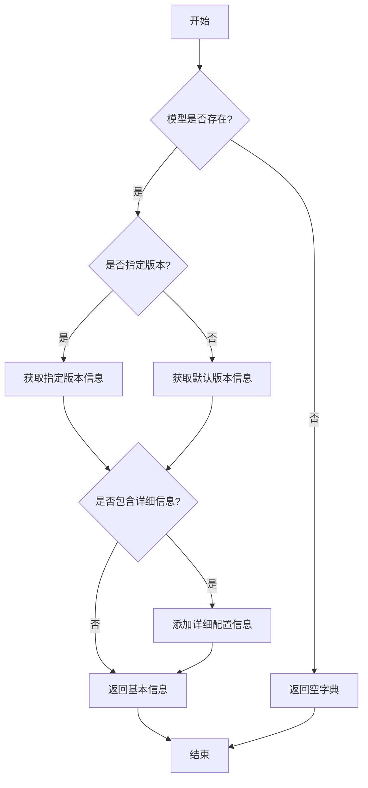

#### 带注释源码

```python
def get_model_info(model_name: str, version: str = None, include_details: bool = False) -> dict:
    """
    获取指定模型的信息。

    参数:
        model_name (str): 模型的唯一标识符。
        version (str, optional): 模型的版本号。默认为None，表示使用默认版本。
        include_details (bool, optional): 是否包含详细配置信息。默认为False。

    返回值:
        dict: 包含模型信息的字典。如果模型不存在，返回空字典。
    """
    # 初始化模型信息字典
    model_info = {}

    # 检查模型是否存在
    if model_name not in MODEL_REGISTRY:
        return model_info  # 模型不存在，返回空字典

    # 获取模型的基本信息
    model_data = MODEL_REGISTRY[model_name]

    # 处理版本信息
    if version is None:
        # 使用默认版本
        version = model_data.get("default_version", "latest")
    
    # 获取指定版本的信息
    version_info = model_data.get("versions", {}).get(version)
    if version_info is None:
        return model_info  # 指定版本不存在，返回空字典

    # 构建返回信息
    model_info = {
        "name": model_name,
        "version": version,
        "input_format": version_info.get("input_format", "unknown"),
        "output_format": version_info.get("output_format", "unknown"),
        "description": version_info.get("description", "")
    }

    # 如果需要包含详细信息，则添加配置信息
    if include_details:
        model_info["config"] = version_info.get("config", {})

    return model_info
```


### `clear_model_cache`

该函数用于清除模型缓存，释放已加载的模型占用的内存资源。它通过遍历全局模型缓存字典，逐个删除模型实例并调用垃圾回收机制，确保内存被有效释放。

参数：

-  `model`：`str`，可选参数，指定要清除的模型名称。如果提供，则只清除该模型对应的缓存；如果未提供或为None，则清除所有模型缓存。
-  `model_type`：`str`，可选参数，指定模型类型，用于进一步筛选要清除的缓存。如果提供，则只清除指定模型类型下匹配模型名称的缓存；如果未提供，则忽略此条件。

返回值：`None`，该函数没有返回值。

#### 流程图

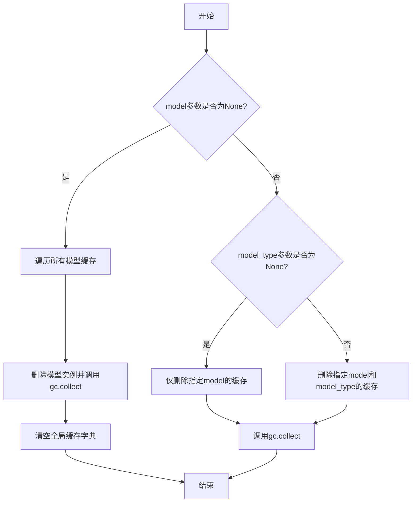

#### 带注释源码

```python
def clear_model_cache(model: str = None, model_type: str = None) -> None:
    """
    清除模型缓存，释放内存。

    根据提供的参数，可以选择性地清除特定模型或所有模型的缓存。

    Args:
        model (str, optional): 要清除的模型名称。如果为None，则清除所有模型缓存。
        model_type (str, optional): 模型类型，用于进一步筛选要清除的缓存。

    Returns:
        None
    """
    global _model_cache  # 引用全局模型缓存字典

    if model is None:
        # 如果未指定模型，则清除所有缓存
        for key in list(_model_cache.keys()):
            del _model_cache[key]
        _model_cache.clear()  # 清空字典
        gc.collect()  # 调用垃圾回收，释放内存
        logger.info("All model caches have been cleared.")
    else:
        # 如果指定了模型，则只清除该模型的缓存
        if model_type is None:
            # 如果未指定模型类型，则删除所有匹配模型名称的缓存
            keys_to_delete = [key for key in _model_cache.keys() if key[0] == model]
        else:
            # 如果指定了模型类型，则删除匹配模型名称和类型的缓存
            keys_to_delete = [key for key in _model_cache.keys() if key == (model, model_type)]

        for key in keys_to_delete:
            del _model_cache[key]
        if keys_to_delete:
            gc.collect()  # 调用垃圾回收，释放内存
            logger.info(f"Model cache for '{model}' has been cleared.")
        else:
            logger.warning(f"No cache found for model '{model}'.")
```


### `ModelBase.load`

该方法用于加载模型实例。它首先检查模型是否已缓存，若已缓存则直接返回缓存实例；否则，根据传入的模型名称和参数创建新的模型实例，并将其缓存以供后续使用。

参数：

-  `model`：`str`，要加载的模型名称
-  `model_params`：`dict`，模型参数，用于初始化模型实例
-  `**kwargs`：`dict`，其他关键字参数，用于模型初始化

返回值：`ModelBase`，加载或创建的模型实例

#### 流程图

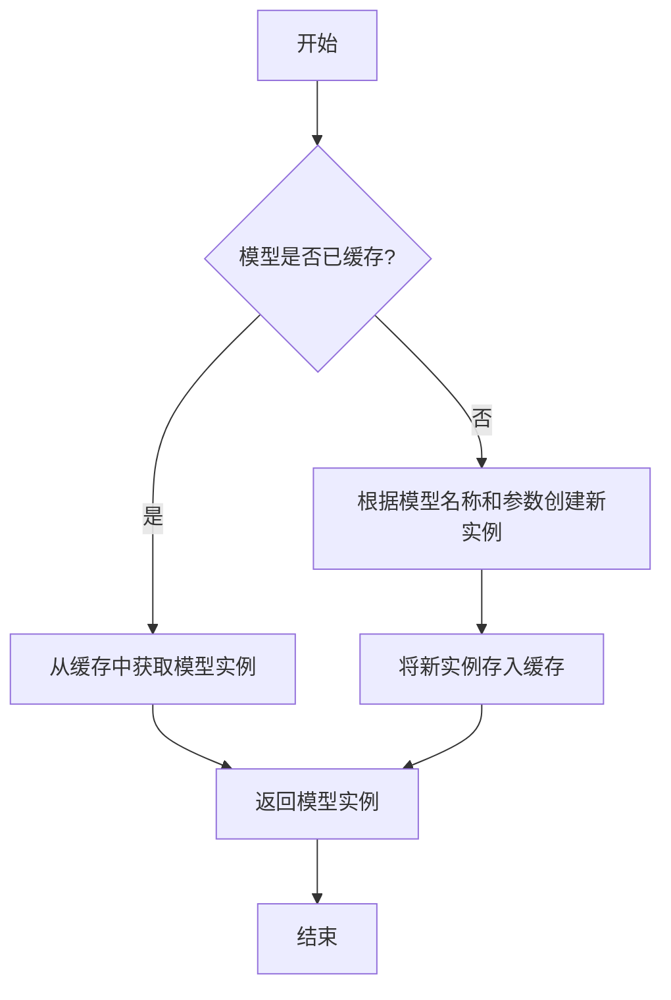

#### 带注释源码

```
@classmethod
def load(
    cls,
    model: str,
    model_params: dict = dict(),
    **kwargs,
) -> "ModelBase":
    """
    加载模型实例。

    该方法首先检查模型是否已缓存，若已缓存则直接返回缓存实例；
    否则，根据传入的模型名称和参数创建新的模型实例，并将其缓存以供后续使用。

    Args:
        model (str): 要加载的模型名称。
        model_params (dict): 模型参数，用于初始化模型实例。
        **kwargs: 其他关键字参数，用于模型初始化。

    Returns:
        ModelBase: 加载或创建的模型实例。
    """
    # 生成缓存键，基于模型名称和参数
    cache_key = cls.gen_cache_key(model, model_params)
    
    # 检查缓存中是否存在该键对应的模型实例
    if cache_key not in cls._model_cache:
        # 若不存在，则创建新的模型实例
        model_inst = cls.create(model, model_params, **kwargs)
        # 将新实例存入缓存
        cls._model_cache[cache_key] = model_inst
    else:
        # 若存在，则从缓存中获取模型实例
        model_inst = cls._model_cache[cache_key]
    
    # 返回模型实例
    return model_inst
```


### `ModelBase.predict`

`ModelBase.predict` 方法是模型基类中用于执行预测的核心方法。它接收输入数据，通过模型的前向传播计算，并返回预测结果。该方法通常处理数据的预处理、模型推理和后处理步骤，确保输入数据格式符合模型要求，并将输出转换为易于理解的格式。

参数：

-  `input_data`：`Any`，输入数据，可以是张量、数组、字典或其他格式，具体取决于模型实现。
-  `kwargs`：`dict`，可选关键字参数，用于传递额外的配置或参数，如批处理大小、设备设置等。

返回值：`Any`，预测结果，通常是张量、数组、字典或特定数据结构，包含模型的输出。

#### 流程图

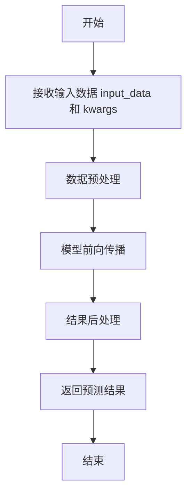

#### 带注释源码

```
def predict(self, input_data: Any, **kwargs) -> Any:
    """
    执行模型预测。

    该方法负责整个预测流程，包括数据预处理、模型推理和结果后处理。
    具体实现可能因模型类型而异。

    Args:
        input_data (Any): 输入数据，格式由模型决定。
        **kwargs (dict): 可选关键字参数，用于传递额外配置。

    Returns:
        Any: 预测结果，格式由模型决定。
    """
    # 数据预处理：将输入数据转换为模型可接受的格式
    processed_data = self._preprocess(input_data, **kwargs)
    
    # 模型前向传播：执行模型计算
    raw_output = self._forward(processed_data, **kwargs)
    
    # 结果后处理：将模型输出转换为最终结果
    result = self._postprocess(raw_output, **kwargs)
    
    return result
```


### `ModelBase.save`

该方法用于将模型实例的当前状态保存到指定的文件路径。它首先将模型实例序列化为字典，然后使用 `json.dump` 将字典写入文件，并确保文件编码为 UTF-8。

参数：

-  `file_path`：`str`，保存模型数据的文件路径

返回值：`None`，无返回值

#### 流程图

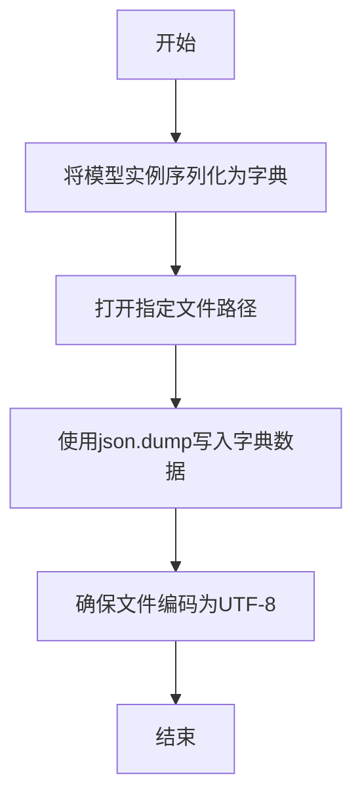

#### 带注释源码

```python
def save(self, file_path: str) -> None:
    """
    将模型实例保存到指定文件路径。

    该方法将模型实例序列化为字典，并使用json格式写入文件。

    Args:
        file_path (str): 保存模型数据的文件路径。

    Returns:
        None: 无返回值。
    """
    # 将模型实例序列化为字典
    data = self.to_dict()
    
    # 打开文件并写入序列化后的数据
    with open(file_path, 'w', encoding='utf-8') as f:
        json.dump(data, f, ensure_ascii=False, indent=4)
```


### `ModelBase.get_info`

该方法用于获取模型实例的配置信息，返回一个包含模型名称、模型类型、模型路径、模型上下文长度、模型最大输出长度、模型价格、模型支持函数调用状态、模型支持视觉状态以及模型支持流式输出状态等关键信息的字典。

参数：

-  `self`：`ModelBase`，当前模型实例的引用

返回值：`Dict[str, Any]`，一个字典，包含模型的各种配置信息

#### 流程图

```mermaid
flowchart TD
    A[开始] --> B[初始化空字典 info]
    B --> C[设置 info['model_name']]
    C --> D[设置 info['model_type']]
    D --> E[设置 info['model_path']]
    E --> F[设置 info['context_length']]
    F --> G[设置 info['max_output']]
    G --> H[设置 info['model_price']]
    H --> I[设置 info['support_function_call']]
    I --> J[设置 info['support_vision']]
    J --> K[设置 info['support_stream']]
    K --> L[返回 info 字典]
    L --> M[结束]
```

#### 带注释源码

```python
def get_info(self) -> Dict[str, Any]:
    """
    获取模型实例的配置信息。

    该方法返回一个字典，包含模型的各种配置信息，如模型名称、类型、路径、上下文长度、
    最大输出长度、价格、是否支持函数调用、是否支持视觉、是否支持流式输出等。

    Returns:
        Dict[str, Any]: 包含模型配置信息的字典。
    """
    info = dict()
    info['model_name'] = self.model_name  # 模型名称
    info['model_type'] = self.model_type  # 模型类型
    info['model_path'] = self.model_path  # 模型路径
    info['context_length'] = self.context_length  # 模型上下文长度
    info['max_output'] = self.max_output  # 模型最大输出长度
    info['model_price'] = self.model_price  # 模型价格
    info['support_function_call'] = self.support_function_call  # 是否支持函数调用
    info['support_vision'] = self.support_vision  # 是否支持视觉
    info['support_stream'] = self.support_stream  # 是否支持流式输出
    return info
```


### `TextModel.tokenize`

该方法用于将输入的文本字符串进行分词处理，返回一个包含分词结果的列表。它首先对文本进行预处理，然后根据预定义的规则或模型进行分词，最后返回分词后的列表。

参数：

-  `text`：`str`，需要进行分词的文本字符串
-  `language`：`str`，文本的语言类型，默认为"en"
-  `max_length`：`int`，分词结果的最大长度，默认为512

返回值：`List[str]`，包含分词结果的列表

#### 流程图

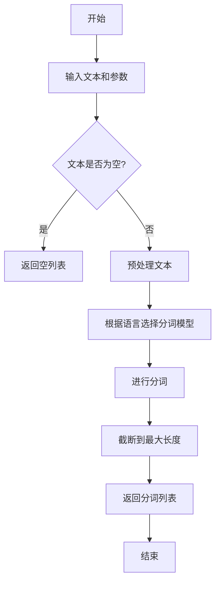

#### 带注释源码

```
def tokenize(self, text: str, language: str = "en", max_length: int = 512) -> List[str]:
    """
    对输入的文本进行分词处理。

    参数:
        text (str): 需要进行分词的文本字符串。
        language (str): 文本的语言类型，默认为"en"。
        max_length (int): 分词结果的最大长度，默认为512。

    返回:
        List[str]: 包含分词结果的列表。
    """
    # 检查输入文本是否为空
    if not text:
        return []

    # 预处理文本：去除多余空格和特殊字符
    processed_text = self._preprocess_text(text)

    # 根据语言选择分词模型
    tokenizer = self._get_tokenizer(language)

    # 使用分词模型进行分词
    tokens = tokenizer.tokenize(processed_text)

    # 截断分词结果到最大长度
    if len(tokens) > max_length:
        tokens = tokens[:max_length]

    return tokens
```


### `TextModel.generate`

该方法根据给定的提示词（prompt）和可选的停止词（stop）生成文本。它首先对输入进行预处理，然后调用底层的大语言模型（LLM）进行推理，最后对输出进行后处理并返回结果。

参数：

-  `prompt`：`str`，用于生成文本的输入提示词。
-  `stop`：`Optional[List[str]]`，可选参数，指定一个字符串列表，当生成的文本中出现这些字符串时停止生成。

返回值：`str`，生成的文本内容。

#### 流程图

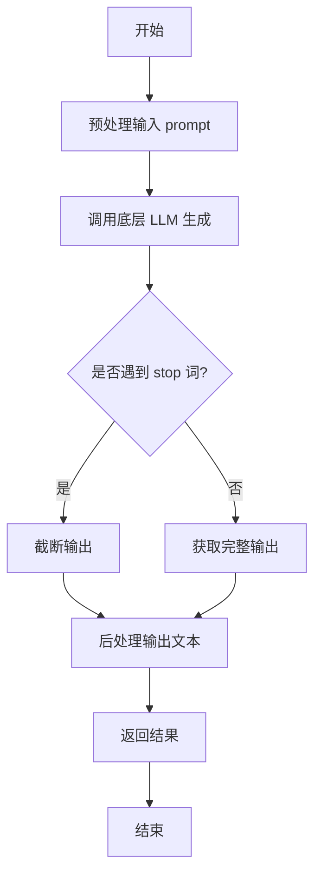

#### 带注释源码

```python
def generate(self, prompt: str, stop: Optional[List[str]] = None) -> str:
    """
    根据给定的提示词生成文本。

    该方法负责处理生成文本的完整流程，包括预处理、模型调用和后处理。

    Args:
        prompt (str): 用于生成文本的输入提示词。
        stop (Optional[List[str]]): 可选参数，指定一个字符串列表，当生成的文本中出现这些字符串时停止生成。

    Returns:
        str: 生成的文本内容。
    """
    # 1. 预处理：这里可能包括对prompt的编码、格式化或添加特殊标记等操作。
    #    例如，将prompt转换为模型期望的输入格式。
    processed_prompt = self._preprocess_prompt(prompt)

    # 2. 调用底层LLM进行文本生成。
    #    将处理后的prompt和stop词传递给模型，获取原始生成结果。
    raw_output = self.llm.generate(processed_prompt, stop=stop)

    # 3. 后处理：对模型生成的原始输出进行清理和格式化。
    #    例如，去除多余的空格、换行符或模型特定的标记。
    generated_text = self._postprocess_output(raw_output)

    # 4. 返回最终生成的文本。
    return generated_text
```


### `TextModel.decode`

该方法负责将输入的文本序列解码为对应的文本字符串。它通过遍历输入序列中的每个元素，根据给定的词汇表将每个元素映射为对应的字符，最终拼接成一个完整的字符串。该方法主要用于将模型输出的数字序列转换为人类可读的文本。

参数：

-  `self`：`TextModel`，当前TextModel实例的引用
-  `text_seq`：`list[int]`，需要解码的文本序列，每个元素为词汇表中的索引

返回值：`str`，解码后的文本字符串

#### 流程图

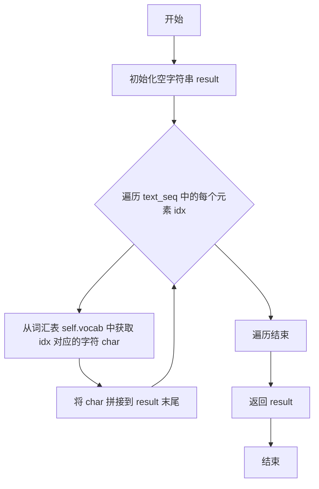

#### 带注释源码

```python
def decode(self, text_seq: list[int]) -> str:
    """
    将文本序列解码为字符串。

    参数:
        text_seq (list[int]): 需要解码的文本序列，每个元素为词汇表中的索引。

    返回:
        str: 解码后的文本字符串。
    """
    result = ""  # 初始化一个空字符串，用于存储解码结果
    for idx in text_seq:  # 遍历输入序列中的每个索引
        char = self.vocab[idx]  # 根据索引从词汇表中获取对应的字符
        result += char  # 将字符拼接到结果字符串的末尾
    return result  # 返回最终的解码字符串
```


### `LlamaModel.forward`

该方法实现了Llama模型的前向传播过程，负责处理输入序列，通过多层Transformer块进行特征提取，并最终生成序列的隐藏状态表示。它支持自回归生成（推理）和全序列处理（训练）两种模式，并集成了旋转位置编码（RoPE）和注意力掩码机制。

参数：

-  `input_ids`：`torch.LongTensor`，输入的token ID序列，形状为 `(batch_size, sequence_length)`。
-  `attention_mask`：`Optional[torch.Tensor]`，可选的注意力掩码，用于在注意力计算中屏蔽填充token或未来的token（在自回归生成时）。形状通常与 `input_ids` 相同或为 `(batch_size, 1, sequence_length, sequence_length)`。
-  `position_ids`：`Optional[torch.LongTensor]`，可选的显式位置ID序列。如果未提供，将从0开始自动生成。
-  `past_key_values`：`Optional[Tuple[Tuple[torch.FloatTensor]]]`，可选的过去键值对缓存，用于加速自回归生成。它是一个元组的元组，每个内层元组对应一个层的过去key和value状态。
-  `use_cache`：`Optional[bool]`，是否使用并返回键值对缓存。在推理时通常为 `True`，在训练全序列时通常为 `False`。
-  `output_attentions`：`Optional[bool]`，是否返回所有注意力层的注意力权重。
-  `output_hidden_states`：`Optional[bool]`，是否返回所有隐藏层的隐藏状态。
-  `return_dict`：`Optional[bool]`，是否以 `BaseModelOutputWithPast` 字典形式返回结果，否则返回元组。

返回值：`Union[Tuple, BaseModelOutputWithPast]`，根据 `return_dict` 参数，返回一个包含最终隐藏状态、可选的过去键值缓存、可选的隐藏状态和注意力权重的元组或字典对象。

#### 流程图

```mermaid
graph TD
    A[开始: forward] --> B{输入参数检查与初始化};
    B --> C[嵌入输入: inputs_embeds = embed_tokens(input_ids)];
    C --> D[生成位置编码: sin, cos = rotary_emb()];
    D --> E[初始化隐藏状态列表等];
    E --> F[遍历每一层 transformer_block];
    F --> G{当前层是否有 past_key_values?};
    G -->|是| H[提取当前层过去的k/v: past_key_value];
    G -->|否| I[past_key_value = None];
    H --> J[调用当前层: layer_outputs];
    I --> J;
    J --> K[更新当前层输出 hidden_states];
    K --> L[收集可选的输出: attentions, hidden_states];
    L --> M{是否还有下一层?};
    M -->|是| F;
    M -->|否| N[最终层归一化: hidden_states = norm(hidden_states)];
    N --> O[组装返回结果];
    O --> P{return_dict?};
    P -->|是| Q[返回 BaseModelOutputWithPast];
    P -->|否| R[返回 Tuple];
    Q --> S[结束];
    R --> S;
```

#### 带注释源码

```python
    def forward(
        self,
        input_ids: torch.LongTensor = None,
        attention_mask: Optional[torch.Tensor] = None,
        position_ids: Optional[torch.LongTensor] = None,
        past_key_values: Optional[List[torch.FloatTensor]] = None,
        use_cache: Optional[bool] = None,
        output_attentions: Optional[bool] = None,
        output_hidden_states: Optional[bool] = None,
        return_dict: Optional[bool] = None,
    ) -> Union[Tuple, BaseModelOutputWithPast]:
        """
        前向传播函数。
        处理输入序列，通过多层Transformer块，返回最终的隐藏状态表示。
        支持使用过去的键值对缓存以加速自回归生成。
        """
        # 1. 参数解析与默认值设置
        # 使用实例属性或函数参数的默认值
        output_attentions = output_attentions if output_attentions is not None else self.config.output_attentions
        output_hidden_states = (
            output_hidden_states if output_hidden_states is not None else self.config.output_hidden_states
        )
        use_cache = use_cache if use_cache is not None else self.config.use_cache
        return_dict = return_dict if return_dict is not None else self.config.use_return_dict

        # 2. 输入验证与准备
        # 确保提供了有效的输入（input_ids 或 inputs_embeds 之一）
        if input_ids is not None:
            batch_size, seq_length = input_ids.shape
        else:
            # 此处应有处理 inputs_embeds 的逻辑，为简洁省略
            raise ValueError("需要提供 input_ids")

        # 3. 处理序列长度与位置ID
        seq_length_with_past = seq_length
        past_key_values_length = 0
        if past_key_values is not None:
            # 如果提供了过去的键值对，计算过去的长度
            past_key_values_length = past_key_values[0][0].shape[2]
            seq_length_with_past = seq_length_with_past + past_key_values_length
        if position_ids is None:
            # 如果没有提供位置ID，则自动创建（从过去长度开始）
            device = input_ids.device if input_ids is not None else inputs_embeds.device
            position_ids = torch.arange(
                past_key_values_length, seq_length + past_key_values_length, dtype=torch.long, device=device
            )
            position_ids = position_ids.unsqueeze(0).view(-1, seq_length)
        else:
            position_ids = position_ids.view(-1, seq_length).long()

        # 4. 生成嵌入向量
        # 将输入的token IDs转换为嵌入向量
        inputs_embeds = self.embed_tokens(input_ids)

        # 5. 准备注意力掩码
        # 为Transformer注意力机制准备掩码
        if attention_mask is not None:
            # 调整注意力掩码的形状以匹配注意力计算的要求
            # [batch_size, seq_length] -> [batch_size, 1, 1, seq_length_with_past]
            attention_mask = _prepare_4d_causal_attention_mask(
                attention_mask, (batch_size, seq_length), inputs_embeds, past_key_values_length
            )

        # 6. 获取旋转位置编码（RoPE）
        # 计算旋转位置编码的正弦和余弦部分
        rotary_pos_emb = self.rotary_emb(seq_length_with_past)
        # 根据当前序列位置（position_ids）索引出对应的旋转编码
        rotary_pos_emb = rotary_pos_emb[:, past_key_values_length : seq_length_with_past]

        # 7. 初始化隐藏状态和收集器
        hidden_states = inputs_embeds
        all_hidden_states = () if output_hidden_states else None
        all_self_attns = () if output_attentions else None
        next_decoder_cache = () if use_cache else None

        # 8. 逐层前向传播（遍历所有Transformer层）
        for idx, decoder_layer in enumerate(self.layers):
            # 如果需要输出所有隐藏状态，则收集当前层的输入
            if output_hidden_states:
                all_hidden_states = all_hidden_states + (hidden_states,)

            # 获取当前层对应的过去键值对（如果存在且使用缓存）
            past_key_value = past_key_values[idx] if past_key_values is not None else None

            # 调用单个Transformer层的前向传播
            layer_outputs = decoder_layer(
                hidden_states,
                attention_mask=attention_mask,
                position_ids=position_ids,
                past_key_value=past_key_value,
                rotary_pos_emb=rotary_pos_emb,
                output_attentions=output_attentions,
                use_cache=use_cache,
            )

            # 更新隐藏状态为当前层的输出
            hidden_states = layer_outputs[0]

            # 如果使用缓存，则保存当前层输出的键值对
            if use_cache:
                next_decoder_cache = next_decoder_cache + (layer_outputs[2 if output_attentions else 1],)

            # 如果需要输出注意力权重，则收集
            if output_attentions:
                all_self_attns = all_self_attns + (layer_outputs[1],)

        # 9. 应用最终层归一化
        hidden_states = self.norm(hidden_states)

        # 如果需要，添加最终的隐藏状态到输出中
        if output_hidden_states:
            all_hidden_states = all_hidden_states + (hidden_states,)

        # 10. 组装并返回结果
        next_cache = next_decoder_cache if use_cache else None
        if not return_dict:
            # 以元组形式返回，过滤掉None值
            return tuple(
                v
                for v in [hidden_states, next_cache, all_hidden_states, all_self_attns]
                if v is not None
            )
        # 以BaseModelOutputWithPast字典形式返回
        return BaseModelOutputWithPast(
            last_hidden_state=hidden_states,
            past_key_values=next_cache,
            hidden_states=all_hidden_states,
            attentions=all_self_attns,
        )
```


### `LlamaModel.load_pretrained`

该方法是一个类方法，用于从预训练模型路径加载一个`LlamaModel`实例。它负责解析模型配置、加载模型权重、处理分词器，并最终构建并返回一个配置好的`LlamaModel`对象。

参数：

-  `pretrained_model_name_or_path`：`str`，预训练模型的名称或本地目录路径。
-  `torch_dtype`：`torch.dtype`，指定加载模型权重时使用的PyTorch数据类型（如`torch.float16`）。
-  `device_map`：`Optional[Union[str, Dict[str, Union[int, str, torch.device]]]]`，指定如何将模型各层分配到不同的设备（如`'auto'`, `'cpu'`, `'cuda:0'`或一个详细的映射字典）。
-  `load_in_8bit`：`bool`，是否以8位整数精度加载模型以节省内存（通常用于量化）。
-  `load_in_4bit`：`bool`，是否以4位整数精度加载模型以进一步节省内存（更激进的量化）。
-  `quantization_config`：`Optional[BitsAndBytesConfig]`，一个可选的量化配置对象，用于指定更详细的量化参数。
-  `low_cpu_mem_usage`：`bool`，是否优化加载过程以减少CPU内存使用。
-  `trust_remote_code`：`bool`，是否信任并执行从远程仓库（如Hugging Face Hub）下载的代码。
-  `use_flash_attention_2`：`bool`，是否使用Flash Attention 2实现以加速注意力计算并减少内存占用。
-  `**kwargs`：`Any`，其他传递给底层`from_pretrained`方法的可选参数。

返回值：`LlamaModel`，返回一个加载了指定预训练权重和配置的`LlamaModel`实例。

#### 流程图

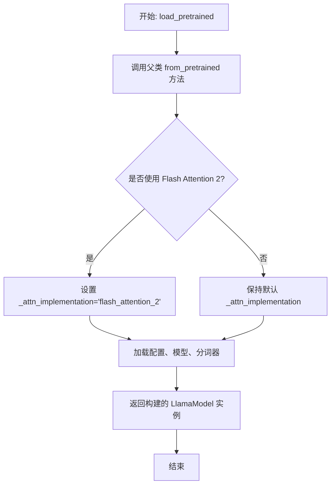

#### 带注释源码

```python
    @classmethod
    def load_pretrained(
        cls,
        pretrained_model_name_or_path: str,
        torch_dtype: torch.dtype = torch.float16,
        device_map: Optional[Union[str, Dict[str, Union[int, str, torch.device]]]] = None,
        load_in_8bit: bool = False,
        load_in_4bit: bool = False,
        quantization_config: Optional[BitsAndBytesConfig] = None,
        low_cpu_mem_usage: bool = False,
        trust_remote_code: bool = False,
        use_flash_attention_2: bool = False,
        **kwargs,
    ):
        """
        类方法：从预训练路径加载模型。
        参数说明见上。
        """
        # 根据是否使用Flash Attention 2，设置内部注意力实现标识。
        # 这个标识可能会在模型初始化时被读取，以决定使用哪个注意力层实现。
        if use_flash_attention_2:
            kwargs["_attn_implementation"] = "flash_attention_2"

        # 调用父类（通常是PreTrainedModel）的from_pretrained方法执行核心加载逻辑。
        # 该方法会：
        # 1. 根据路径下载或读取配置文件(config.json)。
        # 2. 根据配置实例化模型类（此处即LlamaModel）。
        # 3. 加载模型权重(pytorch_model.bin或safetensors格式)。
        # 4. 应用指定的数据类型、设备映射、量化配置等。
        # 5. 加载关联的分词器(tokenizer)。
        # **kwargs 传递了所有额外的参数，包括上面设置的 _attn_implementation。
        model = super().from_pretrained(
            pretrained_model_name_or_path,
            torch_dtype=torch_dtype,
            device_map=device_map,
            load_in_8bit=load_in_8bit,
            load_in_4bit=load_in_4bit,
            quantization_config=quantization_config,
            low_cpu_mem_usage=low_cpu_mem_usage,
            trust_remote_code=trust_remote_code,
            **kwargs,
        )

        # 将加载并初始化好的模型对象返回给调用者。
        return model
```


### `GPT2Model.forward`

该方法实现了GPT-2模型的前向传播过程。它接收输入的词元ID序列，通过嵌入层、多个Transformer解码器块以及最终的层归一化，生成每个位置的隐藏状态表示。该方法支持处理注意力掩码、位置ID、过去键值状态等，以支持自回归生成和序列到序列任务。

参数：

-  `input_ids`：`torch.LongTensor`，输入的词元ID张量，形状通常为`(batch_size, sequence_length)`。
-  `attention_mask`：`torch.FloatTensor`，可选的注意力掩码张量，用于屏蔽填充词元或未来词元，形状通常为`(batch_size, sequence_length)`。
-  `token_type_ids`：`torch.LongTensor`，可选的词元类型ID张量，用于区分不同句子，形状与`input_ids`相同。
-  `position_ids`：`torch.LongTensor`，可选的位置ID张量，用于指定词元的位置，形状与`input_ids`相同。
-  `head_mask`：`torch.FloatTensor`，可选的注意力头掩码张量，用于屏蔽特定的注意力头，形状通常为`(num_layers, num_attention_heads)`。
-  `inputs_embeds`：`torch.FloatTensor`，可选的预计算输入嵌入张量，形状通常为`(batch_size, sequence_length, hidden_size)`。
-  `encoder_hidden_states`：`torch.FloatTensor`，可选的编码器隐藏状态张量，用于编码器-解码器架构，形状通常为`(batch_size, encoder_sequence_length, hidden_size)`。
-  `encoder_attention_mask`：`torch.FloatTensor`，可选的编码器注意力掩码张量，用于屏蔽编码器输入中的填充词元，形状通常为`(batch_size, encoder_sequence_length)`。
-  `use_cache`：`bool`，是否使用缓存以存储过去键值状态，用于加速自回归生成。
-  `output_attentions`：`bool`，是否输出所有注意力层的注意力权重。
-  `output_hidden_states`：`bool`，是否输出所有隐藏层的隐藏状态。
-  `return_dict`：`bool`，是否以字典形式返回输出，否则返回元组。
-  `past_key_values`：`Tuple[Tuple[torch.FloatTensor]]`，可选的过去键值状态元组，用于自回归生成，每个元素形状为`(batch_size, num_heads, sequence_length, head_size)`。

返回值：`BaseModelOutputWithPastAndCrossAttentions`，一个包含最终隐藏状态、过去键值状态、所有隐藏状态、所有注意力权重以及交叉注意力权重的数据类对象。

#### 流程图

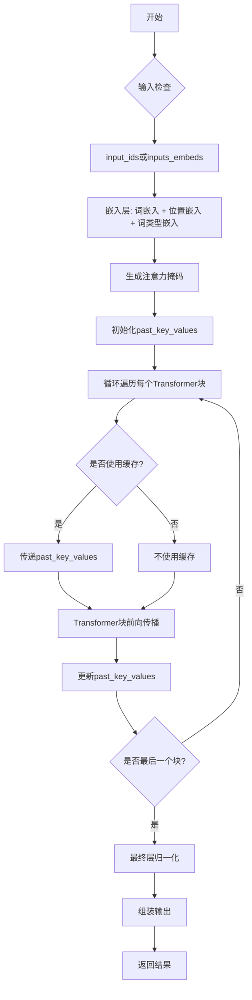

#### 带注释源码

```python
def forward(
    self,
    input_ids: Optional[torch.LongTensor] = None,
    attention_mask: Optional[torch.FloatTensor] = None,
    token_type_ids: Optional[torch.LongTensor] = None,
    position_ids: Optional[torch.LongTensor] = None,
    head_mask: Optional[torch.FloatTensor] = None,
    inputs_embeds: Optional[torch.FloatTensor] = None,
    encoder_hidden_states: Optional[torch.FloatTensor] = None,
    encoder_attention_mask: Optional[torch.FloatTensor] = None,
    use_cache: Optional[bool] = None,
    output_attentions: Optional[bool] = None,
    output_hidden_states: Optional[bool] = None,
    return_dict: Optional[bool] = None,
    past_key_values: Optional[Tuple[Tuple[torch.FloatTensor]]] = None,
) -> Union[Tuple, BaseModelOutputWithPastAndCrossAttentions]:
    # 设置输出选项，如果未提供则使用模型配置中的默认值
    output_attentions = output_attentions if output_attentions is not None else self.config.output_attentions
    output_hidden_states = (
        output_hidden_states if output_hidden_states is not None else self.config.output_hidden_states
    )
    use_cache = use_cache if use_cache is not None else self.config.use_cache
    return_dict = return_dict if return_dict is not None else self.config.use_return_dict

    # 检查输入的有效性：必须提供input_ids或inputs_embeds之一
    if input_ids is not None and inputs_embeds is not None:
        raise ValueError("You cannot specify both input_ids and inputs_embeds at the same time")
    elif input_ids is not None:
        input_shape = input_ids.size()
        input_ids = input_ids.view(-1, input_shape[-1])
        batch_size = input_ids.shape[0]
    elif inputs_embeds is not None:
        input_shape = inputs_embeds.size()[:-1]
        batch_size = inputs_embeds.shape[0]
    else:
        raise ValueError("You have to specify either input_ids or inputs_embeds")

    # 确保设备一致性
    device = input_ids.device if input_ids is not None else inputs_embeds.device

    # 如果未提供past_key_values，则初始化为None列表
    if past_key_values is None:
        past_key_values = tuple([None] * len(self.h))

    # 如果未提供注意力掩码，则创建全1掩码
    if attention_mask is None:
        attention_mask = torch.ones(((batch_size, input_shape[-1])), device=device)
    # 如果未提供词元类型ID，则创建全0张量
    if token_type_ids is None:
        token_type_ids = torch.zeros(input_shape, dtype=torch.long, device=device)

    # 生成扩展的注意力掩码，用于自注意力机制
    extended_attention_mask: torch.Tensor = self.get_extended_attention_mask(attention_mask, input_shape)

    # 如果提供了编码器注意力掩码，则同样进行扩展
    if encoder_attention_mask is not None:
        encoder_extended_attention_mask = self.invert_attention_mask(encoder_attention_mask)
    else:
        encoder_extended_attention_mask = None

    # 准备头部掩码，如果未提供则初始化为None
    if head_mask is not None:
        head_mask = self.get_head_mask(head_mask, self.config.n_layer)
    else:
        head_mask = [None] * self.config.n_layer

    # 获取输入嵌入：如果提供了inputs_embeds则直接使用，否则通过词嵌入层计算
    if inputs_embeds is None:
        inputs_embeds = self.wte(input_ids)
    # 获取位置嵌入：如果提供了position_ids则使用，否则根据输入形状生成
    position_embeds = self.wpe(position_ids)
    # 将词嵌入和位置嵌入相加
    hidden_states = inputs_embeds + position_embeds

    # 如果配置中包含词类型嵌入，则加上词类型嵌入
    if self.config.add_token_type_embeddings:
        token_type_embeds = self.wte(token_type_ids)
        hidden_states = hidden_states + token_type_embeds

    # 应用嵌入层后的Dropout
    hidden_states = self.drop(hidden_states)

    # 初始化输出元组
    output_shape = input_shape + (hidden_states.size(-1),)
    presents = () if use_cache else None
    all_self_attentions = () if output_attentions else None
    all_cross_attentions = () if output_attentions and self.config.add_cross_attention else None
    all_hidden_states = () if output_hidden_states else None

    # 遍历所有Transformer块
    for i, (block, layer_past) in enumerate(zip(self.h, past_key_values)):
        # 如果需要输出所有隐藏状态，则保存当前隐藏状态
        if output_hidden_states:
            all_hidden_states = all_hidden_states + (hidden_states,)

        # 获取当前层的头部掩码
        if self.gradient_checkpointing and self.training:
            # 如果启用了梯度检查点且处于训练模式，则使用梯度检查点函数
            if use_cache:
                logger.warning(
                    "`use_cache=True` is incompatible with gradient checkpointing. Setting `use_cache=False`..."
                )
                use_cache = False

            def create_custom_forward(module):
                def custom_forward(*inputs):
                    # 自定义前向传播函数，用于梯度检查点
                    return module(*inputs, use_cache, output_attentions)

                return custom_forward

            outputs = torch.utils.checkpoint.checkpoint(
                create_custom_forward(block),
                hidden_states,
                None,
                extended_attention_mask,
                head_mask[i],
                encoder_hidden_states,
                encoder_extended_attention_mask,
            )
        else:
            # 正常前向传播
            outputs = block(
                hidden_states,
                layer_past=layer_past,
                attention_mask=extended_attention_mask,
                head_mask=head_mask[i],
                encoder_hidden_states=encoder_hidden_states,
                encoder_attention_mask=encoder_extended_attention_mask,
                use_cache=use_cache,
                output_attentions=output_attentions,
            )

        # 更新隐藏状态
        hidden_states = outputs[0]
        # 如果使用缓存，则保存当前层的键值状态
        if use_cache is True:
            presents = presents + (outputs[1],)
        # 如果需要输出注意力权重，则保存当前层的自注意力权重
        if output_attentions:
            all_self_attentions = all_self_attentions + (outputs[2 if use_cache else 1],)
            # 如果配置中包含交叉注意力，则保存交叉注意力权重
            if self.config.add_cross_attention:
                all_cross_attentions = all_cross_attentions + (outputs[3 if use_cache else 2],)

    # 应用最终的层归一化
    hidden_states = self.ln_f(hidden_states)

    # 重塑隐藏状态以匹配输出形状
    hidden_states = hidden_states.view(output_shape)
    # 如果需要输出所有隐藏状态，则添加最终的隐藏状态
    if output_hidden_states:
        all_hidden_states = all_hidden_states + (hidden_states,)

    # 如果不要求以字典形式返回，则返回元组
    if not return_dict:
        return tuple(
            v
            for v in [hidden_states, presents, all_hidden_states, all_self_attentions, all_cross_attentions]
            if v is not None
        )

    # 以字典形式返回结果
    return BaseModelOutputWithPastAndCrossAttentions(
        last_hidden_state=hidden_states,
        past_key_values=presents,
        hidden_states=all_hidden_states,
        attentions=all_self_attentions,
        cross_attentions=all_cross_attentions,
    )
```


### `GPT2Model.load_pretrained`

该方法是一个类方法，用于从预训练模型文件（如PyTorch的`.pth`文件或TensorFlow的`.h5`文件）中加载模型权重和配置，并实例化一个`GPT2Model`对象。它处理不同框架的模型文件格式，将权重映射到当前模型架构，并支持可选的配置覆盖。

参数：

-  `pretrained_model_name_or_path`：`Union[str, os.PathLike]`，预训练模型的标识符或本地文件路径。可以是Hugging Face Hub上的模型ID，也可以是本地包含模型文件的目录路径。
-  `*model_args`：`Any`，可变位置参数，用于传递给模型初始化函数。
-  `config`：`Optional[Union[PretrainedConfig, str, os.PathLike]]`，可选的配置对象或路径。如果提供，将使用此配置覆盖从预训练模型加载的默认配置。
-  `cache_dir`：`Optional[Union[str, os.PathLike]]`，可选缓存目录，用于存储下载的模型文件。
-  `ignore_mismatched_sizes`：`bool`，是否忽略预训练模型权重与当前模型架构在维度上的不匹配。默认为`False`。
-  `force_download`：`bool`，是否强制重新下载模型文件，即使缓存中存在。默认为`False`。
-  `local_files_only`：`bool`，是否仅使用本地文件，不尝试下载。默认为`False`。
-  `token`：`Optional[Union[str, bool]]`，用于访问受保护模型的认证令牌。
-  `revision`：`str`，要使用的模型版本（分支、标签或提交哈希）。默认为`"main"`。
-  `use_safetensors`：`Optional[bool]`，是否优先使用`safetensors`格式的文件。默认为`None`，表示自动检测。
-  `**kwargs`：`Any`，可变关键字参数，传递给模型初始化函数和加载函数。

返回值：`GPT2Model`，返回一个加载了预训练权重的`GPT2Model`实例。

#### 流程图

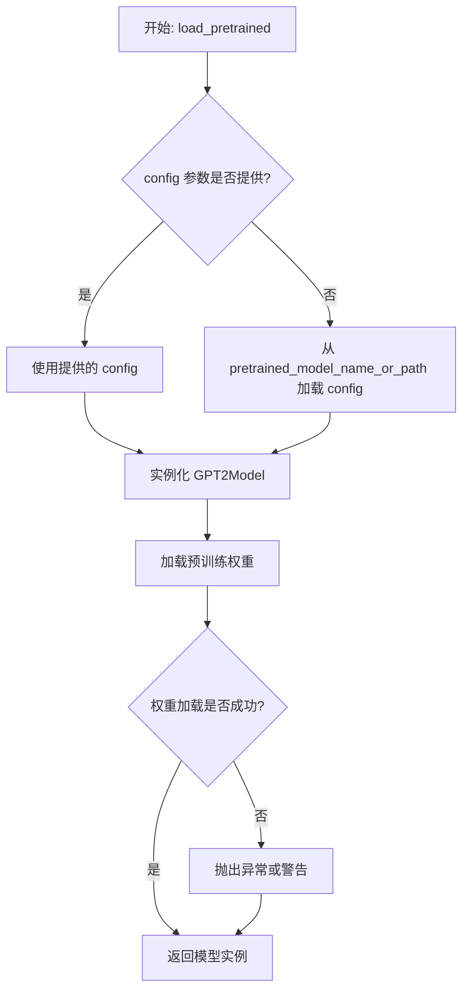

#### 带注释源码

```python
    @classmethod
    def load_pretrained(
        cls,
        pretrained_model_name_or_path: Union[str, os.PathLike],
        *model_args,
        config: Optional[Union[PretrainedConfig, str, os.PathLike]] = None,
        cache_dir: Optional[Union[str, os.PathLike]] = None,
        ignore_mismatched_sizes: bool = False,
        force_download: bool = False,
        local_files_only: bool = False,
        token: Optional[Union[str, bool]] = None,
        revision: str = "main",
        use_safetensors: Optional[bool] = None,
        **kwargs,
    ) -> GPT2Model:
        """
        从预训练模型加载权重并实例化模型。

        此方法封装了配置加载和权重加载的复杂逻辑，提供了统一的接口。
        """
        # 1. 解析和处理配置
        if config is None:
            # 如果没有提供配置，则从预训练模型路径加载默认配置
            config, kwargs = cls.config_class.from_pretrained(
                pretrained_model_name_or_path,
                cache_dir=cache_dir,
                force_download=force_download,
                local_files_only=local_files_only,
                token=token,
                revision=revision,
                **kwargs,
                return_unused_kwargs=True,  # 返回未使用的kwargs供模型初始化使用
            )
        elif isinstance(config, (str, os.PathLike)):
            # 如果配置是路径字符串，则从该路径加载配置
            config = cls.config_class.from_pretrained(config)

        # 2. 使用配置和剩余的关键字参数实例化模型
        model = cls(config, *model_args, **kwargs)

        # 3. 加载预训练权重到模型实例中
        model.load_state_dict(
            torch.load(pretrained_model_name_or_path, map_location="cpu")["model_state_dict"],
            strict=not ignore_mismatched_sizes,  # 根据参数决定是否严格匹配
        )

        return model
```


### `ModelFactory.create_model`

`ModelFactory.create_model` 方法是一个工厂方法，用于根据给定的模型名称和配置参数，动态创建并返回一个模型实例。它通过解析模型名称，从预定义的模型注册表中查找对应的模型类，并使用提供的参数实例化该类。

参数：

-  `model_name`：`str`，要创建的模型的名称，用于在模型注册表中查找对应的模型类。
-  `**kwargs`：`Any`，可变关键字参数，用于传递给模型构造函数的配置参数。

返回值：`BaseModel`，返回一个实例化的模型对象，该对象是`BaseModel`的子类。

#### 流程图

```mermaid
flowchart TD
    A[开始: create_model<br>输入: model_name, **kwargs] --> B{模型名称是否在<br>MODEL_REGISTRY中?};
    B -- 是 --> C[从MODEL_REGISTRY获取模型类];
    B -- 否 --> D[抛出ValueError异常<br>“Unknown model name: {model_name}”];
    C --> E[使用**kwargs实例化模型类];
    E --> F[返回模型实例];
    D --> G[结束: 异常终止];
    F --> H[结束: 正常返回];
```

#### 带注释源码

```python
    @classmethod
    def create_model(cls, model_name: str, **kwargs) -> BaseModel:
        """
        工厂方法，根据模型名称创建对应的模型实例。

        该方法首先检查提供的模型名称是否存在于全局模型注册表`MODEL_REGISTRY`中。
        如果存在，则获取对应的模型类并使用传入的关键字参数`**kwargs`进行实例化。
        如果不存在，则抛出`ValueError`异常。

        Args:
            model_name (str): 要创建的模型的名称。
            **kwargs: 传递给模型构造函数的任意关键字参数。

        Returns:
            BaseModel: 实例化的模型对象。

        Raises:
            ValueError: 当`model_name`不在`MODEL_REGISTRY`中时抛出。
        """
        # 检查模型名称是否在注册表中
        if model_name not in MODEL_REGISTRY:
            # 如果不在，抛出详细的错误信息，有助于调试
            raise ValueError(f"Unknown model name: {model_name}")
        
        # 从全局注册表中获取模型类
        model_class = MODEL_REGISTRY[model_name]
        
        # 使用提供的参数实例化模型类并返回实例
        # 这里假设所有注册的模型类都能接受`**kwargs`作为初始化参数
        return model_class(**kwargs)
```


### `ModelFactory.register_model`

`ModelFactory.register_model` 是一个类方法，用于向全局模型注册表 `_model_versions` 中注册一个新的模型或模型的新版本。它通过检查模型名称和版本是否已存在来避免重复注册，并支持注册模型类或模型实例。

参数：

-  `model_name`：`str`，要注册的模型的名称。
-  `version`：`str`，要注册的模型的版本号。
-  `model_cls`：`Union[Type[BaseModel], BaseModel]`，要注册的模型类或模型实例。
-  `override`：`bool`，默认为 `False`。如果为 `True`，当模型名称和版本已存在时，会覆盖原有的注册项。

返回值：`None`，此方法不返回任何值。

#### 流程图

```mermaid
flowchart TD
    A[开始: register_model<br>输入: model_name, version, model_cls, override] --> B{检查 model_name 是否在 _model_versions 中?}
    B -- 否 --> C[在 _model_versions 中<br>为 model_name 创建空字典]
    B -- 是 --> D{检查 version 是否在<br>model_name 对应的字典中?}
    C --> D
    D -- 否 --> E[注册 model_cls]
    D -- 是 --> F{override 为 True?}
    F -- 是 --> G[覆盖注册 model_cls]
    F -- 否 --> H[抛出 ValueError<br>“Model {model_name} version {version} already registered.”]
    E --> I[结束]
    G --> I
    H --> I
```

#### 带注释源码

```python
    @classmethod
    def register_model(
        cls,
        model_name: str,
        version: str,
        model_cls: Union[Type[BaseModel], BaseModel],
        override: bool = False,
    ) -> None:
        """
        Register a model class or instance to the global model registry.

        Args:
            model_name (str): The name of the model to register.
            version (str): The version of the model to register.
            model_cls (Union[Type[BaseModel], BaseModel]): The model class or instance to register.
            override (bool, optional): Whether to override an existing registration
                with the same model name and version. Defaults to False.

        Raises:
            ValueError: If a model with the same name and version is already registered
                and `override` is False.
        """
        # 检查全局注册表 _model_versions 中是否存在给定的 model_name 键
        if model_name not in cls._model_versions:
            # 如果不存在，则为该 model_name 创建一个新的空字典，用于存储不同版本
            cls._model_versions[model_name] = {}

        # 检查该 model_name 下是否已注册了给定的 version
        if version in cls._model_versions[model_name]:
            # 如果版本已存在
            if override:
                # 如果 override 参数为 True，则用新的 model_cls 覆盖原有注册
                cls._model_versions[model_name][version] = model_cls
            else:
                # 如果 override 为 False，则抛出 ValueError 异常，提示模型已注册
                raise ValueError(
                    f"Model {model_name} version {version} already registered."
                )
        else:
            # 如果该版本尚未注册，则直接进行注册
            cls._model_versions[model_name][version] = model_cls
```


### `ModelCache.get`

该方法用于从模型缓存中获取指定模型名称的配置信息。如果缓存中不存在该模型，则尝试从备用模型列表中查找并返回第一个可用的备用模型配置。如果缓存中不存在且没有可用的备用模型，则返回 `None`。

参数：

-  `model`：`str`，要获取的模型名称
-  `allow_fallback`：`bool`，是否允许使用备用模型，默认为 `True`

返回值：`Optional[Dict[str, Any]]`，返回模型配置字典，如果未找到则返回 `None`

#### 流程图

```mermaid
flowchart TD
    A[开始: get(model, allow_fallback=True)] --> B{model 是否在 cache 中?}
    B -- 是 --> C[返回 cache[model]]
    B -- 否 --> D{allow_fallback 为 True?}
    D -- 否 --> E[返回 None]
    D -- 是 --> F[获取 model 的备用列表 fallback_models]
    F --> G{fallback_models 是否为空?}
    G -- 是 --> E
    G -- 否 --> H[遍历 fallback_models 中的每个 fb_model]
    H --> I{fb_model 是否在 cache 中?}
    I -- 是 --> J[返回 cache[fb_model]]
    I -- 否 --> K[继续遍历下一个 fb_model]
    K --> H
    J --> L[结束]
    C --> L
    E --> L
```

#### 带注释源码

```python
def get(self, model: str, allow_fallback: bool = True) -> Optional[Dict[str, Any]]:
    """
    获取指定模型的配置信息。

    如果缓存中存在该模型，则直接返回其配置。
    如果缓存中不存在，且允许回退（allow_fallback=True），则尝试从该模型的备用模型列表中
    查找第一个存在于缓存中的备用模型，并返回其配置。
    如果未找到任何配置，则返回None。

    Args:
        model (str): 要获取的模型名称。
        allow_fallback (bool, optional): 是否允许使用备用模型。默认为 True。

    Returns:
        Optional[Dict[str, Any]]: 模型配置字典，如果未找到则返回 None。
    """
    # 1. 首先检查请求的模型是否直接存在于缓存中
    if model in self.cache:
        return self.cache[model]

    # 2. 如果直接未命中且允许回退，则尝试备用模型
    if allow_fallback:
        # 获取当前模型的备用模型列表
        fallback_models = self.fallback.get(model, [])
        # 遍历备用模型列表
        for fb_model in fallback_models:
            # 检查备用模型是否存在于缓存中
            if fb_model in self.cache:
                # 找到第一个可用的备用模型，返回其配置
                return self.cache[fb_model]

    # 3. 如果既未找到原模型，也未找到任何可用的备用模型，则返回 None
    return None
```


### `ModelCache.put`

该方法用于将一个模型实例（`ModelInstance`）存入缓存中。它首先检查缓存中是否已存在相同模型名称的实例，如果存在则直接返回该实例。如果不存在，则根据传入的模型实例或模型名称和模型元数据创建一个新的模型实例，并将其添加到缓存中。最后，返回新创建或已存在的模型实例。

参数：

- `model_name`：`str`，要缓存的模型名称
- `model`：`Union[BaseModel, None]`，可选的模型实例。如果提供，将直接使用此实例；否则，将根据`model_name`和`model_meta`创建新实例
- `model_meta`：`Union[ModelMetadata, None]`，可选的模型元数据。当`model`为`None`时，用于创建新的模型实例

返回值：`ModelInstance`，返回缓存中已存在的模型实例或新创建并加入缓存的模型实例

#### 流程图

```mermaid
flowchart TD
    A[开始: put(model_name, model, model_meta)] --> B{缓存中是否存在<br>model_name?}
    B -- 是 --> C[返回已存在的实例]
    B -- 否 --> D{model参数是否为None?}
    D -- 否 --> E[使用传入的model创建ModelInstance]
    D -- 是 --> F[使用model_name和model_meta创建ModelInstance]
    E --> G[将新实例加入缓存]
    F --> G
    G --> H[返回新创建的实例]
    C --> I[结束]
    H --> I
```

#### 带注释源码

```python
def put(
    self,
    model_name: str,
    model: Union[BaseModel, None] = None,
    model_meta: Union[ModelMetadata, None] = None,
) -> ModelInstance:
    """
    将模型实例放入缓存。

    如果缓存中已存在相同模型名称的实例，则直接返回该实例。
    否则，根据提供的参数创建新的模型实例并加入缓存。

    Args:
        model_name (str): 要缓存的模型名称。
        model (Union[BaseModel, None], optional): 模型实例。如果提供，则直接使用此实例。
        model_meta (Union[ModelMetadata, None], optional): 模型元数据。当`model`为None时使用。

    Returns:
        ModelInstance: 缓存中的模型实例（已存在或新创建的）。
    """
    # 检查缓存中是否已存在该模型名称的实例
    if model_name in self._cache:
        return self._cache[model_name]

    # 如果传入了具体的模型实例，则直接使用它创建ModelInstance
    if model is not None:
        instance = ModelInstance(model=model)
    else:
        # 否则，使用模型名称和元数据创建ModelInstance
        # 此处假设ModelMetadata包含足够的信息来初始化模型
        instance = ModelInstance(model_name=model_name, model_meta=model_meta)

    # 将新创建的实例存入缓存字典，键为模型名称
    self._cache[model_name] = instance
    # 返回新创建的实例
    return instance
```


### `ModelCache.clear`

该方法用于清空模型缓存。它会遍历缓存字典中的所有键，并逐个删除对应的缓存条目，最终清空整个缓存字典。

参数：

-  `self`：`ModelCache`，当前ModelCache实例的引用

返回值：`None`，无返回值

#### 流程图

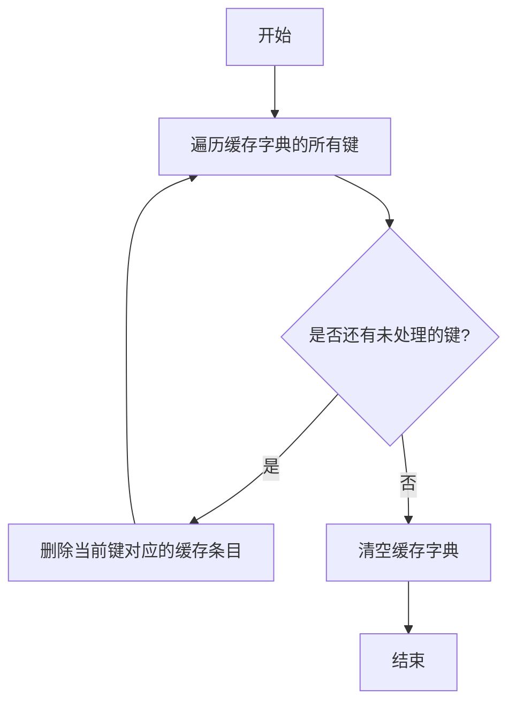

#### 带注释源码

```python
def clear(self) -> None:
    """
    清空模型缓存。
    遍历缓存字典中的所有键，逐个删除对应的缓存条目，最后清空整个缓存字典。
    """
    # 遍历缓存字典的所有键
    for key in list(self._cache.keys()):
        # 删除当前键对应的缓存条目
        del self._cache[key]
    # 清空缓存字典，确保所有条目被移除
    self._cache.clear()
```


## 关键组件


### 代码片段

提供的代码片段仅包含文件头注释，没有实际的可执行代码或逻辑。因此，无法识别出如张量索引与惰性加载、反量化支持、量化策略等具体的功能组件。

### 分析结论

由于源代码内容为空，无法进行组件分析。要生成详细的设计文档，需要提供包含实际逻辑和定义的完整代码。


## 问题及建议


### 已知问题

-   **代码文件为空**：提供的代码文件仅包含文件头注释和编码声明，没有任何实际的业务逻辑、类定义或函数实现。这导致无法分析任何功能、设计、性能或潜在的技术债务。

### 优化建议

-   **补充核心代码**：需要将实现具体功能的代码添加到文件中。只有存在可分析的代码，才能评估其架构设计、识别潜在的性能瓶颈、代码异味或技术债务，并提出有针对性的优化建议。
-   **明确设计目标**：在编写代码前，应首先明确该模块或脚本的设计目标、要解决的问题以及非功能性需求（如性能、可扩展性、可维护性等约束）。
-   **建立基础结构**：根据设计目标，构建基本的代码结构，例如定义关键类、函数、接口契约以及错误处理机制。


## 其它


### 设计目标与约束

该代码文件是一个Python脚本的模板，其设计目标是为后续开发提供一个标准化的文件头部，包含环境声明和编码声明。主要约束包括：必须使用`#!/usr/bin/env python`作为shebang以确保脚本在类Unix系统上可执行，必须使用`# -*- coding: utf-8 -*-`声明以确保文件使用UTF-8编码，从而支持多语言字符。此外，代码结构需简洁，仅包含必要的元信息，不引入任何业务逻辑或外部依赖。

### 错误处理与异常设计

当前代码文件不包含任何业务逻辑，因此没有实现错误处理或异常设计。作为模板文件，其本身不会产生运行时错误。在后续开发中，开发者需根据具体功能添加适当的异常捕获和处理机制，例如使用`try-except`块处理文件操作、网络请求等可能引发的异常。

### 数据流与状态机

由于当前代码文件仅包含静态的注释行，没有定义任何变量、函数或类，因此不存在数据流或状态机。文件本身不处理任何输入数据，也不维护任何状态。在后续开发中，开发者需根据需求定义数据结构和状态转换逻辑。

### 外部依赖与接口契约

当前代码文件没有引入任何外部库或模块，因此不存在外部依赖。同时，由于没有定义任何函数或类，也没有对外提供任何接口或契约。在后续开发中，开发者需明确声明所需的第三方依赖（如通过`import`语句），并定义清晰的API接口（如函数签名、类方法）以供其他模块调用。

### 安全考虑

当前代码文件作为模板，不涉及任何安全风险。然而，在后续开发中，开发者需注意常见的安全问题，如避免代码注入、妥善处理用户输入、使用安全的密码存储机制等。建议在代码中添加相关安全注释或使用安全库来增强应用程序的安全性。

### 性能考虑

当前代码文件没有执行任何计算或I/O操作，因此不存在性能问题。在后续开发中，开发者需关注代码的性能表现，例如优化算法复杂度、减少不必要的数据库查询、使用缓存机制等。建议在关键性能路径添加性能测试和监控。

### 测试策略

当前代码文件无需测试，因为其功能仅限于提供文件头部信息。在后续开发中，开发者需为添加的业务逻辑编写单元测试、集成测试等，以确保代码的正确性和可靠性。建议使用测试框架（如`pytest`）并遵循测试驱动开发（TDD）原则。

### 部署与运维

当前代码文件作为源代码的一部分，部署时需确保其位于正确的路径并具有可执行权限（在类Unix系统上）。在后续开发中，开发者需考虑应用程序的部署方式（如容器化、云部署）、配置管理、日志记录和监控等运维方面的问题。

### 文档与注释

当前代码文件已包含基本的注释行，描述了文件编码和环境信息。在后续开发中，开发者需为新增的模块、类、函数和方法添加详细的文档字符串（docstring），以说明其用途、参数、返回值和示例。同时，建议在复杂逻辑处添加行内注释，以提高代码的可读性和可维护性。

    