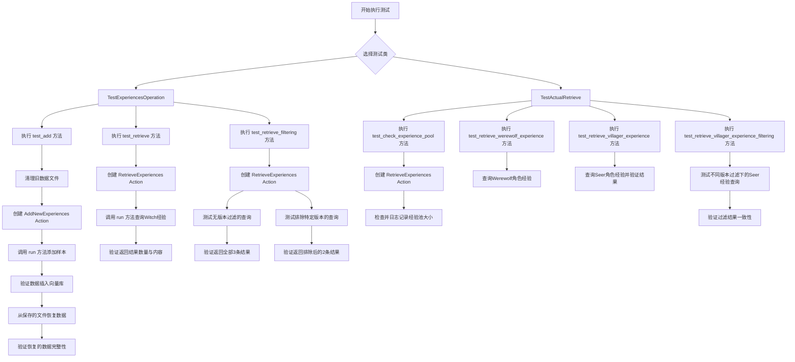
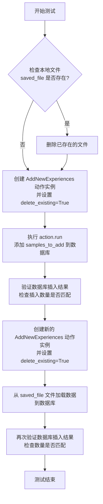
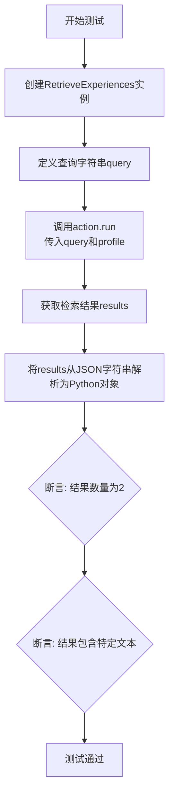
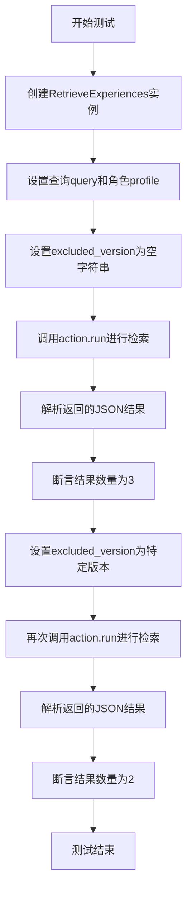
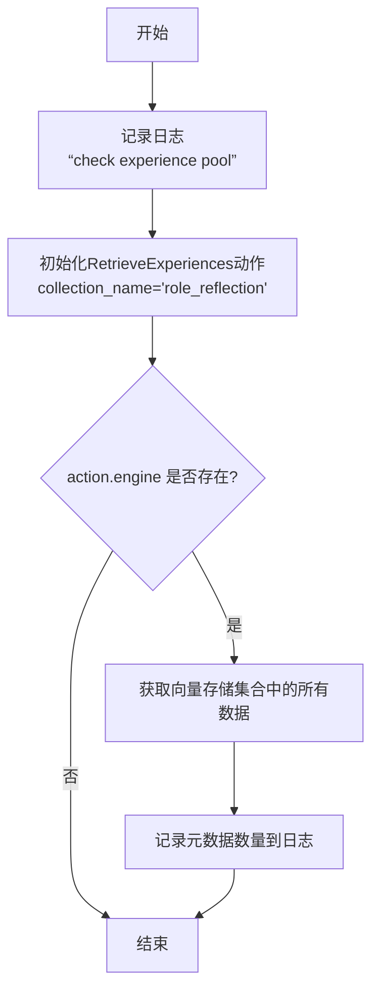
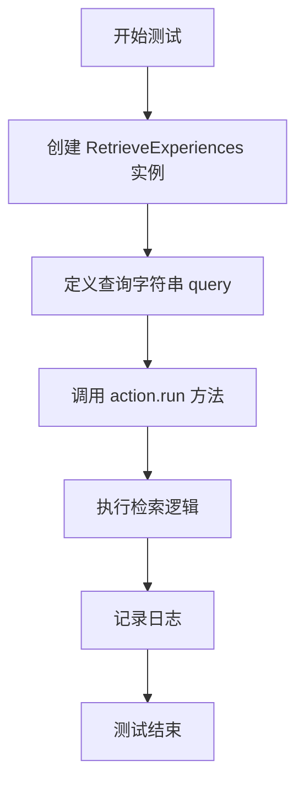
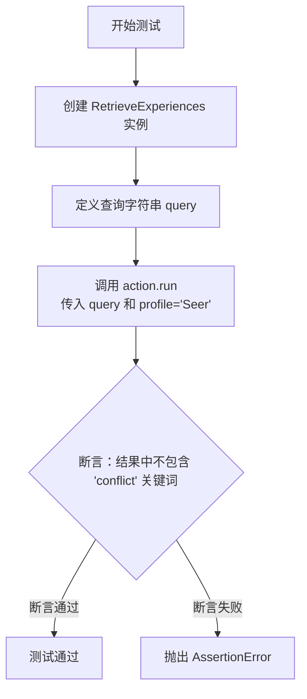
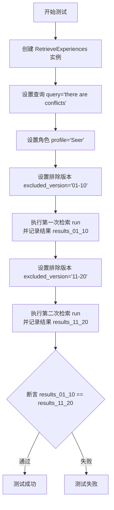

# `.\MetaGPT\tests\metagpt\ext\werewolf\actions\test_experience_operation.py` 详细设计文档

该文件是一个Pytest测试套件，用于验证MetaGPT狼人杀扩展模块中的经验存储与检索功能。它主要测试两个核心操作：1) 将角色经验（RoleExperience）数据添加至向量数据库并持久化到本地文件；2) 根据查询条件（如角色身份、版本号）从向量数据库中检索相关的历史经验。测试覆盖了数据插入、文件备份/恢复、基于语义和元数据的过滤检索等场景。

## 整体流程



## 类结构

```
TestExperiencesOperation (测试经验操作)
├── 类字段: collection_name, test_round_id, version, samples_to_add
├── 类方法: test_add, test_retrieve, test_retrieve_filtering
TestActualRetrieve (测试实际检索)
├── 类字段: collection_name
└── 类方法: test_check_experience_pool, test_retrieve_werewolf_experience, test_retrieve_villager_experience, test_retrieve_villager_experience_filtering
```

## 全局变量及字段


### `TestExperiencesOperation.collection_name`
    
用于测试的向量数据库集合名称，标识存储经验数据的特定集合。

类型：`str`
    


### `TestExperiencesOperation.test_round_id`
    
测试轮次标识符，用于关联一组测试经验数据。

类型：`str`
    


### `TestExperiencesOperation.version`
    
经验数据的版本标签，用于区分不同批次或来源的经验。

类型：`str`
    


### `TestExperiencesOperation.samples_to_add`
    
预定义的测试经验数据列表，包含不同角色和版本的模拟经验。

类型：`List[RoleExperience]`
    


### `TestActualRetrieve.collection_name`
    
实际经验检索测试中使用的向量数据库集合名称，指向包含真实或模拟经验数据的集合。

类型：`str`
    
    

## 全局函数及方法

### `TestExperiencesOperation.test_add`

这是一个异步单元测试方法，用于测试 `AddNewExperiences` 动作类。它首先向向量数据库添加一组预定义的 `RoleExperience` 样本，然后验证这些样本是否被正确插入。接着，它测试了从本地 JSON 文件恢复并重新加载这些经验数据到数据库的功能，确保数据持久化和恢复流程正常工作。

参数：
-  `self`：`TestExperiencesOperation`，当前测试类的实例

返回值：`None`，这是一个测试方法，不返回任何值，通过断言（assert）来验证测试结果。

#### 流程图



#### 带注释源码

```python
    @pytest.mark.asyncio
    async def test_add(self):
        # 1. 准备阶段：定义并清理可能存在的本地数据文件路径
        saved_file = DEFAULT_WORKSPACE_ROOT.joinpath(
            f"werewolf_game/experiences/{self.version}/{self.test_round_id}.json"
        )
        # 如果文件已存在，则先删除，确保测试环境干净
        if saved_file.exists():
            saved_file.unlink()

        # 2. 测试核心功能：创建动作实例并执行添加操作
        # 实例化 AddNewExperiences，指定集合名并设置删除现有数据
        action = AddNewExperiences(collection_name=self.collection_name, delete_existing=True)
        # 运行动作，将预定义的样本数据添加到向量数据库
        action.run(self.samples_to_add)

        # 3. 验证阶段：检查数据是否成功插入数据库
        # 通过内部引擎访问向量存储，获取已插入的文档
        inserted = action.engine.retriever._index._vector_store._collection.get()
        # 断言插入的文档数量与样本数量一致
        assert len(inserted["documents"]) == len(self.samples_to_add)

        # 4. 测试数据持久化与恢复功能
        # 创建一个新的动作实例（同样会清空现有数据）
        action = AddNewExperiences(collection_name=self.collection_name, delete_existing=True)
        # 从之前保存的本地 JSON 文件加载数据到数据库
        action.add_from_file(saved_file)
        # 再次验证从文件恢复的数据是否被正确插入
        inserted = action.engine.retriever._index._vector_store._collection.get()
        assert len(inserted["documents"]) == len(self.samples_to_add)
```

### `TestExperiencesOperation.test_retrieve`

这是一个单元测试方法，用于测试 `RetrieveExperiences` 动作的 `run` 方法。它验证了给定一个查询字符串和角色（profile）时，系统能否从经验库中正确检索出相关的经验条目，并返回预期数量的结果。

参数：
- `self`：`TestExperiencesOperation`，测试类实例的引用。
- 无其他显式参数。

返回值：`None`，这是一个测试方法，不返回业务值，而是通过断言（assert）来验证测试结果。

#### 流程图



#### 带注释源码

```python
@pytest.mark.asyncio  # 标记此测试函数为异步函数，以便pytest-asyncio插件能正确处理
async def test_retrieve(self):
    # 1. 实例化RetrieveExperiences动作，指定要操作的经验集合名称
    action = RetrieveExperiences(collection_name=self.collection_name)

    # 2. 定义一个查询字符串，模拟用户或系统提出的问题
    query = "one player claimed to be Seer and the other Witch"
    
    # 3. 执行检索操作。传入查询和角色筛选条件（profile="Witch"）。
    #    `action.run` 方法预期会返回一个JSON格式的字符串。
    results = action.run(query, profile="Witch")
    
    # 4. 将返回的JSON字符串解析为Python对象（这里预期是一个列表）
    results = json.loads(results)

    # 5. 断言1：验证检索到的经验条目数量是否为2。
    #    这基于测试数据 `self.samples_to_add` 中 `profile` 为 "Witch" 的条目数量。
    assert len(results) == 2, "Witch should have 2 experiences"
    
    # 6. 断言2：验证第一个检索结果中是否包含预期的文本片段。
    #    这用于确认检索到的内容确实是预置的测试数据之一。
    assert "The game is intense with two players" in results[0]
```

### `TestExperiencesOperation.test_retrieve_filtering`

这是一个单元测试方法，用于测试 `RetrieveExperiences` 动作的 `run` 方法在指定 `profile` 和 `excluded_version` 参数时的过滤功能。它验证了当查询特定角色（`TestRole`）的经验时，系统能够根据排除的版本号（`excluded_version`）正确过滤返回的结果数量。

参数：
- `self`：`TestExperiencesOperation`，测试类实例的引用。
- 无显式参数，但通过 `self` 访问了类属性 `collection_name`。

返回值：`None`，这是一个测试方法，不返回业务值，通过断言（`assert`）来验证测试结果。

#### 流程图



#### 带注释源码

```python
    @pytest.mark.asyncio
    async def test_retrieve_filtering(self):
        # 1. 创建RetrieveExperiences动作实例，指定集合名称为类属性collection_name
        action = RetrieveExperiences(collection_name=self.collection_name)

        # 2. 定义测试查询字符串和要过滤的角色
        query = "some test query"
        profile = "TestRole"

        # 3. 第一轮测试：不排除任何版本（excluded_version为空字符串）
        excluded_version = ""
        # 调用run方法进行经验检索，传入查询、角色和排除版本参数
        results = action.run(query, profile=profile, excluded_version=excluded_version)
        # 将返回的JSON字符串解析为Python对象（列表）
        results = json.loads(results)
        # 断言：当不排除版本时，应返回所有3条TestRole角色的经验记录
        assert len(results) == 3

        # 4. 第二轮测试：排除特定版本（self.version + "_21-30"）
        excluded_version = self.version + "_21-30"
        # 再次调用run方法，这次排除了一个版本
        results = action.run(query, profile=profile, excluded_version=excluded_version)
        # 解析结果
        results = json.loads(results)
        # 断言：排除一个版本后，应只返回2条经验记录
        assert len(results) == 2
```


### `TestActualRetrieve.test_check_experience_pool`

这是一个单元测试方法，用于检查名为“role_reflection”的经验池（向量数据库集合）的当前状态。它不执行任何具体的检索或过滤逻辑，而是初始化一个`RetrieveExperiences`动作实例，如果其引擎存在，则获取并记录该集合中所有经验条目的元数据数量，用于验证经验池是否已正确初始化并包含数据。

参数：
-  `self`：`TestActualRetrieve`，当前测试类的实例。

返回值：`None`，无返回值。

#### 流程图



#### 带注释源码

```python
@pytest.mark.asyncio
async def test_check_experience_pool(self):
    # 记录测试开始信息
    logger.info("check experience pool")
    # 初始化一个用于检索经验的Action，指定集合名称为'role_reflection'
    action = RetrieveExperiences(collection_name=self.collection_name)
    # 检查Action的引擎是否已成功初始化
    if action.engine:
        # 如果引擎存在，则直接访问底层向量存储的集合，获取所有数据
        all_experiences = action.engine.retriever._index._vector_store._collection.get()
        # 记录获取到的经验条目元数据的数量到日志中，用于调试和验证
        logger.info(f"{len(all_experiences['metadatas'])=}")
```


### `TestActualRetrieve.test_retrieve_werewolf_experience`

这是一个异步单元测试方法，用于测试 `RetrieveExperiences` 动作类在特定查询和角色配置下的经验检索功能。它模拟了一个查询场景，旨在验证系统能否为“Werewolf”角色检索到与“conflicts”相关的经验。

参数：
-  `self`：`TestActualRetrieve`，测试类实例的引用。
-  无显式传入参数，但方法内部使用了实例属性 `collection_name`。

返回值：`None`，这是一个测试方法，其主要目的是执行断言或验证逻辑，不返回业务值。

#### 流程图



#### 带注释源码

```python
    @pytest.mark.asyncio  # 标记此方法为异步测试，以便 pytest-asyncio 插件能够正确处理
    async def test_retrieve_werewolf_experience(self):
        # 实例化 RetrieveExperiences 动作类，指定用于测试的经验集合名称
        action = RetrieveExperiences(collection_name=self.collection_name)

        # 定义测试查询字符串，模拟一个与“冲突”相关的查询
        query = "there are conflicts"

        # 记录日志，输出当前的查询内容，便于测试调试和追踪
        logger.info(f"test retrieval with {query=}")
        # 调用 action 的 run 方法，执行经验检索。
        # 参数说明：
        #   - query: 检索查询字符串。
        #   - profile: 指定角色为“Werewolf”，用于在经验库中过滤相关角色的经验。
        # 此调用不处理返回值，仅验证方法能否正常执行而不抛出异常。
        action.run(query, "Werewolf")
```

### `TestActualRetrieve.test_retrieve_villager_experience`

这是一个单元测试方法，用于测试 `RetrieveExperiences` 动作在特定查询和角色（`Seer`）下的检索功能。它验证了当查询字符串为 “there are conflicts” 时，返回的结果中不包含 “conflict” 关键词，这可能是为了测试检索系统对语义相似但不完全匹配的查询的处理能力。

参数：
-  `self`：`TestActualRetrieve`，测试类实例的引用。
-  无其他显式参数。

返回值：`None`，这是一个测试方法，其主要目的是通过断言（`assert`）来验证功能，不返回业务值。

#### 流程图



#### 带注释源码

```python
@pytest.mark.asyncio
async def test_retrieve_villager_experience(self):
    # 实例化 RetrieveExperiences 动作，指定集合名称为 "role_reflection"
    action = RetrieveExperiences(collection_name=self.collection_name)

    # 定义测试用的查询字符串
    query = "there are conflicts"

    # 记录日志，输出当前的查询条件
    logger.info(f"test retrieval with {query=}")
    # 执行检索：传入查询字符串和角色档案（'Seer'）
    results = action.run(query, "Seer")
    # 断言：验证返回的 results 字符串中不包含 'conflict' 这个子串
    # 这可能用于测试检索系统对语义相似但不完全匹配的查询的处理
    assert "conflict" not in results  # 相似局面应该需要包含conflict关键词
```

### `TestActualRetrieve.test_retrieve_villager_experience_filtering`

该方法是一个异步单元测试，用于验证 `RetrieveExperiences` 动作在根据 `profile` 和 `excluded_version` 参数进行经验检索时的过滤功能。它通过使用不同的 `excluded_version` 值执行两次检索，并断言两次检索结果相同，以此来测试版本过滤逻辑的正确性。

参数：

-  `self`：`TestActualRetrieve`，测试类实例的引用。
-  `query`：`str`，用于检索经验的查询字符串，在本测试中固定为 `"there are conflicts"`。
-  `profile`：`str`，指定要检索经验的角色身份，在本测试中固定为 `"Seer"`。
-  `excluded_version`：`str`，指定要从检索结果中排除的经验版本号。测试中会分别传入 `"01-10"` 和 `"11-20"` 进行两次调用。
-  `verbose`：`bool`，控制是否输出详细日志，在本测试中固定为 `True`。

返回值：`None`，这是一个单元测试方法，其主要目的是通过断言来验证功能，不返回业务值。

#### 流程图



#### 带注释源码

```python
    @pytest.mark.asyncio
    async def test_retrieve_villager_experience_filtering(self):
        # 实例化经验检索动作，指定集合名
        action = RetrieveExperiences(collection_name=self.collection_name)

        # 定义用于检索的查询字符串
        query = "there are conflicts"

        # 第一次检索：排除版本号为 "01-10" 的经验
        excluded_version = "01-10"
        # 记录日志，显示当前测试的排除版本
        logger.info(f"test retrieval with {excluded_version=}")
        # 执行检索，指定角色为"Seer"，启用详细日志，并将结果存入 results_01_10
        results_01_10 = action.run(query, profile="Seer", excluded_version=excluded_version, verbose=True)

        # 第二次检索：排除版本号为 "11-20" 的经验
        excluded_version = "11-20"
        logger.info(f"test retrieval with {excluded_version=}")
        # 执行检索，指定角色为"Seer"，启用详细日志，并将结果存入 results_11_20
        results_11_20 = action.run(query, profile="Seer", excluded_version=excluded_version, verbose=True)

        # 核心断言：验证两次检索的结果是否相同。
        # 这个断言的目的在于测试 `excluded_version` 过滤逻辑是否正常工作。
        # 如果过滤逻辑正确，排除不同版本后，剩余的、符合其他条件（如profile）的经验集合应该保持一致。
        assert results_01_10 == results_11_20
```

## 关键组件


### 角色经验（RoleExperience）数据模型

定义了狼人杀游戏中角色经验的标准化数据结构，包含角色身份、反思内容、响应、结果、游戏轮次和版本等关键字段，用于经验数据的持久化和检索。

### 经验添加操作（AddNewExperiences）

负责将新的角色经验数据批量添加到向量数据库中，支持从内存中的对象列表或本地JSON文件加载数据，并可配置是否在添加前清空现有集合。

### 经验检索操作（RetrieveExperiences）

基于向量相似度搜索，从经验库中检索与给定查询和角色档案最相关的历史经验，支持通过版本号进行过滤，以排除特定版本的经验。

### 向量存储引擎（Vector Store Engine）

作为底层数据存储和检索的核心组件，封装了向量数据库（如Chroma）的交互逻辑，包括文档的嵌入、索引创建和相似性查询。

### 经验持久化文件（Experience Persistence File）

以JSON格式将角色经验数据序列化并保存到本地文件系统，作为向量数据库的备份和冷启动数据源，确保经验数据的可恢复性。

### 测试框架与验证逻辑（Test Framework & Validation Logic）

使用pytest框架构建的自动化测试套件，用于验证经验添加、检索、过滤以及文件持久化等核心功能的正确性和一致性。


## 问题及建议


### 已知问题

-   **测试数据污染风险**：`TestExperiencesOperation` 类中的测试方法 `test_add` 在执行前会删除本地文件，但测试结束后并未清理插入到向量数据库（如 ChromaDB）中的测试数据。这可能导致后续测试或实际应用检索到脏数据，影响结果准确性。
-   **硬编码的测试文件路径**：测试中使用的文件路径 `DEFAULT_WORKSPACE_ROOT.joinpath(f"werewolf_game/experiences/{self.version}/{self.test_round_id}.json")` 是硬编码的。如果 `DEFAULT_WORKSPACE_ROOT` 的配置或项目结构发生变化，测试可能会失败。
-   **脆弱的断言逻辑**：`TestActualRetrieve.test_retrieve_villager_experience` 测试中，断言 `assert "conflict" not in results` 依赖于对 `RetrieveExperiences.run` 方法返回字符串内容的精确匹配。如果返回格式或内容发生变化（例如，返回 JSON 字符串或包含其他无关文本），此断言将变得脆弱且容易失败。
-   **测试对内部实现的强依赖**：多个测试（如 `test_add`, `test_check_experience_pool`）直接访问了 `action.engine.retriever._index._vector_store._collection` 这样的深层私有属性来验证状态。这使得测试与 `AddNewExperiences` 和 `RetrieveExperiences` 类的内部实现紧密耦合，一旦内部数据结构或属性名发生变化，所有相关测试都需要更新。
-   **异步测试标记不一致**：所有测试方法都使用了 `@pytest.mark.asyncio` 装饰器，但被测试的 `AddNewExperiences.run` 和 `RetrieveExperiences.run` 方法在代码片段中并未显示为 `async` 方法。如果这些 `run` 方法是同步的，则不需要异步测试标记，这可能会引起混淆或潜在的运行时问题。

### 优化建议

-   **实施测试数据隔离与清理**：为每个测试类或测试方法使用独立的、隔离的测试集合（Collection）名称，例如使用 UUID 或时间戳。并在测试的 `teardown` 阶段（如 `pytest.fixture` 的清理函数）中显式删除该测试集合，确保测试之间以及测试与生产环境之间没有数据残留。
-   **使用临时目录和配置文件**：对于文件路径依赖，建议使用 `pytest` 的 `tmp_path` fixture 来创建临时目录存放测试文件，避免硬编码和污染实际工作空间。对于必要的路径配置，应从配置文件或环境变量中读取，并在测试中通过 Monkeypatch 进行覆盖。
-   **强化测试断言**：将脆弱的字符串包含断言改为更健壮的方式。例如，如果 `RetrieveExperiences.run` 返回的是经验列表的 JSON 字符串，应先将其反序列化，然后断言列表长度、特定字段的值或使用更灵活的匹配器（如 `pytest` 的 `approx` 或自定义匹配函数）。
-   **降低测试耦合度，面向接口测试**：重构测试，避免直接访问私有属性。应通过类的公共接口（API）来验证行为。例如，测试添加操作后，应通过 `RetrieveExperiences.run` 方法来检索并验证数据，而不是检查底层集合。如果必须验证内部状态，应考虑为被测试类添加用于测试的获取状态的方法（需谨慎使用），或使用测试替身（Test Double）。
-   **明确异步/同步边界**：审查 `AddNewExperiences.run` 和 `RetrieveExperiences.run` 方法的实际定义。如果它们是同步方法，则移除测试方法上的 `@pytest.mark.asyncio` 装饰器。如果它们是异步的，则确保测试代码正确使用 `await`。保持测试标记与被测方法行为的一致性。
-   **增加测试覆盖场景**：当前测试主要覆盖了添加、基本检索和版本过滤。建议补充更多边界条件和异常场景的测试，例如：向空集合添加数据、检索不存在角色的经验、使用空字符串或 `None` 作为查询参数、测试版本过滤的边界情况（如排除所有版本）等，以提高代码健壮性。


## 其它


### 设计目标与约束

本测试套件的核心设计目标是验证 `AddNewExperiences` 和 `RetrieveExperiences` 这两个操作类在“狼人杀”经验库场景下的功能正确性。具体目标包括：1) 验证经验数据（`RoleExperience`）能够被正确添加至向量数据库并持久化到本地文件；2) 验证能够根据查询文本和角色（`profile`）从向量数据库中检索到相关的经验；3) 验证能够通过版本号（`version`）对检索结果进行过滤。主要约束包括：测试依赖于特定的向量数据库实现（通过 `engine.retriever._index._vector_store._collection` 访问），测试数据需在测试前后进行清理以避免污染，以及测试执行是异步的。

### 错误处理与异常设计

当前测试代码中的错误处理主要依赖于 `pytest` 的断言机制。对于预期内的失败（如检索结果数量不符），使用 `assert` 语句进行验证。对于文件操作（如删除已存在的测试文件 `saved_file.unlink()`），代码假设操作会成功，未显式处理 `FileNotFoundError` 等异常。在测试实际经验池（`TestActualRetrieve`）时，通过 `if action.engine:` 进行了空值检查，这是一种防御性编程。然而，整体上测试代码并未对底层操作（如数据库连接失败、文件读写异常）设计详细的异常捕获和恢复逻辑，这符合单元测试聚焦于功能验证而非健壮性的特点。

### 数据流与状态机

测试的数据流清晰：1) **准备阶段**：`TestExperiencesOperation` 类定义了初始的测试数据样本 (`samples_to_add`) 和配置（集合名、版本号）。2) **添加测试 (`test_add`)**：数据流为 `samples_to_add` -> `AddNewExperiences.run()` -> 向量数据库 & 本地JSON文件 -> 通过 `_collection.get()` 验证插入。随后，从刚生成的JSON文件重新加载数据到新的数据库实例进行验证。3) **检索测试 (`test_retrieve`, `test_retrieve_filtering`)**：输入为查询字符串、角色和（可选的）排除版本号，通过 `RetrieveExperiences.run()` 触发检索，输出为JSON格式的检索结果字符串，经解析后通过断言验证。测试过程没有复杂的状态迁移，每个测试方法都是独立且幂等的（通过使用独立的测试集合名或清理文件）。

### 外部依赖与接口契约

1.  **向量数据库**：强依赖一个具体的向量存储实现（通过 `action.engine.retriever._index._vector_store._collection` 访问）。测试与其约定：`collection.get()` 方法返回包含 `documents` 和 `metadatas` 等键的字典。
2.  **操作类 (`AddNewExperiences`, `RetrieveExperiences`)**：测试与这两个类的契约包括：
    *   `AddNewExperiences.run(experiences)`：接受 `RoleExperience` 列表，将其存入数据库和文件。
    *   `AddNewExperiences.add_from_file(file_path)`：从指定文件加载经验并存入数据库。
    *   `RetrieveExperiences.run(query, profile, excluded_version)`：根据查询、角色和排除版本进行检索，返回JSON字符串格式的结果。
3.  **文件系统**：依赖本地文件路径 `DEFAULT_WORKSPACE_ROOT` 来读写JSON格式的经验文件。契约是文件需符合 `RoleExperience` 的序列化格式。
4.  **`pytest` 框架与 `pytest.mark.asyncio`**：依赖其提供测试发现、运行和断言支持，以及异步测试环境。
5.  **`metagpt.ext.werewolf.schema.RoleExperience`**：作为核心数据结构，测试依赖其字段定义（`profile`, `reflection`, `round_id`, `version` 等）来构造测试数据和验证行为。

### 测试策略与覆盖范围

测试策略采用分层方法：`TestExperiencesOperation` 是针对核心功能（增、删、改、查、过滤）的**单元/集成测试**，使用可控的模拟数据。`TestActualRetrieve` 则是**冒烟测试**或**集成测试**，用于验证与真实、预存的经验池的交互是否基本正常。覆盖范围包括：正常路径（添加、检索、过滤）、边界情况（空排除版本、特定排除版本）、数据持久化（文件到数据库的恢复）。但未覆盖的方面包括：异常输入（如空查询、无效角色）、并发操作、向量数据库连接失败、磁盘满等错误场景，以及 `RoleExperience` 对象其他字段（如 `response`, `outcome`）在检索中的影响。

### 配置与环境管理

测试配置主要通过类属性（`collection_name`, `test_round_id`, `version`）和常量（`DEFAULT_WORKSPACE_ROOT`）进行管理。`collection_name` 用于隔离测试数据，避免与生产数据混淆。`test_round_id` 和 `version` 用于标识和过滤测试批次。环境管理的关键是在 `test_add` 方法开始时，删除可能存在的上一次测试留下的本地JSON文件（`saved_file.unlink()`），确保测试从一个干净的状态开始。然而，测试并未清理向量数据库中的测试集合，这可能导致测试数据在数据库中累积（尽管使用了独立的集合名）。理想情况下，应在测试类或模块的 setup/teardown 阶段进行更彻底的清理。

    