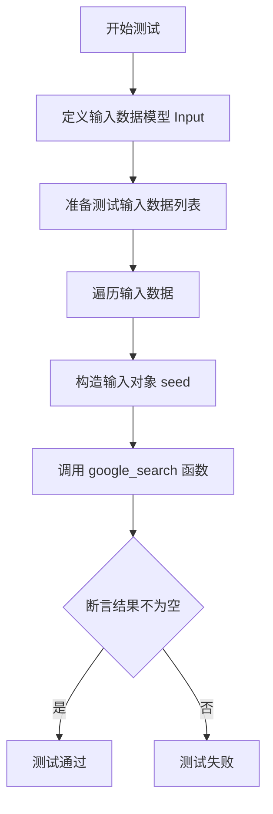
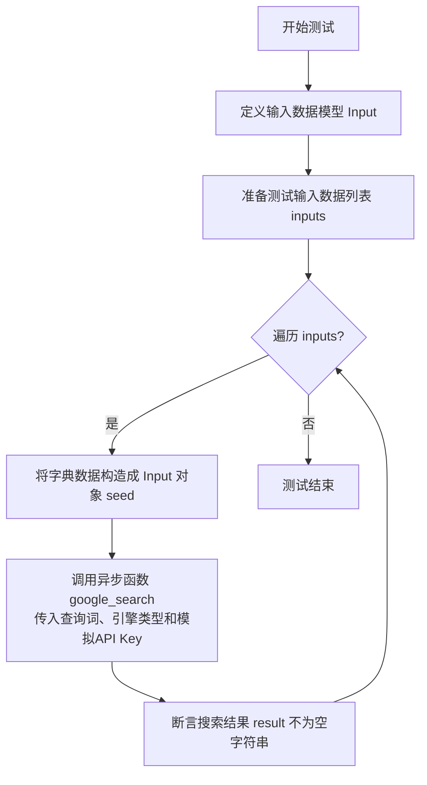

# `.\MetaGPT\tests\metagpt\learn\test_google_search.py` 详细设计文档

该代码是一个异步单元测试，用于验证 `google_search` 函数的功能。它通过模拟输入和搜索引擎配置，调用 `google_search` 函数执行搜索，并断言返回的结果非空，以确保搜索功能正常工作。

## 整体流程



## 类结构

```
BaseModel (Pydantic 基类)
└── Input (测试输入数据模型)
```

## 全局变量及字段


### `inputs`
    
一个字典列表，每个字典包含一个测试用例的输入数据，用于驱动测试函数 test_google_search。

类型：`list[dict[str, str]]`
    


### `i`
    
在遍历 inputs 列表时，代表当前迭代的测试用例输入字典。

类型：`dict[str, str]`
    


### `seed`
    
由当前测试用例字典 i 实例化的 Input 模型对象，用于结构化地传递搜索查询参数。

类型：`Input`
    


### `result`
    
调用 google_search 异步函数后返回的搜索结果字符串。

类型：`str`
    


### `Input.input`
    
Input 数据模型中的一个字段，用于接收并验证字符串类型的搜索查询关键词。

类型：`str`
    
    

## 全局函数及方法


### `test_google_search`

这是一个使用 `pytest` 框架编写的异步测试函数，用于验证 `google_search` 函数的功能。它通过模拟的搜索引擎（`search_engine_mocker`）对给定的查询词（如“ai agent”）进行搜索，并断言返回的结果不为空字符串，以确保搜索功能正常工作。

参数：

-  `search_engine_mocker`：`pytest fixture`，一个用于模拟搜索引擎响应的pytest夹具（fixture），确保测试不依赖真实的外部API调用。

返回值：`None`，这是一个测试函数，其主要目的是执行断言，不返回业务逻辑值。

#### 流程图



#### 带注释源码

```python
# 使用pytest的异步标记，表示这是一个异步测试函数
@pytest.mark.asyncio
async def test_google_search(search_engine_mocker):
    # 定义一个内部数据模型 `Input`，用于结构化测试输入数据
    class Input(BaseModel):
        input: str  # 字段名`input`，类型为字符串，代表搜索查询词

    # 定义测试用例的输入数据列表，每个元素是一个字典
    inputs = [{"input": "ai agent"}]
    
    # 遍历所有测试输入
    for i in inputs:
        # 将字典 `i` 解包并实例化为 `Input` 模型对象 `seed`
        seed = Input(**i)
        
        # 异步调用被测试的 `google_search` 函数
        # 参数1: `seed.input` - 从测试对象中提取的查询字符串（"ai agent"）
        # 参数2: `engine` - 指定搜索引擎类型为 SERPER_GOOGLE（一个模拟/代理Google的引擎）
        # 参数3: `api_key` - 传入一个模拟的API密钥，实际请求会被 `search_engine_mocker` 拦截并返回模拟数据
        result = await google_search(
            seed.input,
            engine=SearchEngineType.SERPER_GOOGLE,
            api_key="mock-serper-key",
        )
        
        # 断言：确保搜索返回的结果不是空字符串
        # 这是测试的核心验证点，确认函数在给定输入下能返回有效内容
        assert result != ""
```


## 关键组件


### 测试框架与异步测试

使用 pytest 框架及其异步插件 `pytest.mark.asyncio` 来定义和执行异步测试函数，确保异步代码的正确性。

### 数据模型与输入验证

使用 Pydantic 的 `BaseModel` 来定义强类型的输入数据结构，确保测试输入数据的结构化和有效性。

### 模拟与依赖注入

通过 `search_engine_mocker` 模拟外部搜索引擎服务，实现测试的隔离性，避免在单元测试中调用真实的外部 API。

### 参数化测试模式

通过构建输入数据列表 `inputs` 并循环执行测试逻辑，实现了简单的参数化测试，便于用多组数据验证同一功能。

### 外部工具函数调用

调用 `metagpt.learn.google_search` 模块中的 `google_search` 异步函数，并指定搜索引擎类型和 API 密钥，以测试其核心搜索功能。


## 问题及建议


### 已知问题

-   **硬编码的测试数据**：测试用例中直接硬编码了搜索关键词 `"ai agent"` 和 API 密钥 `"mock-serper-key"`。这使得测试用例不够灵活，难以扩展或复用，且将敏感信息（API密钥）暴露在代码中。
-   **缺乏边界和异常测试**：当前测试仅验证了正常搜索场景下返回结果不为空。没有测试边界情况（如空字符串、超长字符串作为输入）和异常情况（如无效的API密钥、网络错误、搜索引擎服务不可用等）。
-   **测试与外部服务强耦合**：尽管使用了 `search_engine_mocker`，但测试用例的设计意图是验证 `google_search` 函数的功能。如果模拟器（mocker）行为与真实服务不一致，可能导致测试通过但实际功能失败，即测试的置信度不足。
-   **断言过于宽松**：仅断言结果不为空字符串 (`assert result != ""`)。这无法保证返回结果的格式、结构或内容质量符合 `google_search` 函数的契约或下游使用方的期望。
-   **测试结构可读性一般**：使用循环遍历一个仅包含单个字典的列表来运行测试，增加了不必要的复杂度，降低了测试代码的直观性。

### 优化建议

-   **使用参数化测试和外部配置**：使用 `@pytest.mark.parametrize` 来参数化测试输入（如不同的搜索关键词），提高测试覆盖率和可读性。将 API 密钥等敏感或环境相关的配置移至环境变量或 pytest 配置文件中，通过 `os.getenv` 或 `pytest` 的 `monkeypatch` 在测试中注入。
-   **补充全面的测试用例**：
    -   **边界测试**：添加对空输入 `""`、非常长的输入字符串等的测试。
    -   **异常测试**：使用 `pytest.raises` 来测试当提供无效 `api_key` 或 `engine` 时，函数是否按预期抛出相应的异常（如 `ValidationError`, `HTTPError` 等）。
    -   **结构/内容验证**：根据 `google_search` 函数预期的返回值类型（例如，一个字符串列表或特定结构的对象），添加更具体的断言来验证返回值的结构、类型或关键内容。
-   **增强测试隔离与模拟**：明确 `search_engine_mocker` 模拟的范围和返回的数据结构，确保其与真实 `SERPER_GOOGLE` 引擎的响应契约一致。可以考虑为不同的测试场景（如正常返回、返回空结果、抛出异常）定义不同的模拟器行为。
-   **简化测试结构**：对于单个测试用例，可以直接调用函数并进行断言，无需使用循环和临时 `Input` 类。使测试代码更简洁、更专注于测试逻辑本身。
-   **考虑添加集成测试标记**：如果 `google_search` 函数存在需要真实网络调用的集成测试，可以使用 `@pytest.mark.integration` 等自定义标记将其与快速运行的单元测试区分开，并通过 `pytest -m "not integration"` 来默认排除它们。


## 其它


### 设计目标与约束

本代码是一个针对 `google_search` 函数的异步单元测试。其主要设计目标是验证该函数在给定特定输入（搜索关键词）和模拟的搜索引擎配置下，能够成功执行并返回非空的搜索结果。核心约束包括：1) 必须使用 `pytest` 框架进行异步测试；2) 依赖外部搜索引擎 API，但在测试环境中通过 `search_engine_mocker` 进行模拟，以避免产生真实网络调用和费用；3) 输入数据通过 Pydantic 模型进行结构化定义和验证，确保测试数据的规范性。

### 错误处理与异常设计

当前测试用例主要使用 `assert` 语句进行结果验证，断言搜索结果不为空字符串。这隐含地测试了函数在正常路径下的行为。然而，测试用例本身并未显式包含对 `google_search` 函数可能抛出的异常（如网络错误、API密钥错误、无效参数错误等）的捕获和断言。错误处理的责任被委托给了 `search_engine_mocker` 这个 pytest fixture，它需要确保在测试上下文中模拟的搜索引擎行为是稳定且不会抛出未预期的异常。这是一种依赖于外部 Fixture 的隐式错误处理设计。

### 数据流与状态机

本测试代码的数据流是线性的：
1.  **输入准备**：定义 `Input` 数据模型，并创建测试数据列表 `inputs`。
2.  **循环执行**：遍历 `inputs`，对于每个输入项：
    a. **构造与验证**：使用 Pydantic 模型 (`Input(**i)`) 实例化输入对象，此过程会进行数据验证。
    b. **函数调用**：调用被测函数 `google_search`，传入关键词、指定的搜索引擎类型 (`SERPER_GOOGLE`) 和一个模拟的 API 密钥。
    c. **结果验证**：使用 `assert` 验证函数返回的 `result` 不为空字符串。
整个流程不涉及复杂的状态变迁，是一个简单的“准备-执行-断言”测试循环。

### 外部依赖与接口契约

1.  **外部依赖**：
    *   `pytest` & `pytest-asyncio`：测试框架，用于组织、运行测试，并支持异步测试函数。
    *   `metagpt.learn.google_search.google_search`：被测函数，是本测试的核心依赖。
    *   `metagpt.tools.SearchEngineType`：枚举，用于指定搜索引擎类型。
    *   `search_engine_mocker` (pytest fixture)：关键的测试依赖，用于模拟 `google_search` 函数内部对真实搜索引擎 API 的调用。其具体实现不在本文件中，但测试的成功执行完全依赖于该 Fixture 能正确模拟 API 响应。
2.  **接口契约**：
    *   与 `google_search` 函数的契约：测试假设该函数接受 `query` (str)、`engine` (SearchEngineType)、`api_key` (str) 等参数，并返回一个字符串类型的结果。
    *   与 `search_engine_mocker` Fixture 的契约：测试假设该 Fixture 已被正确配置，当 `google_search` 函数在测试环境中执行时，对其内部网络请求的拦截和模拟响应能使其返回一个非空的字符串。

    