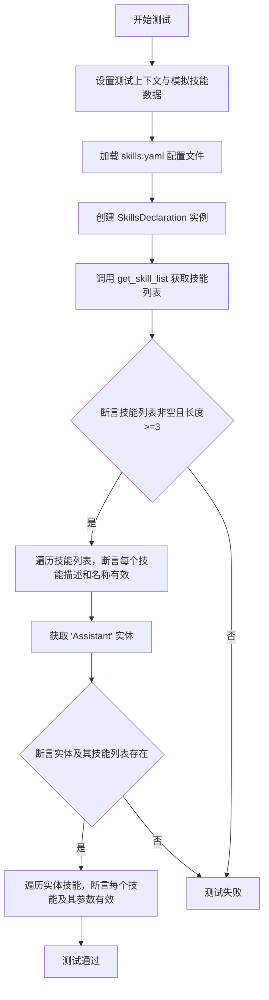
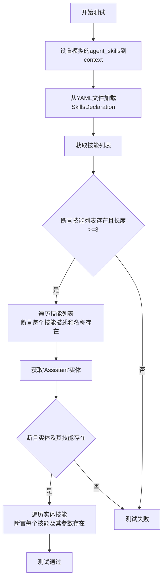
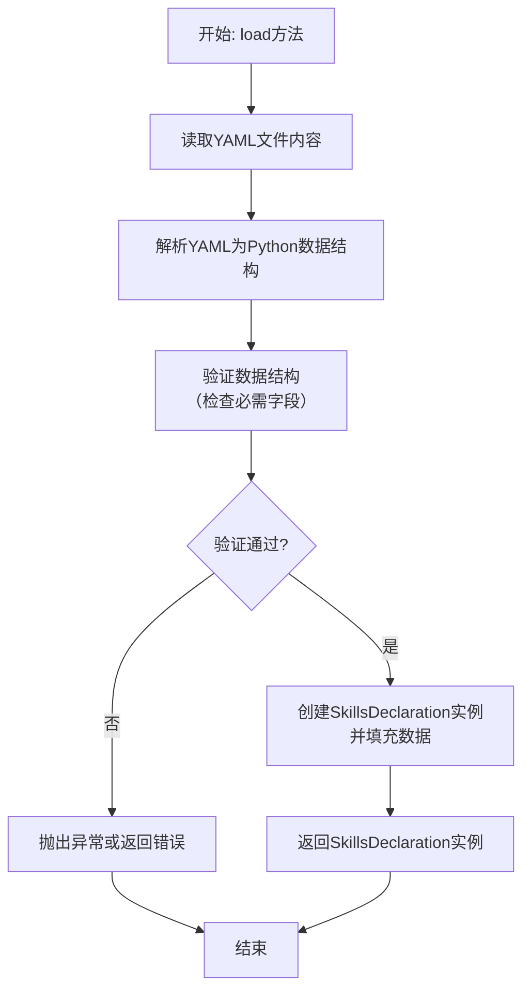
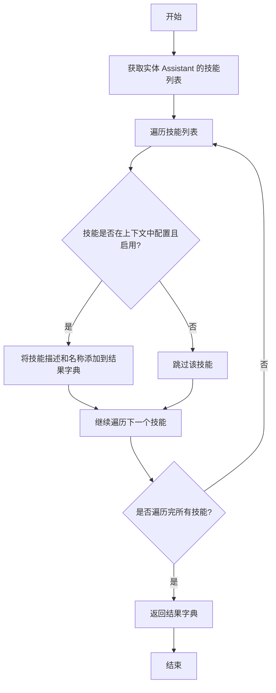

# `.\MetaGPT\tests\metagpt\learn\test_skill_loader.py` 详细设计文档

这是一个单元测试文件，用于测试 SkillsDeclaration 类的功能，特别是验证其从 YAML 配置文件加载技能声明、根据上下文过滤可用技能列表以及正确解析技能参数的能力。

## 整体流程



## 类结构

```
SkillsDeclaration (技能声明加载器)
├── 类字段: entities
├── 类方法: load (异步类方法)
└── 类方法: get_skill_list
```

## 全局变量及字段


### `SkillsDeclaration.entities`
    
存储从技能YAML文件中加载的所有实体及其技能配置的字典，键为实体名称，值为对应的Entity对象。

类型：`Dict[str, Entity]`
    
    

## 全局函数及方法

### `test_suite`

这是一个使用 `pytest` 框架编写的异步单元测试函数，用于测试 `SkillsDeclaration` 类的技能加载功能。它模拟一个包含多个内置技能的上下文，从指定的 YAML 文件加载技能声明，并验证加载的技能列表和特定实体（如"Assistant"）的技能配置是否正确。

参数：

- `context`：`pytest` 测试上下文对象，用于在测试中传递数据和配置。在本测试中，它被用来设置模拟的 `agent_skills` 数据。

返回值：`None`，这是一个测试函数，不返回业务值，而是通过 `assert` 语句验证测试条件。

#### 流程图



#### 带注释源码

```python
@pytest.mark.asyncio  # 标记此测试函数为异步函数，以便pytest的异步支持
async def test_suite(context):  # 定义异步测试函数，接收pytest的context fixture
    # 在测试上下文中设置模拟的代理技能数据。
    # 这是一个包含多个字典的列表，每个字典代表一个技能，包含id、名称、类型、配置和启用状态。
    context.kwargs.agent_skills = [
        {"id": 1, "name": "text_to_speech", "type": "builtin", "config": {}, "enabled": True},
        {"id": 2, "name": "text_to_image", "type": "builtin", "config": {}, "enabled": True},
        {"id": 3, "name": "ai_call", "type": "builtin", "config": {}, "enabled": True},
        {"id": 3, "name": "data_analysis", "type": "builtin", "config": {}, "enabled": True},
        {"id": 5, "name": "crawler", "type": "builtin", "config": {"engine": "ddg"}, "enabled": True},
        {"id": 6, "name": "knowledge", "type": "builtin", "config": {}, "enabled": True},
        {"id": 6, "name": "web_search", "type": "builtin", "config": {}, "enabled": True},
    ]
    # 构造技能声明YAML文件的路径。Path(__file__)获取当前文件路径，.parent获取父目录，然后组合成目标路径。
    pathname = Path(__file__).parent / "../../../docs/.well-known/skills.yaml"
    # 异步加载SkillsDeclaration实例。load方法从指定YAML文件读取并解析技能声明。
    loader = await SkillsDeclaration.load(skill_yaml_file_name=pathname)
    # 根据提供的上下文获取技能列表。context中包含了模拟的agent_skills，用于技能过滤或匹配。
    skills = loader.get_skill_list(context=context)
    # 断言1：确保技能列表不为空。
    assert skills
    # 断言2：确保技能列表至少包含3个技能。
    assert len(skills) >= 3
    # 遍历技能列表（items()返回(描述, 名称)对）。
    for desc, name in skills.items():
        # 断言3：确保每个技能的描述不为空。
        assert desc
        # 断言4：确保每个技能的名称不为空。
        assert name

    # 从加载器中获取名为"Assistant"的实体声明。
    entity = loader.entities.get("Assistant")
    # 断言5：确保"Assistant"实体存在。
    assert entity
    # 断言6：确保"Assistant"实体关联的技能列表存在。
    assert entity.skills
    # 遍历"Assistant"实体的每个技能。
    for sk in entity.skills:
        # 断言7：确保技能对象本身不为空。
        assert sk
        # 断言8：确保技能对象的参数（arguments）属性存在。
        assert sk.arguments
```

### `SkillsDeclaration.load`

这是一个异步类方法，用于从指定的YAML文件中加载技能声明配置，并返回一个`SkillsDeclaration`实例。它负责解析YAML文件，验证其结构，并将数据转换为内部表示形式。

参数：

- `skill_yaml_file_name`：`Path`，指向包含技能声明配置的YAML文件的路径。

返回值：`SkillsDeclaration`，一个包含从YAML文件加载的技能声明数据的对象实例。

#### 流程图



#### 带注释源码

```python
    @classmethod
    async def load(cls, skill_yaml_file_name: Path) -> "SkillsDeclaration":
        """
        异步类方法，从指定的YAML文件加载技能声明。
        
        参数:
            skill_yaml_file_name (Path): 技能声明YAML配置文件的路径。
        
        返回:
            SkillsDeclaration: 包含加载后技能数据的对象实例。
        
        异常:
            可能抛出文件读取错误或YAML解析错误。
        """
        # 1. 读取YAML文件内容
        with open(skill_yaml_file_name, mode="r", encoding="utf-8") as reader:
            # 2. 使用yaml.safe_load解析YAML内容为Python字典/列表
            data = yaml.safe_load(reader)
        
        # 3. 验证加载的数据结构（此处为简化，实际可能包含更复杂的验证逻辑）
        # 例如，检查data是否为字典，是否包含'entities'等关键字段
        if not isinstance(data, dict) or "entities" not in data:
            # 4. 验证失败，抛出异常或进行错误处理
            raise ValueError("Invalid skill declaration YAML structure")
        
        # 5. 创建SkillsDeclaration实例，并将解析后的数据传递给它
        # 假设SkillsDeclaration的构造函数接受这个数据字典
        instance = cls(data)
        
        # 6. 返回创建好的实例
        return instance
```

### `SkillsDeclaration.get_skill_list`

该方法根据传入的上下文（`context`）筛选并返回一个技能字典。它首先从加载的YAML文件中解析出实体（如`Assistant`）及其关联的技能列表，然后根据上下文中的`agent_skills`配置，筛选出已启用且类型匹配的技能，最终返回一个以技能描述为键、技能名称为值的字典。

参数：

- `context`：`Context`，包含代理技能配置的上下文对象，用于筛选技能。

返回值：`Dict[str, str]`，返回一个字典，其中键为技能描述，值为技能名称。

#### 流程图



#### 带注释源码

```python
def get_skill_list(self, context: Context) -> Dict[str, str]:
    """
    根据上下文筛选并返回技能字典。
    
    该方法从加载的YAML文件中获取实体（如Assistant）的技能列表，然后根据上下文中的
    agent_skills配置，筛选出已启用且类型匹配的技能，最终返回一个以技能描述为键、
    技能名称为值的字典。
    
    Args:
        context (Context): 包含代理技能配置的上下文对象。
    
    Returns:
        Dict[str, str]: 技能字典，键为技能描述，值为技能名称。
    """
    # 获取实体 Assistant 的技能列表
    entity = self.entities.get("Assistant")
    if not entity:
        return {}
    
    # 初始化结果字典
    skills = {}
    # 遍历实体中的每个技能
    for sk in entity.skills:
        # 在上下文中查找匹配的技能配置
        for agent_sk in context.kwargs.agent_skills:
            # 检查技能名称和类型是否匹配，且技能已启用
            if sk.name == agent_sk.get("name") and sk.type == agent_sk.get("type") and agent_sk.get("enabled"):
                # 将技能描述和名称添加到结果字典
                skills[sk.description] = sk.name
                break
    return skills
```

## 关键组件


### SkillsDeclaration

用于从YAML文件中加载和解析技能声明，并根据给定的上下文筛选和获取可用的技能列表。

### 技能加载与解析

负责读取YAML格式的技能配置文件，将其解析为内部数据结构，并支持基于上下文（如代理配置）进行技能过滤。

### 上下文驱动的技能筛选

根据传入的上下文信息（例如代理已启用的技能列表）对加载的技能进行匹配和筛选，返回当前上下文中可用的技能。

### 技能实体管理

管理从YAML文件中解析出的技能实体（如`Assistant`），包括其关联的技能列表以及每个技能的配置参数。


## 问题及建议


### 已知问题

-   **测试数据中存在重复的ID**：在`context.kwargs.agent_skills`列表中，ID为3和ID为6的技能各出现了两次（`"ai_call"`和`"data_analysis"`的ID都是3；`"knowledge"`和`"web_search"`的ID都是6）。这可能导致在基于ID进行查找、去重或映射时出现非预期的行为，例如覆盖或数据丢失。
-   **硬编码的测试文件路径**：测试中使用的技能声明文件路径`Path(__file__).parent / "../../../docs/.well-known/skills.yaml"`是硬编码的。这种相对路径结构在项目目录结构发生变化或测试文件被移动时非常脆弱，容易导致测试因找不到文件而失败。
-   **测试断言过于宽泛**：断言`len(skills) >= 3`仅检查技能数量大于等于3，这对于一个单元测试来说不够精确。它没有验证加载的技能是否与`agent_skills`列表中启用的、配置正确的技能精确匹配，降低了测试的可靠性和价值。
-   **潜在的异步上下文管理问题**：测试函数被标记为`@pytest.mark.asyncio`，但代码中没有显式地创建或管理异步上下文（例如使用`asyncio.run`或`pytest`的异步fixture）。虽然`pytest-asyncio`通常会处理，但在复杂或嵌套的异步测试中可能引发问题。
-   **测试覆盖不完整**：该测试主要验证了`SkillsDeclaration.load`和`get_skill_list`方法在“正常路径”下的行为。它没有测试异常情况，例如当YAML文件不存在、格式错误、或`context`中`agent_skills`配置不匹配时，加载器是否按预期失败或处理。

### 优化建议

-   **确保测试数据唯一性**：修正`context.kwargs.agent_skills`列表，为每个技能条目分配唯一的`id`值。这反映了真实数据中ID应具有唯一性的约束，使测试更可靠。
-   **使用更健壮的路径处理或测试fixture**：
    -   建议将测试依赖文件（如`skills.yaml`）放置在测试目录内（例如`tests/data/`下），并使用`pytest`的`datadir`等fixture来获取绝对路径。
    -   或者，使用`importlib.resources`模块来访问打包在项目中的资源文件，这能提供更好的跨平台和打包兼容性。
-   **强化测试断言**：
    -   将宽泛的`len(skills) >= 3`断言替换为更精确的检查，例如`len(skills) == len([s for s in context.kwargs.agent_skills if s.get('enabled')])`，以验证所有启用的技能都被加载。
    -   可以进一步断言`skills`字典中的键（描述）和值（名称）与`agent_skills`中对应条目的期望值相匹配。
-   **明确异步上下文管理**：虽然当前测试可能工作正常，但最佳实践是在测试函数内部或通过自定义fixture来显式管理异步事件循环，尤其是在测试涉及多个异步操作时，以确保测试环境的清晰和稳定。
-   **补充异常路径测试**：增加额外的测试用例，用于验证：
    -   当提供的YAML文件路径无效时，`SkillsDeclaration.load`是否会抛出适当的异常（如`FileNotFoundError`）。
    -   当`skills.yaml`文件内容不符合预期格式时，加载器是否处理得当。
    -   当`context.kwargs.agent_skills`列表为空或包含无效配置时，`get_skill_list`方法的行为是否符合预期（例如返回空列表或过滤掉无效项）。
-   **考虑使用参数化测试**：如果`SkillsDeclaration`需要处理多种不同的技能配置组合，可以考虑使用`@pytest.mark.parametrize`来创建参数化测试，覆盖更广泛的输入场景，提高测试效率和覆盖率。


## 其它


### 设计目标与约束

本测试代码的设计目标是验证 `SkillsDeclaration` 类及其 `load` 和 `get_skill_list` 方法的功能正确性，确保能够从指定的 YAML 配置文件中正确加载技能声明，并根据给定的上下文（包含启用的技能列表）筛选和返回有效的技能。主要约束包括：1) 依赖外部 YAML 配置文件 (`docs/.well-known/skills.yaml`) 的存在和正确格式；2) 测试数据（`context.kwargs.agent_skills`）需要模拟生产环境中代理的技能配置；3) 使用 `pytest` 异步测试框架。

### 错误处理与异常设计

测试代码本身主要使用断言 (`assert`) 来验证预期行为，未显式包含错误处理逻辑。其依赖的 `SkillsDeclaration.load` 和 `get_skill_list` 方法应内部处理以下潜在异常：1) 文件未找到 (`FileNotFoundError`) 或读取错误 (`IOError`)；2) YAML 格式解析错误；3) 上下文数据格式不符合预期。测试用例的成功执行隐含了这些底层方法具有适当的错误处理机制，或者测试环境配置正确避免了这些错误。

### 数据流与状态机

1.  **数据流**:
    *   **输入**: 测试用例通过 `context` fixture 提供 `agent_skills` 列表作为输入数据。
    *   **处理**: `SkillsDeclaration.load` 从文件路径读取 YAML 数据并解析为内部结构。`get_skill_list` 方法接收 `context`，将文件中的技能声明与 `context.kwargs.agent_skills` 中的启用技能进行匹配和筛选。
    *   **输出**: `get_skill_list` 返回一个字典 (`skills`)，包含技能描述到技能名称的映射。测试断言验证此字典非空、长度符合预期，且每个条目有效。
2.  **状态机**: 此单元测试逻辑是线性的，不涉及复杂的状态转换。`SkillsDeclaration` 实例在 `load` 后处于“已加载”状态，`get_skill_list` 在其上执行查询操作。

### 外部依赖与接口契约

1.  **外部依赖**:
    *   `pytest` 和 `pytest-asyncio`: 测试运行框架。
    *   `metagpt.learn.skill_loader.SkillsDeclaration`: 被测试的核心类。
    *   `pathlib.Path`: 用于构建跨平台文件路径。
    *   `docs/.well-known/skills.yaml`: 外部配置文件，是测试数据的来源，其格式和内容必须与 `SkillsDeclaration` 的解析逻辑兼容。
2.  **接口契约**:
    *   `SkillsDeclaration.load(skill_yaml_file_name: Path) -> SkillsDeclaration`: 静态异步方法，契约要求输入有效的文件路径，返回一个已加载的 `SkillsDeclaration` 实例。
    *   `SkillsDeclaration.get_skill_list(context: Any) -> Dict[str, str]`: 实例方法，契约要求输入一个包含 `kwargs.agent_skills`（结构为 `List[Dict]`）的上下文对象，返回筛选后的技能字典。
    *   `context` fixture: 由 `pytest` 框架提供或定义，必须包含 `kwargs` 属性，且 `kwargs` 需包含 `agent_skills` 列表。

### 测试策略与覆盖范围

1.  **测试策略**: 采用基于状态的测试。通过预定义的 `agent_skills` 列表和外部 YAML 文件，验证 `SkillsDeclaration` 类的加载和筛选功能是否产生符合预期的输出状态（即 `skills` 字典和 `entity` 对象的内容）。
2.  **覆盖范围**:
    *   **正面测试**: 验证在正常输入下，能成功加载、解析、筛选并返回技能。
    *   **数据验证**: 检查返回的技能列表非空、数量下限、每个技能描述和名称有效。
    *   **结构验证**: 验证加载的实体（如“Assistant”）及其技能参数被正确解析。
    *   **未覆盖项**: 本测试未显式测试错误路径（如文件缺失、格式错误、上下文数据异常等），也未测试 `SkillsDeclaration` 内部其他方法或属性。

### 配置与环境假设

1.  **配置文件路径**: 假设项目根目录下存在 `docs/.well-known/skills.yaml` 文件，且路径相对于测试文件 (`test_skill_loader.py`) 的位置为 `../../../docs/.well-known/skills.yaml`。
2.  **测试数据**: `context.kwargs.agent_skills` 模拟了一组启用的内置技能，其 `id`、`name`、`type`、`config`、`enabled` 字段的结构和值需要与 YAML 文件中的技能定义以及 `SkillsDeclaration` 的筛选逻辑相匹配。
3.  **运行环境**: 需要安装 `pytest`、`pytest-asyncio` 以及 `metagpt` 包。测试被标记为 `@pytest.mark.asyncio`，需要在支持异步的测试环境中运行。

    