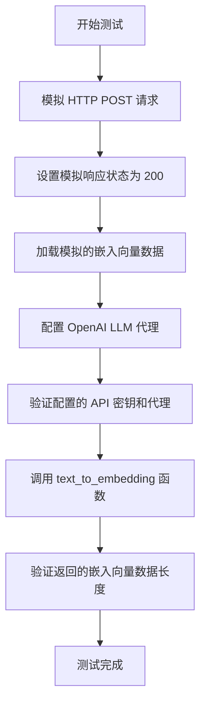
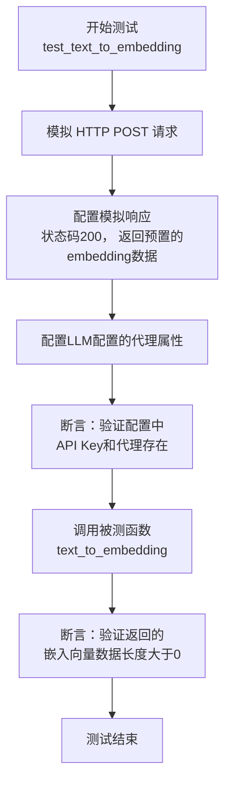

# `.\MetaGPT\tests\metagpt\learn\test_text_to_embedding.py` 详细设计文档

该文件是一个单元测试文件，用于测试 `text_to_embedding` 函数的功能。它通过模拟 HTTP 请求来测试文本转换为嵌入向量的过程，确保函数在给定配置和文本输入时能正确调用外部 API 并返回预期的嵌入向量数据。

## 整体流程



## 类结构

```
test_text_to_embedding.py (测试文件)
├── test_text_to_embedding (测试函数)
│   ├── mocker (模拟对象)
│   ├── mock_post (模拟 POST 请求)
│   ├── mock_response (模拟响应)
│   ├── data (模拟数据)
│   └── config (配置对象)
```

## 全局变量及字段


### `config`
    
全局配置对象，用于获取和管理应用程序的配置信息，特别是OpenAI LLM的配置。

类型：`metagpt.config2.config`
    


### `mocker`
    
Pytest的mock fixture，用于在单元测试中模拟和替换对象、函数或方法。

类型：`pytest_mock.plugin.MockerFixture`
    


### `mock_post`
    
模拟的aiohttp.ClientSession.post方法，用于拦截和模拟HTTP POST请求。

类型：`unittest.mock.MagicMock`
    


### `mock_response`
    
模拟的异步HTTP响应对象，用于返回预定义的响应数据和状态码。

类型：`unittest.mock.AsyncMock`
    


### `data`
    
从本地JSON文件读取的原始字符串数据，包含模拟的OpenAI embedding API响应。

类型：`str`
    


### `v`
    
调用text_to_embedding函数后返回的embedding响应对象，包含文本的向量表示。

类型：`metagpt.learn.text_to_embedding.EmbeddingResponse`
    


    

## 全局函数及方法

### `test_text_to_embedding`

这是一个使用 `pytest` 框架编写的异步单元测试函数，用于测试 `text_to_embedding` 函数。它通过模拟（Mock）HTTP请求来验证 `text_to_embedding` 函数在给定文本输入时，能否成功调用外部API并返回有效的嵌入向量数据，而无需实际进行网络调用。

参数：
- `mocker`：`pytest_mock.plugin.MockerFixture`，pytest-mock插件提供的模拟对象，用于创建和管理测试中的模拟（Mock）和桩（Stub）。

返回值：`None`，这是一个测试函数，其主要目的是通过断言（assert）来验证功能，不返回业务值。

#### 流程图



#### 带注释源码

```python
@pytest.mark.asyncio  # 标记此测试函数为异步函数，以便pytest-asyncio插件能够正确处理。
async def test_text_to_embedding(mocker):  # 定义异步测试函数，接收mocker fixture用于模拟。
    # mock
    # 模拟aiohttp.ClientSession的post方法，防止测试中发出真实的网络请求。
    mock_post = mocker.patch("aiohttp.ClientSession.post")
    # 创建一个异步模拟对象作为HTTP响应。
    mock_response = mocker.AsyncMock()
    # 设置模拟响应的状态码为200（成功）。
    mock_response.status = 200
    # 异步读取预先生成的测试数据文件（包含模拟的API返回结果）。
    data = await aread(Path(__file__).parent / "../../data/openai/embedding.json")
    # 设置模拟响应的json方法返回解析后的测试数据。
    mock_response.json.return_value = json.loads(data)
    # 设置post方法返回的异步上下文管理器（__aenter__）返回我们配置好的模拟响应。
    mock_post.return_value.__aenter__.return_value = mock_response
    # 模拟配置对象中LLM的代理属性，返回一个模拟的代理URL。
    config.get_openai_llm().proxy = mocker.PropertyMock(return_value="http://mock.proxy")

    # Prerequisites
    # 断言：在调用被测函数前，确保配置中的API Key存在（非空）。
    assert config.get_openai_llm().api_key
    # 断言：确保配置中的代理设置存在（非空）。
    assert config.get_openai_llm().proxy

    # 调用被测试的异步函数 `text_to_embedding`，传入测试文本和配置对象。
    v = await text_to_embedding(text="Panda emoji", config=config)
    # 断言：验证函数返回的嵌入向量数据列表的长度大于0，确保收到了有效数据。
    assert len(v.data) > 0
```

## 关键组件


### 文本向量化功能

将输入文本转换为向量表示（嵌入），用于后续的机器学习或相似性计算任务。

### 异步HTTP请求处理

通过异步HTTP客户端发送请求并处理响应，支持代理配置和JSON数据解析。

### 配置管理

管理应用程序的配置信息，包括API密钥和代理设置，确保功能模块能够正确访问外部服务。

### 单元测试框架

使用pytest框架进行异步单元测试，支持模拟外部依赖以隔离测试环境。

### 文件读取工具

提供异步文件读取功能，支持从本地文件系统加载测试数据。


## 问题及建议


### 已知问题

-   **测试数据路径硬编码**：测试用例中通过相对路径 `"../../data/openai/embedding.json"` 加载测试数据。这种硬编码方式使得测试文件的可移植性变差，当项目目录结构发生变化或测试文件被移动到其他位置时，路径可能失效，导致测试失败。
-   **Mock对象配置过于具体**：测试用例中Mock了 `aiohttp.ClientSession.post` 的完整调用链（包括 `__aenter__` 的返回值）。这种Mock方式与 `text_to_embedding` 函数内部的具体实现（使用 `aiohttp.ClientSession`）紧密耦合。如果未来 `text_to_embedding` 函数更换了HTTP客户端库（例如改用 `httpx`），此测试用例将需要同步进行大量修改，维护成本高。
-   **配置对象Mock不完整**：测试中仅Mock了 `config.get_openai_llm().proxy` 属性，但 `text_to_embedding` 函数很可能还需要其他配置项（如 `api_key`, `base_url`, `model` 等）。虽然测试中通过 `assert` 语句检查了 `api_key` 的存在，但并未对其进行Mock。如果 `config` 对象的状态在测试环境中未正确初始化，可能会影响测试的稳定性和可重复性。
-   **缺乏负面测试用例**：当前测试只验证了函数在正常情况下的行为（HTTP 200响应）。没有测试异常场景，例如：网络请求失败（HTTP 非200状态码、超时）、API返回错误格式的JSON、配置无效等情况。这降低了测试的健壮性。

### 优化建议

-   **使用更稳健的测试数据加载方式**：建议使用 `pytest` 的 `datafiles` 插件或定义一个辅助函数，通过测试文件所在目录（`Path(__file__).parent`）来定位数据文件，避免使用易碎的相对路径 `"../.."`。例如，可以将测试数据放在测试文件同目录或项目约定的测试资源目录中。
-   **在更高层次进行Mock**：与其Mock底层的 `aiohttp.ClientSession`，不如Mock `text_to_embedding` 函数内部实际发起网络调用的那个函数（如果存在），或者使用 `pytest-mock` 的 `mocker.patch.object` 来替换 `config.get_openai_llm()` 返回的对象的某个方法，使其直接返回预设的嵌入向量结果。这样可以将测试与HTTP客户端库的实现解耦。
-   **完善配置Mock和测试夹具**：创建一个 `pytest.fixture` 来设置测试所需的完整配置环境，确保 `config` 对象在测试中具有所有必要的、确定性的属性。这可以提高测试的独立性和可重复性。
-   **补充异常和边界测试**：增加多个测试用例，使用 `@pytest.mark.parametrize` 来测试不同的异常输入和模拟后端服务返回错误的情况。例如，模拟HTTP 429（速率限制）、500（服务器错误）等，并验证函数是否按预期抛出异常或进行错误处理。
-   **考虑测试的异步上下文管理**：确保Mock的异步响应对象（`mock_response`）正确地模拟了异步上下文管理器的行为。虽然当前代码使用了 `__aenter__`，但最好确认 `text_to_embedding` 的实现是否严格依赖于此，并确保Mock的完整性。


## 其它


### 设计目标与约束

本测试代码的设计目标是验证 `text_to_embedding` 函数的功能正确性，确保其能够成功调用外部API并返回预期的嵌入向量数据。主要约束包括：1) 测试环境需要模拟外部HTTP请求，以避免对真实API的依赖和产生费用；2) 测试需要异步执行，以匹配被测试函数的异步特性；3) 测试依赖于项目配置 (`config`) 来获取API密钥和代理设置。

### 错误处理与异常设计

测试代码通过模拟 (`mocker`) 控制外部依赖的行为。它模拟了一个成功的HTTP响应（状态码200并返回预定义的JSON数据）。测试用例本身主要验证功能在正常路径下的行为，并未显式测试错误处理逻辑（如网络错误、API认证失败、非200响应码等）。这些错误处理应由被测试的 `text_to_embedding` 函数或其底层调用者负责，本单元测试的重点是功能正确性。

### 数据流与状态机

1.  **初始化**：测试函数开始，设置模拟对象 (`mock_post`, `mock_response`)。
2.  **数据准备**：从本地文件 `embedding.json` 读取模拟的API响应数据。
3.  **配置模拟**：将模拟响应数据配置到 `mock_response.json.return_value`，并设置 `config` 中的代理为模拟值。
4.  **执行测试**：调用被测试函数 `text_to_embedding`，传入测试文本 "Panda emoji" 和模拟的 `config`。
5.  **验证结果**：断言返回的嵌入向量数据 (`v.data`) 长度大于0，以确认函数调用成功并返回了有效数据。
6.  **清理**：测试框架自动管理模拟对象的生命周期，无显式清理步骤。

### 外部依赖与接口契约

1.  **外部依赖**：
    *   `aiohttp.ClientSession.post`: 用于发起异步HTTP POST请求。在测试中被完全模拟。
    *   `config.get_openai_llm()`: 用于获取包含API密钥 (`api_key`) 和代理 (`proxy`) 的配置对象。测试中验证了这些配置项的存在，并模拟了 `proxy` 属性。
    *   本地数据文件 (`../../data/openai/embedding.json`): 提供模拟的API响应数据，定义了测试的预期返回结构。
2.  **接口契约**：
    *   `text_to_embedding(text: str, config) -> object`: 被测试的主要接口。测试验证了给定文本和配置时，该函数能返回一个包含 `data` 字段（且非空）的对象。
    *   模拟的HTTP接口：期望返回状态码200和一个符合OpenAI Embedding API响应格式的JSON对象（具体结构由 `embedding.json` 文件定义）。

### 测试策略与覆盖范围

本测试采用**单元测试**策略，通过模拟所有外部依赖（网络请求、配置）来隔离测试 `text_to_embedding` 函数的核心逻辑。覆盖范围主要是函数的**正常执行路径**（Happy Path）。它没有覆盖的参数组合、边界条件、异常路径（如无效输入、网络超时、认证错误等）需要额外的测试用例来完成。

### 环境与配置依赖

1.  **运行环境**：需要Python环境，并安装 `pytest`, `pytest-asyncio`, `aiohttp` 等测试和依赖包。
2.  **配置文件/数据**：依赖项目根配置 (`config`) 来获取基础设置（尽管在测试中被部分模拟）。依赖一个特定的数据文件 (`../../data/openai/embedding.json`) 来提供测试断言所需的预期数据。
3.  **执行方式**：测试被标记为 `@pytest.mark.asyncio`，需要支持异步测试的测试运行器来执行。

    