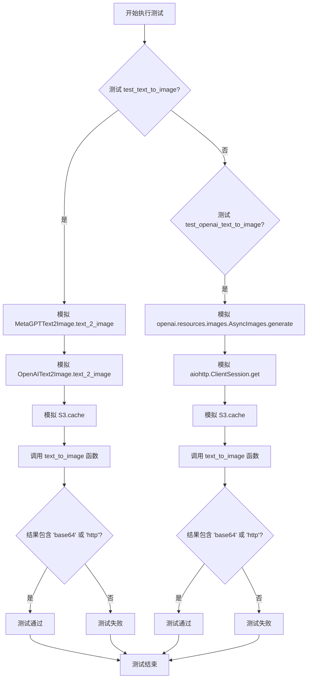
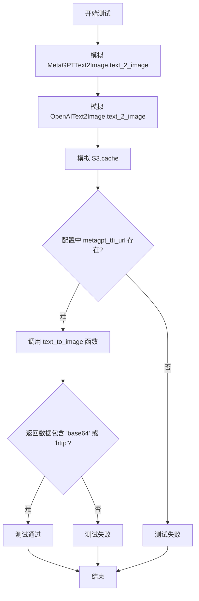
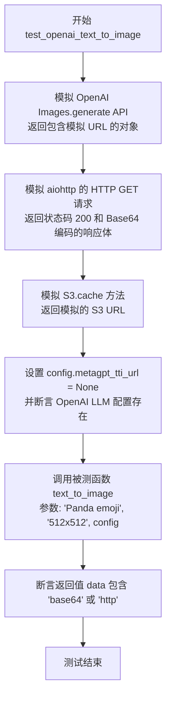

# `.\MetaGPT\tests\metagpt\learn\test_text_to_image.py` 详细设计文档

该文件是一个单元测试文件，用于测试文本转图像功能。它包含两个异步测试函数，分别测试基于MetaGPT内部服务和OpenAI服务的文本转图像功能。测试通过模拟（mocking）外部依赖（如API调用和S3存储）来验证核心函数`text_to_image`在不同配置下能正确返回包含图像数据（Base64编码或URL）的结果。

## 整体流程



## 类结构

```
BaseModel (来自 pydantic)
├── _MockData (测试中定义的内部类)
测试函数 (pytest)
├── test_text_to_image
└── test_openai_text_to_image
```

## 全局变量及字段


### `config`
    
全局配置对象，包含应用程序的各种配置参数，如API密钥、服务URL等。

类型：`metagpt.config2.Config`
    


### `_MockData.data`
    
用于模拟OpenAI图像生成API响应数据的字段，包含生成的图像URL列表。

类型：`list`
    
    

## 全局函数及方法

### `test_text_to_image`

这是一个异步单元测试函数，用于测试 `text_to_image` 函数的功能。它通过模拟（mocking）外部依赖（如 `MetaGPTText2Image`、`OpenAIText2Image` 和 `S3`）来验证 `text_to_image` 函数在给定配置下能否正确返回包含图像数据（Base64 编码或 URL）的字符串。

参数：

- `mocker`：`pytest_mock.plugin.MockerFixture`，pytest-mock 插件提供的模拟对象，用于创建和管理测试中的模拟（mock）和桩（stub）。

返回值：`None`，这是一个测试函数，不返回业务值，通过断言（assert）来验证测试结果。

#### 流程图



#### 带注释源码

```python
@pytest.mark.asyncio  # 标记此函数为异步测试
async def test_text_to_image(mocker):
    # mock
    # 模拟 MetaGPTText2Image 类的 text_2_image 方法，使其返回固定的字节数据
    mocker.patch.object(MetaGPTText2Image, "text_2_image", return_value=b"mock MetaGPTText2Image")
    # 模拟 OpenAIText2Image 类的 text_2_image 方法，使其返回固定的字节数据
    mocker.patch.object(OpenAIText2Image, "text_2_image", return_value=b"mock OpenAIText2Image")
    # 模拟 S3 类的 cache 方法，使其返回一个模拟的 URL 字符串
    mocker.patch.object(S3, "cache", return_value="http://mock/s3")

    # 断言：确保配置对象中的 metagpt_tti_url 属性存在（为真）
    assert config.metagpt_tti_url

    # 调用被测试的 text_to_image 函数，传入文本描述、尺寸和配置
    data = await text_to_image("Panda emoji", size_type="512x512", config=config)
    # 断言：函数返回的数据（字符串）应包含 'base64' 或 'http' 子串，
    # 这表明返回的是有效的图像数据（Base64格式）或一个URL链接。
    assert "base64" in data or "http" in data
```

### `test_openai_text_to_image`

这是一个使用 `pytest` 和 `mocker` 编写的异步单元测试函数，用于测试 `text_to_image` 函数在使用 OpenAI 作为后端时的功能。它通过模拟（mock）外部依赖（如 OpenAI API 调用、HTTP 请求和 S3 存储）来验证 `text_to_image` 函数在特定配置下能正确返回包含图像数据（Base64 编码或 URL）的字符串。

参数：

-   `mocker`：`pytest_mock.plugin.MockerFixture`，pytest-mock 插件提供的模拟对象，用于创建和管理测试中的模拟（mock）和打桩（stub）。

返回值：`None`，这是一个测试函数，不返回业务值，其成功与否由内部的 `assert` 语句决定。

#### 流程图



#### 带注释源码

```python
@pytest.mark.asyncio  # 标记此函数为异步测试，以便 pytest-asyncio 插件能够正确处理。
async def test_openai_text_to_image(mocker):  # 定义异步测试函数，接收 mocker 夹具用于模拟。
    # mocker  # 注释：开始模拟设置部分
    mock_url = mocker.Mock()  # 创建一个通用的 Mock 对象，用于模拟 OpenAI 返回的 URL 对象。
    mock_url.url.return_value = "http://mock.com/0.png"  # 设置 mock_url 对象的 `url` 方法被调用时返回一个固定的字符串。

    class _MockData(BaseModel):  # 定义一个内部 Pydantic 模型类，用于模拟 OpenAI API 返回的数据结构。
        data: list  # 模拟的响应体应包含一个 `data` 字段，其值为列表。

    mock_data = _MockData(data=[mock_url])  # 实例化 _MockData，其 `data` 字段是一个包含上面创建的 mock_url 的列表。
    # 模拟 `openai.resources.images.AsyncImages.generate` 方法，使其在被调用时直接返回我们构造的 mock_data 对象。
    mocker.patch.object(openai.resources.images.AsyncImages, "generate", return_value=mock_data)
    
    # 模拟 `aiohttp.ClientSession.get` 方法。这是为了模拟 text_to_image 内部可能通过 HTTP 获取图片的行为。
    mock_post = mocker.patch("aiohttp.ClientSession.get")
    mock_response = mocker.AsyncMock()  # 创建一个异步的 Mock 对象，用于模拟 HTTP 响应。
    mock_response.status = 200  # 设置模拟响应的状态码为 200（成功）。
    mock_response.read.return_value = base64.b64encode(b"success")  # 设置模拟响应的 `read` 方法返回经过 Base64 编码的字节串。
    # 设置 `mock_post` 返回的上下文管理器（`__aenter__`）返回我们创建的 `mock_response`。
    mock_post.return_value.__aenter__.return_value = mock_response
    
    # 模拟 `S3.cache` 类方法，使其返回一个模拟的 S3 URL。
    mocker.patch.object(S3, "cache", return_value="http://mock.s3.com/0.png")

    # 将配置对象中的 `metagpt_tti_url` 设置为 None，强制 `text_to_image` 函数使用 OpenAI 路径。
    config.metagpt_tti_url = None
    # 断言配置中确实存在 OpenAI LLM 的配置，确保测试条件成立。
    assert config.get_openai_llm()

    # 调用被测试的 `text_to_image` 异步函数，传入测试提示词、尺寸和配置。
    data = await text_to_image("Panda emoji", size_type="512x512", config=config)
    # 断言函数的返回值（`data`）是一个字符串，并且其中包含 "base64" 或 "http" 子串。
    # 这验证了函数在 OpenAI 路径下成功执行并返回了有效格式的图像数据。
    assert "base64" in data or "http" in data
```

## 关键组件


### 文本转图像核心功能模块

提供统一的异步接口，将文本描述转换为图像数据，支持多种后端实现（如OpenAI DALL-E和MetaGPT内部服务）并可选地将结果缓存至S3对象存储。

### 配置管理 (`config`)

管理应用程序的运行时配置，例如决定使用哪个文本转图像后端服务（通过`metagpt_tti_url`字段）以及提供OpenAI API的访问凭证。

### 文本转图像工具类 (`OpenAIText2Image`, `MetaGPTText2Image`)

封装了与特定文本转图像服务（如OpenAI API或内部MetaGPT服务）交互的具体实现细节，提供`text_2_image`方法作为统一的图像生成入口。

### 对象存储工具 (`S3`)

提供与S3兼容的对象存储服务交互的能力，主要用于缓存生成的图像数据，并返回可公开访问的URL，以优化性能和减少对上游服务的重复调用。

### 模拟测试框架 (`pytest`, `mocker`)

用于构建单元测试，通过模拟（Mock）外部依赖（如网络请求、API调用和S3操作）来隔离测试目标代码的逻辑，确保测试的可靠性和执行速度。


## 问题及建议


### 已知问题

-   **测试用例对实现细节依赖过强**：测试用例`test_text_to_image`和`test_openai_text_to_image`通过`mocker.patch.object`直接模拟了底层类（如`MetaGPTText2Image.text_2_image`、`OpenAIText2Image.text_2_image`、`S3.cache`）的具体方法。这种“白盒测试”方式使得测试与具体实现紧密耦合。一旦这些被模拟的方法的接口（如方法名、参数、返回值类型）发生改变，即使`text_to_image`函数的核心逻辑和对外契约不变，测试用例也需要同步修改，降低了测试的稳定性和维护性。
-   **测试用例存在潜在的配置污染风险**：在`test_openai_text_to_image`测试中，代码直接修改了全局配置对象`config.metagpt_tti_url = None`。如果测试框架（如pytest）默认以某种顺序（非隔离）运行测试，或者未来测试用例并行执行，这个修改可能会意外地影响到其他依赖`config.metagpt_tti_url`的测试用例，导致测试结果不可预测或失败。
-   **Mock对象构造复杂且脆弱**：`test_openai_text_to_image`测试中为了模拟OpenAI API的响应，构造了一个复杂的Mock链（包括`_MockData`模型、`mock_url`对象、对`aiohttp.ClientSession.get`的模拟等）。这种构造不仅代码冗长，而且高度依赖于`openai`库和`aiohttp`库当前版本的具体内部结构（如`openai.resources.images.AsyncImages.generate`的返回值格式）。当这些第三方库升级导致内部接口变化时，此测试用例会立即失败，即使被测函数`text_to_image`本身可能仍然通过其他方式（如适配器）正常工作。
-   **测试断言过于宽松**：两个测试用例的最终断言`assert "base64" in data or "http" in data`仅检查返回的字符串中是否包含特定子串。这是一个非常弱（weak）的断言，它无法有效验证返回数据的格式是否正确（例如，base64字符串是否有效，URL格式是否合规），也无法验证业务逻辑（例如，是否真的调用了预期的服务，返回的数据是否与请求相关）。这降低了测试发现缺陷的能力。

### 优化建议

-   **采用面向接口/契约的测试模拟**：建议重构测试用例，避免直接模拟具体的类方法。改为在更高的层次上进行模拟，例如使用pytest的`monkeypatch`临时替换`text_to_image`函数内部决定使用哪个`Text2Image`后端的逻辑点，或者为`Text2Image`类定义一个测试用的桩（Stub）实现，并注入到被测函数中。这样可以将测试焦点放在`text_to_image`函数的输入输出行为上，而不是其内部的具体协作对象上。
-   **确保测试的独立性与隔离性**：对于需要修改配置的测试，应当使用`pytest`的`fixture`机制，在测试开始时备份配置，在测试结束后恢复配置，或者为每个测试用例创建一个独立的配置对象副本。绝对避免直接修改可能被共享的全局配置状态。例如，可以创建一个`config_fixture`，它基于原配置生成一个深拷贝（deep copy）用于测试。
-   **简化Mock，提升可读性与健壮性**：重新审视`test_openai_text_to_image`中对OpenAI和aiohttp的Mock。考虑是否可以通过依赖注入，使`text_to_image`函数或`OpenAIText2Image`类接收一个可模拟的HTTP客户端接口，从而在测试中直接模拟这个接口，而不是深入模拟第三方库的内部细节。这样能大幅减少Mock代码量，并使测试更专注于业务逻辑而非外部库的实现。
-   **强化测试断言**：将模糊的字符串包含断言替换为更精确、更有意义的断言。例如：
    -   当预期返回base64时，可以尝试用`base64.b64decode`解码，验证其是否成功并返回二进制数据。
    -   当预期返回URL时，可以使用`urllib.parse.urlparse`验证其是否是一个结构良好的URL。
    -   可以添加断言来验证在特定配置下（如`metagpt_tti_url`有值或无值），是否调用了正确的后端服务（通过检查Mock对象的调用次数和参数）。这需要配合第一点建议，将Mock提升到更合适的层次。
-   **补充异常路径测试**：当前测试只覆盖了“成功路径”。建议增加测试用例，覆盖各种异常情况，例如：网络请求失败（模拟HTTP错误状态码或超时）、S3缓存失败、无效的`size_type`参数、空文本输入等，并验证`text_to_image`函数是否有合理的错误处理或异常抛出行为。


## 其它


### 设计目标与约束

本测试代码的设计目标是验证 `text_to_image` 功能模块的正确性，确保其能够根据不同的配置（使用 MetaGPT 内部服务或 OpenAI 服务）成功生成图像并返回预期的数据格式（Base64 编码字符串或 URL）。主要约束包括：1) 测试必须模拟外部依赖（如 MetaGPTText2Image、OpenAIText2Image、OpenAI API、S3 服务）以避免产生实际网络调用和费用；2) 测试需要覆盖两种主要的图像生成路径；3) 测试断言需验证返回数据包含特定标识符（"base64" 或 "http"）。

### 错误处理与异常设计

测试代码本身主要关注正常流程的验证，并未显式测试错误处理。其依赖的 `text_to_image` 函数及被模拟的组件（如 `OpenAIText2Image.text_2_image`, `S3.cache`）在生产环境中应包含错误处理逻辑，例如：处理网络请求超时、API 返回错误状态码、无效的输入参数等。本测试通过模拟（mocking）确保了被测试函数在依赖返回有效模拟数据时的行为正确，但未覆盖依赖抛出异常时 `text_to_image` 函数的容错行为。

### 数据流与状态机

测试执行的数据流清晰：1) 测试函数启动，设置模拟（Mock）行为，定义依赖组件的返回值。2) 调用被测函数 `text_to_image`，传入提示词、尺寸和配置。3) 根据 `config.metagpt_tti_url` 的配置，控制流会进入不同的分支：若 URL 存在，则使用 `MetaGPTText2Image` 服务；若不存在且配置了 OpenAI LLM，则使用 `OpenAIText2Image` 服务（内部调用 OpenAI Images API）。4) 图像生成服务返回图像二进制数据或 URL，随后可能经过 S3 缓存处理。5) 最终结果返回给测试函数进行断言验证。整个流程是一个简单的线性流程，不涉及复杂的状态转换。

### 外部依赖与接口契约

测试代码模拟了以下关键外部依赖，明确了其接口契约：
1.  **`MetaGPTText2Image.text_2_image` 方法**：契约是接受参数并返回图像二进制数据 (`bytes`)。
2.  **`OpenAIText2Image.text_2_image` 方法**：契约是接受参数并返回图像二进制数据 (`bytes`)。
3.  **OpenAI Images API (`openai.resources.images.AsyncImages.generate`)**：契约是返回一个包含 `data` 列表的响应对象，列表中的对象具有 `.url` 属性可获取图像 URL。
4.  **HTTP 客户端（用于获取 OpenAI 返回的图片 URL）**：契约是通过 GET 请求访问 URL 并返回状态码为 200 且内容可读的响应。
5.  **`S3.cache` 方法**：契约是接受数据（可能是 `bytes` 或 URL），将其存储至 S3 并返回一个可访问的 URL 字符串。
测试通过 `mocker.patch.object` 和 `mocker.patch` 确保这些依赖在测试环境中返回预定义的、符合契约的模拟数据，从而隔离测试。

    