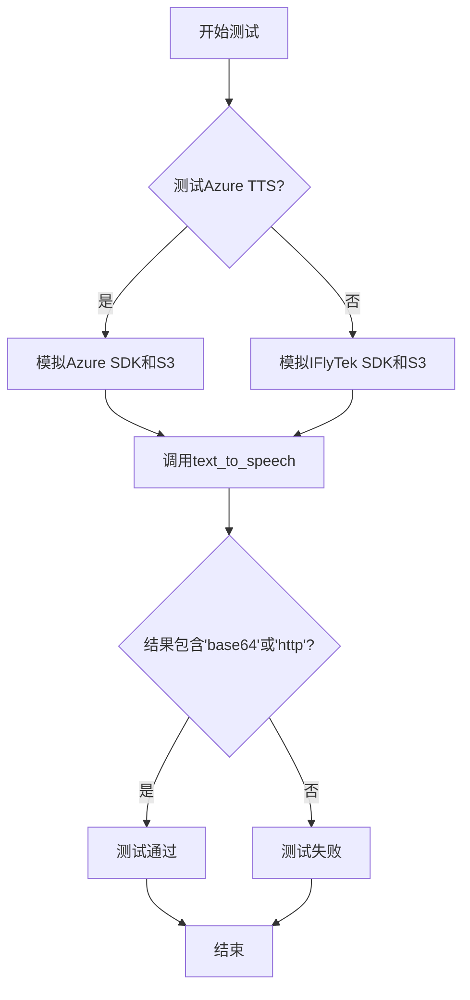
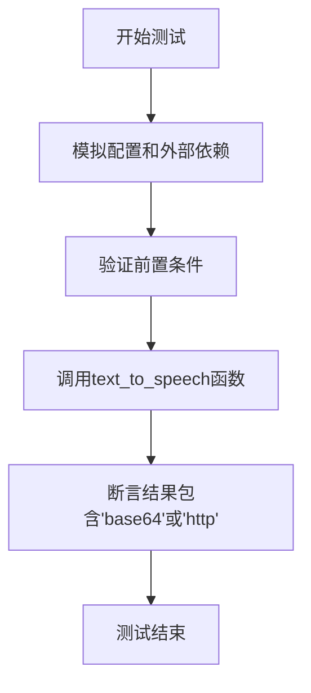
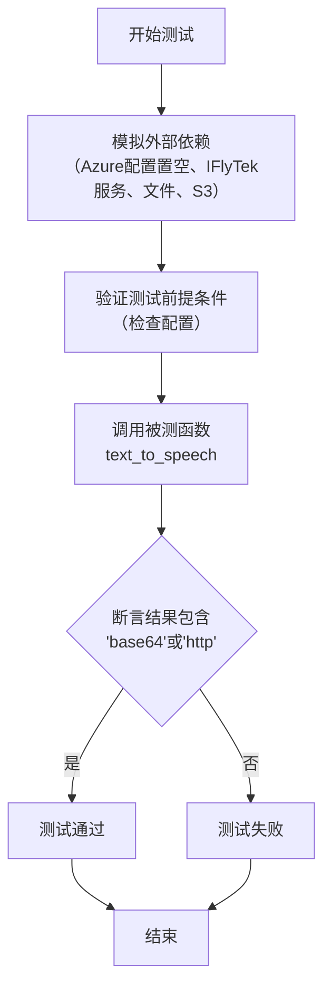
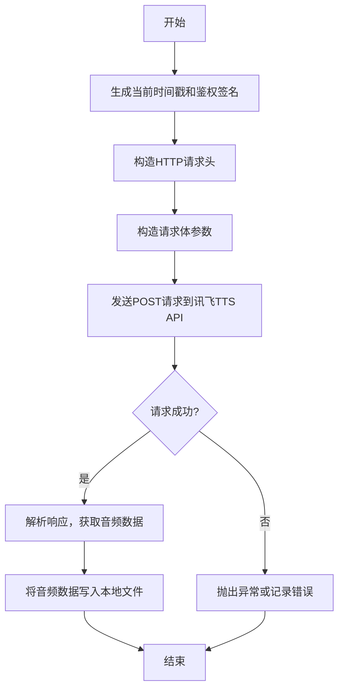
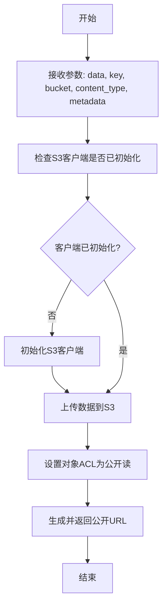
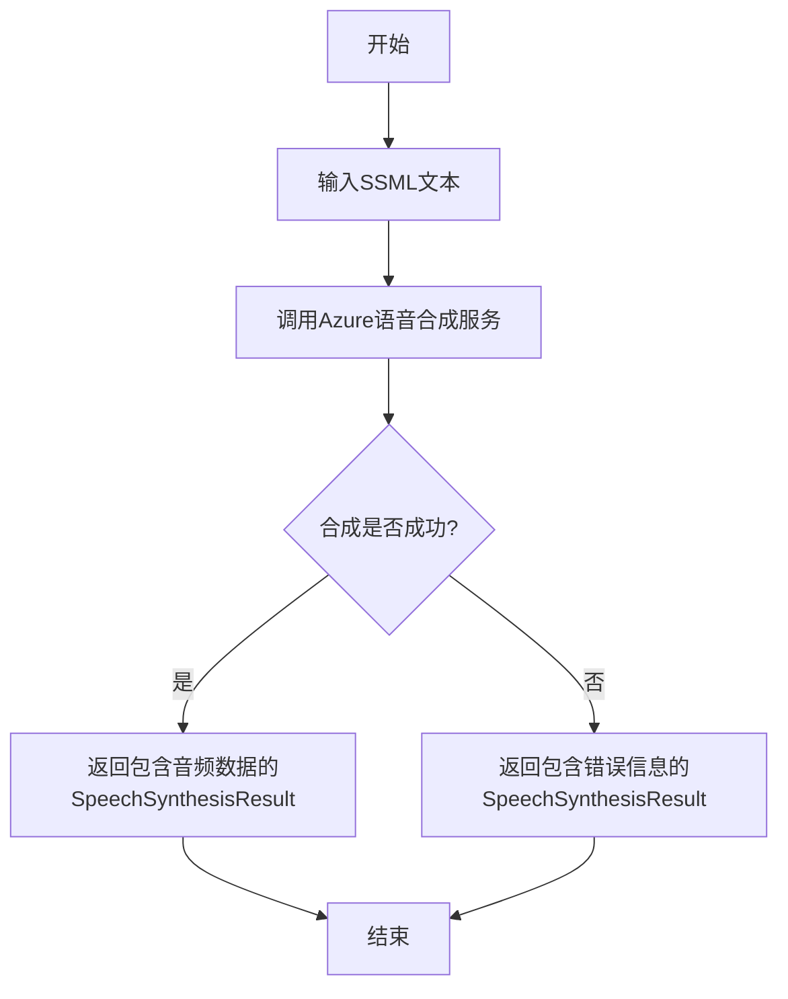

# `.\MetaGPT\tests\metagpt\learn\test_text_to_speech.py` 详细设计文档

该文件是一个单元测试文件，用于测试文本转语音功能。它包含两个异步测试函数，分别测试基于Azure和科大讯飞（IFlyTek）的文本转语音服务。测试通过模拟（mocking）外部依赖（如API调用和文件操作）来验证`text_to_speech`函数在不同配置下能正确工作，并返回包含音频数据（base64编码或URL）的结果。

## 整体流程



## 类结构

```
test_text_to_speech.py (测试模块)
├── test_azure_text_to_speech (测试函数)
└── test_iflytek_text_to_speech (测试函数)
```

## 全局变量及字段


### `config`
    
全局配置对象，包含Azure TTS和讯飞TTS的API密钥、区域等配置信息。

类型：`metagpt.config2.Config`
    


    

## 全局函数及方法

### `test_azure_text_to_speech`

这是一个异步单元测试函数，用于测试Azure文本转语音（TTS）功能。它通过模拟（mocking）外部依赖（如Azure TTS服务和S3存储）来验证`text_to_speech`函数在给定配置下能否正确处理输入文本并返回包含音频数据（base64编码或URL）的结果。

参数：

- `mocker`：`pytest_mock.plugin.MockerFixture`，pytest-mock插件提供的模拟对象，用于创建和管理测试中的模拟（mock）对象。

返回值：`None`，无返回值。这是一个测试函数，其成功与否由断言（assert）决定。

#### 流程图



#### 带注释源码

```python
@pytest.mark.asyncio  # 标记此函数为异步测试
async def test_azure_text_to_speech(mocker):
    # mock
    # 1. 模拟配置，确保不使用iFlyTek服务
    config.iflytek_api_key = None
    config.iflytek_api_secret = None
    config.iflytek_app_id = None
    # 2. 创建模拟的Azure TTS结果对象
    mock_result = mocker.Mock()
    mock_result.audio_data = b"mock audio data"  # 模拟音频数据
    mock_result.reason = ResultReason.SynthesizingAudioCompleted  # 模拟成功完成状态
    mock_data = mocker.Mock()
    mock_data.get.return_value = mock_result  # 模拟异步获取结果
    # 3. 模拟Azure SpeechSynthesizer的异步方法，使其返回模拟结果
    mocker.patch.object(SpeechSynthesizer, "speak_ssml_async", return_value=mock_data)
    # 4. 模拟S3缓存方法，返回一个模拟的URL
    mocker.patch.object(S3, "cache", return_value="http://mock.s3.com/1.wav")

    # Prerequisites
    # 验证配置状态符合测试预期：iFlyTek配置为空，Azure配置有效
    assert not config.iflytek_app_id
    assert not config.iflytek_api_key
    assert not config.iflytek_api_secret
    assert config.azure_tts_subscription_key and config.azure_tts_subscription_key != "YOUR_API_KEY"
    assert config.azure_tts_region

    config.copy()  # 复制配置，可能用于隔离测试环境（此处用法不典型，可能为冗余代码）
    # test azure
    # 调用被测试的text_to_speech函数，传入文本和配置
    data = await text_to_speech("panda emoji", config=config)
    # 断言返回的数据包含'base64'（内联音频数据）或'http'（音频文件URL），表明TTS功能工作正常
    assert "base64" in data or "http" in data
```


### `test_iflytek_text_to_speech`

这是一个异步单元测试函数，用于测试科大讯飞（IFlyTek）文本转语音（TTS）功能。它通过模拟（mocking）外部依赖（如IFlyTekTTS服务、文件读取和S3存储）来验证`text_to_speech`函数在配置为使用科大讯飞服务时，能够成功处理输入文本并返回包含音频数据（base64编码或URL链接）的结果。

参数：

-  `mocker`：`pytest_mock.plugin.MockerFixture`，pytest-mock插件提供的模拟对象，用于创建和管理测试中的模拟（mock）和打补丁（patch）。

返回值：`None`，这是一个测试函数，不返回业务值，其成功与否由内部的断言（assert）语句决定。

#### 流程图



#### 带注释源码

```python
@pytest.mark.asyncio  # 标记此函数为异步测试
async def test_iflytek_text_to_speech(mocker):
    # mock
    # 1. 清空Azure TTS相关配置，强制测试走IFlyTek路径
    config.azure_tts_subscription_key = None
    config.azure_tts_region = None
    # 2. 模拟IFlyTekTTS类的`synthesize_speech`方法，使其返回None，避免真实网络调用
    mocker.patch.object(IFlyTekTTS, "synthesize_speech", return_value=None)
    # 3. 创建一个异步模拟对象，模拟文件读取操作，返回预设的字节数据
    mock_data = mocker.AsyncMock()
    mock_data.read.return_value = b"mock iflytek"
    # 4. 使用mocker.patch模拟`aiofiles.open`，使其返回一个异步上下文管理器，
    #    该管理器进入时返回上面创建的mock_data，模拟打开并读取一个音频文件
    mock_reader = mocker.patch("aiofiles.open")
    mock_reader.return_value.__aenter__.return_value = mock_data
    # 5. 模拟S3类的`cache`方法，返回一个模拟的URL，避免真实S3操作
    mocker.patch.object(S3, "cache", return_value="http://mock.s3.com/1.mp3")

    # Prerequisites
    # 验证测试环境配置：确保IFlyTek配置存在且有效，Azure配置不存在或为默认值。
    # 这是测试能够按预期（使用IFlyTek服务）执行的前提条件。
    assert config.iflytek_app_id
    assert config.iflytek_api_key
    assert config.iflytek_api_secret
    assert not config.azure_tts_subscription_key or config.azure_tts_subscription_key == "YOUR_API_KEY"
    assert not config.azure_tts_region

    # test azure
    # 调用核心的被测函数`text_to_speech`，传入测试文本"panda emoji"和当前配置。
    # 由于之前的mock，这里不会进行真实的IFlyTek API调用、文件IO或S3上传。
    data = await text_to_speech("panda emoji", config=config)
    # 断言：函数返回的数据（data）中应包含'base64'或'http'字符串。
    # 这验证了函数成功生成了音频数据（以base64格式内联）或生成了一个指向音频文件的URL。
    assert "base64" in data or "http" in data
```


### `IFlyTekTTS.synthesize_speech`

该方法用于调用科大讯飞（IFlyTek）的文本转语音（TTS）服务，将输入的文本合成为语音文件。它首先根据配置参数生成请求所需的认证签名，然后构造HTTP请求调用讯飞TTS API，并将返回的音频数据保存到本地文件。

参数：

- `text`：`str`，需要转换为语音的文本内容。
- `voice`：`str`，指定语音的音色或说话人，例如："xiaoyan"。
- `speed`：`int`，语音的语速，范围通常为-500到500。
- `volume`：`int`，语音的音量，范围通常为0到100。
- `pitch`：`int`，语音的音高，范围通常为-500到500。
- `rhy`：`int`，语音的韵律，范围通常为0到100。
- `audio_format`：`str`，输出音频的格式，例如："wav"、"mp3"。
- `save_path`：`str`，合成音频文件的本地保存路径。

返回值：`None`，该方法不直接返回数据，合成的音频文件将保存到指定的`save_path`。

#### 流程图



#### 带注释源码

```python
async def synthesize_speech(
    self,
    text: str,
    voice: str = "xiaoyan",
    speed: int = 50,
    volume: int = 50,
    pitch: int = 50,
    rhy: int = 50,
    audio_format: str = "wav",
    save_path: str = "",
) -> None:
    """
    调用科大讯飞TTS API合成语音。
    
    参数:
        text: 要合成的文本。
        voice: 语音音色。
        speed: 语速。
        volume: 音量。
        pitch: 音高。
        rhy: 韵律。
        audio_format: 音频格式。
        save_path: 音频文件保存路径。
    """
    # 生成当前时间戳（RFC1123格式）
    date = format_date_time(mktime(datetime.now().timetuple()))
    
    # 构造用于签名的字符串
    signature_origin = f"host: {self.host}\ndate: {date}\nGET {self.path} HTTP/1.1"
    
    # 使用API Secret对签名字符串进行HMAC-SHA256加密，然后Base64编码
    signature_sha = hmac.new(
        self.api_secret.encode("utf-8"),
        signature_origin.encode("utf-8"),
        digestmod=hashlib.sha256,
    ).digest()
    signature = base64.b64encode(signature_sha).decode(encoding="utf-8")
    
    # 构造Authorization header
    authorization_origin = f'api_key="{self.api_key}", algorithm="hmac-sha256", headers="host date request-line", signature="{signature}"'
    authorization = base64.b64encode(authorization_origin.encode("utf-8")).decode(encoding="utf-8")
    
    # 构造HTTP请求头
    v = {
        "authorization": authorization,
        "date": date,
        "host": self.host,
    }
    
    # 构造请求URL
    url = f"https://{self.host}{self.path}"
    
    # 构造请求体参数
    data = {
        "common": {"app_id": self.app_id},
        "business": {
            "aue": audio_format,
            "sfl": 1,
            "auf": "audio/L16;rate=16000",
            "vcn": voice,
            "speed": speed,
            "volume": volume,
            "pitch": pitch,
            "rhy": rhy,
            "tte": "UTF8",
        },
        "data": {
            "status": 2,
            "text": str(base64.b64encode(text.encode("utf-8")), "UTF8"),
        },
    }
    
    # 发送HTTP POST请求
    async with aiohttp.ClientSession() as session:
        async with session.post(url, headers=v, json=data) as response:
            if response.status != 200:
                # 请求失败，抛出异常
                raise Exception(f"IFlyTek TTS API request failed with status code: {response.status}")
            
            # 读取响应内容
            content = await response.read()
            
            # 解析响应，提取音频数据
            # 讯飞API返回的数据可能包含一个JSON头部，后跟音频二进制数据
            # 这里假设响应直接是音频数据，或根据实际API响应格式进行解析
            # 示例代码中未展示完整的解析逻辑，实际实现可能需要处理分块传输或特定格式
            
            # 将音频数据写入文件
            async with aiofiles.open(save_path, "wb") as f:
                await f.write(content)
```


### `S3.cache`

该方法用于将数据缓存到S3存储服务中，并返回一个可访问的URL。它通常用于存储生成的音频文件（如TTS结果），以便后续通过网络访问。

参数：

-  `self`：`S3`，S3类的实例
-  `data`：`bytes`，需要缓存的二进制数据
-  `key`：`str`，在S3中存储对象的键（路径/文件名）
-  `bucket`：`str`，S3存储桶的名称
-  `content_type`：`str`，数据的MIME类型（如`audio/wav`）
-  `metadata`：`dict`，可选的元数据字典

返回值：`str`，返回存储在S3中的对象的可公开访问的URL

#### 流程图



#### 带注释源码

```python
async def cache(self, data: bytes, key: str, bucket: str, content_type: str = "application/octet-stream", metadata: dict = None) -> str:
    """
    缓存数据到S3并返回公开URL
    
    Args:
        data: 要缓存的二进制数据
        key: S3对象键（路径/文件名）
        bucket: S3存储桶名称
        content_type: 数据的MIME类型
        metadata: 可选的元数据字典
        
    Returns:
        存储在S3中的对象的公开URL
        
    Raises:
        S3Error: 当S3操作失败时抛出
    """
    # 确保S3客户端已初始化
    if not self._client:
        await self._init_client()
    
    # 上传数据到S3
    try:
        await self._client.put_object(
            Bucket=bucket,
            Key=key,
            Body=data,
            ContentType=content_type,
            Metadata=metadata or {}
        )
        
        # 设置对象为公开可读
        await self._client.put_object_acl(
            Bucket=bucket,
            Key=key,
            ACL='public-read'
        )
        
        # 生成并返回公开URL
        url = f"https://{bucket}.s3.amazonaws.com/{key}"
        return url
        
    except Exception as e:
        raise S3Error(f"Failed to cache data to S3: {str(e)}")
```


### `SpeechSynthesizer.speak_ssml_async`

该方法用于异步合成SSML（语音合成标记语言）文本为音频数据。它接收SSML字符串作为输入，通过Azure认知服务的语音合成引擎进行处理，并返回一个包含合成结果（如音频数据）的异步任务对象。

参数：

- `ssml`：`str`，包含SSML标记的文本，用于控制语音合成的各个方面，如语音、语速、语调等。

返回值：`azure.cognitiveservices.speech.SpeechSynthesisResult`，包含语音合成结果的对象，包括音频数据、合成状态等信息。

#### 流程图



#### 带注释源码

```python
# 该方法属于SpeechSynthesizer类，用于异步合成SSML文本
# 参数ssml: 包含SSML标记的文本，用于控制语音合成的细节
# 返回值: SpeechSynthesisResult对象，包含合成结果（如音频数据）或错误信息
async def speak_ssml_async(self, ssml: str) -> SpeechSynthesisResult:
    # 调用底层的语音合成引擎处理SSML文本
    # 返回一个异步任务，任务完成后提供合成结果
    pass
```

## 关键组件


### 文本转语音核心功能模块

该模块提供了将文本转换为语音的抽象接口，支持多种后端服务（如Azure TTS和讯飞TTS），并集成了缓存功能。

### 配置管理组件

用于管理应用程序的配置，包括不同TTS服务（Azure、讯飞）所需的API密钥、区域等认证信息，并根据配置动态选择服务提供商。

### 服务抽象与适配器

定义了统一的文本转语音接口，并通过具体的适配器类（如`IFlyTekTTS`）封装不同第三方服务的API调用细节，实现服务间的无缝切换。

### 异步操作支持

整个文本转语音流程采用异步编程模型，通过`async/await`关键字处理网络I/O等耗时操作，以提高并发性能和资源利用率。

### 模拟测试框架

利用`pytest`和`mocker`构建单元测试，通过模拟（Mock）外部服务响应和依赖对象（如S3、文件读取）来隔离测试环境，验证核心逻辑的正确性。

### 对象存储集成

通过`S3`组件与对象存储服务集成，用于缓存生成的语音文件，并返回可访问的URL，避免重复生成并提升响应速度。

### 错误与结果处理

定义了结果枚举（如`ResultReason`）来处理语音合成的不同状态（如完成、取消），确保调用方能正确处理成功和异常情况。


## 问题及建议


### 已知问题

-   **测试用例对全局配置对象的修改存在副作用**：`test_azure_text_to_speech` 和 `test_iflytek_text_to_speech` 两个测试函数直接修改了导入的全局 `config` 对象的属性（如 `config.iflytek_api_key = None`）。这违反了单元测试的独立性原则，可能导致测试用例之间相互影响，测试执行顺序不同可能产生不同的结果。
-   **测试前提条件断言逻辑存在缺陷**：在 `test_iflytek_text_to_speech` 函数中，用于检查 Azure TTS 配置是否无效的断言逻辑 `assert not config.azure_tts_subscription_key or config.azure_tts_subscription_key == "YOUR_API_KEY"` 不够严谨。如果 `config.azure_tts_subscription_key` 恰好是空字符串 `""`，该断言也会通过，但这可能并非预期的“无效”状态，导致测试前提条件检查不准确。
-   **模拟对象设置过于复杂且脆弱**：测试中使用了多层 Mock（如 `mocker.Mock()`、`mocker.AsyncMock()`、`mocker.patch.object`、`mocker.patch`）来模拟外部依赖（Azure SDK、IFlyTekTTS、aiofiles、S3）。这种设置不仅代码冗长，而且高度依赖于被测试函数 `text_to_speech` 的内部实现细节（如是否调用 `aiofiles.open`、如何调用 `S3.cache`）。一旦 `text_to_speech` 的内部实现发生变化（例如更换文件操作库或调整 S3 调用方式），这些测试就会失败，需要同步更新模拟逻辑，维护成本高。
-   **测试覆盖不完整**：测试用例主要验证了在特定配置下函数能成功执行并返回包含特定关键字的结果。但缺少对错误路径的测试，例如当 TTS 服务调用失败（返回 `ResultReason` 不是 `SynthesizingAudioCompleted`）、网络异常、或 S3 上传失败时，`text_to_speech` 函数的行为是否符合预期（如是否抛出异常、返回错误信息等）。
-   **存在未使用的导入**：代码中导入了 `pytest` 但未使用其特定功能（除了 `@pytest.mark.asyncio`），同时导入了 `IFlyTekTTS` 类但仅用于模拟，可以考虑在模拟时直接使用字符串路径以减少依赖。

### 优化建议

-   **使用测试夹具隔离配置**：为每个测试用例创建独立的配置对象副本，而不是修改全局对象。可以使用 `pytest` 的 `fixture` 功能，在 fixture 中根据测试需求构建一个干净的 `config` 对象，并通过参数注入到测试函数中。确保测试之间的完全隔离。
-   **修正并强化前提条件断言**：对于 `test_iflytek_text_to_speech` 中的 Azure 配置检查，建议使用更明确的断言，例如 `assert config.azure_tts_subscription_key in [None, "YOUR_API_KEY"]`，以更清晰地表达“配置未设置或为默认值”的意图。同时，考虑将这些前提检查提取为可复用的辅助函数或 fixture 的一部分。
-   **重构模拟策略，面向接口而非实现**：减少对函数内部具体调用的模拟。理想情况下，应通过依赖注入，在测试中为 `text_to_speech` 函数提供模拟的 TTS 客户端和 S3 客户端。如果当前代码结构不支持，可以考虑使用更高级的模拟技术，如模拟整个模块或使用 `unittest.mock.patch` 的 `autospec` 参数，但核心目标是降低模拟与实现的耦合度。
-   **补充负面测试用例**：增加测试用例以覆盖错误和异常场景。例如，模拟 `SpeechSynthesizer.speak_ssml_async` 返回一个表示失败的 `ResultReason`，或者模拟 `S3.cache` 抛出异常，然后验证 `text_to_speech` 函数是否进行了适当的错误处理（如记录日志、抛出特定异常、返回错误标识等）。
-   **简化测试代码结构**：清理导入语句，移除未使用的导入。考虑将通用的模拟设置（如模拟 S3 的返回值）提取到共享的 fixture 或辅助函数中，以减少代码重复，使测试主体更专注于业务逻辑的验证。
-   **考虑引入契约测试或集成测试**：对于涉及多个外部服务（Azure TTS、讯飞 TTS、S3）的功能，单元测试通过模拟保证了代码逻辑单元的正确性，但无法验证与真实服务的交互契约。建议补充轻量级的集成测试或契约测试，确保代码与这些外部服务的实际 API 能够正常协作。


## 其它


### 设计目标与约束

本测试代码的设计目标是验证 `text_to_speech` 功能模块在不同云服务提供商（Azure 和科大讯飞）下的正确性与集成度。主要约束包括：1) 必须能够模拟外部服务调用（Azure Cognitive Services, 科大讯飞 TTS API）以避免产生实际费用和依赖网络；2) 测试环境需要灵活配置，以支持在不同服务商配置下运行对应的测试用例；3) 测试结果需验证核心输出格式（包含 base64 编码数据或 URL 链接）。

### 错误处理与异常设计

测试代码本身不直接处理业务逻辑错误，但通过 `pytest` 框架的 `assert` 语句来验证预期行为。对于被测试的 `text_to_speech` 函数，其潜在的异常（如网络错误、认证失败、配置错误）应在其内部被捕获并处理，测试用例通过模拟（mocking）这些外部依赖来确保函数在正常和异常路径下的行为符合预期。测试用例通过断言配置状态和函数返回值来间接验证错误处理逻辑。

### 数据流与状态机

测试执行的数据流如下：
1.  **准备阶段**：每个测试函数开始时，通过修改 `config` 对象来模拟特定的服务配置状态（例如，禁用科大讯飞以测试 Azure，或反之）。同时，使用 `mocker` 对外部依赖（`SpeechSynthesizer.speak_ssml_async`, `IFlyTekTTS.synthesize_speech`, `S3.cache`, 文件 I/O）进行模拟，返回预定义的模拟数据。
2.  **执行阶段**：调用被测试函数 `text_to_speech`，传入测试文本和配置。
3.  **验证阶段**：断言函数返回的数据包含预期的格式（`"base64"` 或 `"http"`）。测试本身不包含复杂的状态转换，其“状态”由 `config` 对象的配置属性和 `mocker` 的模拟行为定义。

### 外部依赖与接口契约

测试代码模拟了以下关键外部依赖：
1.  **Azure Cognitive Services Speech SDK** (`azure.cognitiveservices.speech.SpeechSynthesizer`): 测试期望其 `speak_ssml_async` 方法被调用，并返回一个包含 `audio_data` 和 `reason` 属性的结果对象。
2.  **科大讯飞 TTS 服务** (`metagpt.tools.iflytek_tts.IFlyTekTTS`): 测试期望其 `synthesize_speech` 方法被调用。
3.  **S3 兼容对象存储** (`metagpt.utils.s3.S3`): 测试期望其 `cache` 方法被调用，并返回一个模拟的 URL。
4.  **文件系统** (`aiofiles.open`): 在科大讯飞测试中，模拟异步文件读取操作。
5.  **配置系统** (`metagpt.config2.config`): 测试依赖于其提供的认证密钥、区域等配置项，并通过临时修改其值来控制测试路径。

接口契约体现在测试通过模拟对象精确地定义了这些外部依赖被调用时应返回的数据结构和类型。

    